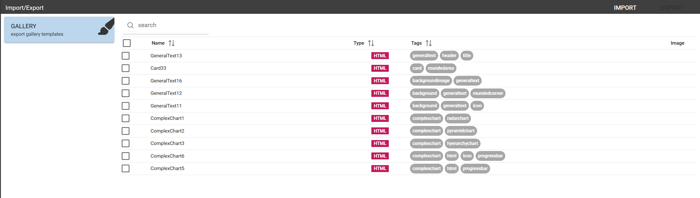
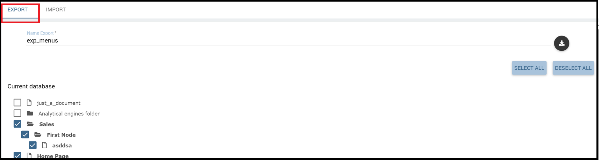
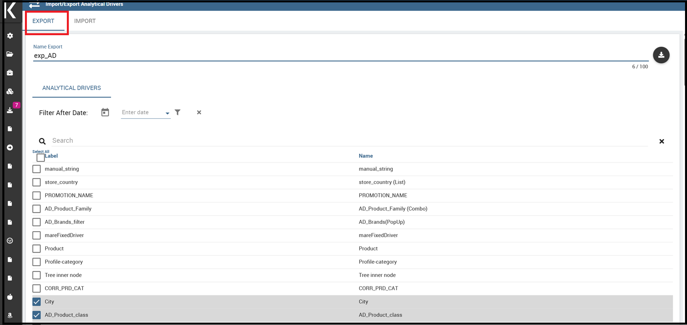

Import/Export
--------------

This functionality allows to import/export items belonging to *Gallery*, *Documents*, *Menu*, *Users*, *KPIs* and *Catalogs*.

   Import/Export menu

Artifacts
~~~~~~~~~

**Export**

It is possible to export widgets and functions to a zip file to use afterwards as a sourceto be imported to a different environment.
As shown below, select the items of your interest and click on *EXPORT*.

    
    Artifacts Export

.. figure:: media/impexp_gallery2.png
    
    Artifacts Export - Items selection

After the selection, give a name to the file and confirm with *Export* button.

.. figure:: media/impexp_gallery3.png
    
    Artifacts Export - setting name for zip file

**Import**

You can import the zip file formerly exported just clicking on *IMPORT*. See below image:

    Artifacts Import - Export file selection #1

.. figure:: media/impexp_gallery5.png

    Artifacts Import - Export file selection #2

Clicking on *NEXT*, it is possible to see and select the items to be imported..

.. figure:: media/impexp_gallery6.png

    Artifacts Import - items selection

  
Click on the *IMPORT* button to make selected widgets and functions available in the new environment.

.. figure:: media/impexp_gallery7.png

    Gallery Management Gui

.. figure:: media/impexp_gallery8.png

    Functions Management Gui

Documents
~~~~~~~~~

This feature allows to download a zip file of the whole or a part of the documents existing in your Knowage installation. 

Below, you can see how the export editor looks like.

    Document Export

Fill in the name of your export and select which documents to export. You can browse through folders by clicking on the relative icon. Check the items to include in the file.
The export icon changes colour from grey to pink. Before starting to export, you can decide whether to include or not the following options:

- **Olap customized View**
   By checking this property, the export will include all the customized views saved into the selected OLAP documents. 
   Customized views can be retrieved clicking on the option *Show OLAP custom View* of the Document Menu. See below image for more details:

    Olap customized view

- **Scheduled documents**
   By checking this property, the export will include all the scheduled executions saved into the selected documents. You can find the scheduled executions clicking on the option *Show Scheduled Execution* of the Document Menu. See the figure below:

    Scheduled documents

- **BIRT Translation**
   By checking this property, the export will include all the *translation* added into the *Localization* functionalities of BIRT templates.
- **Schedule configurations**
   By checking this property, the export will include all the scheduling associated to the selected documents. At the end of the import, the scheduling information will be saved into the Scheduler section.
- **Export the document only in the selected functionality**
   By checking this property, the export will include documents only if they are inside a selected functionality.
- **Related documents**
   By checking this property, the export will include all those documents linked through the cross navigation to the selected documents.

.. figure:: media/image68.png

    Document Import

You will be asked to map *Roles*, *Engines*, *Datasources* and *Metadata* from *Source* to *Target*.

.. figure:: media/image110.png

   Document Import Wizard

If a role does not match any of the existing ones, the role will be created. 
**Please bear in mind that all the target metadata with the same label i.e. documents, lovs, drivers will be overwritten when importing**.

.. figure:: media/image113.png

   Document Export Missing licenses

Before starting the import procedure, licenses are checked and if one or more are missing or are not valid, the user will be informed with the list of all those documents that will not be imported. See image below.

.. figure:: media/image114.png

   Document Import Missing licenses

Menu
~~~~

This feature lets you import/export the menu structure. The image below refers to the export funtionality.

    Menu Export

Fill in the name of the export file. Although the export icon changes color from grey to pink you need to select at least one item from the menu structure. 

To upload the zip file generated with the above process, in another installation, just click on **Menu** of the **Import\\Export** item, switch to the **IMPORT** tab and click on *Browse* to search the zip file.

.. figure:: media/image72.png

    Menu Import

Click on *NEXT* as shown below.

.. figure:: media/next_import_menu_8.1.png

    Menu Import

After clicking on *NEXT*, you will be asked to map roles from source to target. If a role does match map any of the existing in the target one, it will be created.

   Menu Import Wizard

In the first step of import procedure you'll see source-target comparison. In particular source tree contains menu that are in the package you are importing and target tree contains the menu already present in the target system.

.. figure:: media/image112.png

   Menu Import Wizard Tree comparison

Users
~~~~~

In this area you can export the users from an installation to another, see the following Figure.

    User Export

To generate the .zip you have to mark the user to include in the export and insert an export name. Save the export in the folders of your pc and move to the other installation. You have the chance to include the personal folder of the chosen users in the Export. Put a mark in the **Export Personal folder** checkbox and choose if you want to include snapshots and subviews too.

To import the .zip in another installation, log in and open the **Server Manager** > **Import\\Export Users**, switching to **Import** area. Here click on **Browse** to choose the .zip created by exportation. Then click on the import icon. The users contained in your file are uploaded and Catalogs displayed in the left side of the screen. Choose among the users displayed the one you want to import, mark them and click on the arrow to move them in the other side. Now click on **Start import** button and your users are successfully created in this installation too. Keep attention in marking personal folder checkbox if you want that personal folders are imported. In Figure below you can see **User Import** interface.

    User Import

.. important::

	All users involved into import procedure will have his password changed with the value set in advanced configuration.

Catalogs
~~~~~~~~

In this area you can export the different catalogs (such as datasets catalogs, business models catalogs and so on) from one installation to another, see the following Figure.

    Catalogs Export

To generate the .zip you have to mark the elements to include in the export and insert an export name. Save the export somewhere in your local system and move to the other installation. You have the chance to include the personal folder of the chosen users in the Export. Put a mark in the **Export Personal folder** checkbox and choose if you want to include snapshots and subviews too.

To import the .zip in another instance, log in and open the **Server Manager** > **Import\\ Export Catalogs**, switching to **Import** area. Here click **Browse** to choose the .zip created through exportation. Uploading the file, the available exported catalogs are displayed in the bottom area. Selecting a catalogs (for instance, the **Dataset** one), all the catalogs exported elements are displayed in the left side of the screen. Choose the ones that you want to import, decide if you want to override or to just add the missing ones and then click **Start import**. Your catalogs are successfully created in this environment. In Figure below you can see **User Import** interface.

.. figure:: media/image76.png

    Catalogs Import

KPIs
~~~~

In this section we describe how to manage the import/export of KPIs between two tenants.

The user must enter Knowage as administrator of source tenant and click on **Import/Export KPIs** from Server Manager menu panel.

    KPIs Import/Export from menu

The page contains the **Export** and the **Import** tab, where the user can select the KPIs for the export/import respectively.

.. figure:: media/image78.png

    KPIs Import window

Let’s start from the export feature. The user must check the KPIs for the export using the tab interface. He/she can add some more functionalities to the export action, namely:

- to include targets,
- to include those scorecards related to the selected KPIs,
- to include schedulations.

Finally click on the red download button to get a zipped folder that will be used to conclude the export.

    Start export button

Once the .zip file is downloaded, the user has to switch tenant (the one on which he/she wants to do the import). As admin of the destination tenant, enter the Import/Export KPIs functionality and move to the Import tab.

The user must therefore browse the personal folder to catch the zipped folder and click on the red upload button just aside, as shown in the following figure.

    Import tab

Referring to the following image, the user has to specify if:

-  to overwrite the existing KPIs and their related formulas
-  to import targets,
-  to import scorecards,
-  to import schedulations.

.. figure:: media/image83.png

    Import KPIs settings

Once the import is started, the GUI leads the user to finalize the import procedure. In particular, the user is asked to map data sources correctly (Figure below).

    Mapping data sources

The process ends successfully when the wizard shows up as following.

.. figure:: media/image85.png

    Import KPIs ended successfully

Analytical Drivers
~~~~~~~~~~~~~~~~~~~~

This option allows to import/export the analytical drivers and their related LOV.

    Import/Export of analytical drivers

As shown in Figure above, the window contains the Export and the Import tab. Use the Export tab to download the .zip file to be used in the import process.

To produce such a file, the user has to log in as administrator of the source tentant. Then he has to assign a name to the export, check the analytical drivers of interest and click on the red download button available at the top right corner of the page. Note that it is possible to slim down the research of the analytical drivers by filtering on their data of creation.

Switch tenant and log in as administrator. Use the Import tab to upload the zipped folder and finalize the import.

Use the GUI to upload the zipped folder, to specify if to overwrite on the existing analytical drivers or add missing. Then click on next and continue by mapping roles among tenants and data sources.

.. figure:: media/image87.png

    Import of analytical drivers

.. figure:: media/image88.png

    Import of analytical drivers

.. figure:: media/image89.png

    Import of analytical drivers

The process ends with a message containing the information about the import.

Glossary
~~~~~~~~

The export/import of glossary allows the user to align glossaries among tenants.

.. figure:: media/image90.png

    Export/Import of glossaries window

There are the two tabs of Export and Import. The user is asked to select the glossaries to export and to type a name that will be assigned to the zipped folder. The user can help himself/herself by using the filter on data (of creation of the glossary).

Once the user has got the zipped folder he/she must switch tenant and enter as its admin. Then select the import tab from the Export/Import main window.

.. figure:: media/image91.png

    Import of glossaries

The user must use the arrows to indicate the glossaries he/she wants to import in the target tenant. No further information are needed to end the process. Then the user has to enter the target tenant as administrator and use the import tab to finalize the import.

Catalog
~~~~~~~~

This functionality allows to Export/Import the following elements

-  Data sets,
-  Business models,
-  Mondrian catalogs,
-  Layers,
-  SVG files.

The steps to perform the Export/Import are equal to those seen in the previous sections. Namely, the user has to enter the **Import/Export catalog** menu item from Server Manager menu panel. The window will contain the Import and Export tabs. The export tab is used to produce the zip folder to be imported in the tenant of interest. Note that the user can apply a temporal filter to help him/her to look up elements in the list.

    Import of catalog

The import requires the zipped folder to be uploaded, to check the elements to import, to map roles among tenants and to map datasources.

