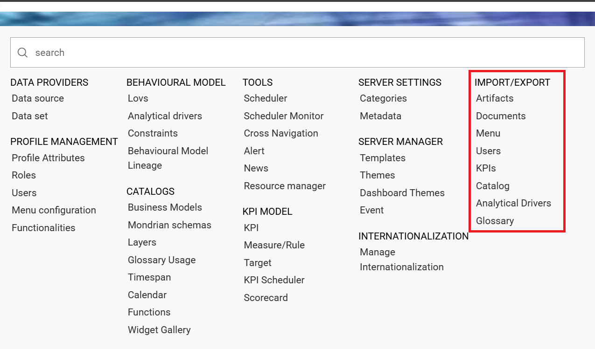
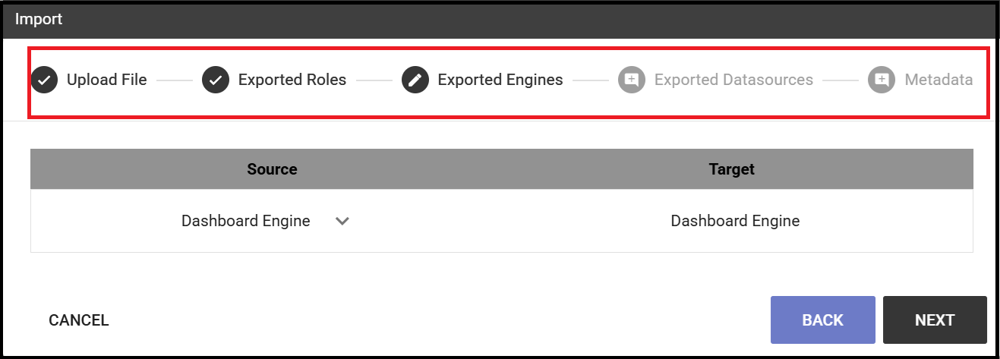

Import/Export
------------------------------------------------------------------------------------------------------------------------

This functionality allows to import/export items belonging to *Gallery*, *Documents*, *Menu*, *Users*, *KPIs* and *Catalogs*.
After exporting, the user can import the information previously extracted into a different Knowage installation or tenant.

   Import/Export menu

Artifacts
~~~~~~~~~~~~~~~~~~~~~~~~~~~~~~~~~~~~~~~~~~~~~~~~~~~~~~~~~~~~~~~~~~~~~~~~~~~~~~~~~~~~~~~~~~~~~~~~~~~~~~~~~~~~~~~~~~~~~~~~

**Export**

It is possible to export widgets and functions to a zip file to use afterwards as a *source* to be imported to a different environment.
As shown below, select the items of your interest and click on *EXPORT*.

.. figure:: media/impexp_gallery1.png
    
    Artifacts Export

    
    Artifacts Export - Items selection

After the selection, give a name to the file and confirm with *Export* button.

    
    Artifacts Export - setting name for zip file

**Import**

You can import the zip file formerly exported just clicking on *IMPORT* and then clicking the *CHOOSE* button to select the file. See below image:
You can also drag the file.

.. figure:: media/impexp_gallery4.png

    Artifacts Import - Export file selection #1

 After selecting the file to import the *NEXT* button will became available.

    Artifacts Import - Export file selection #2

Clicking on *NEXT*, it is possible to see and select the items to be imported..

    Artifacts Import - items selection

  
Click on the *IMPORT* button to make selected widgets and functions available in the new environment.

Documents
~~~~~~~~~~~~~~~~~~~~~~~~~~~~~~~~~~~~~~~~~~~~~~~~~~~~~~~~~~~~~~~~~~~~~~~~~~~~~~~~~~~~~~~~~~~~~~~~~~~~~~~~~~~~~~~~~~~~~~~~

This feature allows to download a zip file of the whole or a part of the documents existing in your Knowage installation. 

Below, you can see how the export editor looks like.

.. figure:: media/image67.png

    Document Export

Fill in the name of your export and select which documents to export. You can browse through folders by clicking on the relative icon. Check the items to include in the file.
The export icon changes colour from grey to pink. 
After clicking the *Export* button you can decide whether to include or not the following options:

- **Export the document only in the selected functionality**
   By checking this property, the export will include documents only if they are inside a selected functionality.
- **Related documents**
   By checking this property, the export will include all those documents linked through the cross navigation to the selected documents.

    Document Export options

To import documents click on the *IMPORT* link, choose or drag your file and click the *NEXT* button.

.. figure:: media/image68.png

    Document Import

You will be asked to map *Roles*, *Engines*, *Datasources* and *Metadata* from *Source* to *Target*.
After compliting all the steps to Metadata, you can start the import.

   Document Import Wizard

If a role does not match any of the existing ones, the role will be created. 
**Please bear in mind that all the target metadata with the same label i.e. documents, lovs, drivers will be overwritten when importing**.

Menu
~~~~~~~~~~~~~~~~~~~~~~~~~~~~~~~~~~~~~~~~~~~~~~~~~~~~~~~~~~~~~~~~~~~~~~~~~~~~~~~~~~~~~~~~~~~~~~~~~~~~~~~~~~~~~~~~~~~~~~~~

This feature lets you import/export the menu structure. The image below refers to the export funtionality.

.. figure:: media/image71.png

    Menu Export

Fill in the name of the file to export. Although the export icon changes color from grey to pink you need to select at least one item from the menu structure. 

To upload the zip file generated with the above process, in another installation, just click on **Menu** of the **Import\\Export** item, switch to the **IMPORT** tab and click on *Browse* to search the zip file.

.. figure:: media/image72.png

    Menu Import

Click on *NEXT* as shown below.

    Menu Import

After clicking on *NEXT*, you will be asked to map roles from *Source* to *Target*. If a role does not match map any of the existing ones in the target environment, it will be created.

.. figure:: media/image111.png

   Menu Import Wizard

You can click on *START IMPORT*.

Users
~~~~~~~~~~~~~~~~~~~~~~~~~~~~~~~~~~~~~~~~~~~~~~~~~~~~~~~~~~~~~~~~~~~~~~~~~~~~~~~~~~~~~~~~~~~~~~~~~~~~~~~~~~~~~~~~~~~~~~~~

This functionality allows to export/import users from one installation/tenant to another.See the image below.

.. figure:: media/image73.png

    Exporting Users

To generate the zip file, fill in the name of your file and select the users to include. You can also include the personal folder of the users just checking the option **Export Personal folder**.

To import your zip file, log in and select **Users**  from **Import\\Export**. Switch to the **Import** tab and click on *Browse* . Choose the file and click on the import icon. The list of users contained in your file are uploaded. Make your selection and click on the arrow to move them to the other side. 
Now click on the *Start import* button and your users will be created. See figure below.

.. figure:: media/image74.png

    Importing Users

.. important::

	All users involved in the import procedure will have the password changed with the value set in *Advanced configuration*.

Catalogs
~~~~~~~~~~~~~~~~~~~~~~~~~~~~~~~~~~~~~~~~~~~~~~~~~~~~~~~~~~~~~~~~~~~~~~~~~~~~~~~~~~~~~~~~~~~~~~~~~~~~~~~~~~~~~~~~~~~~~~~~

This functionality allows to Export/Import the following elements:

-  Datasets,
-  Business models,
-  Mondrian catalogs,
-  Layers

The details are shown in the below figure.

    Catalogs Export

To generate the zip file, mark the items to include and fill in the export name. Save the export file in your local system. 

To import a zip file, log in to the source tenant, select **Catalogs** from the *Import/Export* menu and switch to the *Import* tab. Click on *Browse* and choose the file previously created through the exportation. Uploading the file, the list of available catalogs are displayed. Choose the ones to be imported, decide if you want to override them or just add the missing ones and then click on *Start import*. Your catalogs will be created in this environment.

    Catalogs Import

KPIs
~~~~~~~~~~~~~~~~~~~~~~~~~~~~~~~~~~~~~~~~~~~~~~~~~~~~~~~~~~~~~~~~~~~~~~~~~~~~~~~~~~~~~~~~~~~~~~~~~~~~~~~~~~~~~~~~~~~~~~~~

In this section we describe how to manage the import/export of KPIs between two tenants.

The user must enter Knowage as administrator of the source tenant and click on **KPIs** from the *Import/Export* menu panel.

The page contains the *Export* and the *Import* tab, where the user can select the KPIs for the export/import respectively.

    KPIs Import window

Let’s start from the export feature. The user at first selects the KPIs to be exported and in addition can include:

- targets,
- the scorecards related to the selected KPIs,
- schedulations.

Click on the download icon to get the zip file.

Once the zip file is downloaded, the user has to switch to the tenant used for the import and as admin enter the Import/Export KPIs functionality and move to the Import tab.

The user must therefore browse the personal folder to catch the zip file and click on the red upload button, as shown below.

    Import tab

Referring to the following image, the user has to specify if:

-  overwriting the existing KPIs and their related formulas
-  importing targets,
-  importing scorecards,
-  importing schedulations.

    Import KPIs settings

Once the import is started, the GUI leads the user to finalize the import procedure. In particular, the user is asked to map data sources correctly. See figure below.

.. figure:: media/image84.png

    Mapping data sources

The process ends successfully when the wizard shows up as following.

    Import KPIs ended successfully

Analytical Drivers
~~~~~~~~~~~~~~~~~~~~~~~~~~~~~~~~~~~~~~~~~~~~~~~~~~~~~~~~~~~~~~~~~~~~~~~~~~~~~~~~~~~~~~~~~~~~~~~~~~~~~~~~~~~~~~~~~~~~~~~~

This option allows to import/export the analytical drivers and their related LOVs.

.. figure:: media/image86.png

    Import/Export of analytical drivers

As shown in figure above, the window contains the Export and the Import tab. Use the Export tab to download the zip file to be used in the import process.

Afterwards:

- log in as administrator to the source tentant,
- assign a name to the export, 
- check the analytical drivers of interest and 
- click on the red download button, available at the top right corner of the page to get the zip file. 

It is possible to narrow the search of the analytical drivers by filtering on their creation date.

Switch to the target tenant and log in as administrator. Use the Import tab to upload the zipped folder and finalize the import.

Use the GUI to upload the zip file and specify if overwriting the existing analytical drivers or just adding the missing ones. Then click on *NEXT* and continue by mapping roles between the source and the target tenants.

    Import of analytical drivers

    Import of analytical drivers

    Import of analytical drivers

The process ends with a message containing the information about the import.

Glossary
~~~~~~~~~~~~~~~~~~~~~~~~~~~~~~~~~~~~~~~~~~~~~~~~~~~~~~~~~~~~~~~~~~~~~~~~~~~~~~~~~~~~~~~~~~~~~~~~~~~~~~~~~~~~~~~~~~~~~~~~

The export/import of glossary allows the user to align glossaries among tenants.

    Export/Import of glossaries window

In the *Export* tab, the user is asked to select the glossaries to export and type a name that will be assigned to the zip file. The searching functionality can be used for the selection.

Afterwards, connecting as admin to a target tenant, the user selects the *Import* tab from the Export/Import main window.

    Import of glossaries

Arrows are used to indicate the glossaries to consider for the import.