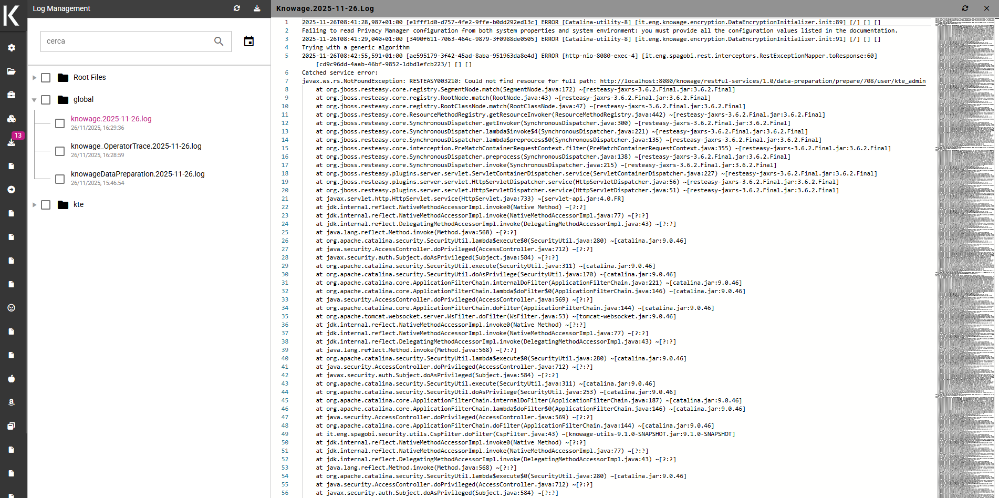
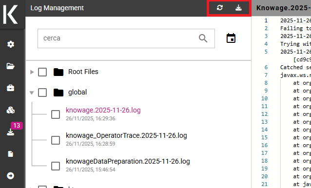
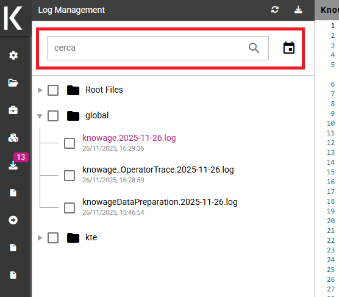
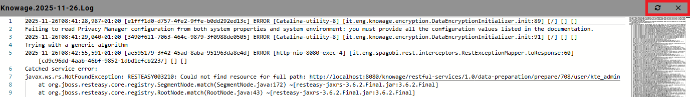
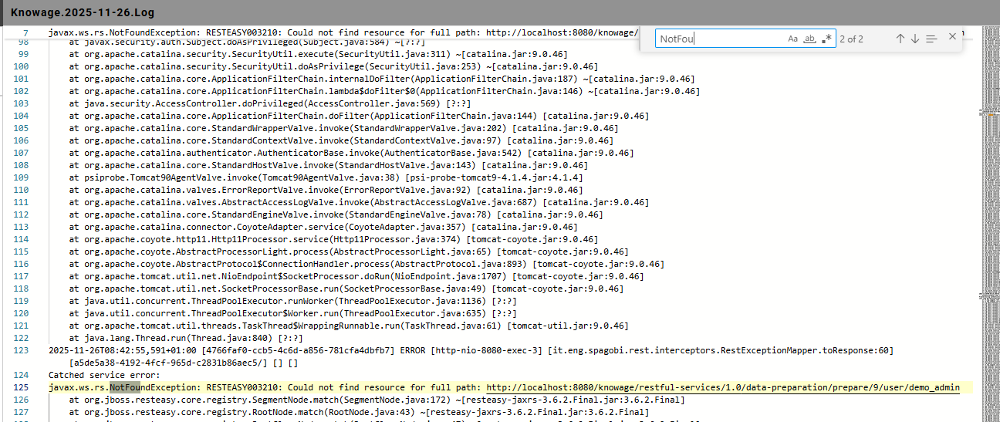
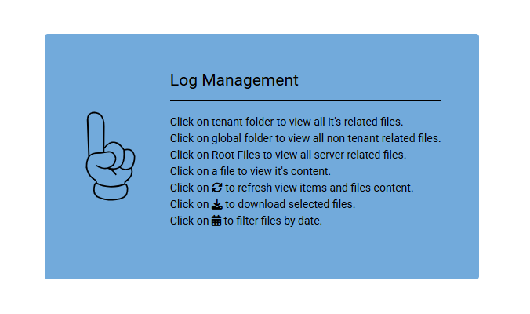

Log Manager
========================================================================================================================

The **Log Manager** functionality is available under the **Tools** section of the Knowage main menu, allows the management of all log files of the Knowage installation.

Log Manager functionalities
------------------------------------------------------------------------------------------------------------------------

The Log Manager window is subdivided in two sections, on the left the tree structure representing existing logs system and on the right the content of the selected file.

**Tree functionalities**

The tree shows all log files of the service grouped in separate folders. On the top bar are present two funcionalities, **Refresh tree** and **Download files**.

Pay attention that to download files, users must select them by clicking on the box placed at log file's left. All the files grouped inside a folder can be selected by selecting that folder.

Users can apply filters to all log files showing only those that meet the requirements. Using **Search** files are filtered by name and by interacting with the **Date icon** users can select dates and filter files based on them.

Pay attention that by default date filter selects only the current date, in the date menu **Reset** button resets to default date filter. To select / deselect a specific date click on it.

**File content panel**

When a file is selected, the right panel shows all it's content. On the top right are present two functionalities, **Refresh file content** and **Close file**.

Pay attention that when another file is selected, previously opened file is closed automatically.

With **Ctrl + f** shortcut, users can search specified words inside file's content.

When no file is selected, the right panel diplays a tooltip containing all the essential informations about this log management service.

