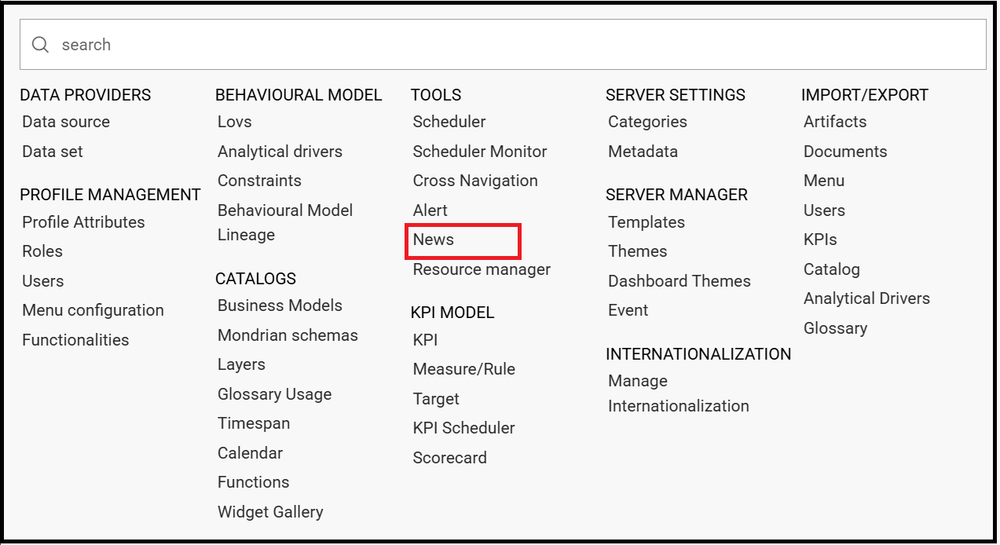
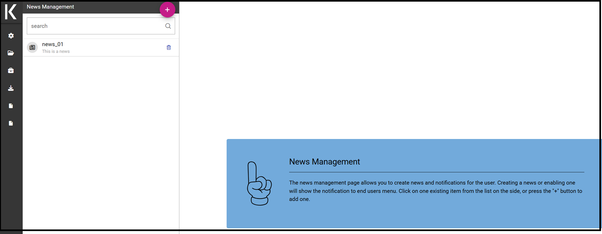
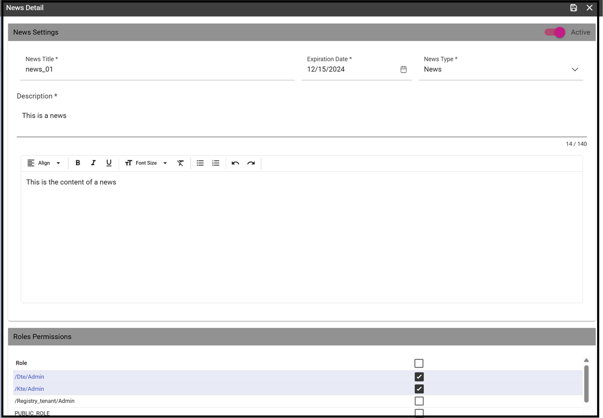
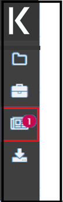

News
########################################################################################################################

The **News management** is a helpful functionality to keep the end user constantly informed on any changements or updates on the Knowage platform. In this section we will describe the main steps to insert a news.

How to publish news
------------------------------------------------------------------------------------------------------------------------

To add a news is mandatory to have administration priviledges. An admin user can insert news entering the **News Management** functionality from the Knowage main menu.

    News Management list item.
    
A new page opens where the left side contains the list of all the already inserted news whereas the right side shows the details of the selected news from the list. 

   Access news management list.
    
To add a news, just click the *plus* icon. Below, the information requested for the addition of a news.

-  **Title**
-  **Expiration Date**, after this date the news will no longer be visible to the user
-  **Type**, three possible values between *News*, *Notification* and *Warning*
-  **Content**
-  **Activation**
-  **Roles Permissions**
    

    Access news management list.
    

How reading news
------------------------------------------------------------------------------------------------------------------------

When some news are added, the **news** icon prompts the number of unread news.

    News notification.

Clicking the icon, the user displays the content of the news.

    News notification pop up.

