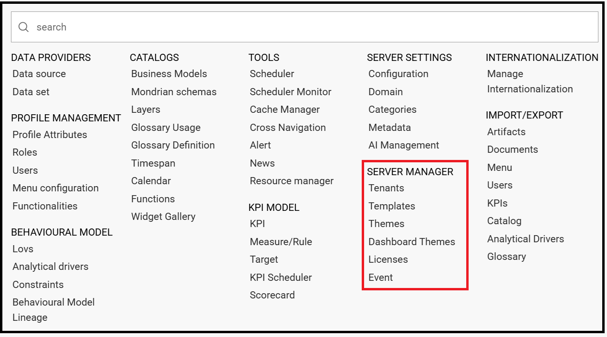
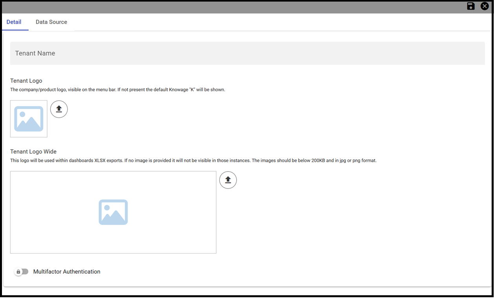
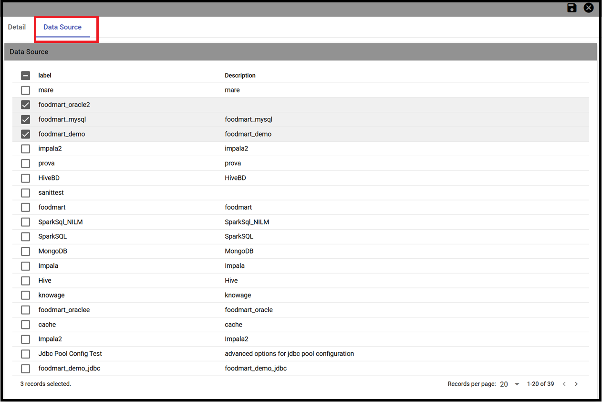
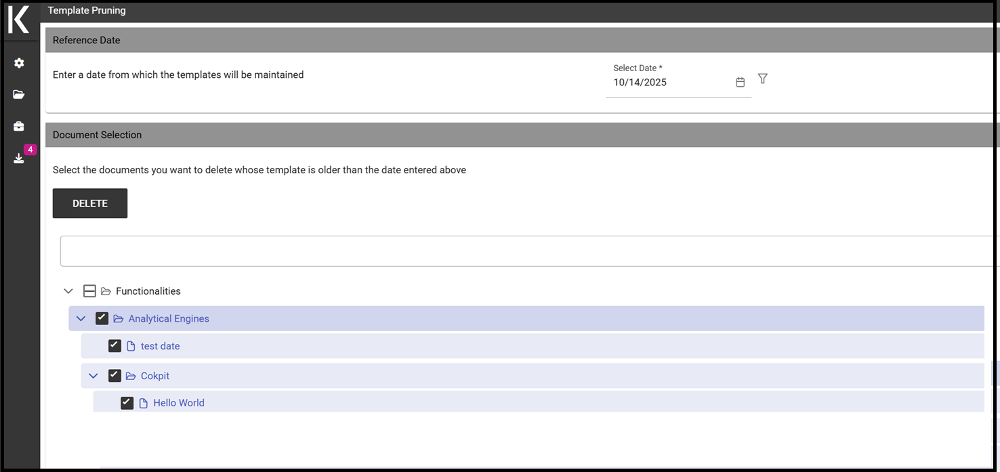
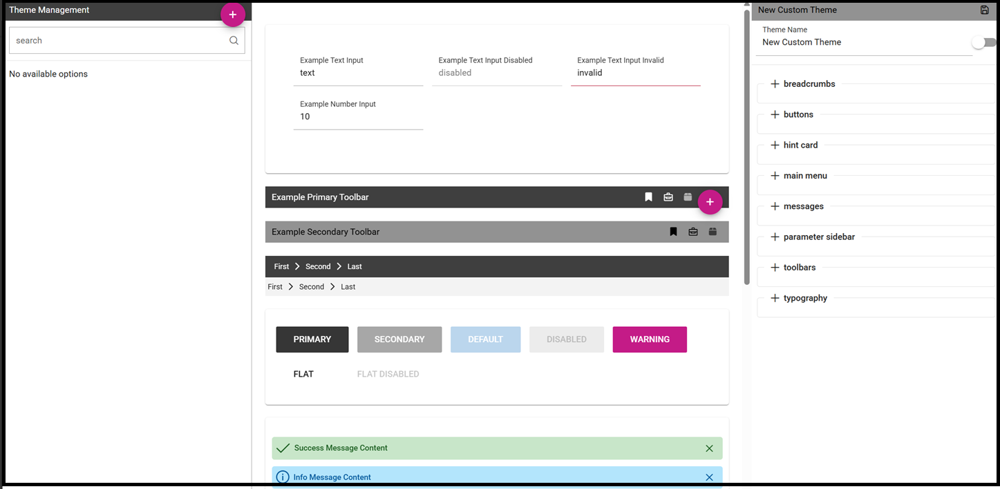

Server manager
########################################################################################################################

.. important::
         **Enterprise Edition only**

         Server Manager functionalities are only available with Knowage Enterprise Edition

All the management functionalities can be found under **Server Manager** of the Knowage main menu.

    Server Manager Functionalities

Tenants
------------------------------------------------------------------------------------------------------------------------

This feature allows you to create or manage tenants.
A single Knowage instance can have one or more tenants. In case of a multi-tenant environment, each tenant owns and manages its own users, documents, configuration and parameters, which are completely independent from those owned by other tenants.
The *Tenants* functionality is only available for the Knowage Enterprise Reporting (ER) license and users must have the superadmin role. 

    Tenants Management window.

The left side of the image above, presents the list of existing tenants with the availability of a **Search** box, to help users to browse throug the existing tenants. The *Plus* icon can be used to create a new tenant.

    Product types tab and Datasources tabs.

In a *single-tenant* environment the *admin* role matches with the *superadmin*. In a *multi-tenants* environment only *one* user has the *superadmin* role for each tenant, while there can be more than one user with the *admin* role. 
Furthermore, the superadmin is the only one who can set up JNDI datasources and access the cache configuration.

Templates
------------------------------------------------------------------------------------------------------------------------

Each Knowage document is associated to a *template*. The template defines the standard layout of a document, including specific information on its appearance and the way contents should be displayed. Templates can be encoded by hand or using Knowage Studio designers, when available. For each analytical document the history of templates is maintained. Old templates can be restored if needed. A new version is saved at each deployment, either manual or from Knowage Studio.

The **Templates** functionality allows the deletion of all those templates that have been created before a specific date. This kind of operation allows the administrator to clean the environment and save some space in the Knowage metadata database once a *document life cycle* is completed.

After inserting a date by clicking on the *calendar* icon, click on the *funnel* icon and select the documents of your interest. The *Delete* button deletes the templates (of the selected documents), uploaded before the specified date. If all the templates of a document come first of the specified date, the last template uploaded will be kept, so that no document is accidentally deleted. 
See figure below.

    Deleting templates

Themes
------------------------------------------------------------------------------------------------------------------------
This functionality allows the creation/management of themes to be used in the css style of your documents.

    Themes

Download installation configuration
------------------------------------------------------------------------------------------------------------------------
This feature allows the downloading of a *config.zip* file containing the details of the installation configuration.

Licenses
------------------------------------------------------------------------------------------------------------------------
This feature allows the management of Knowage licenses by adding, updating, downloading or removing a license.

    Events

Events
------------------------------------------------------------------------------------------------------------------------
This feature allows to search through all the events (i.e. the scheduling of a report) existing on the Knowage server, specifying a range of dates and the *type* of event.
Types of events are:

- Scheduler
- ETL
- CommonJ
- Data_Mining

See below image.

    Events