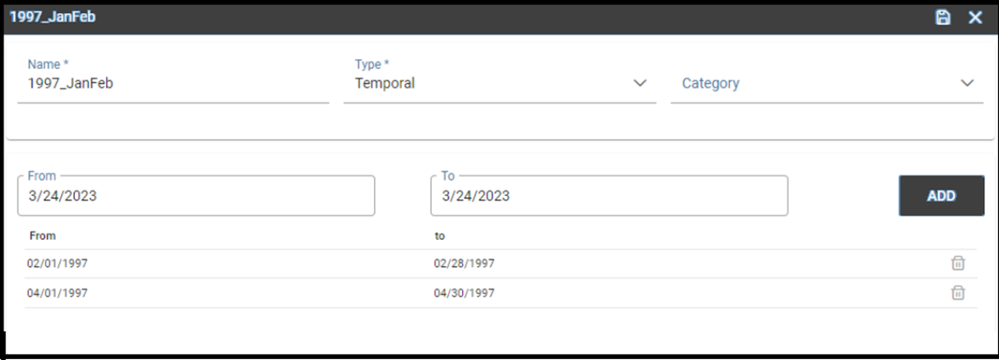

Time Span
########################################################################################################################

Most of times a technical user develops a business solution for the use and consumption of a third not-skilled end user. In the contest of self-service capability of Knowage, when business models are available to allow end users to query data, it is possible to arrange time or temporal intervals so that end users can use these time periods to filter data when working with the QbE interface.

Create a new Timespan
------------------------------------------------------------------------------------------------------------------------

The Timespan functionality is available under the *CATALOGS* section of the Knowage main menu. 

   Timespan

When clicking on **Timespan**, the user sees the list of already defined periods, if any. 
Possible actions are opening, searching, deleting or cloning a specific timespan. 
The delete and clone icons are available next to the timespan item name.

   Timespan list page
   
To add a new timespan item just click the *plus* icon on the top right corner of the item list. 
The technical user is asked to assign a *Name* and to specify the *Type*, whether it is a *Time* or a *Temporal* period. 

*Time*: need of a starting time and an endining time
*Temporal*: need of a starting date and an ending date 

In case of Time, the start and the end time should be entered otherwise the start and the end date should be entered.
There is also the possibility to associate a *Category* for profiling issues. See the below figure, as an example.

   Time and temporal type
 
Whatever type is chosen, the technical user defines the start and the end of the interval and has to use the *Save* icon to insert it. Note that it is possible, for each type, to add more than one interval.  

   Adding more than one temporal intervals in one timespan
 
Once that the intervals have been defined they can be used inside the QbE interface to filter time or temportal attributes. For this part, please refer to the *Free Inquiry* chapter, in particular when dealing with Filters.
   

