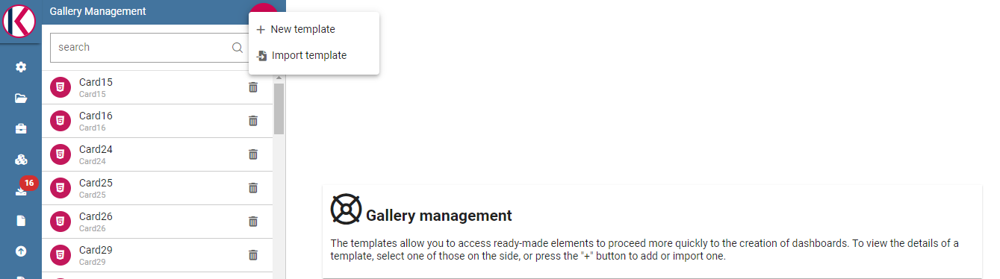
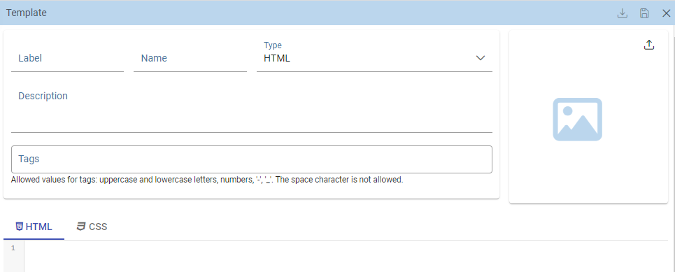
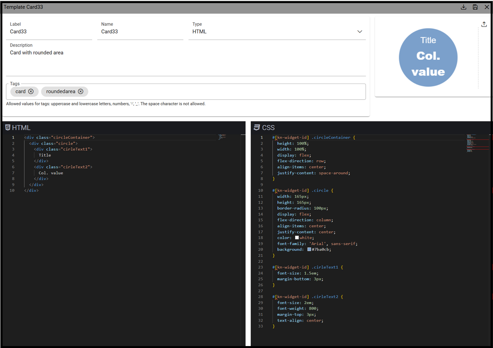
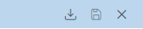
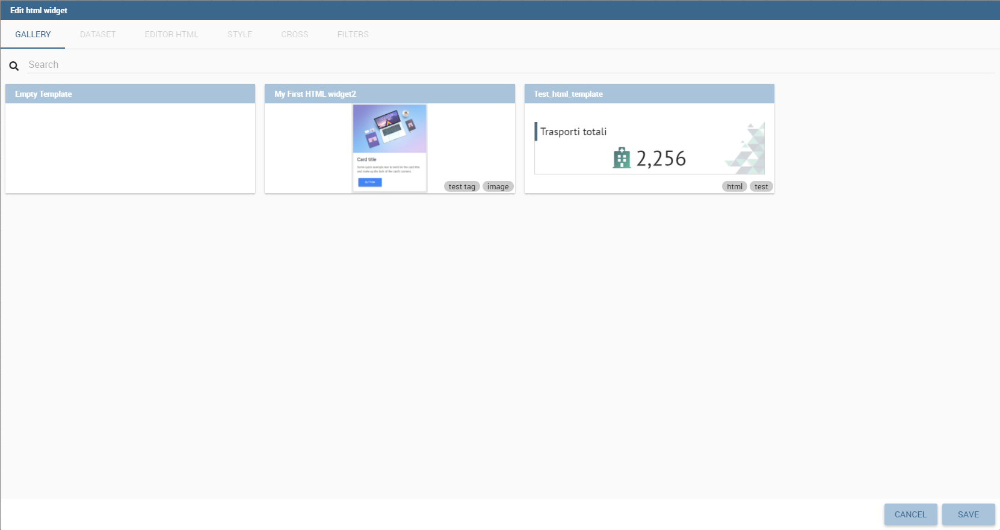
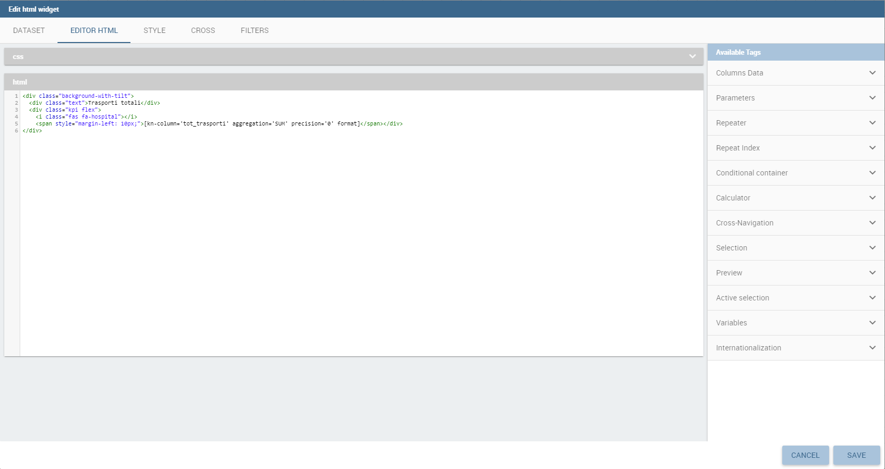

Widget gallery
###############

The **Widget Gallery** is a feature available since version 8.0 that allows users and editors to create a template and 
share it in multiple dashboards. By creating a template and then using it within a dashboard, users will have the ability 
to create complex dashboard elements quite easily and quickly while maintaining a common basic template.

This functionality is available for the following types of widgets:

-   HTML
-   Custom Chart
-   Python

Gallery management
-------------------

To open the *Gallery Management*, select **Gallery Management** from the *CATALOGS* option of the Knowage main menu.
The first step consists in creating a new template or in importing a template already available.

    Gallery management example.

The image below, shows the information to be filled in when adding a new template.

    Widget - new template.

Using import you will see a dialog to choose the template to be imported. Clicking "import" it will be added to the current list.

A **Template** is a json file containing a collection of properties describing the widget and the code that will compose it.

The following fields will be present:

-   **Name**: Mandatory information, representing the name of the widget template
-   **Type**: Mandatory information, specifying the widget type. As shown in the above image, there are three available types
-   **Output type**: only for Python widgets: HTML or Image values available.
-   **Description**: Optional information that will be visible as a tooltip on the dashboard selection.
-   **Tags**: Optional information, consisting in a list of unique tags to easily categorize templates. Search functionality using tags too. Allowed values for tags are uppercase and lowercase letters, numbers, '-', '_' whereas the space character is not allowed.
-   **Image**: Optional information, representing the image of the widget that will be shown on the dashboard selection. The maximum image size is 200k.
-   **Code section**: Mandatory information, representing the code to be written in the editor box.

Editors will look like different, depending on the type of widget:
- **HTML **: HTML, CSS editors
- **Chart**: HTML, CSS and JS editor
- **Python**: Python code editor

    Selected widget template.

Use the *Save* icon to save the template.
It's also possible to export a single template-

    Toolbar icons.

Dashboard gallery
---------------------------

Inside a cockpit or the dashboard functionality, a new tab will be present when creating a new widget.

    New widget templates list.

This tab will not be available when no template is defined and if the widget is opened after its first saving.

The first template will always be empty, in order to allow users to create a custom widget without starting from a template.
After the empty template, some other templates will be available showing the associate image, the tags formerly set and when hovering, the description of the template.

Clicking on an item, the code set in the gallery management will be copied in the new widget template, to allow the customization of the widget.
The user just needs to link the dynamic data or change some css code to create the desired widget.

    Selected template editor.
