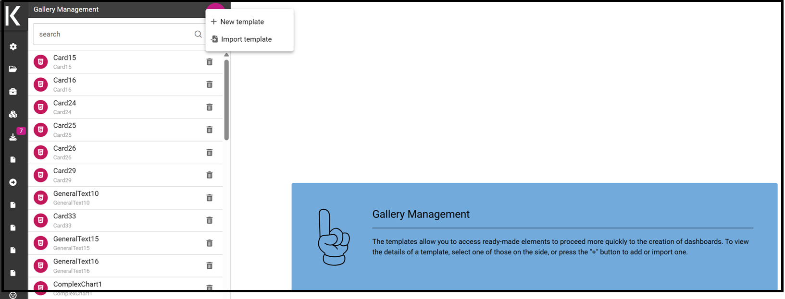
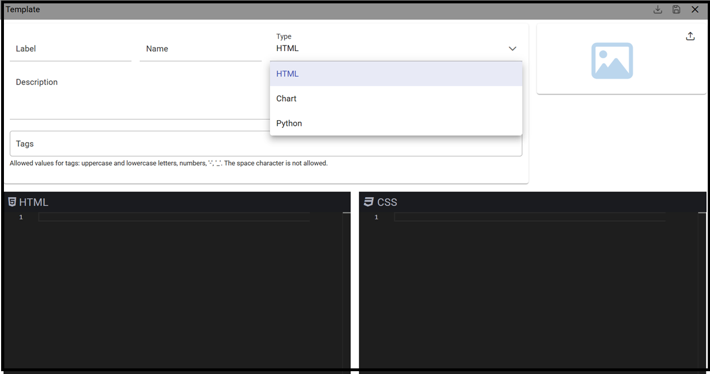

Widget gallery
###############

The **Widget Gallery** is a feature available since version 8.0 that allows users and editors to create a template and 
share it in multiple dashboards. By creating a template and then using it within a dashboard, users will have the ability 
to create complex dashboard elements quite easily and quickly while maintaining a common basic template.

This functionality is available for the following types of widgets:

-   HTML
-   Custom Chart
-   Python

Gallery management
-------------------

To open the *Gallery Management*, select **Gallery Management** from the *CATALOGS* option of the Knowage main menu.
The first step consists in creating a template gallery or in importing a template already available.

    Gallery management example.

The image below, shows the information to be filled in when adding a new template

    Widget - new template.

Using import you will see a dialog to choose the template to be imported. Clicking "import" it will be added to the current list.

A **Template** is a json file containing a collection of properties describing the widget and the code that will compose it.

The following fields will be present:

-   **Name**: Mandatory. The name of the widget template
-   **Type**: Mandatory. The widget type.
-   **Output type**: Available for the python widget only. Will set the output type of the python code.
-   **Description**: Optional. The description of the widget template, will be visible as a tooltip on the dashboard selection.
-   **Tags**: Optional. A list of unique tags to easily categorize templates. It's possible to search using tags too. Allowed values for tags are uppercase and lowercase letters, numbers, '-', '_'. The space character is not allowed.
-   **Image**: Optional. The image of the widget that will be shown on the dashboard selection. Maximum image size is 200k.
-   **Code section**: Mandatory. The code editor.

Depending on the type of widget selected the availabe editors will change in this way:

- **HTML widget**: HTML, CSS editors
- **Custom chart widget**: HTML, CSS and JS editor
- **Python widget**: Python code editor

.. figure:: media/image1.png

    Selected widget template.

To save the template it's possible to click on the top right toolbar on the *save* button. If save button is disabled one or more mandatory fields are empty or invalid.
It's also possible to export the single template selected or simply to close the page and choose another one.

.. figure:: media/image3.png

    Toolbar icons.

Dashboard gallery
---------------------------

Inside the cockpit or dashboard functionality, a new tab will be present when creating a new widget of the available types.

    New widget templates list.

This tab will not be available when no template is defined and if the widget is opened after it's first saving.

The first template will always be the "empty" one, in order to allow users to create a custom widget without starting from a template.
The other templates will be available after the empty one and will show the image, the tags set by the editor and, when hovering, the description of the template.

Clicking on an item, the code set in the gallery management will be copied in the new widget template, preparing the widget for ultimate customizations.
The user will just need to link dynamic data or change specific css section to create the desired widget.

.. figure:: media/image5.png

    Selected template editor.
