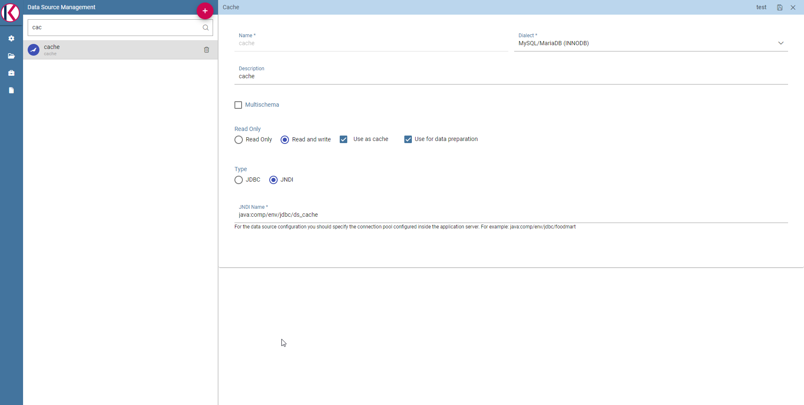

Manual installation
#############

Metadata database initialization
--------------------------------------

Knowage requires a database schema to store its own metadata (definition of analyses, datasets and so on). For initializing such a schema, the user must execute the creation scripts provided for the DBMS in use. The package which includes the DDL will contain the following SQL files:

.. code-block:: bash
   :caption: Scripts for metadata schema

        XXX_create.sql
        XXX_create_quartz_schema.sql

where XXX represents the DBMS type (as instance ORA stands for Oracle). The corresponding SQL files for deleting tables are also provided.

.. include:: ka_inst_man_tomcat.rst

Datasource link within the applications
---------------------------------------------------------
You would set up ResourceLink for JNDI datasource. To do so, you have to configure each ``knowage*/META-INF/context.xml`` and set the ResourceLink for each JNDI data source previously created. Inside the released packages two links are already defined:

- one for the ``jdbc/knowage`` resource, which the user must keep
- the other for the ``jdbc/foodmart``, which should be renamed with ``jdbc/dwh``.

.. code-block:: xml
   :linenos:

    <Context docBase="knowage-ee" path="/knowage" reloadable="true">
        <ResourceLink global="jdbc/dwh" name="jdbc/dwh" type="javax.sql.DataSource"/>
        <ResourceLink global="jdbc/knowage" name="jdbc/knowage" type="javax.sql.DataSource"/>
        <ResourceLink global="jdbc/ds_cache" name="jdbc/ds_cache" type="javax.sql.DataSource"/>
        <ResourceLink global="resource_path" name="resource_path" type="java.lang.String" />
        <ResourceLink global="sso_class" name="sso_class" type="java.lang.String" />
        <ResourceLink name="hmacKey" global="hmacKey" type="java.lang.String"/>
        <ResourceLink global="service_url" name="service_url" type="java.lang.String"/>
        <ResourceLink global="wm/SpagoWorkManager" name="wm/SpagoWorkManager" type="commonj.work.WorkManager" />
        <ResourceLink global="password_encryption_secret" name="password_encryption_secret" type="java.lang.String"/>
    </Context>

Due to security reasons, configuration file containing some content to be used for encrypting must be created in Knowage environment. File must not be empty, but there's no minimum length. File can be put everywhere; path and name must be properly configured for each ``knowage*/META-INF/context.xml`` as shown below.

.. important::
         **Context update**

         The modification of these files will be effective as soon as the web application is reloaded or the application server is restarted.

Configuration of the metadata db dialect
----------------------------------------

.. important::
         **This step is not mandatory anymore**

         Knowage is now able to autonomously determine following configuration. That said, the following is not mandatory anymore however a user can force it to specific value.

Verify that the right dialect has been set inside ``hibernate.cfg.xml`` files. We list all the possible dialects that can be used:

.. code-block:: xml
   :linenos:

 	<property name="hibernate.dialect">org.hibernate.dialect.MySQLDialect</property>,
 	<property name="hibernate.dialect">org.hibernate.dialect.PostgreSQLDialect</property>
 	<property name="hibernate.dialect">org.hibernate.dialect.Oracle9Dialect</property>

You have to configure these following Hibernate configuration files and set the chosen dialect:

.. code-block:: xml
   :linenos:

	knowagekpiengine/WEB-INF/classes/hibernate.cfg.xml
	knowagegeoreportengine/WEB-INF/classes/hibernate.cfg.xml
	knowage/WEB-INF/classes/hsql/hibernate.cfg.xml
	knowage/WEB-INF/classes/hibernate.cfg.xml
	knowagesvgviewerengine/WEB-INF/classes/hibernate.cfg.xml
	knowagemeta/WEB-INF/classes/hibernate.cfg.xml
	knowagecockpitengine/WEB-INF/classes/hibernate.cfg.xml
	knowagedataminingengine/WEB-INF/classes/hibernate.cfg.xml

.. important::
         **Context update**

         The modification of these files will be effective as soon as the web application is reloaded or the application server is restarted.

Modification of the Quartz configuration
----------------------------------------

.. important::
         **This step is not mandatory anymore**

         Knowage is now able to autonomously determine following configuration. That said, the following is not mandatory anymore however a user can force it to specific value.

The scheduler is configured in ``knowage/WEB-INF/classes/quartz.properties``. It is essential to enhance in this file the property ``org.quartz.jobStore.driverDelegateClass`` with the right value, according to the metadata database in use. Following the possible values:

.. code-block:: xml
   :linenos:

	 # Hsqldb delegate class
	 #org.quartz.jobStore.driverDelegateClass=org.quartz.impl.jdbcjobstore.HSQLDBDelegate
	 # Mysql delegate class org.quartz.jobStore.driverDelegateClass=org.quartz.impl.jdbcjobstore.StdJDBCDelegate
	 # Postgres delegate class
	 #org.quartz.jobStore.driverDelegateClass=org.quartz.impl.jdbcjobstore.PostgreSQLDelegate
	 # Oracle delegate class
	 #org.quartz.jobStore.driverDelegateClass=org.quartz.impl.jdbcjobstore.oracle.OracleDelegate

Clustering
~~~~~~~~~~~~~

When Knowage is installed in cluster with several nodes, it is necessary to activate the Cluster modality, adding these parameters to the ``knowage/WEB-INF/classes/quartz.properties`` file of every involved machines:

.. code-block:: xml
   :linenos:

	 org.quartz.jobStore.isClustered = true
	 org.quartz.jobStore.clusterCheckinInterval = 20000
	 org.quartz.scheduler.instanceId = AUTO
	 org.quartz.scheduler.instanceName = RHECMClusteredSchedule

Logging
---------

It is necessary to set up a folder where Knowage and its analytical engines can store their respective log files. From now on, we will call ``LOG_DIR`` such folder and ``LOG_DIR_PATH`` the path that leads to it. This path is configured in file ``log4j.properties`` located inside the ``\WEB-INF\classes\`` available in each web application.
Shortly, to configure the Knowage log folder the user must execute the following steps:

- create the ``LOG_DIR`` folder on all cluster nodes on which it is intended to deploy Knowage Server and/or one of its analytical engines. The ``LOG_DIR_PATH`` string must be the same for every node;

- **[LINUX]** verify that Knowage has write permissions on this folder; set the property ``log4j.appender.knowage.File`` inside the ``WEB-INF/classes/log4j.properties`` to ``LOG_DIR_PATH/knowage.log``;

- set the property ``log4j.appender.knowageXXXXXEngine.File`` inside the ``WEB-INF/classes/log4j.properties`` file of each engine to ``LOG_DIR_PATH/knwoageXXXXXEngine.log``;
- only for the Birt Engine, to set the property ``logDirectory`` inside the ``WEB-INF/classes/BirtLogConfig.properties`` file of the knowagebirtreportengine application to ``LOG_DIR_PATH``.

Enable Java Security Manager
-----------------------------

In Knowage, a user can create datasets, LOVs, etc.. with script languages like JavaScript. That introduces a security concern where a malicious user can execute code that can break the entire system. Java allows a system administrator to enable a `Security Manager <https://docs.oracle.com/javase/tutorial/essential/environment/security.html>`_ and to create a sandbox to limit privileges around the code that execute the script.

The Security Manager can be enabled with the following steps:

- Write a Security Policy for the Security Manager;

- Enable the Security Manager in the JVM.

The Security Policy is a text file read by a Security Manager that specifies all the privileges that a JVM can give to Java code: Tomcat has already a default policy in the file ``TOMCAT_HOME/conf/catalina.policy`` but is too much strict for Knowage code that needs to write multiple logs, make network connection and execute external applications. Knowage is already secured and can use a more relaxed policy like:

.. code-block:: xml
        :caption: Complete path of the script

        grant {
                permission java.security.AllPermission;
        };

This policy can be saved to ``TOMCAT_HOME/conf/knowage-default.policy``.

To enable the Security Manager a system administrator have to add some options to the Java JVM:

**[LINUX]** Insert at the end of the ``TOMCAT_HOME/bin/setenv.sh`` file this command:

.. code-block:: bash
	:linenos:

	export JAVA_OPTS="$JAVA_OPTS -Djava.security.manager -Djava.security.policy=$CATALINA_HOME/conf/knowage-default.policy"

**[WIN]** Insert at the end of the ``TOMCAT_HOME/bin/setenv.bat`` file this command:

.. code-block:: bash
	:linenos:

	set JAVA_OPTS= %JAVA_OPTS% -Djava.security.manager -Djava.security.policy=%CATALINA_HOME%\conf\knowage-default.policy

Installation of Chromium Cockpit Export script
-----------------------------------------------
.. important::
         **Enterprise Edition only**

         Chromium Cockpit Export script is only available for Enterprise Edition.

Extract archive ``knowage-cockpit-export-installation.zip`` to ``/opt/knowage``:

.. code-block:: bash
        :caption: Complete path of the script

        /opt/knowage/cockpit-export/cockpit-export.js

For alternatives path you have to fix ``internal.nodejs.chromium.export.path`` in Knowage Configuration Management.

Configuring environment for Data Preparation
--------------------------------------------

User should have Apache Livy and Apache Spark installed.

Please refer to https://livy.apache.org/ for more details:

To run the Livy server, you will also need an Apache Spark installation.
You can get Spark releases at https://spark.apache.org/downloads.html.
Livy requires at least Spark 1.6 and supports both Scala 2.10 and 2.11 builds of Spark. To run Livy with local sessions, first export these variables:

export SPARK_HOME=/usr/lib/spark

export HADOOP_CONF_DIR=/etc/hadoop/conf

Then start the server with:

./bin/livy-server start

Livy uses the Spark configuration under SPARK_HOME by default. You can override the Spark configuration by setting the SPARK_CONF_DIR environment variable before starting Livy.

Please check Livy and Spark official documentation for more info.

After that it is mandatory to set this variable on Tomcat Server: **KNOWAGE_RESOURCE_PATH**
This variable should point to the Tomcat server's resource folder.

Example for Tomcat development installation:

.. figure:: media/image36.png

    Example for Eclipse Tomcat embedded installation.

You will also need to configure a datasource as "Used for data preparation", it means that the selected datasource will be used for saving prepared dataset data.

Selecting a **DATA PREPARATION DATASOURCE**:

It is really important to set a datasource for the prepared dataset ingestion output.
This one will be the location of the result prepared data.
You can do that checking the "Use for data preparation" checkbox using an administration role for Knowage.

    Datasource management section.
