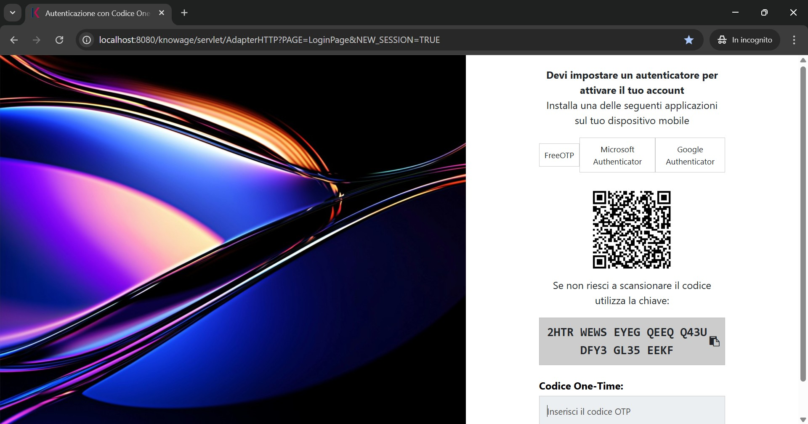
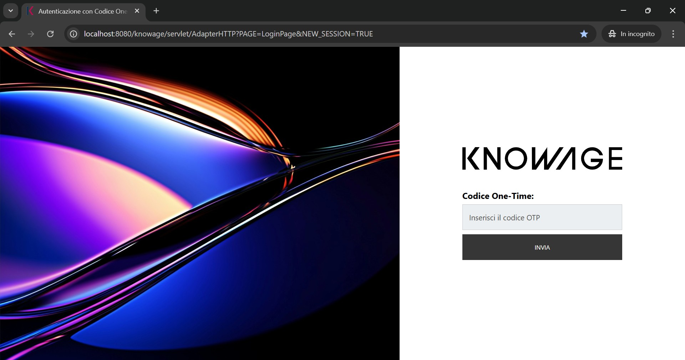

Multi Factor Authentication
########################################################################################################################

After logging in, the MFA configuration screen will appear (Figure 1). This step is necessary to increase account security.

   Figure 1

To use MFA, you need to install an authentication app on your smartphone that generates temporary codes (OTP). You can choose one of the following free applications:

* FreeOTP
* Microsoft Authenticator
* Google Authenticator

After opening the store on your device, search for the chosen app name and proceed with the installation.

Once the app is installed:

* Open it and select the Add account option.
* Choose Scan QR code.
* Point your smartphone camera at the QR code displayed on the screen (Figure 1).

If you cannot scan the QR code (for example, if the camera is unavailable), use the setup key shown below the QR code. In the app, select the option to enter the key manually and copy the code exactly as it appears.

After linking the app, it will start generating temporary codes (OTP). Enter the code displayed in the “One-Time Code” field and confirm. The code changes every 30 seconds, so make sure to enter it quickly.

For future logins, you will not need to repeat the initial configuration. A simplified screen will appear (Figure 2) with a single field for the One-Time Code.

   Figure 2

To complete the login:

* Open the previously installed and configured authentication app.
* Find the OTP code generated for the Knowage account.
* Enter the code in the indicated field and press SEND.

   