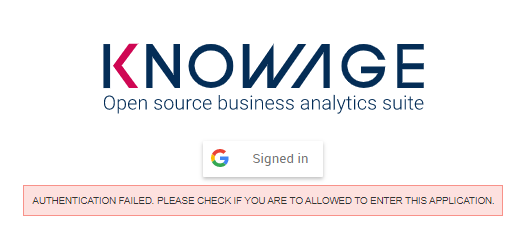

Google SSO
###########

Knowage provides integration with Google Sign-In for authentication purposes, i.e. users can login into Knowage using their Google accounts.

**Remark.** Google Sign-In is exploited only for authentication, not for authorization. The authorization part (that consists of defining roles and profile attributes for users) is still in charge of Knowage: this means that, before an user can enter into Knowage with his Google account, the admin user has to define that user inside the regular Knowage users catalogue, keeping in mind that the user id must match the email of his Google account (the provided password will not be considered when user will log in). In case the user is not defined inside Knowage users list, the authentication will fail.

In order to enable Google Sign-In authentication, please follow these steps:

* start Knowage with default configuration;
* enter Knowage as admin and define users who will be allowed to enter Knowage (use their email address as user id);
* browse to **Configuration management** via the main menu;
* set the value of configuration parameter **SPAGOBI.SECURITY.USER-PROFILE-FACTORY-CLASS.className** to ``it.eng.spagobi.security.GoogleSecurityServiceSupplier``, then save;
* stop Knowage application;
* follow Google Sign-In documentation in order to configure your Knowage application and to get the OAuth client ID;
* create a text file wherever you want and paste the client ID inside it, for example: create file TOMCAT_HOME/conf/google.signin.config.properties with this content:

.. code-block:: properties
    :linenos:

    client_id=<your client ID>.apps.googleusercontent.com

* add the ``google.signin.config`` Java System property that specifies the location of this properties file: in a Unix-like environment, edit TOMCAT_HOME/bin/setenv.sh and add

.. code-block:: bash
    :linenos:

    export JAVA_OPTS="${JAVA_OPTS} -Dgoogle.signin.config=<your Tomcat home folder>/conf/google.signin.config.properties"

instead, in a Windows environment using Apache Tomcat, edit TOMCAT_HOME/bin/setenv.bat:

.. code-block:: bash
    :linenos:

    set JAVA_OPTS="%JAVA_OPTS% -Dgoogle.signin.config=<your Tomcat home folder>/conf/google.signin.config.properties"

* start Knowage application.

When users will connect into Knowage, the login page will display the Google Sing-In button:

   Advanced configuration - Google Sing-In button.

When clicking on that button, Google Sing-In authentication applies; if successful, users will be redirected into their home page inside Knowage.
In case the account is not recognized by Knowage (i.e. the provided email address does not match any existing Knowage user id), he will get an error message:

   Advanced configuration - Authentication error.