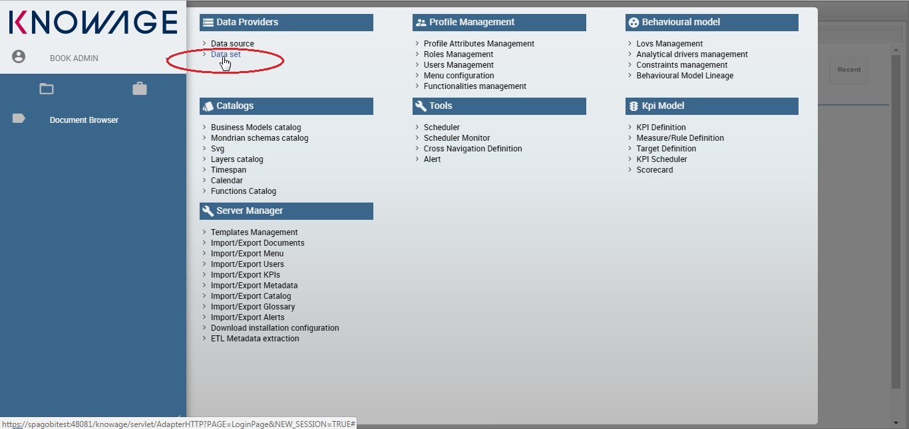
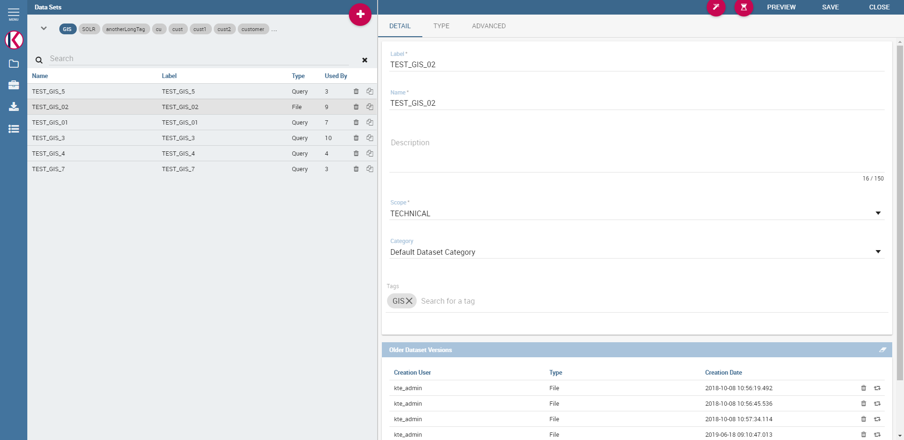
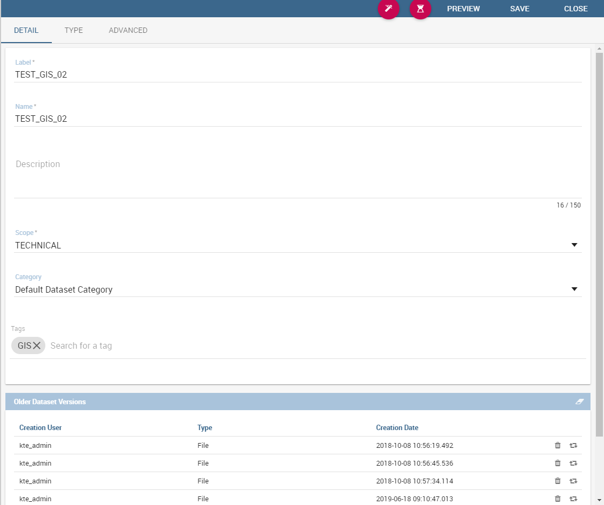
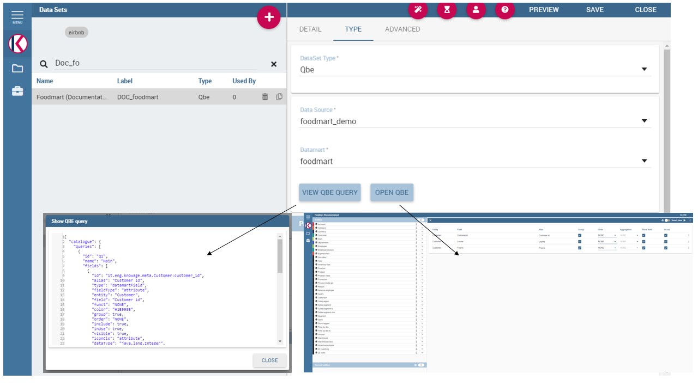
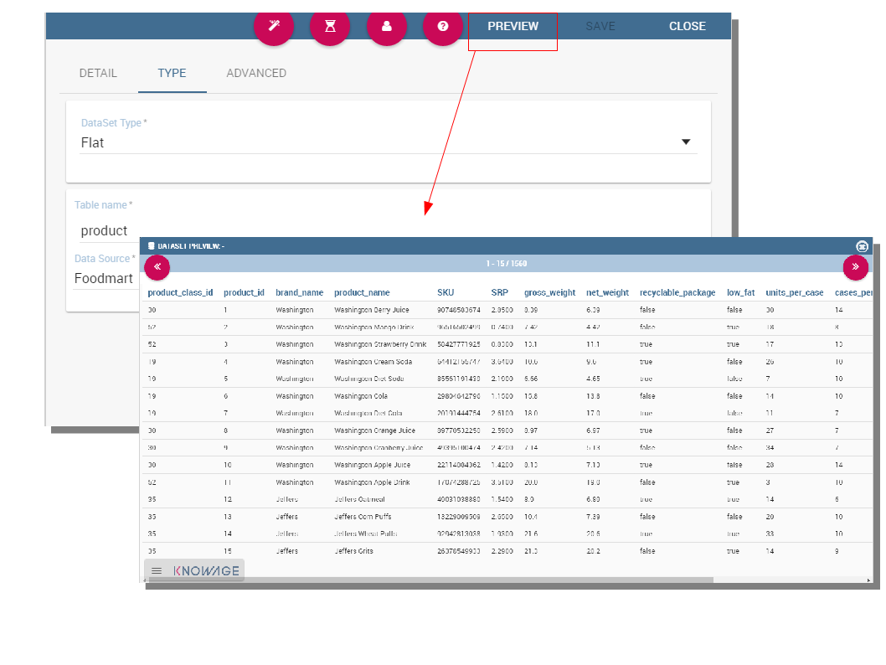
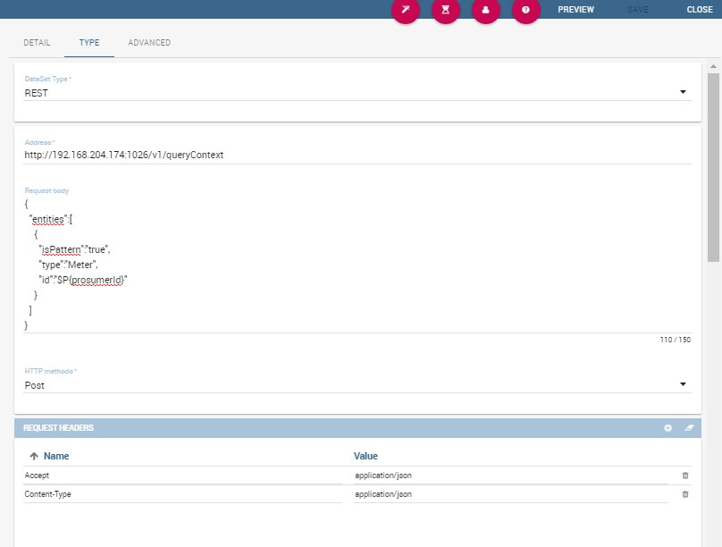
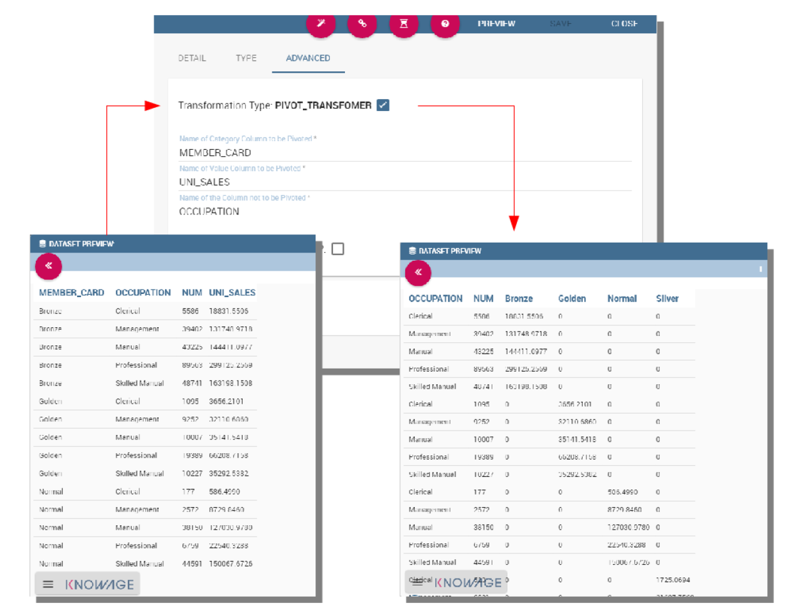

Advanced Data Access
====================

In this section we suppose to log in as an admin user. In this case the dataset definition is no longer available under **My data** section. Otherwise the functionality is granted by the **Dataset** item under the **Data Providers** section of server menu, as highlighted in figure below. This area offers you the possibility to define datasets among a wide range of types. Moreover you can add parameters, define scope, manage metadata and perform advanced operation on datasets. While the datasets creation and management between user and admin change in favour to the latter, the **Models** and **Federation definitions** tabs available in **My data** section remain identical. For this reason in this chapter we are going to describe only the dataset creation and management.

My first dataset
--------------------

As stated before, you can open the dataset graphical editor by selecting **Dataset** in **Data Provider** panel, as shown below.

    Access data set creation area.

A dataset acts as a data provider for analytical documents that’s why many types are supported. Knowage manages several dataset types:

-  File,
-  Query,
-  Java Class,
-  Script (Groovy, Javascript, Embedded Javascript or ECMAScript),
-  Qbe query over the metamodel,
-  Custom,
-  Flat,
-  Ckan, 
-  Federated,
-  REST,
-  Big Data.

All types of dataset share some common operations, while others are specific to each of them. The process for defining a dataset inside Knowage follows:

1. choose a name and a unique label;
2. choose the type of dataset and the source, depending on the dataset type;
3. write the code defining the dataset;
4. associate parameters to the dataset, if any (optional);
5. apply transformations (optional);
6. test the dataset and save it.

Some of these steps depend on the specific type of dataset, as we will see.

New dataset creation
~~~~~~~~~~~~~~~~~~~~

The dataset graphical editor is divided into two areas: the left side shows the list of all available datasets and the right one shows three tabs, each one corresponding to a specific type of editing operation on dataset.

Each item of the list in the left panel shows the dataset label (i.e., the dataset unique identifier), name and type, as well as the number of documents currently using it. To create a new dataset, click the **Add** icon |image14|. If your dataset is similar to another existing dataset, you can click the **Clone** icon |image16|. This will create a copy of the dataset, except for the label that must edit once again. All fields are pre-filled with values from the existing dataset but they can be modified and saved without affecting the original dataset.

.. |image14| image:: media/image21.png
   :width: 30
   

To remove an existing dataset, click the small dustbin icon |image17| on the corresponding row of the dataset list.

Once you have clicked the **Add** button, you can fill in the dataset definition form. Each tab in the right panel corresponds to a step of the dataset definition process.

In the **Detail** tab you define the Name, the Label and an optional Description of the dataset (refer to figure below). 

.. _datasetpanel:

    Dataset Panel.
    
In the lower part you can see a versioning system for the dataset: Knowage supports dataset versioning, as shown in figure below, therefore, each time you edit and save a dataset, the older version is archived and is still accessible from the lower part of the detail panel.

.. _datasetversioning:

    The dataset versioning.

The Scope lets you choose between two options, whose combination allows the definition of fine-grained purpose datasets. In Table below all details of possible matching are provided.

.. table:: Scope options
     :widths: auto

     +-----------------------+-----------------------+-----------------------+
     |    Dataset            | Private               | Public                |
     +=======================+=======================+=======================+
     |    User               | Created from file     | Dataset created from  |
     |                       | (CSV, XLS) or from    | file (CSV, XLS) or    |
     |                       | QbE (My Data) for     | from QbE (My Data)    |
     |                       | personal use only.    | and shared with other |
     |                       |                       | users.                |
     +-----------------------+-----------------------+-----------------------+
     |    Technical          | Not applicable.       | Dataset created by a  |
     |                       |                       | BI developer to be    |
     |                       |                       | used in one or more   |  
     |                       |                       | documents.            |
     |                       |                       |                       |
     |                       |                       | Not visible to end    |
     |                       |                       | users.                |
     +-----------------------+-----------------------+-----------------------+
     |    Enterprise         | Not applicable.       | Dataset of any type   |
     |                       |                       | created by a          | 
     |                       |                       | technical user and    |
     |                       |                       | certified by a        |
     |                       |                       | trusted entity within |
     |                       |                       | the organization, and |
     |                       |                       | made available to all |
     |                       |                       | end users for reuse.  |    
     +-----------------------+-----------------------+-----------------------+

You can also specify the Category of the dataset. This field is not mandatory but it can be used to categorize datasets in your BI project, so that you can easily recover them when performing searches.

In the **Type** tab you can define the type of dataset: here you have to write the code or upload an XLS file or call for a web service accordingly to the dataset type and add parameters to it, if any. An example is shown below.

.. figure:: media/image26.png

    The dataset type definition.

In the **Advanced** tab, shown in figure below, you can apply the pivoting transformation to the dataset results if needed or decide to persist the dataset.

.. figure:: media/image27.png

    The dataset trasformation tab.

Once all those settings have been performed you can see a preview of the dataset results clicking on the **Preview** button available on the top right corner of the page. It is recommended to check preview to detect possible errors in the dataset code before associating it to a document.

Note that the metadata can be manage by clicking on the icon |image21| and use the same criterion described in Dataset paragraph. Otherwise use the icon |image211| to save without associating any metadata.

   
.. |image211| image:: media/image29.png
   :width: 30

Let us describe more deeply each type of dataset.

File Dataset
~~~~~~~~~~~~

A dataset of type File, see the following figure, reads data from an XLS or CSV file. To define a **File Dataset** select the File type, then upload the file by browsing in your personal folders and set the proper options for parsing it.

.. figure:: media/image30.png

    File Dataset.

Once you have uploaded the file, you can check and define the metadata (measure or attribute) of each column.

Query Dataset
~~~~~~~~~~~~~

Selecting the query option requires the BI developer to write an SQL statement to retrieve data.

The SQL dialect depends on the chosen data source. The SQL text must be written in the Query text area. Look at SQL query example.

.. code-block:: sql
         :caption: SQL query example
         :linenos:

          SELECT p.media_type as MEDIA, sum(s.store_sales) as SALES                                                            
          FROM sales_fact_1998 s                                    
          JOIN promotion p on s.promotion_id=p.promotion_id                                                                    
          GROUP BY p.media_type                                     

It is also possible to dynamically change the original text of the query at runtime. This can be done by defining a script (Groovy or Javascript) and associating it to the query. Click on the **Edit Script** button (see next figure) and the script editor will open. Here you can write the script. The base query is bounded to the execution context of the script (variable query) together with its parameters (variable parameters) and all the profile attributes of the user that executes the dataset (variable attributes).

.. _scripteditingdataset:
.. figure:: media/image31.png

    Script editing for dataset.

In Code Query dataset’s script example we uses Javascript to dynamically modify the ``FROM`` clause of the original query according to the value of the parameter year selected at runtime by the user.

.. code-block:: javascript
         :caption:  Query dataset’s script example
         :linenos:

          if( parameters.get('year') == 1997 ) { query = query.replace(FROM  
          sales_fact_1998, FROM sales_fact_1997);                            
          } else { query = query; // do nothing                                 
          }                                                                     

Java Class Dataset
~~~~~~~~~~~~~~~~~~

Selecting a dataset of **Java Class** type allows the execution of complex data elaboration implemented by a Java class. The compiled class must be available at \\webapps\\ Knowage\WEB-INF\\ classes with the proper package. The class defined by the developer must implement the interface it.eng.spagobi.tools.dataset.bo.IJavaClassDataSet and the methods implemented are:

-  ``public String getValues(Map profile, Map parameters)``. This method provides the result set of the dataset using profile attributes and parameters. The String to return must be the XML result set representation of type:

.. code-block:: xml
         :linenos:

         <ROWS>                           
                <ROW value="value1" .../>     
                <ROW value="value2" .../> 
                ... 
          </ROWS>                          

-  ``public List getNamesOfProfileAttributeRequired()``. This method provides the names of profile attributes used by this dataset implementation class. This is a utility method, used during dataset execution.

Script
~~~~~~

If you select this option, the results of the dataset will be produced by a script. Therefore, the developer should write a script returning an XML string containing a list of values with the syntax shown below.

.. code-block:: xml
         :linenos:

          <ROWS>                           
                <ROW value="value1" .../>     
                <ROW value="value2" .../> 
                ... 
          </ROWS>   

If the script returns a single value, this will be automatically encoded in the XML format above. The script must be written using Groovy or Javascript language. Knowage already provides some Groovy and Javascript functions returning the value of a single or multi-value profile attribute. These functions are explained in the information window that can be opened from the **Dataset Type** tab. New custom functions can be added in ``predefinedGroovyScript.groovy`` and ``predefinedJavascript.js`` files contained in the ``KnowageUtils.jar`` file.

QbE
~~~

.. important::
     **Enterprise Edition**

     If you purchased Knowage EE, this feature is available only in KnowageBD and KnowageSI

The QbE dataset type option allows the definition of dataset results based on a query defined over a metamodel. To define a QbE dataset you need to select the Data Source and Datamart that you want to use. Once chosen your datamart you can click the lookup button of the Open QbE field and a pop up window will appear showing a QbE interface where you can define your query. Once saved, you can check the generated query thanks to the View QbE Query.

All these features are exhibited below.

    QbE Dataset.

Custom Dataset
~~~~~~~~~~~~~~

Selecting a Custom dataset type allows the developer to execute complex data elaboration by a custom Java dataset implementation. There are two options:

 - implement the ``it.eng.spagobi.tools.dataset.bo.IDataSet`` interface;
 - extend the ``it.eng.spagobi.tools.dataset.bo.AbstractCustomDataSet`` class.

The methods executing the dataset that must be implemented are:

 - ``void loadData()``;
 - ``void loadData(int offset, int fetchSize, int maxResults)``;

Using the ``AbstractCustomDataset`` class allows the developer to access predefined utility methods, such as:

 -  ``public void setParamsMap(Map paramsMap)``;
 -  ``public IDataSetTableDescriptor createTemporaryTable (String tableName, Connection connection)``;
 -  ``public IDataStore decode(IDataStore datastore)``;
 -  ``private void substituteCodeWithDescriptions(IDataStore datastore, Map<String, List<String>> codes, Map<String, List<String>> descriptions)``;
 -  ``private Map<String, List<String>> getCodes(IDataStore datastore)``.

The full class name (package included) must be set on the Java class name field, while it is possible to add custom attributes for dataset execution and retrieve them via the following method of the ``IDataSet`` interface: ``Map getProperties()``.

Flat Dataset
^^^^^^^^^^^^

A flat dataset allows the retrieval of an entire table from a data source. In other words, it replaces a dummy query like ``select * from sales`` by automatically retrieving all rows in a table. To create a flat dataset, simply enter the table and the data source name, as shown below.

    Flat Dataset.

Ckan
^^^^

.. important::
     **Enterprise Edition**

     If you purchased Knowage EE, this feature is available only in KnowageBD and KnowageSI

A Ckan dataset let you use open data as resource. You have to fill all the settings fields properly to let the dataset work successfully. Let’s have a look on them:

 -  **File Type**: this field specifies the type of the file you want to import. Allowed ones are: CSV or XML;
 -  **Delimiter Character**: Here you have to insert the delimiter used in the file. Allowe values are: , ; \\t \|
 -  **Quote Character**: Allowed values for this field are: “ or ”;
 -  **Encoding**: Here you have to specify the encoding typology used. Allowed values are: UTF-8, UTF-16, windows-1252 , ASCII or    ISO-8859-1;
 -  **Skip rows**: the number inserted stands for the rows not to be imported;
 -  **Limit rows**: it is the maximum number of rows to be imported. If you leave it blank all rows are uploaded;
 -  **XLS numbers**: it is the number of scheets to be imported;
 -  **CKAN ID** : here you have to insert the ID of the resource you are interested in. Look for it among the additional information in Ckan dataset webpage.
 -  **CKAN url**: it is the direct link to download the resources available on Ckan dataset webpage.

We marked with the \* symbol the mandatory fields. We suggest to do a preview of your dataset before saving it to be sure everything have been correctly configured.

Federated
^^^^^^^^^

.. important::
     **Enterprise Edition**

     If you purchased Knowage EE, this feature is available only in KnowageBD and KnowageSI

In this area you can only manage metadata, visibility and perform the advanced operation we are going to describe at the end of this section.

Instead, the creation of **Federated** done can be accessed from **My data** BI functionality under **Federatation Definitions**.

Rest
^^^^

The REST dataset enables Knowage to retrieve data from external REST services. The developer of the dataset is free to define the body, method, headers and parameters of the request; then he has to specify how to read data from the service response using JSON Path expressions (at the moment no other ways to read data is available, therefore the REST service is presumed to return data in JSON format).

Let’s make as example in order to understand how it works. Suppose an external REST service providing data from sensors, we want to retrieve values from prosumers electricity meters, a prosumer being a producer/consumer of electricity, and that the request body should be something like:

.. code-block:: json
         :caption: Request body code
         :linenos:

         {  "entities": [ {         
            "isPattern": "true", 
            "id": ".*", 
            "type":"Meter"
            } ] 
         }

while querying for ``Meter`` entities, and that the JSON response is something like:

.. code-block:: json
         :caption: RJSON response code
         :linenos:

         {                                          
                "contextResponses": [                   
             {                                       
                "contextElement": {                     
                "id": "pros6_Meter",                    
                "type": "Meter",                        
                "isPattern": "false",                   
                "attributes": [                         
                    {                                           
                      "name": "atTime",                                           
                      "type": "timestamp",                                           
                       "value": "2015-07-21T14:49:46.968+0200"                                        
                     },                                         
                     {                                       
                      "name": "downstreamActivePower",        
                      "type": "double",                       
                      "value": "3.8"                          
                     },                                     
                    {                                       
                      "name": "prosumerId",                   
                      "type": "string",                       
                      "value": "pros3"                        
                    },                                      
                    {                                       
                      "name": "unitOfMeasurement",            
                      "type": "string",                       
                      "value": "kW"                           
                     },                                      
                     {                                       
                      "name": "upstreamActivePower",          
                      "type": "double",                       
                      "value": "3.97"                         
                      }                                       
                    ]                                       
                    },                                      
               "statusCode": {                         
                       "reasonPhrase": "OK",                   
                       "code": "200"                           
                             }                                       
                 },                                         
                    {                                          
                "contextElement": {                     
                       "id": "pros5_Meter",                    
                       "type": "Meter",                        
                       "isPattern": "false",                   
                       "attributes": [                         
                    {                                       
                       "name": "atTime",                       
                       "type": "timestamp",                    
                       "value": "2015-08-09T20:29:45.698+0200" 
                    },                                      
                    {                                       
                       "name": "downstreamActivePower",        
                       "type": "double",                       
                       "value": "1.8"                          
                    },                                      
                     {                                       
                       "name": "prosumerId",                   
                       "type": "string",                       
                       "value": "pros5"                        
                   },                                      
                    {                                       
                      "name": "unitOfMeasurement",            
                      "type": "string",                       
                      "value": "kW"                           
                   },                                      
                 {                                       
                      "name": "upstreamActivePower",          
                      "type": "double",                       
                      "value": "0"                            
                  }                                       
                          ]    
                 },                                      
                      "statusCode": {                         
                      "reasonPhrase": "OK",                   
                      "code": "200"                           
                       }                                       
                 }                                          
                         ] 
                 }    

In this example we have two **Context Elements** with the following attributes:

 -  **atTime** ;
 -  **downstreamActivePower**;
 -  **prosumerId**;
 -  **unitOfMeasurement**;
 -  **upstreamActivePower**.

Let’s see how to define a Knowage dataset:

    REST dataset interface.

We specified

-  the URL of the REST service;
-  the request body;
-  the request headers (in this example we ask the service for JSON data);
-  the HTTP method;
-  the JSONPath to retrieve the items (see below), i.e. the JSONPath where the items are stored;
-  the JSONPaths to retrieve the attributes (see below), i.e. the JSONPaths useful to retrieve the attributes of the items we are looking for; those paths are relative to the "JSON Path items";
-  offset, fetch size and max results parameters, in case the REST service has pagination.

Once followed the steps above the user obtains upstream/downstream active power for each prosumer.

**NGSI checkbox** is specific for NGSI REST calls: it permits easy the job when querying the Orion Context Broker (`https://github.com/telefonicaid/fiware-orion) <https://github.com/telefonicaid/fiware-orion>`__ and to omit some of the REST fields (since the JSON format from NGSI specifications is fixed): you don’t need to specify headers, JSONPath items, JSONPath attributes (all available attributes are fetched) and pagination parameters (offset and fetch size).

When checking the **Use directly JSON attributes** checkbox, yon can skip the definition of the JSONPath attributes, since the JSON structure is presumed to be fixed as in the following example:

.. code-block:: json
         :caption: Use directly JSON attributes
         :linenos:

         {                               
          "contextResponses": [        
            {                            
              "prosumerId":"pros1",        
              "downstreamActivePower":3.1, 
              "upstreamActivePower":0.0    
            },{                          
              "prosumerId":"pros2",        
              "downstreamActivePower":0.5, 
              "upstreamActivePower":2.4    
               }                            
                             ]                            
         }                               

Then it will be enough to define only the **JSON Path Items** and check **Use directly JSON Attributes** without defining the attributes; the attributes will be retrieved automatically from the JSON object.

In the above examples, the JSON Path Items will be ``$.contextResponses[:sub:`\*`]`` and the dataset result will look like:

.. table:: Dataset result
        :widths: auto
  
        +---------------+-----------------------+---------------------+
        |    prosumerId | downstreamActivePower | upstreamActivePower |
        +===============+=======================+=====================+
        | pros1         | 3.1                   | 0.0                 |
        +---------------+-----------------------+---------------------+
        | pros2         | 0.5                   | 2.4                 |
        +---------------+-----------------------+---------------------+
    
The REST dataset permits usage of profile attributes and parameters using the same syntax as for other dataset types: ``$<profile attribute>`` and ``$P<parameter>``. You can use both of them as placeholders in every field: most likely you need to use them in REST service URL or on the request body. As an example, suppose you want to retrieve the value of just one prosumer that is specified by the ``prosumerId`` parameter, you have to set the request body as:

.. code-block:: json
         :caption: Request body for prosumerId parameter
         :linenos:

         {                        
          "entities":[          
            {                     
             "isPattern":"true",   
             "type":"Meter",       
             "id":"$P{prosumerId}" 
            }                     
                     ]                     
         }                        

Big Data - NoSQL
^^^^^^^^^^^^^^^^

.. important::
     **Enterprise Edition**

     If you purchased Knowage EE, this feature is available only in KnowageBD and KnowagePM

Knowage provides the possibility to define Big Data dataset as well as Big Data datasources. To set these kind of datasets the user just have to select the **Query** type and insert the code according to the dialect in use (that is accordingly to the datasource dialect).

For example, let’s suppose we defined a Mongo datasource and want to create a dataset upon it. Therefore choose the "Query type" dataset and, as we revealed in advance, choose the correct language: in this case JS instead of SQL. The script must respect some convention, in particular:

-  the return value of the query must be assigned to a variable with
   name ”query“. For example

.. code-block:: javascript
         :caption: Request body for prosumerId parameter
         :linenos:
   
         var query = db.store.find();

-  if the return value doesn’t come from a query, for example it's a js variable, than it must be assigned to a variable with name ``sbiDatasetfixedResult``. The result will be managed by Knowage accordingly to the type of the variable:

    -  if it’s a primitive type the resulting dataset contains only a columns with name ``result`` and value equal to the value of the variable ``sbiDatasetfixedResult``;

    -  if it’s an object, the resulting dataset contains a column for each property of the object.

        For example, if we consider the query 
        ``sbiDatasetfixedResult = {a:2, b:3}`` 
        the dataset is as shown in Table below.
   
.. table:: Dataset output
     :widths: auto

     +------+------+
     |    a |    b |
     +======+======+
     |    2 | 3    |
     +------+------+

-  if it’s a list than the columns of the dataset are the union of the properties of all the objects contained in the list.

        For istance, let’s consider the query 
        ``sbiDatasetfixedResult = [{a:2, b:3},{a:2, c:3}]`` 
        the dataset is

.. table:: Dataset output
     :widths: auto

     +------+------+------+
     |    a | b    |    c |
     +======+======+======+
     |    2 |    3 |      |
     +------+------+------+
     |    2 |      | 3    |
     +------+------+------+

The result of a query in MongoDB can assume different shapes: Cursor, Document, List, fix value. Knowage can manage automatically the result of the query. The algorithm to understand how to manage the result is very simple.

-  If in the query it finds the variable sbiDatasetfixedResult the result will be managed as described above.
-  If in the query it finds a findOne the result will be managed as a single document.
-  If in the query it finds an aggregate the result will be managed as an aggregation.
-  In the ether cases the result will be managed as a Cursor.

It’s possible to force the behaviour. In particular the result stored in the variable query, will be managed:

-  as cursor if in the script exist a variable with value ``LIST_DOCUMENTS_QUERY``. Example:

.. code-block:: javascript 
         :linenos:
           
          var retVal= "LIST_DOCUMENTS_QUERY“;

-  a document if in the script exist a variable with value ``SINGLE_DOCUMENT_QUERY``. Example:

.. code-block:: javascript 
         :linenos:
           
          var retVal= "SINGLE_DOCUMENT_QUERY”;

Similar techniques can be applied to the other languages. We leave the reader to examine the dialect related to each Big Data datasource.

.. note::
      **MongoDB Document size**
         
      Remember that MongoDB has a limit of maximum 16MB for the returned document (BSON), so pay attention to that when creating your dataset. For more information check this link: https://docs.mongodb.com/manual/reference/limits/

Parameters and profile attributes
--------------------------------------

All dataset types except **File** and **CKAN** allow you to add parameters. This means that results can be customized according to the value of one or more parameters at execution time. Parameters can be managed from the **Type** tab. Two operations are needed to add a parameter to the dataset:

1. insert the parameter in the actual text of the dataset;
2. create the parameter in the parameters list below the editor area.

The syntax to add a parameter in the dataset code text is ``$P{parameter_name}``. At dataset execution time, the parameter will be replaced by its actual value.

.. warning::
     **Attention to parameters’ names!**
         
         If the dataset is used by a Knowage document, then the document parameters’ URL must match the parameter name set in the dataset **Type** tab, in order for the dataset to be passed correctly.
         
Any parameter added to your dataset must be added to the parameters list, too. To add a parameter in the list, click the **Add** button. A new row will be created in the list: double click the name and edit the parameter values. There are three different types of parameters. For each of them the placeholder will be replaced according to a different pattern, as follows:

-  **String**: the parameter value will be surrounded with single quotes if not already present.
-  **Number**: the parameter value is treated as a number, with no quotes; an exception is thrown if the value passed is not a number.
-  **Raw**: the parameter value is treated as a string containing a set of values; single quotes are removed from the containing string, not from the single strings composing it.
-  **Generic**: the parameter is simply passed as it is, with no futher processing.

In SQL query example with parameters an example is provided, where ``MediaType`` is a string parameter.

.. code-block:: sql 
         :caption: SQL query example with parameters
         :linenos:
           
         SELECT  s.customer_id as CUSTOMER 
         , sum(s.store_sales) as SALES       
         , c.yearly_income as INCOME
         , p.media_type as MEDIA 
         FROM sales_fact_1998 s, customer c, promotion p                       
         WHERE                                                                 
         s.customer_id=c.customer_id and s.promotion_id=p.promotion_id and  
         p.media_type in ($P{MediaType})                                    
         GROUP BY 
         s.customer_id,                                                     
         c.yearly_income,                                                   
         p.media_type                                                       

Datasets of type Query and Script can also use *profile attributes*. Differently from parameters, profile attributes do not need to be   explicitly added to the parameter list since they have been defined elsewhere. Clicking the **Available Profile Attribute** button you can see all profile attributes defined in the behavioral model and choose the one(s) you wish to insert in the dataset query/script   text, as shown below.

.. figure:: media/image35.png

    Profile Attributes assignment.

The syntax to include attributes into the dataset text is ``${attribute_name}``. Profile attributes can be single-value or multivalue.

.. note::
     **User profile attributes**
         
         Each Knowage user is assigned a profile with attributes. The user profile is part of the more general behavioural model, which allows tailored visibility and permissions on Knowage documents and functionalities.

   
Further operations on a dataset
------------------------------------

Script option
~~~~~~~~~~~~~

As we reported in Section 'Query Dataset', the script option can be very useful when the user wants to create a very dynamic query. Dealing with parameters, if the query and syntax are not handle properly, the missing of one parameter value compromise the dataset execution. Therefore it can be convenient to use a script to manage the assignment of null or empty values to parameters. Scripts can be in fact configured to load placeholders with a slice of SQL code.

Clicking on the "script" button, the interface opens the wizard shown in the following figure. 

.. figure:: media/image39.png

   Editing script.

Here the user is asked to select the language he's intended to use. The window is divided into two tabs, the script tab is the one opened by default. 

.. figure:: media/image40.png

   Editing script.

.. figure:: media/image38.png

   Setting placeholder using script.

Transformations
~~~~~~~~~~~~~~~

In some cases it is useful to perform transformations on the results of a dataset, to obtain data in the desired format. The most common operation is the pivot transformation, which allows the switch between rows and columns of the dataset results. Knowage supports this operation on any type of dataset.

To set a pivot transformation, select **Pivot Transformer** in the drop down menu of the **Transformation** tab. Then set the following fields:

-  **Name of Category Column to be Pivoted**. Here you should write the name of the dataset column whose values will be mapped onto columns after pivoting.
-  **Name of Value Column to be Pivoted**. Here you should write the name of the result set column, whose values should become values of the previous columns (category columns).
-  **Name of the Column not to be Pivoted**. Here you should write the name of those columns that should not be altered during the transformation.
-  In case you wish to add a number to category columns (e.g., 1_name_of_column), you should check the option **Automatic Columns numeration**.

An example of usage is available in figure below, showing the result set of the dataset.

    Pivot transformation.
   

Dataset persistence
~~~~~~~~~~~~~~~~~~~

The **Advanced** tab is used to make a dataset persistent, i.e., to write it on the default database. Making a dataset persisent may be useful in case dataset calculation takes a considerable amount of time. Instead of recalculating the dataset each time the documents using it are executed, the dataset is calculated once and then retrieved from a table to improve performance. In order to force recalculation of the dataset, you should execute dataset preview again. This will store the newly generated data on the database table.

Once marked the dataset as persistent, you are asked to insert a table name. This is the table where data are stored and then retrieved.

.. important::
         **Enterprise Edition only**

         With KnowageBD, KnowageER and KnowageSI products you can also decide to schedule the persistence operation: this means that the data stored in the table will be update with according to the frequency defined in the **scheduling** options. Choose your scheduling option and save the dataset. Now the table where your data are stored will be persisted according to the settings provided.

Preview
~~~~~~~

Before actually using the dataset in a document, it is a good practice to test it. Clicking the **Preview** button within the **Preview** tab, you can see a preview of the result set, see the following figure. This allows the developer to check any anomaly or possible error in the dataset definition, before using it.

.. figure:: media/image37a.png

    Dataset preview (left) and parameters prompt window (right).

If some parameters have been set, a window with their list will be shown: their values must be entered by double clicking on the set to string, just write the value you want to assign in the preview: quotes will be added automatically. On the other hand, if the type is raw or generic but you want to input text, then remember to add quotes to the test value.
