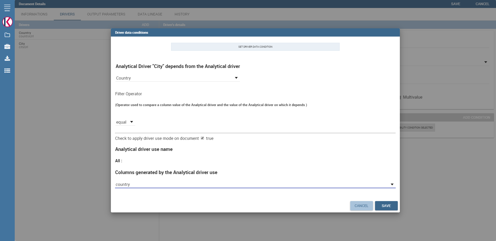
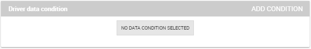
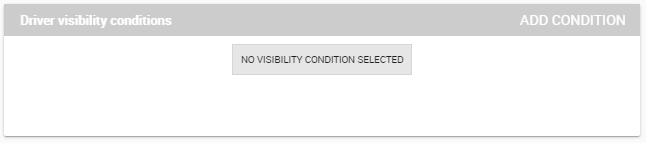
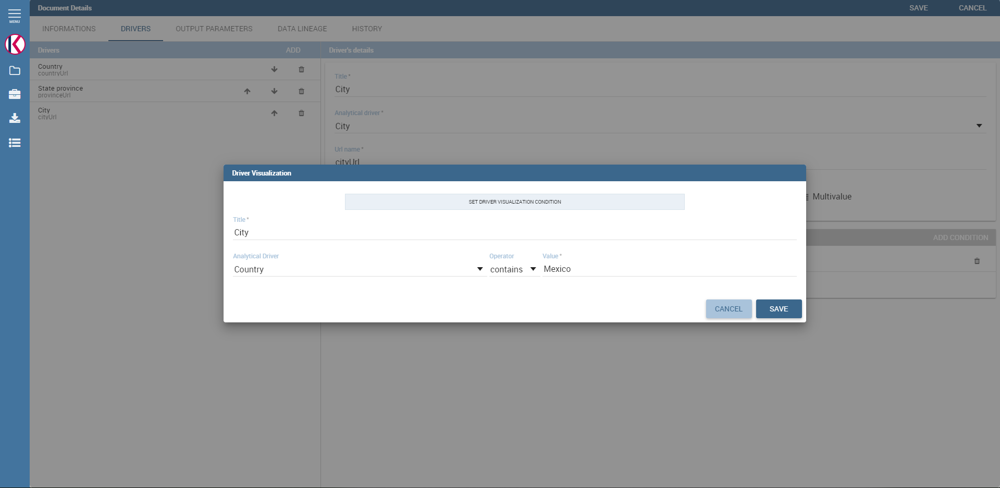

# Documento analítico

El *modelo analítico* es el núcleo de Knowage Server y cubre toda la gama de necesidades analíticas, proporcionando muchas soluciones para cada área analítica, como informes, gráficos, documentos OLAP, KPI, etc.

El elemento principal del modelo analítico es el llamado *documento analítico*, palabra utilizada para agrupar bajo un concepto común todos los diferentes tipos de documentos que se pueden desarrollar con Knowage (informe, gráfico, cabina, etc.) a la hora de realizar un análisis de BI.

En este capítulo describimos paso a paso cómo crear un nuevo documento analítico. Existen muchos tipos de documentos diferentes, cada uno con sus propias peculiaridades. Aquí proporcionamos una visión general genérica sobre las características comunes, nos centraremos en las peculiaridades de los tipos disponibles en cada parte dedicada.

## Conceptos principales

La creación y gestión de documentos analíticos en Knowage involucra diferentes elementos:

Plantilla
La plantilla define el diseño estándar de un documento, incluyendo información específica sobre su apariencia y la forma en que se debe mostrar el contenido. Las plantillas se pueden codificar a mano o utilizando diseñadores de Knowage Studio, cuando estén disponibles. Para cada documento analítico se mantiene el historial de plantillas. Las plantillas antiguas se pueden restaurar si es necesario. Se guarda una nueva versión en cada implementación, ya sea manual o desde Knowage Studio.
Conjunto de datos
Cada documento está asociado a uno o más conjuntos de datos. El conjunto de datos proporciona datos reales que se representarán de acuerdo con la plantilla definida. Es decir, el dataset proporciona el contenido real del análisis y la plantilla se encarga de darle una estructura significativa.
Origen de datos
Para recuperar datos a través del conjunto de datos, se debe definir una fuente de información. Dependiendo del tipo de documento, el origen de datos puede estar asociado al documento directa o implícitamente (a través del conjunto de datos).
Parámetros
Los parámetros permiten la conexión entre el documento y los controladores analíticos asociados a él. En otras palabras, en el momento de la ejecución del documento, cada controlador genera un valor que se asigna al parámetro correspondiente.

Estos elementos se combinan dentro de cada motor de documentos, con el fin de producir diferentes documentos analíticos. Este proceso genera una salida HTML, a la que se puede acceder y navegar utilizando un navegador web. Se admiten otros formatos de salida, incluidos XLS, CSV, PDF, XML.

.. figura:: media/image57.png

Componentes del documento analítico knowage.

Tipos de documentos

```

Regardless of their type, all analytical documents interact with some generic components (such as cross-services) and with the specific engine that generate them (e.g. Report engine, OLAP engine). Therefore, all analytical documents are managed in the same way in terms of:

-  document storage and versioning;
-  document life cycle, based on a specific approval process including different status (development, test, released, suspended);
-  multiple positioning on the repository and indirectly first visibility level;
-  rules to restrict document visibility to some end user profiles;
-  management of analytical drivers;
-  multi-format export logic;
-  attribution of business metadata;
-  scheduled execution;
-  collection of auditing and monitoring data;
-  adding end user notes;
-  adding bookmarks;
-  end user evaluation;
-  sending the document by email;
-  on-line or off-line (scheduled) execution.

This means that the above mentioned features are also inherited by every new engine that is developed or integrated into Knowage.

In the next sections we describe in detail how to create and manage analytical documents in Knowage.

Register an analytical document
-----------------------------------

There are two different ways to create a new document on Knowage Server. The first option involves Knowage Studio: within it you can simply click on **Deploy** and the document window will open with pre-filled options. Please note that Knowage Studio can be used to create Birt or Dashboard document only.

.. note::
    **Deploy a document from Knowage Studio**

    Knowage Studio is the tool that allows to design and upload documents onto Knowage Server. Please refer to the dedicated section for full details and examples.

The second option is to manually create the document on the Server. This is the most general way since the Studio designer is not yet available for all documents types.

Analytical documents on Server
```

En primer lugar, haga clic en **Desarrollo de documentos** desde el menú Funcionalidades de BI, como se muestra .

.. figura:: media/image58.png

    Documents Development button.

De forma predeterminada, la página se divide en dos partes, como se muestra en la figura a continuación: en el lado izquierdo está el árbol de funcionalidad que representa la estructura de carpetas, mientras que a la derecha puede ver la lista de todos los documentos contenidos en la carpeta seleccionada.

.. figura:: media/image59.png

    Documents Development section.

Puede cambiar a la vista de vista previa del documento haciendo clic en el icono de cuadrícula en la esquina superior derecha, como se muestra en la figura a continuación.

.. \_changingdocumentsview:
.. figura:: media/image60.png

    Changing documents view.

Cada línea muestra la etiqueta, el nombre, el autor y el tipo de documento, mientras que el botón de reproducción al final de cada fila ejecuta el documento. Además, al hacer clic en una línea se abre un panel lateral a la derecha de la página. Aquí puede ver más información de metadatos, como la descripción del documento, el estado y la fecha de creación.

.. figura:: media/image61.png

    Side panel.

En la parte superior de este panel lateral se encuentran cuatro botones:

*   |image60| ejecutar el documento;

.. |image60| imagen:: media/image62.png
:ancho: 30

*   |image61| acceder a los detalles del documento;

.. |image61| imagen:: media/image63.png
:ancho: 30

*   |image62| clonar el elemento;

.. |image62| imagen:: media/image64.png
:ancho: 30

*   |image63| borrar el documento.

.. |image63| imagen:: media/image65.png
:ancho: 30

La siguiente figura muestra el panel de detalles de un documento. A la izquierda, se muestran los detalles del documento, incluidos el nombre, el tipo, el conjunto de datos y el estado. A la derecha, puede ver el árbol de funcionalidades y la posición del documento. Si desea copiar o mover un documento de una carpeta a otra, marque o desmarque las carpetas correspondientes.

.. \_detailpanelofknowanalydoc:
.. figura:: media/image66.png

    Detail panel of Knowage analytical document.

Para crear un nuevo documento, debe hacer clic en el botón rojo más en la esquina superior derecha del **Desarrollo de documentos** página. Los diferentes tipos de documentos que puedes crear son: **Cabina** y **Documento genérico**. Tenga en cuenta que no todos están disponibles en todos los productos de Knowage.

Para crear un nuevo documento genérico, haga clic en el botón mencionado anteriormente y seleccione **Documento genérico**. Se le mostrará una ventana como la de la figura anterior, pero con campos vacíos, para permitirle definir los detalles del documento.

En primer lugar, elija una etiqueta, un nombre y una descripción. Es importante señalar que la etiqueta es el identificador único del documento en Knowage Server. Luego, seleccione el tipo de documento y el motor apropiado en los menús desplegables, de acuerdo con el documento que está desarrollando (consulte la figura a continuación).

.. figura:: media/image67.png

    Select Type and Engine for a new document.

Ahora debe seleccionar el conjunto de datos y / o la fuente de datos que alimentará su documento con datos. En este ejemplo, puede ver la ventana emergente con conjuntos de datos para seleccionar en la siguiente figura.

.. figura:: media/image68.png

    Selecting a dataset for the document.

Ambos deberían haber sido ya definidos en los apartados correspondientes para que Knowage los muestre en las opciones disponibles de los menús. Puede seleccionar el origen de datos en el menú desplegable. Y seleccione el conjunto de datos en la ventana emergente y haga clic en guardar.

Tenga en cuenta que algunos tipos de documento no requieren la definición de un conjunto de datos en este momento porque utilizan conjuntos de datos incrustados. Dependiendo del tipo, también puede ser necesario seleccionar el origen de datos.

Es recomendable guardar regularmente el documento en este proceso, haciendo clic en el botón relacionado guardar en la esquina superior derecha de la ventana.

Ciclo de vida del documento
^^^^^^^^^^^^^^^^^^

El siguiente paso es elegir el estado del documento utilizando el **Estado** menú desplegable. De hecho, en cualquier momento, cada documento está asociado a un estado, que generalmente cambiará con el tiempo después del desarrollo del proyecto. Esos estados son:

*   desarrollo;
*   prueba;
*   liberado;
*   suspendido.

Tras la creación, el documento está de forma predeterminada en estado de desarrollo. Cada vez que cargue una nueva plantilla o realice cambios en el documento, se recomienda que el estado se actualice para reflejar su estado de desarrollo real.

La razón principal de esto es que el estado del documento tiene un impacto en su accesibilidad. Como se discutió en el modelo de comportamiento, Knowage define los tipos de roles (administrador, desarrollador, probador, usuario). Los estados son compatibles con el tipo de rol correspondiente. Los administradores pueden cambiar el estado de los documentos en cualquier momento. Los desarrolladores no pueden acceder solo a los documentos con estado de prueba. Los evaluadores no pueden ver los documentos en desarrollo o en estado suspendido. Los usuarios solo pueden ejecutar documentos en estado liberado. Tenga en cuenta que un probador puede cambiar el estado de un documento de la prueba al desarrollo.

.. importante::
**Solo Enterprise Edition**

         In KnowageER you may also decide to temporary "lock" a document while he is working with it: it is enough to set the **Lock by user** item. This prevent other developers from modifying the same document you are working on.

Control de versiones de plantillas
^^^^^^^^^^^^^^^^^^^

Cuando registra un documento en el servidor, debe asociarle una plantilla. Haga clic en la pestaña **Historia** y luego en el botón **Hojear** para elegir una plantilla de su sistema de archivos local y cargarla.

.. \_templateversionforanalydoc:
.. figura:: media/image69.png

Es posible que haya editado la plantilla a mano o utilizando el diseñador de Studio. Claramente, no tendrá que cargar la plantilla si está utilizando la implementación automática desde Studio.

Knowage Server admite el control de versiones de las plantillas cargadas, como se muestra a continuación. Para verlos, haga clic en la pestaña **Historia**. Todas las plantillas se guardan con su fecha y nombre, y se pueden cargar o eliminar fácilmente. Para subir una plantilla, haga clic en el botón **Hojear** para elegir una plantilla de su sistema de archivos local y cargarla: se cargará la nueva plantilla. Usando la misma lista puedes descargar o eliminar una plantilla.

.. figura:: media/image70.png

    Template versioning for analytical documents.

Visibilidad de documentos
^^^^^^^^^^^^^^^^^^^

Después de haber definido todos los detalles, debe elegir dónde se guardará el documento analítico en el árbol de funcionalidades. Esta elección tiene un impacto en la visibilidad del documento. Dado que las carpetas en el árbol de funcionalidad están sujetas a diferentes políticas de acceso, que se pueden establecer al crear el nodo, cada documento guardado en esa carpeta heredará los permisos en consecuencia.

.. advertencia::
**Estructura y derechos del repositorio**

         The **Functionalities tree** is Knowage document repository. It is managed by administrator, who is in charge to profile user visibility too.

Tenga en cuenta que el mismo documento se puede guardar en diferentes puntos del árbol de funcionalidades. Esto permite al administrador hacer que el documento sea accesible para varios roles en función de las reglas de visibilidad definidas para las carpetas que lo contienen. A la derecha, puede elegir dónde desea guardar el documento marcando la carpeta correspondiente en el árbol. Si desea guardarlo en varias ubicaciones, márquelas todas antes de guardar. Cada usuario que tenga acceso a la carpeta que contiene verá el documento.

.. \_functionaltreedocsav:
.. figura:: media/image66.png

    Functionality Tree, document saving settings.

## Reglas de visibilidad

Además del mecanismo estándar admitido por el árbol de funcionalidades, es posible personalizar aún más el acceso a un documento en función de los atributos del perfil de usuario. Esto permite a los administradores controlar el acceso a los documentos a un nivel muy detallado, más allá de las simples políticas basadas en repositorios.

Esto se puede hacer editando las condiciones en el **Restricciones de visibilidad** sección en el lado derecho de **Información** tablero. Para agregar una nueva condición, elija un atributo de perfil del menú desplegable y asígnele un valor. Esto agregará una nueva condición que debe verificarse para permitir que un usuario acceda al documento. De la misma manera, puede agregar más condiciones y, posiblemente, eliminarlas todas haciendo clic en el borrador.

.. figura:: media/image73.png

    Visibility restrictions.

## Asociación con conductores analíticos

Ya hemos discutido el papel de los impulsores analíticos y cómo se conectan a los documentos analíticos a través de parámetros. En esta sección mostraremos cómo definir prácticamente esta asociación.

Suponemos que la plantilla de documento y los conjuntos de datos están configurados correctamente en términos de definición de parámetros. En particular, deberían haber sido referenciados correctamente con su URL.

Para agregar un nuevo parámetro, puede hacer clic en la pestaña **Controladores** y luego en un **Agregar** , vea la siguiente figura.

.. figura:: media/image74.png

    Association with analytical driver panel.

Elija un nombre para el título del conductor. A continuación, elija el controlador analítico en el menú desplegable que desea asociar al documento.

Una vez que haya seleccionado el controlador, debe escribir el **URL exacta** del parámetro correspondiente. A continuación, establezca las diferentes características asociadas al controlador: puede configurar su visibilidad y decidir si es necesario y multivalor. De forma predeterminada, el parámetro es visible, no obligatorio y no multivalor.

Si desea que el documento no sea visible para los usuarios finales, desmarque el botón **Visible** casilla de verificación. Tenga en cuenta que el parámetro seguirá existiendo y recibirá valores del controlador asociado. Sin embargo, esto se ocultará y el usuario final no podrá elegir ningún valor para este parámetro.

Si desea configurarlo como un parámetro requerido, simplemente haga clic en **verdadero**. En este caso, no se establece ningún valor predeterminado. Se le pedirá al usuario final que elija el valor del parámetro antes de abrir el documento.

Del mismo modo, para establecer un parámetro como multivalor, haga clic en **verdadero**, de esta manera el usuario puede realizar múltiples selecciones entre sus valores.

Una vez que haya completado la definición de un parámetro, puede guardarlo haciendo clic en principal **Salvar** en la esquina superior derecha. Para agregar más parámetros, haga clic en el botón **Agregar** botón. Repita el mismo procedimiento tantas veces como desee. En este punto, es posible que desee cambiar el orden de los parámetros (es decir, cómo se presentan al usuario). Para hacerlo, haga clic en la flecha en la lista de controladores.

.. figura:: media/image75.png

    Association with analytical driver panel.

A continuación veremos algunas operaciones especiales que se pueden realizar sobre los drivers asociados a un documento.

Correlación entre parámetros

```

In the context of a document, two different parameters may be connected to each other: this means that the possible values of a   parameter are limited by the value(s) of another parameter.

This feature can be useful when two (or more) parameters are logically related. For example, suppose to have a parameter for all the possible countries and another one for all the possible cities. If the user selects a region, it is meaningless to show him all cities: he should only be enabled to choose among the cities in the selected region.

In general, to configure a correlation within a document you should make sure that the LOV associated with the parent parameter and the  one associated to the child parameter share at least one column. This column defines which value from the parent parameter will be applied to the child, in order to constrain the results.



    Definition of the correlation.

To set the correlation, select child parameter which will show you the details of that particular driver and then click on the **Add condition** button to open pop-up window for defining data correlation.



    Adding data correlation.

Here you need to define:

-  the parent parameter;

-  the type of logical operator, in order to compare values of the parent parameter with values of the child parameter;

-  the column, generated by the child parameter, whose value will be compared with the value of the same column in the parent   parameter.

If a parameter depends on multiple parent parameters, you can define multiple correlations.

.. figure:: media/image81.png

    Multiple correlations.

Once defined the correlation, the child parameters will display the labels during the runtime in italics.

Correlation through LOV and drivers
```

En secciones anteriores vimos cómo establecer la correlación a través de la GUI disponible en el panel de detalles del documento, pero también existe la posibilidad de obtener el mismo resultado utilizando el enlace entre LOV y los controladores analíticos. Más en profundidad, el usuario debe haber configurado previamente un controlador que ejecute valores que se puedan usar en la cláusula "where" de una consulta SQL. A continuación, el usuario debe establecer un LOV de tipo de consulta mediante la sintaxis

Destacamos que el `AD_name` es el nombre del controlador al que el administrador intenta llegar. La sintaxis para establecer la correlación a través de la configuración de LOV es:

.. code-block:: bash
:caption: Sintaxis para establecer la correlación a través de la configuración de LOV
:linenos:

$P{AD_name}

.. figura:: media/image82.png

    Correlation passing driver values to LOV query .

Como resultado, en la ejecución del documento, tan pronto como el usuario recoja un valor del parámetro "libre", el otro se filtra y mostrará solo el valor relacionado con la selección anterior, como se muestra en la Figura a continuación.

.. figura:: media/image83.png

    Filtering with correlation.

Visibilidad controlada

```

Another type of relation between parameters is supported by Knowage. It is possible to define values of a parent parameter that force hiding or showing of a child parameter in the parameters mask. Note that in the first case, the child parameter is hidden by default, while in the second case the parameter is shown by default.

To set a visibility expression, click on the **Add condition** button on the **Driver visibility conditions** card.



    Adding visual correlation

In the graphical editor you can define visibility rules similarly to   correlation ones, as shown in figure below.



    Visibility expressions.

Cross Navigation
---------------------

A powerful feature of Knowage analytical documents is cross-navigation, i.e., the ability to navigate documents in a browser-like fashion following logical data flows. Although crossnavigation is uniformly provided on all documents executed in Knowage Server, each type of document has its own modality to set the link pointing to another document.

Notice that the pointer can reference any Knowage document, regardless of the source document. For example, a BIRT report can point to a chart, a console, a geo or any other analytical document.

In Knowage there are two main typologies of cross navigation: *internal* and *external*.

*Internal cross navigation* updates one or more areas of a document by clicking on a series, a text, an image or in general on a   selected element of the document.

*External cross navigation* opens another document by clicking on an element of the main document, allowing in this way the definition of a *navigation path* throughout analytical documents (usually, from very general and aggregated information down to the more detailed and specific information)). Indeed, you can add cross navigation also to a document reached by cross navigation. This can be helpful to go deeper into an analysis, since each cross navigation step could be a deeper visualization of the data displayed in the starting document.

It is obviously possible to associate more than one cross navigation to a single document. It means that by clicking on different elements of the same document the user can be directed to different documents.

In this chapter we will examine in depth how to set output/input parameters on documents and, consequently, how to activate the cross navigation.

The first step is to define the parameters of the target document. These do not necessarily coincide with all the filters applied to the
document. Please refer to Chapter of Behavioural model for more detail on how to manage parameters and their association to documents.

Therefore it is required to state which parameters among the ones associated to the target document are going to be involved in the   navigation. Parameters coming out from the source document are said **output parameters** while the ones that receive values through the association (with the source document) are said **input parameters**. By the way, when declaring the parameters they will be called equally **output parameters** at first, since there is no criterion to distinguish output from input before the navigation is configured.

The definition of the output parameters is performed using the **Manage outputparameters** button but it differs   from document to document, according to its type. We will describe these differences in detail in each dedicated chapter, here we   explain the common steps.

Declaration of the output parameters
```

Introduzca el **Detalles del documento** del documento de interés. Luego haga clic en **Parámetros de salida** y luego en el botón **Agregar** para agregar un nuevo parámetro de salida.

Aquí debe indicar qué parámetros se utilizarán como parámetros de salida. Si, por ejemplo, selecciona el tipo de fecha (consulte la siguiente figura), es posible elegir el formato en el que se ha codificado su fecha. El valor predeterminado está relacionado con la ubicación definida en (**Menú** > **Idiomas**).

.. \_settinganotuparam:
.. figura:: media/image85.png

    Setting an output parameter.

Definición de navegación cruzada

```

Finally you need to select the **Cross Navigation Definition** item from the menu to configure the cross navigation. The figure below shows the cross navigation definition window.

.. figure:: media/image86.png

    Cross navigation GUI.

It is required to give a name to the navigation; then select the document from which to start the navigation and the target document. The selecting of a document will cause the loading of input/output parameters related to the starting document in the left column and of the possible input parameters of the target document in the right column.

It is possible to configure the associations between input/output parameters by simply dragging and dropping a parameter from the left column on another of the right column.

.. figure:: media/image87.png

    Setting the cross navigation through the tree item.

.. figure:: media/image88.png

    Relating parameters.

Once set, the association is highlighted as in Figure below.

.. figure:: media/image89.png

    Association between parameters.

To assign fixed values to target parameters it is necessary to edit first the box labelled **Fixed value parameter** and click on the **plus** icon. Then the value can be associated as fixed value of the one or more target parameters. Remember to click on the **Ok** button to save the cross navigation just set.

As you know, it is possible to define multiple cross navigation starting by the same document. In this case the system will show a popup window to choose the one that you want execute.
It is possible set a specific description for each cross navigation so that will be easy to recognize the right navigation definition to use. In the same way it is possible set the text of the bread crumb and personalize it.
For both attributes it is possible show parameters (of input or output type) values through the syntax $P{parameter_name}. Just parameters of source documents are available.

.. figure:: media/image90.png

   Example of parametric description and breadcrumb text

.. figure:: media/image91.png

   Example of popup selection for more cross navigation definition (with params)

.. figure:: media/image92.png

   Example of breadcrumb with params
```
