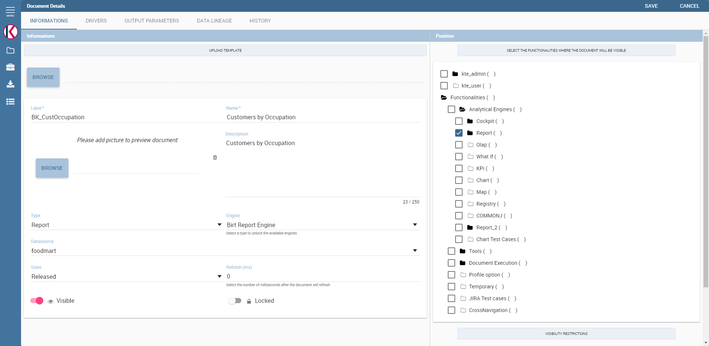
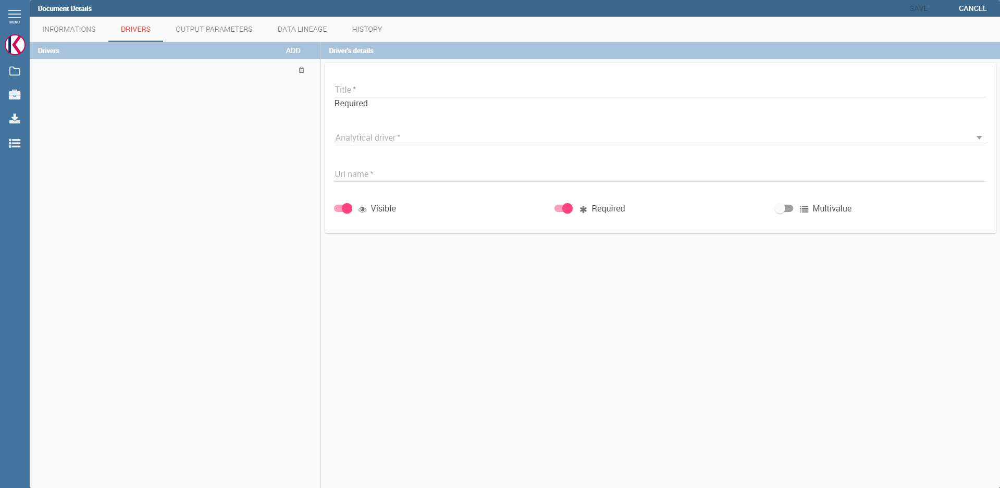

Analytical Document
===================

The *analytical model* is the core of Knowage Server and covers the whole range of analytical needs, providing many solutions for each analytical area, like reports, charts, OLAP documents, KPIs and so on.

The main element of the analytical model is the so called *analytical document*, a word used to group under a common concept all different types of documents that can be developed with Knowage (report, chart, cockpit, etc.) when performing a BI analysis.

In this chapter we describe step by step how to create a new analytical document. There exist many different document types, each with its own peculiarities. Here we provide a generic overview on common features, will focus on available types peculiarities in each dedicated part.

Main concepts
-----------------

The creation and management of analytical documents in Knowage involves different elements:

Template
  The template defines the standard layout of a document, including specific information on its appearance and the way contents should be displayed. Templates can be encoded by hand or using Knowage Studio designers, when available. For each analytical document the history of templates is maintained. Old templates can be restored if needed. A new version is saved at each deployment, either manual or from Knowage Studio.
Dataset
  Each document is associated to one or more datasets. The dataset provides actual data that will be represented according to the defined template. That is to say, the dataset provides the actual content of the analysis and the template is in charge of giving it a meaningful structure.
Data source
  In order to retrieve data via the dataset, a source of information must be defined. Depending on the type of document, the data source may be associated to the document either directly or implicitly (via the dataset).
Parameters
  Parameters allow the connection between the document and analytical drivers associated to it. In other words, at document execution time, each driver generates a value that is assigned to the corresponding parameter.

These elements are then combined inside each document engine, in order to produce different analytical documents. This process generates an HTML output, which can be accessed and navigated using a web browser.Other output formats are supported, including XLS, CSV, PDF, XML.

.. figure:: media/image57.png

   Components of Knowage analytical document.

Document types
~~~~~~~~~~~~~~

Regardless of their type, all analytical documents interact with some generic components (such as cross-services) and with the specific engine that generate them (e.g. Report engine, OLAP engine). Therefore, all analytical documents are managed in the same way in terms of:

-  document storage and versioning;
-  document life cycle, based on a specific approval process including different status (development, test, released, suspended);
-  multiple positioning on the repository and indirectly first visibility level;
-  rules to restrict document visibility to some end user profiles;
-  management of analytical drivers;
-  multi-format export logic;
-  attribution of business metadata;
-  scheduled execution;
-  collection of auditing and monitoring data;
-  adding end user notes;
-  adding bookmarks;
-  end user evaluation;
-  sending the document by email;
-  on-line or off-line (scheduled) execution.

This means that the above mentioned features are also inherited by every new engine that is developed or integrated into Knowage.

In the next sections we describe in detail how to create and manage analytical documents in Knowage.

Register an analytical document
-----------------------------------

There are two different ways to create a new document on Knowage Server. The first option involves Knowage Studio: within it you can simply click on **Deploy** and the document window will open with pre-filled options. Please note that Knowage Studio can be used to create Birt or Dashboard document only.

.. note::
    **Deploy a document from Knowage Studio**
      
    Knowage Studio is the tool that allows to design and upload documents onto Knowage Server. Please refer to the dedicated section for full details and examples.

The second option is to manually create the document on the Server. This is the most general way since the Studio designer is not yet available for all documents types.

Analytical documents on Server
~~~~~~~~~~~~~~~~~~~~~~~~~~~~~~

First of all click on **Document Development** from the BI functionalities menu, as shown .

.. figure:: media/image58.png

    Documents Development button.

By default the page is divided into two parts, as shown in figure below: in the left side there is the functionality tree representing the folder structure, while on the right you can see the list of all documents contained in the selected folder.

.. figure:: media/image59.png

    Documents Development section.

You can switch to the document preview view by clicking on grid icon in the top right corner, as shown in figure below.

.. _changingdocumentsview:
.. figure:: media/image60.png

    Changing documents view.

Each line shows the label, the name, the author and the type of the document, while the play button at the end of each row executes the document. Moreover, clicking on a line opens a side panel on the right of the page. Here you can see more metadata information such as the document description, the state and the creation date.

.. figure:: media/image61.png

    Side panel.

At the top of this side panel you find four button:

- |image60| execute the document;

.. |image60| image:: media/image62.png
   :width: 30
   
- |image61| access document details;

.. |image61| image:: media/image63.png
   :width: 30

- |image62| clone the item;

.. |image62| image:: media/image64.png
   :width: 30
   
- |image63| erase the document.

.. |image63| image:: media/image65.png
   :width: 30

The figure below shows the detail panel of a document. On the left, document details are shown, including name, type, dataset and state. On the right, you can alternatively see either the history of document templates or the functionality tree and the document position. If you want to copy or move a document from a folder into another, check or uncheck the corresponding folders (see the last figure of the *Document Visibility* paragraph).

.. _detailpanelofknowanalydoc:

    Detail panel of Knowage analytical document.

In order to create a new document you need to click on the red plus button in the top right corner of the **Document Development** page. The different types of documents that you can create are: **Geo-Referenced Analysis**, **Cockpit** and **Generic Document**. Please note that not all of them are available in all Knowage products.

To create a new generic document click the above-mentioned button and select **Generic Document**. You will be shown a window like the one in figure above but with empty fields, in order to allow you to define the document details.

First of all, choose a label, a name and a description. It is important to point out that the label is the unique identifier of the document in Knowage Server. Then, select the type of document and the appropriate engine from the drop down menus, according to the document you are developing (see figure below).

    Select Type and Engine for a new document.

Now you have to select the dataset and data source that will feed your document with data, see the following figure .

    Selecting a dataset for the document.

Both should have already been defined in the corresponding sections for Knowageto show them in the available options of the menus. Select the data source from the drop down menu. Then click on the green icon |image67| and select the dataset from the lookup window.

Note that some types of document do not require the definition of a dataset at this point because they use embedded datasets. Depending on the type, it may also be necessary to select the data source.

It is advisable to regularly save the document in this process, by clicking the related icon at the top right corner of the window.

Document lifecycle
^^^^^^^^^^^^^^^^^^

The next step is to choose the status of the document using the **State** drop down menu. At any time in fact, each document is   associated to a state, which will typically change over time following the development of the project. Those states are:

-  development;
-  test;
-  released;
-  suspended.

Upon creation, the document is by default in development state. Any time you upload a new template or make changes to the document, it is recommended that the state is updated so as to reflect its actual development state.

The main reason for this is that the state of the document has an impact on its accessibility. As discussed in the behavioural model,  Knowage defines role types (administrator, developer, tester, user). States are compatible with the corresponding role type. Administrators can change the state of documents at any time. Developers can not access only the documents with test state. Testers   can not see documents in development or suspended state. Users can execute only documents in released state. Note that a tester may   change the state of a document from test back to development.

.. important::
         **Enterprise Edition only**

         In KnowageER you may also decide to temporary "lock" a document while he is working with it: it is enough to set the **Lock by user** item. This prevent other developers from modifying the same document you are working on.

Template Versioning
^^^^^^^^^^^^^^^^^^^

When you register a document on the Server, you need to associate a template to it. Click on **Browse** next to **Template** and upload the template from your local file system. You may have edited the template by hand or using the Studio designer. Clearly you will not have to upload the template if you are using the automatic deploy from the Studio.

Knowage Server supports versioning of uploaded templates, as shown below. To view them in the document detail window, click on **Show document templates** in the right panel. All templates are saved with their date and name, and can be easily restored or deleted. To restore a template, choose it in the list by clicking on the selector, then remember to save: the new template will be uploaded. Using the same list you can download or delete a template.

.. _templateversionforanalydoc:
.. figure:: media/image70.png

    Template versioning for analytical documents.

Document Visibility
^^^^^^^^^^^^^^^^^^^

After having defined all details, you need to choose where the analytical document shall be saved in the functionality tree. This   choice has an impact on the visibility of the document. Since folders in the functionality tree are subject to different access policies, which can be set when creating the node, then each document saved in that folder will inherit permissions accordingly.

.. warning::
      **Repository structure and rights**
         
         The **Functionalities tree** is Knowage document repository. It is maneged by administrator, who is in charge to profile user visibility too.

Note that the same document can be saved in different points of the functionality tree. This allows the administrator to make the   document accessible to multiple roles based on visibility rules defined for the containing folder(s). To save your document in the   repository, switch the perspective on the right panel by clicking on **Show functionalities tree**. This operation is needed only if you  moved to the template history view. Here you can choose where you wish to save the document, by ticking the corresponding folder in the  tree. If you wish to save it at multiple locations, tick all of them before saving. Each user having access to the containing folder will see the document.

.. _functionaltreedocsav:

    Functionality Tree, document saving settings.

Visibility rules
---------------------

In addition to the standard mechanism supported by the functionalities tree, it is possible to further customize access to a document based on user profile attributes. This allows administrators to rule access to documents at a very fine-grained level, beyond simple repository-based policies.

This can be done by editing conditions in the Visibility section of the detail panel. To add a new condition pick a profile attribute   from the drop down menu, assign it a value, then click on |image71|. This will add a new condition that must be verified to allow a user to access the document. In the same way you can add further conditions, and possibly remove all of them by clicking on the eraser.

.. |image71| image:: media/image72.png
   :width: 30

Association with analytical drivers
----------------------------------------

We have already discussed the role of analytical drivers and how they are connected to analytical documents via parameters. In this section we will show how to practically define this association.

We assume that the document template and datasets are correctly set in terms of parameter definition. In particular, they should have   been correctly referenced with their URL.

To add a new parameter, you can start editing the tab in the lower part of the document detail panel, see the next figure.

Choose a human readable name for the title. Then click on the lookup icon |image72| to choose the driver you wish to associate to the   document. This will open the driver lookup window, where you can select the driver by clicking on the green icon |image73|. You can   also inspect or delete a driver from here.

   

   
.. _assocwithanalydriv:

    Association with analytical driver panel.

Once you have selected the driver, you should write the **exact URL** of the corresponding parameter. Then set the different features   associated to the driver: you can set its visibility and decide if it is mandatory and multivalue. By default the parameter is visible, not mandatory and not multivalue.

If you want the document not to be visible to end users, untick the **Visible** checkbox. Note that the parameter will still exist and   receive values from the associated driver. However, this will be hidden and the end user will not be able to choose any value for this   parameter.

If you want to set it as a mandatory parameter just click on **true**. In this case, no default value is set. The end user will be   asked to choose the value of the parameter before opening the document.

Similarly to set a parameter as multivalue click on **true**, in this way the user can perform multiple selections on among its values.

Remember to save each time you have completed the definition of a parameter before adding a new one. To add further parameters, click   on the **New** icon. Repeat the same procedure how many times you wish. At this point you may wish to change the order of parameters   (i.e., how they are presented to the user). To do so, modify the **Priority** number. In the following we will see some special operations that can be performed on drivers associated to a document.

Associating a Spatial driver
~~~~~~~~~~~~~~~~~~~~~~~~~~~~

As just seen, to filter on data visualization a user needs to associate an ananlytical driver using the "Document analytical driver   details" area. As well as for the other driver you can use this interface to associate a spatial driver to the document. The procedure is right the same. When launching the document and opening the filter panel you will find the filter just set. Click on the icon   |image75| to open the map and select the geometric object (the ``State`` in the example in figure below) according to the chosen layer and property.

.. |image75| image:: media/image76.png
   :width: 30

.. figure:: media/image77.png

    Map filtering selection.

Click on "Close" button to confirm your selection. An example of the output is shown in the following figure.

.. figure:: media/image78.png

    Example of document run with a spatial filter.

Correlation between parameters
~~~~~~~~~~~~~~~~~~~~~~~~~~~~~~

In the context of a document, two different parameters may be connected to each other: this means that the possible values of a   parameter are limited by the value(s) of another parameter.

This feature can be useful when two (or more) parameters are logically related. For example, suppose to have a parameter for all   the possible countries and another one for all the possible cities. If the user selects a region, it is meaningless to show him all cities: he should only be enabled to choose among the cities in the selected region.

In general, to configure a correlation within a document you should make sure that the LOV associated with the parent parameter and the  one associated to the child parameter share at least one column. This column defines which value from the parent parameter will be applied to the child, in order to constrain the results.

.. figure:: media/image79.png

    Definition of the correlation.

To set the correlation, click the tab of the child parameter and displaying the details click on the correlation button |image79|.   Here you can add a new correlation rule by clicking on |image80|. Here you need to define:

.. |image79| image:: media/image80.png
   :width: 30
   
.. |image80| image:: media/image72.png
   :width: 30

-  the parent parameter;
-  the type of logical operator, in order to compare values of the parent parameter with values of the child parameter;
-  the column, generated by the child parameter, whose value will be compared with the value of the same column in the parent   parameter.

If a parameter depends on multiple parent parameters, you can define multiple correlations. Create the needed correlations and choose how they are logically connected (via AND / OR operators) as shown in figure below.

    Multiple correlations.

If needed, you can insert or remove parenthesis at the extremes of each line clicking on the two green plus and minus icons.

Once defined the correlation, the child parameters will display the labels during the runtime in italics.

Correlation through LOV and drivers
~~~~~~~~~~~~~~~~~~~~~~~~~~~~~~~~~~~

In previous sections we saw how to set correlation through the GUI available in the document detail panel, but there is also the   possibility to get the same result using the link between LOV and analytical drivers. More in depth, the user must have previously   configured a driver that runs values that can be used in the "where" clause of a SQL query. Then the user must set a query-type LOV using the syntax 

We stress that the ``AD_name`` is the name of the driver the administrator is trying to reach. Syntax for setting correlation through LOV configuration is:

.. code-block:: bash
  :caption: Syntax for setting correlation through LOV configuration 
  :linenos:
  
   $P{AD_name}

.. figure:: media/image82.png

    Correlation passing driver values to LOV query .

As a result, at document execution, as soon as the user pick up a value from the "free" parameter, the other one is filtered and will   show only the value related to the previous selection, as shown in Figure below.

.. figure:: media/image83.png

    Filtering with correlation.

Controlled visibility
~~~~~~~~~~~~~~~~~~~~~

Another type of relation between parameters is supported by Knowage. It is possible to define values of a parent parameter that force the hiding or showing of a child parameter in the parameters mask. Note that in the first case, the child parameter is hidden by default, while in the second case the parameter is shown by default.

To set a visibility expression, click always on the correlation button in the detail tab of the desired parameter, but then click on   the plus icon |image84| in the **Visibility Expression** area. In the graphical editor you can define visibility rules similarly to   correlation ones, as shown in figure below.

.. |image84| image:: media/image72.png
   :width: 30

.. figure:: media/image84.png

    Visibilty expressions.

Cross Navigation
---------------------

A powerful feature of Knowage analytical documents is cross-navigation, i.e., the ability to navigate documents in a browser-like fashion following logical data flows. Although crossnavigation is uniformly provided on all documents executed in Knowage Server, each type of document has its own modality to set the link pointing to another document.

Notice that the pointer can reference any Knowage document, regardless of the source document. For example, a BIRT report can point to a chart, a console, a geo or any other analytical document.

In Knowage there are two main typologies of cross navigation: *internal* and *external*.

*Internal cross navigation* updates one or more areas of a document by clicking on a series, a text, an image or in general on a   selected element of the document.

*External cross navigation* opens another document by clicking on an element of the main document, allowing in this way the definition of a *navigation path* throughout analytical documents (usually, from very general and aggregated information down to the more detailed and specific information)). Indeed, you can add cross navigation also to a document reached by cross navigation. This can be helpful to go deeper into an analysis, since each cross navigation step could be a deeper visualization of the data displayed in the starting document.

It is obviously possible to associate more than one cross navigation to a single document. It means that by clicking on different elements of the same document the user can be directed to different documents.

In this chapter we will examine in depth how to set output/input parameters on documents and, consequently, how to activate the cross navigation.

The first step is to define the parameters of the target document. These do not necessarly coincide with all the filters applied to the
document. Please refer to Chapter of Behavioural model for more detail on how to manage parameters and their association to documents.

Therefore it is required to state which parameters among the ones associated to the target document are going to be involved in the   navigation. Parameters coming out from the source document are said **output parameters** while the ones that receive values through the association (with the source document) are said **input parameters**. By the way, when declaring the parameters they will be called equally **output parameters** at first, since there is no criterion to distinguish output from input before the navigation is configured.

The definition of the output parameters is performed using the **Manage outputparameters** button but it differs   from document to document, according to its type. We will describe these differences in detail in each dedicated chapter, here we   explain the common steps.

Declaration of the output parameters
~~~~~~~~~~~~~~~~~~~~~~~~~~~~~~~~~~~~

Enter the **Document details** of the document of interest. Then click on **Manage outputparameters** and the **Output parameters**   dialog will open.

Here you have to state which parameters are going to be used as output parameters. If, for instance, you select the Date type (see next figure), it is possible to choose the format in which your date has been coded. The default value is related to the location defined in   (**Menu** > **Languages**).

.. _settinganotuparam:
.. figure:: media/image85.png

    Setting an output parameter.

Cross navigation definition
~~~~~~~~~~~~~~~~~~~~~~~~~~~

Finally you need to select the **Cross Navigation Definition** item from the menu to configure the cross navigation. The figure below shows the cross navigation definition window.

.. figure:: media/image86.png

    Cross navigation GUI.

It is required to give a name to the navigation; then select the document from which to start the navigation and the target document. The selecting of a document will cause the loading of input/output parameters related to the starting document in the left column and of the possible input parameters of the target document in the right column.

It is possible to configure the associations betweeen input/output parameters by simply dragging and dropping a parameter from the left column on another of the right column.

.. figure:: media/image87.png

    Setting the cross navigation through the tree item.

.. figure:: media/image88.png

    Relating parameters.
   
Once set, the association is highlighted as in Figure below.

.. figure:: media/image89.png

    Association betweeen parameters.

To assign fixed values to target parameters it is necessary to edit first the box labeled **Fixed value parameter** and click on the **plus** icon. Then the value can be associated as fixed value of the one or more target parameters. Remember to click on the **Ok** button to save the cross navigation just set.

As you know, it is possible to define multiple cross navigation starting by the same document. In this case the system will show a popup window to choose the one that you want execute. 
It is possible set a specific description for each cross navigation so that will be easy to recognize the right navigation definition to use. In the same way it is possible set the text of the bread crumb and personalize it. 
For both attributes it is possible show parameters (of input or output type) values through the syntax $P{parameter_name}. Just parameters of source documents are available.

.. figure:: media/image90.png

   Example of parametric description and breadcrumb text
   
.. figure:: media/image91.png

   Example of popup selection for more cross navigation definition (with params)
   
.. figure:: media/image92.png

   Example of breadcrumb with params
