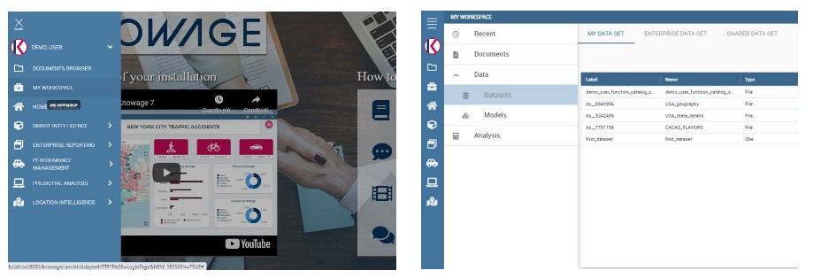
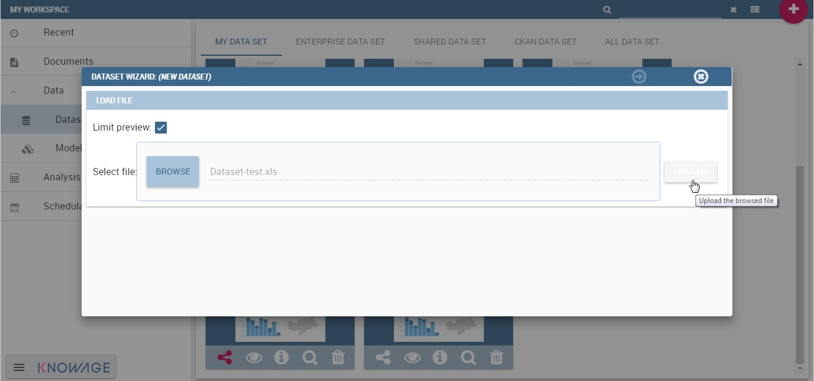
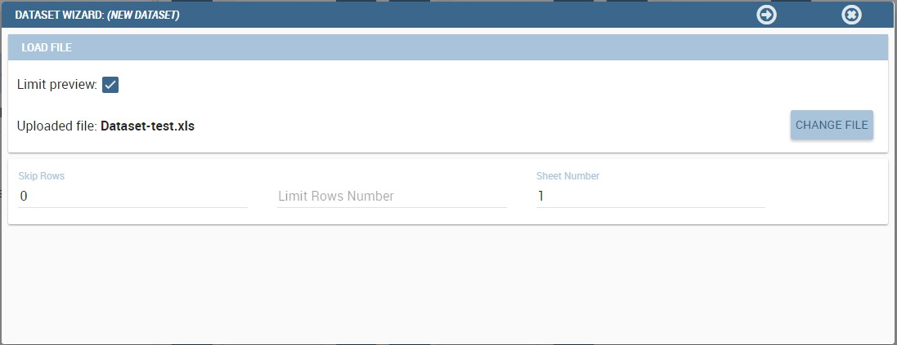
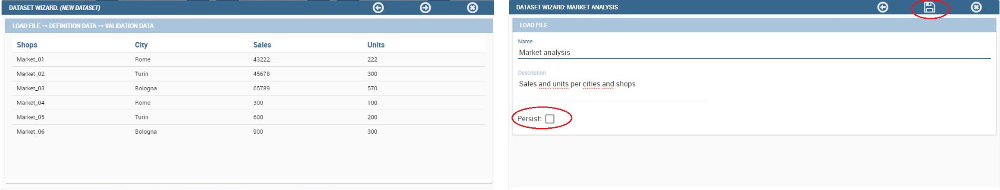
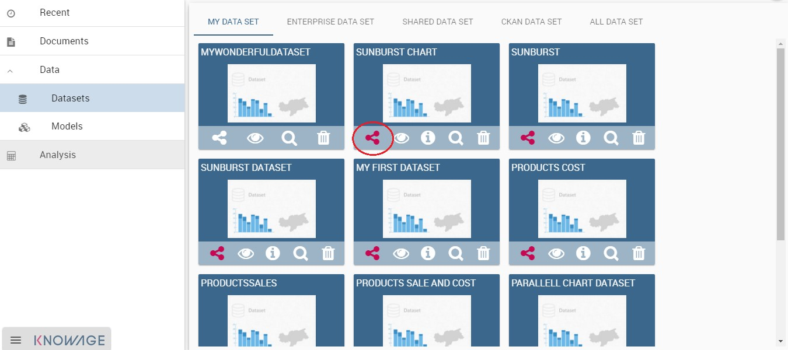
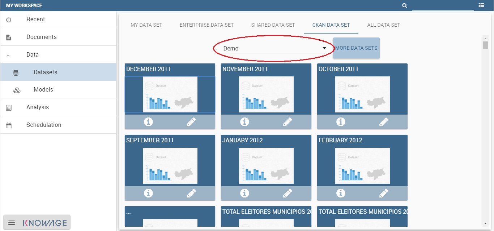
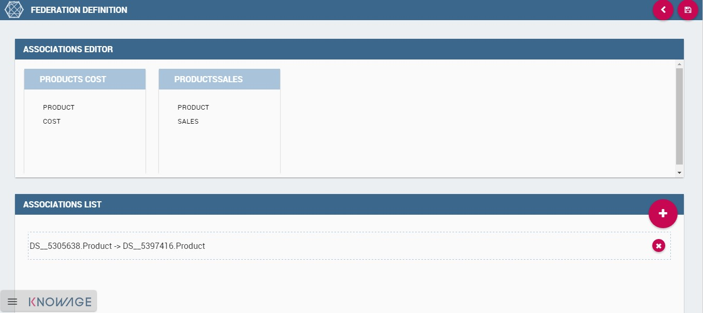

Basic Data Access
===================

A dataset is a way to read data from different sources and represents the portion of data used by various documents. Inside Knowage it plays a crucial role to develop analytical documents such as the interactive dashboards, reports and map documents. In particular, it is the main way to let the unskilled user make his/her own analysis. In fact he/she can create his/her own dataset uploading an XLS or a CSV file or use a dataset already defined. Knowage offers also the chance to download open data from WEB thanks to CKAN integration. Moreover it is possible to can create more complete dataset from different sources through the dataset federation functionality. 

We highlight that this chapter describes basic but also advanced features which are available only in KnowageBD and KnowageSI products.

.. important::
         **Enterprise Edition**

         If you purchased Knowage EE, the advanced features explained in this chapter are available only in KnowageBD and KnowageSI products

Let us suppose to enter, with end user credentials, the data management area clicking on the **Workspace** icon from BI functionalities menu as shown in figure below and the **Data** section of the window.

    Access to **My Data** area

Afterward you have the subsections: **Dataset** and **Models**. Select **Models** to explore the models and the **Dataset Federation** area. Please note that the **Dataset Federation** functionality is available only in KnowageBD and KnowageSI.

Dataset
--------

Into the “Dataset” area we find all the datasets classified according to their types. The datasets are categorised as follows:

- **My dataset**: datasets created by the end user that made the access, uploading a CSV or XLS file or creating a query on a business model using the Qbe interface;
- **Enterprise dataset**: certified datasets, namely datasets created by the technical/experts users and shared with the end user.
- **Shared dataset**: datasets created and shared by other end users (with the same role);
- **CKAN dataset**: in this area it is possible to download public datasets and visualize then in the CKAN datasets area;
- **All dataset**: in this folder all previous datasets are stored, namely all datasets contained in the classes just described.

My dataset
~~~~~~~~~~

In this area the end user can create datasets uploading his/her own files.

Click **Create Dataset** to open the dataset wizard which guides you through the dataset creation. It is possible to choose between XLS or CSV file as in the following figure.

.. _datasetcreation:
.. figure:: media/image7.png

    Dataset creation.

In the example shown in the next figure, we upload an XLS file.

.. _uploadingxlsdat:

    Uploading XLS for dataset.

The wizard, shown below, leads the user to insert some information to configure the dataset. For instance to specify the number of rows to skip or to limit and which sheet (of the XLS file) to pick up values from.

.. _configfeatures:

    Configuration features.

Once the file has been uploaded, it is important to check and define the metadata (measure or attribute) for each column. To switch a measure to an **attribute** (or viceversa), click on **Value** column of the interested row field as shown below.

.. figure:: media/image101112.png

    Change metadata.

Just few steps before saving the dataset:

-  Check the data preview in order to verify the accuracy of data;
-  enable or disable the persistence of dataset. Thanks to this functionality the server creates a snapshot of the extracted data in order to avoid to reload the dataset each time that the user revokes it;
-  finally, name and save the dataset as shown below.

    Saving dataset.

As we discussed previously, all created datasets are available under **My dataset** area. Here it is possible to share/unshare them by clicking on the **share** icon (have a look at the next figure). The colour of the icon changes from white to red when sharing is turned to active. A shared dataset is visible to all other users having your same exact role.

Note that dedicated area “\ **Shared Dataset**\ ” contains all acquired datasets thanks to the sharing of other users.

.. _sharedataset:

    Share a dataset.

CKAN integration
~~~~~~~~~~~~~~~~

Thanks to CKAN integration it is easy to have access to datasets published in the World Wide Web (e.g. datahub.io, data.gov, data.lab.fiware.org, dati.gov.it, and more). Indeed, CKAN is the world’s leading open-source data portal platform. It is a powerful data management system that makes data accessible by providing tools to streamline publishing, sharing, finding and using data. CKAN is addressed to data publishers (national and regional governments, companies and organizations) who want to make their data open and available. So you can search and handle open data in a self-service manner.

.. warning::
      **CKAN Datasets**

      CKAN datasets can be divided into four main categories: “Public”, “Organization private”, “Acquired”, “User private”. Remember to download and use only the datasets having a **Public** category.

CKAN datasets access method
^^^^^^^^^^^^^^^^^^^^^^^^^^^

To start using CKAN datasets inside Knowage suite, go to the **CKAN Dataset** tab in the “Dataset” subsection of “Data” section under “My Workspace”. As shown in figure below,the user has to choose the repository from the combobox and then click on the repository name to access it.

    CKAN Repositories.

A preview of datasets stored in the chosen repository will be shown.

At this point data are not usable yet, but he/she can start to handle them as we will show in the following sections. The datasets are shown with their name and description. By moving the cursor over a dataset, a list of available actions will appear. Clicking on the **Info** button, a set of information from the original CKAN resource and about the dataset status (e.g. visibility, last modification date) ill be displayed by Knowage, as in the following figure. To use one of them the user has to import metadata information and then analyse the dataset on demand.

.. figure:: media/image17.png

    CKAN dataset details.

Export dataset
^^^^^^^^^^^^^^

Note that once the dataset has been created, the user may find useful to get an excel from it. Knowage has designed a specific button to fulfil this need that the user can find exploring the detail panel of the dataset, as reported below.

.. figure:: media/image18.png

    Export dataset.

Save and handle dataset
^^^^^^^^^^^^^^^^^^^^^^^

If the user is willing to want to use a dataset not used yet, any action on it will start the metadata import wizard. The access is made by clicking the magnifier icon. As a first step, the user must insert some mandatory parameters to set the parser configuration.

As a second step the user have to specify how the dataset will appear and to check metadata. Be careful to choose the proper data type (String, Integer, Double) and field type (Measure, Attribute). After that, click on **Next** to see the validation results, confirm and finalize dataset import. Once completed the dataset importation, the selected dataset will appear in the **DataSet** tab too. These actions just listed on the dataset change for downloaded datasets. In particular use the eye-shaped icon to refresh the dataset or change metadata by repeating the download process and the magnifier icon to inquire it through the QbE interface.

Models
----------

Here there are the models that the a technical user has built for the end use that can query it using the QbE interface and create his/her own dataset from them.

Dataset federation
----------------------

Dataset federation is a functionality available only in KnowageBD and KnowageSI. Thanks to the Data federation functionality, you can create a new dataset combining two or more datasets according to your role permissions. Let us give you an example. Suppose you have stored in a database your products information (i.e. sales, costs, promotions ecc.) and you find as open data the customers feedbacks on these products. If you create datasets on these Dataset federation resources sharing at least one column, then you can join them on the common column and improve your analysis.

Click on **Create Federation** to see all available datasets and choose the ones you want to federate. Click **Next** and choose which columns the join have to be made on and click the plus icon to add it to the **Association list**. In our example in the following figure we choose Product.

     Federated dataset details.

Once saved, The new federation has been created in **Federation definition** and you can find it in Federation definition. Open it by clicking the magnifier icon on the federation. In this way you open it with QbE tool. All details on how to use the QbE interface to perform free inquiries can be found in the dedicated chapter. You can create new datasets, save them and retrieve them from the **Dataset** section.
