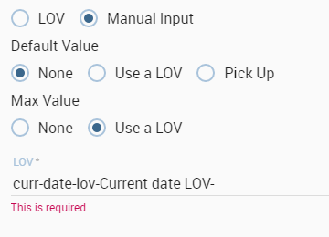
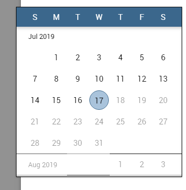

# Modelo de comportamiento

Un tema importante a enfrentar antes de iniciar un nuevo proyecto es cómo crear y gestionar los llamados *modelo conductual*.

El *modelo conductual* regula la visibilidad de documentos y datos según los roles y perfiles de los usuarios finales.

Responde principalmente a las siguientes preguntas:

*   La OMS utiliza la solución de inteligencia empresarial (perfil de usuario);
*   LO que es visible para los usuarios, en términos de documentos y datos (derechos de repositorio y controladores analíticos);
*   CÓMO trabajan los usuarios con sus documentos (controladores analíticos y configuración del entorno de presentación).

La creación y la gestión del modelo de comportamiento corre a cargo de Knowage Administrator. Sin embargo, cuando se ha diseñado y construido, también debe compartirse con los desarrolladores. De hecho, en la fase de desarrollo hay que ser consciente de la jerarquía de visibilidad. Necesita esta información para establecer correctamente las opciones del documento.

## Roles, usuarios y atributos

Los usuarios de Knowage se definen por:

*   Identidades
*   Papeles
*   Perfiles.

El *identidad* de un usuario consiste en todos los datos utilizados para identificar a ese usuario, es decir, un nombre de usuario y una contraseña, así como un nombre completo legible por humanos.

El *perfil* de un usuario consiste en un conjunto de propiedades llamadas atributos, que describen información general sobre el usuario, por ejemplo, edad y sexo, pero también propiedades específicas del dominio, como la unidad organizativa a la que pertenece. Algunos atributos, como el nombre y el correo electrónico, se definen de forma predeterminada en Knowage. Otros pueden ser agregados por el administrador del modelo, como se explica en las siguientes secciones.

El *rol* de un usuario representa una categorización de un grupo de usuarios. Estos roles pueden corresponder a puestos específicos en la empresa, por ejemplo, "gerente general" o un "director de ventas", o a un puesto con respecto al proyecto de BI, por ejemplo, "administrador de datos" y "desarrollador de BI". Diferentes usuarios pueden tener el mismo rol, así como el mismo usuario puede tener múltiples roles.

No tendrá subvenciones para crear nuevos roles o usuarios, pero se le pedirá que los haga coincidir durante las fases de profanación de documentos. A continuación vamos a describir los elementos necesarios para añadir parámetros. Estos elementos también implican la profilación. Para concluir veremos cómo gestionar la accesibilidad a la hora de crear un documento.

## Controladores analíticos

Un controlador analítico (en adelante, simplemente conductor) modela un concepto o un dato utilizado con frecuencia como criterio distintivo en el contexto global de datos. Un conductor destaca los conceptos que guían el análisis, proporcionando una representación única de ellos y describiendo cómo se muestran y comprueban de acuerdo con los roles de los usuarios finales. Cuando se conecta a documentos analíticos, un controlador produce un parámetro explícito o implícito utilizado para filtrar datos.

.. \_parametrreportbehav:
.. figura:: media/image39.png

    Parametric Report.

La figura anterior representa un informe con dos parámetros:

*   el Departamento, un campo obligatorio, que se muestra como un cuadro combinado y con posibles valores: Bebidas alcohólicas, Productos horneados, Productos de panadería, etc.;
*   el Rango de edad, un campo obligatorio, que se muestra como lista de valores y con posibles valores 0-10, 10-20 y así sucesivamente.

Todos estos aspectos están regulados por el controlador analítico detrás de cada parámetro. En particular, cada conductor proporciona muchos *modos de uso*definitorio:

*   Quién está involucrado en un modo de uso específico, en términos de una lista de roles de usuario final, teniendo en cuenta que un rol puede asociarse a un solo modo de uso.
*   A qué datos puede acceder y cómo se presentan al usuario final para su posible selección. Esta información es proporcionada por el llamado *Lista de valores (LOV)*.
*   Cómo comprobar la validez de los valores elegidos. Esta información es proporcionada por el llamado *Comprobar*.

En otros términos, cada modo de uso se refiere a un método de visualización inicial y contenido (LOV), a una o más reglas de validación (check) y a uno o más roles de usuario final (roles). La lógica de un controlador se representa en la figura siguiente.

.. figura:: media/image40.png

    Analytical driver schema.

Consideremos el siguiente ejemplo. Necesitamos representar el concepto de "familia de productos". Dado que este es un impulsor común y discriminatorio para el análisis empresarial, se codificará un controlador analítico, con todas sus reglas de comportamiento, tales como:

*   si el usuario es un operador de centro de llamadas o un usuario que proporciona soporte interno, puede escribir manualmente la familia de productos que desea seleccionar. Este valor se verificará formalmente (debe ser un texto) y se verificará en el registro de la familia de productos.
*   si el usuario es un director de marca de producto o un secretario operativo, puede elegir el valor de una lista precargada de todas las familias de productos pertenecientes a su marca. Por esta razón, el valor no necesita ninguna comprobación.

.. figura:: media/image41.png

    Analytical driver schema - Example.

Una vez definido, un conductor puede relacionarse con muchos documentos, impulsando su comportamiento y filtros de una manera común. De esta manera, un usuario que ejecuta diferentes documentos que utilizan los mismos controladores siempre recibe el mismo formulario de parámetros, aplicando los mismos filtros sobre los datos mostrados. De hecho, cuando un usuario autenticado (con sus roles y perfil) ejecuta un documento analítico, se leen sus metadatos técnicos, principalmente en términos de plantilla de documento y controladores relacionados. En base a ellos, se produce una página personalizada para la entrada de parámetros, de acuerdo con la lógica del controlador para el rol de usuario final. Los valores seleccionados se validan y el resultado final llega al usuario. La siguiente figura muestra este proceso.

Gracias a los controladores analíticos, un solo documento es capaz de cubrir las demandas analíticas de varias categorías de usuarios, con ventajas notables en términos de:

*   reducción del número de documentos que deben elaborarse y mantenerse,
*   coherencia en la solicitud de parámetros,
*   reducción de la complejidad en el desarrollo de documentos, gracias a la separación entre cuestiones de seguridad y desarrollo masivo,
*   simple mantenimiento de la seguridad (visibilidad sobre los datos) a lo largo del tiempo, a pesar del aumento de documentos desarrollados o motores añadidos.

En los siguientes párrafos explicamos cómo crear un nuevo controlador analítico junto con sus componentes básicos.

.. \_overallprocess:
.. figura:: media/image42.png

    Overall process.

Creación de una lista de valor

```

A *List Of Value* (LOV), is a collection of data organized in attribute-value fashion. For example, the LOV in LOV example retrieves id, name and food family for a product.

.. code-block:: bash
   :caption: LOV example
   :linenos:

    {195, High Top Almonds, Food};
    {522, Tell Tale Walnuts, Food};
    {844, Very Good Soda, Drink};

There may be multiple attributes in a LOV, but only one of them is the core value that is actually used in the analytical driver. Other  values have a descriptive function: they can be used to provide a human readable description of the LOV, as well as to store information used, for example, to correlate analytical drivers. In our example, the core value is the customer’s id, while the others are additional data describing the customer. Knowage allows to create different types of LOV:

-  **Query**: SQL query to retrieve values from the database;
-  **Script**: Groovy or JavaScript to dynamically return values;
-  **List of fixed values**: Values are defined statically at LOV creation time;
-  **Java objects**: External object invoked by name that returns the list of values;
- **Dataset**: Dataset already defined in Knowage Server that is used to retrieve values. Note that the dataset must not contain parameters, while profile attributes are allowed.

.. _lovlistbehav:
.. figure:: media/image43.png

    LOV list.

To create and manage LOVs, select **Behavioural Model** > **Lovs Management** from the developer menu. The entire list of available   LOVs appears, as shown in figure above. For each LOV, the list shows the label, description and type; to see the details of a LOV the user  must simply select it and they will appear in the right half of the page. On the contrary, to delete one dataset click on the icon |image37| available at the end of the row. Notice that you cannot delete a LOV if a driver is currently using it.

.. |image37| image:: media/image44.png
   :width: 30

To create a new LOV, click on the icon |image38| at the top right corner of the page. The LOV creation interface will open, where you   can set label, name and description, choose the LOV type and define its values accordingly.

.. |image38| image:: media/image45.png
   :width: 30

.. figure:: media/image46.png

    LOV Creation interface.

Once completed the form, click on **Preview** button to enable the **Test** button. Notice that you cannot save the LOV without testing  it, since this allows to detect errors before the LOV is actually used in a driver and associated to a document. After testing, you will be able to define which column is the actual value of the LOV, i.e., which value will be passed to the analytical driver using this LOV. Only *one* column can be the value attribute and only *one* column can be chosen as Descriptive attribute, while the others can be visible. The two figures below exhibit an example. Columns that are not visible can be used for correlating drivers.

.. _previewandteslov1:
.. figure:: media/image47.png

    Preview and Test of the LOV.

.. _previewandteslov2:
.. figure:: media/image48.png

    Preview and Test of the LOV.

.. note::
     **Correlating analytical drivers**

     Drivers can be correlated so that the value of the first driver is used as a parameter to select values in the second. Read more at *Analytical document* chapter.

We stress that the visibility of specific fields serve to improved human readability when applying filters to documents handled by third users. Moreover it is possible to choose (refer to next figure) between **simple**, **tree** and **tree with selectable internal nodes** typology of LOV. The last two are hierarchical and let the user visualize the parameters together with their logical tree structure.

.. _hierarchicallvdef:
.. figure:: media/image49.png

    Hierarchical LOV definition.

.. note::
     **Create a LOV for the default value of an analytical driver of type Manual Input Date**

     This note is useful when using an analytical driver of type Date with an input of type Manual. In the case you want to use a particular date as default value for that driver, you have to use this syntax for the LOV: select '2017-09-10#yyyy-MM-dd' as fixed_date. Instead of the fixed date 2017-09-10 you can also use as default date the today date for example; in this case you can use a query of this type: select concat(to_date(now()) ,'#yyyy-MM-dd') as today. The most important thing is to concat to the default date you want to use the string #yyyy-MM-dd.

.. note::
    **Create a LOV for the default value of an analytical driver with a hierarchical LOV**

    In case you want to add a default value to an analytical driver with an input of type hierarchical LOV you need to use another hierarchical LOV with the default values desired. If the analytical driver LOV is of type *Tree* then the default LOV need to be of type *Tree* too. The LOV need to have values for the leaf level only. Otherwise, if the analytical driver LOV is of type *Tree selectable inner nodes* the default LOV need to be of the same type. The default LOV may have values for one of the level used in the hierarchical LOV. For example, suppose you have an analytical driver with a hierarchical LOV having levels Product Family > Product Category > Product Department. If the hierarchical LOV is of type *Tree* then in the deafult LOV you need to insert one or more values for the level Product Department. Your default LOV have one level, the Product Department. In case the LOV is of type *Tree selectable inner nodes* you can choose one of the three levels. Your default LOV have one level between Product Family, Product Category or Product Department.

Parametrizing LOVs
~~~~~~~~~~~~~~~~~~

Suppose that you need to retrieve a list of values representing all brand names of your products. Then you can use a Query LOV like in  Query LOV example:

.. code-block:: sql
         :caption: Query LOV example
         :linenos:

          SELECT DISTINCT PRODUCT_FAMILY, BRAND_NAME
          FROM PRODUCT

This is suitable for end users like the general manager who need to see all brands for every product family. Suppose now that another end user is, for example, the food manager. He should not see every brand name, but only those related to the Food product family. This could be done using user’s profile attributes.

In particular, all query except the ``List of fixed values`` type can be parameterized using profile attributes. This means that, at LOV execution time, the value of the attribute in the user’s profile is assigned to a placeholder in the LOV query/script. Suppose that, in our example, the food manager user has the profile attribute ``pr_family`` equal to ``Food``. You can write this second Query LOV using the placeholder with the standard syntax ``${profile_attribute_name}``, as shown in Parametric query.

.. code-block:: sql
         :caption: Parametric query
         :linenos:

           SELECT DISTINCT PRODUCT_FAMILY, BRAND_NAME
           FROM PRODUCT
           WHERE C.PRODUCT_FAMILY = '${pr_family}'

Then, at LOV execution time, for the user food manager the query becomes as shown in Runtime placeholder substitute and hence the corresponding LOV will return only the brand names related to the Food product family.

.. code-block:: sql
         :caption: Runtime placeholder substitute
         :linenos:

          SELECT DISTINCT PRODUCT_FAMILY, BRAND_NAME
          FROM PRODUCT
          WHERE C.PRODUCT_FAMILY = 'Food'

This means that if you are the food manager and your user has the profile attribute ``pr_family=Food``, then you will see only the brand related to the food family as a result of this LOV; while if you are the drink manager and your user has consequently the profile   attribute pr_family=Drink, you will see only the brand related to drink family products.

.. note::
     **Standard profile attributes**

     There are some standard profile attributes always available that don't' need to be defined for each user. These profile attributes are:

     - *user_id* contains the user id of the logged in user
     - *user_roles* contains the current user's roles, joined as a SQL IN clause fashion, for example: 'general_management','human_resources_management'
     - *TENANT_ID* contains the tenant to which the user belongs

Note that an information button and a profile attribute button are available to guide user in writing the code properly, using the   syntax correctly and typing the right profile attribute name.

.. figure:: media/image50.png

    Assistance in retrieving syntax and profile attributes.

Creating a validation rule
```

Knowage admite la validación de los parámetros de entrada del documento a través de reglas de validación. Las reglas de validación se pueden definir en  **Modelo de comportamiento** > **Gestión de restricciones**. Una regla de validación comprueba los valores de los parámetros proporcionados por las LOV para comprobar que cumplen con las restricciones definidas.

.. figura:: media/image51.png

    Contraints Management.

Las comprobaciones predeterminadas de Knowage son:

*   **Alfanumérico**: comprueba si el parámetro es alfanumérico;
*   **Numérico**: comprueba si el parámetro es numérico;
*   **Cadena de letras**: comprueba si el parámetro es una cadena de letras;
*   **Correo electrónico**: comprueba si el parámetro es un correo electrónico;
*   **Código Fiscal**: comprueba si el parámetro tiene la sintaxis correcta de un código fiscal;
*   **Dirección de Internet**: comprueba si el parámetro es una dirección de Internet.

.. |imagen46| imagen:: media/image45.png
:ancho: 30

Si el administrador necesita crear reglas de validación adicionales, puede hacer clic en |image46| para abrir la interfaz de creación de reglas. Aquí puede definir una regla de validación personalizada utilizando las opciones de verificación disponibles:

*   **Fecha**: aquí puede establecer un tipo de formato personalizado de fecha;
*   **Expresión regular**: para establecer una regla de validación de expresiones regulares;
*   **Longitud máx./mín.**: le permite establecer la longitud máxima y/o mínima de los parámetros de caracteres;
*   **Gama**: para establecer un rango que el valor de los parámetros debe satisfacer;
*   **Decimal**: para establecer decimales máximos para los parámetros.

Creación de un controlador analítico

```

As explained at the beginning of this section, analytical drivers use information about users, their roles and profiles to filter data returned by their associated LOVs. Users, roles and profiles must have been already defined in the project context so that they are available to the driver.

.. _analyticaldrivermanagbehav:
.. figure:: media/image52.png

    Analytical Driver Management.

To create a driver, select Behavioural Model > Analytical Drivers Management from the developer menu. Here, you will see the entire   list of available drivers. For each driver, the list shows unique label, description and type. To explore details the user must just   select one menu item from the list and they will appear in the half right side, as shown in the figure above. Otherwise to delete one analytical driver the user must use the icon |image48| available at the end of each row of the list. Notice that you cannot delete a driver if a document is currently using it.

.. |image48| image:: media/image44.png
   :width: 30

To create a new driver, click on |image49| at the top right corner. The driver creation interface will open. At first execution only the upper part of the window is visible, as shown in the figure below. The upper part is the **Detail** section, where you can set the label, name and description. Choose the type between Date, String or Number depending on the type of expected data. Select Functional or Temporal if the driver is used by an end user or a scheduler, respectively. A click on the save botton, enabled as soon as the form is filled in, will save the driver and let the section below appear.

.. |image49| image:: media/image45.png
   :width: 30

.. _drivercrationbehav:
.. figure:: media/image53.png

    Driver creation.

In the Analytical Driver Use Mode Details section, one or more LOVs are linked to the current driver, as well as roles and checks are assigned via the so-called *use modes*.

To associate LOVs to the driver, switch to the “Analytical Driver Use Mode Details” tab. Here the user must set label and name of that specific use mode, the kind of input among **LOV input**, **Manual input** and **Map input**, as shown in below.

.. figure:: media/image54.png

    Detail panel of LOV creation, second step.

The first type allows the user to pick values from a previously defined LOV. When selecting this option the interface spread out the configuration panel where the user is asked to select a LOV from the list and a **Modality**. The latter defines how values are displayed and selectable when executing the document. In fact the user can choose among:

- **Select from list**: all admissible values will be displayed directly within the drivers panel;
- **Select from popup window**: user will be able to select between admissible values by a lookup table displayed within a popup window;
- **Select from tree**: conceived for hierarchical LOVs, lets the users navigate the values in a hierarchical way;
- **Select from combobox**: the driver will look like a drop down menu.

The second kind of input expects the user to type manually the value. Otherwise the third opens a map from which the user must select one or more regions accordingly to the layer property. When selecting this option the interface spread out the configuration panel where the user is asked to choose a layer and the layer property. More details are supplied in next sections for this kind of input.

Moreover the user can add default values (namely values that will be passed to the document at its first execution) using the dedicated area. Here it is possible to pick default values from another LOV or to pick the first or the latter value of the current LOV (if the LOV input type was selected).

In case of Manual Input Date the user can specify a maximum value driven by a LOV:



    Detail panel of LOV creation, specification of a maximum value.

During execution of a document, the date picker will be limited by that value:



    Detail of a date picker for a date parameter with maximum value specified.

.. note::
     **Analytical driver of type Manual Input Date with a default value and/or max value**

     In the case you want to use an analytical driver of type Manual Input Date with a particular date as default value and/or a maximum value, you have to use a particular syntax for the LOVs query. See the note *Create a LOV for the default value of an analytical driver of type Manual Input Date* in the section *Creating a List Of Value* for more details.

.. note::
     **Analytical driver with hierarchical LOV and default LOV**

     In the case you want to use an analytical driver with a hierarchical LOV and a default LOV the latter need to be hierarchical too. For more details see *Create a LOV for the default value of an analytical driver with a hierarchical LOV* note in the section *Creating a List Of Value*.

At the bottom of the page the user must associate roles to the “use mode”. This action is mandatory. The user connects the user’s roles that he/she wants to be allowed to see a certain list of values or certain regions or be able to type values at his/her convenience.

Therefore, since an admin user can decide to separate values according to the other users’ roles, the analytical driver definition allows to configure different use mode. We can also set validation checks if needed. Then it is sufficient to save each use mode and click on **new use mode** to set a new one. We repeat the same procedure for all the use modes. Each use mode is represented in a separate tab. We will go deeper into this at the end of the section.

All the selections can be multi-valued, but note that this option has to be set directly on the document detail during analytical driver
association.

Creating an analytical driver for a spatial filter
```

En la sección anterior explicamos cómo configurar un controlador y cómo se puede vincular a diferentes tipos de entradas. En esta parte nos detenemos en la posibilidad de definir un controlador analítico espacial. Haciendo referencia a la siguiente figura, notamos que para configurar el driver geográfico debemos seleccionar el **entrada de mapa** opción: aquí, expandiendo el cuadro combinado, elige la capa sobre la que actuará el filtro. Es necesario que la capa haya sido previamente creada y cargada en Knowage **Catálogo de capas**. A continuación, es obligatorio especificar el nombre de la propiedad de la geometría en uso utilizando el cuadro de texto manual justo debajo. Recuerde que el nombre de la propiedad debe ser exactamente el mismo, por lo tanto, respete la mayúscula y la minúscula de la cadena.

.. \_spatialanalyticdrivsett:
.. figura:: media/image55.png

    Spatial analytical driver settings.

Estos pocos pasos impedirán que el controlador analítico espacial se asocie a un documento y se utilice para establecer un filtro espacial.

Modos de uso analíticos del conductor

```

Sometimes the same analytical driver (i.e., the same concept, like the concept of product brand) should display different values according to the user that is executing it.

Suppose you have a report on sales and costs like the one in the first figure of this chapter and you want to add to it the possibility to filter also on product brands. If you load the report as the general manager, you should choose between all the possible product brands in the corresponding parameter. If instead you load it as, for instance, the food manager, then you should be able to filter only on product brands related to the Food family.

In order to do this, let us focus again on the definition of the LOV and check that the already defined use mode ``All Brands`` is associated to the correct role ``general_manager``. Here you can add a second tab, called for instance ``Profiled_Brands``, and associate it to the role ``product_manager``. This is because the food manager user has ``product_manager`` role with profile attribute ``pr_family = Food``.

Finally, we choose the second LOV created, the one returning only those brands that belong to a specific family (see the code example in section Parametrizing LOVs). The family is selected by checking the value of the family attribute in the user profile.

Notice that here you can also choose a different type of display mode for the LOV. In other terms, different use modes correspond not only to different LOVs, but also to (possibly) different display mode (pop-up windows, combobox, ...). For instance, you can select a combobox display mode for the All Brands use mode and the pop up window display mode for the Profiled_Brands use mode.

Once you have saved the LOV, just log out from Knowage and log in with a different user role, i.e. as a general manager, food manager and drink manager. Executing your report on sales and costs you can now notice the differences on the values and on the display mode of the Product Brand parameters according to the different users. Notice that, for food manager and drink manager, the parameters are always displayed as a pop-up window, while for the general manager also the display mode of the parameter varies.

.. figure:: media/image56.png

    Behavioural Model Schema.

Behavioural Model Lineage
~~~~~~~~~~~~~~~~~~~~~~~~~

It is possible to show a summary of the links between the LOVs, the analytical driver and the documents by selecting **Behavioural Model** > **Behavioural Model Lineage**.

.. figure:: media/lineage.png

    Behavioural Model Lineage.

The entire list of available LOVs, analytical driver and documents appears, as shown in figure below.

.. figure:: media/lineage2.png

    List of LOVs, analytical driver and documents.

By selecting one LOV or Analytical Driver or Documents the other will refresh showing only the elements associated with the selection done. To come back to the original situation click the refresh button on the top right corner.
```
