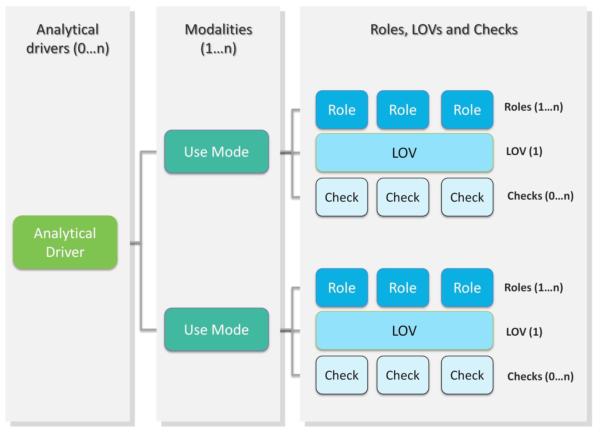
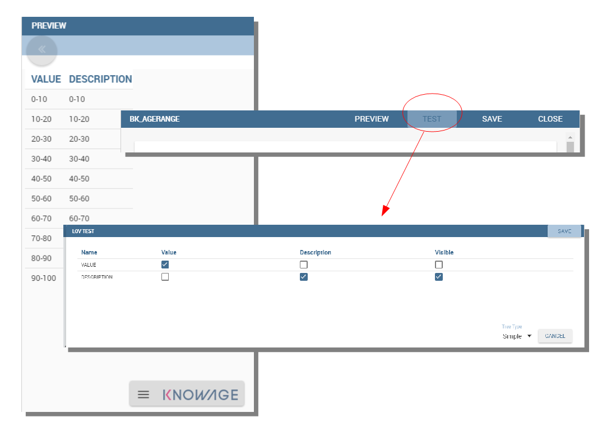
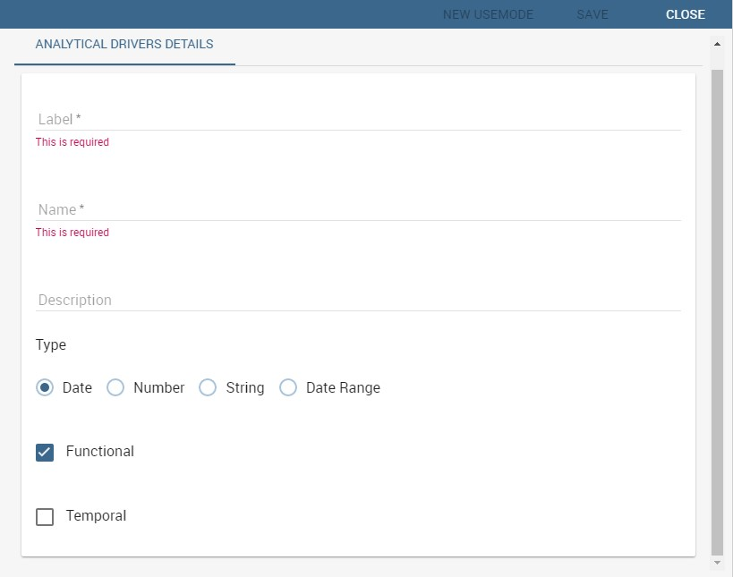
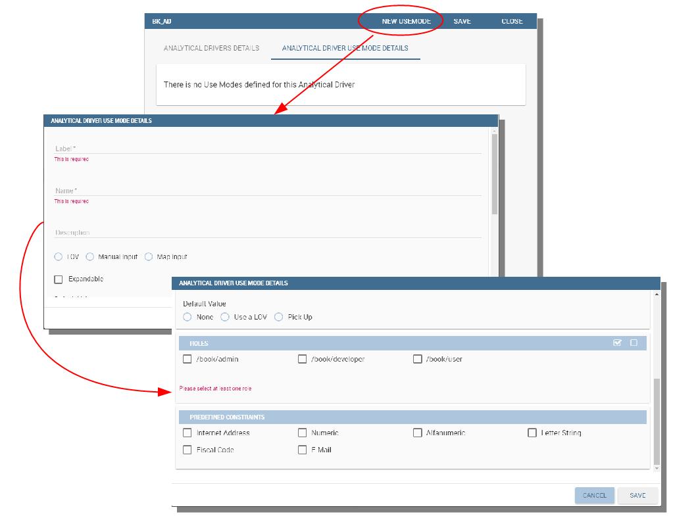

Behavioural Model
=================

An important topic to face before starting a new project is how to create and manage the so-called *behavioural model*.

The *behavioural model* regulates the visibility on documents and data according to the roles and profiles of the end users.

It mainly answers the following questions:

-  WHO uses the business intelligence solution (user profile);
-  WHAT is visible to users, in terms of documents and data (repository rights and analytical drivers);
-  HOW users work with their documents (analytical drivers and presentation environment settings).

The creation and the management of the bevioural model is in charge of Knowage Administrator. However when it has been designed and built, it has to be shared with developers as well. Indeed in developing phase you have to be aware of the visibility hierarchy. You need these information to set document options correctly.

Roles, users and attributes
-------------------------------

Knowage users are defined by:

- identities,
- roles,
- profiles.

The *identity* of a user consists of all data used to identify that user, i.e., a username and a password, as well as a human readable full name.

The *profile* of a user consists of a set of properties called attributes, describing general information about the user, e.g., age and gender, but also domain-specific properties, such as the organizational unit to which he belongs. Some attributes, such as name and email, are defined by default in Knowage. Others can be added by the model administrator, as explained in the following sections.

The *role* of a user represents a categorization of a group of users. These roles may correspond to specific positions in the company, e.g., “general manager” or a “sales director”, or to a position with respect to the BI project, e.g., “data administrator” and “BI developer”. Different users may have the same role, as well as the same user may have multiple roles.

You will not have grants to create new roles or users, but you are asked to match them during document profilation phases. In the following we are going to describe the elements needed for adding parameters. This elements involves profilation too. To conlcude we will see how to manage accessibility while creating a document.

Analytical drivers
----------------------

An analytical driver (hereafter simply driver) models a concept or a piece of data frequently used as a distinguishing criterion on the global data context. A driver highlights the concepts guiding the analysis, providing a unique representation of them and describing how they are shown and checked according to the end users’ roles. When connected to analytical documents, a driver produces an explicit or implicit parameter used to filter data.

.. _parametrreportbehav:
.. figure:: media/image39.png

    Parametric Report.

The Figure above represents a report with two parameters:

- the Deparment, a mandatory field, displayed as a combo box and with possible values: Alcoholic Beverages, Baked Goods, Baking Goods and so on;
- the Age Range, a mandatory field, displayed as list of values and with possible values 0-10, 10-20 and so on.

All these aspects are regulated by the analytical driver behind each parameter. In particular, each driver provides many *use modes*, defining:

- Who is involved in a specific use mode, in terms of a list of end user roles, considering that a role can be associated to a single use mode only.
- What data he can access and how they are presented to the end user for his potential selection. This information is provided by the so  called *List of Value (LOV)*.
- How to check the validity of the chosen values. This information is provided by the so called *Check*.

In other terms, each use mode refers to an initial visualization method and content (LOV), to one or more validation rules (check) and to one or more end user roles (roles). The logic of a driver is represented in Figure below.

    Analytical driver schema.

Let’s consider the following example. We need to represent the concept of “product family”. Since this is a common driver and discriminator for the enterprise analysis, an analytical driver will be coded, with all its behavioural rules, such as:

- if the user is a call center operator or a user that provides internal support, he can manually write the product family he wants to select. This value will be formally verified (it must be a text) and checked on the product family registry.
- if the user is a product brand director or an operative secretary, he can choose the value from a preloaded list of all the product   families belonging to his brand. For this reason, the value does not need any check.

.. figure:: media/image41.png

    Analytical driver schema - Example.

Once defined, a driver can be related to many documents, driving their behaviour and filters in a common way. This way, a user who runs different documents that use the same drivers always receives the same parameter form, applying the same filters over shown data. In fact, when an authenticated user (with its roles and profile) runs an analytical document, its technical metadata are read, mainly in terms of document template and related drivers. Based on them, a customized page for the parameters input is produced, according to the driver logic for the end user role. The selected values are then validated and the final output comes to the user. Next figure shows this process.

Thanks to analytical drivers, a single document is able to cover the analytical demands of various categories of users, with noticeable advantages in terms of:

-  reduction of the number of documents to be developed and maintained,
-  consistency in the request for parameters,
-  complexity reduction in the development of documents, thanks to the separation between security matters and massive development,
-  simple maintenance of the security (visibility over data) over time, despite the increase of developed documents or added engines.

In the next paragraphs we explain how to create a new analytical driver together with its basic components.

.. _overallprocess:
.. figure:: media/image42.png

    Overall process.

Creating a List Of Value
~~~~~~~~~~~~~~~~~~~~~~~~

A *List Of Value* (LOV), is a collection of data organized in attribute-value fashion. For example, the LOV in LOV example retrieves id, name and food family for a product.

.. code-block:: bash
   :caption: LOV example
   :linenos:

    {195, High Top Almonds, Food};  
    {522, Tell Tale Walnuts, Food}; 
    {844, Very Good Soda, Drink};   

There may be multiple attributes in a LOV, but only one of them is the core value that is actually used in the analytical driver. Other  values have a descriptive function: they can be used to provide a human readable description of the LOV, as well as to store information used, for example, to correlate analytical drivers. In our example, the core value is the customer’s id, while the others are additional data describing the customer. Knowage allows to create different types of LOV:

-  **Query**: SQL query to retrieve values from the database;
-  **Script**: Groovy or JavaScript to dynamically return values;
-  **List of fixed values**: Values are defined statically at LOV creation time;  
-  **Java objects**: External object invoked by name that returns the list of values;
- **Dataset**: Dataset already defined in Knowage Server that is used to retrieve values. Note that the dataset must not contain parameters, while profile attributes are allowed.

.. _lovlistbehav:
.. figure:: media/image43.png

    LOV list.

To create and manage LOVs, select **Behavioural Model** > **Lovs Management** from the developer menu. The entire list of available   LOVs appears, as shown in figure above. For each LOV, the list shows the label, description and type; to see the details of a LOV the user  must simply select it and they will appear in the right half of the page. On the contrary, to delete one dataset click on the icon |image37| available at the end of the row. Notice that you cannot delete a LOV if a driver is currently using it.

.. |image37| image:: media/image44.png
   :width: 30

To create a new LOV, click on the icon |image38| at the top right corner of the page. The LOV creation interface will open, where you   can set label, name and description, choose the LOV type and define its values accordingly.

.. |image38| image:: media/image45.png
   :width: 30

.. figure:: media/image46.png

    LOV Creation interface.

Once completed the form, click on **Preview** button to enable the **Test** button. Notice that you cannot save the LOV without testing  it, since this allows to detect errors before the LOV is actually used in a driver and associated to a document. After testing, you will be able to define which column is the actual value of the LOV, i.e., which value will be passed to the analytical driver using this LOV. Only *one* column can be the value attribute and only *one* column can be chosen as Descriptive attribute, while the others can be visible. The two figures below exhibit an example. Columns that are not visible can be used for correlating drivers.

.. _previewandteslov1:

    Preview and Test of the LOV.

.. _previewandteslov2:
.. figure:: media/image48.png

    Preview and Test of the LOV.

.. note::
     **Correlating analytical drivers**
     
     Drivers can be correlated so that the value of the first driver is used as a parameter to select values in the second. Read more at *Analytical document* chapter.

We stress that the visibility of specific fields serve to improved human readability when applying filters to documents handled by third users. Moreover it is possible to choose (refer to next figure) between **simple**, **tree** and **tree with selectable internal nodes** typology of LOV. The last two are hierarchical and let the user visualize the parameters together with their logical tree structure.

.. _hierarchicallvdef:
.. figure:: media/image49.png

    Hierarchical LOV definition.

.. note::
     **Create a LOV for the default value of an analytical driver of type Manual Input Date**
     
     This note is useful when using an analytical driver of type Date with an input of type Manual. In the case you want to use a particular date as default value for that driver, you have to use this syntax for the LOV: select '2017-09-10#yyyy-MM-dd' as fixed_date. Instead of the fixed date 2017-09-10 you can also use as default date the today date for example; in this case you can use a query of this type: select concat(to_date(now()) ,'#yyyy-MM-dd') as today. The most important thing is to concat to the default date you want to use the string #yyyy-MM-dd.

.. note::
    **Create a LOV for the default value of an analytical driver with a hierarchical LOV**
    
    In case you want to add a default value to an analytical driver with an input of type hierarchical LOV you need to use another hierarchical LOV with the default values desired. If the analytical driver LOV is of type *Tree* then the default LOV need to be of type *Tree* too. The LOV need to have values for the leaf level only. Otherwise, if the analytical driver LOV is of type *Tree selectable inner nodes* the default LOV need to be of the same type. The default LOV may have values for one of the level used in the hierarchical LOV. For example, suppose you have an analytical driver with a hierarchical LOV having levels Product Family > Product Category > Product Department. If the hierarchical LOV is of type *Tree* then in the deafult LOV you need to insert one or more values for the level Product Department. Your default LOV have one level, the Product Department. In case the LOV is of type *Tree selectable inner nodes* you can choose one of the three levels. Your default LOV have one level between Product Family, Product Category or Product Department.

Parametrizing LOVs
~~~~~~~~~~~~~~~~~~

Suppose that you need to retrieve a list of values representing all brand names of your products. Then you can use a Query LOV like in  Query LOV example:

.. code-block:: sql
         :caption: Query LOV example
         :linenos:
 
          SELECT DISTINCT PRODUCT_FAMILY, BRAND_NAME
          FROM PRODUCT

This is suitable for end users like the general manager who need to see all brands for every product family. Suppose now that another end user is, for example, the food manager. He should not see every brand name, but only those related to the Food product family. This could be done using user’s profile attributes.

In particular, all query except the ``List of fixed values`` type can be parameterized using profile attributes. This means that, at LOV execution time, the value of the attribute in the user’s profile is assigned to a placeholder in the LOV query/script. Suppose that, in our example, the food manager user has the profile attribute ``pr_family`` equal to ``Food``. You can write this second Query LOV using the placeholder with the standar syntax ``${profile_attribute_name}``, as shown in Parametric query.

.. code-block:: sql
         :caption: Parametric query
         :linenos:
         
           SELECT DISTINCT PRODUCT_FAMILY, BRAND_NAME
           FROM PRODUCT
           WHERE C.PRODUCT_FAMILY = '${pr_family}'

Then, at LOV execution time, for the user food manager the query becomes as shown in Runtime placeholder substitute and hence the corresponding LOV will return only the brand names related to the Food product family.

.. code-block:: sql
         :caption: Runtime placeholder substitute
         :linenos:
       
          SELECT DISTINCT PRODUCT_FAMILY, BRAND_NAME
          FROM PRODUCT
          WHERE C.PRODUCT_FAMILY = 'Food'

This means that if you are the food manager and your user has the profile attribute ``pr_family=Food``, then you will see only the brand related to the food family as a result of this LOV; while if you are the drink manager and your user has consequently the profile   attribute pr_family=Drink, you will see only the brand related to drink family products.

.. note::
     **Standard profile attributes**
     
     There are some standard profile attributes always avaiable that dont' need to be defined for each user. These profile attributes are:
     
     - *user_id* contains the user id of the logged in user
     - *user_roles* contains the current user's roles, joined as a SQL IN clause fashion, for example: 'general_management','human_resources_management'
     - *TENANT_ID* contains the tenant to which the user belongs

Note that an information button and a profile attribute button are available to guide user in writing the code properly, using the   syntax correctly and typing the right profile attribute name.

.. figure:: media/image50.png

    Assistance in retrieving syntax and profile attributes.

Creating a validation rule
~~~~~~~~~~~~~~~~~~~~~~~~~~

Knowage supports the validation of the document’s input parameters via validation rules. Validation rules can be defined in  **Behavioural model** > **Constraints Management**. A validation rule checks parameter values as given by LOVs to verify that they comply with the defined constraints.

.. figure:: media/image51.png

    Contraints Management.

Knowage default checks are:

- **Alfanumeric**: it checks if the parameter is alfanumeric;   
- **Numeric**: it checks if the parameter is numeric;   
- **Letter String**: it checks if the parameter is a letter string;   
- **E-Mail**: it checks if the parameter is an e-mail;   
- **Fiscal Code**: it checks if the parameter has the correct syntax of a fiscal code; 
- **Internet Address**: it checks if the parameter is an internet address.

.. |image46| image:: media/image45.png
   :width: 30
   
If the administrator needs to create additional validation rules, he can click on |image46| to open the rule creation interface. Here he  can define a customized validation rule using the available check options:

- **Date**: here you can set a costumized format type of date;
- **Regular Expression**: to set a regular expression validation rule;
- **Max/Min Length**: it lets you set the maximum and/or minimum character parameters length;
- **Range**: to set a range the parameters value has to satisfy;  
- **Decimal**: to set a maximal decimal places for the parameters.

Creating an analytical driver
~~~~~~~~~~~~~~~~~~~~~~~~~~~~~

As explained at the beginning of this section, analytical drivers use nformation about users, their roles and profiles to filter data   returned by their associated LOVs. Users, roles and profiles must have been already defined in the project context so that they are   available to the driver.

.. _analyticaldrivermanagbehav:
.. figure:: media/image52.png

    Analytical Driver Management.

To create a driver, select Behavioural Model > Analytical Drivers Management from the developer menu. Here, you will see the entire   list of available drivers. For each driver, the list shows unique label, description and type. To explore details the user must just   select one menu item from the list and they will appear in the half right side, as shown in the figure above. Otherwise to delete one   analytical driver the user must use the icon |image48| available at the end of each row of the list. Notice that you cannot delete a driver if adocument is currently using it.

.. |image48| image:: media/image44.png
   :width: 30

To create a new driver, click on |image49| at the top right corner. The driver creation interface will open. At first execution only the upper part of the window is visible, as shown in the figure below. The upper part is the **Detail** section, where you can set the label, name and description. Choose the type between Date, String or Number depending on the type of expected data. Select Functional or Temporal if the driver is used by an end user or a scheduler, respectively. A click on the save botton, enabled as soon as the form is filled in, will save the driver and let the section below appear.

.. |image49| image:: media/image45.png
   :width: 30

.. _drivercrationbehav:

    Driver creation.

In the Analytical Driver Use Mode Details section, one or more LOVs are linked to the current driver, as well as roles and checks are assigned via the so-called *use modes*.

To associate LOVs to the driver, switch to the “Analytical Driver Use Mode Details” tab. Here the user must set label and name of that specific use mode, the kind of input among **LOV input**, **Manual input** and **Map input**, as shown in below.

    Detail panel of LOV creation, second step.
   
The first type allows the user to pick values from a previously defined LOV. When selecting this option the interface spread out the configuration panel where the user is asked to select a LOV from the list and a **Modality**. The latter defines how values are selectable at document execution. In fact the user can choose among:

- **List values selection**: the filter will look like a lookup table;
- **Pop up**: the filter will look like a lookup table;
- **Slider**: the user can drag the slider to choose the parameter;
- **Tree**: made for hierarchical LOV, lets the users navigate the parameters in a hierarchical way;   
- **Combo Box values selection**: the filter will look like a drop down menu.

The second kind of input expects the user to type manually the value. Otherwise the third opens a map from which the user must select one or more regions accordingly to the layer property. When selecting this option the interface spread out the configuration panel where the user is asked to choose a layer and the layer property. More details are supplied in next sections for this kind of input.

Moreover the user can add default values (namely values that will be passed to the document at its first execution) using the dedicated area. Here it is possible to pick default values from another LOV or to pick the first or the latter value of the current LOV (if the LOV input type was selected).

.. note::
     **Analytical driver of type Manual Input Date with a default value**
     
     In the case you want to use an analytical driver of type Manual Input Date with a particular date as default value, you have to use a particular syntax for the LOVs query. See the note *Create a LOV for the default value of an analytical driver of type Manual Input Date* in the section *Creating a List Of Value* for more details.

.. note::
     **Analytical driver with hierarchical LOV and default LOV**
     
     In the case you want to use an analytical driver with a hierarchical LOV and a default LOV the latter need to be hierarchical too. For more details see *Create a LOV for the default value of an analytical driver with a hierarchical LOV* note in the section *Creating a List Of Value*.

At the bottom of the page the user must associate roles to the “use mode”. This action is mandatory. The user connects the user’s roles that he/she wants to be allowed to see a certain list of values or certain regions or be able to type values at his/her convenience.

Therefore, since an admin user can decide to separate values according to the other users’ roles, the analytical driver definition allows to configure different use mode. We can also set validation checks if needed. Then it is sufficient to save each use mode and click on **new use mode** to set a new one. We repeat the same procedure for all the use modes. Each use mode is represented in a separate tab. We will go deeper into this at the end of the section.

All the selections can be multi-valued, but note that this option has to be set directly on the document detail during analytical driver
association.

Creating an analytical driver for a spatial filter
~~~~~~~~~~~~~~~~~~~~~~~~~~~~~~~~~~~~~~~~~~~~~~~~~~

In previous section we explained how to configure a driver and how it can be linked to different kind of inputs. In this part we linger on the possibility to define a spatial analytical driver. Referring to the following figure, we notice that for setting the geographical driver we must select the **map input** option: here, expanding the combobox you choose the layer on which the filter will act. It is then necessary that the layer has been previously created and uploaded into Knowage **Layers catalog**. Then it is mandatory to specify the property name of the geometry in use using the manual text box just below. Remember that the property name must be exactly the same, therefore respect the upper and the lowercase of the string.

.. _spatialanalyticdrivsett:
.. figure:: media/image55.png

    Spatial analytical driver settings.

These few steps will implent the spatial analytical driver to be associated to a document and be used to set a spatial filter.

Analytical driver’s use modes
~~~~~~~~~~~~~~~~~~~~~~~~~~~~~

Sometimes the same analytical driver (i.e., the same concept, like the concept of product brand) should display different values according to the user that is executing it.

Suppose you have a report on sales and costs like the one in the first figure of this chapter and you want to add to it the possibility to filter also on product brands. If you load the report as the general manager, you should choose between all the possible product brands in the corresponding parameter. If instead you load it as, for instance, the food manager, then you should be able to filter only on product brands related to the Food familiy.

In order to do this, let us focus again on the definition of the LOV and check that the already defined use mode ``All Brands`` is associated to the correct role ``general_manager``. Here you can add a second tab, called for instance ``Profiled_Brands``, and associate it to the role ``product_manager``. This is because the food manager user has ``product_manager`` role with profile attribute ``pr_family = Food``.

Finally, we choose the second LOV created, the one returning only those brands that belong to a specific family (see the code example in section Parametrizing LOVs). The family is selected by checking the value of the family attribute in the user profile.

Notice that here you can also choose a different type of display mode for the LOV. In other terms, different use modes correspond not only to different LOVs, but also to (possibly) different display mode (pop-up windows, combobox, ...). For instance, you can select a combobox display mode for the All Brands use mode and the pop up window display mode for the Profiled_Brands use mode.

Once you have saved the LOV, just log out from Knowage and log in with a different user role, i.e. as a general manager, food manager and drink manager. Executing your report on sales and costs you can now notice the differences on the values and on the display mode of the Product Brand parameters according to the different users. Notice that, for food manager and drink manager, the parameters are always displayed as a pop-up window, while for the general manager also the display mode of the parameter varies.

.. figure:: media/image56.png

    Behavioural Model Schema.
    
Behavioural Model Lineage
~~~~~~~~~~~~~~~~~~~~~~~~

It is possible to show a summary of the links between the LOVs, the analytical driver and the documents by selecting **Behavioural Model** > **Behavioural Model Lineage**. 

.. figure:: media/lineage.png

    Behavioural Model Lineage.

The entire list of available LOVs, analyitical driver and documents appears, as shown in figure below.

.. figure:: media/lineage2.png

    List of LOVs, analyitical driver and documents.

By selecting one LOV or Analytical Driver or Documents the other will refresh showing only the elements associated with the selection done. To come back to the original situation click the refresh button on the top right corner.
