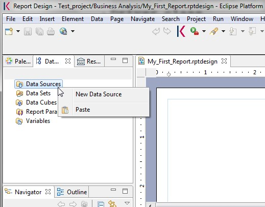
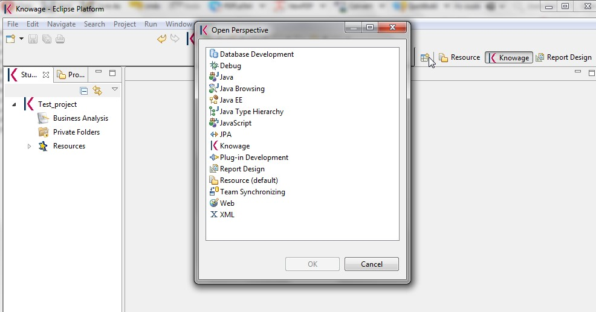
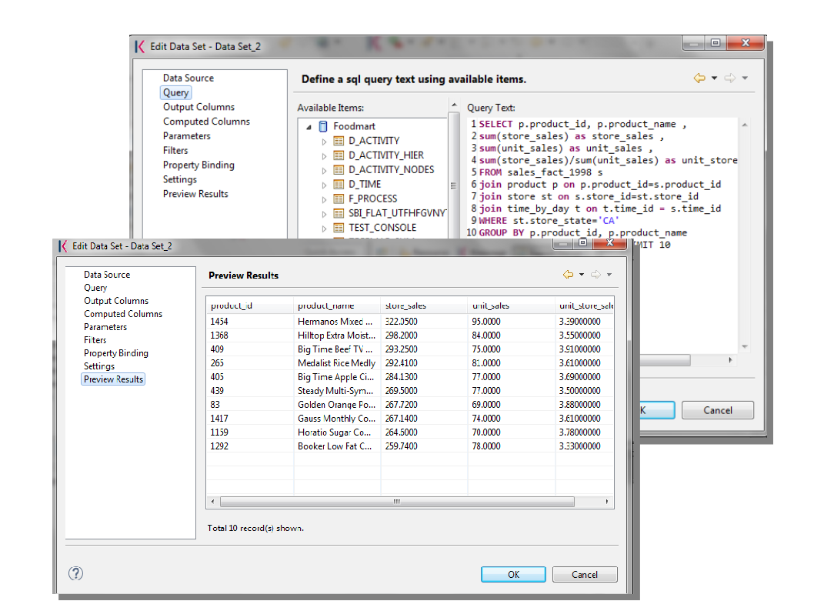
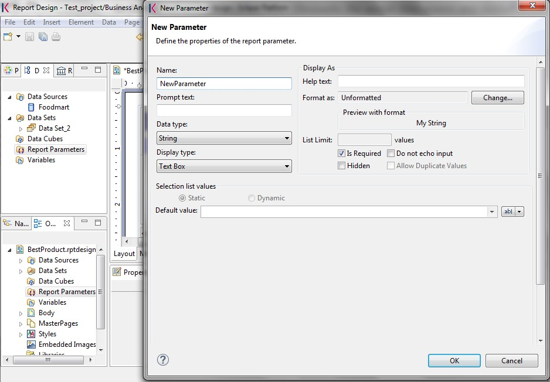
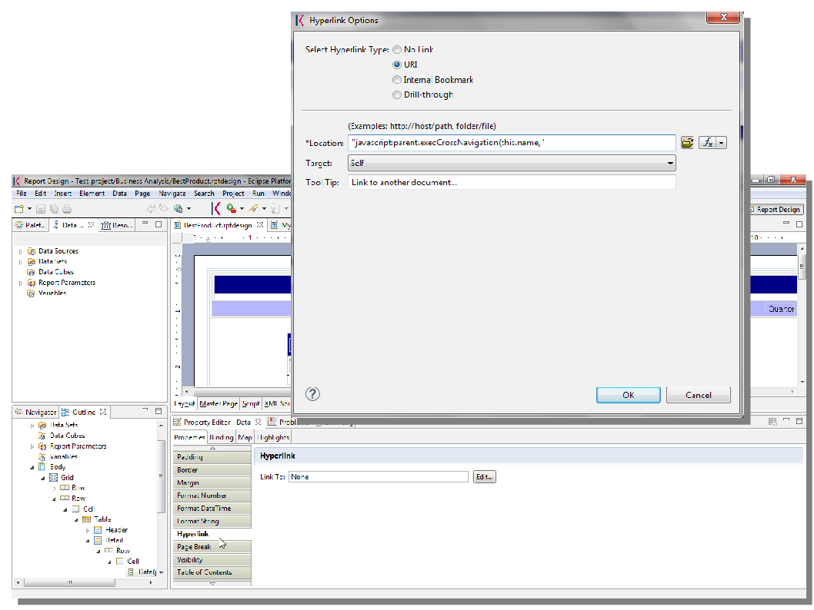

BIRT reporting
=========

Reports represent the most popular type of business analysis. Indeed, they allow the visualization of data in a structured way and accordingly to predefined formats. The main characteristics of a report are:

-  combination of numerical data (tables, lists, cross tables), charts and images;
-  static and pixel-perfect layout;
-  multi-page and multi-format output (PDF, HTML, DOC, etc.);
-  organization of data by groups and sections;
-  universal usage (summary, detail, analytical or operational);
-  being suitable for off-line production and distribution (scheduled execution);
-  ease of use.

For these reasons reports usually have a pervasive level of usage: they are used by developers to perform both synthetic and detailed analysis, having a particularly low level of difficulty.

BIRT, acronim for Business Intelligence and Reporting Tools, is an open source technology platform used to create data visualizations and reports. In Figure below you can see an example of BIRT report.

.. figure:: media/image327.png

    Example of a BIRT report.

Knowage Studio contains BIRT designer while Knowage Server contains the runtime engine. A BIRT template consists of an XML text file with the .rptdesign extension which is automatically generated by the Eclipse platform embedded into Knowage Studio. It can be manually modified by very expert users even though it is not a recommended practice. In this manual we will go into details on how to develop a BIRT report, from its implementation inside the Knowage Studio to its visualization inside the Knowage Server. All standard BIRT functionalities are available in the Studio but for a full overview of BIRT reporting tools and a detailed developer guide, the reader can also refer to the official documentation at `<http://www.eclipse.org/birt>`_

Introduction to Knowage Studio
---------------------------------

Knowage Studio is the development environment based on Eclipse. It allows the developer to design and modify some analytical documents, for instance reports and dashboards. This module supports the developer while designing documents as well as during the installation and testing processes, directly on Knowage Server. The interaction between these two components is possible thanks to Knowage SDK module. The users can display the list of analytical documents which are available on the server and download them, in order to modify them on their own computer. 

It allows to build a Knowage project within Eclipse, through which users can create new analytical documents. It also integrates the tools needed to create Jasper and BIRT reports.

To install Knowage Studio, first check that your environment satisfies the following prerequisites:

-  it has a JDK 1.7.x already installed;
-  it has the JAVA_HOME variable already set;
-  it has a certified operative system (Windows, Linux, Unix are generally accepted). The list of certified environments mainly            depends on the ones supported by Eclipse. Please, refer to the Knowage Studio release notes to find out the Eclipse version              included in each released package.

If so, the second step is to download the suitable package from your personal area in Knowage website.

At this point, you just have to unzip the downloaded package under a folder, having a KnowageStudio_<version>_<distribution>_<date> subfolder. Here you can find and run a **KnowageStudio.exe** or **Knowage.sh** script to start and select the preferred workspace.

The selected workspace works as a local repository for all the developed objects (reports, charts, cockpits, etc.). However documents are neither visible nor reusable by other users until they are published on Knowage Server.

.. warning::
    
    **Connection between Server and Studio**

       Once Knowage Studio has been configured, connect it to Knowage Server. This will be the deployment environment to provide                end-users with all certified objects. The main steps to set the connection are:

       -  select the Knowage perspective;
       -  create a Knowage project;
       -  set Knowage Server connections.

       These points will be described in the following.

At first execution of Knowage Studio, a welcome page appears.

The first step is to create a Knowage project by selecting the Knowage icon of the following figure from the toolbar located at the top of the page.

.. figure:: media/image328.png

    New Knowage project icon.

Once the project has been created, a standard folder tree appears. The predefined folders are:

- **Business Analysis:** it contains all developed documents (reports, charts, cockpits, etc.) that can be uploaded into or downloaded from Knowage Server. This folder can be structured with subfolders, to freely organize ones own documents;
- **Private folders:** they contain the users personal or project documentation. This folder can be freely managed by the user;
- **Resources:** they contain all technical resources used in the project (i.e., the reference to a Knowage Server).

Now you can configure references to one or more Knowage Servers. In other words, each user can work for many projects that can be:

-  hosted on different servers
-  hosted on the same server with different user accounts.

To define a server connection, click on the **New Server** item of the **Server** contextual menu.

    New Data Source connection.

A form will ask you for:

-  **Server name:** a logical name to identify the server. The name is used on the local workspace only and has no relation with the        physical one.
-  **Url:** the http url where the server is hosted and reachable.
-  **User:** the user who authenticates on Knowage Server, setting his access rights in terms of what kind of operations he can do          (upload and download a model or a data set) and what parts of the Server repository he can access.
-  **Password:** the users password.
-  **Active:** a flag that indicates the active server. It is particularly useful when the user is working with multiple servers. The      active server indicates that every upload and download operation refers to this Knowage Server instance.

.. figure:: media/image330.png

    Server configuration wizard.

.. warning::
    
    **Connection to Knowage Server**

       If something in your network configuration has been changed from your first run of Knowage Studio, the connection test of                Knowage Studio to the Server could fail. Most often this problem is due to the proxy settings in your Eclipse environment. If            this is not the case, try to run Knowage Studio from the command line with the clean option (**Knowage.exe** clean) to reset            working settings.

At this point, Knowage Studio is ready to work!

Metadata definition
~~~~~~~~~~~~~~~~~~~~~

Each Knowage document (e.g., report, olap, chart, cockpit, etc.), has its own technical metadata stored in Knowage internal repository. The most relevant technical metadata describing document structure, content and behaviour are:

-  *Template*, which defines the document layout;
-  *Data set*, which defines how data of each document should be read;
-  *Analytical drivers*, which hook the template parameters to the graphical interface (at runtime), managing also the right form for       parameters.

Knowage Studio supports BI developers steering the implementation of the template for each analytical document through an easy graphical interface and simple wizards. Each document type has its own designer and manages the relation with data sources and data sets. Furthermore it enhances technical users with all the needed functionalities to design, develop, test, deploy and maintain Knowage analytical documents. As said above, each document is mainly associated to a template describing its layout and a data set defining how data will fill it. Knowage Studio assists the developer in writing these templates and/or data sets by means of a graphical user interface and of easy-to-use wizards. 

.. warning::
     **Datasets created with the Business Model**

       These data sets are often based on specific business models created through Knowage Meta. By the way, we will concentrate on how        to manage the implementation of a data set using the BIRT Report designer available in Knowage

We want to remark that an expert developer can work directly on the server, managing documents and data sets by hand, thanks to the web  interface for administrators and developers. Usually, this procedure is faster when only small changes are required on already released  documents, whereas the Studio is particularly useful when a developer works on new documents.

The target users of the Studio module are:

-  BI developers, who define analytical documents and data sets to be released onto a remote Knowage Server
-  administrators, who define or update analytical documents and data sets.

In other words, Knowage Studio covers the development processes of more technical documents. On the other hand, high-level documents are created directly through Knowage Server, where a power user can access graphical designers without need to use the Studio, which requires more technical skills to manage the installation and configuration process.

Data set definition
~~~~~~~~~~~~~~~~~~~~~

Each document type has its own way to define how to get data from an internal data source, accordingly to a data set definition. This allows the document to directly access the RDBMS, through the SQL loading script, which can be encoded within the template or externally (i.e., stored as Knowage Server resource), but without any abstraction from data sources.

Developing a BIRT report
---------------------------

To create a new document right-click on the **Business Analysis** folder and, to start, choose between report and dashboard. In Figure below we will choose **Report with Birt** and leave the other option to the next chapter.

.. figure:: media/image331.png

    New document creation.

Once the document is designed, it is stored as a local file, marked out with an icon and a specific file extension:

-  **.sbidoccomp:** document templates for dashboard that use the ComposedDocument engine;
-  **.rptdesign:** document template for reports that use the BIRT engine.

In our case, we will get a .rptdesign file. A double click on one of these files allows to open the document template, with its related graphical editor.

The design and deployment of a BIRT report includes the following steps:

-  create the empty document;
-  switch to the report designer perspective;
-  create the data source;
-  create the dataset;
-  design the report via the graphical interface;
-  deploy the report on the server.

To create a new BIRT report, as just anticipated, right click on the **Business Analysis** folder and select **Report** > **Report with BIRT**. This will open an editor where you can choose the name of your document. The new document will be created under the **Business Analysis** folder.

Double click on it to open the editor. At this point, you are still working in the Knowage perspective. To design the report, switch to the actual BIRT designer perspective. Click on the perspective icon of the Eclipse editor and select the Report Designer among the available perspectives, as showed in figure below.

    Change perspective.

The next steps are the creation of a datasource and of a dataset. As previously described in the section Dataset Definition, Knowage Studio allows the development of analytical documents using either internal or external datasets. In this specific example, we will show how to create a report with an internal dataset. First of all, in case of an internal dataset, define a **JDBC Data Source**.

Right click on the **Data Source** item and select the corresponding data source. A pop up editor will open, prompting you the connection settings:

-  **Driver class**
-  **Database URL**
-  **Username** and **password**

Note that these configuration parameters will be used by the Studio to connect to the database and let the report to be executed locally (i.e., within the Studio). Make sure that the database set in the Server share the same schema of that defined in the Studio.

Since you are setting a local reference to a database inside the report, remember to set an additional information: this will enable Knowage Server to correctly execute the report, by connecting to the data source referenced within the server and not inside the report. Basically you need to tell the server to override the data source configuration. Therefore, add a parameter to the report, called connectionName, right-clicking on the "Report Parameters" menu item and selecting "New Parameter". Fill in the form as suggested below.

.. figure:: media/image333.png

    Adding connectionName Parameter.

Then go to **Property Binding** in the Data Source editor and set the property JNDI URL to the value of the connectionName parameter, as shown below.

.. figure:: media/image334.png

    Setting the connectionName parameter in the Data Source editor 

.. warning::
   
    **JNDI URL**

      Do not forget to define the connectionName parameter in your BIRT report and set the JNDI URL accordingly. Without these                 settings your BIRT report may be unable to access data once it is deployed on the server. In addition, if database and connection       properties change, you need to change the connection properties only in Knowage server.
   
Once the data source has been configured, you can proceed with the creation of a dataset. Therefore, right-click on the **Data Set** item and select **New Data Set**. In the next window, select the data source, the type of query and give a name to the dataset, as exhibited below. The scope of this name is limited to your report, because we are defining an internal dataset.

.. figure:: media/image335.png

    Dataset definition.

Now you can define your dataset by writing the SQL query in the editor and testing the results (see :numref:`datasetedtwithprw`). At any time, you can modify the dataset by clicking on it, which will re-open the query editor.

Let us design a very simple report, which contains a table showing the data from the defined dataset. The easiest way to create a table from a dataset is to drag & drop the dataset from the tree menu into the editor area.

The most generic way, which applies to all graphical elements, consists in switching to the **Palette** menu on the left panel, keeping the designer in the central panel. Drag and drop the table into the editor area. Consider that this can be done with all other elements listed in the Palette. At this point, you can edit the table (as well as any other graphical element on the report) using the **Property Editor** tab below the editor area.

While developing a report, it is particularly useful to test it regularly. To this end, click on the **Preview** tab below the editor area. To revert back to the editor, just click on the **Layout** tab. In the **Master Page** tab, you can set the dimensions and layout of the report; the **Script** tab supports advanced scripting functionalities; finally, the **XML Source** tab shows the editable source code of your report.

While developing a report, it is particularly useful to test it regularly. To this end, click on the Preview tab below the editor area. To revert back to the editor, just click on the Layout tab. In the Master Page tab, you can set the dimensions and layout of the report; the Script tab supports advanced scripting functionalities; finally, the XML Source tab shows the editable source code of your report.

.. _datasetedtwithprw:

    Dataset editor, with preview.

.. figure:: media/image337.png

    BIRT Property Editor.

Once your report is done, you can deploy it on Knowage Server.

.. note::
     **Deploy on Knowage Server**
         
         Please refer to the section *Download and Deploy* in this chapter to find out more on report deployment.

The BIRT report designer allows the creation of complex reports, with different graphical elements such as cross tabs, charts, images and different text areas. In this section we do not provide any details on graphical development but we focus on specific aspects of Knowage BIRT Report Engine.

.. note::
     **BIRT Designer**
         
         For a detailed explanation of report design, pleas refer to BIRT documentation at www.eclipse.org/birt/.

Using an external Data Set
~~~~~~~~~~~~~~~~~~~~~~~~~~

In the afore-described example, we built a report using an internal dataset, i.e., a dataset defined within the report. This has two main implications. First, the dataset is not visible outside the report execution: for example, it cannot be directly reused by other  reports. Second, an internal dataset is always defined as a SQL query and it cannot take advantage of Knowage business model abstraction. For these reasons, Knowage allows the definition of external datasets in reports. An external dataset is defined in Knowage Server and, as a consequence, it is visible to all documents on the server (i.e., it can be used by any of them, if properly linked to the document). External datasets can either be SQL datasets or QbE datasets, that is, datasets defined by queries over a business model.

An external dataset can be included into any BIRT report by downloading it from a Knowage Server. Specifically:

-  define a Knowage Server datasource;
-  download a dataset from the Knowage Server datasource.

We always start by right-clicking on the **Data Source** item. Select **Knowage Server Data Source** and set the appropriate input configuration:

-  **Server URL**
-  **Username** and **password** used to log into the Server (e.g., biadmin).

After filling in the configuration fields, test the connection and save it. The new data source will appear in the left tree menu. Instead of connecting to a database via a JDBC driver, connect to the server as the source of data. Obviously, the actual data source and dataset must have previously been defined on the Server. 

To select the dataset, click on **New Data Set** as above, but this time select the **Knowage Data Source** that you have just defined. Now, instead of choosing a new name for the dataset, insert the correct label of the dataset that you want to import from the Server. If the label is correct, the dataset will be imported in the report by clicking on **Finish**. Notice that the imported dataset may be a SQL or a QbE one. Since both types of datasets are stored in the same repository by Knowage Server, we are enabled to use any BM query in the development of a report.

.. warning::
      
    **Use of BM queries in report development.**

      The ideal use of a business model is to define queries over the BM via Knowage Meta, deploy them on Knowage Server and reuse             them on Knowage Studio as external datasets.

Adding parameters to reports
~~~~~~~~~~~~~~~~~~~~~~~~~~~~

Most times reports show data analysis that depend on variable parameters, such as time, place, type. Knowage Studio allows the designer to add parameters to a report and link them to analytical drivers defined in Knowage Server.

To use these parameters, you first need to add them to your report. Right-click on **Report Parameters** in the tree panel and select **New Parameter**. Here you can set the data type and choose a name for your parameter.

.. warning::
   
    **Parameters URI**

      Be careful when assigning a name to a parameter inside a report. This name must correspond to the parameters URI when you               deploy the document on Knowage Server.

Once you have defined all parameters, open the (or create a new) dataset. Parameters are identified by a question mark **?** . For each **?** that you insert in your query, you must set the corresponding link in the **Parameters** tab: this will allow parameters substitution at report execution time.

    Creation of a new parameter in a BIRT report.

Note that you must set a link for each question mark as shown below, even if the same parameter occurs multiple times in the same query.

.. _insrtprmintodtsetdef:
.. figure:: media/image339.png

    Insert parameters into the dataset definition.
    
.. warning:: 
       
     **Transfer reports from Studio to Server and vice versa**
       
       We saw that developers can use Knowage Studio deployment service to easily register the report with its template on Knowage              Server. Alternatively, any valid BIRT template (developed with or without Knowage Studio) can be directly uploaded in Knowage            Server using the web interface for document management.

Parameters can also be used within some graphical elements, such as dynamic text, with the following syntax:

.. code-block:: javascript
        :linenos:
        :caption: Parameters syntax
   
            params[name_of_parameter].value

Download and deploy
---------------------------

To modify an already deployed document, first download the related template from the Knowage Server repository. 

Right-click on the **Business Analysis** folder or on one of its subfolders. In the contextual menu, select the **Download** option. At this point, the functionality tree appears, allowing you to choose the documents to be downloaded.

These documents will be available in the local folder that you have previously selected. Document details (i.e., label, description, state, engine and parameters) are stored as metadata in the local repository. Metadata can be refreshed from the Server by clicking on the **Refresh** button in the **Knowage** > **Document Metadata** tab of the **Properties** section. To open Properties, right-click on the document item and select **Properties**.

In a similar way, after a document update, the Deploy option of the same menu sends the new template to the Server, ready for use.

Another possible situation is when the designer creates a new template from scratch and deploys it on the Server. At first deploy, a link between the template and a document on the Server is created. It will last until the document on the Server is deleted or its label is modified. In those cases, you will need to re-deploy the template from the Studio.

To deploy a template, right-click and select **Deploy**. You will be prompted a form for basic metadata on the new document. Required and/or pre-filled input data may change according to the document type. However, they usually include:

-  **Label:** free label as short code;
-  **Name:** name of the document;
-  **Description:** long description;
-  **Type:** document type (report, chart, cockpit, etc.);
-  **Data Set:** the already deployed data set for documents that use external ones;
-  **Data source:** the reference to the data source that will be used on SpagoBI Server for documents that have an internal data set,      in order to work with official source instead of local or working RDBMS;
-  **State:** the initial state of the document (development, test, released, suspended) according to their life cycle management          policy;
-  **Refresh seconds:** the automatic refresh time;
-  **Position:** the folder in the remote Knowage Server repository where documents are deployed, indirectly setting who can use it and    its first authorization level.
      
.. warning::
      
       **Analytical documents**
      
         The described form sets basic metadata, generally managed as technical metadata on Knowage Server.
      
These document details are stored as metadata in the local repository and used to register it in the central repository of the Server as well. To look at their local values, select the **Properties** item from the document contextual menu and choose **Knowage**.

Directly from there, local metadata can be refreshed anytime on the active server, by simply pressing the **Refresh Metadata on active server** button.

Cross Navigation for BIRT Reports
----------------------------------

A powerful feature of Knowage analytical documents is cross-navigation, i.e., the ability to navigate documents in a browser-like fashion following logical data flows. Although crossnavigation is uniformly provided on all documents executed in Knowage Server, each type of document has its own modality to set the link pointing to another document.

Notice that the pointer can reference any Knowage document, regardless of the source document. For example, a BIRT report can point to a chart, a console, a geo or any other analytical document.

In Knowage there are two main typologies of cross navigation: *internal* and *external*.

*Internal cross navigation* updates one or more areas of a document by clicking on a series, a text, an image or - in general - on a
selected element of the document.

*External cross navigation* opens another document by clicking on an element of the main document, allowing in this way the definition of a "navigation path" throughout analytical documents (usually, from very general and aggregated information down to the more detailed and specific information)). Indeed, you can add cross navigation also to a document reached by cross navigation. This can be helpful to go deeper into an analysis, since each cross navigation step could be a deeper visualization of the data displayed in the starting document. 

It is obviously possible to associate more than one cross navigation to a single document. It means that by clicking on different elements of the same document the user can be directed to different documents.

To allow the external cross-navigation in a BIRT report, you need to add a hyperlink to the element you want to be clickable using the **Properties** tab of the Knowage Studio. Most report elements can host a hyperlink. For example, let us add a hyperlink to a cell in the table.

Click on the table cell and select the **Hyperlink** item in the **Properties** tab. By clicking on Edit, the hyperlink editor will open and show three input fields:

-  **Location:** write here the URI,
-  **Target:** select Self,
-  **Tool Tip.** write the text you wish to appear on the link, as showed in the following Figure below.

    Hyperlink editor.

To edit the Location, click on the right drop down button and select the JavaScript syntax. This will open BIRT JavaScript editor. Here you must write down the javascript function "javascript:parent.execExternalCrossNavigation" passing JSON arguments like ParName: string, null and string.

In Cross Navigation syntax we give an idea of how the syntax should be like:

.. _crossnavsyntax:
.. code-block:: javascript
      :linenos:
      :caption: Cross Navigation syntax.
   
       "javascript:parent.execExternalCrossNavigation("+         
       "{OUT_PAR:'"+params["par_period"].value+"'"+               
       ",OUT_STRING:'"+string_text+"'"+ 
       ",OUT_NUM:"+numberX+     
       ",OUT_ManualSTRING:'foo'"+    
       ",OUT_ARRAY:['A','B','5']}"+ 
       ",null,"+       
       "'Cross_Navigation_Name');"       

.. warning::
    
    **Type the right cross navigation name**

       It is important to underline that the "Cross_Navigation_Name" of Cross Navigation syntax is the cross navigation name                    related to the document and set using the "Cross Navigation Definition" feature we described in *Analytical Document* Chapter, *Cross Navigation* Section. 
       
It will be necessary to type the right cross navigation name related to the document as defined using the "Tool" settings of Knowage      server and to define those parameters (OUT_PAR, OUT_STRING, etc.) as output parameters in the deployed document on the Server            (see *Analytical Document* Chapter, *Cross Navigation* Section).

Note that the syntax of the string is fixed, while you need to assign values to the parameters that will be passed to the destination document. The JavaScript editor helps you to insert dataset column bindings, as shown in Figure below, and report parameters automatically.

.. figure:: media/image342.png

     Column bindings.

To manage multi-value parameters is enough to list all values between brackets separating them with commas, as reported in the code above. More specifically, the array must contain values of the same type. For example:

.. code-block:: javascript
   :linenos:
   
    OUT_SeveralNames:['Michael','Paul','Sophia'] 

or

.. code-block:: javascript
   :linenos:
   
    OUT_SeveralNames:[5,9,31938]

Finally, it is possible to set a sort of "multi"-cross navigation if for example the exit document is related to more than one document through the Cross Navigation Definition. Let suppose that the source document goes to a target document and the name of the navigation is "CrossNav1" and simultaneously the source document goes to a second target document and the name of the navigation is "CrossNav2". If in the JavaScript function of *Cross Navigation syntax* code the "Cross_Navigation_Name" is left empty as in the code below, when the user clicks on the object for which the navigation has been enabled a pop up opens asking for the user to choose between the "CrossNav1" navigation or the "CrossNav2" one. This procedure allows the user to have a more than one possible navigation starting from the same object.
   
.. _crossnavsyntax2:
.. code-block:: javascript
   :linenos:
   :caption: Cross Navigation syntax
   
       "javascript:parent.execExternalCrossNavigation("+                       
       "{OUT_PAR:'"+params["par_period"].value+"'"+                             
       ",OUT_STRING:'"+string_text+"'"+  
       ",OUT_NUM:"+numberX+ 
       ",OUT_ManualSTRING:'foo'"+ 
       ",OUT_ARRAY:['A','B','5']}"+    
       ",null,"+    
       "'');"
 
