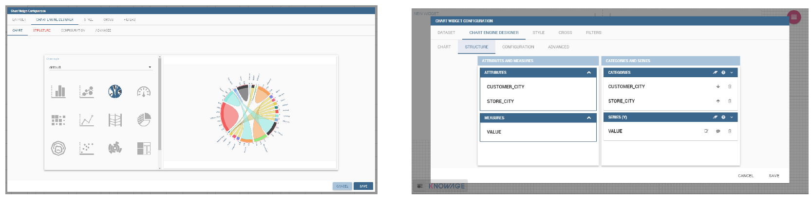
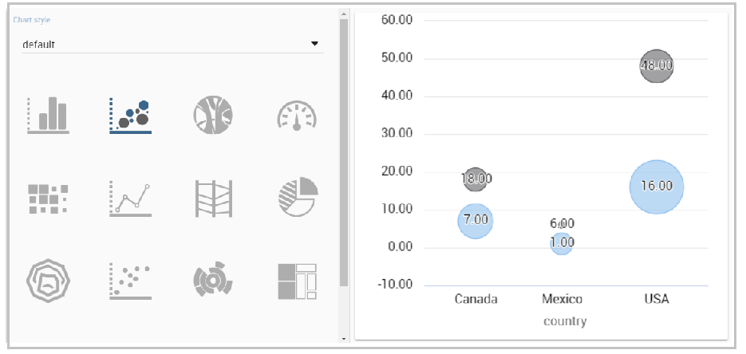

# Gráfico

Los gráficos son el método más adoptado en la presentación de datos de BI, ya que permiten una percepción inmediata de un fenómeno y son fácilmente comprensibles. Enfocados en una impresión visual más que en una conferencia puntual de valores, son especialmente adecuados para mostrar tendencias y comparaciones.

Por estas razones, los gráficos ganan un nivel generalizado de uso y pueden ser utilizados por cualquier persona para realizar análisis sintéticos y detallados.
Knowage proporciona un motor de gráficos para crear varios tipos de gráficos, que incluyen:

*   Barra
*   Línea
*   Pastel
*   Sunburst
*   Nube de palabras
*   Mapa de árbol
*   Paralelo
*   Radar
*   Esparcir
*   Mapa de calor
*   Acorde
*   Calibre
*   Burbuja

## Mi primer gráfico

Una vez que ingrese al entorno de Knowage como usuario final, ingrese el **Análisis** área bajo el **Área de trabajo** , haga clic en el botón **Crear análisis** y elija **Cabina**.

.. importante::
**Solo Enterprise Edition**

         Please note that this operation is available only in KnowageBD and KnowageSI. Using the KnowagePM license, only a technical user can create Cockpit document.

Una vez abierta, la interfaz de la cabina es una página vacía con una barra de herramientas que contiene diferentes opciones, la segunda de las cuales es la **Agregar gráfico** característica.

.. figura:: media/image90.png

    Add a chart to a cockpit.

.. nota::
**Cabina**

         The Cockpit Engine allows the user to self-build interactive cockpits through an intuitive and dynamic interface. Read more in *Cockpit* chapter.

Haciendo clic en el botón **Agregar gráfico** , se le pedirá que elija entre algunos widgets disponibles. Elige el **Gráfico** uno y ahora entremos en detalles sobre cómo construir un gráfico desde cero. El editor del diseñador se divide en cuatro pestañas principales: **Conjunto de datos**, **Diseñador de motores de gráficos**, **Estilo**, **Cruz** y **Filtros**. Tan pronto como el usuario hace clic en el botón "Agregar gráfico", ingresa al editor de pestañas "Conjunto de datos". Aquí el usuario debe seleccionar, utilizando el icono "little plus" colocado justo al lado de la línea del cuadro combinado, un conjunto de datos. Luego, el usuario debe cambiar a la pestaña "Chart Engine Designer" y elegir un tipo de gráfico entre los disponibles, como se muestra en la figura a continuación.

.. figura:: media/image91.png

    Chart editor.

Después de elegir el tipo de gráfico apropiado, debe ir al **Estructura** página. Aquí es posible seleccionar las medidas y los atributos elegidos para el gráfico.

.. \_chartstructure:
.. figura:: media/image92.png

     Chart structure.

Haciendo clic en el botón **Configuración** página encontrará ocho bloques diferentes como puede ver en la figura a continuación.

.. figura:: media/image93.png

     Chart configuration.

En detalle, estos bloques se refieren a:

*   **Detalles genéricos**, como la orientación del gráfico, la familia y la fuente de tamaño.
*   **Detalles del título y los subtítulos**
*   **Sin mensaje de datos** donde es posible poner un mensaje donde los datos no están fundados.
*   **Título de la leyenda**
*   **Elementos de leyenda**
*   **Paleta de colores**
*   **Configuración avanzada de la serie**
*   **Colores personalizados**

Estos ocho bloques son comunes a todos los tipos de gráficos; de todos modos, algunos tipos de gráficos pueden tener bloques adicionales.

El **Avanzado** contiene características adicionales, generalmente explotadas por un usuario experto. Aquí el usuario puede ver todas las propiedades configurables asociadas al gráfico: refleja las pestañas de propiedades que un usuario experto debe editar manualmente para generar una plantilla json.

.. figura:: media/image94.png

    Chart Advanced Features.

En las siguientes subsecciones, las funcionalidades disponibles de las pestañas Estructura, Configuración y Avanzadas se describen de una manera más específica.

.. importante::
**Solo Enterprise Edition**

         Please note that the "Advanced" tab is available only in Knowage Enterprise Edition.

Estructura

```

The “Structure” tab of the designer is the core of the Chart development. Here it is possible and mandatory to choose the measures and the attributes. When selected, the tab shows a two axes panel. The horizontal axis indicates the X-axis where you must choose one or more attributes. As well, the left axis is the Y-axis and here you must choose measures. You can also insert manually the axis title for both the X and the Y axis if the chart is configured to have axis titles.

.. warning::
    **Chart type changemens may cause broke down**
    
    Before creating any chart, it is convenient to be sure of    what kind of chart you want to develop. We stress that the user can    change the chart type afterwards, but at the expense of a loss of just defined settings.

In this section it’s possible to customize the labels of the axis, titleand grid style clicking on different buttons. With the arrow button, on the top of the Y-axis and X-axis, it’s possible to choose the axis configuration detail, the axis title configuration, the major and minor grid configuration (just for Y-axis) and ordering column (just for X-axis). With the pencil button opens a window on the right with the series configuration details where it’s possible to choose the aggregation way, the order type of the series, if the data will be shown e so on. Finally, with the strip cartoon button you can choose the features of the tooltip (font color, text alignment, ecc). If the chart in place does not allow the customization of the axes the specific button will be disabled or not visible. The Figure below will show in detail the three buttons above explained:

.. figure:: media/9597.png

    From left to right: (a) Generic configuration axis (the specific arrow). (b) Generic configuration axis.

.. figure:: media/image97.png

    Series style configuration.

.. figure:: media/image98.png

    Series tooltip details.

Configuration
```

El **Configuración** contiene opciones para definir el estilo genérico del gráfico. Aquí puede establecer las dimensiones del gráfico, el color de fondo, insertar el título y el subtítulo y definir su estilo, elegir la paleta de la serie, asociar un color específico a una serie o categoría en particular, agregar y configurar la leyenda. Las opciones enumeradas son un ejemplo de lo que puede configurar en la ficha.

Tenga en cuenta que para los detalles de la paleta de colores puede usar uno que ya esté en la lista o puede elegir cualquier color insertando el código de color hexadecimal con el símbolo de hashtag. Esta es una característica muy útil para personalizar la salida.

.. figura:: media/image99.png

    Color box editing.

En concreto, en la versión 6.3, se ha introducido una nueva opción de configuración: el Custom Color.

.. figura:: media/image200.png

    Custom Colors details.

Con esta nueva opción es posible asignar un color específico a una categoría y/o serie en particular o a un valor particular de una categoría y/o serie. Mire la siguiente figura para ver un ejemplo.

.. figura:: media/image201.png

    Custom Colors example.

Para agregar un color personalizado, simplemente escriba el valor o nombre de la categoría / serie, seleccione un color con el color piker y luego haga clic en el botón más. En el ejemplo de la figura se le asigna un color para cada valor de la categoría 'QUARTER'.

De hecho, las opciones disponibles en esta pestaña cambian de acuerdo con el gráfico seleccionado habilitando diferentes configuraciones. Consulte Tipos de gráficos en detalle para obtener una descripción detallada de las opciones específicas de cada gráfico.

Opciones avanzadas

```

The **Advanced** tab contains some advanced options to more customize the chart. Here it is possible, for example, to set the tooltip options, the widget dimensions, if the chart is stacking or not, the grouping type.

.. figure:: media/image140.png

    Advanced tab.

Down here are listed some of the most useful and new options.

The **dataLabels** option can be found under the path VALUES -> SERIE -> 0 or another serie -> dataLabels. The option is available only for measures. Here it is possible to set the labels style such as the color, font family or font weight.

.. figure:: media/image141.png

    dataLabels option.

The **TOOLTIP** option allows to set the width and the radius of hte tooltip's border.

The **plotBands** and **plotLines** options can be found under the path AXES_LIST -> AXIS -> 0 or another serie. With these options is possible to plot respectively bands and lines on the chart with fixed values and to set their style, like the line width and the line type or the band color.

.. figure:: media/image142.png

    plotBands option.

The **min** and **max** options are under the path AXES_LIST -> AXIS -> 0 or another serie. They are available only for series and allow to set the maximum and minimum axis value for the selected sere's axis.

.. figure:: media/image143.png

    min and max options.

Chart types in detail
-------------------------

This section describes the different types of chart and how to create them within the **Chart Engine** of Knowage.

Traditional charts
```

Knowage le permite crear los llamados gráficos tradicionales como barras, líneas, pasteles, radares y gráficos de dispersión de una manera elegante.

Cada tipo de gráfico se basa en un conjunto de datos específico. A pesar de todo, hay algunas reglas generales que se pueden aplicar a esos gráficos "más simples" y comunes. El requisito mínimo es definir/tener un conjunto de datos con al menos una columna de atributo y una columna de medida. A continuación, puede seleccionar el tipo de gráfico que desea utilizar en el **Gráfico** sección; mientras tanto, utilizando el **Estructura** puede rellenar el cuadro de categoría con uno o más atributos (normalmente estos se colocarán en el eje X) y en el cuadro de serie con una o más medidas (normalmente se colocan como valores del eje Y). Consulte *Estructura del gráfico* figura como ejemplo.

Una vez que haya seleccionado los atributos y las medidas, puede editar el estilo de serie y las configuraciones de estilo de eje como se explica en Mi primer gráfico. Luego vaya a **Configuración** para establecer la dimensión del gráfico, el título, la leyenda y elegir cómo asociar colores a la serie.

Algunos gráficos están dotados de funciones de fecha y hora y agrupación. En particular, es posible habilitar las funciones de agrupación/división para **Barra** y **Línea** tablas.

El usuario puede acceder a esas funciones simplemente haciendo clic en la "pequeña flecha" ubicada en el extremo derecho de la barra de categorías.

.. figura:: media/image100.png

    Datetime and grouping function.

Las funciones de agrupación solo se pueden implementar a través de categorías específicas y configuraciones de serie. Como se muestra en la figura siguiente, la función de agrupación no se puede aplicar con un solo atributo como categoría. Para permitir que se aplique la función, el usuario debe definir dos atributos como campos de categoría.

.. figura:: media/image101.png

     Error alarm when enabling the grouping function.

Además, el usuario puede usar las funciones de división para dividir una serie sobre la segunda o sobre la segunda categoría.

Para dividir la primera serie sobre la segunda, recuerde que es necesario elegir solo un atributo como campo de categoría y dos medidas como valores de serie. La siguiente figura muestra un ejemplo.

.. figura:: media/image102.png

    Split over second series.

Mientras tanto, para dividir una medida en una segunda categoría, es obligatorio elegir exactamente dos atributos como campo de categoría y solo una medida como valor de serie, como se muestra en la figura a continuación.

.. figura:: media/image103.png

    Split over second category.

Además, en la ocurrencia de que el gráfico utiliza un atributo datetime como campo de categoría, el usuario puede mejorar la visualización aplicando la función datetime al formato de fecha personalizado.

.. figura:: media/image104.png

    Datetime function usage.

Para el gráfico de barras y líneas, puede agregar más de un contenedor para agregar series en **Estructura** sección. En ese caso tendrás en tu gráfico más de un eje para series.
En **Avanzado** sección que puede especificar para alinear estos ejes al valor 0 (cero). Es casilla de verificación **alignAxis** donde se comprueba significa que los ejes se alinearán con 0, y sin comprobar significa que no se alinearán.

Para gráfico circular en el interior **Avanzado** puede establecer la configuración de su toolip: para mostrar/ocultar el valor absoluto y/o el porcentaje. Adentro **información sobre herramientas** propiedad del objeto serie se pueden encontrar properies **showAbsValueTooltip** y **showPercentageTooltip**.

Gráfico de dispersión

```

A scatter chart is a graphical representation of scattering phenomenon of data. It is useful when the user wants to underlight the density of data upon certain spots to the detriment of readability of single points. If you select a scatter chart in the **Configuration** section you will have Ticks and Lables Details instead of Advanced Series Configuration. Be carefull to fill in the **Scatter configuration** with the **Zoom type**, as showed below.

.. figure:: media/image105.png

    Scatter Chart, ticks and labels details.

You must check if you want that the values in the Y-axis start (or end) in the first (last) tick or in the first (last) value of the dataset and if you want that the last label of the category axis should be showed.

Sunburst chart
```

El gráfico sunburst es un gráfico con un diseño radial que representa la estructura jerárquica de los datos que muestran un conjunto de anillos concéntricos. El círculo en el centro representa los nodos raíz, con la jerarquía moviéndose hacia afuera desde el centro. Las rebanadas en los anillos externos son hijos de la rebanada en el círculo interno, lo que significa que se encuentran dentro del barrido angular del círculo interno. El área de cada sector corresponde al valor del nodo. Incluso si los gráficos de rayos solares no son eficientes en cuanto al espacio, permiten al usuario representar jerarquías de una manera más inmediata y fascinante.

Para crear un gráfico sunburst en Knowage solo tienes que seleccionar un dataset con al menos dos columnas de atributos que describan la jerarquía y al menos una columna de medida que indique el ancho de los segmentos. Un
El ejemplo de conjunto de datos para el gráfico sunburst se muestra en la tabla a continuación.

.. \_exampleofdatsetsunburst:
.. table:: Ejemplo de conjunto de datos para el gráfico sunburst.
:widths: automático

\+----------------------+----------------+------+
|    CATEGORÍA | SUBCATEGORÍA | UNIDAD |
\+======================+================+======+
|    Productos de panadería | aceite de cocina | 349 |
\+----------------------+----------------+------+
|    Productos de panadería | Salsas | 109 |
\+----------------------+----------------+------+
|    Productos de panadería | Especias | 290 |
\+----------------------+----------------+------+
|    Productos de panadería | | de azúcar 205 |
\+----------------------+----------------+------+
|    Productos de baño | | acondicionador 64 |
\+----------------------+----------------+------+
|    Productos de baño | Enjuague bucal | 159 |
\+----------------------+----------------+------+
|    Productos de baño | Champú | 254 |
\+----------------------+----------------+------+
|    Productos de baño | Cepillos de inodoro | 92 |
\+----------------------+----------------+------+
|    Productos de baño | Cepillos de dientes | 94 |
\+----------------------+----------------+------+

Una vez seleccionado el conjunto de datos y el tipo de gráfico, elija al menos dos atributos en el panel Eje X y una medida en el panel Eje Y como se muestra en la siguiente figura.

.. figura:: media/image106.png

     Sunburst configuration.

Luego haga clic en **Configuración**. Como puede ver, las características no son exactamente las mismas que el gráfico tradicional. Damos algunos consejos sobre la configuración más importante de las ráfagas de sol.

Uso del **Genérico** puede establecer el botón **opacidad** en el movimiento del ratón y elija cómo mostrar los valores de la medida: absoluto, porcentaje o ambos. Estas dos características permiten la visualización de datos simplemente moviendo el mouse sobre el segmento: el segmento se resalta y los valores se muestran en el centro del anillo, mientras que la ruta del nodo raíz para el nodo seleccionado se muestra en la esquina inferior izquierda de la página. La configuración de Opacidad y Breadcrumb solo está disponible en Comunity Edition. La información sobre herramientas es un campo obligatorio, ya que muestra el valor del sector seleccionado. Por lo tanto, asegúrese de haberlo llenado antes de guardarlo utilizando el **Detalle de la explicación** tablero. En Comunity Edition tiene la opción de personalizar la ruta del nodo raíz, haciendo clic en el botón **Secuencia** y elija la posición, el tamaño de la cola de la etiqueta y el estilo del texto. **Secuencia** no está disponible en la edición Enterprise, está en desuso. La siguiente figura resume las tres características.

.. figura:: media/image1070809.png

    Generic, Sequence and Explanation configuration

En la siguiente figura se encuentra el estallido solar obtenido con datos de :numref:`exampleofdatsetsunburst`.

.. figura:: media/image1101112.png

    From left to right: (a) Sunburst. (b) Sunburst category.(c) Sunburst subcategory.

Adentro **Avanzado** puede establecer un valor para la escala que aumentará / disminuirá su gráfico. Debe establecer el valor numérico de la propiedad **escama**.

Gráfico de Nubes de Palabras

```

The wordcloud chart is a graphic to visualize text data. The dimension of the words and colors depend on a specified weight or on the frequency of each word.

The dataset to create a wordcloud should have at least a column with attributes and only one column with numerical data which represents the weight to assign to each attribute. Choose one attribute as category field (the wordcloud accept only one attribute in the category box) and a measure as series field.

Switch to the **Configuration** section to set the generic configuration of the chart and to custom fields of the **Word settings datails**. Here the use can decide if to resize the words accordingly to the measure retrieved in the dataset (**Series** option) or accordingly to the frequency of the attributes in the dataset (**Occurrences** option). Moreover it is possible to set the maximum number of words that you want to display, the padding between the words, the word layout and whether or not you want to prevent overlap of the words as showed in Figure below.

.. figure:: media/image113.png

     Wordcloud chart specific configuration.


Treemap chart
~~~~~~~~~~~~~

The treemap is a graphical representation of hierarchical data, which are displayed as nestled rectangles. Each branch of the tree is given by a rectangle, which is tiled with smaller rectangles representing sub-branches. The area of the rectangles is proportional to a measure specified by a numerical attribute. The treemap is usefull to display a large amount of hierarchical data in a small space.

To create a treemap chart you have to select a dataset as the one described for the sunburst chart in the  Parallel chart.

Once you have selected the dataset, choose the treemap chart type in the designer and then at least two attributes into the X-axis panel. The order of the attributes in the X-axis panel must reflects the order of the attributes in the hierarchy starting from the root to the top.

Finally you can set generic configurations and colors palette in the **Configuration** tab and advanced configurations in **Advanced editor** tab.

In Figure below we show the Treemap resulting with data of our example

.. figure:: media/image11415.PNG

    From left to right: (a) Treemap. (b) Treemap sub-branches.

Parallel chart
~~~~~~~~~~~~~~

The parallel chart is a way to visualize high-dimensional geometry and multivarious data. The axes of a multidimensional space are represented by parallel lines, usually equally spaced-out, and a point of the space is represented by a broken line with vertices on the parallel axes. The position of the vertex on an axis correspond to the coordinate of the point in that axis.

To create a parallel chart select a dataset with at least one attribute and two columns with numerical values. You can find an interesting example of dataset in the next table where we display some of its rows.

.. _exampleofdatsetparallel:
.. table:: Example of dataset for the parallel chart.
   :widths: auto
   
   +--------+--------------+-------------+--------------+-------------+-----------------+
   |    ID  | sepal_length | sepal_width | petal_length | petal_width | class           |
   +========+==============+=============+==============+=============+=================+
   |    36  |    5.0       |    3.2      |    1.2       |    0.2      | Iris-setosa     |
   +--------+--------------+-------------+--------------+-------------+-----------------+
   |    37  |    5.5       |    3.5      |    1.3       |    0.2      | Iris-setosa     |
   +--------+--------------+-------------+--------------+-------------+-----------------+
   |    38  |    4.9       |    3.1      |    1.5       |    0.1      | Iris-setosa     |
   +--------+--------------+-------------+--------------+-------------+-----------------+
   |    39  |    4.4       |    3.0      |    1.3       |    0.2      | Iris-setosa     |
   +--------+--------------+-------------+--------------+-------------+-----------------+
   |    40  |    5.1       |    3.4      |    1.5       |    0.2      | Iris-setosa     |
   +--------+--------------+-------------+--------------+-------------+-----------------+
   |    41  |    5.0       |    3.5      |    1.3       |    0.3      | Iris-setosa     |
   +--------+--------------+-------------+--------------+-------------+-----------------+
   |    42  |    4.5       |    2.3      |    1.3       |    0.3      | Iris-setosa     |
   +--------+--------------+-------------+--------------+-------------+-----------------+
   |    43  |    4.4       |    3.2      |    1.3       |    0.2      | Iris-setosa     |
   +--------+--------------+-------------+--------------+-------------+-----------------+
   |    44  |    5.0       |    3.5      |    1.6       |    0.6      | Iris-setosa     |
   +--------+--------------+-------------+--------------+-------------+-----------------+
   |    45  |    5.1       |    3.8      |    1.9       |    0.4      | Iris-setosa     |
   +--------+--------------+-------------+--------------+-------------+-----------------+
   |    66  |    6.7       |    3.1      |    4.4       |    1.4      | Iris-versicolor |
   +--------+--------------+-------------+--------------+-------------+-----------------+
   |    67  |    5.6       |    3.0      |    4.5       |    1.5      | Iris-versicolor |
   +--------+--------------+-------------+--------------+-------------+-----------------+
   |    68  |    5.8       |    2.7      |    4.1       |    1.0      | Iris-versicolor |
   +--------+--------------+-------------+--------------+-------------+-----------------+
   |    69  |    6.2       |    2.2      |    4.5       |    1.5      | Iris-versicolor |
   +--------+--------------+-------------+--------------+-------------+-----------------+
   |    70  |    5.6       |    2.5      |    3.9       |    1.1      | Iris-versicolor |
   +--------+--------------+-------------+--------------+-------------+-----------------+
   |    71  |    5.9       |    3.2      |    4.8       |    1.8      | Iris-versicolor |
   +--------+--------------+-------------+--------------+-------------+-----------------+
   |    101 |    6.3       |    3.3      |    6.0       |    2.5      | Iris-virginica  |
   +--------+--------------+-------------+--------------+-------------+-----------------+
   |    102 |    5.8       |    2.7      |    5.1       |    1.9      | Iris-virginica  |
   +--------+--------------+-------------+--------------+-------------+-----------------+
   |    103 |    7.1       |    3.0      |    5.9       |    2.1      | Iris-virginica  |
   +--------+--------------+-------------+--------------+-------------+-----------------+
   |    104 |    6.3       |    2.9      |    5.6       |    1.8      | Iris-virginica  |
   +--------+--------------+-------------+--------------+-------------+-----------------+
   |    105 |    6.5       |    3.0      |    5.8       |    2.2      | Iris-virginica  |
   +--------+--------------+-------------+--------------+-------------+-----------------+
   |    106 |    7.6       |    3.0      |    6.6       |    2.1      | Iris-virginica  |
   +--------+--------------+-------------+--------------+-------------+-----------------+
   |    107 |    4.9       |    2.5      |    4.5       |    1.7      | Iris-virginica  |
   +--------+--------------+-------------+--------------+-------------+-----------------+
   |    108 |    7.3       |    2.9      |    6.3       |    1.8      | Iris-virginica  |
   +--------+--------------+-------------+--------------+-------------+-----------------+
    
In this example three different classes of iris are studied. Combining the values of some sepal and petal width or lenght, we are able to find out which class we are looking at. In Figure below (a part) you can find the parallel chart made with the suggested dataset. While in next figure (b part) it is easy to see, thanks to selection, that all iris with petal length between 2,5 and 5.2 cm and petal width 0,9 and 1,5 cm belong to the iris-versicolor class.

.. _fromleftparallrighetchart:
.. figure:: media/image11617.png

    From left to right: (a) Parallel. (b) Parallel chart selection.

Therefore, select **parallel** as chart type using the designer interface, then choose one or more attributes in the X-axis panel and one or more measures in the Y-axis panel.

On the **Configuration** tab you can set the generic configuration for the chart and you must fill the **Series as filter column** filed under ”Limit configuration”. Under ”Tooltip configuration” there is new property available - **Maximum number of records to show tooltip**. It is used to limit showing tooltip in case there are lot of records returned from dataset, which make chart more readable. 

Heatmap chart
~~~~~~~~~~~~~

Heatmap chart uses a chromatic Cartesian coordinate system to represent a measure trend. Each point of the Cartesian system is identified by a couple of attributes. Note that one attribute must be a datetime one. Meanwhile, each couple corresponds to a measure that serves to highlight the spot with a certain color according to the chosen gradient. Figure below gives an example of how an heatmap chart looks like inside Knowage.

.. figure:: media/image118.png

    Heatmap example.

Before configuring a heatmap chart, be sure that your dataset returns at least two attributes, one of which **must** be a datetime one, and (at least) one measure. Once entered the chart designer, choose the “Heatmap” type and move to the “Structure” tab. Use the datetime attribute and an other attribute as category fields and one measure as series fields. Figure below shows an example.

.. figure:: media/image119.png

    Configuring the attributes and the series for the heatmap chart.

Note that for series axis it is possible to specify the values’ range by assigning a minimun and the maximum value, as shown in figure below. Otherwise, the engine will automatically link the axis scale to dataset results set.

.. figure:: media/image12021.png

    Configure min and max values for series.

The next step is to move to **Configuration** tab and select the **Color palette** icon. Here (figure below) the user has to define the chromatic scale which will be associated to the measure values. The panel will demand the user to insert the first, the last color and the number of bands that will constitute the color scale.

.. _addgradientpanel:
.. figure:: media/image122.png

    Add gradient panel.
   
The engine will create a progressive color scale as shown in the left image of figure below. To custom the scale the user can use the Preset colors and use the arrow to move up and down Heatmap chart the added color or the user can increase the number of steps and then
some intermediate color to leave more contrast between them.

.. figure:: media/image12324.PNG

    Custom color scale.

Remember to edit both **Legend** and **Tooltip** configuration in the **Tooltip details** panel to improve the readability of the chart.

Chord chart
~~~~~~~~~~~

Chord diagram is a graph which allows to show relationship between entities and between data in a matrix. The entities can belong to an unique category while the arc be non-oriented or belong to two different categories. In this latter case, they have direct arcs. The data are arranged radially with arcs that represent the connection between points. The width of the arc connecting two points depends on the weight assigned to the edge connecting these two points. This graphic is usefull when you want to represent a large number of data in a small space.

The chord diagram requires a dataset that have a column with numerical values. These represent the weight of the arc connecting two points. It also must have two columns with the entries for the entities to be connected in the diagram. These two columns must have the same set of values so that the engine can understand the relation between all the entities. If there is not a relation between two entities the weight of the arc is zero. Note that when you create a directed chord diagram with two different categories, all the relations between entities of the same category have a zero weight.

An example of dataset for the chord chart is represented in Table below:

.. table:: Example of dataset for the chord chart.
   :widths: auto
   
   +--------------------+--------------+-----------+
   |    CUSTOMER\_ CITY | STORE\_ CITY | VALUE     |
   +====================+==============+===========+
   |    Beaverton       | Portland     | 4609.0000 |
   +--------------------+--------------+-----------+
   |    Lake Oswego     | Portland     | 4201.0000 |
   +--------------------+--------------+-----------+
   |    Milwaukie       | Portland     | 5736.0000 |
   +--------------------+--------------+-----------+
   |    Oregon City     | Portland     | 3052.0000 |
   +--------------------+--------------+-----------+
   |    Portland        | Portland     | 3984.0000 |
   +--------------------+--------------+-----------+
   |    W. Linn         | Portland     | 3684.0000 |
   +--------------------+--------------+-----------+
   |    Albany          | Salem        | 5544.0000 |
   +--------------------+--------------+-----------+
   |    Corvallis       | Salem        | 8542.0000 |
   +--------------------+--------------+-----------+
   |    Lebanon         | Salem        | 8015.0000 |
   +--------------------+--------------+-----------+
   |    Salem           | Salem        | 6910.0000 |
   +--------------------+--------------+-----------+
   |    Woodburn        | Salem        | 6335.0000 |
   +--------------------+--------------+-----------+
   |    Albany          | Albany       | 0.0000    |
   +--------------------+--------------+-----------+
   |    Beaverton       | Beaverton    | 0.0000    |
   +--------------------+--------------+-----------+
   |    Corvallis       | Corvallis    | 0.0000    |
   +--------------------+--------------+-----------+
   |    Lake Oswego     | Lake Oswego  | 0.0000    |
   +--------------------+--------------+-----------+
   |    Lebanon         | Lebanon      | 0.0000    |
   +--------------------+--------------+-----------+
   |    Milwaukie       | Milwaukie    | 0.0000    |
   +--------------------+--------------+-----------+
   |    Oregon City     | Oregon City  | 0.0000    |
   +--------------------+--------------+-----------+
   |    Portland        | Portland     | 0.0000    |
   +--------------------+--------------+-----------+
   |    Salem           | Salem        | 0.0000    |
   +--------------------+--------------+-----------+
   |    W. Linn         | W. Linn      | 0.0000    |
   +--------------------+--------------+-----------+   

Once you have selected the dataset open the designer and select chord chart type. Then choose the two entities in the X-axis panel and the value in the Y-axis panel as showed in figure below. Now you are ready to customize the chart setting the generic configuration and the palette on **Configuration**.



    Chord configuration.

Gauge chart
~~~~~~~~~~~

Gauge chart uses needles to show information as a dial reading. It allows to visualize data in a way that resembles a real-life speedometer needle. The value of the needle is read on a colored data scale. Colors are used to provide additional performance context (typically green for good and red for bad). This chart type usually is used in dashboards to show key performance indicators or any measure having reference values.

For gauge chart you should have only series items, the one that gives you values for the chart. So, the defined dataset to be used should provide numerical data for the Y-axis for the gauge chart. After selecting the dataset go to the designer and select **gauge** in chart type combobox. Then choose one or more measure on the Y-axis panel on the **Structure**. Moreover you must not forget to provide all data needed for the **Axis style configuration** of the Y-axis.

When you finished to set all the mandatory and optional parameters and configurations in the **Structure** tab you can select the **Configuration** tab and set the generic configuration of the chart.

Bubble chart
~~~~~~~~~~~~

A bubble chart requires three dimensions of data; the x-value and y-value to position the bubble along the value axes and a third value for its volume, z-value. It is a generalization of the scatter plot, replacing the dots with bubbles. 



    Bubble chart.


Inside X,Y,Z containers, user can put only **measure values**. Inside Categories container user can put **attributes** that he wants to see in the **tooltip**.


    Bubble configuration.


    Bubble tooltip.


Inside **Advanced tab**, user can find configuration for **plotband** and **plotline** of xaxis and yaxis. 

.. figure:: media/bubble_plotband_and_line.png

    Bubble plotband and plotline configuration.

	
User also has option for **splitting serie** by one of two categories. Split option has limit on **maximum** two categories. User can set which category will be used for coloring bubbles. And also can show/hide values that are inside bubbles.


    Bubble split configuration.


    Bubble split examples.
	
Difference between **One category - split disabled** and **Two categories - split disabled** is what is present in the tooltip.


A short comment on chart drill down
---------------------------------------

Knowage **Chart Engine** allows you to drill down into categories. This means that the user can explore the details of each category as many times as configured. Indeed, to let the chart admits the drill down, it is necessary first that the chart in place allows it. Secondly the user must have dragged and dropped multiple attributes into the category axis in the **Configuration** tab. The order of the attributes in the X-axis panel determines the sequence in which the categories are going to be showed. When executing the chart the label of the category is linkable and it is possible to click on the label to drill down.

The chart that enables the drill down are:

-  Bar Chart
-  Line Chart
-  Pie Chart
-  Treemap

To give an idea of the outcome, we take as instance the Bar Chart drill down. In the following example, the selected categories are four and called: ``product_family``, ``product_department``, ``product_category`` and ``product_subcategory``. Once we open the document, we get as shown below:

.. figure:: media/image127.png

    Drillable Bar Chart

When selecting ``shelf_depth`` measure of the Food category one gets (see next figure):

.. figure:: media/image128.png

    Drillable Bar Chart: first drill

Once again, we can select ``Frozen food`` subcategory and drill to a second sub-level as below:

.. figure:: media/image129.png

    Drillable Bar Chart: second drill

And so on to the fourth subcategory. Selecting the “Back to: ...” icon available at the right corner of the graphic, the user can get back to the previous level. This efficient feature allows the user to have a deep insight of the analysis and draw important conclusions from it.

Stand alone charts
------------------------

      .. warning::
         **This functionality is deprecated**
         
         Design of stand alone charts is **deprecated** and may be removed in future releases, therefore we invite users to exploit the cockpit designer for charts instead.


The previous chapters were dedicated to the end user approaching the Knowage Chart engine. We stressed how the final user must pass through the Cockpit interface to develop graphs. We want now spend some words about the developer experience. Indeed, if you are a technical user you can also create a chart as a stand alone document.

Once you enter the Knowage environment with developer credentials, open the technical menu directly into the **Documents Development** area, as shown in Figure below.

.. figure:: media/image130.png

    Documents Development.

Then click on the “Plus” icon of the **Create Document** feature and select **Generic Document**.

.. figure:: media/image131.png

    Create a new document.

You will be asked to fill in the form. We give an example in the following figure.

.. _documentdetailschart:
.. figure:: media/image132.png

    Document Details.

The fields marked with an asterisk are mandatory. Select the Chart type and engine. Choose the dataset with which you want to manage your analysis. Use the magnifier to choose among the available datasets. Remember to pick out in which folder you want your chart to be stored (see next figure) and finally save.

.. _selectfolderforchart:
.. figure:: media/image133.png

    Select the folder in which you want your chart to be saved.

A new template can be generated through the editor clicking on **Template build** as showed below or a template previously created can be uploaded.

.. figure:: media/image134.png

    Template build.

If you choose to implement the new Chart through the Template Build feature, the steps to follow are exactly the same of those seen for the final user. In fact, once you click on the Template Build icon, you are redirected to the Chart designer. In this case, by the way, another functionality is enabled, the Cross Navigation.


Cross Navigation
----------------------

When you develop a standalone chart it is possible to add a cross navigation path to it. This means that, once the chart is launched, its elements becomes clickable and it redirects the user to a second document.

For charts documents outputs parameters are automatically generated during the creation of the document. Therefore you can define cross
navigation in the default way, as explained in Cross Navigation.
```
