Chart
===============

Charts are the most adopted method in presenting BI data since they allow an immediate perception of a phenomenon and are easily understandable. Focused on a visual impression more than a punctual lecture of values, they are specially suited to show trends and comparisons.

For these reasons, charts gain a pervasive level of usage and can be used by anyone to perform both synthetic and detailed analysis.
Knowage provides a chart engine to create several types of charts, including:

-  Bar
-  Line
-  Pie
-  Sunburst
-  Wordcloud
-  Treemap
-  Parallel
-  Radar
-  Scatter
-  Heatmap
-  Chord
-  Gauge

My first Chart
------------------

Once you enter the Knowage environment as a final user, enter the **Analysis** area under the **Workspace** menu item, click on the **Create Analysis** icon and choose **Cockpit**. 

.. important::
         **Enterprise Edition only**

         Please note that this operation is available only in KnowageBD and KnowageSI. Using the KnowagePM license, only a technical user can create charts document, as explained in **Stand alone charts** chapter.

Once opened, the cockpit interface is an empty page with a toolbar containing different options, the second of which is the **Add chart** feature.

.. figure:: media/image90.png

    Add a chart to a cockpit.
   
.. note::
       **Cockpit**
         
         The Cockpit Engine allows the user to self-build interactive cockpits through an intuitive and dynamic interface. Read more in *Cockpit* chapter.

Clicking on the **Add Chart** icon, you will be asked to choose among some available widgets. Pick out the **Chart** one and let’s now go into details on how to build a chart from scratch. The designer editor is divided into four principal tabs: **Dataset**, **Chart Engine Designer**, **Style**, **Cross** and **Filters**. As soon as the user clicks on the “Add Chart” button, he/she enters the “Dataset” tab editor. Here the user must select, using the “little plus” icon placed just aside the combobox line, one dataset. Then the user must switch to the “Chart Engine Designer” tab and choose a chart type among the available ones, as shown in figure below.

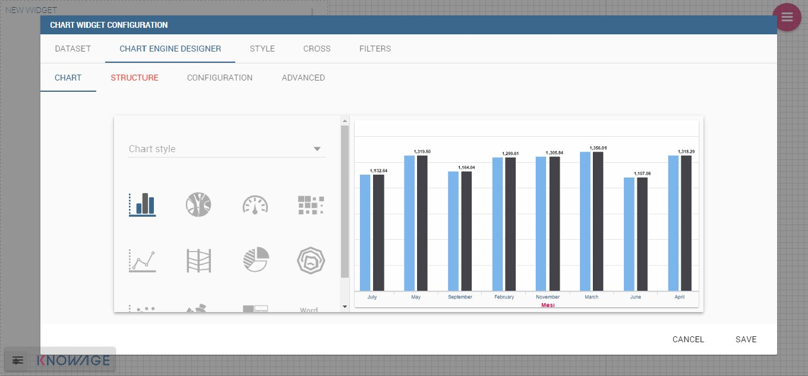

    Chart editor.

After choosing the appropriate chart type you must go into the **Structure** page. Here it is possible to select the measures and the attributes chosen for the chart.

.. _chartstructure:
.. figure:: media/image92.png

     Chart structure.

Clicking on the **Configuration** page you will found eight different blocks as you can see in figure below.

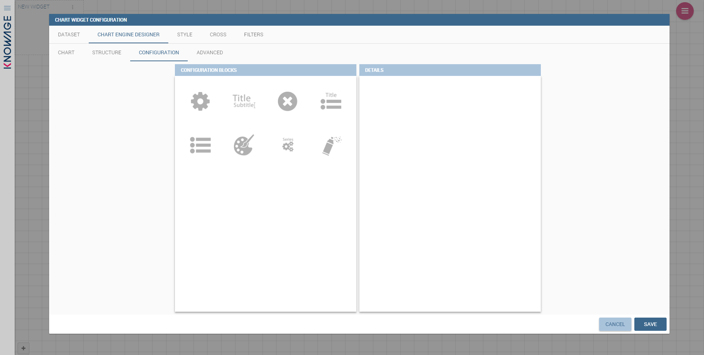

     Chart configuration.

In detail these blocks concern:

-  **Generic Details**, as the orientation of the chart, the family and the size font.
-  **Title and Subtitle details**
-  **No data message** where it is possible to put a message where the data are not founded.
-  **Legend Title**
-  **Legend Items**
-  **Color Palette**
-  **Advanced Series Configuration**
-  **Custom Colors**

These eight blocks are common to all chart types; anyway, some chart types may have additional blocks.

The **Advanced** tab contains extra features, usually exploited by an expert user. Here the user can see all settable properties associated to the chart: it reflects the property tabs that an expert user should manually edit to generate a json template.

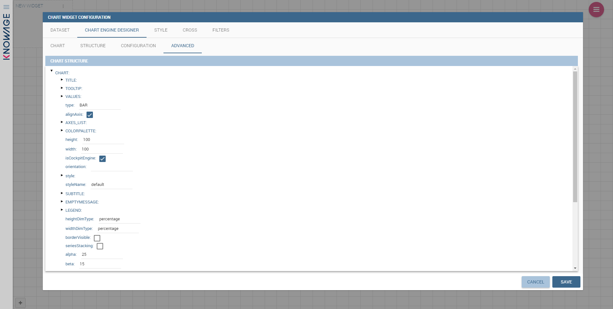

    Chart Advanced Features.

In the next subsections, the available functionalities of the Structure, the Configuration and the Advanced tabs are described in a more specific way.

Structure
~~~~~~~~~

The “Structure” tab of the designer is the core of the Chart development. Here it is possible and mandatory to choose the measures and the attributes. When selected, the tab shows a two axes panel. The horizontal axis indicates the X-axis where you must choose one or more attributes. As well, the left axis is the Y-axis and here you must choose measures. You can also insert manually the axis title for both the X and the Y axis if the chart is configured to have axis titles.

.. warning::
    **Chart type changemens may cause broke down**
    
    Before creating any chart, it is convenient to be sure of    what kind of chart you want to develop. We stress that the user can    change the chart type afterwards, but at the expense of a loss of just defined settings.

In this section it’s possible to customize the labels of the axis, titleand grid style clicking on different buttons. With the arrow button, on the top of the Y-axis and X-axis, it’s possible to choose the axis configuration detail, the axis title configuration, the major and minor grid configuration (just for Y-axis) and ordering column (just for X-axis). With the pencil button opens a window on the right with the series configuration details where it’s possible to choose the aggregation way, the order type of the series, if the data will be shown e so on. Finally, with the strip cartoon button you can choose the features of the tooltip (font color, text alignment, ecc). If the chart in place does not allow the customization of the axes the specific button will be disabled or not visible. The Figure below will show in detail the three buttons above explained:

.. figure:: media/9597.png

    From left to right: (a) Generic configuration axis (the specific arrow). (b) Generic configuration axis.

.. figure:: media/image97.png

    Series style configuration.

.. figure:: media/image98.png

    Series tooltip details.

Configuration
~~~~~~~~~~~~~

The **Configuration** section contains options to define the generic style of the chart. Here you can set the dimensions of the chart, the background color, insert the title and subtitle and define their style, choose the series palette, associate a specific color to a particular serie or category, add and configure the legend. The listed options are an example of what you can configure in the tab.

Note that for the color palette details you can use one already in the list or you can choose any color inserting the hex color code with the hashtag symbol. This is a very useful feature to customize the output.

.. figure:: media/image99.png

    Color box editing.

In particular, in the 6.3 version, it has been introduced a new configuration option: the Custom Color.

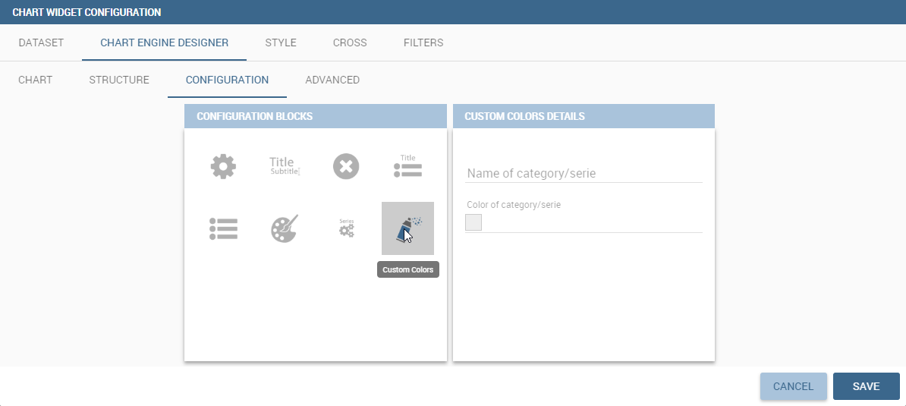

    Custom Colors details.

With this new option it is possible to assign a specific color to a particular category and/or serie or to a particular value of a category and/or serie. Look at the following figure for an example.

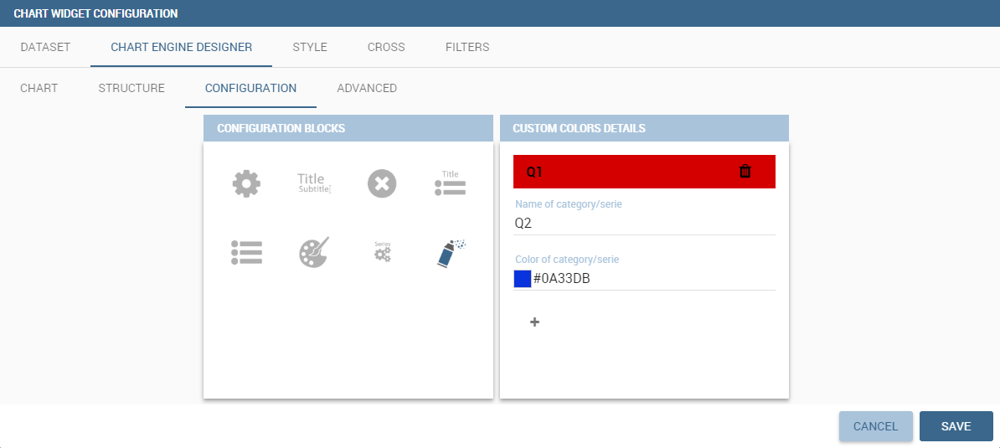

    Custom Colors example.

To add a custom color simply write the category/serie value or name, select a color with the color piker and then click on the plus button. In the figure example it is assigned a color for each value of the ‘QUARTER’ category.

Indeed, the options available in this tab change according to the chart selected enabling different configurations. See Chart types in detail for a detailed description of the specific options of each chart.

Advanced options
~~~~~~~~~~~~~

The **Advanced** tab contains some advanced options to more customize the chart. Here it is possible, for example, to set the tooltip options, the widget dimensions, if the chart is stacking or not, the grouping type.

.. figure:: media/image140.png

    Advanced tab.

Down here are listed some of the most useful and new options.

The **dataLabels** option can be found under the path VALUES -> SERIE -> 0 or another serie -> dataLabels. The option is available only for measures. Here it is possible to set the labels style such as the color, font family or font weight.

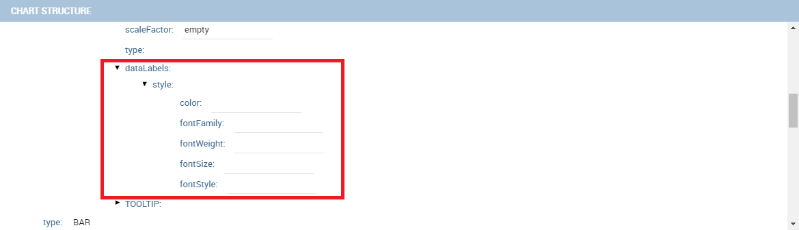

    dataLabels option.

The **TOOLTIP** option allows to set the width and the radius of hte tooltip's border.

The **plotBands** and **plotLines** options can be found under the path AXES_LIST -> AXIS -> 0 or another serie. With these options is possible to plot respectively bands and lines on the chart with fixed values and to set their style, like the line width and the line type or the band color.

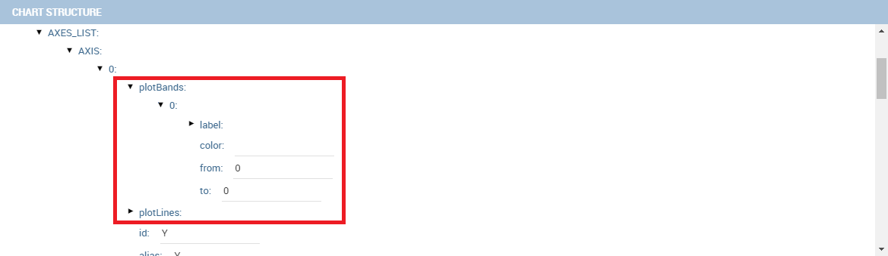

    plotBands option.

The **min** and **max** options are under the path AXES_LIST -> AXIS -> 0 or another serie. They are available only for series and allow to set the maximum and minimum axis value for the selected sere's axis.

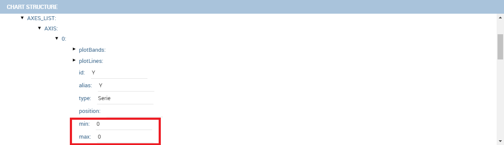

    min and max options.

Chart types in detail
-------------------------

This section describes the different types of chart and how to create them within the **Chart Engine** of Knowage.

Traditional charts
~~~~~~~~~~~~~~~~~~

Knowage allows you to create the so-called traditional charts like bar, line, pie, radar and scatter chart in a fancy way.

Each chart type is built on a specific dataset. Despite all, there are some general rules that can be applied to those “simplier” and common charts. The minimum requirement is to define/have a dataset with at least one attribute column and one measure column. Then you can select the type of chart you want to use from the **Chart** section; meanwhile using the **Structure** section you can fill in the category box with one or more attributes (typically these will be place in the X-axis) and in the series box with one or more measures (typically placed as Y-axis’ values). Refer to *Chart Structure* figure as example.

Once you have selected the attributes and measures you can edit the series style and axis style configurations as explained in My first Chart. Then go to **Configuration** to set the chart dimension, the title, the legend and to choose how to associate colors to series.

Some charts are endowed with datetime and grouping functions. In particular, it is possible to enable the grouping/splitting functions to **Bar** and **Line** charts.

The user can reach those functions just clicking on the “little arrow” located at the right end of category bar.

.. figure:: media/image100.png

    Datetime and grouping function.

The grouping functions can be implemented only through specific categories and series configurations. As shown in figure below, the grouping function cannot be applied with just one attribute as category. To allow the function to be applied, the user must define two attributes as category fields.

.. figure:: media/image101.png

     Error alarm when enabling the grouping function.

As well, the user can use the splitting functions to divide one series over the second one or over the second category.

To split the first series over the second one, remember that it is necessary to choose only one attribute as category field and two measures as series values. The following figure shows an example.

.. figure:: media/image102.png

    Split over second series.

Meanwhile to split a measure over second category it is mandatory to choose exactly two attributes as category field and only one measure as series value, as shown in figure below.

.. figure:: media/image103.png

    Split over second category.

Futhermore, in the occurance the chart uses one datetime attribute as category field, the user can improve visualization applying the datetime function to custom date format.

.. figure:: media/image104.png

    Datetime function usage.
    
For bar and line chart you can add more then one container for adding series in **Structure** section. In that case you will have in your chart more then one axis for series. 
In **Advanced** section you can specify to align these axis to 0 (zero) value. It is check box **alignAxis** where checked means that axises will be aligned to 0, and unchecked means that they will not be aligned.
 
For pie chart inside **Advanced** section you can set configuration for your toolip: to show/hide absolute value and/or percentage. Inside **tooltip** property of serie object you can find properies **showAbsValueTooltip** and **showPercentageTooltip**.

Scatter chart
~~~~~~~~~~~~~

A scatter chart is a graphical representation of scattering phenomenon of data. It is useful when the user wants to underlight the density of data upon certain spots to the detriment of readability of single points. If you select a scatter chart in the **Configuration** section you will have Ticks and Lables Details instead of Advanced Series Configuration. Be carefull to fill in the **Scatter configuration** with the **Zoom type**, as showed below.

.. figure:: media/image105.png

    Scatter Chart, ticks and labels details.

You must check if you want that the values in the Y-axis start (or end) in the first (last) tick or in the first (last) value of the dataset and if you want that the last label of the category axis should be showed.

Sunburst chart
~~~~~~~~~~~~~~

The sunburst chart is a graph with a radial layout which depicts the hierarchical structure of data displaying a set of concentric rings. The circle in the center represents the root nodes, with the hierarchy moving outward from the center. The slices in the external rings are children of the slice in the inner circle which means they lie within the angular sweep of the inner circle. The area of each slice corresponds to the value of the node. Even if sunburst charts are not efficient space-wise, they enable the user to represent hierarchies in a more immediate and fascinating way.

To create a sunburst chart in Knowage you just have to select a dataset with at least two attribute columns describing the hierarchy and at least a measure column that indicates the width of the slices. An
example of dataset for the sunburst chart is showed in Table below.

.. _exampleofdatsetsunburst:
.. table:: Example of dataset for the sunburst chart.
   :widths: auto
   
   +----------------------+----------------+------+
   |    CATEGORY          | SUBCATEGORY    | UNIT |
   +======================+================+======+
   |    Baking Goods      | Cooking Oil    | 349  |
   +----------------------+----------------+------+
   |    Baking Goods      | Sauces         | 109  |
   +----------------------+----------------+------+
   |    Baking Goods      | Spices         | 290  |
   +----------------------+----------------+------+
   |    Baking Goods      | Sugar          | 205  |
   +----------------------+----------------+------+
   |    Bathroom Products | Conditioner    | 64   |
   +----------------------+----------------+------+
   |    Bathroom Products | Mouthwash      | 159  |
   +----------------------+----------------+------+
   |    Bathroom Products | Shampoo        | 254  |
   +----------------------+----------------+------+
   |    Bathroom Products | Toilet Brushes | 92   |
   +----------------------+----------------+------+
   |    Bathroom Products | Toothbrushes   | 94   |
   +----------------------+----------------+------+

Once you selected the dataset and the type of chart, choose at least two attributes in the X-axis panel and a measure in the Y-axis panel as showed in the following figure.

.. figure:: media/image106.png

     Sunburst configuration.

Then click on **Configuration**. As you can see the features are not exactly the same as traditional chart. We give some tips on most important sunburst settings.

Using the **Generic** button you can set the opacity on mouse movement and choose how to display the measure values: absolute, percentage or both. These two features allow the visualization of data just moving the mouse over the slice: the slice is highlighted and values are shown in the center of the ring while the root-node path for the node selected is displayed on the left bottom corner of the page. To custom the root-node path, click on the **Sequence** icon and choose position, label tail size and text style. The tooltip is a mandatory field since it shows the value of the selected slice. Therefore be sure to have filled it before saving by using the **Explanation detail** panel. Figure below sums up the three features.

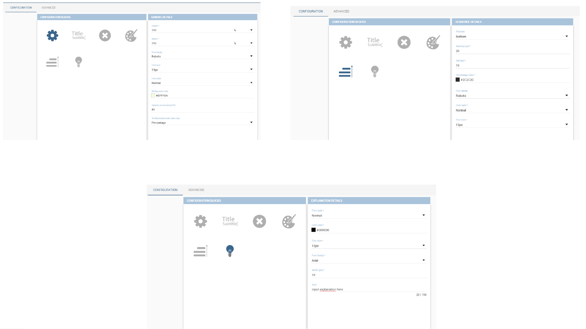

    Generic, Sequence and Explanation configuration

In Figure below you find the sunburst obtained with data of :numref:`exampleofdatsetsunburst`.

.. figure:: media/image1101112.png

    From left to right: (a) Sunburst. (b) Sunburst category.(c) Sunburst subcategory.
    
Inside **Advanced** section you can set value for scale that will increase/decrease your chart. You need to set numeric value for property **scale**. 

Wordcloud chart
~~~~~~~~~~~~~~~

The wordcloud chart is a graphic to visualize text data. The dimension of the words and colors depend on a specified weight or on the frequency of each word.

The dataset to create a wordcloud should have at least a column with attributes and only one column with numerical data which represents the weight to assign to each attribute. Choose one attribute as category field (the wordcloud accept only one attribute in the category box) and a measure as series field.

Switch to the **Configuration** section to set the generic configuration of the chart and to custom fields of the **Word settings datails**. Here the use can decide if to resize the words accordingly to the measure retrieved in the dataset (**Series** option) or accordingly to the frequency of the attributes in the dataset (**Occurrences** option). Moreover it is possible to set the maximum number of words that you want to display, the padding between the words, the word layout and whether or not you want to prevent overlap of the words as showed in Figure below.

.. figure:: media/image113.png

     Wordcloud chart specific configuration.

Treemap chart
~~~~~~~~~~~~~

The treemap is a graphical representation of hierarchical data, which are displayed as nestled rectangles. Each branch of the tree is given by a rectangle, which is tiled with smaller rectangles representing sub-branches. The area of the rectangles is proportional to a measure specified by a numerical attribute. The treemap is usefull to display a large amount of hierarchical data in a small space.

To create a treemap chart you have to select a dataset as the one described for the sunburst chart in the  Parallel chart.

Once you have selected the dataset, choose the treemap chart type in the designer and then at least two attributes into the X-axis panel. The order of the attributes in the X-axis panel must reflects the order of the attributes in the hierarchy starting from the root to the top.

Finally you can set generic configurations and colors palette in the **Configuration** tab and advanced configurations in **Advanced editor** tab.

In Figure below we show the Treemap resulting with data of our example

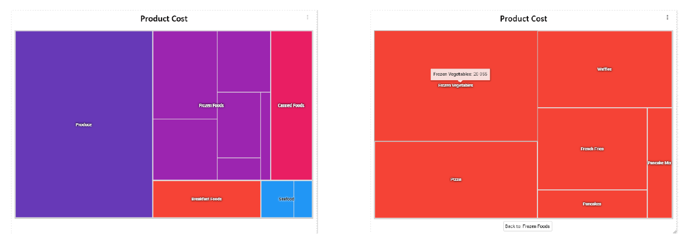

    From left to right: (a) Treemap. (b) Treemap sub-branches.

Parallel chart
~~~~~~~~~~~~~~

The parallel chart is a way to visualize high-dimensional geometry and multivarious data. The axes of a multidimensional space are represented by parallel lines, usually equally spaced-out, and a point of the space is represented by a broken line with vertices on the parallel axes. The position of the vertex on an axis correspond to the coordinate of the point in that axis.

To create a parallel chart select a dataset with at least one attribute and two columns with numerical values. You can find an interesting example of dataset in the next table where we display some of its rows.

.. _exampleofdatsetparallel:
.. table:: Example of dataset for the parallel chart.
   :widths: auto
   
   +--------+--------------+-------------+--------------+-------------+-----------------+
   |    ID  | sepal_length | sepal_width | petal_length | petal_width | class           |
   +========+==============+=============+==============+=============+=================+
   |    36  |    5.0       |    3.2      |    1.2       |    0.2      | Iris-setosa     |
   +--------+--------------+-------------+--------------+-------------+-----------------+
   |    37  |    5.5       |    3.5      |    1.3       |    0.2      | Iris-setosa     |
   +--------+--------------+-------------+--------------+-------------+-----------------+
   |    38  |    4.9       |    3.1      |    1.5       |    0.1      | Iris-setosa     |
   +--------+--------------+-------------+--------------+-------------+-----------------+
   |    39  |    4.4       |    3.0      |    1.3       |    0.2      | Iris-setosa     |
   +--------+--------------+-------------+--------------+-------------+-----------------+
   |    40  |    5.1       |    3.4      |    1.5       |    0.2      | Iris-setosa     |
   +--------+--------------+-------------+--------------+-------------+-----------------+
   |    41  |    5.0       |    3.5      |    1.3       |    0.3      | Iris-setosa     |
   +--------+--------------+-------------+--------------+-------------+-----------------+
   |    42  |    4.5       |    2.3      |    1.3       |    0.3      | Iris-setosa     |
   +--------+--------------+-------------+--------------+-------------+-----------------+
   |    43  |    4.4       |    3.2      |    1.3       |    0.2      | Iris-setosa     |
   +--------+--------------+-------------+--------------+-------------+-----------------+
   |    44  |    5.0       |    3.5      |    1.6       |    0.6      | Iris-setosa     |
   +--------+--------------+-------------+--------------+-------------+-----------------+
   |    45  |    5.1       |    3.8      |    1.9       |    0.4      | Iris-setosa     |
   +--------+--------------+-------------+--------------+-------------+-----------------+
   |    66  |    6.7       |    3.1      |    4.4       |    1.4      | Iris-versicolor |
   +--------+--------------+-------------+--------------+-------------+-----------------+
   |    67  |    5.6       |    3.0      |    4.5       |    1.5      | Iris-versicolor |
   +--------+--------------+-------------+--------------+-------------+-----------------+
   |    68  |    5.8       |    2.7      |    4.1       |    1.0      | Iris-versicolor |
   +--------+--------------+-------------+--------------+-------------+-----------------+
   |    69  |    6.2       |    2.2      |    4.5       |    1.5      | Iris-versicolor |
   +--------+--------------+-------------+--------------+-------------+-----------------+
   |    70  |    5.6       |    2.5      |    3.9       |    1.1      | Iris-versicolor |
   +--------+--------------+-------------+--------------+-------------+-----------------+
   |    71  |    5.9       |    3.2      |    4.8       |    1.8      | Iris-versicolor |
   +--------+--------------+-------------+--------------+-------------+-----------------+
   |    101 |    6.3       |    3.3      |    6.0       |    2.5      | Iris-virginica  |
   +--------+--------------+-------------+--------------+-------------+-----------------+
   |    102 |    5.8       |    2.7      |    5.1       |    1.9      | Iris-virginica  |
   +--------+--------------+-------------+--------------+-------------+-----------------+
   |    103 |    7.1       |    3.0      |    5.9       |    2.1      | Iris-virginica  |
   +--------+--------------+-------------+--------------+-------------+-----------------+
   |    104 |    6.3       |    2.9      |    5.6       |    1.8      | Iris-virginica  |
   +--------+--------------+-------------+--------------+-------------+-----------------+
   |    105 |    6.5       |    3.0      |    5.8       |    2.2      | Iris-virginica  |
   +--------+--------------+-------------+--------------+-------------+-----------------+
   |    106 |    7.6       |    3.0      |    6.6       |    2.1      | Iris-virginica  |
   +--------+--------------+-------------+--------------+-------------+-----------------+
   |    107 |    4.9       |    2.5      |    4.5       |    1.7      | Iris-virginica  |
   +--------+--------------+-------------+--------------+-------------+-----------------+
   |    108 |    7.3       |    2.9      |    6.3       |    1.8      | Iris-virginica  |
   +--------+--------------+-------------+--------------+-------------+-----------------+
    
In this example three different classes of iris are studied. Combining the values of some sepal and petal width or lenght, we are able to find out which class we are looking at. In Figure below (a part) you can find the parallel chart made with the suggested dataset. While in next figure (b part) it is easy to see, thanks to selection, that all iris with petal length between 2,5 and 5.2 cm and petal width 0,9 and 1,5 cm belong to the iris-versicolor class.

.. _fromleftparallrighetchart:
.. figure:: media/image11617.png

    From left to right: (a) Parallel. (b) Parallel chart selection.

Therefore, select **parallel** as chart type using the designer interface, then choose one or more attributes in the X-axis panel and one or more measures in the Y-axis panel.

On the **Configuration** tab you can set the generic configuration for the chart and you must fill the **Series as filter column** filed under ”Limit configuration”.

Heatmap chart
~~~~~~~~~~~~~

Heatmap chart uses a chromatic Cartesian coordinate system to represent a measure trend. Each point of the Cartesian system is identified by a couple of attributes. Note that one attribute must be a datetime one. Meanwhile, each couple corresponds to a measure that serves to highlight the spot with a certain color according to the chosen gradient. Figure below gives an example of how an heatmap chart looks like inside Knowage.

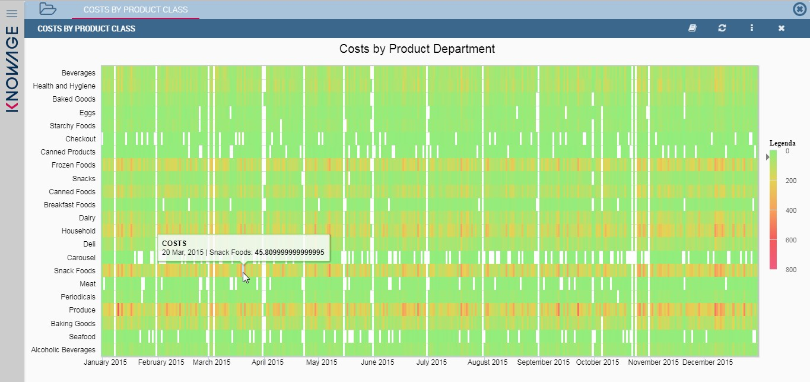

    Heatmap example.

Before configuring a heatmap chart, be sure that your dataset returns at least two attributes, one of which **must** be a datetime one, and (at least) one measure. Once entered the chart designer, choose the “Heatmap” type and move to the “Structure” tab. Use the datetime attribute and an other attribute as category fields and one measure as series fields. Figure below shows an example.

.. figure:: media/image119.png

    Configuring the attributes and the series for the heatmap chart.

Note that for series axis it is possible to specify the values’ range by assigning a minimun and the maximum value, as shown in figure below. Otherwise, the engine will automatically link the axis scale to dataset results set.

.. figure:: media/image12021.png

    Configure min and max values for series.

The next step is to move to **Configuration** tab and select the **Color palette** icon. Here (figure below) the user has to define the chromatic scale which will be associated to the measure values. The panel will demand the user to insert the first, the last color and the number of bands that will constitute the color scale.

.. _addgradientpanel:
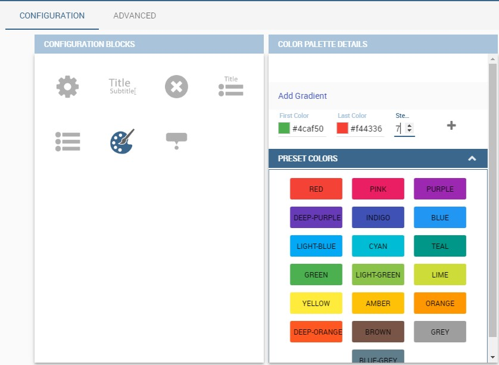

    Add gradient panel.
   
The engine will create a progressive color scale as shown in the left image of figure below. To custom the scale the user can use the Preset colors and use the arrow to move up and down Heatmap chart the added color or the user can increase the number of steps and then
some intermediate color to leave more contrast between them.

.. figure:: media/image12324.PNG

    Custom color scale.

Remember to edit both **Legend** and **Tooltip** configuration in the **Tooltip details** panel to improve the readability of the chart.

Chord chart
~~~~~~~~~~~

Chord diagram is a graph which allows to show relationship between entities and between data in a matrix. The entities can belong to an unique category while the arc be non-oriented or belong to two different categories. In this latter case, they have direct arcs. The data are arranged radially with arcs that represent the connection between points. The width of the arc connecting two points depends on the weight assigned to the edge connecting these two points. This graphic is usefull when you want to represent a large number of data in a small space.

The chord diagram requires a dataset that have a column with numerical values. These represent the weight of the arc connecting two points. It also must have two columns with the entries for the entities to be connected in the diagram. These two columns must have the same set of values so that the engine can understand the relation between all the entities. If there is not a relation between two entities the weight of the arc is zero. Note that when you create a directed chord diagram with two different categories, all the relations between entities of the same category have a zero weight.

An example of dataset for the chord chart is represented in Table below:

.. table:: Example of dataset for the chord chart.
   :widths: auto
   
   +--------------------+--------------+-----------+
   |    CUSTOMER\_ CITY | STORE\_ CITY | VALUE     |
   +====================+==============+===========+
   |    Beaverton       | Portland     | 4609.0000 |
   +--------------------+--------------+-----------+
   |    Lake Oswego     | Portland     | 4201.0000 |
   +--------------------+--------------+-----------+
   |    Milwaukie       | Portland     | 5736.0000 |
   +--------------------+--------------+-----------+
   |    Oregon City     | Portland     | 3052.0000 |
   +--------------------+--------------+-----------+
   |    Portland        | Portland     | 3984.0000 |
   +--------------------+--------------+-----------+
   |    W. Linn         | Portland     | 3684.0000 |
   +--------------------+--------------+-----------+
   |    Albany          | Salem        | 5544.0000 |
   +--------------------+--------------+-----------+
   |    Corvallis       | Salem        | 8542.0000 |
   +--------------------+--------------+-----------+
   |    Lebanon         | Salem        | 8015.0000 |
   +--------------------+--------------+-----------+
   |    Salem           | Salem        | 6910.0000 |
   +--------------------+--------------+-----------+
   |    Woodburn        | Salem        | 6335.0000 |
   +--------------------+--------------+-----------+
   |    Albany          | Albany       | 0.0000    |
   +--------------------+--------------+-----------+
   |    Beaverton       | Beaverton    | 0.0000    |
   +--------------------+--------------+-----------+
   |    Corvallis       | Corvallis    | 0.0000    |
   +--------------------+--------------+-----------+
   |    Lake Oswego     | Lake Oswego  | 0.0000    |
   +--------------------+--------------+-----------+
   |    Lebanon         | Lebanon      | 0.0000    |
   +--------------------+--------------+-----------+
   |    Milwaukie       | Milwaukie    | 0.0000    |
   +--------------------+--------------+-----------+
   |    Oregon City     | Oregon City  | 0.0000    |
   +--------------------+--------------+-----------+
   |    Portland        | Portland     | 0.0000    |
   +--------------------+--------------+-----------+
   |    Salem           | Salem        | 0.0000    |
   +--------------------+--------------+-----------+
   |    W. Linn         | W. Linn      | 0.0000    |
   +--------------------+--------------+-----------+   

Once you have selected the dataset open the designer and select chord chart type. Then choose the two entities in the X-axis panel and the value in the Y-axis panel as showed in figure below. Now you are ready to customize the chart setting the generic configuration and the palette on **Configuration**.

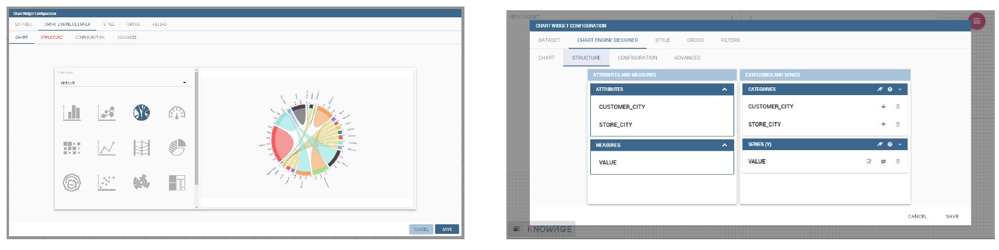

    Chord configuration.

Gauge chart
~~~~~~~~~~~

Gauge chart uses needles to show information as a dial reading. It allows to visualize data in a way that resembles a real-life speedometer needle. The value of the needle is read on a colored data scale. Colors are used to provide additional performance context (typically green for good and red for bad). This chart type usually is used in dashboards to show key performance indicators or any measure having reference values.

For gauge chart you should have only series items, the one that gives you values for the chart. So, the defined dataset to be used should provide numerical data for the Y-axis for the gauge chart. After selecting the dataset go to the designer and select **gauge** in chart type combobox. Then choose one or more measure on the Y-axis panel on the **Structure**. Moreover you must not forget to provide all data needed for the **Axis style configuration** of the Y-axis.

When you finished to set all the mandatory and optional parameters and configurations in the **Structure** tab you can select the **Configuration** tab and set the generic configuration of the chart.

A short comment on chart drill down
---------------------------------------

Knowage **Chart Engine** allows you to drill down into categories. This means that the user can explore the details of each category as many times as configured. Indeed, to let the chart admits the drill down, it is necessary first that the chart in place allows it. Secondly the user must have dragged and dropped multiple attributes into the category axis in the **Configuration** tab. The order of the attributes in the X-axis panel determines the sequence in which the categories are going to be showed. When executing the chart the label of the category is linkable and it is possible to click on the label to drill down.

The chart that enables the drill down are:

-  Bar Chart
-  Line Chart
-  Pie Chart
-  Treemap

To give an idea of the outcome, we take as instance the Bar Chart drill down. In the following example, the selected categories are four and called: ``product_family``, ``product_department``, ``product_category`` and ``product_subcategory``. Once we open the document, we get as shown below:

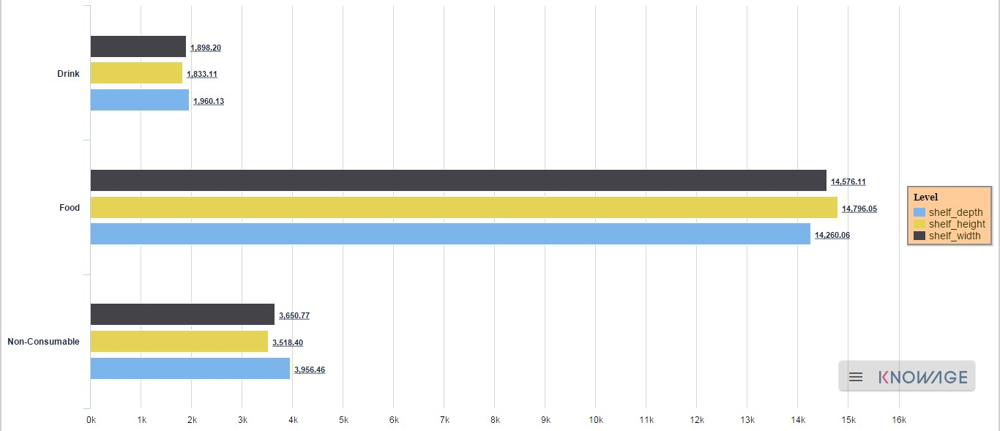

    Drillable Bar Chart

When selecting ``shelf_depth`` measure of the Food category one gets (see next figure):

.. figure:: media/image128.png

    Drillable Bar Chart: first drill

Once again, we can select ``Frozen food`` subcategory and drill to a second sub-level as below:

.. figure:: media/image129.png

    Drillable Bar Chart: second drill

And so on to the fourth subcategory. Selecting the “Back to: ...” icon available at the right corner of the graphic, the user can get back to the previous level. This efficient feature allows the user to have a deep insight of the analysis and draw important conclusions from it.

Stand alone charts
------------------------

The previous chapters were dedicated to the end user approaching the Knowage Chart engine. We stressed how the final user must pass through the Cockpit interface to develop graphs. We want now spend some words about the developer experience. Indeed, if you are a technical user you can also create a chart as a stand alone document.

Once you enter the Knowage environment with developer credentials, open the technical menu directly into the **Documents Development** area, as shown in Figure below.

.. figure:: media/image130.png

    Documents Development.

Then click on the “Plus” icon of the **Create Document** feature and select **Generic Document**.

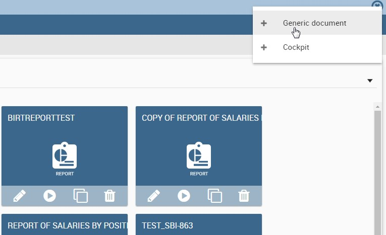

    Create a new document.

You will be asked to fill in the form. We give an example in the following figure.

.. _documentdetailschart:
.. figure:: media/image132.png

    Document Details.

The fields marked with an asterisk are mandatory. Select the Chart type and engine. Choose the dataset with which you want to manage your analysis. Use the magnifier to choose among the available datasets. Remember to pick out in which folder you want your chart to be stored (see next figure) and finally save.

.. _selectfolderforchart:
.. figure:: media/image133.png

    Select the folder in which you want your chart to be saved.

A new template can be generated through the editor clicking on **Template build** as showed below or a template previously created can be uploaded.

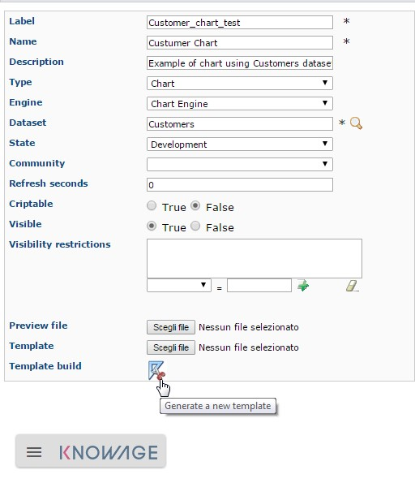

    Template build.

If you choose to implement the new Chart through the Template Build feature, the steps to follow are exactly the same of those seen for the final user. In fact, once you click on the Template Build icon, you are redirected to the Chart designer. In this case, by the way, another functionality is enabled, the Cross Navigation.

Cross Navigation
----------------------

When you develop a standalone chart it is possible to add a cross navigation path to it. This means that, once the chart is launched, its elements becomes clickable and it redirects the user to a second document.

For charts documents outputs parameters are automatically generated during the creation of the document. Therefore you can define cross
navigation in the default way, as explained in Cross Navigation.
