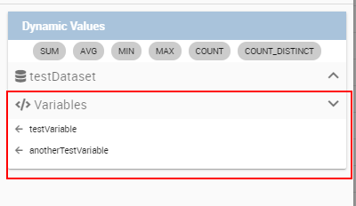
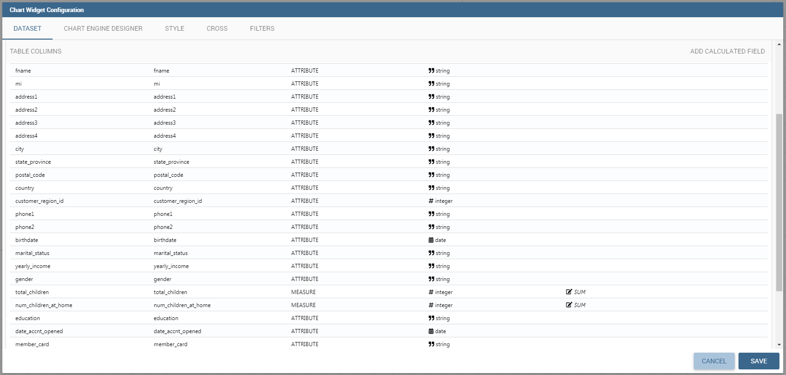
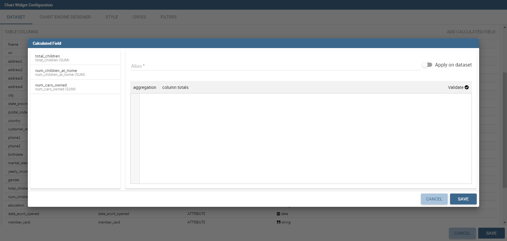
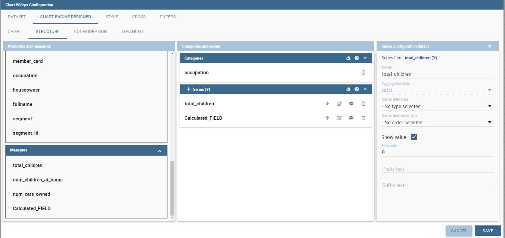
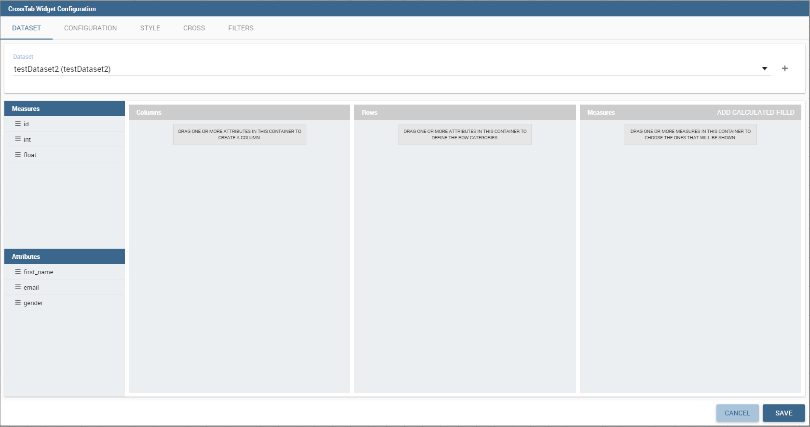
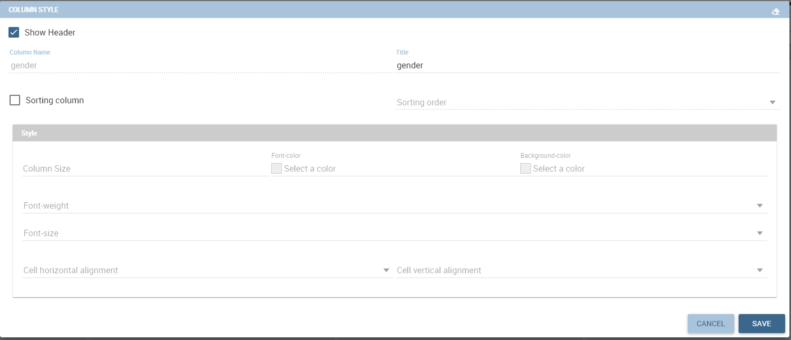
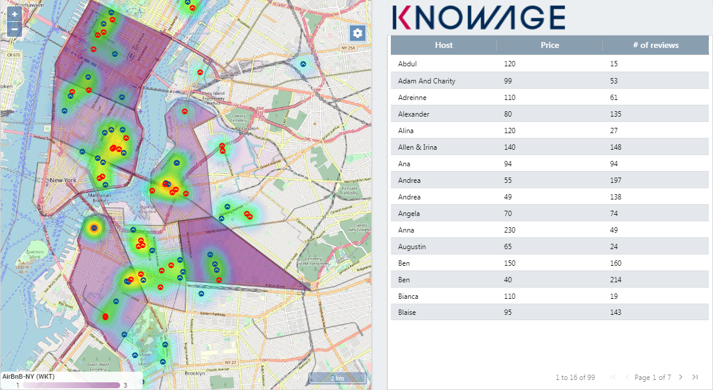
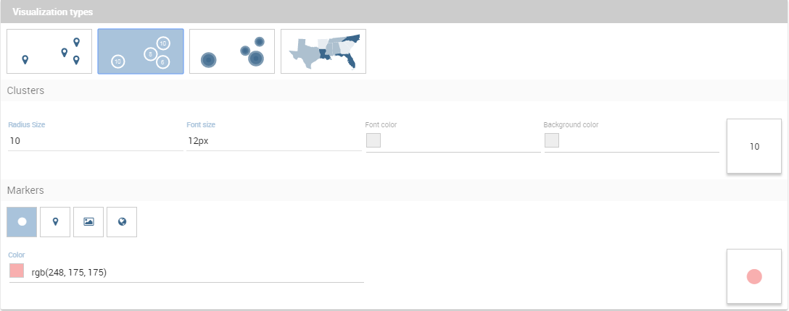
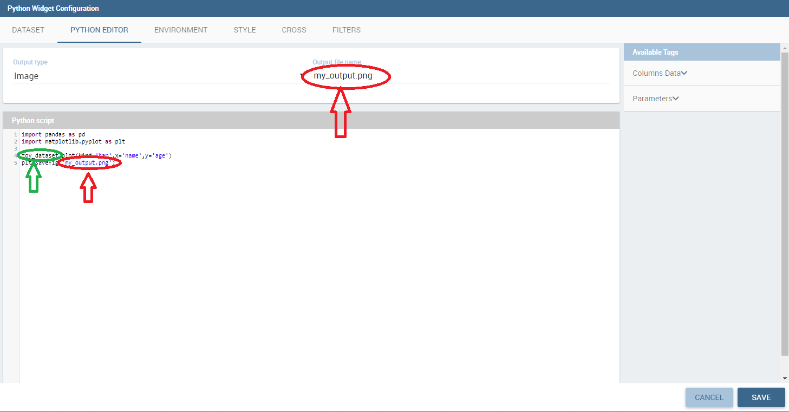

# Cabina

Knowage permite a los usuarios finales *cabinas interactivas autoconstruidas* a través de una interfaz intuitiva e interactiva, con unos pocos clics y un simple arrastrar y soltar. Esto le permite componer sus documentos analíticos con múltiples widgets y definir asociaciones entre ellos, de modo que al hacer clic en un widget, los datos se actualizan automáticamente en otros widgets.

.. figura:: media/image135.png

    Cockpit document example.

Permite *mash-up de datos* para integrar datos empresariales y datos de origen externo.

Los documentos de cabina pueden ser creados y ejecutados tanto por usuarios técnicos como por usuarios finales y forman parte del sistema de informes ad-hoc de Knowage. Un aspecto clave es que diferentes widgets pueden basarse en diferentes conjuntos de datos y, por lo tanto, en diferentes fuentes de datos. El único requisito necesario para definir asociaciones entre dos o más conjuntos de datos es la presencia en cada uno de ellos de una o más columnas que contengan los mismos datos.

.. advertencia::
**Excepción de estructura de sección**

    Since there are no differences between the cockpit interface reached by a final user and the one reached by a technical user, the cockpit designer is described in one unique My first Cockpit for both those kind of users. By the way, when necessary we will   highlight how the same functionality can be exploited accordingly to the user’s role.

## Mi primera cabina

Puedes crear tu nuevo Cockpit desde el **Análisis** zona de la **Área de trabajo** haciendo clic en el icono "Más" y seleccionando **Cabinas** si ingresa a Knowage Server como usuario final, mientras que puede ingresar al navegador de documentos e iniciar una nueva cabina usando el ícono "Plus" si ingresa a Knowage Server como administrador.

.. importante::
**Llegar al diseñador de la cabina**

    We stress that the cockpit interface is reached by the final user and the administrator following two different paths.

Veamos cómo construir una cabina y cómo se muestra la interfaz dentro del servidor. Una vez abierta, la interfaz de la cabina es una página vacía con una barra de herramientas que contiene diferentes opciones descritas en la tabla a continuación.

.. tabla:: Barra de herramientas del editor de cabina.
:widths: automático

\+--------------------------------+-----------------------+-----------------------+
|    | de iconos Nombre | | de funciones
\+================================+=======================+=======================+
| .. figura:: media/image136.png | **Menú de cabina**      | Menú de configuración de |
|                                |                       | Cabina.              |
\+--------------------------------+-----------------------+-----------------------+
| .. figura:: media/image137.png | **Añadir widget**        | Abre una ventana |
|                                |                       | donde puede crear |
|                                |                       | un nuevo gráfico o tabla, |
|                                |                       | añadir textos, imágenes o |
|                                |                       | Documentos de conocimiento.    |
\+--------------------------------+-----------------------+-----------------------+
| .. figura:: media/image138.png | **| general Abre la ventana |
|                                | configuración**       | donde se establece el |
|                                |                       | | general de la cabina
|                                |                       | opciones (nombre, etiqueta, |
|                                |                       | mostrar menú, etc.) y |
|                                |                       | estilo de widget (encabezado, |
|                                |                       | títulos, fronteras |
|                                |                       | etc.).                |
\+--------------------------------+-----------------------+-----------------------+
| .. figura:: media/image139.png | **| de datos Abre una ventana |
|                                | configuración**       | donde puede administrar |
|                                |                       | el conjunto de datos, el |
|                                |                       | asociación entre |
|                                |                       | conjuntos de datos y la |
|                                |                       | frecuencia de actualización.    |
\+--------------------------------+-----------------------+-----------------------+
| .. figura:: media/image140.png | **Selecciones**        | Agrega un widget que |
|                                |                       | gestiona las selecciones.   |
\+--------------------------------+-----------------------+-----------------------+
| .. figura:: media/image141.png | **Borrar caché**       | Limpia | temporales
|                                |                       | datos.                 |
\+--------------------------------+-----------------------+-----------------------+
| .. figura:: media/image142.png | **Guardar como**           | Abre la ventana |
|                                |                       | Para guardar la | de la cabina
|                                |                       | documento como un nuevo |
|                                |                       | documento.             |
\+--------------------------------+-----------------------+-----------------------+

Haciendo clic en el botón **Agregar widget** Puede agregar un widget que contenga un **Mensaje de texto**un **Imagen**un **Gráfico**un **Mesa**un **Tabla cruzada**un **Documento**el **Selecciones activas** o el **Selector** a su cabina, como se muestra a continuación.

.. figura:: medios/image143\_bis.png

        Widget Type.

A continuación entramos en detalles de cada widget disponible.

Widget de texto

```

By clicking the button Text Widget you can add text to your cockpit. As shown in figure below, the widget editor opens and it is divided in three tabs: the **Text editor**,
the **Style**, the **Dataset** and the **Filters** tab.

.. _texteditwidgetconf:
.. figure:: media/image144.png

     Text editor of text widget configuration.

On the “Text editor” tab you can type the desired text in center panel and customize it. Using the dataset tab it is possible to associate dataset values to the text and
read it real time at each execution. Move to the dataset tab to add a dataset to the widget. Then, going back to the Text editor tab, the user will find the dataset
columns on the right side, as well as a set of functions to eventually apply to the fields. We summed up main steps in the Figure below. To add a function to a measure
first select the desired function and then the field of numeric type.

.. figure:: media/image1454647.png

    Editing a dynamic text.

It's also possible to add variables values if at least one of them is defined. During the execution of the widget the value will be displayed based on the current variable value.



    Variables in text widget.

On the “Style” tab you can customize the text widget. We have provided all details about this tab in the Table widget. On the “Dataset” tab you can add more dataset to be
used in the dynamic value. Finally, the “Filters” tab can be used to extract limited output from the dataset. We put details off to the table widget subsection.

Image widget
```

Haciendo clic en el botón **Widget de imagen** puede agregar imágenes a su cabina. Como ya se ha visto el editor de widgets se abre y se divide en
tres secciones.

En el **Galería** puede cargar una imagen, eliminarla o seleccionar una de la galería. Consulte la siguiente figura.

.. figura:: media/image148.png

    Gallery tab of Image Widget Configuration.

En el **Estilo** puede configurar el estilo de su widget de imagen con las diferentes opciones que ofrece esta pestaña. Muchos de ellos están definidos en el widget de tabla que encontrarás más adelante.

En el **Cruz** puede definir la navegación a otro documento, como se muestra en la figura siguiente.

.. figura:: media/image149.png

    Cross tab of Image Widget Configuration.

.. advertencia::
**Navegación cruzada solo para usuarios técnicos**

    Due to the fact that parameters can only be managed by a technical user the cross navigation cannot be implemented by the final user.

Para ello, debe activar **Habilitar la navegación cruzada** y seleccione el documento de destino a través de la lista de definición de navegación cruzada.
Esta última bandera es opcional. Si selecciona una definición de navegación cruzada, cuando inicie la navegación cruzada irá directamente al documento de llegada.
Si la definición de navegación cruzada no está definida, cuando inicie el widget de imagen, se mostrará una ventana emergente (consulte la figura a continuación) con la lista de definiciones de navegación cruzada que existen para esta cabina.

.. \_crossnavmultchoice:
.. figura:: media/image150.png

    Cross navigation multiple choices.

Widget de gráfico

```

Charts are an essential representation of data, Knowage let you use many different charts type and configure them according to your needs. We have provided all details about charts type and configuration in Chart chapter.

We recall that also for chart widget it is possible to set cross navigation on elements.

.. warning::
    **Cross navigation only for technical users**

    Due to the fact that parameters can only be managed by technical user the cross navigation cannot be implemented by the final user.

As shown in next figure, it is mandatory to enable the cross navigation feature by using the dedicate tab of chart editor GUI. It is mandatory to choose the column element to be passed to the destination document and associate it to the right output parameter (previoulsy added to the document using the detail interface).

The cross navigation name can be left empty. In case multiple cross navigation definitions have been configured for the document, a pop up will be displayed, letting the user to choose which destination to reach (exactly as we saw earlier for Image widget in the last figure of that paragraph).

.. _crossnavchartwidget:
.. figure:: media/image151.png

    Cross navigation for chart widget.

In addition, if the navigation expects other parameters to be passed, use the bottom part of the page to add the additional parameters. Figurebelow shows an example.

.. figure:: media/image152.png

    Add all output parameters involved in the cross navigation.

It is also possible using Solr datasets and calculated fields with charts.

Dataset fields editing and configuration is possible using the first tab inside widget edit mode, in this way, for example, users can modify aggregations for measures:



In this way it is possible adding new calculated fields on chart by clicking on "Add Calculated field", the standard calculated field editing mode will appear.



Adding new calculated fields is easy as using other measure fields, using Chart Engine Designer structure tab:




Table widget
```

El **Configuración de la tabla de widgets** se abre y le guía a través de los pasos para configurar el widget. Se abre la ventana emergente que muestra el **columna** , como puede ver en la figura a continuación. En detalle, es obligatorio seleccionar un conjunto de datos mediante el cuadro combinado (solo si se ha cargado al menos un conjunto de datos mediante el **Configuración de datos** feature) o haciendo clic en el icono |image156| disponible justo al lado de la línea combobox. Puede paginar la tabla especificando el número de filas por hoja. En consecuencia, el usuario puede establecer propiedades de columnas.

.. |imagen156| imagen:: media/image153.png
:ancho: 20

.. figura:: media/image154.png

    Table configuration window.

De hecho, el área de la columna se divide en dos partes: en la parte superior están los botones para agregar una nueva columna o un campo calcutado. También la nueva funcionalidad de agrupación de columnas está disponible aquí. En la sección inferior, tan pronto como se seleccione el conjunto de datos, puede indicar la columna de ordenación o la columna de selección modal. La selección modal sirve para especificar qué valor se pasará a otros widgets (si la interacción está habilitada) al hacer clic en la celda en el momento de la ejecución del documento. Puede especificar este campo seleccionando un valor del cuadro combinado. De la misma manera, se indica la columna de ordenación y el tipo de orden que dirige el orden de las filas. Puede seleccionar el campo y el pedido de los cuadros combinados dedicados.

Cuando se agrega un conjunto de datos a un widget de tabla, todas sus columnas se enumeran a continuación. Si el usuario no desea mostrar algunos de ellos, puede usar el botón de eliminación disponible al final de cada fila de columna, como se muestra a continuación.

.. figura:: media/image155.png

    Delete a column.

En caso de cancelación accidental o nuevos requisitos de tabla, es posible volver a agregar columnas. Para añadir una nueva columna hay que
haga clic en el botón **Agregar columna** en la parte superior derecha del segundo cuadro. Una vez abierto, puede seleccionar una o más columnas. Cuando haya terminado de seleccionar las columnas deseadas, puede hacer clic en el botón Guardar y sus nuevas columnas aparecerán en la lista de campos. Consulte la figura a continuación.

.. figura:: media/image156.png

    Add a new column.

**Administrar grupos de columnas** abrirá un menú para agregar o quitar grupos de columnas y establecer su estilo. Un grupo de columnas es un contenedor para más de una columna que mostrará un encabezado común entre ellas.

.. figura:: media/image156b.png

    Example column group.

Asimismo, para añadir un campo calculado hay que pulsar en el botón **Agregar campo calculado** junto al icono de agregar columna. Una vez abierto el Asistente de campo calculado, debe escribir un alias para su campo calculado en el área dedicada en la esquina superior del asistente.
Luego puede elegir de la lista sinebar izquierda los campos que desea usar en su fórmula. También puede utilizar funciones aritméticas o utilizar las funciones disponibles en el menú (**Agregaciones**, **totales de columnas**, **Variables**).
Si lo prefiere, puede crear o modificar la expresión manualmente directamente en el panel editable.
Cuando esté satisfecho con su expresión, puede hacer clic en validar para verificar su fórmula sintax o el botón Guardar y su campo calculado aparecerá en la lista de campos.
Proporcionamos un ejemplo en la siguiente figura.

.. figura:: media/image157.png

    Add a calculated field.

Puede elegir entre el comportamiento a nivel de conjunto de datos o el nivel de tabla (predeterminado), es decir, la modalidad de cálculo que implicará campos de tabla o columnas de conjunto de datos para obtener el resultado.
Si elige el comportamiento a nivel de conjunto de datos, el resultado del cálculo se realizará solo a nivel de columnas de conjunto de datos y la agregación implicará todo el resultado del cálculo.

.. figura:: media/image157b.png

    Dataset-level behaviour

Si Dataset es del tipo Solr, las columnas que se muestran en el panel derecho son campos de columnas de dataset y la elaboración de la fórmula de campo calculada se calcula sobre la marcha.

.. figura:: media/image158b.png

Si se establecen variables para la cabina actual, aparecerá el botón de menú de variables, lo que permite agregar valores de variables en la expresión de campo calculada.

.. figura:: media/image157c.png

Menú Variables

En la sección inferior de la ventana, puede ver los campos de la tabla (con su tipo de agregación) enumerados y también puede ordenar las columnas que se muestran en la tabla arrastrando
arriba o abajo, inserte un alias de columna y personalícelo agregando configuraciones de fuente y estilo utilizando el icono en forma de pincel, como puede ver en la figura a continuación.
Aquí puede encontrar características de configuración para ajustar el tamaño de la columna, los caracteres máximos de celda, ocultar las opciones de encabezado de columna o columna y el interruptor de expansión de filas.

.. figura:: media/image157d.png

Configuración de columnas

Si oculta la columna (desde esta vista o desde la lista de columnas), la columna no será visible, pero seguirá utilizándose con fines de agregación.
Si habilita el **función de intervalo de filas**, todos los mismos valores visibles de la columna se contraerán en uno, para evitar repeticiones.

Si la columna es una medida, habrá más funcionalidades disponibles:

    - Inline chart mode: you can choose the visualization type of the measure, and if you choose chart and maximum/minimum values, a chart will appear in the view to represent the cell measure.
    - Thresholds: you can choose to set some thresholds that will trigger font color, background color or will show icons if the chosen condition is satisfied.
    - Format: you can choose the prefix, suffix and the precision (i.e. 9.8 m/s). Please be aware that the data will be formatted following the locale of the user. Otherwise you can choose to treat it as string.

.. \_columnsettings:
.. figura:: media/image158.png

    Column settings.

Tenga en cuenta que aquí puede indicar el tipo de columna y la agregación. Para agregar una agregación a una columna, debe controlar el tipo de datos que tiene esa columna. Sólo se puede agregar una agregación si el valor de la columna es del tipo "número". Las diferentes funciones de agregación son: *ninguno (tampoco puede agregar ninguna función de agregación)*, *Suma*, *Promedio*, *Máximo*, *Mínimo*, *Contar* y *Cuenta distinta*.

Si se ha establecido un grupo de columnas, otra opción estará disponible para establecer el grupo opcional que pertenece a la columna.

Para todas las columnas, si se establece al menos una variable, aparecerá el cuadro de configuración de variables. Dependiendo del uso de la variable, será posible establecer un encabezado dinámico u ocultar la columna condicionalmente.

.. figura:: media/image158c.png

    Variable settings box.

Al hacer clic en el botón más, puede agregar una o más condiciones. Las posibles acciones son:

    - Hide column: the column will be shown conditionally depending on the condition set.
    - Set column header name: the column name will be replaced by the variable value.

Se pueden establecer varias condiciones, pero una condición que cumpla con el "=" tendrá mayor prioridad.

.. figura:: media/image158d.png

    Variable action set.

El **Estilo** es donde se puede personalizar la tabla utilizando las diferentes opciones de estilo. Se divide en ocho partes:

*   En **Resumen** puede mostrar el total de la columna y personalizarla escribiendo el nombre del resumen y utilizando configuraciones de fuente y estilo. Consulte la figura a continuación.

.. figura:: media/image159.png

    Summary section of the Style tab.

*   En **Filas** sección se pueden configurar las filas de la tabla para que se adapten de forma automática o seleccionar una altura fija. También puede mostrar el total de filas. Mientras que la opción multiseleccionable le permite seleccionar múltiples valores y pasarlos a otros widgets de cabina u otros documentos externos. Consulte la figura a continuación.

.. figura:: media/image160.png

    Rows section of the Style tab.

*   En **Rejilla** puede agregar bordes a la tabla y agregar color a filas alternativas. En esta sección puedes encontrar diferentes opciones para personalizarlas. Consulte la figura a continuación.

.. figura:: media/image161.png

    Grid section of the Style tab.

*   En **Estilo de encabezado** encontrará las diferentes opciones de estilo para el encabezado de la tabla. Consulte la figura a continuación.

.. figura:: media/image162.png

    Header style section of the Style tab.

*   En **Títulos** puede agregar los títulos al widget y modificar el tamaño y el peso de la fuente. En esta sección también puede cambiar la altura del título del widget. Consulte la figura a continuación.

.. figura:: media/image163.png

    Titles section of the Style tab.

*   En **Fronteras** puede agregar un borde al widget y personalizarlo utilizando los colores, el grosor y el estilo. Consulte la siguiente figura.

.. figura:: media/image164.png

    Borders section of the Style tab.

*   En **Otras opciones** Puede agregar las sombras en el widget, puede establecer el color de fondo del widget y es posible deshabilitar o habilitar la opción de captura de pantalla para ese widget en particular. Consulte la siguiente figura.

.. figura:: media/image165.png

    Other Options section of the Style tab.

Una vez que se haya implementado la configuración del estilo de tabla, puede cambiar a la siguiente pestaña. La pestaña "Cruz" es donde se define la navegación a otros documentos. Es visible para los usuarios finales, pero solo es configurable por un usuario técnico (como un administrador).

Finalmente, la pestaña "Filtros" es donde puede filtrar los resultados de la tabla agregando un límite a las filas o una condición en las columnas. en la siguiente ilustración se muestra un ejemplo de cómo establecer las filas límite o las condiciones en las columnas del conjunto de datos.

.. \_filterstabwidgetconf:
.. figura:: media/image168.png

    Filters tab of the table widget configuration.

Una vez que haya terminado de configurar las diferentes opciones de configuración del widget de tabla, simplemente haga clic en "Guardar" y su nuevo widget es
se muestra dentro de la cabina.

Widget de tabla cruzada

```

Similar configurations are available also for the Cross Table widget. In this data visualization option, you still have the tabs: **Dataset** tab, **Configuration** tab, the **Style** tab and the **Filters** tab as you can see below.

.. figure:: media/image169.png

    Dataset section of the crosstab widget configuration.

Using the “Dataset” tab the user can add the dataset to take values from. Consequently, it is necessary to select the fields you wish to appear as columns, those as row and measures to be exhibited in the pivot table. See figure below. Remember to set column and row fields as attributes, while measure fields as numbers.



    Selecting columns, rows and measures of the crosstab.

There is also the possibility to add calculated fields as measures clicking on the "Add calculated field button".
The calculated field will work exactly as in the table widget. After creating a calculated field there will be the possibility to edit, remove it or set the properties for it's column clicking on the new measure buttons.

.. figure:: media/image170b.png

    Calculated field detail.

Once the columns, rows and measures have been selected the style of each column can be set by clicking on the cog settings icon. A popup will open with different options for the selected columnn. See figure below.



    Column style popup.

It is possible to sort the crosstab according to the values of the selected column or, alternatively, according to columns not visible in the crosstab. It can also be set the style of the column, such as the font size, the font weight or the cell alignment. There is also the possibility to specify the size of the column in pixels (you can also use percent values but it is better to use pixels).

In case the selected column is of type measure, there is a dialog to configure the behaviour of that field:

.. figure:: media/image490.png

    Measure configuration dialog.

A particular option for a measure is **Exclude from Total and SubTotal**: that checkbox excludes the measure from the sums of Total and SubTotal fields makin the relatives table cells empty.

.. figure:: media/image211.png

    Measure threshold setting.

As figure above shows, you can also manage threshold. For measures only, it is possible to associate a particular icon or a specific background color to a particular measure's value or range.
To do so add a new threshold, set a condition for it to appear, and choose the icon from the list or select the color that will be changed to the cell.
It is possible to add more or to remove thresholds using the add or delete button.

.. figure:: media/image211c.png

    Variables header value.

If one or more variables are set, in column and measure settings another field will appear. It is possible to set the header name to be dynamic using one of the variables set.
If one of the variables are selected in the combo as in example, the header name will be changed depending on the current variable value.

.. figure:: media/image211b.png

    Column style.

It's also possible to set style elements for both attributes and measures. In measures will also be possible to set the precision and prefix/suffix of the cell value.
The comma and dot used for decimals and thousands will be automatically changed depending on user's locale.

Once the dataset has been properly configured, you can proceed to the “Configuration” tab.

The latter is made up of three sections: **General**, **On rows** and **On columns**, as Figure below shows.

.. figure:: media/image171.png

    Configuration tab interface.

In the “General” section you can set the following features:

- define the maximum cell number to show;
- decide to hook measures to columns or rows;
- decide to show percentages of measures related to columns or rows.

Thanks to the “On rows” feature, you can easily compute totals or subtotals on rows. Figure below exhibit an example.

.. figure:: media/image172.png

    Computing totals and/or subtotals on rows.

Otherwise, thanks to the “On columns” feature, you can easily compute totals or subtotals on columns. Figure below exhibit an example.

.. figure:: media/image173.png

    Computing totals and/or subtotals on columns.

Selecting the "Hide rows on just null values" will hide all the rows with just 0 or null values, avoiding space waste if unneeded.

The "Fix attribute's columns" will pin to the left the columns containing the attributes, so side scrolling will be available without losing those columns.


    Pinned columns example.

The "expand/collapse" functionality will add a + and - button in your rows, in order to easily aggregate your data.
In the widget menu you will also find the expandall/collapse all buttons, in order to reset closing or opening your whole widget.

Be aware that to use this functionality columns subtotal should be selected. If not the functionality check will enable it automatically.

.. figure:: media/image173c.png

    Expand/collapse example.

Switching to the “Style” tab you can find the general style settings available for the crosstab.

- **Crosstab General Options**  where the rows' height, the general font and font size can be set; in particular, the layout combo determines how the columns resize themselves in respect of the contained value;

.. figure:: media/image174.png

    General style options for crosstab.

- **Crosstab Headers Font Options** where you can configure the header style settings as color, background, font, etc.

.. figure:: media/image175.png

    Crosstab Headers Font Options for crosstab.

- **Measures Font Options** where you can configure several style options for measures, such as color, background, font size, etc.

.. figure:: media/image176.png

    Measures Font Options for crosstab.

- Using the **Grid** section you can mark (or not) grid borders, decide for border style, thickness and color. You can also alternate row indicating different colors.

.. figure:: media/image177.png

    Grid Options for crosstab.

-  In the **Measures Headers** section you can configure different style option for measure headers, such as color, background, font size, etc.

.. figure:: media/image178.png

    Measures Headers Option for crosstab.

- In the **Total** section you can set color and background of totals (if any).

.. figure:: media/image179.png

    Color settings for Totals.

- In the **Subtotal** section you can set color and background of subtotals (if any).

.. figure:: media/image180.png

    Color settings for Subtotals.

- In the **Titles** section you can add titles to widget and customize them using different styles.

.. figure:: media/image181.png

    Title settings.

- In the **Borders** section you can add borders to widgets and customize them using different styles.

.. figure:: media/image182.png

    Border settings.

- In the **Other Options** section you can add a shadow to widget layout and indicate its measure, color the widget background at convenience and it is possible to disable or enable the screenshot option for that particular widget.

.. figure:: media/image183.png

    Other Options for crosstab.

Once some or all (at least the mandatory) of the above mentioned setting features have been set you can save and the widget will be inserted into the cockpit area.

.. figure:: media/image498.png

    Cross navigation for cross table widget.

In addition to other cross-navigations, for cross table widget it is possible to set as a dynamic value the name of the selected measure column or the selected category. The choice is available from the combobox.


Document section
~~~~~~~~~~~~~~~~

The Document widget allows to add an external document into the cockpit area. This widget supports documents like reports, graphs, maps, etc.

Use the Data configuration button to add a document source to the cockpit. Click on the “Plus” icon on the right half of the page to choose among all available documents.

The Document Widget configuration is divided into two parts: **Custom** tab and **Style** tab as you can see from Figure below.

.. figure:: media/image185.png

    Custom tab of the Document widget.

The Custom tab is the place where the document is uploaded while the Style tab is where all style options are set.

Selection widget
~~~~~~~~~~~~~~~~

This widget is related to the association concept so in this subsection we give information on how to add and custom the **Selection Widget** into the cockpit area and its functioning, while we refer to the dedicated Document section for details on how to set (global) associations.

To enable the Selection widget, which means the possibility to have all associations listed and accessible on a widget, the user must open the “Selection” feature through the “Add widget” functionality and configure the demanded options. Figure below shows the “Selection widget configuration” interface.

.. figure:: media/image186.png

    Selection widget configuration.

The Selection Widget will display the elements selected by the user. Figure below shows an example.

.. figure:: media/image187.png

    Selection widget outlook.

If global associations have been set, clicking on table, cross table or chart elements will update all corresponding widgets. Otherwise, only the widget on which selection has been made Selector Widget will be updated. In both cases the Selection widget will display the
highlighted attribute values.

Selector Widget
~~~~~~~~~~~~~~~

The **Selector Widget** is useful when an end user (a user with a USER tole type) wants to add a parameter to the document.

.. note::
    **Selector widget**

        A technical user can use the association with an Analytical Driver to filter on cockpit.

.. figure:: media/image188.png

    Selector widget outlook.

In detail, use the **Columns** tab to select the dataset and the dataset column on which you want to apply the filter. Then custom the **Select modality** options; for instance, choose between single or multivalue or to use a list or a combobox. Note that for the list option you can further choose among “vertical”, “horizontal” or “grid”. You can also decide to add a default value, chosen from main column’s first item, main column’s last item or to simply assign a static value. Finally, by clicking on the Wrap Text option it is possible to wrap the text shown in the selector; this option is useful when the categories to choose from are sting of long dimensions.

In the case of the selector of type list "grid" it is also possible to set the grid columns width.

.. figure:: media/image304.png

    Grid columns width.

Move to the **Style** tab to set the widget style in terms of: label, titles, borders, shadows and background color. Figure below shows a customization example.

.. figure:: media/image189.png

    Selector widget configuration.

Finally use the **Filters** tab to handle pagination or filter on a dataset column.

.. figure:: media/image190.png

    Selector filters.

The Selector widget works effectively as a ready-to-use filter panel.

.. figure:: media/image191.png

    Selector widget execution example.

HTML Widget
~~~~~~~~~~~

The HTML widget allows to add customized HTML and CSS code to add very custom dynamic elements to the cockpit. This widget supports all HTML5 standard tags and CSS3 properties.

.. warning::

        For security reasons no custom Javascript code can be added to html tags. Every tag considered dangerous will be deleted on save by the filter.

The Edit section of the widget is composed by five tabs: the dataset, HTML editor, style, cross and filters.
In the editor tab is possible to add the code that will be shown in the widget. Clicking on the top expander section in the tab, the one named "CSS" also the CSS editor will be available.

.. important::

        A CSS property will be extended to all the classes in the cockpit with the same name, to apply the property only to the current widget use the id prefix shown in the info panel of the CSS editor

.. figure:: media/image208.png

    HTML widget editor

In the right side of the editor is possible to take available tags to copy inside the code, those tags will be explained in details in the following paragraphs. Is not possible to add custom JavaScript code inside the html editor, so the available tags are the tools to make the widget dynamic and to use the dataset data.

The Dataset tab allows the user to select a dataset to make the Widget dynamic and to bind it to dataset data.
After choosing a dataset the list of available columns will be show. Those names will be useful inside the dynamic tags. Here it is also possible to order the dataset according to a column and to select the ordering type (ascending or descending).

.. figure:: media/image209.png

    Dataset selection

By clicking on the icon |image302| of a specific column the dataset will be ordered by that column by default by ascending order. In order to select the descending ordering type you have to click another time on the icon (the icon will be now like this |image303|).

.. |image302| image:: media/image302.png
   :width: 30

.. |image303| image:: media/image303.png
   :width: 30

**Available Tags**

``[kn-column='COLUMN-NAME' row='COLUMN-ROW-NUMBER' aggregation='COLUMN-AGGREGATION' precision='COLUMN-DECIMALS']``

The ``kn-column`` tag is the main dynamic HTML Widget tool, it allows to select a column name from the selected dataset and to print its value. The value of the kn-column attribute should be the name of the column value you want to read in execution.

The **row** attribute is optional and is a number type attribute. If no row is selected the first row column value will be shown.

The **aggregation** attribute is optional and is a string type attribute. If inserted the value shown will be the aggregation of all column rows values. The available aggregations are: AVG|MIN|MAX|SUM|COUNT_DISTINCT|COUNT|DISTINCT COUNT.

The **precision** attribute is optional and is a number type attribute. If added and if the result value is a number, the decimal precision will be forced to the selected one.

``[kn-parameter='PARAMETER-NAME']``

The kn-parameter tag is the tool to show a dataset parameter inside the widget execution. The value of the kn-parameter attribute should be the name of the set attribute.

``[kn-calc=(CODE-TO-EVALUATE) precision='VALUE-PRECISION']``

The ``kn-calc`` tag is the tool to calculate expressions between different values on widget execution. Everything inside the brackets will be evaluated after the other tags substitution, so will be possible to use other tags inside.

The **precision** attribute is optional and is a number type attribute. If added and if the result value is a number, the decimal precision will be forced to the selected one.

``<div kn-repeat="true" limit="LIMIT-NUMBER"> ... REPEATED-CONTENT ... </div>``

The ``kn-repeat`` attribute is available to every HTML5 tag, and is a tool to repeat the element for every row of the selected dataset.

This attribute is naturally linked to ``kn-column`` tag. If inside a ``kn-column`` tag without a row attribute is present, the ``kn-repeat`` will show the column value for every row of the dataset.

Inside a ``kn-repeat`` is possible to use the specific tag [kn-repeat-index], that will print the index of the repeated column row.

The **limit** attribute is optional and is a number type attribute. If added the number of row repeated will be limited to the selected number. If no limit is provided just the first row will be returned. If you want to get all records, you can set it to -1, but be careful because big datasets can take a while to load completely.

``<div kn-if="CODE-TO-EVALUATE"> ... </div>``

The ``kn-if`` attribute is available to every HTML5 tag and is a way to conditionally show or hide an element based on some other value. The attribute content will be evaluated after the other tags substitution, so will be possible to use other tags inside. If the evaluation returns true the tag will be shown, otherwise it will be deleted from the execution.

``<div kn-cross> ... </div>``

The ``kn-cross`` attribute is available to every HTML5 tag and is a way to make the element interactive on click. This attribute generates an on click event on the element to open the cross navigation set. If there is no cross navigation set this tag will not work.

``<div kn-preview="DATASET-TO-SHOW"> ... </div>``

The ``kn-preview`` attribute is available to every HTML5 tag and is a way to make the element interactive on click. This attribute generates an on click event on the element to open the dataset preview dialog. The attribute value will be the *dataset label* of the dataset that you want to open. If a dataset is not specified the cockpit will use the one set for the widget. If no dataset has been set and the attribute has no value this tag will not work.

``<div kn-selection-column="COLUMN-NAME" kn-selection-value="COLUMN-VALUE"> ... </div>``

The ``kn-selection-column`` attribute is available to every HTML5 tag and is a way to make the element interactive on click. This attributes generates an on click event on the element to set the chosen column and value in the cockpit selections. The default will use as a selection the first row value for the column.

The **kn-selection-value** attribute is optional and will add a specific value to the column selection.

``[kn-variable='VARIABLE-NAME' key='VARIABLE-KEY']``

The ``kn-variable`` tag is the tool to read the runtime value of one of the defined variables. It will change depending on the current value and can be used inside kn-if and kn-calc.

The **key** attribute is optional and will select a specific key from the variable object if the variable is "Dataset" type, returning a specific value instead of a complete dataset.

.. warning::
    **Banned Tags**
    In order to avoid Cross-site scripting and other vulnerabilities, some tags are *not allowed* and will automatically be removed by the system when saving the cockpit:

-  ``<button></button>``
-  ``<object></object>``
-  ``<script></script>``

If you need to simulate a button behaviour use a div (or another allowed tag) and replicate the css style like in the following example:

.. code-block:: html
   :linenos:

   <div class="customButton">Buttonlike div</div>

.. code-block:: css
   :linenos:

   .customButton {
        border: 1px solid #ccc;
        background-color: #ededed;
        cursor: pointer;
    }
    .customButton:hover {
        background-color: #d8d8d8;
    }


.. warning::
    **Whitelist**
    Base paths to external resources (images, videos, anchors, CSS files and inline frames) must be declared within ``TOMCAT_HOME/resources/services-whitelist.xml`` XML file inside Knowage Server, otherwise those external links will be removed by the system. This whitelist file contains safe and trusted websites, to restrict end users of providing unsafe links or unwanted web material. Knowage Server administrator can create or edit it (directly on the file system) to add trusted web sites. Here below you can see an example of ``services-whitelist.xml`` file; as you can see, its structure is quite easy: ``baseurl`` attributes refer to external services, ``relativepath`` must be used for Knowage Server internal resources instead:


.. code-block:: xml
   :linenos:

   <?xml version="1.0" encoding="UTF-8"?>
   <WHITELIST>
      <service baseurl="https://www.youtube.com" />
      <service baseurl="https://player.vimeo.com" />
      <service baseurl="https://vimeo.com" />
      <service baseurl="https://media.giphy.com" />
      <service baseurl="https://giphy.com" />
      <service baseurl="https://flic.kr" />
      <service relativepath="/knowage/themes/" />
      <service relativepath="/knowage/icons/" />
      <service relativepath="/knowage/restful-services/1.0/images/" />
   </WHITELIST>

Like other widgets the "Style" tab and the "Filters" tab are available in order to set the general style options for the widget and to filter the results displayed in the HTML widget.

Map Widget
~~~~~~~~~~~

The Map Widget is useful when a user needs to visualize data related to a geographic position. The widget supports multiple layers, one for every dataset added to widget configuration, and one data field for every layer: the user can switch on-the-fly between all data available on the layer.



    Map widget.

In Map Widget configuration a user can add and remove layers, set the format of the spatial attribute to use and specify the attributes to display on map and on the detail popup:

    .. figure:: media/image476.png

        Map widget configuration.

Every dataset with a spatial attribute is eligible to become a layer in map widget. Only one layer of the widget can be susceptible to user selection: that layer will be the only one with **Target** slide set to on. For each layer a user can also specify its default visibility with **Default visibile** slide. Enabling **Static** switch on a layer make it visible and non clickable, useful when a user wants a fixed background layer with dynamic data from a dataset. With buttons |image478| and |image479| the user can set the metadata and the layer style respectively.

.. |image478| image:: media/image478.png
   :height: 26

.. |image479| image:: media/image479.png
   :height: 26

In layer's metadata, the user can add calculated fields (more on that later) and set the spatial attribute of the dataset that will be used to display a markers on the map. Actually, many spatial attribute types are supported:

-  String format: where the value specify two decimal numbers representing latitude and longitude separated by a space;
-  JSON: where the value is a text string in `GeoJSON <https://en.wikipedia.org/wiki/GeoJSON>`_ format;
-  WKT: where the value is a text string in `Well-known Text <https://en.wikipedia.org/wiki/Well-known_text_representation_of_geometry>`_ format;

.. important::
         **Geographic coordinates format**

         For every format above user have to specify what is the format of geographic coordinate: user have to specify if latitude comes first or vice versa.

The first field listed in metadata is the spatial attribute and Knowage let the user to set if the spatial attribute need to be part of the aggregation or not: this let the user to create special query; for example, you may need to just list all the records of a dataset without any aggregations and in this case you can simply uncheck all the aggregate by checks and clean up the aggregation function for the spatial attribute; another example is where the spatial attribute at database side is of a special type like CLOB on Oracle, in that case the user cannot use that field for the aggregation but the user can exclude the spatial attribute from the aggregation, converting the field to measure and setting an aggregation function.

Every field of the dataset, except for the spatial one, can have a custom alias to show on map widget: just double click the label to edit it. A user can also specify if a field have to be shown on detail popup.

For measures a user could specify the aggregation function, if it has to be shown on detail popup and if it has to be shown on map: at least one field has to be shown on map.

For attributes a user could specify if it has to be shown on detail popup or if it has to be show as a filter: in that case, the attribute will be available in the control panel with its all distinct values to let the user to have an immediate evidence of which markers have the selected value for the measure

The user could also select if a specific attribute should be displayed in the tooltip that will be shown when the user hovers a specific feature on the map.

The 3-dots-menu on the right of each column of the dataset contains additional functionalities: for measures, for example, there is the possibility to specify thresholds.

The threshold menu open a dialog where the user can customize marker color by value range: that's very useful when a user wants to immediately identify a marker by it's value.

    .. figure:: media/image482.png

        Threshold dialog.

For all the attributes that are filters, a user could select the relative value from the control panel:

    .. figure:: media/image499.png

        Filter selection.

As said, Map widget supports calculated fields, a way for a user to calculate additional data to show on map or to display into popup detail:

   .. figure:: media/image503.png

       Add calculated field button in layer's metadata.

From the calculated field's dialog a user can combine measures and operations to add more data to the layer. The user can use a SQL-like syntax to create a statement that describe the new calculated field:

  .. figure:: media/image504.png

      Calculated Field's dialog.

The newly calculated field added by the user is shown as a measure in layer's dataset: from the 3-dots menu on the right of the field a user can update or delete the calculated field.

  .. figure:: media/image505.png

      The 3-dots menu on calculated field.

For every layer, a user can specify the way the data will be displayed on map: the user can choose between a markers, cluster, heatmaps and choroplet.

.. figure:: media/image477.png

    Style configuration for every layer.

For marker there are multiple choices between a user can select. The first one is the standard marker, where a user can select only the marker color:

.. figure:: media/image483.png

    Standard marker configuration.

The second possibility is to use a custom color and custom scale with a custom marker, for example and icon available in Font Awesome catalog:

.. figure:: media/image484.png

    Custom marker configuration.

A user can also use an image from Knowage media as a marker:

.. figure:: media/image485.png

    Marker from Knowage images.

Finally a user can use an image from external URL as a marker:

.. figure:: media/image486.png

    Marker from Knowage images.

Cluster visualization renders circles of different size where every circle aggregating positions by relative values. A user can zoom in to disaggregate the cluster until he see the single data. For this type of visualization, a user can set size and color of the circle and the size and the color of the font used to display the aggregated value:



    Cluster configuration.

When heatmap is selected, a user can display values by areas colored by a color range from green to red where the values are respectively lower and higher. Setting the radius and the blur, a user can specify the scale of the areas and the scale of the blur around it:

.. figure:: media/image488.png

    Heatmap configuration.

The choroplet visualization allows a user to precisely associate values to areas, very useful when spatial attribute specify a geometry instead of a single point. The classes method specify the subdivision algorithm and the classes number specify how many subdivision to make; the colors specify the start and the end of the range color that will follow the same range of the values:

.. figure:: media/image489.png

    Choroplet configuration.

Discovery Widget
```

.. figura:: media/image480.png

El widget de descubrimiento se utiliza para usar y navegar fácilmente en un conjunto de datos Solr utilizando la agregación de facetas y los resultados de una tabla.
Para realizar búsquedas, agregaciones utilizando facetas, etc., después de seleccionar el conjunto de datos Solr es posible elegir los campos que deben mostrarse como resultado.
El resultado de la tabla también se puede configurar para mostrar un conjunto limitado de campos, abra el modo de edición:

.. figura:: media/image481.png

**Configuración**

La ficha configuración contiene la gestión de los 3 elementos que componen una directiva:
\- Tabla de datos: habilitada por defecto es la cuadrícula que contiene los datos. Puede elegir el número de elementos por página.
\- Facetas: si está habilitado aparecerá el panel lateral con las facetas. También es posible configurar las opciones de facetas:
\- *Habilitar la selección en facetas*, si está habilitado, un usuario hace clic en las facetas arrojará una selección de cabina en lugar de simplemente filtrar la tabla.
\- *cerrado de forma predeterminada*, si está habilitado, las facetas serán visibles como grupos cerrados de forma predeterminada.
\- *facetas ancho de columna*, esta configuración permite elegir la dimensión de la columna de facetas en valores px, rem o porcentaje.
\- *número máximo de facetas*, esta configuración permite elegir el número máximo de facetas visibles para cada campo.
\- Búsqueda de texto: si está habilitada aparecerá una barra de búsqueda en la parte superior del widget. Es posible establecer una búsqueda predeterminada para la inicialización del widget.

.. figura:: media/image481b.png

**Importante** Las opciones "mostrar columna" y "mostrar facetas" son solo del lado frontend. No afectan a la consulta Solr de backend real, el widget de descubrimiento buscará todos los campos aunque se omitan el frontend.

**Ordenación de columnas de facetas**

.. figura:: media/image491.png

Es posible cambiar el orden de las columnas de facetas, por ejemplo, si existe la necesidad de mover hacia arriba un campo.

Como se muestra en este ejemplo, "aggregazione" debe mostrarse arriba, simplemente vaya a la sección de widgets de edición:

.. figura:: media/image492.png

Y cambie el orden de las columnas arrastrando el campo a la posición correcta.

.. figura:: media/image491b.png

**Cambio del formato de fecha para las columnas de fecha de la tabla de detección**

También es posible cambiar el formato utilizado para mostrar las columnas de fecha dentro de la tabla de descubrimiento:
Para hacer eso, haga clic en el estilo de los campos de columnas de fecha en modo de edición

.. figura:: media/image493.png

Y cambie la propiedad "formato de fecha"

.. figura:: media/image494.png

.. figura:: media/image495.png

Python/R Widget

```

The Python/R widgets allow to directly embed Python or R scripts inside the cockpit in order to create advanced custom analytics.

In the editor tab it is possible to add the script that will be sent to the execution engine.




Before writing the code it is necessary to specify the **type** of the output produced by the script.
Knowage has support for three different output types:

- Image
- HTML

It is also necessary to specify the name of the file in which the script will save its output.

The Dataset tab allows the user to select a dataset that will be accessible directly from the code.
After choosing a dataset the list of available columns will be shown. Here it is also possible to order the dataset according to a column and to select the ordering type (ascending or descending).


.. figure:: media/DatasetTab.png

    Dataset selection

Once a dataset has been choosen, it will be possible to access it directly from the code via a **dataframe** variable.
This variable will have the same name of the dataset label.

The Environment tab allows the user to choose among a list of available Python/R evironments previously defined inside the **Configuration Management**.
To support this kind of choice a list of available libraries is displayed for each selected environment.

.. figure:: media/EnvironmentTab.png

    Environment selection

Inside Python and R scripts it is possible to access analytical drivers by the usual placeholder syntax *$P{}*.

.. warning::
    **This widget is sensible to associative logic, meaning that the widget is updated every time that an association is changed, but it DOES NOT trigger associative logic itself.**

Custom Chart Widget
```

.. figura:: media/image500.png

El gráfico personalizado permite al usuario incrustar directamente código html, css y js utilizando una biblioteca de gráficos externa compatible e integrándose con datos e interacciones de Knowage utilizando api personalizada.

Este widget solo estará disponible si el *crear widget de gráfico personalizado* se establece para el rol especificado.

La sección Editar del widget está compuesta por cinco pestañas: dataset, editor, estilo, cruz y filtros.

El **ficha Conjunto de datos** permite seleccionar un conjunto de datos específico para usarlo como refferral para la API. Una vez que se haya seleccionado el conjunto de datos, aparecerá una tabla con la lista de columnas a continuación.
En la tabla será posible cambiar el alias de columna, la agregación de columnas para medidas y eliminar columnas que interactúan con la línea de columna seleccionada.
Haciendo clic en *agregar columna* o *agregar campo calculado* en la parte superior aparecerá una ventana emergente que permite elegir una de las columnas del conjunto de datos para agregar o insertar la fórmula de campo calculada.

.. figura:: media/image501.png

El **Pestaña Editor** permite insertar código personalizado y se divide en tres componentes: CSS, HTML, JavaScript.

.. figura:: media/image502.png

El componente CSS permite insertar clases css que serán utilizadas por el código HTML del widget. También es posible usar *@import* si la url referida está dentro de la lista blanca.

El componente HTML permite insertar etiquetas HTML para crear una estructura para alojar el gráfico personalizado e información estructural adicional.

El componente JavaScript es la sección de código y permite insertar el código de gráfico personalizado, el código Javascript personalizado y el uso de la API.

Para usar la api, la palabra clave es **almacén de datos**. datastore es un objeto que contiene los datos reales; tiene métodos para iterar sobre los resultados y obtener todos los valores, como la contraparte de Java, además de algunos otros métodos como los siguientes:

**getDataArray**

|   Devuelve: *matriz de datos*
|   parámetros: *función de usuario personalizada*
|   ejemplo:

.. code-block:: javaScript
:linenos:

    datastore.getDataArray(function(record){
        return {
        name: record.city,
        y: record.num_children_at_home
        }
    })

|   resultado:

.. code-block:: javaScript
:linenos:

    [
    	{
    		name:'New York',
    		y: 5
    	},
    	{
    		name:'Boston',
    		y: 3
    	}
    ]

**getRecords**

|   devuelve: matriz de objetos; Cada objeto tiene nameOfDsColumn: valor
|   parámetros: sin parámetros
|   ejemplo:

.. code-block:: javaScript
:linenos:

    datastore.getRecords()

|   resultado:

.. code-block:: javaScript
:linenos:

    [
    	{
    		city:'New York',
    		total_children: 5,
    		country: 'USA'
    	},
    	{
    		name:'Boston',
    		total_children: 3,
    		country: 'USA'

    	}
    ]

**getColumn**

|   devuelve: matriz de *único* valores para una columna del conjunto de datos
|   parámetros: nombre de columna del conjunto de datos
|   ejemplo:

.. code-block:: javaScript
:linenos:

    datastore.getColumn('country')

|   resultado:

.. code-block:: javaScript
:linenos:

    ['USA','Mexico','Canada']

**getSeriesAndData**

|   devuelve: matriz de series con datos para cada serie
|   parámetros: nombre de serie/medida, función de usuario personalizada
|   ejemplo:

.. code-block:: javaScript
:linenos:

    datastore.getSeriesAndData('PRODUCT_FAMILY',function(record){
        return {
            y: record.UNIT_SALES,
            name: record.QUARTER
        }
    })

|   resultado:

.. code-block:: javaScript
:linenos:

    [
    	{
    		name:'Drink',
    		data: [
    			{
    				y: 5000,
    				name: 'Q1'
    			},
    			{
    				y: 7000,
    				name: 'Q2'

    			}
    		]
    	},
    	{
    		name:'Food',
    		data: [
    			{
    				y: 6000,
    				name: 'Q1'
    			},
    			{
    				y: 4000,
    				name: 'Q2'

    			},
    			{
    				y: 3000,
    				name: 'Q3'

    			}
    		]
    	}
    ]

**ordenar** - servicio de ordenación angular (la ordenación se ejecuta en el lado del cliente)

|   devuelve: almacén de datos ordenado por columna/s del conjunto de datos
|   parámetros: nombre de columna del conjunto de datos
|   opcional: objeto de tipo de ordenación {columna:'asc/desc'}
|   ejemplo1:

.. code-block:: javaScript
:linenos:

    datastore.sort('STORE_ID') //by default, it is asc
    OR:
    datastore.sort({'STORE_ID':'asc'})

**filtro** - Servicio de filtro angular (el filtrado se ejecuta en el lado del cliente)

|   devuelve: almacén de datos filtrado por algún valor para la columna o columnas del conjunto de datos
|   params: objeto que contiene los nombres de columnas del conjunto de datos para las propiedades -> valor que se va a filtrar, un booleano opcional para habilitar la comparación estricta (false como predeterminado)
|   ejemplo:

.. code-block:: javaScript
:linenos:

    datastore.filter({'QUARTER':'Q1','STORE_ID':'1'}, true)

**jerarquía**

|   devuelve: objeto de jerarquía con sus funciones y árbol
|   params: objeto que contiene niveles de propiedad -> matriz de nombres de columnas del conjunto de datos
|   opcional: mismo objeto con medidas de propiedad opcionales -> objeto que contiene los nombres de columnas del conjunto de datos para properites -> función de agregación (suma, mín, máx.)
|   ejemplo:

.. code-block:: javaScript
:linenos:

    var hierarchy = datastore.hierarchy({'levels':['QUARTER','PRODUCT_FAMILY'],'measures': {'UNIT_SALES':'SUM'}})

|   resultado:

.. code-block:: javaScript
:linenos:

    [
    	{
    		"name": "Q1",
    		"children": [
    			{
    				"name": "Non-Consumable",
    				"children": [],
    				"UNIT_SALES": 7.4571
    			},
    			{
    				"name": "Food",
    				"children": [],
    				"UNIT_SALES": 12
    			}
    		],
    		"UNIT_SALES": 19.4571
    	},
    	{
    		"name": "Q2",
    		"children": [
    			{
    				"name": "Non-Consumable",
    				"children": [],
    				"UNIT_SALES": 9.9429
    			},
    			{
    				"name": "Food",
    				"children": [],
    				"UNIT_SALES": 7.2
    			}
    		],
    		"UNIT_SALES": 17.1429
    	}
    ]

**getChild**

|   devuelve: nodo de jerarquía (nodo es objeto Node)
|   parámetros: índice de hijo en jerarquía
|   ejemplo:

.. code-block:: javaScript
:linenos:

    hierarchy.getChild(0)

|   resultado:

.. code-block:: javaScript
:linenos:

    {
    	"name": "Q1",
    	"children": [
    		{
    			"name": "Non-Consumable",
    			"children": [],
    			"UNIT_SALES": 7.4571
    		},
    		{
    			"name": "Food",
    			"children": [],
    			"UNIT_SALES": 12
    		}
    	],
    	"UNIT_SALES": 19.4571
    }

**getLevel**

|   devuelve: matriz de nodos de jerarquía en un nivel específico
|   parámetros: índice de nivel en jerarquía
|   ejemplo:

.. code-block:: javaScript
:linenos:

    hierarchy.getLevel(0)

|   resultado:

.. code-block:: javaScript
:linenos:

    [
    	{
    		"name": "Q1",
    		"children": [
    			{
    				"name": "Non-Consumable",
    				"children": [],
    				"UNIT_SALES": 7.4571
    			},
    			{
    				"name": "Food",
    				"children": [],
    				"UNIT_SALES": 12
    			}
    		],
    		"UNIT_SALES": 19.4571
    	},
    	{
    		"name": "Q2",
    		"children": [
    			{
    				"name": "Non-Consumable",
    				"children": [],
    				"UNIT_SALES": 9.9429
    			},
    			{
    				"name": "Food",
    				"children": [],
    				"UNIT_SALES": 7.2
    			}
    		],
    		"UNIT_SALES": 17.1429
    	}
    ]

*nodo* es una instancia del objeto Node. Tiene funciones convenientes para explorar el nodo:

.. code-block:: javaScript
:linenos:

    var node = hierarchy.getChild(0)

|   resultado:

.. code-block:: javaScript
:linenos:

    {
    	"name": "Q1",
    	"children": [
    		{
    			"name": "Non-Consumable",
    			"children": [],
    			"UNIT_SALES": 7.4571
    		},
    		{
    			"name": "Food",
    			"children": [],
    			"UNIT_SALES": 12
    		}
    	],
    	"UNIT_SALES": 19.4571
    }

**getValue**

|   devuelve: el valor de una medida para el nodo secundario (nodo) de una jerarquía específica
|   parámetros: nombre de las medidas del conjunto de datos
|   ejemplo:

.. code-block:: javaScript
:linenos:

    node.getValue('UNIT_SALES')

|   Resultado: 19.4571

**getChild**

|   devuelve: el hijo de un nodo específico
|   parámetros: índice del hijo de los nodos
|   ejemplo:

.. code-block:: javaScript
:linenos:

    node.getChild(0)

|   resultado:

.. code-block:: javaScript
:linenos:

    {
    	"name": "Non-Consumable",
    	"children": [],
    	"UNIT_SALES": 7.4571
    }

**getParent**

|   devuelve: un nodo primario de un hijo específico
|   parámetros: sin parámetros
|   ejemplo:

.. code-block:: javaScript
:linenos:

    node.getChild(0).getParent()

|   resultado:

.. code-block:: javaScript
:linenos:

    {
    	"name": "Q1",
    	"children": [
    		{
    			"name": "Non-Consumable",
    			"children": [],
    			"sales": 7.4571
    		},
    		{
    			"name": "Food",
    			"children": [],
    			"sales": 12
    		}
    	],
    	"sales": 19.4571
    }

**getNiños**

|   devuelve: una matriz de elementos secundarios del nodo
|   parámetros: sin parámetros
|   ejemplo:

.. code-block:: javaScript
:linenos:

    node.getChildren()

|   resultado:

.. code-block:: javaScript
:linenos:

    [
    	{
    		"name": "Non-Consumable",
    		"children": [],
    		"sales": 7.4571
    	},
    	{
    		"name": "Food",
    		"children": [],
    		"sales": 12
    	}
    ]

**getSiblings**

|   devuelve: una matriz de hermanos de nodo a un hijo específico
|   parámetros: sin parámetros
|   ejemplo:

.. code-block:: javaScript
:linenos:

    node.getChild(0).getSiblings()

|   resultado:

.. code-block:: javaScript
:linenos:

    [
    	{
    		"name": "Non-Consumable",
    		"children": [],
    		"sales": 7.4571
    	},
    	{
    		"name": "Food",
    		"children": [],
    		"sales": 12
    	}
    ]

**Variables**

|   devuelve: un objeto clave/valor con todas las variables y valores declarados
|   parámetros: sin parámetros
|   ejemplo:

.. code-block:: javaScript
:linenos:

    var myvariables = datastore.variables;

|   resultado:

.. code-block:: javaScript
:linenos:

    {
        variableCity: 'New York',
        variableNum: 100
    }

**perfil**

|   devuelve: un objeto clave/valor con todos los atributos de perfil declarados para el usuario
|   parámetros: sin parámetros
|   ejemplo:

.. code-block:: javaScript
:linenos:

    var user = datastore.profile;

|   resultado:

.. code-block:: javaScript
:linenos:

    {
        name: 'My Name',
        tenant: 'Knowage',
        customProfileAttribute: 'Test value',
        role: 'user'
    }

También es posible interactuar con los otros widgets de la cabina, para ello es posible utilizar el **clickManager**:

.. code-block:: javaScript
:linenos:

    datastore.clickManager(columnName, columnValue);

|   Este método se puede agregar en cualquier lugar donde el código esté administrando un evento de clic y notificará a Knowage sobre el
interacción.
|   El caso predeterminado (si no se establece la navegación cruzada o la navegación previa) arrojará una selección con el
nombre de columna del conjunto de datos y valor de columna establecidos en el método.
|   Si se ha establecido una navegación cruzada o una vista previa en la pestaña cruzada, estos tendrán prioridad en la selección y
lanzar la interacción establecida. Los valores dinámicos utilizados serán los establecidos en los argumentos del método.

.. importante::
**Bibliotecas de gráficos**

         As a default Knowage supports natively Chart.js (version 1.0.2) for the Community edition and Highcharts.js (version 7.1.1) for the Enterprise Edition. In CE and EE, Knowage supports d3.js library (version 3.5.5). It is possible also to include other libraries adding the CDN script tag in the html Editor. 
         Be aware that url not set in the whitelist will be deleted on save. 
         To use this import use the kn-import tag like the following example:

.. code-block:: html
:linenos:

<kn-import src="yourCDNurl"></kn-import>

.. advertencia::
**Lista blanca**
Por razones de seguridad, no se puede agregar ningún código Javascript peligroso a las etiquetas html. Cada etiqueta considerada peligrosa será eliminada al guardar por el filtro.
Las rutas base a recursos externos (imágenes, vídeos, anclajes, archivos CSS y marcos en línea) deben declararse dentro de `TOMCAT_HOME/resources/services-whitelist.xml` ARCHIVO XML dentro de Knowage Server, de lo contrario, el sistema eliminará esos enlaces externos. Este archivo de lista blanca contiene sitios web seguros y confiables, para restringir a los usuarios finales de proporcionar enlaces inseguros o material web no deseado. El administrador de Knowage Server puede crearlo o editarlo (directamente en el sistema de archivos) para agregar sitios web de confianza. A continuación puedes ver un ejemplo de `services-whitelist.xml` archivo; como ves, su estructura es bastante fácil: `baseurl` atributos se refieren a servicios externos, `relativepath` en su lugar, debe utilizarse para los recursos internos de Knowage Server:

.. code-block:: xml
:linenos:

   <?xml version="1.0" encoding="UTF-8"?>

   <WHITELIST>
      <service baseurl="https://www.youtube.com" />
      <service baseurl="https://player.vimeo.com" />
      <service baseurl="https://vimeo.com" />
      <service baseurl="https://media.giphy.com" />
      <service baseurl="https://giphy.com" />
      <service baseurl="https://flic.kr" />
      <service relativepath="/knowage/themes/" />
      <service relativepath="/knowage/icons/" />
      <service relativepath="/knowage/restful-services/1.0/images/" />
   </WHITELIST>

Al igual que otros widgets, la pestaña "Cruz", "Estilo" y la pestaña "Filtros" están disponibles para establecer las opciones de estilo generales para el widget y filtrar los resultados que se muestran en el widget HTML.

Navegación cruzada

```

.. warning::
    **Cross tab is only for technical users**

    Due to the fact that parameters can only be managed by technical user the cross navigation cannot be implemented by the final user.

All widgets (except selector and active selections) have the Cross tab available, that allows the user to interact with the widget in different ways:
- setting a Cross-navigation between different documents
- setting a Preview of a specific dataset to popup
- opening an external link
The interactions are mutually exclusive, so just one type can be chosen for every widget.


**Cross-navigation**

The cross-navigation gives the possibility to connect two documents clicking on a widget as a starting point, opening the second one as arrival and showing the breadcrumbs on top.


    Table widget cross-navigation configuration.

To enable one first of all is necessary to set a cross navigation inside the "cross-navigation definition" functionality.
There is possible to set the starting/arrival point and to set the connection between different output/input parameters.

After this passage you will have the possibility to enable the cross-navigation in the tab and choose the user interaction that will start the navigation, if more than one are available.

The most complex example is the table widget cross-navigation, because it allows 3 different interactions:

- *Click on the whole row*, where the interaction will start clicking on any row
- *Click on a single column*, where the editor will choose a specific column that will start the interaction (the user will see the column values underlined)
- *Click on an icon*, where the editor will choose an icon positioned to the right side that will start the interaction.

Once the interaction has been chosen you will be able to select the cross-navigation created before. If you created more than one related to that document
you will be able to choose between them. If you leave this field blank the user will be able to choose that himself.

**Preview**


    Table widget preview configuration.

The preview configuration is very similar to the cross-navigation one.
First of all you will need to enable the navigation using the switch button.
After you will need to choose an interaction type and a target dataset.
the selected dataset will be opened in a popup window but, if you check the "Direct download" property you will be able to get the dataset preview directly in the download list.

.. figure:: media/image216.png

    Preview example.

**Cross and Preview Parameters**

.. figure:: media/image213.png

    Parameters example.

Both cross-navigation and preview navigation share the parameters management.
If one or more output parameters are available, you will find the list below the navigation page.
You can choose which values to use clicking on the checkbox at the right side of the name, than you will have the possibility to choose between different modes to get the value:

- *Static*, entering a static value
- *Dynamic*, passing the value of the column at the selected row (or passing the column name if *Selected Column Name* is chosen)
- *Selection*, passing the current value of the selection for the specified dataset and column. Warning: the selection is not triggered clicking on the navigation, so to pass this value the selection must already be present.

Once the user will click on the widget, those parameters will be evaluated before the navigation.


**Link**

The link configuration is very similar to the cross-navigation one too.
First of all you will need to enable the link navigation using the switch button.
Then you will be able to create one or more link navigations.
You will need to choose an interaction type and a base url. The base url will be the url opened by the user click.
You can also decide the type of link between the opening of a new page or the document replace opening in the same page.

.. figure:: media/image215.png

    Link configuration with JSON parameter example.

**Link Parameters**

The link parameters are different from the previous because they will be used to make the baseurl selected more precise.
The resulting example url will be something similar: http://www.knowage-suite.com?**parameter1**=value&**parameter2**=value2

To do so you will have to create and name different parameters, the selected name will be the one used in the url construction.
You can choose how to get the parameter value with the following modes:

- *Static*, entering a static value
- *Dynamic*, passing the value of the column at the selected row (or passing the column name if *Selected Column Name* is chosen)
- *Selection*, passing the current value of the selection for the specified dataset and column. Warning: the selection is not triggered clicking on the navigation, so to pass this value the selection must already be present.
- *Analytical Driver*, passing a page parameter (input driver)
- *JSON*, passing an escaped JSON inside the url parameter. You can use the editor to create the desired JSON and use the placeholder to set the value at runtime. The placeholders are the usuals *$F{field}* for the fields, *$P{parameter}* for the parameters, *$V{variable}* for the variables.
- *JWT*, passing the JWT token of the user

Widget properties
```

Una vez que se han implementado uno o más widgets (mencionados anteriormente), el usuario técnico tiene algunas opciones más que exploran el icono disponible en la esquina superior derecha del widget, como se destaca en la Figura a continuación.

.. figura:: media/image192.png

    Widget properties.

Aquí el usuario puede:

*   mueva el widget en el área de la cabina a conveniencia;
*   modificar su dimensión;
*   eliminarlo;
*   activar la interacción en el clic del widget con los demás;
*   activar la actualización de los datos del widget debido a la interacción con otros widgets.

Al ejecutar la cabina en modo de visualización, el usuario también tiene algunas opciones más para widgets. Para todos los widgets, el usuario puede usar el icono |image197| para expandir el widget a todas las páginas y utilizar el icono |image198| para reducirlo de nuevo. También hay dos nuevas opciones de widgets: usar el icono |image300| es posible capturar la captura de pantalla del widget y hacer clic en el icono |image301| los datos trazados en un gráfico o mostrados en una tabla o tabulación cruzada se exportan en un archivo de Excel.

.. |imagen197| imagen:: media/image193.png
:ancho: 30

.. |imagen198| imagen:: media/image194.png
:ancho: 30

.. |image300| imagen:: media/image300.png
:ancho: 30

.. |image301| imagen:: media/image301.png
:ancho: 30

Los widgets de gráfico están dotados de una opción adicional que permite al usuario cambiar el tipo de gráfico, como puede ver en la figura a continuación.

.. figura:: media/image195.png

    Change chart type button.

Refiriéndose a la figura a continuación, los tipos de gráficos disponibles son: paralelo, dispersión, nube de palabras, línea, radar, barra y pastel.

.. figura:: media/image196.png

    Available chart types.

Sin embargo, preste atención al hecho de que cuando se han utilizado funciones de agrupación, el tipo de gráfico de cambio puede no informar el mismo nivel de agregación. De hecho, no todos los tipos de gráficos permiten la función de agrupación. Consulte Tipos de gráficos en detalle para obtener más información sobre la configuración de cada tipo de gráfico. Preste también atención cuando un gráfico de dos series se conecta con uno de una sola serie. Por ejemplo, el gráfico paralelo funciona solo cuando (al menos) se han establecido dos series, mientras que la nube de palabras funciona con una sola serie.

## Configuración general

Esta opción permite al usuario gestionar todos los ajustes generales de la cabina que vamos a describir a través de imágenes de la interfaz. Haciendo clic en el botón **Configuración general** se abre la ventana de la figura siguiente. Esto contiene el **Configuración general** y el **Estilo de widget** pestaña.

.. figura:: media/image197.png

    General configuration window.

Editando los campos de la primera pestaña puede agregar o cambiar el nombre y / o la descripción de su cabina; además, aquí puede elegir el color de la hoja o una imagen de fondo y su tamaño. En particular, para agregar una imagen de fondo para las hojas, primero debe agregar la imagen al catálogo del widget de imagen y luego copiar el enlace de la imagen. También es posible decidir habilitar el menú y las funcionalidades de los widgets cuando el documento se ejecuta en modo de visualización o deshabilitar la funcionalidad de captura de pantalla para cada widget.

La segunda pestaña (Figura a continuación) permite configurar algunas opciones de estilo de la cabina, como bordes, sombras, títulos y color de fondo.

.. figura:: media/image198.png

    Widget style tab.

La tercera pestaña permite anular las propiedades css comunes para toda la cabina.
El editor resaltará posibles errores de sintax.

.. figura:: media/image497.png

    Css editor tab.

## Configuración de datos

Esta función administra el almacenamiento y el uso de datos. De hecho, aquí existe la posibilidad de guardar datos en caché, crear asociaciones entre conjuntos de datos, crear índices en datos almacenados en caché, programar la frecuencia de actualización (de datos), etc. Refiriéndose a la siguiente figura, la función se implementa a través de varias pestañas: el **Fuente** , el **Asociaciones** , el **Índices**el **Frecuencia** y el **Plantilla** pestaña.

.. \_dataconfigwindow:
.. figura:: medios/image199\_b.png

    Data configuration window.

Fuente

```

The Source tab is split into two areas. On the left side the user can find the list of those dataset that are currently used by the cockpit. Here it is possible to add new dataset that will be passed to widgets. In other words, datasets inserted in this area will be listed in the dataset combobox of widgets like the Table, the Pivot Table and the Chart one. Note that the user can delete datasets as well.

Parametric sources management
^^^^^^^^^^^^^^^^^^^^^^^^^^^^^^^

If the user is adding a parametric dataset the window will exhibit them in an expandable box right below. It is also mandatory to give default values or to associate proper drivers to the document to secure its correct execution. By the way, a final user has no access to parametric dataset and he/she cannot handle analytical drivers, therefore **parametric sources can be managed only by an admin user**. We stress that the user must also type the driver name in the field box as highlighted in Figure below. You can type it manually or use the look up just aside the parameter line.

.. figure:: media/image200.png

    Dataset management.

On the right side of the window the user finds the list of external documents that can be added to the cockpit (through Document widgets), or as well as for the dataset case, of documents that are already in use in (previously set) Document widgets. In the occurrence of Associations parametric documents, parameter boxes are shown below. Note that it is mandatory to link them to analytical drivers (previously hooked to the document) or be assigned a fixed (default) value.

Associations
```

Si su objetivo es mostrar datos de un único conjunto de datos, no es necesario definir ninguna asociación. *Las asociaciones deben establecerse dentro del diseñador cuando los widgets se crean en diferentes conjuntos de datos*. Las asociaciones se pueden establecer con los elementos: columnas de conjunto de datos, parámetros de conjunto de datos y parámetros de documento. Tenga en cuenta que para implementar una asociación, el usuario debe tener al menos una columna. Mostramos algunos ejemplos a continuación.

La siguiente figura muestra la asociación entre dos conjuntos de datos. En este caso, el usuario debe detectar un campo del primer conjunto de datos, el mismo campo (en términos de valores) en el otro. La relación aparecerá justo debajo. Haga clic en el botón Guardar para confirmar la asociación. Si las asociaciones se basan en varias columnas, el usuario debe agregarlas una por una.

.. \_assocbetweendatacolum:
.. figura:: media/image201.png

    Associations between dataset columns.

El mismo procedimiento se puede realizar en el caso de las columnas del conjunto de datos y los parámetros del conjunto de datos, como se muestra a continuación.

.. figura:: media/image202.png

    Associations between dataset column and dataset parameter.

Otro ejemplo se proporciona en la figura a continuación. Aquí se realiza la asociación entre una columna de frecuencia del conjunto de datos y un parámetro de documento.

.. figura:: media/image203.png

    Associations between dataset column and document parameter.

Una vez que haya definido las asociaciones, tan pronto como actualice un widget, todos los widgets relacionados se actualizarán simultáneamente en la actualización de datos.

**Detección automática de fuccionalidad**

Para configurar correctamente las asociaciones significativas, el usuario debe tener conocimiento de los datos extraídos contenidos en cada conjunto de datos. Sin embargo, puede haber posibles coincidencias entre conjuntos de datos que no son conocidos por el usuario o las columnas utilizadas no son tan similares como se pensaba. Por lo tanto, el usuario puede exigir a Knowage que recupere todas las columnas posibles que coincidan, que informe el porcentaje de valores coincidentes y que tenga conocimiento de otras posibles coincidencias inesperadas.

En la "Configuración de la cabina de datos" vista en la sección anterior, tenemos el botón "Detección automática" que redirige al usuario a la página de dectect automático. El botón se encuentra en la esquina superior derecha del área de la lista de asociaciones.

.. figura:: media/image507.png

    Auto Detect button.

Aquí el usuario puede decidir un porcentaje mínimo de coincidencia que Knowage utilizará para calcular y devolver columnas coincidentes. Por ejemplo, un 20% de similitud significa que los valores contenidos por dos o más columnas de diferentes conjuntos de datos son los mismos al menos para el 20% de ellos. Siguiendo el ejemplo que se muestra en la figura a continuación, podemos leer que entre los tres conjuntos de datos, solo dos de ellos tienen posibles asociaciones. El usuario puede usar una coincidencia de similitud del 100% utilizando el campo "produt_family", lo que significa que las dos columnas contenidas en dos conjuntos de datos diferentes devuelven exactamente la misma lista de valores distintos. O el usuario puede establecer una asociación con una similitud del 75,23% utilizando el campo "the_date", lo que significa que algunos valores de una columna no están contenidos en la otra columna. La longitud mínima permite al usuario especificar el número más bajo de conjuntos de datos a los que se unirán.

.. figura:: media/image506.png

    Auto Detect page.

Para seleccionar una de las asociaciones sugeridas, simplemente haga clic en la fila específica y luego en el botón Guardar. Guarde la configuración y guarde el panel. La nueva asociación está lista para ser utilizada.

Índices

    If you want that cockpit loading be faster, you can create indexes on cached data. This feature is available only for cached dataset.

    If you want to create an index on a column you have to choose that column by clicking. The name of the column will appears in the Indexes List
    section of the page. If you want to confirm your choose, click on the save icon. If you want to cancel it, click on the cross icon. After saving
    a index you'll see in the list surrounded by a continuous border.

    .. figure:: media/image305.png

        Indexes settings example

    For example, in the figure above index on the column "customer_id" of ALL_CUSTOMERS dataset is already saved.
    "store_name" column of "SPARKSQL_STORE" dataset is selected. If you want to create an index on it, you have to save it.

    Frequency
    ~~~~~~~~~

    The Frequency tab defines a schedulation over dataset involved in the associations. An example is supplied in the next figure. This means that associations are activated automatically and data are reloaded according to this feature. In particular, groups of realtime datasets that compose one or more associations can have different update frequencies. We stress that, in order to secure the right document execution, the group frequency do not affect the other ones and each group is reloaded at different times. In addition, realtime dataset that are not involved in any association can have their own frequency.

    .. _frequsettexample:
    .. figure:: media/image204.png

        Frequency settings example.

    Variables
    ~~~~~~~~~

    In this tab the user can define the variables that will be available inside the cockpit.

    .. figure:: media/image496.png

        Variables tab

    Every variable needs a name that will be used to call it and get the value, a type and a value.
    The available types are the following:

    - Static: a static number or string.
    - Dataset: the value of a selected dataset column. If a column is not selected a set of variables key/value will be created using the first two columns of the selected dataset.
    - Profile: a set of profile attributes available. (ie. the username)
    - Driver: the value of a selected analytical driver.

    The variables will be available inside the widgets with the $V{variablename} format.

    Template
    ~~~~~~~~

    In this tab the user can find the json code (at the current stage of the work) which composes the template. Figure below shows an example.

    .. figure:: media/image205.png

       Template example.


    Selections
    --------------

    Adding the **Selections** to your widgets, namely the possibility to reload all widget data according to selection made through the click on a specific item of the cockpit (cell value, chart bar, etc.). Moreover, thanks to this functionality the user can reproduce the drill down feature that we introduced in Chapter of Chart. You can check which selections are active on your cockpit at anytime thanks to the **Selection** functionality. In Section 7.1 we already described how to add the “Selection” widget inside the cockpit area. If the user do not wish for the widget to stay visible, selections can still be accessed and managed through the menu configuration bar. Clicking on the “Selection” menu icon you can enter the “Selections” window. Here all selections and associations are listed, as shown in Figure below. The “Delete” button is available just aside each row to let the user to remove that specific selections. Click on the “Cancel” button to exit the window.


    .. figure:: media/image206.png

        Selection window.


    Clear cache
    ---------------

    The **Clear cache** button lets you realign the data shown in your widget to the ones in your database. When you create your widget and associate your datafields, a photo of data is made and stored in temporary tables. This means that your cockpit will display the same data at each execution until you clean the chace by clicking on the dedicated button and execute the document again. Now your data are refreshed and updated to the one contained in your database at last execution time. As discussed before this button is available also in “Read only” modality.

    Save
    --------

    You can save the cockpit by clicking on the save button in the right-top corner. The document will be saved in the personal folder (technical users) or in the **My Analysis** section. We remember that it is possible to share the new cockpit with other users clicking on the dedicated icon. You can also choose in which folder, among the ones visible to your role, to place your shared document.


    Multisheet functionality
    ----------------------------

    Cockpit allows to manage data visualization splitting it in two or more sheets. In each layer the user can find and employ the features shown above. Indeed, it is possible to perform a new analysis (as highlighted in Figure below) selecting different datasets and gadgets.

    .. figure:: media/image207_bis.png

        Multisheet cockpit example.

    A user can take advantage of the “move widget” functionality we saw in My first Cockpit to bring widget from one sheet to another.

    Furthermore it is possible, but not mandatory, to set associations between datasets underlying different sheets. The multisheet functionality is particularly useful to focus the analysis in a single spot and have a general overview over it in few clicks at the same time.


    Export cockpit
    ------------------

    Cockpit document allows to export data into csv file without executing document. This is very useful when you produce data using a heavy query. This option is available if your document has parameters. When you start execution of your document, you will get opened filter panel so you can fill values. To start export, you should click on drop down menu, next to execute button, as on image below.

    .. figure:: media/exportCockpitDrop.png

    	Export cockpit into csv.

    After process is finished, you will get notification on **download** icon |download| and you can find your file in **Download manager** section.

    .. |download| image:: media/download.png
       :width: 20

    Clicking on download icon, **Download manager** will open, and you will be able to download zip file that contains csv file/files, depends of how many widgets (chart or table) you have in your document.

    .. figure:: media/downloadManager.png

    	Download manager section.
