Cockpit
=======

Knowage allow end users to *self-build interactive cockpits* through an intuitive and interactive interface, with a few clicks and simple drag and drop. This allows you to compose your analytical documents with multiple widgets and define associations among them, so that clicking on one widget data are automatically updated in other widgets.

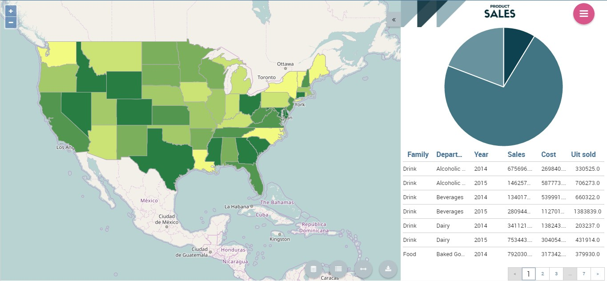

    Cockpit document example.

It enables *data mash-up* to integrate enterprise data and externally sourced data.

Cockpit documents can be created and executed both by technical users and end users and are part of Knowage ad-hoc reporting system. A key aspect is that different widget can rely on different datasets and hence on different data sources. The only requirement needed to define associations between two or more datasets is the presence in each of them of one or more columns containing the same data.

.. warning::
    **Section structure exception**
         
    Since there are no differences between the cockpit interface reached by a final user and the one reached by a technical user, the cockpit designer is described in one unique My first Cockpit for both those kind of users. By the way, when necessary we will   highlight how the same functionality can be exploited accordingly to the user’s role.

My first Cockpit
--------------------

You can create your new Cockpit from the **Analysis** area of the **Workspace** by clicking on the “Plus” icon and selecting **Cockpits** if you enter Knowage Server as final user, while you can enter the document browser and start a new cockpit using the “Plus” icon if you enter Knowage Server as admin.

.. important::
    **Reaching the cockpit designer**
         
    We stress that the cockpit interface is reached by the final user and the administrator following two different paths.

Let us see how to build a cockpit and how the interface is displayed within the server. Once opened, the cockpit interface is an empty page with a toolbar containing different options described in Table below.

.. table:: Cockpit editor toolbar.
   :widths: auto
   
   +--------------------------------+-----------------------+-----------------------+
   |    Icon                        | Name                  | Function              |
   +================================+=======================+=======================+
   | .. figure:: media/image136.png | **Cockpit menu**      | Configuration menu of |
   |                                |                       | Cockpit.              |
   +--------------------------------+-----------------------+-----------------------+
   | .. figure:: media/image137.png | **Add widget**        | It opens a window     |
   |                                |                       | where you can create  |
   |                                |                       | a new chart or table, |
   |                                |                       | add texts, images or  |
   |                                |                       | Knowage documents.    |
   +--------------------------------+-----------------------+-----------------------+
   | .. figure:: media/image138.png | **General             | It opens the window   |
   |                                | configuration**       | where you set the     |
   |                                |                       | general cockpit       |
   |                                |                       | options (name, label, |
   |                                |                       | show menu, etc.) and  |
   |                                |                       | widget style (header, |
   |                                |                       | titles, borders,      |
   |                                |                       | etc.).                |
   +--------------------------------+-----------------------+-----------------------+
   | .. figure:: media/image139.png | **Data                | It opens a window     |
   |                                | configuration**       | where you can manage  |
   |                                |                       | the dataset, the      |
   |                                |                       | association between   |
   |                                |                       | datasets and the      |
   |                                |                       | refresh frequency.    |
   +--------------------------------+-----------------------+-----------------------+
   | .. figure:: media/image140.png | **Selections**        | It adds a widget that |
   |                                |                       | manages selections.   |
   +--------------------------------+-----------------------+-----------------------+
   | .. figure:: media/image141.png | **Clear Cache**       | It cleans temporary   |
   |                                |                       | data.                 |
   +--------------------------------+-----------------------+-----------------------+
   | .. figure:: media/image142.png | **Save as**           | It opens the window   |
   |                                |                       | to save the cockpit   |
   |                                |                       | document as a new     |
   |                                |                       | document.             |
   +--------------------------------+-----------------------+-----------------------+

   
By clicking the button **Add Widget** you can add a widget containing a **Text**, an **Image**, a **Chart**, a **Table**, a **Cross table**, a **Document**,the **Active selections** or the **Selector** to your cockpit, as shown below.

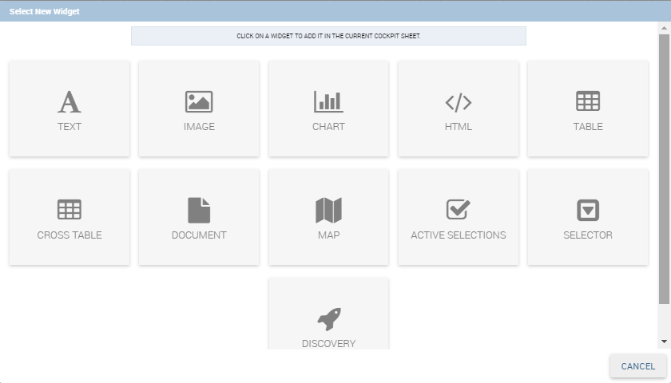

        Widget Type.

In the following we go into details of each available widget.

Text widget
~~~~~~~~~~~

By clicking the button Text Widget you can add text to your cockpit. As shown in figure below, the widget editor opens and it is divided in three tabs: the **Text editor**, the **Style**, the **Dataset** and the **Filters** tab.

.. _texteditwidgetconf:
.. figure:: media/image144.png

     Text editor of text widget configuration.

On the “Text editor” tab you can type the desired text in center panel and customize it. Using the dataset tab it is possbile to associate dataset values to the text and read it real time at each execution. Move to the dataset tab to add a dataset to the widget. Then, going back to the Text editor tab, the user will find the dataset columns on the right side, as well as a set of functions to eventually apply to the fields. We summed up main steps in the Figure below. To add a function to a measure first select the desired function and then the field of numeric type.

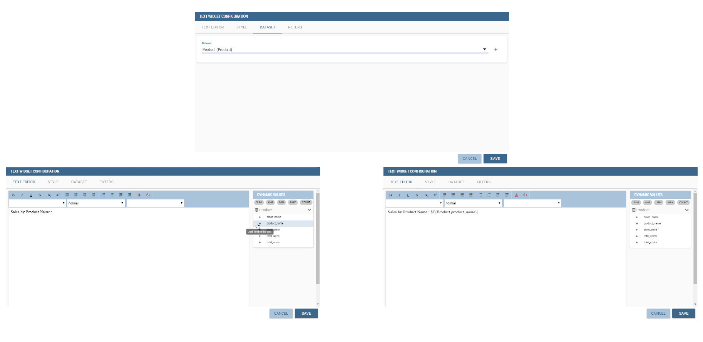

    Editing a dynamic text.

On the “Style” tab you can customize the text widget. We have provided all details about this tab in the Table widget. On the “Dataset” tab you can add more dataset to be used in the dynamic value. Finally, the “Filters” tab can be used to extract limited outup from the dataset. We put details off to the table widget subsection.

Image widget
~~~~~~~~~~~~

By clicking the button **Image Widget** you can add images to your cockpit. As already seen the widget editor opens and it is divided in
three sections.

On the **Gallery** tab you can upload an image, delete it or select one from the gallery. Refer to the following figure.

.. figure:: media/image148.png

    Gallery tab of Image Widget Configuration.

On the **Style** tab you can configure the style of your image widget with the different options offered by this tab. Many of them are defined in the table widget that you will find later.

On the **Cross** tab you can define navigation to another document, as shown in figure below.

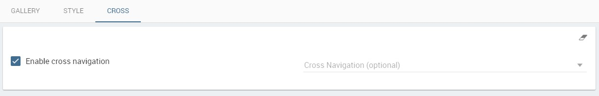

    Cross tab of Image Widget Configuration.

.. warning::
    **Cross navigation only for technical users**
         
    Due to the fact that parameters can only be managed by a technical user the cross navigation cannot be implemented by the final user.

For this purpose, you must activate **Enable cross navigation** flag and select the destination document through the list of cross navigation definition. This last flag is optional. If you select a cross navigation definition, when you launch the cross navigation it will go to the document of arrival directly. If the cross navigation definition is not defined, then when you launch the chart widget cross navigation will be shown a pop up (refer to figure below) with the list of cross navigation definition that exist for this cockpit.

.. _crossnavmultchoice:
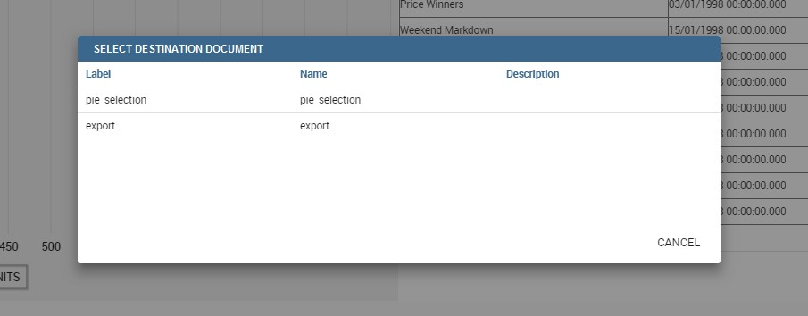

    Cross navigation multiple choices.

Chart widget
~~~~~~~~~~~~

Charts are an essential representation of data, Knowage let you use many different charts type and configure them according to your needs. We have provided all details about charts type and configuration in Chart chapter.

We recall that also for chart widget it is possible to set cross navigation on elements.

.. warning::
    **Cross navigation only for technical users**
         
    Due to the fact that parameters can only be managed by technical user the cross navigation cannot be implemented by the final user.
         
As shown in next figure, it is mandatory to enable the cross navigation feature by using the dedicate tab of chart editor GUI. It is mandatory to choose the column element to be passed to the destination document and associate it to the right output parameter (previoulsy added to the document using the detail interface).

The cross navigation name can be left empty. In case multiple cross navigation definitions have been configured for the document, a pop up will be displayed, letting the user to choose which destination to reach (exactly as we saw earlier for Image widget in the last figure of that paragraph).

.. _crossnavchartwidget:
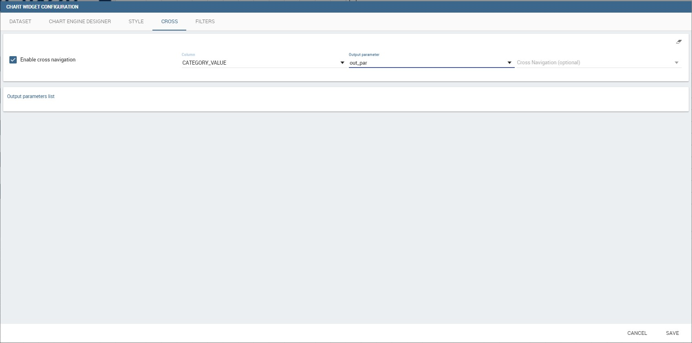

    Cross navigation for chart widget.

In addition, if the navigation expects other parameters to be passed, use the bottom part of the page to add the additional parameters. Figurebelow shows an example.

.. figure:: media/image152.png

    Add all output parameters involved in the cross navigation.

Table widget
~~~~~~~~~~~~

The **Widget table configuration** opens and it guides you through the steps to configure the widget. The pop up opens showing the **column** tab, as you can see from Figure below. In details, it is mandatory to select a dataset using the combobox (only if at least one dataset has been loaded using the **Data Configuration** feature) or clicking on the icon |image156| available just aside the combobox line. You can page the table specifying the number of rows per sheet. Consequently the user can set columns properties.

.. |image156| image:: media/image153.png
   :width: 20

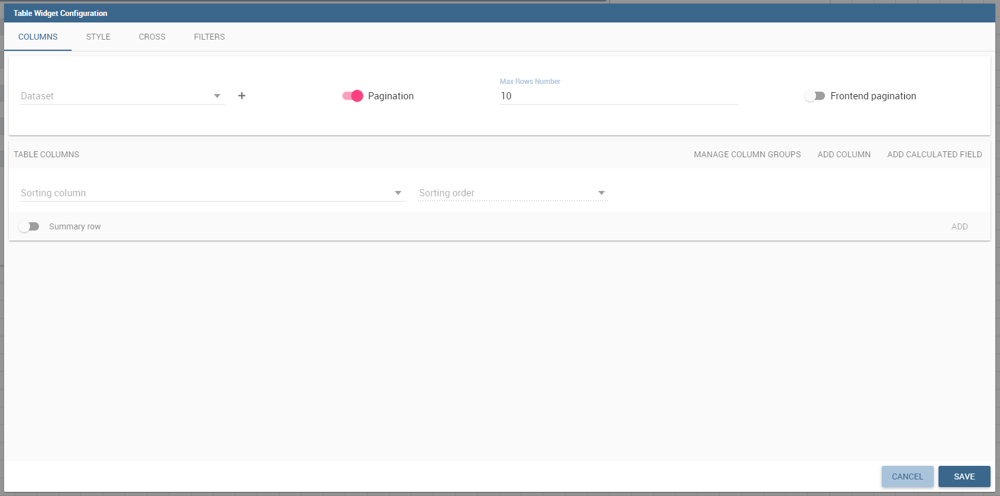

    Table configuration window.

In fact, the column area is divided into two parts: on the left side you have columns ordering, on the right the user has the button to add a new column or a calcutated field. As soon as the dataset is selected, you can indicate the sorting column or modal selection column. The modal selection serves to specify which value will be passed to other widgets (if interaction is enabled) when clicking on the cell at document execution time. You can specify this field by selecting a value from the combobox. In the same way, you indicate the sorting column and the order type that steers the rows ordering. You can select the field and the order from the dedicated comboboxes.

When a dataset is added to a table widget, all of its columns are listed below. If the user doesn’t wish to show some of them, he can use the delete button available at the end of each column row, as shown below.

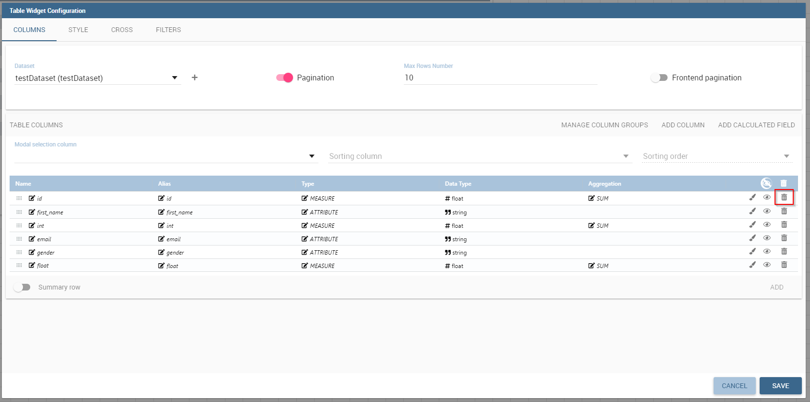

    Delete a column.

In case of accidental cancellation or new table requirements, it is possible to re-add columns. In order to add a new column you have to
click on the **Add Column** icon on the top right of the second box. Once opened you can select one or more columns. When you have finished selecting the desired columns you can click on save button and your new columns will appear in the field list. Refer to Figure below.

.. figure:: media/image156.png

    Add a new column.

Likewise, to add a calculated field you have to click on the **Add Calculated field** icon next to add column icon. Once opened the Calculated Field Wizard you have to type an alias for your calculated field in the dedicated area at the top corner of the wizard. Then you can choose from the Items Tree the fields and the arithmetic function you want to use for building your expression. In the middle you can see the expression you have built. If you prefer you can create or modify the expression manually directly in the panel which
is editable. When you are satisfied with your expression you can click on save button and your calculated field appears in the field list. We provide an example in the following figure.

    Add a calculated field.

At the very bottom of the window, you can see the dataset fields listed and you also can sort columns displayed in the table, insert a column alias and customize it by adding font and style configurations using the brush shaped icon, as you can see from figure below. Here you can find configuration features like the column size, max cell characters, hide on mobile option, etc.

.. _columnsettings:
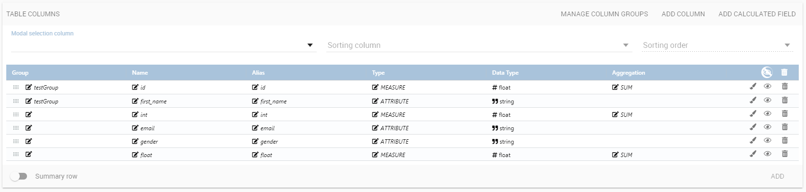

    Column settings.

Note that here you can indicate the column type and the aggregation. To add an aggregation to a column you must control the type of data that column has. An aggregation can only be added if the column value is of “number” type . The different aggregation functions are: *none (you also can not add any aggregation function)*, *Sum*, *Average*, *Maximum*, *Minimum*, *Count* and *Count distinct*.

The **Style** tab is where you can customize the table by using the different options of style. It is divided into eight parts:

- In the **Summary** section you can show the total of the column and customize it by typing the summary name and using font and style configurations. Refer to Figure below.

.. figure:: media/image159.png

    Summary section of the Style tab.

- In the **Rows** section you can set the table rows to be adapted in automatic or select a fixed height. You can also show the total of rows. While the multiselectable option allows you to select multiple values and pass them to other cockpit widgets or other      external documents. Refer to figure below.

.. figure:: media/image160.png

    Rows section of the Style tab.

- In the **Grid** section you can add borders to the table and add color to alternate rows. In this section you can find different      options to customize them. Refer to figure below.

.. figure:: media/image161.png

    Grid section of the Style tab.

- In the **Header Style** section you find the different options of  style for the table header. Refer to Figure below.

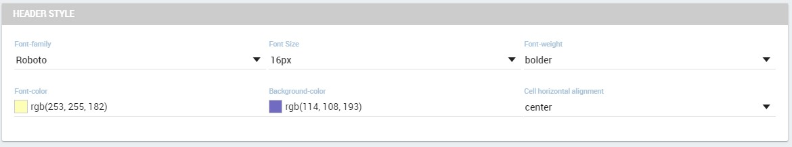

    Header style section of the Style tab.

- In the **Titles** section you can add the titles to the widget and modify the font size and weight. In this section you can also      change the height of the widget title. Refer to Figure below.

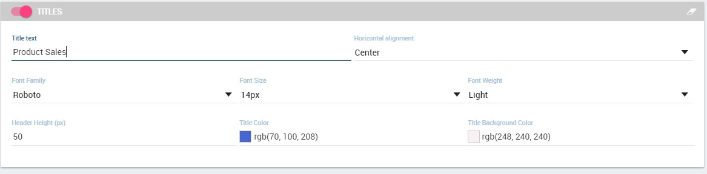

    Titles section of the Style tab.

- In the **Borders** section you can add a border to the widget and customize it by using the colors, thickness and style. Refer to the following figure.
      
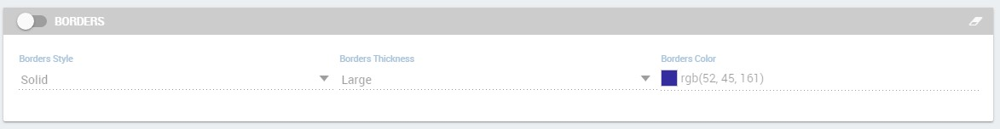

    Borders section of the Style tab.   

- In the **Other Options** section you can add the shadows in the widget, you can set the background color of the widget and it is possible to disable or enable the screenshot option for that particular widget. Refer to the following figure.

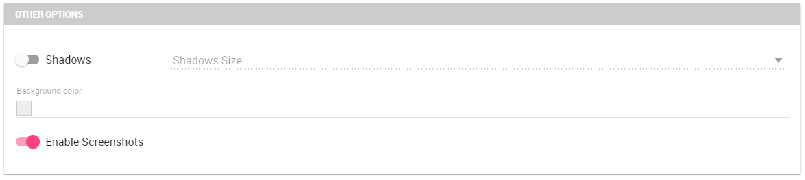

    Other Options section of the Style tab. 

Once the table style settings have been implemented you can switch to the next tab. The “Cross” tab is where the navigation to other documents is defined. It is visible to final users but yet only configurable by a technical user (like an administrator).

.. warning::
    **Cross navigation only for technical users**
         
    Due to the fact that parameters can only be managed by technical user, the cross navigation cannot be implemented by the final user.

Referring to figure below, we sum up how to add a cross navigation to the cockpit with the following bullet list:

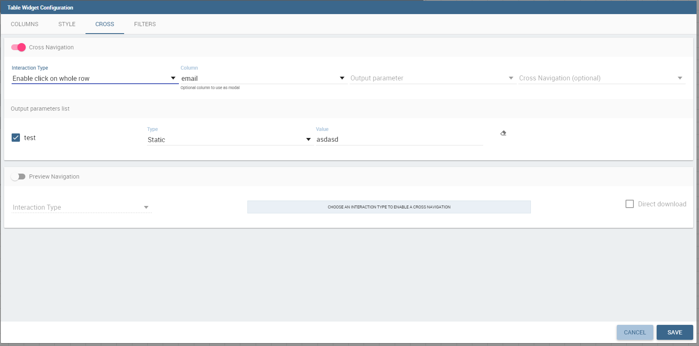

    Cross tab of the table widget configuration.

- activate the cross navigation flag;
- activate cross Enable on all row flag, if you want to be able to click on all the columns of the table;
- select the column whose value will be passed through output parameter to the document of arrival;
- select the output parameter that will pass the value to the document of arrival. This parameter type are defined in the document detail of the cockpit;
- select the destination document through the list of cross navigation definition. It is optional. If the Cross navigation is not      selected then when you click to launch the cross navigation, a pop up will be open with all the cross navigations defined for that     cockpit. If you select the Cross navigation and you click to launch the cross navigation, then it will go to the document of arrival directly.
- add all involved output parameters by adding them one by one in the bottom part of the GUI.

Finally, the “Filters” tab is where you can filter the table results by adding a limit to the rows or a conditions in the columns. the following figure shows an example of how to set the limit rows or a conditions on dataset columns.

.. _filterstabwidgetconf:
.. figure:: media/image168.png

    Filters tab of the table widget configuration.

Once you have finished setting the different configuration options of the table widget, then just click on “Save” and your new widget is
displayed inside the cockpit.

Cross Table widget
~~~~~~~~~~~~~~~~~~

Similar configurations are available also for the Cross Table widget. In this data visualization option, you still have the tabs: **Dataset** tab, **Configuration** tab, the **Style** tab and the **Filters** tab as you can see below.

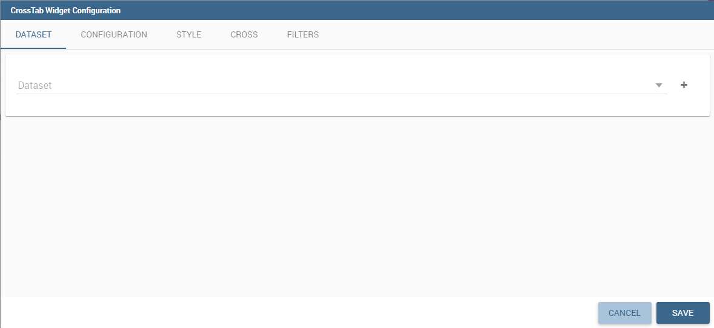

    Dataset section of the crosstab widget configuration.

Using the “Dataset” tab the user can add the dataset to take values from. Consequently, it is necessary to select the fields you wish to appear as columns, those as row and measures to be exhibited in the pivot table. See figure below. Remember to set column and row fields as attributes, while measure fields as numbers.

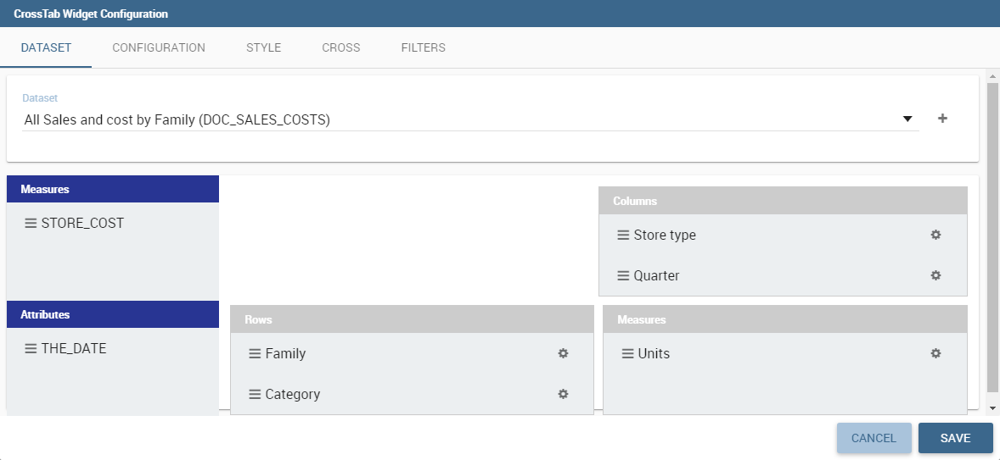

    Selecting columns, rows and measures of the crosstab.

Once the columns, rows and measures have been selected the style of each column can be set by clicking on the cog settings icon. A popup will open with different options for the selected columnn. See figure below.

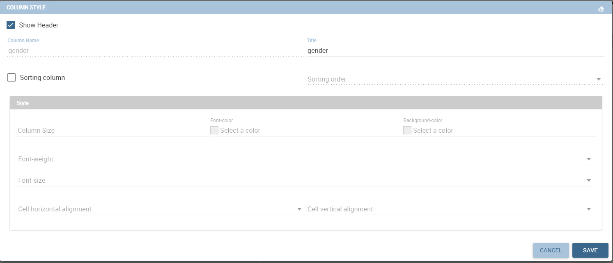

    Column style popup.

It is possible to sort the crosstab according to the values of the selected column or, alternatively, according to columns not visible in the crosstab. It can also be set the style of the column, such as the font size, the font weight or the cell alignment. There is also the possibility to specify the size of the column in pixels (you can also use percent values but it is better to use pixels).

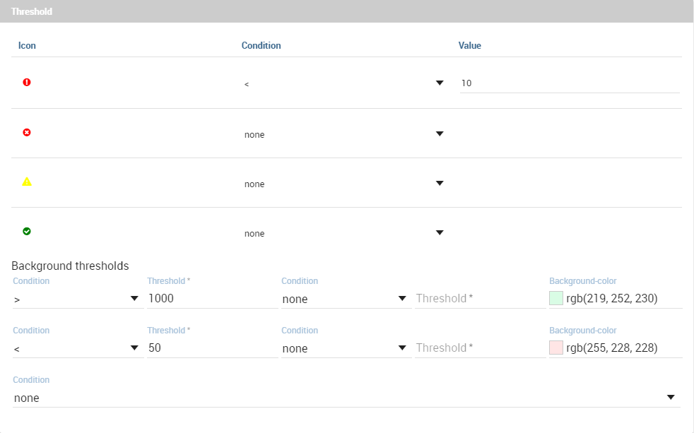

    Measure column style.

In case the selected column is of type measure, as figure above shows, you can also manage threshold. It is possible to associate a particular icon or a specific background color to a particular measure's value or range.

Once the dataset has been properly configured, you can proceed to the “Configuration” tab.

The latter is made up of three sections: **General**, **On rows** and **On columns**, as Figure below shows.

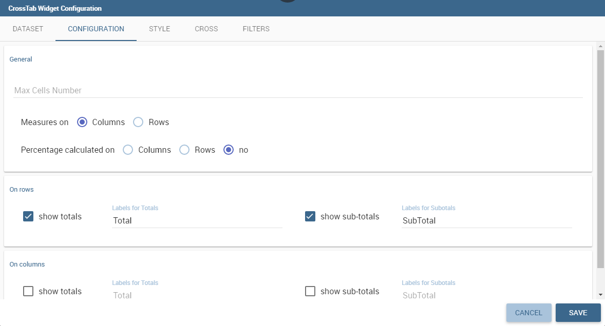

    Configuration tab interface.

In the “General” section you can set the following features:

- define the maximum cell number to show;
- decide to hook measures to columns or rows;
- decide to show percentages of measures related to columns or rows.

Thanks to the “On rows” feature, you can easily compute totals or subtotals on rows. Figure below exhibit an example.

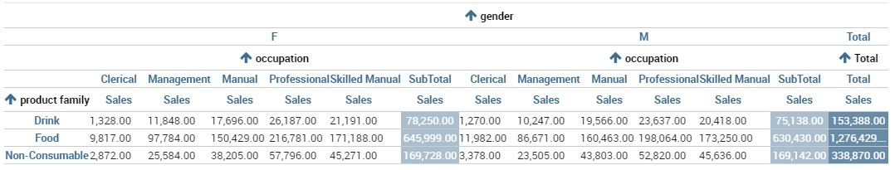

    Computing totals and/or subtotals on rows.

Otherwise, thanks to the “On columns” feature, you can easily compute totals or subtotals on columns. Figure below exhibit an example.

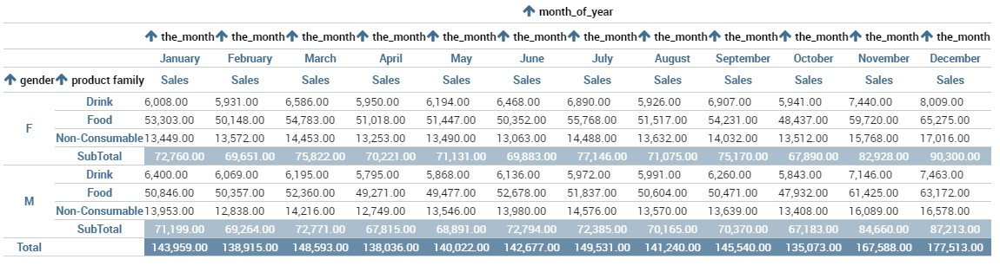

    Computing totals and/or subtotals on columns.

Switching to the “Style” tab you can find the general style settings available for the crosstab.

- **Crosstab Font General Options**  where the rows' height, the general font and font size can be set;

.. figure:: media/image174.png

    General style options for crosstab.

- **Crosstab Headers Font Options** where you can configure the header style settings as color, background, font, etc.

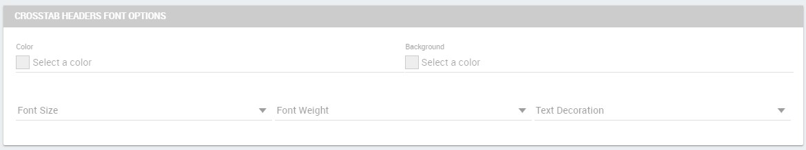

    Crosstab Headers Font Options for crosstab.

- **Measures Font Options** where you can configure several style options for measures, such as color, background, font size, etc.

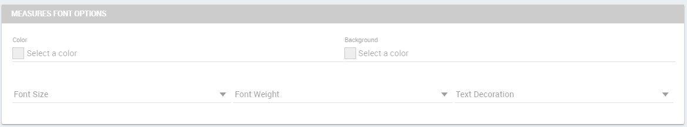

    Measures Font Options for crosstab.

- Using the **Grid** section you can mark (or not) grid borders, decide for border style, thickness and color. You can also alternate row indicating different colors.

.. figure:: media/image177.png

    Grid Options for crosstab.

-  In the **Measures Headers** section you can configure different style option for measure headers, such as color, background, font size, etc.

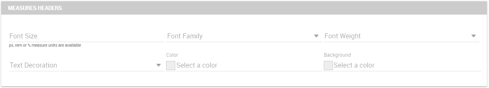

    Measures Headers Option for crosstab.
   
- In the **Total** section you can set color and background of totals (if any).

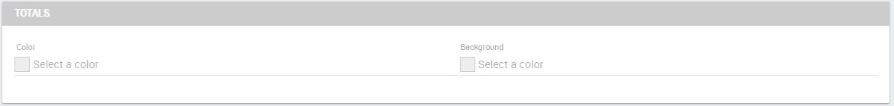

    Color settings for Totals.
      
- In the **Subtotal** section you can set color and background of subtotals (if any).

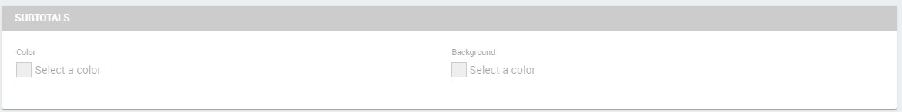

    Color settings for Subtotals.

- In the **Titles** section you can add titles to widget and customize them using different styles.

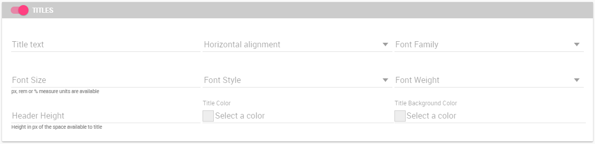

    Title settings.

- In the **Borders** section you can add borders to widgets and customize them using different styles.

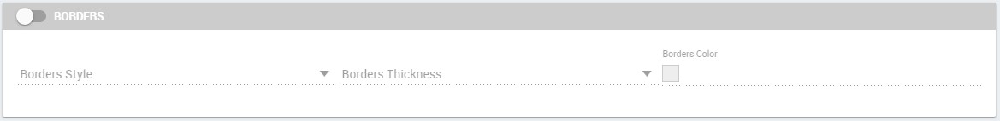

    Border settings.

- In the **Other Options** section you can add a shadow to widget layout and indicate its measure, color the widget background at convenience and it is possible to disable or enable the screenshot option for that particular widget.

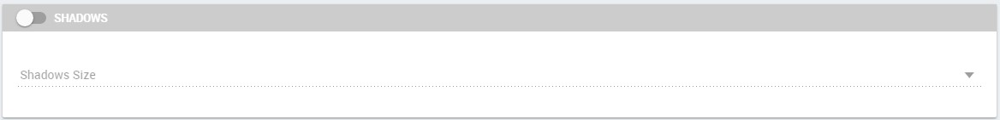

    Other Options for crosstab.

Once some or all (at least the mandatory) of the above mentioned setting features have been set you can save and the widget will be inserted into the cockpit area.

Document section
~~~~~~~~~~~~~~~~

The Document widget allows to add an external document into the cockpit area. This widget supports documents like reports, graphs, maps, etc.

Use the Data configuration button to add a document souce to the cockpit. Click on the “Plus” icon on the right half of the page to choose among all available documents.

The Document Widget configuration is divided into two parts: **Custom** tab and **Style** tab as you can see from Figure below.

.. figure:: media/image185.png

    Custom tab of the Document widget.
   
The Custom tab is the place where the document is uploaded while the Style tab is where all style options are set.

Selection widget
~~~~~~~~~~~~~~~~

This widget is related to the association concept so in this subsection we give information on how to add and custom the **Selection Widget** into the cockpit area and its functioning, while we refer to the dedicated Document section for details on how to set (global) associations.

To enable the Selection widget, which means the possibility to have all associations listed and acccessible on a widget, the user must open the “Selection” feature through the “Add widget” functionality and configure the demanded options. Figure below shows the“Selection widget configuration” interface.

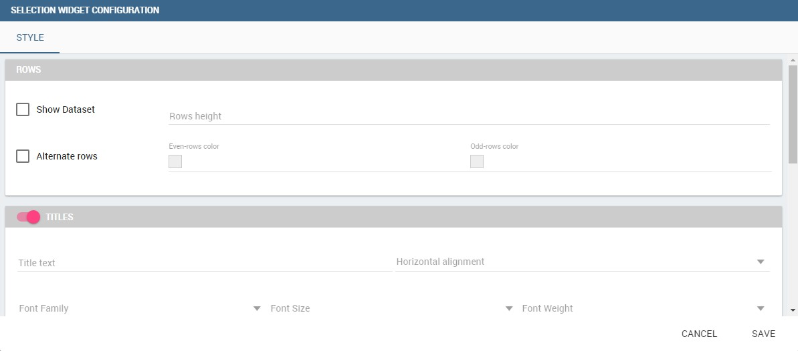

    Selection widget configuration.

The Selection Widget will display the elements selected by the user. Figure below shows an example.

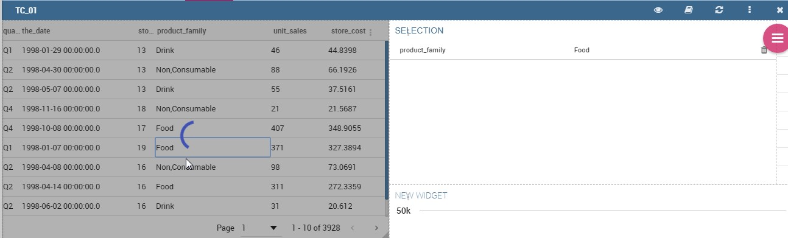

    Selection widget outlook.

If global associations have been set, clicking on table, cross table or chart elements will update all corresponding widgets. Otherwise, only the widget on which selection has been made Selector Widget will be updated. In both cases the Selection widget will display the
highlighted attribute values.

Selector Widget
~~~~~~~~~~~~~~~

The **Selector Widget** is useful when an end user (a user with a USER tole type) wants to add a parameter to the document.

.. note::
    **Selector widget**
         
        A technical user can use the association with an Analytical Driver to filter on cockpit.

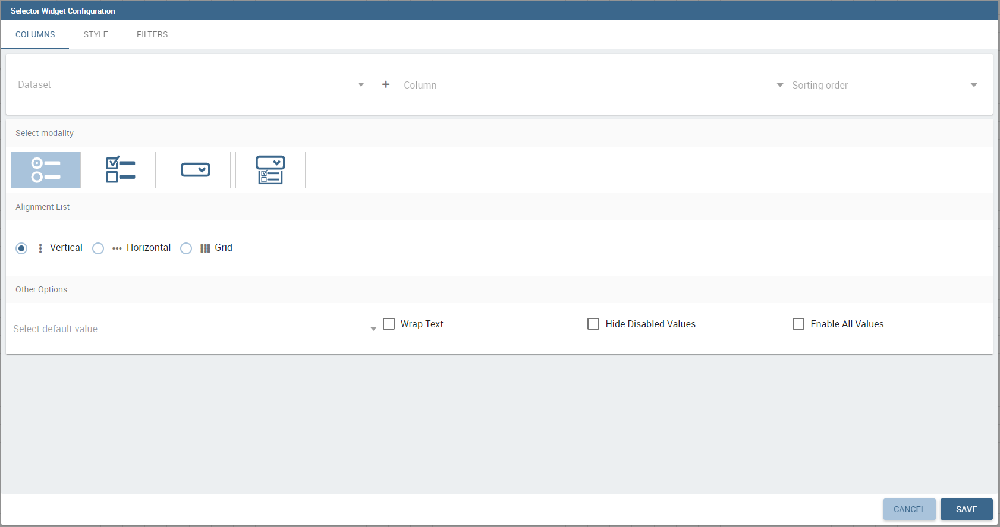

    Selector widget outlook.

In detail, use the **Columns** tab to select the dataset and the dataset column on which you want to apply the filter. Then custom the **Select modality** options; for instance, choose between single or multivalue or to use a list or a combobox. Note that for the list option you can further choose among “vertical”, “horizontal” or “grid”. You can also decide to add a dafault value, chosen from main column’s first item, main column’s last item or to simply assign a static value. Finally, by clicking on the Wrap Text option it is possible to wrap the text shown in the selector; this option is useful when the categories to choose from are sting of long dimensions. 

In the case of the selector of type list "grid" it is also possible to set the grid columns width.

.. figure:: media/image304.png

    Grid columns width.

Move to the **Style** tab to set the widget style in terms of: label, titles, borders, shadows and background color. Figure below shows a customization example.

.. figure:: media/image189.png

    Selector widget configuration.

Finally use the **Filters** tab to handle pagination or filter on a dataset column.

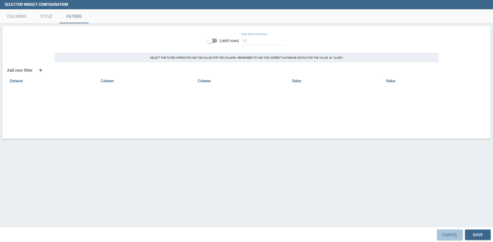

    Selector filters.

The Selector widget works effectively as a ready-to-use filter panel.

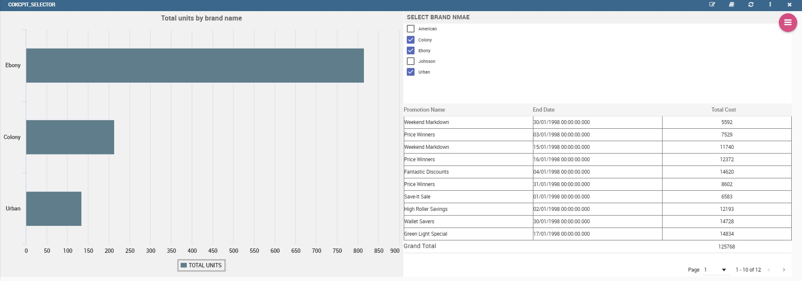

    Selector widget execution example.
    
HTML Widget
~~~~~~~~~~~

The HTML widget allows to add customized HTML and CSS code to add very custom dynamic elements to the cockpit. This widget supports all HTML5 standard tags and CSS3 properties.

.. warning::

        For security reasons no custom Javascript code can be added to html tags. Every tag considered dangerous will be deleted on save by the filter.

The Edit section of the widget is composed by tree tabs: the HTML editor, the style and the dataset.
In the editor tab is possible to add the code that will be shown in the widget. Clicking on the top expander section in the tab, the one named "CSS" also the CSS editor will be available. 

.. important::

        A CSS property will be extended to all the classes in the cockpit with the same name, to apply the property only to the current widget use the id prefix shown in the info panel of the CSS editor 

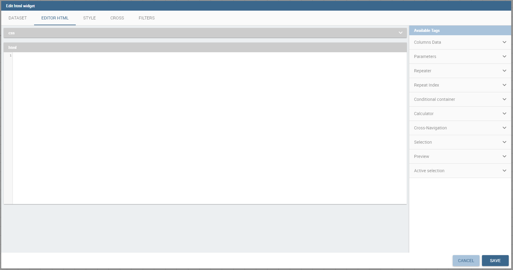

    HTML widget editor
    
In the right side of the editor is possible to take available tags to copy inside the code, those tags will be explained in details in the following paragraphs. Is not possible to add custom Javascript code inside the html editor, so the available tags are the tools to make the widget dynamic and to use the dataset data.

The Dataset tab allows the user to select a dataset to make the Widget dynamic and to bind it to dataset data.
After choosing a dataset the list of available columns will be show. Those names will be useful inside the dynamic tags. Here it is also possible to order the dataset according to a column and to select the ordering type (ascendig or descending).

    Dataset selection

By clicking on the icon |image302| of a specific column the dataset will be ordered by that column by default by ascending order. In order to select the descending ordering type you have to click another time on the icon (the icon will be now like this |image303|).

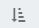

.. |image303| image:: media/image303.png
   :width: 30

**Available Tags**

``[kn-column='COLUMN-NAME' row='COLUMN-ROW-NUMBER' aggregation='COLUMN-AGGREGATION' precision='COLUMN-DECIMALS']``

The ``kn-column`` tag is the main dynamic HTML Widget tool, it allows to select a column name from the selected dataset and to print its value. The value of the kn-column attribute should be the name of the column value you want to read in execution.

The **row** attribute is optional and is a number type attribute. If no row is selected the first row column value will be shown.

The **aggregation** attribute is optional and is a string type attribute. If inserted the value shown will be the aggregation of all column rows values. The available aggregations are: AVG|MIN|MAX|SUM|COUNT_DISTINCT|COUNT|DISTINCT COUNT.

The **precision** attribute is optional and is a number type attribute. If added and if the result value is a number, the decimal precision will be forced to the selected one.

``[kn-parameter='PARAMETER-NAME']``

The kn-parameter tag is the tool to show a dataset parameter inside the widget execution. The value of the kn-parameter attribute should be the name of the set attribute.

``[kn-calc=(CODE-TO-EVALUATE) precision='VALUE-PRECISION']``

The ``kn-calc`` tag is the tool to calculate expressions between different values on widget execution. Everything inside the brackets will be evaluated after the other tags substitution, so will be possible to use other tags inside.

The **precision** attribute is optional and is a number type attribute. If added and if the result value is a number, the decimal precision will be forced to the selected one.

``
 ... REPEATED-CONTENT ... 
``

The ``kn-repeat`` attribute is available to every HTML5 tag, and is a tool to repeat the element for every row of the selected dataset.

This attribute is naturally linked to ``kn-column`` tag. If inside a ``kn-column`` tag without a row attribute is present, the ``kn-repeat`` will show the column value for every row of the dataset. 

Inside a ``kn-repeat`` is possible to use the specific tag [kn-repeat-index], that will print the index of the repeated column row.

The **limit** attribute is optional and is a number type attribute. If added the number of row repeated will be limited to the selected number.

``
 ... 
``

The ``kn-if`` attribute is available to every HTML5 tag and is a way to conditionally show or hide an element based on some other value. The attribute content will be evaluated after the other tags substitution, so will be possible to use other tags inside. If the evaluation returns true the tag will be shown, otherwise it will be deleted from the execution.

``
 ... 
``

The ``kn-cross`` attribute is available to every HTML5 tag and is a way to make the element interactive on click. This attribute generates an on click event on the element to open the cross navigation set. If there is no cross navigation set this tag will not work.

``
 ... 
``

The ``kn-preview`` attribute is available to every HTML5 tag and is a way to make the element interactive on click. This attribute generates an on click event on the element to open the dataset preview dialog. The attribute value will be the *dataset label* of the dataset that you want to open. If a dataset is not specified the cockpit will use the one set for the widget. If no dataset has been set and the attribute has no value this tag will not work.

``
 ... 
``

The ``kn-selection-column`` attribute is available to every HTML5 tag and is a way to make the element interactive on click. This attributes generates an on click event on the element to set the chosen column and value in the cockpit selections. The default will use as a selection the first row value for the column.

The **kn-selection-value** attribute is optional and will add a specific value to the column selection.

**Banned Tags**

For Cross side scripting and security reasons some tags are removed on save by the security filter:

-  ``<button></button>``
-  ``<object></object>``
-  ````

If the tag is needed for some specific behaviour (ie. the button default hover), please replicate it with css using a different allowed tag.

.. warning:: 
    **Whitelist**
    All external resources paths must be present inside a whitelist XML inside the resources folder of the server named ``services-whitelist.xml``. The file should have the following structure:

.. code-block:: xml
   :linenos:

   <?xml version="1.0" encoding="UTF-8"?>
   <WHITELIST>
      <service baseurl="https://www.youtube.com" />
      <service relativepath="/knowage/themes/" />
   </WHITELIST>

Like other widgets the "Style" tab and the "Filters" tab are available in order to set the general style options for the widget and to filter the results displayed in the HTML widget.

Widget properties
~~~~~~~~~~~~~~~~~~

Once one or more (above mentioned) widgets have been implemented, the technical user has some more options exploring the icon available at the right top corner of the widget itself, as Figure below highlights.

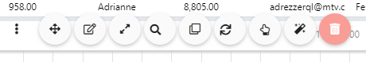

    Widget properties.

Here the user can:

-  move the widget in the cockpit area at convenience;
-  modify its dimension;
-  delete it;
-  activate the on-click interaction of the widget with the other ones;
-  activate the updating of widget data due to the interaction with other widgets.

When executing the cockpit in visualization mode, the user has also some more options for widgets. For all widget the user can use the icon |image197| to expand the widget to all page and use the icon |image198| to reduce it again. There are also two new widget options: using th icon |image300| it is possible to capture the screenshot of the widget and clicking on the icon |image301| the data plotted on a chart or displayed in a table or crosstab are exported in an excel file.

.. |image197| image:: media/image193.png
   :width: 30
   
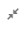

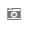

.. |image301| image:: media/image301.png
   :width: 30

Chart widget are endowed with an additional option that allows the user to change the chart type, as you can see in Figure below.

.. figure:: media/image195.png

    Change chart type button.

Referring to figure below, the available chart types are: parallel, scatter, wordcloud, line, radar, bar and pie.

.. figure:: media/image196.png

    Available chart types.

Pay attention though to the fact that when grouping functions have been used, the change chart type may not report the same level of aggregation. In fact, not all type of chart allows the grouping function. Refer to Chart types in detail to read more about each chart type configuration. Pay also attention when a two-series chart is chaned with a single-series one. For instance the parallel chart works only when (at laest) two series have been set, while the wordcloud works with only one series.

General configuration
-------------------------

This option allows the user to manage all cockpit general settings that we are going to describe through images of the interface. Clicking on the **General configuration** button the window in figure below opens. This contains the **General Settings** tab and the **Widget Style** tab.

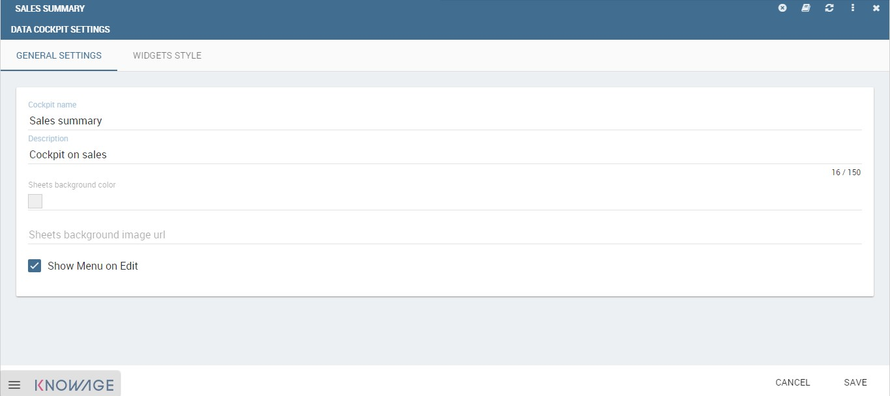

    General configuration window.

Editing the fields of the first tab you can add or change the name and/or the description of your cockpit; moreover here you can choose the sheet color or a background image and its size. In particular, in order to add a background image for the sheets, firstly you have to add the image to the catalogue of the image widget and then copy the link of the image. It is also possible to decide to enable the menu and the widgets functionalities when the document runs in display mode or to disable the screenshot functionality for every widgets. 

The second tab (Figure below allows to configure some style options of the cockpit, like borders, shadows, titles and background color.

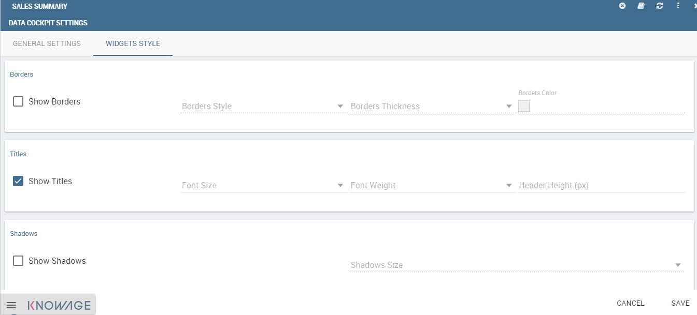

    Widget style tab.

Data configuration
----------------------

This feature manages the data storage and usage. In fact, here there is the possiblity to save data in cache, create associations between datasets, schedule the (data) refresh frequency and so on. Referring to the figure below, the feature is implemented through several tabs: the **Source** tab, the **Associations** tab, the **Frequency** and the **Template** tab.

.. _dataconfigwindow:
.. figure:: media/image199_b.png

    Data configuration window.

Source
~~~~~~

The Source tab is split into two areas. On the left side the user can find the list of those dataset that are currently used by the cockpit. Here it is possible to add new dataset that will be passed to widgets. In other words, datasets inserted in this area will be listed in the dataset combobox of widgets like the Table, the Pivot Table and the Chart one. Note that the user can delete datasets as well.

Parametric sources management
^^^^^^^^^^^^^^^^^^^^^^^^^^^^^^^

If the user is adding a parametric dataset the window will exhibit them in an expandable box right below. It is also mandatory to give default values or to associate proper drivers to the document to secure its correct execution. By the way, a final user has no access to parametric dataset and he/she cannot handle analytical drivers, therefore **parametric sources can be managed only by an admin user**. We stress that the user must also type the driver name in the field box as highlighted in Figure below. You can type it manually or use the look up just aside the parameter line.

.. figure:: media/image200.png

    Dataset management.

On the right side of the window the user finds the list of external documents that can be added to the cockpit (through Document widgets), or as well as for the dataset case, of documents that are already in use in (previously set) Document widgets. In the occurance of Associations parametric documents, parameter boxes are shown below. Note that it is mandatory to link them to analytical drivers (previuosly hooked to the document) or be assigned a fixed (default) value.

Associations
~~~~~~~~~~~~

If your goal is to show data from a single dataset, it is not necessary to define any association. *Associations should be set within the designer when widgets are built on different datasets*. Associations can be set with the elements: dataset columns, dataset parameters and document parameters. Note that to implement an association the user must have at least one column. We show some examples in the following.

The following figure shows the association between two datasets. In this case the user must detect one field from the first dataset, the same field (in terms of values) in the other one. The relation will appear right below. Click on the save button to confirm the association. If the associations rely on multiple columns the user must add them one by one.

.. _assocbetweendatacolum:
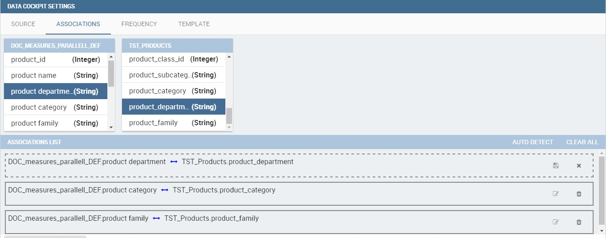

    Associations between dataset columns.

The same procedure can be done in the case of dataset columns and dataset parameters, as shown below.

.. figure:: media/image202.png

    Associations between dataset column and dataset parameter.

Another example is supplied in Figure below. Here the association is perfomed between a dataset Frequency column and document parameter.

.. figure:: media/image203.png

    Associations between dataset column and document parameter.

Once you have defined the associations, as soon as you refresh one widget, all related widgets are refreshed simultaneously on data update.

Frequency
~~~~~~~~~

The Frequency tab defines a schedulation over dataset involved in the associations. An example is supplied in the next figure. This means that associations are activated automatically and data are reloaded according to this feature. In particular, groups of realtime datasets that compose one or more associations can have different update frequencies. We stress that, in order to secure the right document execution, the group frequency do not affect the other ones and each group is reloaded at different times. In addition, realtime dataset that are not involved in any association can have their own frequency.

.. _frequsettexample:
.. figure:: media/image204.png

    Frequency settings example.

Template
~~~~~~~~

In this tab the user can find the json code (at the current stage of the work) which composes the template. Figure below shows an example.

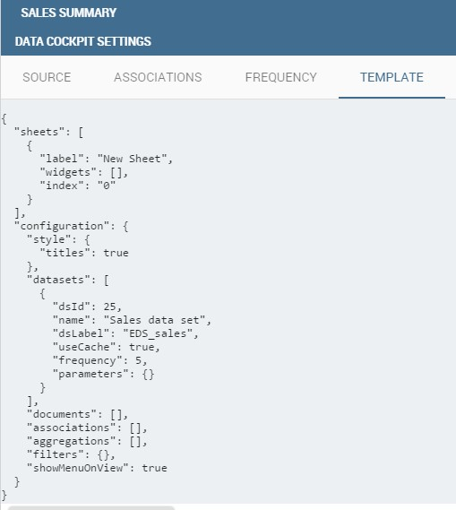

   Template example.

Selections
--------------

Adding the **Selections** to your widgets, namely the possibility to reload all widget data according to selection made throught the click on a specific item of the cockpit (cell value, chart bar, etc.). Moreover, thanks to this functionality the user can reproduce the drill down feature that we introduced in Chapter of Chart. You can check which selections are active on your cockpit at anytime thanks to the **Selection** functionality. In Section 7.1 we already described how to add the “Selection” widget inside the cockpit area. If the user do not wish for the widget to stay visible, selections can still be accessed and managed through the menu configuration bar. Clicking on the “Selection” menu icon you can enter the “Selections” window. Here all selections and associations are listed, as shown in Figure below. The “Delete” button is available just aside each row to let the user to remove that specific selections. Click on the “Cancel” button to exit the window.

.. figure:: media/image206.png

    Selection window.

Clear cache
---------------

The **Clear cache** button lets you reallign the data shown in your widget to the ones in your database. When you create your widget and associate your datafields, a photo of data is made and stored in temporary tables. This means that your cockpit will display the same data at each execution until you clean the chace by clicking on the dedicated button and execute the document again. Now your data are refreshed and updated to the one contained in your database at last execution time. As discussed before this button is available also in “Read only” modality.

Save
--------

You can save the cockpit by clicking on the save button in the right-top corner. The document will be saved in the personal folder (technical users) or in the **My Analysis** section. We remember that it is possible to share the new cockpit with other users clicking on the dedicated icon. You can also choose in which folder, among the ones visible to your role, to place your shared document.

Multisheet functionality
----------------------------

Cockpit allows to manage data visualization splitting it in two or more sheets. In each layer the user can find and employ the features shown above. Indeed, it is possible to perform a new analysis (as highlighted in Figure below) selecting different datasets and gadgets.

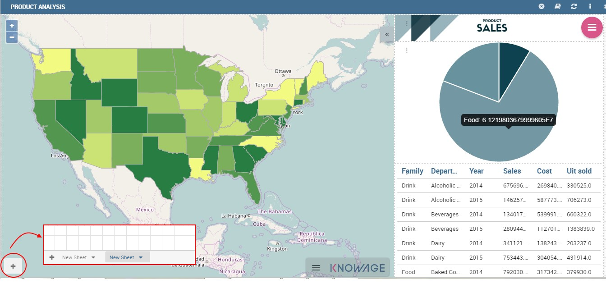

    Multisheet cockpit example.

A user can take advantage of the “move widget” functionality we saw in My first Cockpit to bring widget from one sheet to another.

Furthermore it is possible, but not mandatory, to set associations between datasets underlying different sheets. The multisheet functionality is particularly useful to focus the analysis in a single spot and have a general overview over it in few clicks at the same time.
