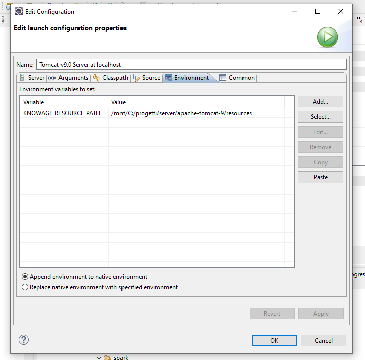

Data Preparation
=================

The **Data Preparation** is a functionality available since version 8.1 that allows users and editors to create a prepared dataset, starting from an existing dataset source.
Creating a prepared dataset and than using it inside a dashboard, users will have the capability of creating complex and specific dataset quite easily and quickly, in order to use them for any purpose.

This functionality is available as an add-on plugin for Smart Intelligence license.

Requirements
-------------------

User should have Apache Livy and Apache Spark installed. Please check Livy and Spark official documentation for more info (https://livy.apache.org/, https://spark.apache.org/).

After that it is mandatory to set this variable on Tomcat Server: KNOWAGE_RESOURCE_PATH
This variable should point to the Tomcat server's resource folder.

Example for Tomcat development installation:

Selecting a DATASOURCE:

It is really important to set a datasource for the prepared dataset ingestion output.
This one will be the location of the result prepared data.
You can do that checking the "Use for data preparation" checkbox using an administration role for Knowage.

.. figure:: media/image32.png

Preparing a dataset
-------------------

The first step is creating an avro-format export file.
You can do it selecting the desired dataset into your workspace section (there should be also a  **Data Preparation** entry):

.. figure:: media/image1.png

There are two ways to prepare and start a data preparation process.
The first one is starting from MyData section.
Click on MyData and select your desired dataset.

.. figure:: media/image2.png

    Search your dataset example.

Then click with the right click of mouse and select "Open Data Preparation":

.. figure:: media/image5.png

This operation should trigger the avro-file creation process.

.. figure:: media/image6.png

The second way is clicking on + botton on the top right of Data Preparation section:

.. figure:: media/image3.png

And then select your source dataset.

.. figure:: media/image4.png

If  avro file is created now you should be able to open the data preparation screen, there should be a check icon next to the actions menu:

.. figure:: media/image7.png

Data preparation main screen:

.. figure:: media/image8.png

Data Preparation Transformations
--------------------------------

You can apply transformations to the source dataset just picking the transformation action, step by step, until you reach the desired result.

In the main toolbar menu, there is a set of main transformations (most of them can be applied on many columns in the same time):

-   **Add column**: Adds a new column as a calculated field.
-   **Merge columns**: Adds a new column merging two selected ones.
-   **Split columns**: Adds two columns splitting a selected one.
-   **Filter**: Filters a selected column by math conditions (more info later on).
-   **Padding**: Adds characters on left or right side of a selected column.
-   **Remove duplicates**: Removes duplicates from selected columns.
-   **Remove null**: Removes null values from selected columns.
-   **Replace**: Replace selected values from specific columns.

The **Add column** transformation allow user to add a calculated field of type numeric, string or temporal.
Functions are based on Spark SQL language (https://spark.apache.org/docs/2.4.8/api/sql/index.html).

.. figure:: media/image9.png

**Merge columns**: Adds a new column merging two selected ones using a separator.

.. figure:: media/image10.png

**Split columns**: Creates two new columns splitting a selected one using a specific condition (ie a character).

.. figure:: media/image11.png

 **Filter**: Filters a selected column by special conditions:

.. figure:: media/image12.png

.. figure:: media/image12a.png

.. figure:: media/image12b.png

**Padding**: Adds characters on left or right side of a selected column.

.. figure:: media/image13.png

 **Remove duplicates**: Removes duplicates from selected columns.

.. figure:: media/image14.png

 **Remove null**: Removes null values from selected columns.

.. figure:: media/image15.png

**Replace**: Replace selected values from specific columns. Old char is the old value to be replaced.

.. figure:: media/image16.png

Two more transformations are present only by clicking on a specific column: **TRIM** and **DROP** transformations.

.. figure:: media/image17.png

**Drop column**: Removes a specific column from table.

.. figure:: media/image18.png

**Trim column**: Removes white spaces from column.

.. figure:: media/image19.png

Saving and Using a prepared dataset
-----------------------------------

Now let's see how to save a prepared dataset. For our documentation example we use two transformations: DROP and then a FILTER on "age" column.

We removed "golden_members" column:

.. figure:: media/image23.png

And then we filtered by age minor than 60:

.. figure:: media/image21.png

The resulting transformations chain can be seen on the right of the page:

.. figure:: media/image22.png

As you can see you can remove or preview the last operation (in our case the FILTER transformation).

To see a description of the transformation just click on the eye icon:

.. figure:: media/image24.png

You can see how transformation has been configured.
Then you can also remove the transformation by clicking on the trash bin:

.. figure:: media/image25.png

If you want to save the prepared dataset click on the save icon on the top right of the page:

.. figure:: media/image26.png

Here you can choose the name, the description and the schedulation if you want to update the dataset, using the transformation selected, periodically.

.. figure:: media/image27.png

After clicking on SAVE button you will see a confirmation message:

.. figure:: media/image28.png

After that, waiting for a few moments you will be able to see your data saved on selected datasource clicking on the eye icon on the right into the data preparation section.

.. figure:: media/image29.png

If the ingest operation has not finished yet or if there were problems with saving data you will see a warning message telling that the operation is not completed.

You can monitor the process using the monitor section, right click on your saved prepared dataset and clicking on "Monitoring":

.. figure:: media/image30.png

You will see a popup with the process results, in case of errors you can download a log file.
On the left side you can also change the schedulation of the periodic prepared dataset update.

.. figure:: media/image31.png
