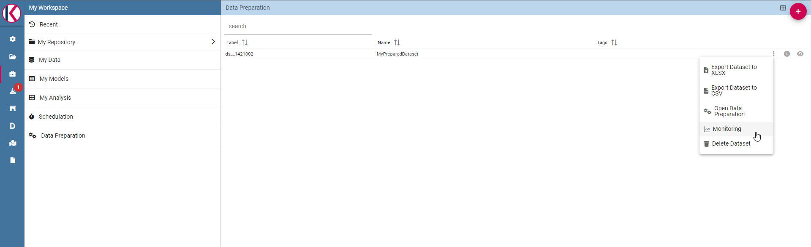

Data Preparation
========================================================================================================================

What is that for?
------------------------------------------------------------------------------------------------------------------------

**Data Preparation** is a functionality available since version 8.1 that allows users to create a prepared dataset, starting from an existing one.
In this way users can create a prepared dataset and than using it inside a dashboard or simply using it as another dataset.
Users have the capability of creating complex and specific datasets quite easily and quickly, in order to use them for any purpose.

Preparing a dataset
------------------------------------------------------------------------------------------------------------------------

The first step is selecting a dataset to work on.
You can do it selecting the desired dataset into your workspace section (there should be also a  **Data Preparation** entry):

.. figure:: media/image1.png

    The Data Preparation entry.

There are two ways to prepare and start a data preparation process.
The first one is starting from MyData section.
Click on MyData and select your desired dataset.

    Search for your dataset example.

Then click with the right click of mouse and select "Open Data Preparation":

    Select "Open Data Preparation"

This operation triggers the avro-file creation process.

    For more info about what "Preparing avro file" means please refer to "Data Preparation technical detail" section.

The second way is clicking on + botton on the top right of Data Preparation section:

    Click on + botton on the top right of the page.

And then select your source dataset.

    Search for your dataset example.

If  avro file is created now you should be able to open the data preparation screen, there should be a check icon next to the actions menu:

    There is a check icon on the left icons menu for your selected dataset.

Data preparation main screen:

    Data Preparation main screen.

Data Preparation Transformations
------------------------------------------------------------------------------------------------------------------------

You can apply transformations to the source dataset just picking the transformation action, step by step, until you reach the desired result.

In the main toolbar menu, there is a set of main transformations (most of them can be applied on many columns in the same time):

    Transformations toolbar icons.

-   **Add column**: Adds a new column as a calculated field.
-   **Merge columns**: Adds a new column merging two selected ones.
-   **Split columns**: Adds two columns splitting a selected one.
-   **Filter**: Filters a selected column by math conditions (more info later on).
-   **Padding**: Adds characters on left or right side of a selected column.
-   **Remove duplicates**: Removes duplicates from selected columns.
-   **Remove null**: Removes null values from selected columns.
-   **Replace**: Replace selected values from specific columns.
-   **Trim**: Removes white spaces from specific columns. (Available for single column only)
-   **Drop**: Remove a specific columns. (Available for single column only)

The **Add column** transformation allow user to add a **calculated field** of type numeric, string or temporal.
These functions are a subset of Spark SQL language functions and are used for calculations or manipulating data.
For more info see https://spark.apache.org/docs/2.4.8/api/sql/index.html.

.. figure:: media/image9.png

    Available functions are a subset of Spark SQL language functions

**Merge columns**: Adds a new column merging two selected ones using a separator.

    Merge columns dialog example.

**Split columns**: Creates two new columns splitting a selected one using a specific condition (ie a character).

.. figure:: media/image11.png

    Split columns dialog example.

**Filter**: Filters a selected column by special conditions.

.. figure:: media/image12.png

    Filter dialog example.

**Padding**: Adds characters on left or right side of a selected column.

.. figure:: media/image13.png

    Padding dialog example.

**Remove duplicates**: Removes duplicates from selected columns.

.. figure:: media/image14.png

    Remove duplicates dialog example.

**Remove null**: Removes null values from selected columns.

    Remove null dialog example.

**Replace**: Replace selected values from specific columns. Old char is the old value to be replaced.

.. figure:: media/image16.png

    Replace dialog example.

Two more transformations are present only by clicking on a specific column: **TRIM** and **DROP** transformations.

.. figure:: media/image17.png

**Drop column**: Removes a specific column from table.

    Drop columns dialog warning.

**Trim column**: Removes white spaces from column.

.. figure:: media/image19.png

    Trim column dialog example.

Data Preparation technical detail
------------------------------------------------------------------------------------------------------------------------

**What is an AVRO file?**

Avro is a data serialization system.

Avro is a data serialization framework developed within Apache's Hadoop project. It uses JSON for defining data types and protocols, and serializes data in a compact binary format.

Avro relies on schemas. When Avro data is read, the schema used when writing it is always present. This permits each datum to be written with no per-value overheads, making serialization both fast and small. This also facilitates use with dynamic, scripting languages, since data, together with its schema, is fully self-describing.

When Avro data is stored in a file, its schema is stored with it, so that files may be processed later by any program. If the program reading the data expects a different schema this can be easily resolved, since both schemas are present.

Please refer to official documentation for more info: https://avro.apache.org/

Avro is used for store Knowage datasets data and schema (with columns metadata) in order to use them as input source for Data Preparation process.

When user open a dataset for data preparation for the first time, ad avro file is created.
This file is read and then it will be used as data source for data transformations that will be sent to Livy-Spark.

Saving and Using a prepared dataset
------------------------------------------------------------------------------------------------------------------------

Now let's see how to save a prepared dataset. For our documentation example we use two transformations: DROP and then a FILTER on "age" column.

We removed "golden_members" column:

    Drop columns dialog example.

And then we filtered by age minor than 60:

    Filter columns dialog example.

The resulting transformations chain can be seen on the right of the page:

.. figure:: media/image22.png

    Transformations list is present on the right panel.

As you can see you can remove or preview the last operation (in our case the FILTER transformation).

To see a description of the transformation just click on the eye icon (if present, some transformations don't need it):

.. figure:: media/image24.png

    Transformation preview dialog example.

You can see how transformation has been configured.
Then you can also remove the transformation by clicking on the trash bin:

.. figure:: media/image25.png

    You can delete the last one only.

If you want to save the prepared dataset click on the save icon on the top right of the page:

    Save panel example.

Here you can choose the name, the description and the schedulation if you want to update the dataset, using the transformation selected, periodically.

    Split columns dialog example.

After clicking on SAVE button you will see a confirmation message:

.. figure:: media/image28.png

    Saving confirmation.

After that, waiting for a few moments you will be able to see your data saved on selected datasource clicking on the eye icon on the right into the data preparation section.

.. figure:: media/image29.png

    Prepared data preview panel.

If the ingest operation has not finished yet or if there were problems with saving data you will see a warning message telling that the operation is not completed.

You can monitor the process using the monitor section, right click on your saved prepared dataset and clicking on "Monitoring":

    Select monitoring entry.

You will see a popup with the process results, in case of errors you can download a log file.
On the left side you can also change the schedulation of the periodic prepared dataset update.

.. figure:: media/image31.png

    Schedulations and monitoring panel example.

Now it is possible to see the prepared dataset into the Dataset Management section or into MyData Workpace section, so for example you can use it later for a dashboard.

    Dataset Management panel example.
