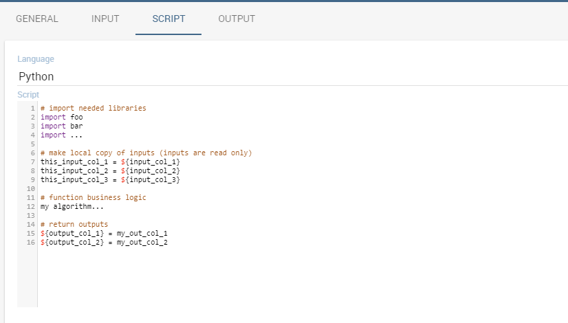

# Minería de datos

Knowage admite el análisis avanzado de datos, lo que le permite extraer conocimiento de grandes volúmenes de datos, para mejorar su toma de decisiones y estrategias comerciales. En particular, Knowage **Motor de minería de datos** integra las capacidades de scripting de Python.

Gracias a Knowage **Motor de minería de datos**, es posible ejecutar scripts de Python de forma interactiva y enriquecer los conjuntos de datos tradicionales con nueva información. Esto significa que permite a los usuarios realizar análisis estadísticos o de minería de datos en diferentes conjuntos de datos de Knowage.

Los científicos de datos pueden integrar su propio algoritmo dentro de Knowage y entregar su resultado al usuario final, junto con nuevas opciones de visualización avanzadas útiles para descubrir información significativa oculta en los datos.

## Catálogo de funciones

La minería de datos se puede gestionar a través de la **Funciones** Marco de referencia. En esta sección veremos cómo explorar y manejar esta parte, mientras que en *Usar una función dentro de los documentos* veremos cómo usar las funciones.

Primero haga clic en el botón **Catálogo de funciones** de la página principal de Knowage como se muestra a continuación.

.. figura:: medios/menu_catalogo.png

    Functions Catalog from Knowage menu.

Ingresará a una página como la que se muestra en la figura a continuación.

.. \_functioncatalinterf:
.. figura:: medios/interfaccia_catalogo.png

Interfaz de catálogo de funciones.

Las acciones que un usuario puede realizar dependen del rol del usuario. Sin embargo, independientemente del rol del usuario, una vez introducida la característica todas las funciones se muestran de forma predeterminada. Refiriéndose a la figura anterior, uno tiene la página compuesta por:

*   **Categorías**: estos son establecidos por un usuario administrador y se utilizan para clasificar las funciones de acuerdo con su definición y objetivos. Además, son de ayuda para navegar por las funciones; solo el usuario administrador puede agregar y/o modificar categorías.

*   **Etiquetas**: se utilizan para agudizar fácilmente la investigación y recordar fácilmente las funciones que se etiquetan con esa palabra; una vez más, solo el usuario administrador puede agregar y/o modificar etiquetas;

*   **Lista de funciones** (si los hay): estos son visibles y explorables por cualquier tipo de usuario. De todos modos, solo un usuario administrador puede agregarlos y / o modificarlos.

.. indirecta::
**Agregar o modificar las categorías**

         The admin can add a new category using the Domain management available on Knowage Server under the Server Settings section. To know more about this section, please refer to Section “Server settings” of the General Administration Manual.

Las categorías de funciones dependen de un usuario administrador. Toma *Interfaz de catálogo de funciones* Figura a modo de ejemplo, tenemos:

1.  **Análisis de texto**: dar sentido al texto no estructurado,

2.  **Aprendizaje automático**: enseñe a su aplicación a enseñarse a sí mismo,

3.  **Visión por computador**: identificar objetos en imágenes,

4.  **Utilidades**: microservicios listos para usar,

5.  **Todo**: visualiza todas sus funciones; esta es la única categoría que no se puede cambiar ni eliminar.

Para facilitar la comprensión creamos algunas funciones para ser examinadas. Recordamos aquí que uno puede buscar una función de diferentes maneras: usando las categorías o las etiquetas o usando el cuadro "Buscar" del Catálogo de funciones disponible en la parte superior de la lista de funciones como se destaca a continuación.

.. figura:: media/image398.png

    Search box to look for a function.

Suponemos aquí seleccionar una categoría, lo que significa hacer clic en el cuadro de categoría, para poder analizar las funciones que pertenecen a ella.

Tenga en cuenta que la parte subrayada de la figura siguiente contiene una lista de etiquetas. Estos ayudan a centrarse en los temas y, por lo tanto, en las funciones asociadas a esa categoría. Viceversa, cuando se muestran todas las funciones, también se muestran todas las etiquetas y se pueden usar para recoger funciones relacionadas con ese tema.

.. figura:: media/image399400.png

    Using tags and categories to look for functions.

Se puede ejecutar una vista previa de la función utilizando el icono |image417| que abre un cuadro de diálogo en el que puede seleccionar y configurar un conjunto de datos entre los disponibles para probar la función. Utilice el icono |image4172| para eliminar la función. Las funciones no se pueden eliminar si se utilizan dentro de uno o más documentos.

.. |imagen417| imagen:: media/image401.png
:ancho: 30

.. |imagen4171| imagen:: media/image402.png
:ancho: 30

.. |imagen4172| imagen:: media/image403.png
:ancho: 30

Para crear una nueva función, un usuario administrador debe hacer clic en el icono "Más" disponible en la esquina superior derecha de la página. La acción abre la interfaz que se muestra a continuación. Aquí tienes cuatro pestañas que describimos brevemente en las siguientes subsecciones.

.. \_creatingnewfunct:
.. figura:: media/image404.png

    Creating a new function.

La ficha General

```

In this tab the user gives the general information about the function as the figure above shows. The admin user must type: the *name* of the function, the *label* with which it is identified uniquely (remember to use only numbers or letters and do not leave spaces between them). The *keywords* are were tags are defined. The *Description* is where the user can insert a text or images to be shown when the function is being configured inside documents. In the *Benchmarks* field users can insert information about the function performances.

The Input tab
~~~~~~~~~~~~~~~

As shown in the following figure, the function admits two kinds of input: *columns* and *variables*.


    Input tab.

In the “Column” instance the function takes input columns that will be referenced inside the script. These columns are generic, the user must only specify their type and the name he later wants to use inside the script to access that specific column.


    The dataset input of the function settings.

In the “Variable” case, the user must insert one or more variables and match them with values using the dedicated area.


    The variable input of the function settings.

The Script tab
~~~~~~~~~~~~~~~~

The script tab is where an expert user defines the function through the usage of datamining languages (such as Python), as shown in Figure below.


    The script tab.

Inside the script users will have at their disposal a read-only `pandas.Series <http://pandas.pydata.org/pandas-docs/stable/generated/pandas.Series.html>`__ variable for each column defined in the input tab.
To reference one specific column users must use the placeholder *${column_name}*. Input variables will be accessible with the same syntax.

.. code-block:: bash
         :caption: Code syntax to recall inputs
         :linenos:

           ${column_name}
		   ${variable_name}

.. warning::
    **Input variables are read only**

         If you want to manipulate them you should first make a local copy and work on it.

The script will have to produce as output one or more *pandas.Series* variables, and will store them inside the corresponding output placeholders. The following is an example of function template.



    Function template example.

The Output tab
~~~~~~~~~~~~~~~~

Finally it is important to define what kind of outputs the function has produced, according to the script generated in the previous tab. Using the “Output“ tab shown below, you must specify:


    Output tab.

-  **Field Type**: it can be *ATTRIBUTE* or *MEASURE*, and defines how the column will behave inside documents;
-  **Type**: it depends on the selected Field Type, it can be *String*, *Number (float)* or *Date*;


Engine description
--------------------------

The Catalog Function features leverage on the Python Engine. To understand how to install and configure it, please refer to the `Installation Manual <https://knowage-suite.readthedocs.io/en/master/installation-guide/python-installation.html>`__

Use a function inside documents
--------------------------------------------------

Now that functions have been created, they must be used inside documents. In this section we will go through all the steps that allow users to execute a function with a specific dataset.
This works both for the function preview and for the function used inside cockpits.
Depending on the scenario, you will have two different dialogs. 
When you are previewing the output of a function, you need to select the dataset you want to use to perform the preview. Therefore on the left card you will be able to select a dataset among the available ones. If the dataset has parameters you will be asked to insert values.


    Preview interface.
	
Instead, when you are creating a new widget that uses a function, you will need to click on the *Use function button* to access the configurator.


    Use a function in a widget.
	
.. warning::
    **You cannot use more than one function in the same widget**

         If you try do so you will get an exception.
		 
.. note::
    **Functions are available only in some widgets**
	
		Table, crosstable and custom chart.
	
If you are using a function inside a widget it means that you have already selected the dataset you want to use. Therefore on the left card you will be able to select a function among the available ones.


    Catalog function interface in widgets.
	
From this point forward the rest of the configuration is identical for both widget and preview. The first thing that you have to do on the right tab, is bind the input columns of the function with the actual columns coming from the chosen dataset.
By doing this you are providing the **actual data** to the function template. From time to time you can provide different data to the same function just by changing the selected dataset. Depending on this, the same algorithm that is saved inside the function template will work on a different set of data and return different outputs. 


    Input columns binding.
	
If you have defined some input variables, you can also set their values.


    Input variables binding.

The last thing you have to choose is the working environment. You can choose the environment among the available ones. To understand better what is an environment, please refer to the `Installation Manual <https://knowage-suite.readthedocs.io/en/master/installation-guide/python-installation.html>`__


    Choose the working environment.

After choosing an environment, the list of available libraries installed inside that specific environment appears on screen. You can search or filter libraries and their version in order to find the desired ones, and based on this you can choose the environment that suits your needs the most.


    New columns generated by the functions.
	
After saving if you are inside widget configuration you will see that the new output columns generated by the function have been added to the dataset as shown in the figure above.
Instead if you were running a preview you will see the output of the dataset execution appearing on screen as shown in the figure below.


    Output of the function preview.

```
