Data Mining
===========

Knowage supports advanced data analysis allowing you to extract knowledge from large volumes of data, to improve your decision-making
and business strategies. In particular, Knowage **Data Mining Engine** integrates R and Python scripting capabilities.

R is a programming language and software environment for statistical computing and graphics. The R language is widely used among statisticians and data miners for developing andvanced algorithms andm data analysis tools. Polls and surveys show that R’s popularity is continually increasing. As well, Python is an interpreted, object-oriented, high-level programming language with dynamic semantics. Rather than requiring all desired functionality to be built into the language’s core, Python was designed to be highly extensible and it is intended to be a highly readable language.

Thanks to Knowage **Data Mining Engine**, it is possible to execute multiple R and Pyhton scripts in an interactive way and visualise several outputs, including the powerful R graphics. Another importang thing to notice is that it allows users to perform statistical or data mining analysis on different files or Knowage datasets.

The data scientists can thus integrate its own algorithm within Knowage and deliver their output to the end user, together with new advanced visualization options useful to discover meaningful insights hidden in the data.

Data Mining document interface
-----------------------------------

Data Mining can be implemented using R or Python language as we just said. The starting point for developing a data mining document is to write down a template which consists of an XML file. We refer to My first data datamining document for a more detailed description of the template features. We disclose here that to comunicate the engine which language you are going to use you must add the tag **LANGUAGE** as shown in Code syntax to recall the variable input

.. figure:: media/image384.png

    Setting the language for data mining.

For both R and Python languages, the engine yields different kind of outputs. The outputs can be of type:

-  text,
-  dataset,
-  images,
-  html file (only when using the R language).

Once again the outputs are set at template level. In the following we will describe how to browse and visualise each type of output. The Data Mining document execution is very simple in all cases. Once configured the document, the execution starts clicking on the document’s icon from Knowage Document Browser interface as shown below.

.. figure:: media/image385.png

    Document browsing on server.

We suppose to open a document with text outputs. At the top of the page you find the command box. When the document is lauched, it is automatically executed with the default command (which is the one set to **auto** in the template file) and you get the corresponding outputs displayed in different tabs. If you wish to change the command to get other outputs you can use the dedicated combobox as emphasized in the following figure.

.. _selectingcommandapp:
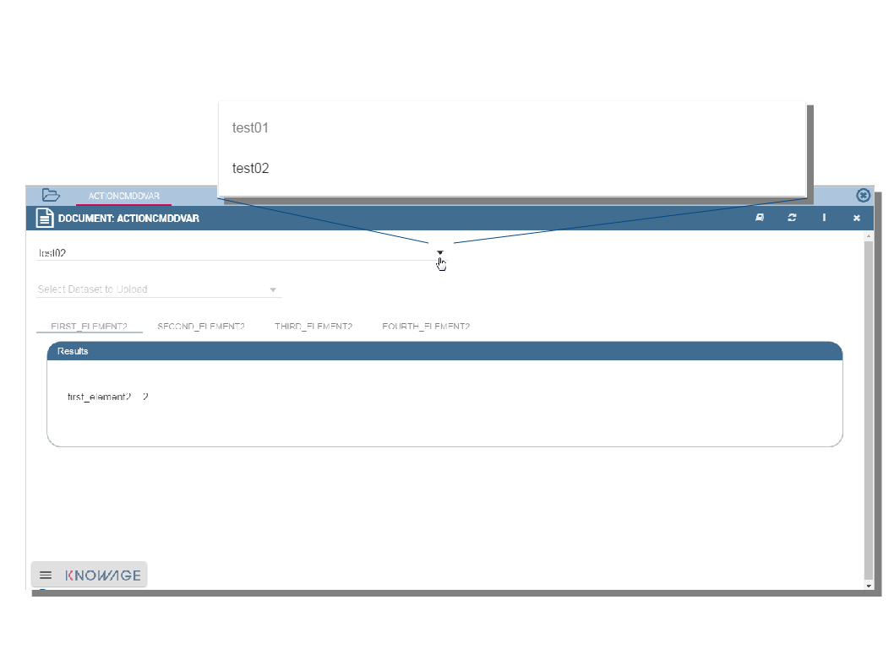

    Selecting the command to be applied.

We say in advance that the command are set in the template file. As you can check in next figure the template must contain the **COMMAND TAGS**. In the example each command (two in this case) is made up of instructions to be executed in order to compute one or more measures.

.. _commandtags:
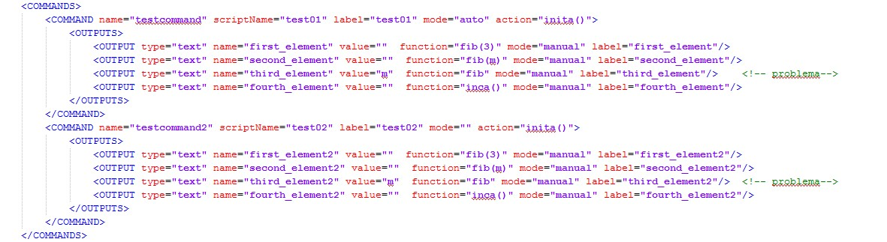

    The command tags.

The combobox will then reflect the command settings inside the template. Therefore it is important that the final user is told the meaning of each using “speaking” names or furnishing information with a documentation.

To switch to a different command, use the combobox and click on the target command. The simple click activates the execution.

The computed outputs are visualized in the half bottom of the page: each output populates a tab.

If the command refers to a script that needs one or more datasets, than these datasets are displayed between the command combobox and the outputs tabs. You can use the combobox which list the Knowage dataset matched to the document throught the template. Otherwise you can upload a file for Knowage datasets that cannot be changed from the GUI. Clicking on the **FILE** button it is possible to upload the file to replace the default dataset. Remember to click on the |image404| to start the upload. 

.. figure:: media/image389.png

    Changing dataset related to a command.
    
Then a **Run script** button will appear to re-execute the document as indicated below.

.. _executbuttupload:
.. figure:: media/image390.png

    Execution button after the upload.

As well as for other analysis tools, data mining allows to filter data through parameters. In this case the setting of the parameters can be done in the script tag or the command tag. The main parts of the code for the configuration of parameters are highlighted in figure below.

.. figure:: media/image391.png

    Setting parameters.

We will not go further into details of R or Python code so we leave the user to take care about the issue. Generally you can use two kind of parameters (when defined by developers): output parameters and command parameters. These may be required for changing factors or more generally fields (string or numbers) inside the script or in the output functions.

When dealing with output parameters, you can update the corresponding values by filling the input box appearing in the respective output tab panel. Once you re-run the document, the modifications are applied to a single output, the one which the parameter is associated to.

On the other hand, when dealing with command parameters, you can update the variable value by clicking the double gear icon (circled in the following figure) displayed next to the command name. 

.. _clickdoublebuttchange:
.. figure:: media/image392.png

    Click on the double gear button to change the .

The button updates the interface and opens a box (see figure below) where you can change a convalidate the modification. The variable value is passed to the whole command and hence it updates the variables of all command outputs.

.. _changingparamvalues:
.. figure:: media/image393.png

    Changing the parameter values.

In case the commands produce image outputs the interface is essentially the same as the text output case. So you can change commands, dataset and set parameter values. The output tabs will though display data through graphics. An example is given below.

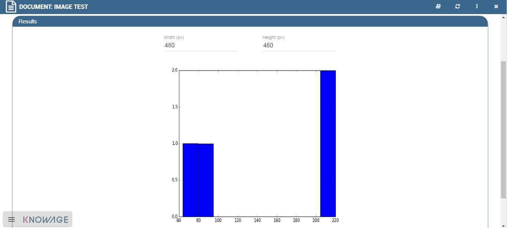

    Image outputs.

Also in the dataset output case there are not considerable changes in the window organization. A Data Mining document with dataset output transform a query over a data source or a plain data container into a dataset on Knowage Server. For instance, this kind of output comes to be really useful when the user needs to convert a .xlsx or .csv file into a dataset on Server. The output tab will accordingly shows a message stating the name of the dataset as stored in Knowage Server, under Data Provider » data set menu item. The following figure gives an example.

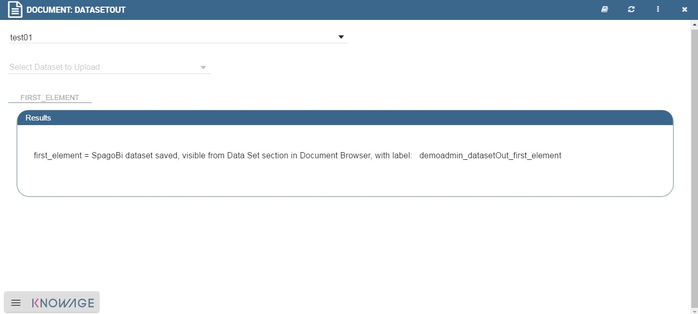

    Dataset outputs.

Only when using R language, the outputs can be set to html type. In this case, the document execution will provoke the opening of a web page containing the results requested through the command instructions.

Functions Catalog
----------------------

The Data Mining can also be managed through the **Functions** framework. In this section we will see how to explore and handle this part, while in Create a new function in Function Catalog we will see how to create a new function.

First click on the **Functions Catalog** from the Knowage main page as shown below.

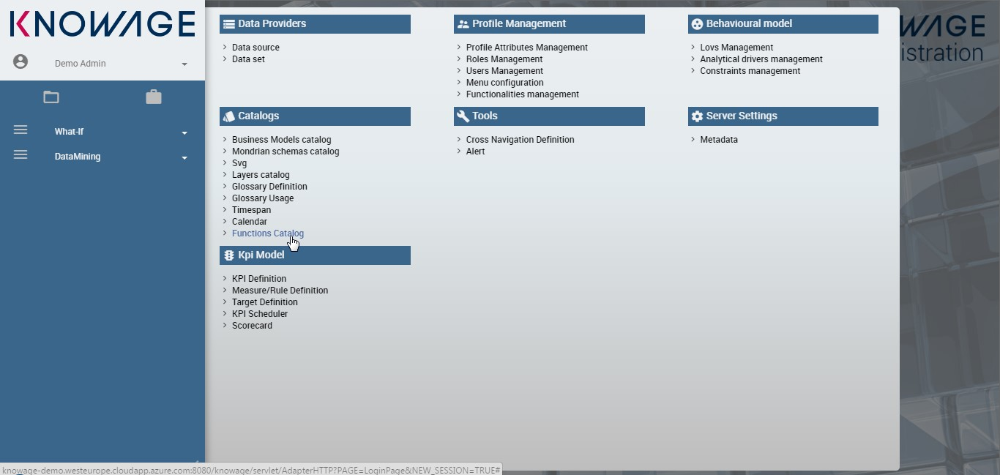

    Functions Catalog from Knowage menu.

You will enter a page like the one shown in figure below.

.. _functioncatalinterf:
.. figure:: media/image397.png

   Functions Catalog interface.

The actions that a user can perform depend on the user’s role. However, indipendently from the user’s role, once entered the feature all functions are shown by default. Referring to the figure above, one has the page made up of:

-  **categories**: these are set by an administrator user and are used to classify the functions accordingly to their definition and goals. Moreover they’re of help in browsing the functions; only the admin user can add and/or modify categories.

-  **tags**: they are used to easily sharpen the research and esily recall the functions that are tagged with that word; once again only the admin user can add and/or modify tags;

-  **list of functions** (if there are any): these are visible and explorable by any kind of user. Anyway only an admin user can add and/or modify them.

.. hint::
    **Add or modify the categories**
         
         The admin can add a new category using the Domain management available on Knowage Server under the Server Settings section. To know more about this section, please refer to Section “Server settings” of the General Administration Manual.

The categories for functions depends on an admin user. Taking *Functions Catalog interface* figure as an example, we have:

1. **Text Analysis**: make sense of unstructured text,

2. **Machine Learning**: teach your app to teach himself,

3. **Computer Vision**: identify objects in images,

4. **Utilities**: ready to use microservices,

5. **All**: visualizes all your functions; this is the only category that cannot be changed or removed.

To facilitate the comprehension we created some functions to be examined. We recall here that one can look for a function in different ways: using the categories or the tags or using the Functions Catalog “Search” box available at the top of the functions list as highlighted below.

.. figure:: media/image398.png

    Search box to look for a function.

We suppose here to select one category, which means to click on the category box, in order to be able to analize the functions belonging to it.

Note that the underlined part in figure below contains a list of tags. These help to focus on the subjects and therefore fuctions associated to that category. Viceversa when all functions are shown, all tags are shown as well and they can be used to pick up functions related to that subject.

.. figure:: media/image399400.png

    Using tags and categories to look for functions.

A function can be executed using the icon |image417| which launches a demo (i.e. the function with default values) or using the icon |image4171| which launches the computation after the insertion of new values for data. Use the icon |image4172| for deleting the function. Only the an admin user can use the three options, while the final user can use only the “execution” button.

.. |image417| image:: media/image401.png
   :width: 30
   
.. |image4171| image:: media/image402.png
   :width: 30
   
.. |image4172| image:: media/image403.png
   :width: 30

To create a new function an admin user must click on the “Plus” icon available at the right top corner of the page. The action opens the interface shown below. Here you have four tabs that we describe shortly in the following subsections.

.. _creatingnewfunct:
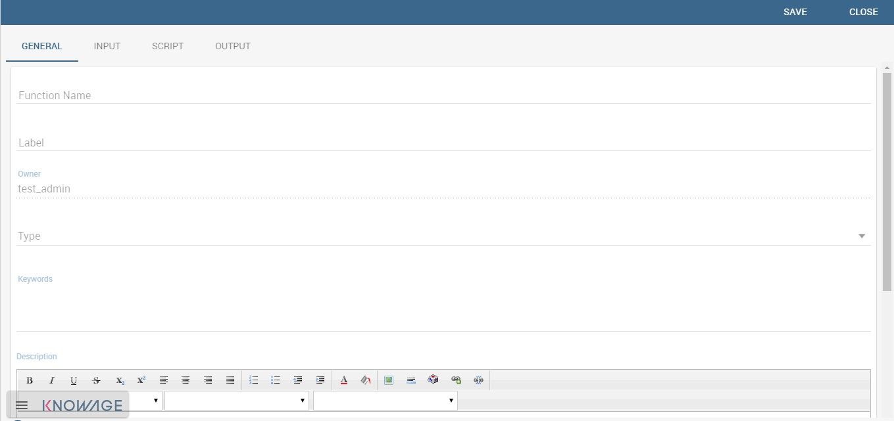

    Creating a new function.

The General tab\*
~~~~~~~~~~~~~~~~~

In this tab the user gives the general information about the function as the figure above shows. The admin user must type: the *name* of the function, the *label* with which it is identified uniquely (remember to use only numbers or letters and do not leave spaces between them). The *keywords* are were tags are defined. Finally the *Description* is where the user can insert a text or images to be shown when the function outputs are visualized.

The Input tab\*
~~~~~~~~~~~~~~~

As shown in the following figure, the function admits three kind of input: the *dataset*, the *variables* and the *files* one.

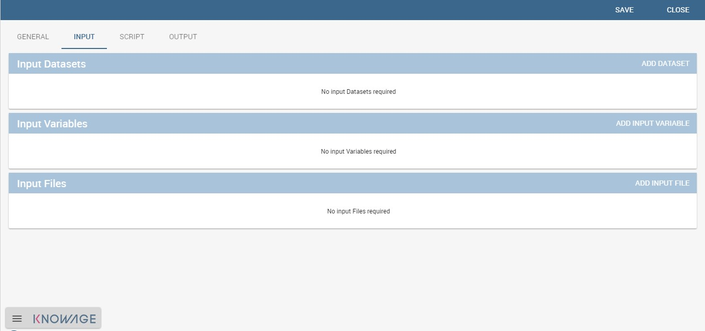

    Input tab.

In the “Dataset” instance the function takes values from a Knowage dataset. It can be chosen from the combobox available in the dedicated area. Note that the combobox shows the labels of the datasets. It is also possible to ask for the preview so the user can check if the values suit the wished requests.

.. figure:: media/image406.png

    The dataset input of the function settings.

In the “Variable” case, the user must insert one or more variables and match them with values using the dedicated area.

.. figure:: media/image407.png

    The variable input of the function settings.

In the “File” case, the user is asked to browse folders and upload the wished document remembering to give an alias to it. Files as videos, images, etc are all supported by the functionalities.

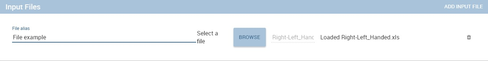

    The file input of the function settings.

The Script tab\*
~~~~~~~~~~~~~~~~

The script tab is where an expert user defines the function through the usage of datamining languages R or Python, as shown in Figure below, or calling for an external link. In particular, it is possible to choose between the two options **Local** and **Remote**.

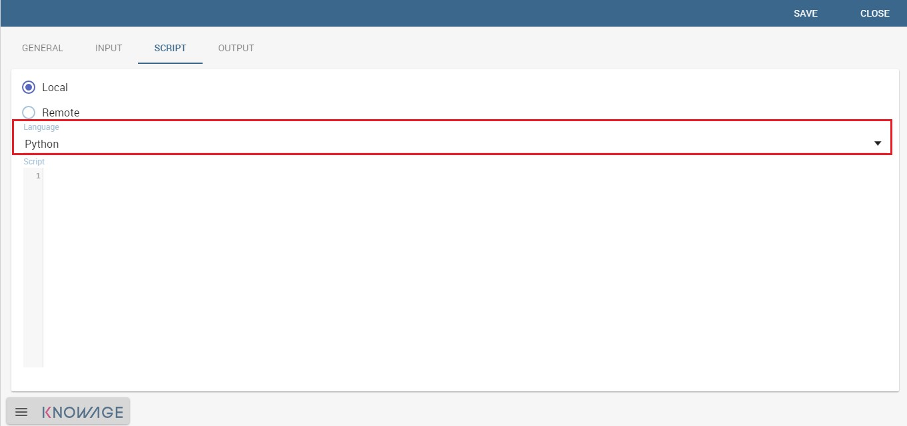

    The script tab.

We suppose we have chosen the “Local” modality and that we selected a dataset in the previous input tab. In this case the dataset is transformed into an R dataframe that can be recalled while editing the script using the same name of the dataset label. The following figure   shows an example.

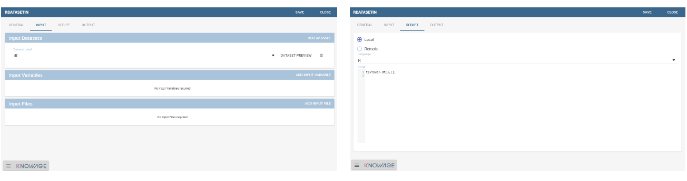

    Using the dataset dataframe generated by the software to edit the R script.

Note that if the function takes variables or files as input you can recall them through their name (as specified in the input tab). In particular, refer to Code syntax to recall the variable input in the variable instance, while for the file case remember that the alias will contain the file path.

.. code-block:: bash
         :caption: Code syntax to recall the variable input
         :linenos:
 
           $P{variable_name}
 
We suppose now to have chosen a dataset and the local modality but to want to use the Python language (see next figure). In this case the  dataset is saved and read by the script as a dataframe of the pandas libraries: `http://pandas.pydata.org/pandas-docs/stable/generated/pandas.DataFrame.html <http://pandas.pydata.org/pandas-docs/stable/generated/pandas.DataFrame.html>`__

.. _usedatafrmpandas:
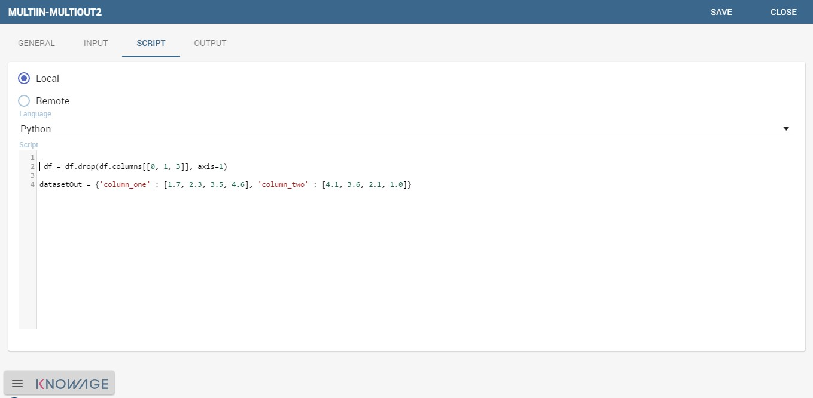

    Using the dataset dataframe of the pandas libraries generated by the software to edit the Python script. 
 
The “Remote” instance is used for external services and when the user wants to use a language which is not supported by Knowage server. When selecting this modality the user is asked to insert an URL calling for an external web site that supports and runs the requested language.

Technically, remote functions are recorded in the catalog list. The input data of those functions are specified by the local Knowage request and the code is not stored inside Knowage. On the contrary it is located at the address specified by the URL.

.. figure:: media/image413.png

    Input definition for remote function.

To define a remote function you have to perform the steps seen above, therefore to specify label, name, inputs and outputs. Figure below shows an example.

.. figure:: media/image413.png

    Remote function definition.

When opening the Script tab, select the Remote Radio button. The action will create a remote address and the editor where to insert the code will not be available and the user will have only the chance to specify the URL where the code is placed.

The function that you are defining must be a REST service, in particular of POST type, and it will receive the input data in the JSON format with the syntax showed in JSON format for remote function.

.. code-block:: json
         :caption: JSON format for remote function
         :linenos:

            [  
                {
                    "type":"variablesIn", 
                    "items":                                                
                    {                                                                            
                       "demoVarName1":"3",                   
                       "demoVarName2":"3"                                                  
                    }                                 
                }, 
                {
                    "type":"datasetsIn", 
                    "items":                                                
                    {                               
                        "demoDsName1":"df1",                                              
                        "demoDsName2":"df2"                                             
                    }                               
                },  
                {
                    "type":"filesIn", 
                    "items":                                                   
                    { 
                        "demoFileAlias1":                                                       
                    {                                                                   
                            "filename:filename1, 
                            base64 :..                                    
                    },   
                        "demoFileAlias2": 
                    {
                            "filename:filename2,
                            base64 :.. 
                    }
                    }
                }       
            ]
            
          
When the call runs successfully, the remote function must answer answer with a JSON element like the one exhibited in Code below.
 
.. code-block:: json
         :caption: JSON answer of a remote function
         :linenos:

            {                                                                           
            "resultType":"Image",                  
            "result":".image content in base64.",  
            "resultName":"res"                     
            },                                                                               
            {                                         
            "resultType":"Dataset",                
            "result":"outDatasetLabel",            
            "resultName":"datasetName"             
            },                                     
            { "resultType":"File", "result":       
            {                                      
            "filesize":"54836", --optional            
            "filetype":"image/jpeg", --optional      
            "filename":"chart.jpg", --optional        
            "base64":".file content in base64." }, 
            "resultName":"fileToBeSave"            
            }                                         

If an error occur the function must returns the lines as shown in JSON format for remote function.

.. code-block:: json
         :caption: JSON answer of a remote function
         :linenos:

          { 
            "service":"",                                                                          
            errors":[                            
              {                                     
               "message":"Here the error message."  
               ]                                     
          }

The Output tab\*
~~~~~~~~~~~~~~~~

Finally it is important to specify what kind of outputs the function will produce. Using the “Output“ tab shown below, you can choose between:

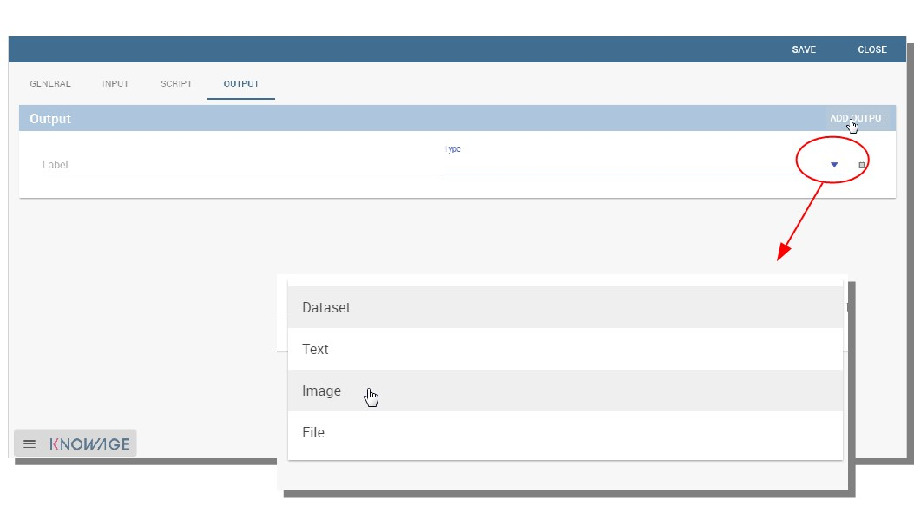

    Choosing the output type in the function definition.

-  **Dataset**: the function will return a set of records as a the Knowage dataset way;
-  **Image**: the function will return one or more graphics showing the results through bar or pie charts or other kind of visual tools;
-  **Text**: the function will return a window containing some text;
-  **File**: the function will return a file.

It is possible to define more than one output for the same function. As an example, in the following figure you can see the execution of the demo for a function called “Heart diseases”. The latter was set to have two outputs, one is of type “Dataset” and the other of type “Image”. The execution opens then a window with two tabs. The first tab contains the Dataset type output, which is translated visually with a table. While the second tab contains the Image output namely a set of graphics as configured to.

.. _execofdemoforfunct:
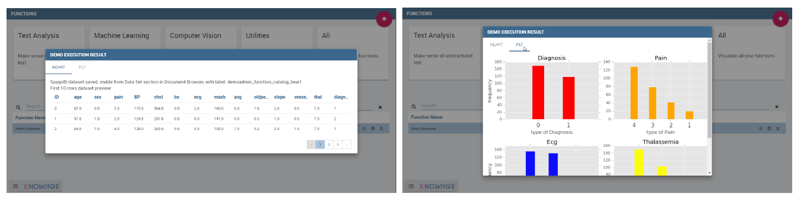

    Execution of demo for a function.

Clicking on the second execution icon you be asked to insert the new value and run the function after filling all boxes in. Figure below  shows the window opening when one asks for inserting new data values.

.. figure:: media/image417.png

    Inserting new data values for function.

Finally clicking on the function name as shown below you can enter function configuration details and modify them.

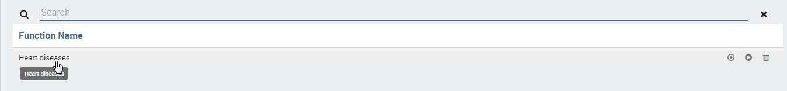

    Clicking on function name to modify it.

As well as for the input case, the script can recall the output elements. We need to distinguish between the R and the Python language. Note that, in the dataset case, the user needs to name the output as reported in the script body. The two figures below show an example.

.. _defoutpexample:
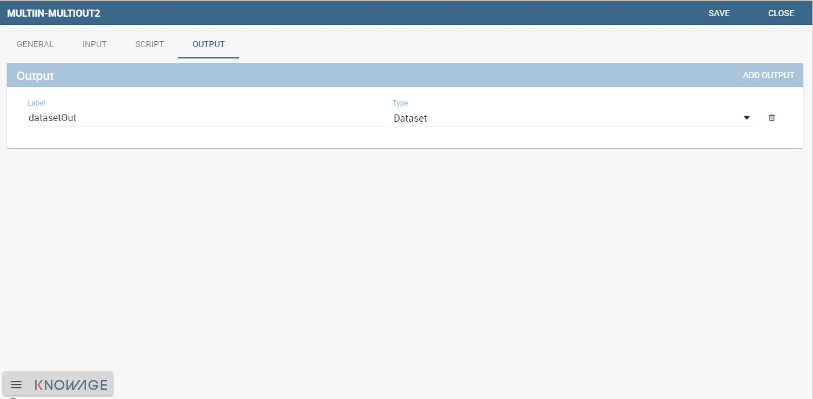

    Defining the output example.

When using Python the datasetOut variable is a “pandas” dataframe while, when using R it is a dataframe. Then it is important in fact  to consider the objects’ stucture (input and output type must match).

When the script runs using a certain output dataset Knowage server produces a dataset whose name and label is label <User_Name> functionsCatalog <label specified in the Output tab>.

As an example the function produces a dataFrame whose label and name are biadmin_functionsCatalog_datasetOut.

Engine description
--------------------------

The **Data Mining Engine** is thought and implemented in order to supply KnowAge with data mining capabilities, but it also enhances OS R and Python with several distinguishing features.

Basically the integration is done through the rJava R package, JRI library and the JPY lbrary for Python. R/Python scripts are written inside the data mining documents template and evaluated server side once the document is executed. Nevertheless, developers can combine several scripts, each one with its own outputs.

The leading component is the command object, that holds the activation of one script, together with its outputs. There can be many commands, but the one which is executed at document start up, is the one with mode set to auto, whilst all of the others will be executed once user clicks on the corresponding element.

Data
~~~~

Each script can run on two kinds of datasets. The first one is the file type, that means users can upload their files, interacting with the GUI. Note that the extension of the file, as well as how to read it (comma separated or tab separated, is header present or not,...) can be specified in the proper DATASET tag in document’s template. The other type of dataset is the Knowage Parametrization and customization dataset. This feature allows to use inside your R scripts data retrieved from many kind of sources, without ad-hoc R packages utilization.

Moreover this is very useful for Big Data data sources (Hive, Impala, Hbase, NoSQL databases as MongoDB, OrientDB, Cassandra etc..), because not all of them are connectable from R, and if they are, in most cases, R must be istalled on their cluster.

Therefore this is the first powerful feature Knowage adds to R. Each Knowage dataset is readable as a CSV file, so developers must apply the proper functions.

Parametrization and customization
~~~~~~~~~~~~~~~~~~~~~~~~~~~~~~~~~

Another characteristic is that the data mining document is customizable both with Knowage Analytical driver and GUI variables. The first choice, enables developers to use the behavioural model to change the results of the Knowage datasets used by the scripts. These parameters don’t modify other data mining document’s parts. On the other hand, setting GUI variables can be useful to change the outputs of the scripts, but they don’t affect the resultsets of the datasets.

As explained at the beginning of the chapter, there are two kind of variables: output variable and command variable. Once the user runs again the document by saving the value of the variable, the value is passed to the output function. On the other hand, by choosing the second option the whole script belonging to the command will benefit of the variable update.

Outputs
~~~~~~~

Knowage data mining document can perform a set of scripts and visualize them according to the associated predefined outputs, that can be images as well as text. This combination of results, that can be modified on-the fly using variables and shared across the network through Knowage web application, can exploit R workloads. Indeed Knowage can provide role’s privileges to the document’s access or execution.

My first data mining document\*
-------------------------------------

Create a new generic document and select **Data Mining** as Type and **Data-Mining Engine** as Engine. Define label, name and description and associate the correct datasource. The next step is the definition of the template.

The template of a data mining document is a simple XML file that enables the developer to configure properly the document behaviour.   Look at Linux and Tomcat example. 

.. code-block:: xml
         :caption:  Linux and Tomcat example
         :linenos:
 
                  <?xml version="1.0" encoding="ISO-8859-15"?> 
                  <DATA_MINING>                                
                  <DATASETS>                                                            
                           <DATASET name="fileDS" readType="table" type="file" label="Dataset_Label_01 " canUpload="true">
                           <![CDATA[ ...read_options...]]>                                   
                  </DATASET>                                                         
                  </DATASETS>                                                           
           
                  <SCRIPTS>                                                             
                                                                                     
                                                                                     
                                                                                     
                  </SCRIPTS>                                                            
             
                  <COMMANDS>                                                            
                       <COMMAND name="command1" scriptName="Script_Name_01" label=" Command_Label_01" mode="auto">                                               <OUTPUTS>                                                          
                            <OUTPUT type="image" name="a" value="x" function="plot" mode="auto" label="Output_Label_01"/>                                           <OUTPUT type="image" name="c" value="z,k" function="biplot" mode=" manual" label="Output_Label_02"/>                                     <OUTPUT type="text" name="d" value="y" mode="manual" label="   Output_Label_03"/>                                                   </OUTPUTS>                                                         
                       </COMMAND>                                                         
                  <COMMAND name="command2" scriptName="Script_Name_02" label=" Command_Label_01" mode="manual" action="function1(x)">                         <VARIABLES>                                                        
                             <VARIABLE name="var1" default="valuevar1"/>                        
                      </VARIABLES>                                                       
                      <OUTPUTS>                                                          
                           <OUTPUT type="text" name="c" value="z" function="function2(y,z)"  mode=" manual" label="Output_Label_01"/>                         </OUTPUTS>                                                         
                  </COMMAND>                                                         
                    <COMMAND name="command3" scriptName="Script_Name_03" label=" Command_Label_03" mode="manual"action="action_to_call">                       <OUTPUTS>
                           <OUTPUT type="text" name="e" value="z2" mode="manual" label=" Output_Label_01">                                                     <VARIABLES>                                                       
                           <VARIABLE name="var2" default="valuevar2"/> </VARIABLES>           
                      </OUTPUT>                                                          
                           <OUTPUT type="image" name="f" value="" function="rectf(z)" mode="auto" label="Output_Label_02"/>                                   </OUTPUTS>                                                         
                  </COMMAND>                                                         
                  </COMMANDS>                                                              
                  </DATA_MINING>                                                        

As you can see in the example, there are six basic tags:

-  COMMANDS: the leading objects. They call a script execution and can have multiple outputs. They enable interactive document execution where only command in mode=''auto'' is executed automatically. The mode=“manual” requires the user’s click.
-  OUTPUTS: to define which results have to be shown. They work with the Images. Text is the string representation of the script result, while *Image* is the chart generated by R. There are also predefined functions (histogram, plot, biplot) or developer’s functions that generate the output recalled by function.
-  SCRIPTS: they contain the R script (including objects definitions, pre-processing and functions). There can be many scripts depending on commands. The main function execution can be recalled (if needed) by the action attribute. The main script is executed once. Outputs will look for the objects in the user’s workspace.
-  DATASETS: the data used by the scripts. They are executed at the beginning of the document’s execution so that data.frames can be used further by every script. There are two dataset types:

  -  file: csv, delim, text, etc., manually loaded by the end user at document execution time;
  -  Knowage datasets: defined by label in document’s template, whose resultset is converted in CSV. They can use analytical drivers.

-  PARAMETERS: they corresponds to Knowage analytical drivers and can influence the behaviour of the Knowage dataset. They cannot be   applyed to other components.
-  VARIABLES: are required for changing factors or more generally parameters (strings or numbers) inside the script (referenced by a command) or the output functions.

Once the template has been edited it can be upload on Knowage server to create a usable Data Mining document. Enter then Knowage document browser and click on the “Plus” icon. The insert all mandatory fileds as label, name, engine and datasource. Then you must upload the template file cliking on the icon available at the bottom of the form, highlighted below.

.. figure:: media/image420.png

    Creating a new function.

Create a new function in the Function Catalog
--------------------------------------------------

To create a new Function you must click on the “Plus” icon available at the right top side of the page. The action will provoke the opening of the window in figure below made up of 4 tabs.

.. figure:: media/image421.png

    Creating a new function.

-  **General**: here you have to set the Function name, the label which identifies the function univocally, the name of the user who creates the function, the type to which the function belongs to and a brief description of the function usage.

-  **Input**:

.. figure:: media/image422.png

    Input tabs.

Use the icon |image436| to insert a new dataset or a new variable. And use the icon |image437| to delete the insertion. Choose a dataset from the combobox and use the “Preview button” to check the outcome. While for the variables you must specify the variable name and value. An example is give in figure below.

   
.. |image437| image:: media/image424.png
   :width: 30

.. figure:: media/image425.png

    Inserting variables.

-  **Script**: here is where the user is required to have knoledge of R or Python language. Figure below shows an example.

.. figure:: media/image426.png

    Typing Python script

-  **Output**: referring to the following figure, in the Output tab you have to choose how the output should be visualized. Still use the icon |image438| to insert a new output and the icon |image439| to delete the items. Then insert the output name and once again you can choose among “Text”, “Image”, “Dataset” for both Python and R.

   
.. |image439| image:: media/image424.png
   :width: 30

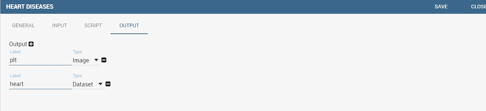

    Choosing how to visualise outputs.

Then save and you are ready to use the function.

