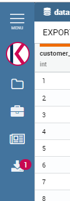

Dataset Preview
===================

The **dataset preview** is a functionality present in workspace, in cockpit and in BIRT report that will manage to get a preview of the selected dataset and parameter.

Dataset preview structure
---------------------------

    Dataset preview example screenshot.

As you can see in the example, in the dataset preview you can see the dataset columns highlighted with different colors
depending on the data type. Same data type columns will share the same color.

For every column you will be able to read the column name and the column type inside the column header.
At the bottom a pagination will appear if needed.

For some specific dataset the export bar will also be available. If the selected dataset supports this functionality
a bar will appear at the top of the dialog. Clicking the buttons inside you will be able to download the preview in the 
selected format.

    Dataset export bar.

Dataset preview export
-------------------------------
Clicking on the export button, or if the default for that preview is set to download, an exportation process
will start in background. 

After the process is over a notification badge will appear on the *downloads* menu icon.

    Download notification badge.

Inside workspace
---------------------------

Inside workspace you can access the dataset preview clicking on the preview button like in the example below.

    How to access workspace preview.

Inside cockpit
------------------------------------

Inside cockpit you can find the dataset preview settings in the following widget configuration:
    - Table widget
    - Chart widget
    - Html widget

Opening the widget settings the *cross* tab will be available, with the cross-navigation and preview functionalities.

    Preview navigation configuration.

Enabling the preview toggle you will have the possibility to choose which dataset will be show in preview.

If some dataset parameters are set, those will be visibile in the list below.
It'possible to set the parameter's value in different ways depending on the selected widget.

Selecting *Direct download* checkbox will allow the user to export directly the preview result on interaction.
The download will be available as a common preview export inside downloads menu.

