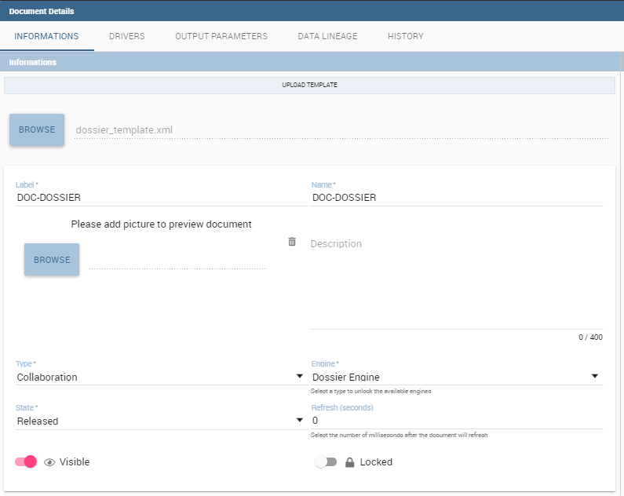
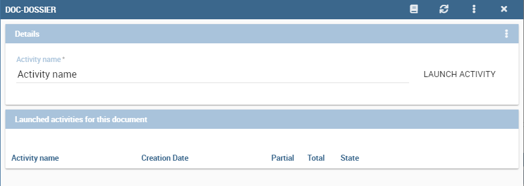
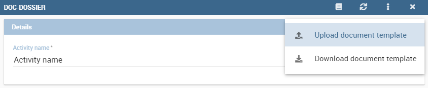
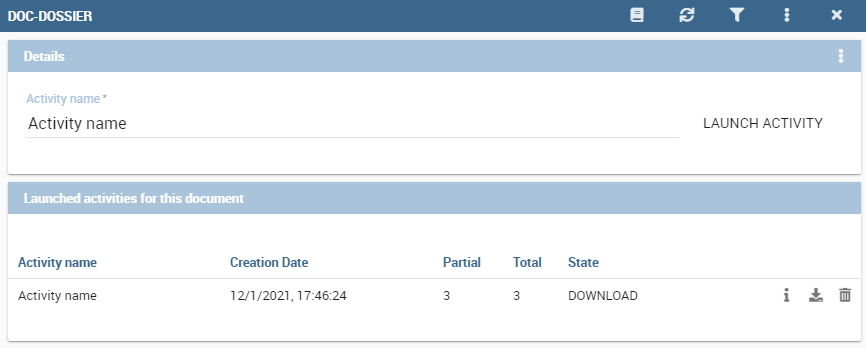

# Expediente

Un documento de dossier le permite obtener un archivo procesado a partir de una plantilla de entrada. Un ejemplo típico de uso de esta característica es la creación de un archivo con contenido variable actualizado en cada ejecución. Para ello, debe crear un documento de dossier con una plantilla XML bien configurada.

.. importante::
**Edición Enterprise**

       If you purchased Knowage EE, the following features are available only in KnowageER license.

## Plantilla XML

Etiquetas y propiedades

```

XML template is an XML file used to configure parameters needed to the elaboration. This file is uploaded during document creation and can be updated using the HISTORY tab visible in document edit mode.

In particular, tag allowed are:

-  **DOSSIER**: main tag used to define the dossier template;
-  **PPT_TEMPLATE**: contains properties related to the PPT template  (incompatible with DOC_TEMPLATE). You can specify:

  - *name*: the name of the template file name (Supported file types are PPT, PPTX);

-  **DOC_TEMPLATE**: contains properties related to the DOC template (incompatible with PPT_TEMPLATE). You can specify:

  - *name*: the name of the template file name (Supported file types are DOCX);
  - *downloadable*: true/false. Enable/disable the download of the template (optional);
  - *uploadable*: true/false. Enable/disable the upload of the template (optional);

-  **REPORT**: contains document's properties. You can specify:

  - *label*: the label of the document to be executed;
  - *imageName*: the name of the image inside the docx document. If the document is multisheet, imageName value will be composed by the document label ending with the suffix "_sheet_<number>". For example, to use the screenshot of the first sheet, the value will be "documentLabel_sheet_0". This name can be set into title or description using the alternative text menu of the picture;
  - *sheetWidth*: the value of the width of the sheet (in pixels). This value will be used if sheetHeight is also set (optional);
  - *sheetHeight*: the value of the height of the sheet (in pixels). This value will be used if sheetWidth is also set (optional);
  - *deviceScaleFactor*: the value to use as the scaling factor to be applied when capturing the screenshot (optional);

-  **REPORTS**: encloses all REPORT tags;
-  **PARAMETER**: sets parameter for the document's execution. You can specify:

  -  *type*: static/dynamic. Defines the type of the analytical driver. It must be the same as the one of the document to be executed;
  -  *url_name*: the url name of the analytical driver to be used. It must be the same as the one of the document to be executed;
  -  *url_name_description*: the description displayed in the driver value input panel for the analytical driver;
  -  *dossier_url_name*: the url name of the analytical driver set into detail mode;
  -  *value*: the value to be set into the driver (mandatory if type="static");

-  **PARAMETERS**: encloses all PARAMETER tags;
-  **PLACEHOLDER**: sets the placeholder. You can specify:

  -  *value*: the text to be replaced;

-  **PLACEHOLDERS**: encloses all PLACEHOLDER tags.

.. warning::

  This feature is compatible with docx created with Microsoft Word 2010 and later.


Image adding (PPT_TEMPLATE)
------------------------------

Suppose you have to create a ppt/pptx file where to place the images relating to one or more reports. You have only to configure XML template defining some placeholders to be use for replacing and execute it. Below is shown an example of an XML template used for this purpose.

.. code-block:: xml
    :linenos:
    :caption: Example (a) of template for Dossier for Image replacement on docx file.

    <?xml version='1.0' encoding='utf-8'?>
    <DOSSIER>
    	<PPT_TEMPLATE name="PPT_TEMPLATE.pptx"/>
    	<REPORTS>
    		<REPORT label="Report-multivalue-parameter">
    			<PLACEHOLDERS>
    				<PLACEHOLDER value = "ph1"/>
    			<PLACEHOLDERS>
    			<PARAMETERS>
    				<PARAMETER type="static" dossier_url_name="state" url_name="state" value="Canada"/>
    			</PARAMETERS>
    		</REPORT>
    	</REPORTS>
    </DOSSIER>

The example above is using one placeholder and one static analytical driver.

.. warning::

    Please note that the file to be used as a template must be placed in ``TOMCAT_HOME/resources/<TENANT_NAME>/dossier`` path.


Image replacing (DOC_TEMPLATE)
--------------------------------

Suppose that you have to draw up a document where text is static but images related to need to be updated.

By this functionality you will be able to use a docx file as a template and replace images inside it. More precisely, you can configure your XML and docx templates to allow Knowage to replace specific images with new ones obtained by the execution of specified documents.

Below is shown an example of an XML template used for this purpose.

.. code-block:: xml
    :linenos:
    :caption: Example (a) of template for Dossier for Image replacement on docx file.

    <?xml version='1.0' encoding='utf-8'?>
    <DOSSIER>
    	<DOC_TEMPLATE name="DOC_TEMPLATE.docx" downloadable="true" uploadable="true" />
    	<REPORTS>
    		<REPORT label="DOC_01" imageName="img_DOC_01" sheetWidth="1366" sheetHeight="650" deviceScaleFactor="1.5">
                <PARAMETERS>
    				<PARAMETER type="dynamic" dossier_url_name="family_dossier" url_name="family_document"/>
    				<PARAMETER type="dynamic" dossier_url_name="category_dossier" url_name="category_document"/>
                </PARAMETERS>
    		</REPORT>
    		<REPORT label="DOC_02" imageName="img_DOC_02" sheetWidth="1366" sheetHeight="650" deviceScaleFactor="1.5">
                <PARAMETERS>
    				<PARAMETER type="dynamic" dossier_url_name="family_dossier" url_name="family_document"/>
    				<PARAMETER type="dynamic" dossier_url_name="category_dossier" url_name="category_document"/>
                </PARAMETERS>
    		</REPORT>
    		<REPORT label="DOC_03" imageName="img_DOC_03" sheetWidth="1366" sheetHeight="650" deviceScaleFactor="1.5">
                <PARAMETERS>
    				<PARAMETER type="dynamic" dossier_url_name="family_dossier" url_name="family_document"/>
    				<PARAMETER type="dynamic" dossier_url_name="category_dossier" url_name="category_document"/>
                </PARAMETERS>
    		</REPORT>
    	</REPORTS>
    </DOSSIER>

Also docx document must be modified to be compatible with the replacer.

In particular:

-  images in the document must be inserted by copying and pasting from the file system (or using the "insert image" feature);
-  each image must have a unique name
-  imageName in the XML template must match the title (alt text) of the image in the docx.

.. warning::

	To optimize dossier creation procedure, same document will be executed more than one time if and only if its parameters change. In that scenario sheetHeight, sheetWidth and deviceScaleFactor will be set for every execution. Moreover, if parameters don't change, document will be executed only one time and sheetHeight, sheetWidth and deviceScaleFactor values will stay the same as the first execution.


My first dossier
----------------

You can create a dossier document by using the plus button and choosing "Generic Document". Proceed by filling in the necessary fields, choosing the XML template and selecting "Collaboration" as the type and "Dossier engine" as the engine. If the documents to be executed have one or more analytical drivers, these drivers must be added to the dossier document from the DRIVER tab.



    Dossier document creation interface.

After saving the document, you can access the dossier activity page by clicking the play button.



    Dossier activity interface.

If one or more dynamic analytic drivers are set, the required inputs must be provided in the sliding menu that appears from the right. You will then go to the dossier activity page.



    Dossier activity interface.

If upload/download are enabled, file template can be uploaded/downloaded using the three dot menu on the top right of the "Details" tab.

.. warning::

       This feature is available only for image replacing procedure.


If you want to execute your document, you must enter a name for the activity and click on "LAUNCH ACTIVITY". A new task will be started in the STARTED state and a new row will be visible in the table below. At the end of the execution of the task, the processed file can be downloaded with the appropriate download icon.



    Dossier activity execution finished.

Each line allows you to see useful information on the activity (such as the values of the drivers used for execution) by clicking on the info icon, download the processed file by clicking on the download icon and remove itself by clicking on the trash icon.
```
