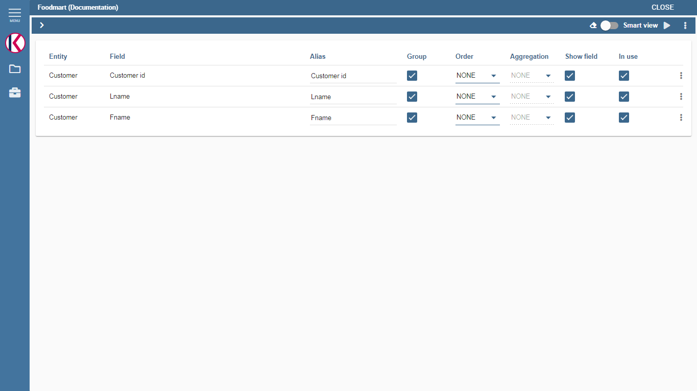
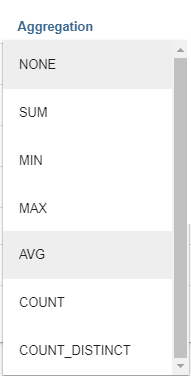
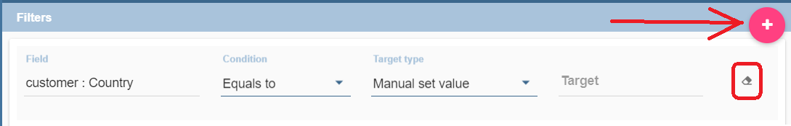
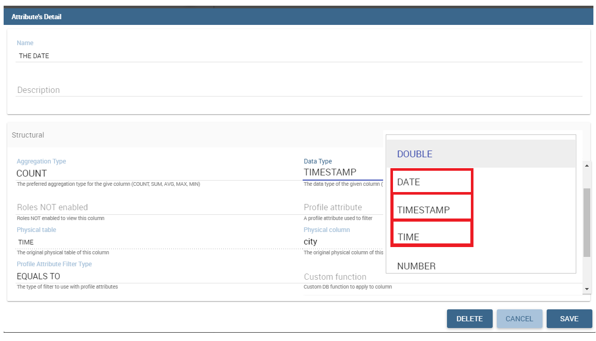

# Consulta gratuita

Esta guía de usuario detallada está dedicada al Qbe (acrónimo de Query By Example), un instrumento de consulta gratuita que permite a los usuarios un acceso fácil y gratuito a la información a través de interfaces gráficas.

Free Inquiry indica el modus operandi de analistas y usuarios operativos que generalmente buscan análisis de negocios que no se limiten a listas de resultados preestablecidas. Este método tiene un nivel medio de dificultad ya que requiere un conocimiento adecuado de la gestión de datos y una organización estructurada del trabajo.

QbE es la herramienta que te permite desarrollar tu consulta gratuita a través de una modalidad totalmente gráfica. Además, puede ejecutar la consulta, verificar los resultados, exportarlos y guardar la consulta para su uso posterior.

El material se dividirá en dos secciones principales. El primero está dedicado a construir consultas en el entorno de Knowage Server, suponiendo que un usuario experto ya haya creado un modelo de negocio adecuado para analizar. En la segunda parte, proporcionaremos al usuario los pasos principales para construir un modelo de negocio adecuado a través del diseñador Qbe disponible en Knowage Meta.

## Mi primera consulta por ejemplo

**QbE** (es decir, Query By Example) le permite consultar (un subconjunto de) una base de datos a través de una representación de alto nivel de las entidades y relaciones. Sus principales características son:

*   tiene una RICA GUI de usuario final;
*   permite seleccionar atributos y establecer filtros;
*   no requiere ningún conocimiento de las estructuras de datos;
*   requiere un conocimiento semántico de los datos;
*   es útil cada vez que la consulta gratuita sobre los datos es más importante que su diseño gráfico;
*   deja libre la gestión de los resultados;
*   es compatible con las capacidades de exportación;
*   permite la ejecución repetible de las investigaciones;
*   funciona en un dominio de datos con limitaciones.

La creación de una consulta QbE no requiere ningún conocimiento técnico, sino conocimiento del dominio de datos: los aspectos técnicos, como la creación de filtros, la agregación y los criterios de ordenación, se gestionan mediante una interfaz gráfica fácil de usar.

Supongamos que un administrador ha construido un modelo de negocio y, en consecuencia, lo ha lanzado en Knowage Server. Esto permite al usuario acceder al modelo, consultar las entidades disponibles y guardar los resultados como un conjunto de datos, utilizable más adelante en otros documentos de Knowage, como cabinas.

A continuación discutimos cada paso en detalle, mostrando las funcionalidades básicas y avanzadas de la **QbE Editor**.

Diseño y ejecución de consultas

```

To open the QbE editor, access the **Models** section, available in the end user's **Workspace**. Then, simply click on the model icon to reach the QbE graphical interface.

In this paragraph we show how to build a simple query with the QbE editor.

.. figure:: media/qbeDesigner.png

    QbE editor.

As shown in Figure 9.1 the window of the QbE editor contains the **Query designer**. In next sections we explain in detail all the areas of the **Query Designer**, the **Datamart Schema** tab, the query editor and a hidden tab dedicated to the management of queries, subqueries and parameters catalogue.

Datamart Schema
^^^^^^^^^^^^^^^^

Starting from the left side:
	The upper Panel shows the searchable logical schema and the list of entities that can be queried to generate the query. Entities are represented in a tree structure, with user-defined names. Field can be added in the query (right area) clicking on it.
	The lower Panel shows list of created subqueries in a tree structure where children are fields of subquery

There are few types of entities: *facts*, represented by a cube symbol.(i.e., the Sales entity), *dimensions*, represented by a four-arrows symbol (i.e., the Product entity), *geographical dimension*, represented by *earth* icon.

Each single entity is composed of a title, some attributes or measures and relationships with other entities. Relations are available clicking on *i* icon of one entity. In particular, by exploding the content of an entity (i.e. Sales as in figure above), you may encounter the following elements:

- **measure**: it refers to fields associated with numeric data (e.g. UNIT SALES);
- **attribute**: it refers to fields that can be associated to a category (e.g. PRODUCT ID);
- **relation**: it refers to relationships or connections between two entities (e.g. relationship between the sales and the product dimension).

.. figure:: media/image300.png

	Relations of one entity.

There are two available views: smart and advanced. When qbe is opened by default user will see smart view. Clicking on one field of one entity that field will be added in the query and results will be displayed without any other user interaction.

.. figure:: media/smart.png

	Smart view.

User can switch to advanced view clicking on Smart view in top right corner. User can continue adding fields in the query but without seeing result.



	Advanced view


Let us see more in detail how to add calculated fields.

Calculated fields management
^^^^^^^^^^^^^^^^^^^^^^^^^^^^^^^^

You can create new calculated fields inside a query. In advanced view there will be available option for creating **calculated fields**. Clicking on **Calculator** icon **Calculated field wizard** will open.

To build a calculated field, you shall define:

- **Name**;
- **Type**: string, number or date;
- **Nature**: measure or attribute;
- **Formula**: you can click on the fields included on the left and build the formula.

An example is provided below.

.. figure:: media/calculateFieldWizard.png

    Calculated field wizard.


Query Editor
^^^^^^^^^^^^^^^^

Central panel provides a query editor. As we already mentioned, there are two available views: smart and advanced.

Elements from the datamart schema on the left can be added into the query editor. To remove an field from the query editor, just click on the x icon, or if advanced view is opened, clicking on three dots icon, **Delete field** is available.

Selected Fields
^^^^^^^^^^^^^^^^

Central panel contains the list of columns to be returned by the query. To add a new field in this section, just click on a field in the schema panel tree.

This panel is structured as a table: columns contain the fields selected from the datamart schema. Every column has **gear icon** on the top (smart view), that is providing applicable functions as shown below, plus icon for deleting field form query and for ordering.

.. figure:: media/image212.png

    Select fields interface in smart view.

In the advanced view, every row include applicable functions as shown below, plus clicking on **three dots icon** there are few more functions.

.. figure:: media/image213.png

	Select fields interface in advanced view.


With available functions it is possible to:

- **Alias**: define aliases for fields: those aliases are shown as column headers in the result table; it is editable
- **Function**: in case of aggregation, define the aggregation function (e.g., **SUM**, **AVERAGE**, …) on the non-grouped items;
- **Order**: define a sorting criteria: double click on the **Order** column to set the ordering criteria;
- **Group**: in case of aggregations, define the attribute that you want to group on (if you know SQL syntax, these attributes are the ones you should place in the GROUP BY clause);
- **Visible**: indicate whether a column shall be visible in the result (hidden attributes are used and returned by the generated query, but are not shown in the result table);
- **In Use**: indicate whether a column shall be used to select the relative one during query execution or just to be used in calculated field
- **Filter**: add a filter criteria: clicking on this filter icon redirects you to the **Filters** tab;

It is possible to edit alias, clicking on gear icon (smart view) and on **Alias item**. In advanced view, alias can be changed clicking on cell of alias column.

.. figure:: media/aliasChange.png

	Change alias.

Pay attention to grouping options: if you want to define an aggregation function on a field (like, for instance, the **COUNT** of the sold items), you shall tick the Group checkbox for all the other fields added in the query editor, without an aggregation function defined, otherwise you will get an SQL exception. The possible grouping functions are shown in the following figure.



    Aggregation functions.

When you drag attributes belonging to entities that are linked through a relationship path, the QbE automatically resolves relationships between attributes (implicit join).

Moreover, multiple relationships may occur among entities. A typical example concerns dates. Suppose you have two relationships between the **Order** fact table and the **Time** dimension table: the first links the order_date column of the first table to the *time_id* column of the latter, while the second relationship joins the *shipping_date* column to the *time_id column*.

In this case, when dragging fields from both the **Order** entity and the **Time** entity you may want to specify which relationship will join the two tables: for instance, you may want to know the total number of orders according to the ordering month, the shipping month or for both. In all these situations, you can set the relationship to be used by clicking the **Relationships wizard** button at the top right corner of the panel. A pop up window opens where you can define the path to be used. Please refer to Multiple relationships section for all details regarding the disambiguation of relationships.

The toolbar about query editor sub-section has a toolbar contains additional functionalities summarized in Table below.

.. table::  Select fields toolbar options
      :widths: auto

      +-----------------------------------+-----------------------------------+
      |    Button                         | Description                       |
      +===================================+===================================+
      |    **Join definitions**           | Displays relations between        |
      |                                   | query entities                    |
      +-----------------------------------+-----------------------------------+
      |    **SQL**                        | Shows SQL generated by the        |
      |                                   | graphical interface               |
      +-----------------------------------+-----------------------------------+
      |    **Discard Repetitions**        | Remove duplicated rows from       |
      |                                   | results, if any                   |
      +-----------------------------------+-----------------------------------+
      |    **P**                          | Add parameters                    |
      |                                   |                                   |
      +-----------------------------------+-----------------------------------+
      |    **Calculator**                 | Add calculated fields             |
      |                                   |                                   |
      +-----------------------------------+-----------------------------------+
      |    **Three gears**                | Open advanced filters panel       |
      |                                   |                                   |
      +-----------------------------------+-----------------------------------+
      |    **Eye**                        | Show/hide hidden fields           |
      |                                   |                                   |
      +-----------------------------------+-----------------------------------+
      |    **Smart View**                 | Switch between smart and          |
      |                                   | advanced view                     |
      +-----------------------------------+-----------------------------------+
      |    **Play**                       | Preview query                     |
      +-----------------------------------+-----------------------------------+
      |    **Three dots**                 | Option to choose between Deleting |
      |                                   | all fields from query and Export  |
      |                                   | query into csv/xls/xlsx           |
      +-----------------------------------+-----------------------------------+

Filters
^^^^^^^^

The **Filters** panel allows you to define filter criteria (WHERE clause). Filters are structured as a table: here rows contain filters, while columns represent the elements of the filter. Filters panel can be opened in three ways:
- In smart view clicking on **Filter icon** on the field in entity
- In smart view clicking on **filter icon** on the already added field in the query
- In advanced view clicking on three dots and **Filters item**

Adding new filter is possible clicking on **+** icon.

Removing the filter is possible clicking on **eraser** icon.



Filters are expressions of type:

                                      **Left operand + Operator + Right operand.**

Structure of Filters panel is:

-  the **Field, Condition, Target** columns allow you to define filters according to the syntax defined above.
-  the **Target type** column define the types of right operand: manual, value of the field, another entity, parameter, subquery;

With target type **manual** you should fill input **target** with value that you want to be right operand.

.. figure:: media/manualTarget.png

	Manual target type

With target type **value of the field** lookup function is activated to facilitate selection of values. You are able to choose values for right operand. If you are choosing two values, you should set condition to be **between**, **not between**, **in** or **not in**. If you are choosing more then two values, you should set condition to be **in** or **not in**.

.. figure:: media/lookupFunction.png

    Filter lookup for right operand selection.

With target type **another entity** you will get option to choose field from another entity for your right operand.

.. figure:: media/anotherEntity.png

About target type **subquery** and **parameter** there will be more words later.


.. important::
         **Enterprise Edition only**

         Filtering data with fields type of date/time/timestamp using calendar/time/calendar is available only for Enterprise Edition.

If you have SI license file, you will get the chance to filter your data with fields type of date/time/timestamp using calendar/time/calendar + time option. This depends of what is data type of you field, and this is coming form metamodel creation phase.
When creating your metamodel, you can set data type of to your field.



	Metamodel creation.

.. figure:: media/date.png

	Filters creation on date data type of the field.

.. figure:: media/time.png

	Filters creation on time data type of the field.

.. figure:: media/timestamp.png

	Metamodel creation, timestamp data type of the field.

Note that more complex combinations of filters can be defined using the advanced filter wizard, which you ca find selecting the **Three gears** icon.

In the following table the possible types of filters in the QbE are summarized. The use of subqueries in filters is explained later in *Advanced QbE functionalities* paragraph.

.. table:: Possible combinations of filters in the QbE.
      :widths: auto

      +-------------+-------------+-------------+-------------+-------------+
      | Filter type | Left        | Operator    | Right       | Example     |
      |             | operand     |             | operand     |             |
      +=============+=============+=============+=============+=============+
      |    Basic    | Entity.attr | Any         | value       | Prod.family |
      |             | ibute       |             |             | =           |
      |             |             |             |             |             |
      |             |             |             |             | 'Food'      |
      +-------------+-------------+-------------+-------------+-------------+
      |    Basic    | Entity.attr | Any         | Entity.attr | Sales.sales |
      |             | ibute       |             | ibute       | >           |
      |             |             |             |             | Sales.cost  |
      +-------------+-------------+-------------+-------------+-------------+
      |  Parametric | Entity.attr | Any         | [parameter] | Prod.family |
      |             | ibute       |             |             | =           |
      |             |             |             |             |             |
      |             |             |             |             | [p_family]  |
      +-------------+-------------+-------------+-------------+-------------+
      |    Dynamic  | Entity.attr | Any         | prompt      | Prod.family |
      |             | ibute       |             |             | = ?         |
      +-------------+-------------+-------------+-------------+-------------+
      |    Value    | Entity.attr | In          | subquery    | Sales.custo |
      |    list     | ibute       |             |             | mer         |
      |    from     |             | /not in     |             | in subquery |
      |    subquery |             |             |             |             |
      +-------------+-------------+-------------+-------------+-------------+
      |    Single   | subquery    | < = >       | value       | Subquery >  |
      |    value    |             |             |             | 0           |
      |    from     |             |             |             |             |
      |    subquery |             |             |             |             |
      +-------------+-------------+-------------+-------------+-------------+

When filtering a date attribute or a time attribute it is possible to apply a timespan to ease the insertion of values. Following the images below, we can see that the Timespan button appears when filterting, for instance, a date attribute. We recall that is it possible to configure a new timespan using the dedicated Knowage functionality we described in the administrator guide.


	Filtering date attribute: use a timespan.

After selecting one timespan, the user must clcik on apply to ask the server to insert the start and end values.


	Filtering date attribute: apply a timespan.

Finally click on the save button and data is filtered accordingly.


Query Preview
^^^^^^^^^^^^^^^

While you are in smart view you can see preview of you query.
While you are in advanced view, and you are satisfied with your query or if you want to check the results, you can see the returned data by clicking the **Play** button located in the top right corner of the panel. From there, you can go back to the **Designer** to modify the definition of the query.

.. figure:: media/preview.png

	Preview wizard.

In case you have started the QbE editor directly from a model (that is, you have clicked on a model icon in the **My Data** > **Models** section) from here you can also click the **Save** button located in the top right corner of the page to save your query as a new dataset, reachable later from the **My Data**> **Dataset** section. Please note that this operation saves the *definition* of your query and not the snapshot of the resulting data. This means that every time you re-execute the saved dataset, a query on the database is performed to recover the updated data.

We highlight that when the save button is selected, a pop up shows asking you to fill in the details, split in three tabs:

-  **Generic**, in this tab you set basic information for your dataset like its **Label**, **Name**, **Description** and **Scope**.
-  **Persistence**, you have the chance to persist your dataset, i.e., to write it on the default database. Making a dataset persistent may be useful in case dataset calculation takes a considerable amount of time. Instead of recalculating the dataset each time the    documents using it are executed, the dataset is calculated once and then retrieved from a table to improve performance. You can also decide to schedule the persistence operation: this means that the data stored will be update according to the frequency defined in the **scheduling** options.

Choose your scheduling option and save the dataset. Now the table where your data are stored will be persisted according to the settings provided.

-  **Metadata** It recaps the metadata associated to the fields involved in your query.

.. figure:: media/saveQbeDS.png

	Save qbe dataset.


Advanced QbE functionalities
```

En esta sección nos centramos en las funciones avanzadas, que pueden ser gestionadas cómodamente por usuarios más expertos.

Uso de campos espaciales
^^^^^^^^^^^^^^^^^^^^^^^

.. importante::
**Solo Enterprise Edition**

         Spatial dimension is available only for Enterprise Edition with LI licence.

El motor Qbe admite consultas espaciales a través de un conjunto de operadores (que devuelven true o false) o un conjunto de funciones (estas generalmente devuelven una medida). Aunque esta característica solo está disponible cuando se posee la licencia de Location Intelligence (LI) y cuando los datos se almacenan en la base de datos Oracle 12c. También es fundamental que el Modelo de Negocio tenga que ser etiquetado como modelo geográfico. Puede consultar la sección Meta Web para obtener detalles sobre cómo establecer la opción geográfica utilizando Knowage Meta.

Suponemos que tenemos un BM con dimensiones geográficas habilitadas (por un usuario técnico). En este caso, las dimensiones que tienen campos espaciales están marcadas con el icono de la brújula |earthIcon|. Una vez expandida la dimensión espacial, se enumeran los campos. Aquí no hay un símbolo de seguimiento para distinguir entre los atributos geográficos y el "normal". Por ello es muy importante que el usuario esté previamente informado de qué campos tiene propiedades geométricas.

.. |Tierraico| imagen:: media/earthIcon.png
:ancho: 30

.. figura:: media/image218.png

    QbE spatial dimensions.

Después de una primera selección de campos, es posible agregar campos calculados. Haga clic en el botón **Calculadora** opción disponible en el área del editor de consultas como se muestra en la flecha azul de la figura siguiente. Tenga en cuenta que se abre un asistente: puede utilizar este editor para insertar un nuevo campo obtenido a través de una secuencia finita de operación en los campos seleccionados. Los círculos de la siguiente figura subrayan que los campos sobre los que se puede operar son los previamente seleccionados con un simple clic en el campo.

.. \_calculfldwizardspt:
.. figura:: media/image219.png

    Calculated field wizard with spatial filters.

Además, tenga en cuenta que el **Artículos** panel proporciona todas las funciones aplicables ordenadas por categorías:

*   funciones de agregación,
*   funciones de cadena
*   funciones de tiempo,
*   funciones espaciales,
*   funciones sql,
*   función personalizada (si están registrados).

.. advertencia::
**Tener en cuenta la definición de la función Oracle**

         It is important to refer to Oracle Documentation to know the arguments, in terms of type and number, of each function to                assure the right functioning and do not occur in errors while running the Qbe document.

Estos últimos están disponibles solo en presencia de un modelo de negocio geográfico y *mosto* aplicarse correctamente a atributos o medidas espaciales. La siguiente figura muestra la lista de las funciones espaciales disponibles, mientras que la siguiente tabla le ayuda a usarlas correctamente, proporcionando el nombre de la función Oracle correspondiente y un enlace para obtener información más específica sobre el uso, el número de argumentos, el tipo y la salida.

.. figura:: media/image220.png

    Spatial function list.

.. \_linkoraclesptfnct:
.. table:: Enlace a funciones espaciales de Oracle.
:widths: automático

         +-----------------------+-----------------------+
         |    Function Name      | Oracle Function       |
         +=======================+=======================+
         |    **distance**       | SDO_GEOM.SDO_DISTANCE |
         +-----------------------+-----------------------+
         |    **dimension**      | GET_DIMS              |
         +-----------------------+-----------------------+
         |    **centroid**       | SDO_GEOM.SDO_CENTROID |
         +-----------------------+-----------------------+
         |    **geometrytype**   | GET_GTYPE             |
         +-----------------------+-----------------------+
         |    **length_spa**     | SDO_GEOM.SDO_LENGTH   |
         +-----------------------+-----------------------+
         |    **relate**         | SDO_GEOM.RELATE       |
         +-----------------------+-----------------------+
         |    **intersection**   | SDO_GEOM.INTERSECTION |
         +-----------------------+-----------------------+

Para aplicar una función, haga clic en el nombre de la función y se abrirá el asistente "Ventana de selección de operandos". La siguiente figura muestra un ejemplo para la función "Distancia". Rellene todas las casillas ya que todos los campos son obligatorios.

.. figura:: media/image221.png

    Operands selection window.

Finalmente, puede usar la función espacial para agregar un campo calculado, como se muestra a continuación.

.. figura:: media/image222.png

    Example of added calculated field using a spatial function.

Además de los campos calculados, es posible filtrar en campos espaciales utilizando operadores geométricos específicos. Una vez más informamos en la Figura a continuación del operador geométrico disponible (puede encontrarlos desplazándose por el panel hasta la parte inferior) e informamos el enlace a las páginas web de Oracle en la siguiente tabla.

.. figura:: media/image223.png

    Spatial filters.

Vea la siguiente tabla:

.. \_linkoraclefltrfnct:
.. table:: Enlace a las funciones de filtro de Oracle.
:widths: automático

         +-----------------------+-----------------------+
         |    Function Name      | Oracle Function       |
         +=======================+=======================+
         |    **touches**        | SDO_TOUCH             |
         +-----------------------+-----------------------+
         |    **filter**         | SDO_FILTER            |
         +-----------------------+-----------------------+
         |    **contains**       | SDO_CONTAINS          |
         +-----------------------+-----------------------+
         |    **covered by**     | SDO_COVEREDBY         |
         +-----------------------+-----------------------+
         |    **inside**         | SDO_INSIDE            |
         +-----------------------+-----------------------+
         |    **covers**         | SDO_COVERS            |
         +-----------------------+-----------------------+
         |    **overlaps**       | SDO_OVERLAPS          |
         +-----------------------+-----------------------+
         |    **equals to**      | SDO_EQUAL             |
         +-----------------------+-----------------------+
         |    **intersects**     | SDO_ANYINTERACT       |
         +-----------------------+-----------------------+
         |    **nn**             | SDO_NN                |
         +-----------------------+-----------------------+

Funciones de tiempo para crear campos calculados
^^^^^^^^^^^^^^^^^^^^^^^^^^^^^^^^^^^^^^^^^^^^^^

.. importante::
**Solo Enterprise Edition**

         Time functions are available only for Enterprise Edition with SI licence.

Si tiene licencia SI, en el asistente de campo calculado qbe hay funciones de tiempo disponibles.

.. figura:: media/timeFunctions.png

    Time functions.

Vea la siguiente tabla:

.. \_timefunctions:
.. tabla:: Funciones de tiempo.
:widths: automático

    +-----------------------------------+-----------------------------------+
    |    Function                       | Description                       |
    +===================================+===================================+
    |    **CURRENT_DATE()**             | Returns current date              |
    +-----------------------------------+-----------------------------------+
    |    **CURRENT_TIME()**             | Returns current time              |
    +-----------------------------------+-----------------------------------+
    |    **Hour(date)**                 | Returns hour from date            |
    +-----------------------------------+-----------------------------------+
    |    **Second(date)**               | Returns hour from date            |
    +-----------------------------------+-----------------------------------+
    |    **Year(date)**                 | Returns year from date            |
    +-----------------------------------+-----------------------------------+
    |    **Month(date)**                | Returns month from date           |
    +-----------------------------------+-----------------------------------+
    |    **Day(date)**                  | Returns day from date             |
    +-----------------------------------+-----------------------------------+
    |    **get_quarter(date)**          | Returns quarter of year for date  |
    +-----------------------------------+-----------------------------------+
    |    **get_week(date)**             | Returns week of year for date     |
    +-----------------------------------+-----------------------------------+
    |    **get_day_of_the_week(date)**  | Returns day of week for date      |
    +-----------------------------------+-----------------------------------+
    |    **add_days(date, num)**        | Add some days to date             |
    +-----------------------------------+-----------------------------------+
    |    **add_hours(date,num)**        | Add some hours to date            |
    +-----------------------------------+-----------------------------------+
    |    **add_months(date,num)**       | Add some months to date           |
    +-----------------------------------+-----------------------------------+
    |    **add_years(date,num)**        | Add some years to date            |
    +-----------------------------------+-----------------------------------+
    |    **subtract_years(date,num)**   | Remove some years from date       |
    +-----------------------------------+-----------------------------------+
    |    **subtract_days(date,num)**    | Remove some days from date        |
    +-----------------------------------+-----------------------------------+
    |    **subtract_months(date,num)**  | Remove some months from date      |
    +-----------------------------------+-----------------------------------+
    |    **subtract_hours(date,num)**   | Remove some hours from date       |
    +-----------------------------------+-----------------------------------+
    |    **datediff_in_days(date)**     | Difference in days between dates  |
    +-----------------------------------+-----------------------------------+
    |    **datediff_in_hours(date)**    | Difference in hours between dates |
    +-----------------------------------+-----------------------------------+
    |    **datediff_in_minutes(date)**  | Difference in mins between dates  |
    +-----------------------------------+-----------------------------------+

.. figura:: media/currentDate.png

    Creating calculated field with function current_date().

.. figura:: media/currentTime.png

    Creating calculated field with function current_Time().

.. figura:: medios/hora.png

    Creating calculated field with function hour(date).

.. figura:: medios/segundo.png

    Creating calculated field with function second(date).

.. figura:: medios/año.png

    Creating calculated field with function year(date).

.. figura:: medios/mes.png

    Creating calculated field with function month(date).

.. figura:: medios/día.png

    Creating calculated field with function day(date).

En la imagen de abajo, puede ver la lista de todos los campos calculados creados:

.. figura:: media/advanceViewTime.png

    List of created calculated fields.

En la siguiente imagen puedes ver el resultado de tu consulta:

.. figura:: media/previewTime.png

    Result of the query.

Subconsultas
\++++++++++

El **Motor QbE** también admite la definición y el uso de subconsultas de forma similar al lenguaje SQL. Como resultado, puede definir una subconsulta y utilizarla dentro de un filtro en asociación con el operador in/not in, como se muestra en la figura siguiente. Para crear una nueva subconsulta, que se puede utilizar como filtro dentro de la consulta principal, haga clic en |addSubqueries| , en la parte izquierda, en **Entidades derivadas**  barra de herramientas. En la vista principal verá que puede agregar campos en subconsulta.

.. |adioSubcuencias| imagen:: media/addSubquery.png
:ancho: 30

.. figura:: medios/subconsultas.png

    QbE subquery view.

Puede volver fácilmente al qiery principal haciendo clic en **PRINCIPAL** en la barra de herramientas del editor de consultas.

Para usar la subconsulta dentro de la consulta principal, simplemente elija entre el tipo de destino **Opción de subconsulta**De **Blanco** Elija la subconsulta que desee y establezca el tipo de condición (**EN** o **NO EN**). Ahora la subconsulta se utiliza para proporcionar valores dentro del filtro, de manera similar a las subconsultas SQL.

.. figura:: media/image281.png

    QbE query: use of a subquery in a filter.

Parámetros
\++++++++++

El **Motor QbE** también admite la definición y el uso de parámetros que se pueden utilizar para filtrar los datos mediante el filtro qbe. Para crear un nuevo parámetro, que se puede utilizar como filtro dentro de la consulta principal, haga clic en |parámetro| , en la barra de herramientas de consulta principal.

.. |parámetro| imagen:: medios/parámetro.png
:ancho: 30

.. figura:: media/paramWizard.png

    QBE parameter view.

Para usar el parámetro dentro de la consulta principal, simplemente elija entre el tipo de destino **Opción de parámetro** y desde **Blanco** elija el parámetro que desee. Ahora el parámetro se utiliza para proporcionar valores dentro del filtro.

.. figura:: media/filterParam.png

    QbE query: use of a parameter in a filter.
