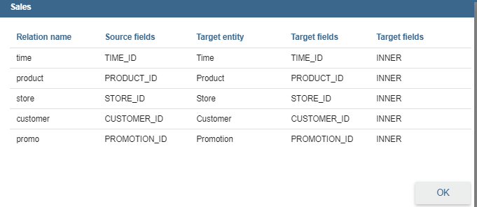
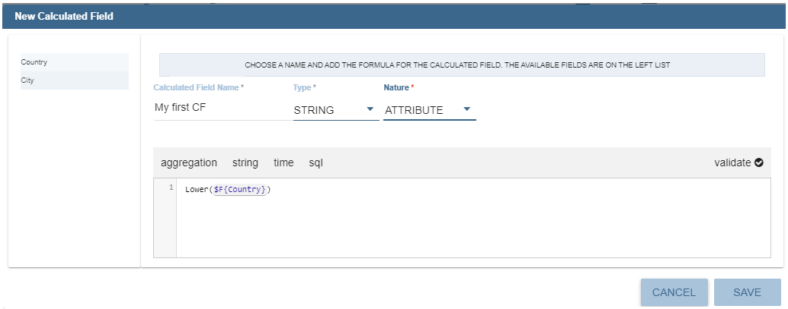
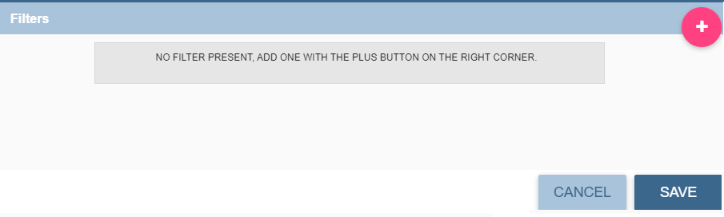
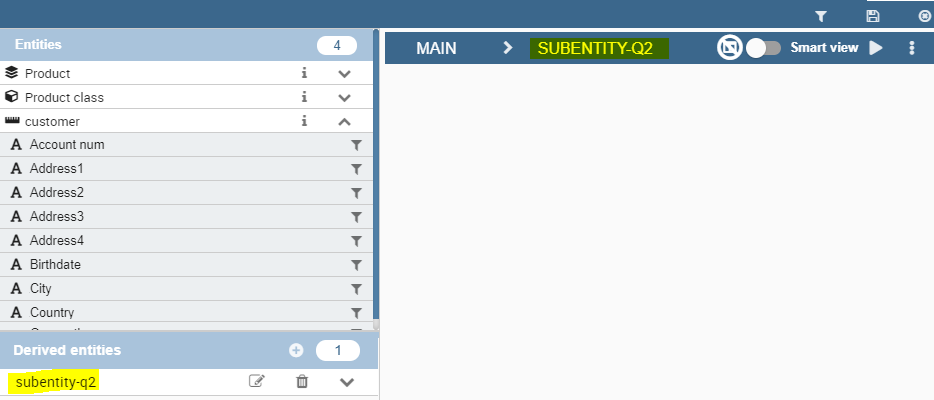

Free Inquiry
============

This detailed user guide is dedicated to the Qbe (acronym of Query By Example), a Free Inquiry instrument which empowers users with easy and free access to information via graphical interfaces.

Free Inquiry indicates the modus operandi of analysts and operational users that are usually seeking for business analysis that are not limited to pre-arranged lists of results. This method has a medium level of difficulty since it requires an adequate knowledge of data management and a structured organization of work.

QbE is the tool that lets you develop your free inquiry through an entirely graphical modality. Moreover, you can execute the query, check the results, export them and save the query for further use.

The material will be divided in two main sections. The first is dedicated to build queries in the Knowage Server environment, supposing that an expert user has already created a suitable business model to analyse. In the second part, we will provide the user for the principal steps to build a proper business model through the Qbe designer available in Knowage Meta.

My first Query By Example
--------------------------

**QbE** (i.e., Query By Example) allows you to query (a subset of) a database through a high-level representation of the entities and relations. Its main characteristics are:

-  it has a rich end user GUI;
-  it allows to select attributes and set filters;
-  it does not require any knowledge of data structures;
-  it requires a semantic knowledge of data;
-  it is useful every time the free inquiry on data is more important than their graphical layout;
-  it leaves the management of results free;
-  it supports export capabilities;
-  it allows the repeatable execution of inquiries;
-  it works on a data domain with limitations.

Building a QbE query does not require any technical knowledge, but data domain knowledge: technical aspects, such as creating filters, aggregation and ordering criteria, are managed by a user-friendly graphical interface.

Let’s suppose that an administrator has built a business model and, consequently, released it on Knowage Server. This permits the user to access the model, query the available entities and save results as a dataset, usable later in other Knowage documents, such as cockpits.

In the following we discuss each step in detail, showing basic and advanced functionalities of the **QbE Editor**.

Query design and execution
~~~~~~~~~~~~~~~~~~~~~~~~~~~~~~

To open the QbE editor, access the **Models** section, available in the end user's **Workspace**. Then, simply click on the model icon to reach the QbE graphical interface.

In this paragraph we show how to build a simple query with the QbE editor.

.. figure:: media/image208.png

    QbE editor.

As shown in Figure 9.1 the window of the QbE editor contains the **Query designer**. In next sections we explain in detail all the areas of the **Query Designer**, the **Datamart Schema** tab, the query editor and a hidden tab dedicated to the management of queries, subqueries and parameters catalogue.

Datamart Schema
^^^^^^^^^^^^^^^^

Starting from the left side:
	The upper Panel shows the searchable logical schema and the list of entities that can be queried to generate the query. Entities are represented in a tree structure, with user-defined names. Field can be added in the query (right area) clicking on it.
	The lower Panel shows list of created subqueries in a tree structure where children are fields of subquery

There are few types of entities: *facts*, represented by a cube symbol.(i.e., the Sales entity), *dimensions*, represented by a four-arrows symbol (i.e., the Product entity), *geographical dimension*, represented by *earth* icon.

Each single entity is composed of a title, some attributes or measures and relationships with other entities. Relations are available clicking on *i* icon of one entity. In particular, by exploding the content of an entity (i.e. Sales as in figure above), you may encounter the following elements:

- **measure**: it refers to fields associated with numeric data (e.g. UNIT SALES);
- **attribute**: it refers to fields that can be associated to a category (e.g. PRODUCT ID);
- **relation**: it refers to relationships or connections between two entities (e.g. relationship between the sales and the product dimension).

There are two available views: smart and advance. When qbe is opened by default user will see smart view. Clicking on one filed of one entity that field will be added in the query and user will se executed query in imidiately. 

.. figure:: media/smart.png

User can switch to advance view clicking on Smart view in top right corner. User can continue adding fields in the query but without seeing result. 

.. figure:: media/advanceView.png

Let us see more in detail how to add calculated fields.

Calculated fields management
^^^^^^^^^^^^^^^^^^^^^^^^^^^^^^^^

In advance view there will be availbe option for creating **calculated fields**. Clicking on **Calculator** icon **Calculated field wizard** will open.

To build a calculated field, you shall define:

- **Name**;
- **Type**: string, number or date;
- **Nature**: measure or attribute;
- **Formula**: you can click on the fields included on the left and build the formula.

An example is provided below.

    Calculated field wizard.

Query Editor
^^^^^^^^^^^^^^^^

The central panel provides a query editor. As we already mantioned, there are two available views: smart and advance.

Elements from the datamart schema on the left can be added into the query editor. To remove an field from the query editor, just click on the x icon, or if advance view is opened, clicking on three dots icon, **Delete field** is available.

Selected Fields
^^^^^^^^^^^^^^^^

Central panel contains the list of columns to be returned by the query. To add a new field in this section, just click on a field in the schema panel tree.

This panel is structured as a table: columns contain the fileds selected from the datamart schema. Every column has **gear icon** on the top (smart view), that is providing applicable functions as shown below, plus icon for deleting field form query and for ordering.

.. figure:: media/image212.png

    Select fields interface.

In the advance view, every row include applicable functions as shown below, plus clicking on **three dots icon** there are few more functions.

.. figure:: media/image213.png

With available functions it is possible to:

- **Alias**: define aliases for fields: those aliases are shown as column headers in the result table; it is editable
- **Function**: in case of aggregation, define the aggregation function (e.g., **SUM**, **AVERAGE**, …) on the non-grouped items;
- **Order**: define a sorting criteria: double click on the **Order** column to set the ordering criteria;
- **Group**: in case of aggregations, define the attribute that you want to group on (if you know SQL syntax, these attributes are the ones you should place in the GROUP BY clause);
- **Include**: indicate the column(s) to be included in the result (please notice that non-included attributes will not be returned by the query, but can be used in it, e.g. to apply grouping criteria);
- **Visible**: indicate whether a column shall be visible in the result (hidden attributes are used and returned by the generated query, but are not shown in the result table);
- **Filter**: add a filter criteria: clicking on this filter icon redirects you to the **Filters** tab;

It is possible to edit alias, clicking on gear icon (smart view) and on **Alias item**. In advance view, alias can be changed clicking on cell of alias column.

.. figure:: media/aliasChange.png

Pay attention to grouping options: if you want to define an aggregation function on a field (like, for instance, the **COUNT** of the sold items), you shall tick the Group checkbox for all the other fields added in the query editor, without an aggregation function defined, otherwise you will get an SQL exception. The possible grouping functions are shown in the following figure.

.. figure:: media/image214.png

    Aggregation functions.

When you drag attributes belonging to entities that are linked through a relationship path, the QbE automatically resolves relationships between attributes (implicit join).

Moreover, multiple relationships may occur among entities. A typical example concerns dates. Suppose you have two relationships between the **Order** fact table and the **Time** dimension table: the first links the order_date column of the first table to the *time_id* column of the latter, while the second relationship joins the *shipping_date* column to the *time_id column*.

In this case, when dragging fields from both the **Order** entity and the **Time** entity you may want to specify which relationship will join the two tables: for instance, you may want to know the total number of orders according to the ordering month, the shipping month or for both. In all these situations, you can set the relationship to be used by clicking the **Relationships wizard** button at the top right corner of the panel. A pop up window opens where you can define the path to be used. Please refer to Multiple relationships section for all details regarding the disambiguation of relationships.

The toolbar about query editor sub-section has a toolbar contains additional functionalities summarized in Table below.

.. table::  Select fields toolbar options
      :widths: auto

      +-----------------------------------+-----------------------------------+
      |    Button                         | Description                       |
      +===================================+===================================+
      |    **Join definitions**           | ???????????????????????????       |
      |                                   | ????????????????                  |
      +-----------------------------------+-----------------------------------+
      |    **SQL**                        | Shows SQL generated by the        |
      |                                   | graphical interface               |
      +-----------------------------------+-----------------------------------+
      |    **Discard Repetitions**        | Remove duplicated rows from       |
      |                                   | results, if any                   |
      +-----------------------------------+-----------------------------------+
      |    **P**                          | Add parameters                    |
      |                                   |                                   |
      +-----------------------------------+-----------------------------------+
      |    **Calculator**                 | Add calculated fields             |
      |                                   |                                   |
      +-----------------------------------+-----------------------------------+
      |    **Three gears*                 | Open advanced filters panel       |
      |                                   |                                   |
      +-----------------------------------+-----------------------------------+
      |    **Eye**                        | Show/hide hidden fileds           |
      |                                   |                                   |
      +-----------------------------------+-----------------------------------+
      |    **Smart View**                 | Switch between smart adn advance  |
      |                                   | view                              |
      +-----------------------------------+-----------------------------------+
      |    **Play**                       | Preview query                     |
      |                                   |                                   |
      +-----------------------------------+-----------------------------------+
      |    **Three dots**                 | Export query into csv/xls/xlsx    |
      |                                   |                                   |
      +-----------------------------------+-----------------------------------+

Filters
^^^^^^^^

The **Filters** panel allows you to define filter criteria (WHERE clause). Filters are structured as a table: here rows contain filters, while columns represent the elements of the filter. Filters panel can be opened in three ways:
- In smart view clicking on **Filter icon** on the field in entity
- In smart view clicking on **filter icon** on the alredy added field in the query
- In advance view clicking on three dots and **Filters item**

Adding new filter is possible clicking on **+** icon.

Removing the filter is possible clicking on **eraser** icon.

.. figure:: media/addDeleteFilter.png

Filters are expressions of type:

                                      **Left operand + Operator + Right operand.**

Structure of Filters panel is:

-  the **Field, Condition, Target** columns allow you to define filters according to the syntax defined above.
-  the **Target type** column define the types of right operand: manual, value of the field, another entity, parameter, subquery;

With target type **value of the field** lookup function is activated to facilitate selection of values

..figure:: media/lookupFunction.png

    Filter lookup for right operand selection.

Note that more complex combinations of filters can be defined using the Advance filter wizard, which you ca find selecting the **Three gears** icon.

In the following table the possible types of filters in the QbE are summarized. The use of subqueries in filters is explained later in *Advanced QbE functionalities* paragraph.

.. table:: Possible combinations of filters in the QbE.
      :widths: auto

      +-------------+-------------+-------------+-------------+-------------+
      | Filter type | Left        | Operator    | Right       | Example     |
      |             | operand     |             | operand     |             |
      +=============+=============+=============+=============+=============+
      |    Basic    | Entity.attr | Any         | value       | Prod.family |
      |             | ibute       |             |             | =           |
      |             |             |             |             |             |
      |             |             |             |             | 'Food'      |
      +-------------+-------------+-------------+-------------+-------------+
      |    Basic    | Entity.attr | Any         | Entity.attr | Sales.sales |
      |             | ibute       |             | ibute       | >           |
      |             |             |             |             | Sales.cost  |
      +-------------+-------------+-------------+-------------+-------------+
      |  Parametric | Entity.attr | Any         | [parameter] | Prod.family |
      |             | ibute       |             |             | =           |
      |             |             |             |             |             |
      |             |             |             |             | [p_family]  |
      +-------------+-------------+-------------+-------------+-------------+
      |    Dynamic  | Entity.attr | Any         | prompt      | Prod.family |
      |             | ibute       |             |             | = ?         |
      +-------------+-------------+-------------+-------------+-------------+
      |    Value    | Entity.attr | In          | subquery    | Sales.custo |
      |    list     | ibute       |             |             | mer         |
      |    from     |             | /not in     |             | in subquery |
      |    subquery |             |             |             |             |
      +-------------+-------------+-------------+-------------+-------------+
      |    Single   | subquery    | < = >       | value       | Subquery >  |
      |    value    |             |             |             | 0           |
      |    from     |             |             |             |             |
      |    subquery |             |             |             |             |
      +-------------+-------------+-------------+-------------+-------------+

Query Preview
^^^^^^^^^^^^^^^

While you are in smart view you can see preview of you query.
While you are in advance view, and you are satisfied with your query or if you want to check the results, you can see the returned data by clicking the **Play** button located in the top right corner of the panel. From there, you can go back to the **Designer** to modify the definition of the query.

In case you have started the QbE editor directly from a model (that is, you have clicked on a model icon in the **My Data** > **Models** section) from here you can also click the **Save** button located in the top right corner of the page to save your query as a new dataset, reachable later from the **My Data**> **Dataset** section. Please note that this operation saves the *definition* of your query and not the snapshot of the resulting data. This means that every time you re-execute the saved dataset, a query on the database is performed to recover the updated data.

We highlight that when the save button is selected, a pop up shows asking you to fill in the details, split in three tabs:

-  **Generic**, in this tab you set basic information for your dataset like its **Label**, **Name**, **Description** and **Scope**.
-  **Persistence**, you have the chance to persist your dataset, i.e., to write it on the default database. Making a dataset persistent may be useful in case dataset calculation takes a considerable amount of time. Instead of recalculating the dataset each time the    documents using it are executed, the dataset is calculated once and then retrieved from a table to improve performance. You can also decide to schedule the persistence operation: this means that the data stored will be update according to the frequency defined in the **scheduling** options.

Choose your scheduling option and save the dataset. Now the table where your data are stored will be persisted according to the settings provided.

-  **Metadata** It recaps the metadata associated to the fields involved in your query.

..figure:: media/saveQbeDS.png

	Save qbe dataset.

Advanced QbE functionalities
~~~~~~~~~~~~~~~~~~~~~~~~~~~~~~

In this section we focus on advanced features, which can be comfortably managed by more expert users.

Spatial fields usage
^^^^^^^^^^^^^^^^^^^^^^^

The Qbe engine supports spatial queries through a set of operators (that return true or false) or a set of functions (these usually return a measure). This feature is although available only when the Location Intelligence (LI) license is possessed and when data are stored in Oracle 12c database. It also fundamental that the Business Model has to be tagged as geographical model. You can refer to Meta Web Section to have details on how to set the geographical option using Knowage Meta.

We suppose that we have a BM with geographical dimensions enabled (by a technical user). In this case the dimensions which has spatial fields are marked with the compass icon |earthIcon|. Once the spatial dimension is expanded the fields are listed. Here there is no tracking symbol to distiguish between geographical attributes and the “normal” one. Therefore it is very important that the user is previously informed of which fields has geometrical properties.

.. figure:: media/image218.png

    QbE spatial dimensions.

After a first selection of fields, it is possible to add calculated fields. Click on the **Calculator** option available on the query editor area as shown by the blue arrow in figure below. Note that a wizard opens: you can use this editor to insert a new field obtained through a finite sequence of operation on the selected fields.The circles of the next figure underline that the fields on which you can operate are the one previously selected by a simple click on the field.

.. _calculfldwizardspt:
.. figure:: media/image219.png

    Calculated field wizard with spatial filters.

In addition note that the **Items** panel provides all the applicable functions sorted by categories:

-  aggregation functions,
-  string functions
-  time functions,
-  spatial functions,
-  sql functions,
-  custom function (if they are registred).

.. warning::
     **Take into account the Oracle function definition**

         It is important to refer to Oracle Documentation to know the arguments, in terms of type and number, of each function to                assure the right functioning and do not occur in errors while running the Qbe document.

The latter are available only in the presence of a geographical Business Model and *must* be properly applied to spatial attributes or measures. Figure below shows the list of the available spatial functions while next table helps you to use them properly, supplying the corresponding Oracle function name and a link to grab more specific information about usage, number of arguments, type and output.

.. figure:: media/image220.png

    Spatial function list.

.. _linkoraclesptfnct:
.. table:: Link to Oracle spatial functions.
         :widths: auto

         +-----------------------+-----------------------+-----------------------+
         |    Function Name      | Oracle Function       | Link to Oracle web    |
         |                       |                       | pages                 |
         +=======================+=======================+=======================+
         |    **distance**       | SDO_GEOM.SDO_DISTANCE | `https://docs.oracle. |
         |                       |                       | com/cd/B19306_01/appd |
         |                       |                       | ev.                   |
         |                       |                       | 102/b14255/sdo_objgeo |
         |              ddd         |                       | m.htm#i857957 <https: |
         |                       |                       | //docs.oracle.com/cd/ |
         |                       |                       | B19306_01/appdev.102/ |
         |                       |                       | b14255/sdo_objgeom.ht |
         |                       |                       | m#i857957>`__         |
         +-----------------------+-----------------------+-----------------------+
         |    **dimension**      | GET_DIMS              | `https://docs.oracle. |
         |                       |                       | com/cd/B10501_01/appd |
         |                       |                       | ev.                   |
         |           dddd            |                       | 920/a96630/sdo_meth.h |
         |                       |                       | tm#BABDEBJA <https:// |
         |                       |                       | docs.oracle.com/cd/B1 |
         |                       |                       | 0501_01/appdev.920/a9 |
         |                       |                       | 6630/sdo_meth.htm#BAB |
         |                       |                       | DEBJA>`__             |
         +-----------------------+-----------------------+-----------------------+
         |    **centroid**       | SDO_GEOM.SDO_CENTROID | `https://docs.oracle. |
         |                       |                       | com/cd/B19306_01/appd |
         |                       |                       | ev.                   |
         |                       |                       | 102/b14255/sdo_objgeo |
         |                       |                       | m.htm#i860848 <https: |
         |                       |                       | //docs.oracle.com/cd/ |
         |                       |                       | B19306_01/appdev.102/ |
         |                       |                       | b14255/sdo_objgeom.ht |
         |                       |                       | m#i860848>`__         |
         +-----------------------+-----------------------+-----------------------+
         |    **geometrytype**   | GET_GTYPE             | `https://docs.oracle. |
         |                       |                       | com/cd/B10501_01/appd |
         |                       |                       | ev.                   |
         |                       |                       | 920/a96630/sdo_meth.h |
         |                       |                       | tm#i866821 <https://d |
         |                       |                       | ocs.oracle.com/cd/B10 |
         |                       |                       | 501_01/appdev.920/a96 |
         |                       |                       | 630/sdo_meth.htm#i866 |
         |                       |                       | 821>`__               |
         +-----------------------+-----------------------+-----------------------+
         |    **length_spa**     | SDO_GEOM.SDO_LENGTH   | `https://docs.oracle. |
         |                       |                       | com/cd/B19306_01/appd |
         |                       |                       | ev.                   |
         |                       |                       | 102/b14255/sdo_objgeo |
         |                       |                       | m.htm#i856257 <https: |
         |                       |                       | //docs.oracle.com/cd/ |
         |                       |                       | B19306_01/appdev.102/ |
         |                       |                       | b14255/sdo_objgeom.ht |
         |                       |                       | m#i856257>`__         |
         +-----------------------+-----------------------+-----------------------+
         |    **relate**         | SDO_GEOM.RELATE       | `https://docs.oracle. |
         |                       |                       | com/cd/B19306_01/appd |
         |                       |                       | ev.                   |
         |                       |                       | m.htm#BGHCDIDG <https:|
         |                       |                       | //docs.oracle.com/cd/ |
         |                       |                       | B19306_01/appdev.102/ |
         |                       |                       | b14255/sdo_objgeom.ht |
         |                       |                       | m#BGHCDIDG>`__        |
         +-----------------------+-----------------------+-----------------------+
         |    **intersection**   | SDO_GEOM.INTERSECTION | `https://docs.oracle. |
         |                       |                       | com/database/121/SPATL|
         |                       |                       | /sdo_geom-            |
         |                       |                       | sdo_intersection.htm# |
         |                       |                       | SPATL1118 <https://   |
         |                       |                       | docs.oracle.com/      |
         |                       |                       | database/121/SPATL/   |
         |                       |                       | sdo_geom-sdo_         |
         |                       |                       | intersection.htm#>`__ |
         +-----------------------+-----------------------+-----------------------+

To apply one function click on the function name and the “Operands selection window” wizard opens. Figure below shows an example for the funtion “Distance”. Fill in all boxes since all fields are mandatory.

.. figure:: media/image221.png

    Operands selection window.

Finally you can use spatial function to add a calculated field, as shown below.

.. figure:: media/image222.png

    Example of added calculated field using a spatial function.

As well as calculated fields it is possible to filter on spatial fields using specific geometric operators. Once again we report in Figure below the available geometric operator (you can find them scrolling the panel to the bottom) and report the link to the Oracle web pages in the next table.

.. figure:: media/image223.png

    Spatial filters.

See the table below:

.. _linkoraclefltrfnct:
.. table:: Link to Oracle filter functions.
         :widths: auto

         +-----------------------+-----------------------+-----------------------+
         |    Function Name      | Oracle Function       | Link to Oracle web    |
         |                       |                       | pages                 |
         +=======================+=======================+=======================+
         |    **touches**        | SDO_TOUCH             | `https://docs.oracle. |
         |                       |                       | com/cd/B19306_01/appd |
         |                       |                       | ev.                   |
         |                       |                       | 102/b14255/sdo_operat |
         |                       |                       | .htm#BGEHHIGF <https: |
         |                       |                       | //docs.oracle.com/cd/ |
         |                       |                       | B19306_01/appdev.102/ |
         |                       |                       | b14255/sdo_operat.htm |
         |                       |                       | #BGEHHIGF>`__         |
         +-----------------------+-----------------------+-----------------------+
         |    **filter**         | SDO_FILTER            | `https://docs.oracle. |
         |                       |                       | com/cd/B19306_01/appd |
         |                       |                       | ev.                   |
         |                       |                       | 102/b14255/sdo_operat |
         |                       |                       | .htm#BJAFBCFC <https: |
         |                       |                       | //docs.oracle.com/cd/ |
         |                       |                       | B19306_01/appdev.102/ |
         |                       |                       | b14255/sdo_operat.htm |
         |                       |                       | #BJAFBCFC>`__         |
         +-----------------------+-----------------------+-----------------------+
         |    **contains**       | SDO_CONTAINS          | `https://docs.oracle. |
         |                       |                       | com/cd/B19306_01/appd |
         |                       |                       | ev.                   |
         |                       |                       | 102/b14255/sdo_operat |
         |                       |                       | .htm#BGEHCFDH <https: |
         |                       |                       | //docs.oracle.com/cd/ |
         |                       |                       | B19306_01/appdev.102/ |
         |                       |                       | b14255/sdo_operat.htm |
         |                       |                       | #BGEHCFDH>`__         |
         +-----------------------+-----------------------+-----------------------+
         |    **covered by**     | SDO_COVEREDBY         | `https://docs.oracle. |
         |                       |                       | com/cd/B19306_01/appd |
         |                       |                       | ev.                   |
         |                       |                       | 102/b14255/sdo_operat |
         |                       |                       | .htm#BGEHEAEJ <https: |
         |                       |                       | //docs.oracle.com/cd/ |
         |                       |                       | B19306_01/appdev.102/ |
         |                       |                       | b14255/sdo_operat.htm |
         |                       |                       | #BGEHEAEJ>`__         |
         +-----------------------+-----------------------+-----------------------+
         |    **inside**         | SDO_INSIDE            | `https://docs.oracle. |
         |                       |                       | com/cd/B19306_01/appd |
         |                       |                       | ev.                   |
         |                       |                       | 102/b14255/sdo_operat |
         |                       |                       | .htm#BGEFABDH <https: |
         |                       |                       | //docs.oracle.com/cd/ |
         |                       |                       | B19306_01/appdev.102/ |
         |                       |                       | b14255/sdo_operat.htm |
         |                       |                       | #BGEFABDH>`__         |
         +-----------------------+-----------------------+-----------------------+
         |    **covers**         | SDO_COVERS            | `https://docs.oracle. |
         |                       |                       | com/cd/B19306_01/appd |
         |                       |                       | ev.                   |
         |                       |                       | 102/b14255/sdo_operat |
         |                       |                       | .htm#BGEGIJFB <https: |
         |                       |                       | //docs.oracle.com/cd/ |
         |                       |                       | B19306_01/appdev.102/ |
         |                       |                       | b14255/sdo_operat.htm |
         |                       |                       | #BGEGIJFB>`__         |
         +-----------------------+-----------------------+-----------------------+
         |    **overlaps**       | SDO_OVERLAPS          | `https://docs.oracle. |
         |                       |                       | com/cd/B19306_01/appd |
         |                       |                       | ev.                   |
         |                       |                       | 102/b14255/sdo_operat |
         |                       |                       | .htm#BGEDACIF <https: |
         |                       |                       | //docs.oracle.com/cd/ |
         |                       |                       | B19306_01/appdev.102/ |
         |                       |                       | b14255/sdo_operat.htm |
         |                       |                       | #BGEDACIF>`__         |
         +-----------------------+-----------------------+-----------------------+
         |    **equals to**      | SDO_EQUAL             | `https://docs.oracle. |
         |                       |                       | com/cd/B19306_01/appd |
         |                       |                       | ev.                   |
         |                       |                       | 102/b14255/sdo_operat |
         |                       |                       | .htm#BGEBCEJE <https: |
         |                       |                       | //docs.oracle.com/cd/ |
         |                       |                       | B19306_01/appdev.102/ |
         |                       |                       | b14255/sdo_operat.htm |
         |                       |                       | #BGEBCEJE>`__         |
         +-----------------------+-----------------------+-----------------------+
         |    **intersects**     | SDO_ANYINTERACT       | `https://docs.oracle. |
         |                       |                       | com/cd/B19306_01/appd |
         |                       |                       | ev.                   |
         |                       |                       | 102/b14255/sdo_operat |
         |                       |                       | .htm#BGEJHDGD <https: |
         |                       |                       | //docs.oracle.com/cd/ |
         |                       |                       | B19306_01/appdev.102/ |
         |                       |                       | b14255/sdo_operat.htm |
         |                       |                       | #BGEJHDGD>`__         |
         +-----------------------+-----------------------+-----------------------+
         |    **nn**             | SDO_NN                | `https://docs.oracle. |
		 |						 |					   	 | com/database/121/SPATL|
		 |						 |						 | /sdo_nn.htm#SPATL1032 |
		 |						 |						 |<https://docs.oracle.  |
         |                       |                       | com/cd/B19306_01/     |
         |                       |                       | appdev.102/b14255/sdo_|
         |                       |                       | operat.htm#BGEJHDGD   |
         |                       |                       | >`__                  | 
         +-----------------------+-----------------------+-----------------------+

Temporal dimension
^^^^^^^^^^^^^^^^^^^^

The Qbe engine on Knowage Server is endowed with some temporal functionalities that allow the final user to easily preform queries based on time.

We highlight that the new features are available only if the model has at least one temporal dimension. The latter must be defined while creating the model using Knowage Meta.

.. warning::

    **Define first the temporal dimension on Knowage Meta**

      To have a temporal dimension that can be used in the Qbe interface an expert user must enable it first on the model using Knowage Meta. Use the **property view** to set/change the type of the dimension as shown in the following figure. Refer to *Meta Web* chapter to learn how to use Knowage Meta.

The temporal dimension can have one or more hierarchies. Only one of these can stay active and that is the one used by the query code. Figure below shows that a temporal dimension can have one or more hierarchies. In the case of more hierarchies the user can see which is the one set by default just exploring the dimension: the bold highlighted hierarchy is the primary. On the other hand the user can change the default choice by right-clicking on the target dimension hierarchy and selecting “\ *Set as Default Hierarchy*\ ”.

.. _tempdimensmeta:
.. figure:: media/image224_bis.png

    Temporal dimension definition on Meta.

.. figure:: media/image22526.png

    Temporal hierarchy visualization (Left). Changing hierarchies (Right).

Furthermore there is the possibility to set a “time” dimension as Figure below displays.

.. figure:: media/image227.png

    Time dimension.

The user can use the elements of each dimension as attributes in the “Select” instance. Note that if one drags and drops of element to be used as a filter also its parent nodes will be brought too. The following figure exhibits one example. Remember to assign a value to each parent node before you run the query.

.. figure:: media/image228.png

    Filter on an element means to filter also on its parent nodes.

Moreover, selecting the filters tab, you can use specific filters clicking on the button “Add Temporal” as shown in figure below (Left). The action opens the pop up displayed in next figure (Right).

.. _iaddtempfiltersleftright:
.. figure:: media/image22930.png

    Add temporal filters (Left). List of available elements (Right).

In the list of available elements is made up of:

-  filters defined by the admin through the TimeSpan GUI;
-  system filters manageable through a table;
-  the element “Current year”;
-  the element “Current month”;
-  the element “Current day”;
-  the element “Last Period” for which you must indicate the number of years.

Inside the section “Select” you can use the temporal operators directly on attributes.

.. figure:: media/image231.png

    Apply operators directly on attributes.

For each function there is the possibility to assign a value to a parameter that indicates how long the function will act. We now describe the working principles of temporal functions.

The PARALLEL_YEAR function.
++++++++++++++++++++++++++++

This function allows to manage and study measures on parallel periods. For example if one wants to analyse the product sales of the current year and, at the same time, those of the previous year. The following are some possible use cases:

-  no temporal filter is set and the temporal functions are applied directly on measures. In this case the current year is taken as        default value. When the functions are applied on measures the user must apply them on ALL measures in order to have a coherent          result.

1. In the case the user wants the sum of a measure relative to current year, he/she must drag and drop the measure in the “select          fields” panel and launch the temporal function PARALLEL_YEAR passing 0 as value. See Figure below as example.

.. figure:: media/image232.png

    PARALLEL_YEAR example: sum of a measure referred to a specific time year.

2. In the case the user wants to compare the sales of 2016 with those of the previous year. He/she has to drag twice the measure inside    the “select fields” panel and indicate the temporal function “PARALLEL_YEAR” using 0 and 1 as value parameters.

.. figure:: media/image233.png

    PARALLEL_YEAR example: comparing data with different time interval.

-  Suppose now that the analysis requires to compare the unit sold from January to March of the current year with that of the same time    interval of the previous one. In this instance the user must set the temporal filter which will be the point of reference.

.. figure:: media/image234.png

    PARALLEL_YEAR example: setting the temporal filter.

Remember that the temporal filter uses the “IN” operator.

-  In the case one wants to compare the sales per month of the current year with the ones of the parallel year, the user should add the    month field in the select clause (picking it up from the used temporal hierarchy) and group by it.

.. figure:: media/image236.png

    Comparing results with those of the parallel year.

An example of data visualization is given in the two figures below.

.. figure:: media/image237.png

    Comparing results with those of two parallel years.

.. figure:: media/image238.png

    Comparing results with those of three parallel years.

The LAST\ \_\ YEAR function
++++++++++++++++++++++++++++++++

This function allows the user to sum a measure referring to last period data. If the temporal filter isn’t set, the engine takes the current year by default, otherwise the chosen one.

-  In our example in the two figures below the period is the year. Here we compare last-year sold products to the sum of those      sold in last two years.

.. figure:: media/image239.png

    LAST_YEAR function.

.. figure:: media/image240.png

    Comparing LAST_YEAR results.

-  Referring to figures below give an example of how to define a time reference, for instance 2015. In this case I pass      2015 to the filter.

.. figure:: media/image241.png

    LAST_YEAR function example: changing the reference year.

.. figure:: media/image243.png

    LAST_YEAR function example: output of changing the reference year.

-  In case the user wants to inspect the evolution of sales per month of the current year comparing them with those of last year plus      the current. It is sufficient to add the month in the “selected fields” area and the measure “unit sold” where the LAST_YEAR            function is set on 0 or 1. The two following figures show an example.

.. figure:: media/image244.png

    LAST_YEAR function example: last-year sold products compared to the last-twoyear ones.

.. figure:: media/image245.png

    LAST_YEAR function example: output of last-year sold products compared to the last-two-year ones.

Note that the operator allows to visualize the sum of sales upon 2 years per month. In other words, LAST_YEAR(1) set to the month level starts the progression from the aggregated value of 2015 to which it adds the sales of 2016.

The LAST\ \_\ MONTH function
+++++++++++++++++++++++++++++++++

This operator is very similar to the previous one. In this case the reference time period is the month. Remember that if the user does not specify the name of the referenced month the system will take the current one by default.

-  The user wants to count the sales of last three months.

.. figure:: media/image246.png

    LAST_MONTH function example: setting time reference.

.. figure:: media/image247.png

    LAST_MONTH function example: setting time reference.

-  Figure below shows how to aggregate data up to last three months per each month of the current year. Remember to add the month in the section “selected fields”. Therefore, inserting the month in the select clause the user obtains a projection on current year of sales of last 3 months per each month. Note that data are related to the current year, namely there is no shift to the passed one. Pay attention to the fact that if one month is missing the system does not notice it and return a sum relative to a bigger time period.

.. figure:: media/image248.png

    LAST_MONTH function example: sum up to last 3 months.

.. figure:: media/image249.png

    LAST_MONTH function example: sum up to last 3 months output.

-  The same query can be performed considering a specific year. In the following figures year 2015 has been selected.

.. figure:: media/image250.png

    LAST_MONTH function example: sum up to last 3 months where year is 2015.

.. figure:: media/image252.png

    LAST_MONTH function example: output when one sums up to last 3 months output where year is 2015.

-  If the user wants to compare sales per month to those of the previous month summed to the current one. Results in the following figures reflect this selection.

.. figure:: media/image253.png

    LAST_MONTH function example: sales per month against the sum of current and previous month sales.

.. figure:: media/image254.png

    LAST_MONTH function example: results of sales per month against the sum of current and previous month sales.

The YTD function
++++++++++++++++

This operator aggregate the measure of the first day of the year up to the execution date (currentDay). If the user sets temporal filters the YTD function must refer to the filter. The chosen day will be used as reference by the function. For example, if the user sets “15/03/2016” as reference day, the function sums starting from the first of January up to the 15th of March (2016). Observe that if the filter is monthly the engine will take the last day of the month, while if it is yearly the engine will take the whole year. If the user inserts a temporal element as aggregation function the measure must be aggregated progressively.

-  Below shows the case in which the user wants to count the sales from the beginning of the year up to now.

.. figure:: media/image255.png

    YTD function example: to count the sales from the beginning of the year up to now.

.. figure:: media/image256.png

    YTD function example: number of sales from the beginning of the year up to now.

-  Below shows the case in which the user wants to count the sales from the beginning of the year up to the end      of March.

.. figure:: media/image257.png

    YTD function example: to count the sales from the beginning of the year up to the end of March.

.. figure:: media/image258.png

    YTD function example: to count the sales from the beginning of the year up to the end of March.

-  The following figure refers to the case where the user wishes to sum 2015 sales considering the day in which the query is executed but of the previous year.

.. figure:: media/image259.png

    YTD function example: sum 2015 sales considering the day in which the query is executed but of the previous year.

-  The following figure refers instead to the case where the user wishes to sum 2015 sales of first 3 months of 2015.

.. figure:: media/image260.png

    YTD function example: sales summed up to the first 3 months of 2015.

-  In the following figures the user is comparing the unit sold from the beginning of the year with those of the previuos year.      The engine considers the day of query execution as end of the time period.

.. figure:: media/image262.png

    YTD function example: comparing the unit sold from the beginning of the year with those of the previuos year.

.. figure:: media/image263.png

    YTD function example: output when comparing the unit sold from the beginning of the year with those of the previuos        year.

-  Figures below shows the instance when the user wants to see the sum of unit sold each month after having added the month      field in the select clause.

.. figure:: media/image264.png

    YTD function example: sum of unit sold each month after having added the month field in the select clause.

.. figure:: media/image265.png

    YTD function example: output when one sums unit sold each month after having added the month field in the select          clause.

The MTD function
++++++++++++++++

The MTD function follows the same logic as the YTD function but using the month.

-  Figure below shows the case in which the user wants to check the unit sold during the current month.

.. figure:: media/image266.png

    MTD function example: check the unit sold during the current month.

-  The following figures the user wants to check the aggregated sales of last 7 months, current (relative to the execution        time) month included.

.. figure:: media/image267.png

     MTD function example: aggregated sales of last 7 months.

.. figure:: media/image268.png

     MTD function example: output of the aggregated sales of last 7 months.

-  Another case is shown in figures below where sales are aggregated on current month plus the previous one, relative to    the current year (referring to the query execution time).

.. figure:: media/image269.png

    MTD function example: sales are aggregated on current month plus the previous one, relative to the current year.

.. figure:: media/image270.png

    MTD function example: output when sales are aggregated on current month plus the previous one, relative to the current year (referring to the query execution time) for the present year.

-  Figures below shows a user that is summing the sales of current month

.. figure:: media/image271.png

    MTD function example:sales of current month for the present year.

.. figure:: media/image272.png

    MTD function example: output of the sales of current month for the present year.

-  The following figures shows as a user can compare sales of aggregated months (up to the current) to the current one.

.. figure:: media/image273.png

    MTD function example:sales of current month for the present year.

.. figure:: media/image274.png

     MTD function example: output of the sales of current month for the present year.

-  Below shows a case very similar to the previous one. In this case the next month is added to the sum.

.. figure:: media/image275.png

    MTD function example: sum of sales of months up to now plus next month.

.. figure:: media/image276.png

    MTD function example: output when one sums sales of months up to now plus next month.

-  The following figures shows a case very similar to the previous one. In this case the reference year is specified through a      filtering condition.

.. figure:: media/image277.png

    MTD function example: sum of sales of months up to now plus next month for a different year.

.. figure:: media/image278.png

    MTD function example: output when one sums sales of months up to now plus next month for a different year.

Subueries
+++++++++

The **QbE Engine** also supports the definition and usage of subqueries similarly to the SQL language. As a result, you can define a subquery and use it within a filter in association to the in/not in operator, as shown in Figure below. To create a new subquery, which can be used as a filter inside the main query, click on |addSubqueries| button, on the left part, in **Derived entities**  toolbar. In the main view you will see that you are abble to add fieds in subquery.

.. |addSubqueries| image:: media/addSubqueries.png
   :width: 30

	QbE subquery view.

You can easily return to main qiery clicking on **MAIN** button in the query editor toolbar

.. figure:: media/image281.png

    QbE query: use of a subquery in a filter.

To use the sub-query inside the main query, simply choose it for the right operand of the filter and set the type of operand (**IN** or **NOT IN**). Now the subquery is used to provide values within the filter, in a similar way to SQL subqueries. 
