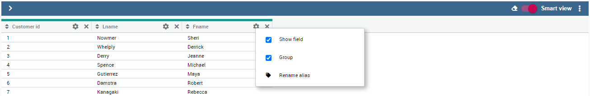
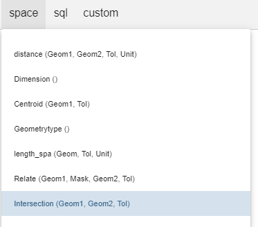
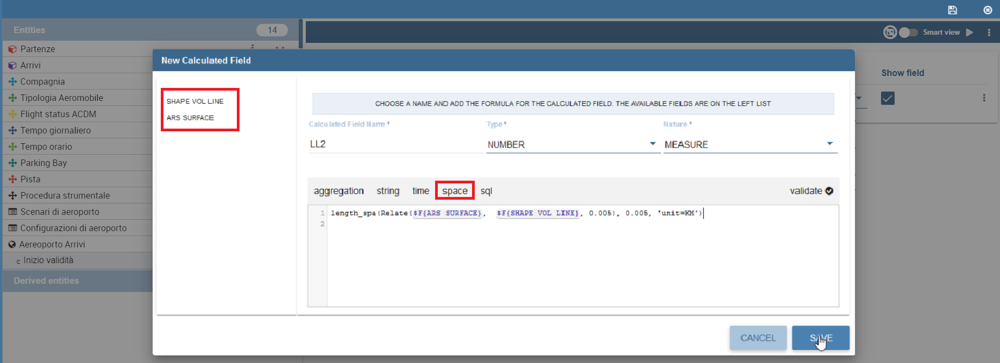

Free Inquiry
============

This detailed user guide is dedicated to the Qbe (acronym of Query By Example), a Free Inquiry instrument which empowers users with easy and free access to information via graphical interfaces.

Free Inquiry indicates the modus operandi of analysts and operational users that are usually seeking for business analysis that are not limited to pre-arranged lists of results. This method has a medium level of difficulty since it requires an adequate knowledge of data management and a structured organization of work.

QbE is the tool that lets you develop your free inquiry through an entirely graphical modality. Moreover, you can execute the query, check the results, export them and save the query for further use.

The material will be divided in two main sections. The first is dedicated to build queries in the Knowage Server environment, supposing that an expert user has already created a suitable business model to analize. In the second part, we will provide the user for the principal steps to build a proper business model through the Qbe designer available in Knowage Meta.

My first Query By Example
--------------------------

**QbE** (i.e., Query By Example) allows you to query (a subset of) a database through a high-level representation of the entities and relations. Its main characteristics are:

-  it has a rich end user GUI;
-  it allows to select attributes and set filters;
-  it does not require any knowledge of data structures;
-  it requires a semantic knowledge of data;
-  it is useful every time the free inquiry on data is more important than their graphical layout;
-  it leaves the management of results free;
-  it supports export capabilities;
-  it allows the repeatable execution of inquiries;
-  it works on a data domain with limitations.

Building a QbE query does not require any technical knowledge, but data domain knowledge: technical aspects, such as creating filters, aggregation and ordering criteria, are managed by a user-friendly graphical interface.

Let’s suppose that an administrator has built a business model and, consequently, released it on Knowage Server. This permits the user to access the model, query the available entities and save results as a dataset, usable later in other Knowage documents, such as cockpits.

In the following we discuss each step in detail, showing basic and advanced functionalities of the **QbE Editor**.

Query design and execution
~~~~~~~~~~~~~~~~~~~~~~~~~~~~~~

To open the QbE editor, access the **Models** section, available in the end user's **Workspace**. Then, simply click on the model icon to reach the QbE graphical interface.

In this paragraph we show how to build a simple query with the QbE editor.

.. figure:: media/image208.png

    QbE editor.

As shown in Figure 9.1 the window of the QbE editor contains the **Query designer**. In next sections we explain in detail all the areas of the **Query Designer**, the **Datamart Schema** tab, the query editor and a hidden tab dedicated to the management of queries, subqueries and parameters catalogue.

Datamart Schema
^^^^^^^^^^^^^^^^

Starting from the left side, the first Panel shows the searchable logical schema and the list of entities that can be queried to generate the query. Entities and relationships are represented in a tree structure, with user-defined names. Fields can be dragged from here and dropped onto the editor area.

In the top right corner of the panel you can find a small toolbar to configure the panel (e.g., expand, reduce) and to save changes made to the model (i.e. **Calculated Field** or **Range**), as shown below.

.. _datamartchematoolb:
.. figure:: media/image209.png

    Datamart schema toolbar.

There are two types of entities: *facts*, represented by a cube symbol.(i.e., the Sales fact 1998 entity) and *dimensions*, represented by a three-arrows symbol (i.e., the Product entity).

Each single entity is composed of a title, some attributes or measures and relationships with other entities. In particular, by exploding the content of an entity (i.e. Sales fact 1998 as in figure above), you may encounter the following elements:

- **measure**: it refers to fields associated with numeric data (e.g. number of sold items);
- **attribute**: it refers to fields that can be associated to a category (e.g. product category);
- **relation**: it refers to relationships or connections between two entities (e.g. relationship between the product sales fact and the product dimension).

Right clicking on an item in the tree, the contextual menu opens and shows some additional features:

- **Add calculated field**: to add a field that can be obtained via simple expressions combining existing fields and operators. Clicking on the contextual menu item, the wizard opens. Here you can combine fields with arithmetic and date functions. When you create a calculated field, you can add it to the model by clicking the **Save** button located in the top right corner of the panel. In addition, they can be used in queries. Calculated fields may also be managed by expert users via advanced functionalities, which will be described at the end of this section.
- **Edit field**: to rename a field.
- **Add/Edit Range**: to add or manage a range of values of the selected attribute (details are provided below).
- **Remove calculated field**: to remove a calculated field that was added before.

Let us see more in detail how to add calculated fields and ranges.

Calculated fields management
^^^^^^^^^^^^^^^^^^^^^^^^^^^^^^^^

You can create new calculated fields either inside a query or in the schema panel. Calculated fields defined in this second way can be saved for future use.

In order to define a new calculated field in the model, right click on the chosen entity and select **Add calculated field**. The wizard offers an editor in which you can define the calculated field.

To build a calculated field, you shall define:

- **Name**;
- **Type**: string, number or date;
- **Nature**: measure or attribute;
- **Formula**: you can click on the fields included in the item tree on the left (or drag and drop them) and build the formula.

An example is provided below.

.. figure:: media/image210.png

    Calculated field wizard.

There are two types of calculated fields that you can add to the QbE query: *standard* and *expert*. The *standard* ones are SQL expressions that are injected into the query. With the *expert* calculated fields (you should mark the **Expert user** box in the calculated fields wizard) you can build Groovy scripts, show images, add links. This second type of calculated field is computed after the query has been executed.

Range management
^^^^^^^^^^^^^^^^

It frequently happens that attributes of entities in a model have several different values. However, for the purpose of analysing data, it is often more useful to group those values into categories.

For example, let’s consider the customers’ age: often analysts do not aim to know the exact age of customers, but rather if they belong to a certain age range, e.g., young, adult and elderly. For this and similar cases, the **QbE Engine** is able to define and manage ranges in queries. To create a new range for an attribute you can:

- right click a field and click on **Add Range** in the contextual menu;
- right click on an entity (a cube or a dimension), click on **Add Range** , then in the wizard choose a field or define a calculated   expression, give a name to it and click on **Next**.

Both operations open the band creation wizard. Here click on **Add Band** to add a new instance and set the corresponding values and labels, as shown below.

.. figure:: media/image211.png

    Range instance creation.

You can set your band values by clicking on blue points under the Values List column to add them one by one, or by clicking on *[a,b]* under the **Limits** column to give only the end points of the interval. Then you can name your band by double clicking on the related field under the Name. Repeat the procedure to generate all the bands you need.

Finally, you can click on **Add Default**: this creates a new category called **Others**, which groups all values not belonging to already defined range intervals. At this point, click on **Finish**. The range appears as a node in the schema panel on the left. If you want to edit the range, click on **Edit Range**.

Query Editor
^^^^^^^^^^^^^^^^

The central panel provides a query editor, including three different tabs:

- **Select Fields**, containing the list of columns to be returned by the query;
- **Filters**, containing filtering conditions on fields values;
- **Filters on Groups**, containing filtering conditions on aggregated measures.

Elements from the datamart schema on the left can be dragged and dropped onto the query editor tabs. If a whole entity is selected, all its attributes are dropped into the editor. Alternatively, you can drag and drop single entity fields, as said before. To remove an attribute from the query editor, just click on the dedicated icon in the delete column or select the corresponding row and press **Delete** on your keyboard.

The expert user can visualize the query matching his selections by clicking on the **Generated query** button at the top right corner of the panel. This way it is possible to check the SQL generated by the graphical interface.

Let us now see in detail the three functionalities, listed above, which split the query editor area in different sections.

Select Fields
^^^^^^^^^^^^^^^^

This tab contains the list of columns to be returned by the query. To add a new attribute in this section, just click on a field in the schema panel tree or drag and drop it onto the query editor.

This panel is structured as a table: rows contain the attributes selected from the datamart schema, while columns include applicable functions as shown below.

    Select fields interface.

For each dropped item, the first two colums Entity and Field show the entity and the related attribute field respectively, and they are not editable.

.. figure:: media/image213.png

    **Select Fields** panel options.

With the other columns it is possible to:

- **Alias**: define aliases for fields: those aliases are shown as column headers in the result table;
- **Function**: in case of aggregation, define the aggregation function (e.g., **SUM**, **AVERAGE**, ...) on the non-grouped items;
- **Order**: define a sorting criteria: double click on the **Order** column to set the ordering criteria;
- **Group**: in case of aggregations, define the attribute that you want to group on (if you know SQL syntax, these attributes are the ones you should place in the GROUP BY clause);
- **Include**: indicate the column(s) to be included in the result (please notice that non-included attributes will not be returned by the query, but can be used in it, e.g. to apply grouping criteria);
- **Visible**: indicate whether a column shall be visible in the result (hidden attributes are used and returned by the generated query, but are not shown in the result table);
- **Filter**: add a filter criteria: clicking on this filter icon redirects you to the **Filters** tab;
- **Group Filter**: add a filter on groups: clicking on this filter icon redirects you to the **Filters on Groups** tab;

Pay attention to grouping options: if you want to define an aggregation function on a field (like, for instance, the **COUNT** of the sold items), you shall tick the Group checkbox for all the other fields dragged in the **Select Filters** panel without an aggregation function defined, otherwise you will get an SQL exception. The possible grouping functions are shown in the following figure.

.. figure:: media/image214.png

    Aggregation functions.

When you drag attributes belonging to entities that are linked through a relationship path, the QbE automatically resolves relationships between attributes (implicit join).

Moreover, multiple relationships may occur among entities. A typical example concerns dates. Suppose you have two relationships between the **Order** fact table and the **Time** dimension table: the first links the order_date column of the first table to the *time_id* column of the latter, while the second relationship joins the *shipping_date* column to the *time_id column*.

In this case, when dragging fields from both the **Order** entity and the **Time** entity you may want to specify which relationship will join the two tables: for instance, you may want to know the total number of orders according to the ordering month, the shipping month or for both. In all these situations, you can set the relationship to be used by clicking the **Relationships wizard** button at the top right corner of the panel. A pop up window opens where you can define the path to be used. Please refer to Multiple relationships section for all details regarding the disambiguation of relationships.

The select sub-section has a toolbar with additional functionalities summarized in Table below.

.. table::  Select fields toolbar options
      :widths: auto

      +-----------------------------------+-----------------------------------+
      |    Button                         | Description                       |
      +===================================+===================================+
      |    **Apply distinct clause**      | Remove duplicated rows from       |
      |                                   | results, if any                   |
      +-----------------------------------+-----------------------------------+
      |    **Hide non visible**           | Hide fields set as non visible in |
      |                                   | query results                     |
      +-----------------------------------+-----------------------------------+
      |    **Add calculated**             | Add a calculated field to the     |
      |                                   | query                             |
      +-----------------------------------+-----------------------------------+
      |    **Delete all**                 | Remove all rows from select area  |
      |                                   |                                   |
      +-----------------------------------+-----------------------------------+

Filters
^^^^^^^^

The **Filters** panel allows you to define filter criteria (WHERE clause). Similarly to the select area, filters are structured as a table: here rows contain filters, while columns represent the elements of the filter.

There are three ways to create a filter:

**Delete all** Remove all rows from the select area

- drag an attribute from the datamart schema to the **Filters** panel; 
- click the filter symbol on the row of an attribute in the **Select Fields** panel;
-  click the **New** button in the **Filters** panel.

To remove a filter from the query editor, select the left side of the row (multiple rows can be selected as well) and press the **Delete** button on your keyboard.

Filters are expressions of type:

                                      **Left operand + Operator + Right operand.**

Once you have selected the left operand, you can configure the filter by using the proper setting values on columns. In particular:

-  the **Filter Name** column contains the (editable) name of the filter while the Filter Description column contains an editable          description;
-  the **Left operand, Operator, Right operand** columns allow you to define filters according to the syntax defined above. Double        clicking in the Right operand column, a lookup function is activated to facilitate selection of values;
-  the **LeftOperandType** and **RightOperandType** columns define the types of operands;
-  the **Is for Prompt** column should be checked in order to insert dinamically the value for the parameters at execution time;
-  the **Boolean Connector** column shall be used to control the evaluation order of the different filters conditions;

Not all available features of the editor panel are visible by default. To customize the editor appearance, double click on the arrow located on each column header and select **Columns**.

Here you can decide which columns you want to appear in the editor.

.. figure:: media/image215.png

    Filter lookup for right operand selection.

.. figure:: media/image216.png

   Filter editor customization.

Note that more complex combinations of filters can be defined using the Expression Wizard, which you ca find selecting the **Exp Wizard** icon.

In the following table the possible types of filters in the QbE are summarized. The use of subqueries in filters is explained later in *Advanced QbE functionalities* paragraph.

.. table:: Possible combinations of filters in the QbE.
      :widths: auto

      +-------------+-------------+-------------+-------------+-------------+
      | Filter type | Left        | Operator    | Right       | Example     |
      |             | operand     |             | operand     |             |
      +=============+=============+=============+=============+=============+
      |    Basic    | Entity.attr | Any         | value       | Prod.family |
      |             | ibute       |             |             | =           |
      |             |             |             |             |             |
      |             |             |             |             | 'Food'      |
      +-------------+-------------+-------------+-------------+-------------+
      |    Basic    | Entity.attr | Any         | Entity.attr | Sales.sales |
      |             | ibute       |             | ibute       | >           |
      |             |             |             |             | Sales.cost  |
      +-------------+-------------+-------------+-------------+-------------+
      |  Parametric | Entity.attr | Any         | [parameter] | Prod.family |
      |             | ibute       |             |             | =           |
      |             |             |             |             |             |
      |             |             |             |             | [p_family]  |
      +-------------+-------------+-------------+-------------+-------------+
      |    Dynamic  | Entity.attr | Any         | prompt      | Prod.family |
      |             | ibute       |             |             | = ?         |
      +-------------+-------------+-------------+-------------+-------------+
      |    Value    | Entity.attr | In          | subquery    | Sales.custo |
      |    list     | ibute       |             |             | mer         |
      |    from     |             | /not in     |             | in subquery |
      |    subquery |             |             |             |             |
      +-------------+-------------+-------------+-------------+-------------+
      |    Single   | subquery    | < = >       | value       | Subquery >  |
      |    value    |             |             |             | 0           |
      |    from     |             |             |             |             |
      |    subquery |             |             |             |             |
      +-------------+-------------+-------------+-------------+-------------+

Filters on Groups
^^^^^^^^^^^^^^^^^^^^

By moving to the **Filters on Group** tab it is possible to define filters on aggretated measures.

Filters on groups are expressions of type:

                      **Aggr. function + Left operand + Operator + [Aggr. function] + Right operand,**

where the second [Aggr. function] is in this case optional. Example expessions could be, for instance, the filter “sum(sales) > 10000” or “sum(sales) > sum(costs)”.

Once you have selected the left operand, you can configure the filter using the proper setting values on columns. Columns are the same as those of the **Filters** tab, that is the ones just described in the previous section. There are, however, additional columns related to grouping functions. In particular, the two columns named **Function**, define he aggregation function to use on the left, or right, operand.

Query Preview
^^^^^^^^^^^^^^^

Once you are satisfied with your query or if you want to check the results, you can see the returned data by clicking the **Preview** button located in the top right corner of the panel. From there, you can go back to the **Designer** tab to modify the definition of the query or switch directly to the **Worksheet** designer to start building your graphical representation of the extracted data.

In case you have started the QbE editor directly from a model (that is, you have clicked on a model icon in the **My Data** > **Models** section) from here you can also click the **Save** button located in the top right corner of the page to save your query as a new dataset, reachable later from the **My Data**> **Dataset** section. Please note that this operation saves the *definition* of your query and not the snapshot of the resulting data. This means that every time you re-execute the saved dataset, a query on the database is performed to recover the updated data.

We highlight that when the save button is selected, a pop up shows asking you to fill in the datails, split in three tabs:

-  **Generic**, in this tab you set basic information for your dataset like its **Label**, **Name**, **Description** and **Scope**. The available values for the scope are **Public** and **Private**. If you choose **Public**, the dataset will be visible to all other users otherwise it won’t.
-  **Persistence**, you have the chance to persist your dataset, i.e., to write it on the default database. Making a dataset persistent may be useful in case dataset calculation takes a considerable amount of time. Instead of recalculating the dataset each time the    documents using it are executed, the dataset is calculated once and then retrieved from a table to improve performance. You can also decide to schedule the persistence operation: this means that the data stored will be update according to the frequency defined in the **scheduling** options.

Choose your scheduling option and save the dataset. Now the table where your data are stored will be persisted according to the settings provided.

-  **Metadata** It recaps the metadata associated to the fields involved in your query.

Advanced QbE functionalities	
~~~~~~~~~~~~~~~~~~~~~~~~~~~~~~

In this section we focus on advanced features, which can be comfortably managed by more expert users.

Spatial fields usage
^^^^^^^^^^^^^^^^^^^^^^^

The Qbe engine supports spatial queries through a set of operators (that return true or false) or a set of functions (these usually return a measure). This feature is although available only when the Location Intelligence (LI) license is possesed and when data are stored in Oracle 12c database. It also fundamental that the Business Model has to be tagged as geographical model. You can refer to Meta Web Section to have details on how to set the geographical option using Knowage Meta.

We suppose that we have a BM with geographical dimensions enabled (by a technical user). In this case the dimensions which has spatial fields are marked with the compass icon |image221|. Once the spatial dimension is expanded the fields are listed. Here there is no tracking symbol to distiguish between geographical attributes and the “normal” one. Therefore it is very important that the user is previously informed of which fields has geometrical properties.

.. |image221| image:: media/image217.png
   :width: 30

.. figure:: media/image218.png

    QbE spatial dimensions.

After a first selection of fields, it is possible to add calculated fields. Click on the **Add calculated** option available on the query editor area as shown by the blue arrow in figure below. Note that a wizard opens: you can use this editor to insert a new field obtained through a finite sequence of operation on the selected fields.The circles of the next figure underline that the fields on which you can operate are the one previously selected via drag and drop (or by a simple click on the field).

.. _calculfldwizardspt:
.. figure:: media/image219.png

    Calculated field wizard with spatial filters.

In addition note that the **Items** panel provides all the applicable functions sorted by categories:

-  arithmetic functions,
-  aggregation functions,
-  date functions,
-  spatial functions.

.. warning::
     **Take into account the Oracle function definition**
         
         It is important to refer to Oracle Documentation to know the arguments, in terms of type and number, of each function to                assure the right functioning and do not occur in errors while running the Qbe document.

The latter are available only in the presence of a geographical Business Model and *must* be properly applied to spatial attributes or measures. Figure below shows the list of the available spatial functions while next table helps you to use them properly, supplying the corresponding Oracle function name and a link to grab more specific information about usage, number of arguments, type and output.

    Spatial function list.
    
.. _linkoraclesptfnct:
.. table:: Link to Oracle spatial functions.
         :widths: auto
    
         +-----------------------+-----------------------+-----------------------+
         |    Function Name      | Oracle Function       | Link to Oracle web    |
         |                       |                       | pages                 |
         +=======================+=======================+=======================+
         |    **distance**       | SDO_GEOM.SDO_DISTANCE | `https://docs.oracle. |
         |                       |                       | com/cd/B19306_01/appd |
         |                       |                       | ev.                   |
         |                       |                       | 102/b14255/sdo_objgeo |
         |                       |                       | m.htm#i857957 <https: |
         |                       |                       | //docs.oracle.com/cd/ |
         |                       |                       | B19306_01/appdev.102/ |
         |                       |                       | b14255/sdo_objgeom.ht |
         |                       |                       | m#i857957>`__         |
         +-----------------------+-----------------------+-----------------------+
         |    **dwithin**        | SDO_WITHIN_DISTANCE   | `https://docs.oracle. |
         |                       |                       | com/cd/B19306_01/appd |
         |                       |                       | ev.                   |
         |                       |                       | 102/b14255/sdo_operat |
         |                       |                       | .htm#i77653 <https:// |
         |                       |                       | docs.oracle.com/cd/B1 |
         |                       |                       | 9306_01/appdev.102/b1 |
         |                       |                       | 4255/sdo_operat.htm#i |
         |                       |                       | 77653>`__             |
         +-----------------------+-----------------------+-----------------------+
         |    **dimension**      | GET_DIMS              | `https://docs.oracle. |
         |                       |                       | com/cd/B10501_01/appd |
         |                       |                       | ev.                   |
         |                       |                       | 920/a96630/sdo_meth.h |
         |                       |                       | tm#BABDEBJA <https:// |
         |                       |                       | docs.oracle.com/cd/B1 |
         |                       |                       | 0501_01/appdev.920/a9 |
         |                       |                       | 6630/sdo_meth.htm#BAB |
         |                       |                       | DEBJA>`__             |
         +-----------------------+-----------------------+-----------------------+
         |    **difference**     | SDO_GEOM.SDO_DIFFEREN | `https://docs.oracle. |
         |                       | CE                    | com/cd/B19306_01/appd |
         |                       |                       | ev.                   |
         |                       |                       | 102/b14255/sdo_objgeo |
         |                       |                       | m.htm#i857512 <https: |
         |                       |                       | //docs.oracle.com/cd/ |
         |                       |                       | B19306_01/appdev.102/ |
         |                       |                       | b14255/sdo_objgeom.ht |
         |                       |                       | m#i857512>`__         |
         +-----------------------+-----------------------+-----------------------+
         |    **centroid**       | SDO_GEOM.SDO_CENTROID | `https://docs.oracle. |
         |                       |                       | com/cd/B19306_01/appd |
         |                       |                       | ev.                   |
         |                       |                       | 102/b14255/sdo_objgeo |
         |                       |                       | m.htm#i860848 <https: |
         |                       |                       | //docs.oracle.com/cd/ |
         |                       |                       | B19306_01/appdev.102/ |
         |                       |                       | b14255/sdo_objgeom.ht |
         |                       |                       | m#i860848>`__         |
         +-----------------------+-----------------------+-----------------------+
         |    **geometrytype**   | GET_GTYPE             | `https://docs.oracle. |
         |                       |                       | com/cd/B10501_01/appd |
         |                       |                       | ev.                   |
         |                       |                       | 920/a96630/sdo_meth.h |
         |                       |                       | tm#i866821 <https://d |
         |                       |                       | ocs.oracle.com/cd/B10 |
         |                       |                       | 501_01/appdev.920/a96 |
         |                       |                       | 630/sdo_meth.htm#i866 |
         |                       |                       | 821>`__               |
         +-----------------------+-----------------------+-----------------------+
         |    **union**          | SDO_GEOM.SDO_UNION    | `https://docs.oracle. |
         |                       |                       | com/cd/B19306_01/appd |
         |                       |                       | ev.                   |
         |                       |                       | 102/b14255/sdo_objgeo |
         |                       |                       | m.htm#i857624 <https: |
         |                       |                       | //docs.oracle.com/cd/ |
         |                       |                       | B19306_01/appdev.102/ |
         |                       |                       | b14255/sdo_objgeom.ht |
         |                       |                       | m#i857624>`__         |
         +-----------------------+-----------------------+-----------------------+
         |    **length**         | SDO_GEOM.SDO_LENGTH   | `https://docs.oracle. |
         |                       |                       | com/cd/B19306_01/appd |
         |                       |                       | ev.                   |
         |                       |                       | 102/b14255/sdo_objgeo |
         |                       |                       | m.htm#i856257 <https: |
         |                       |                       | //docs.oracle.com/cd/ |
         |                       |                       | B19306_01/appdev.102/ |
         |                       |                       | b14255/sdo_objgeom.ht |
         |                       |                       | m#i856257>`__         |
         +-----------------------+-----------------------+-----------------------+
         |    **relate**         | SDO_GEOM.RELATE       | `https://docs.oracle. |
         |                       |                       | com/cd/B19306_01/appd |
         |                       |                       | ev.                   |
         |                       |                       | m.htm#BGHCDIDG <https:|
         |                       |                       | //docs.oracle.com/cd/ |
         |                       |                       | B19306_01/appdev.102/ |
         |                       |                       | b14255/sdo_objgeom.ht |
         |                       |                       | m#BGHCDIDG>`__        |
         +-----------------------+-----------------------+-----------------------+

To apply one function click on the function name and the “Operands selection window” wizard opens. Figure below shows an example for the funtion “Distance”. Fill in all boxes since all fields are mandatory.

.. figure:: media/image221.png

    Operands selection window.

Finally you can use spatial function to add a calculated field, as shown below.

   
    Example of added calculated field using a spatial function.

As well as calculated fields it is possible to filter on spatial fields using specific geometric operators. Once again we report in Figure below the available geometric operator (you can find them scrolling the panel to the bottom) and report the link to the Oracle web pages in the next table.

.. figure:: media/image223.png

    Spatial filters.

See the table below:
   
.. _linkoraclefltrfnct:
.. table:: Link to Oracle filter functions.
         :widths: auto

         +-----------------------+-----------------------+-----------------------+
         |    Function Name      | Oracle Function       | Link to Oracle web    |
         |                       |                       | pages                 |
         +=======================+=======================+=======================+
         |    **touches**        | SDO_TOUCH             | `https://docs.oracle. |
         |                       |                       | com/cd/B19306_01/appd |
         |                       |                       | ev.                   |
         |                       |                       | 102/b14255/sdo_operat |
         |                       |                       | .htm#BGEHHIGF <https: |
         |                       |                       | //docs.oracle.com/cd/ |
         |                       |                       | B19306_01/appdev.102/ |
         |                       |                       | b14255/sdo_operat.htm |
         |                       |                       | #BGEHHIGF>`__         |
         +-----------------------+-----------------------+-----------------------+
         |    **filter**         | SDO_FILTER            | `https://docs.oracle. |
         |                       |                       | com/cd/B19306_01/appd |
         |                       |                       | ev.                   |
         |                       |                       | 102/b14255/sdo_operat |
         |                       |                       | .htm#BJAFBCFC <https: |
         |                       |                       | //docs.oracle.com/cd/ |
         |                       |                       | B19306_01/appdev.102/ |
         |                       |                       | b14255/sdo_operat.htm |
         |                       |                       | #BJAFBCFC>`__         |
         +-----------------------+-----------------------+-----------------------+
         |    **contains**       | SDO_CONTAINS          | `https://docs.oracle. |
         |                       |                       | com/cd/B19306_01/appd |
         |                       |                       | ev.                   |
         |                       |                       | 102/b14255/sdo_operat |
         |                       |                       | .htm#BGEHCFDH <https: |
         |                       |                       | //docs.oracle.com/cd/ |
         |                       |                       | B19306_01/appdev.102/ |
         |                       |                       | b14255/sdo_operat.htm |
         |                       |                       | #BGEHCFDH>`__         |
         +-----------------------+-----------------------+-----------------------+
         |    **covered by**     | SDO_COVEREDBY         | `https://docs.oracle. |
         |                       |                       | com/cd/B19306_01/appd |
         |                       |                       | ev.                   |
         |                       |                       | 102/b14255/sdo_operat |
         |                       |                       | .htm#BGEHEAEJ <https: |
         |                       |                       | //docs.oracle.com/cd/ |
         |                       |                       | B19306_01/appdev.102/ |
         |                       |                       | b14255/sdo_operat.htm |
         |                       |                       | #BGEHEAEJ>`__         |
         +-----------------------+-----------------------+-----------------------+
         |    **inside**         | SDO_INSIDE            | `https://docs.oracle. |
         |                       |                       | com/cd/B19306_01/appd |
         |                       |                       | ev.                   |
         |                       |                       | 102/b14255/sdo_operat |
         |                       |                       | .htm#BGEFABDH <https: |
         |                       |                       | //docs.oracle.com/cd/ |
         |                       |                       | B19306_01/appdev.102/ |
         |                       |                       | b14255/sdo_operat.htm |
         |                       |                       | #BGEFABDH>`__         |
         +-----------------------+-----------------------+-----------------------+
         |    **covers**         | SDO_COVERS            | `https://docs.oracle. |
         |                       |                       | com/cd/B19306_01/appd |
         |                       |                       | ev.                   |
         |                       |                       | 102/b14255/sdo_operat |
         |                       |                       | .htm#BGEGIJFB <https: |
         |                       |                       | //docs.oracle.com/cd/ |
         |                       |                       | B19306_01/appdev.102/ |
         |                       |                       | b14255/sdo_operat.htm |
         |                       |                       | #BGEGIJFB>`__         |
         +-----------------------+-----------------------+-----------------------+
         |    **overlaps**       | SDO_OVERLAPS          | `https://docs.oracle. |
         |                       |                       | com/cd/B19306_01/appd |
         |                       |                       | ev.                   |
         |                       |                       | 102/b14255/sdo_operat |
         |                       |                       | .htm#BGEDACIF <https: |
         |                       |                       | //docs.oracle.com/cd/ |
         |                       |                       | B19306_01/appdev.102/ |
         |                       |                       | b14255/sdo_operat.htm |
         |                       |                       | #BGEDACIF>`__         |
         +-----------------------+-----------------------+-----------------------+
         |    **equals to**      | SDO_EQUAL             | `https://docs.oracle. |
         |                       |                       | com/cd/B19306_01/appd |
         |                       |                       | ev.                   |
         |                       |                       | 102/b14255/sdo_operat |
         |                       |                       | .htm#BGEBCEJE <https: |
         |                       |                       | //docs.oracle.com/cd/ |
         |                       |                       | B19306_01/appdev.102/ |
         |                       |                       | b14255/sdo_operat.htm |
         |                       |                       | #BGEBCEJE>`__         |
         +-----------------------+-----------------------+-----------------------+
         |    **intersects**     | SDO_ANYINTERACT       | `https://docs.oracle. |
         |                       |                       | com/cd/B19306_01/appd |
         |                       |                       | ev.                   |
         |                       |                       | 102/b14255/sdo_operat |
         |                       |                       | .htm#BGEJHDGD <https: |
         |                       |                       | //docs.oracle.com/cd/ |
         |                       |                       | B19306_01/appdev.102/ |
         |                       |                       | b14255/sdo_operat.htm |
         |                       |                       | #BGEJHDGD>`__         | 
         +-----------------------+-----------------------+-----------------------+

Temporal dimension
^^^^^^^^^^^^^^^^^^^^

The Qbe engine on Knowage Server is endowed with some temporal functionalities that allow the final user to easily perfom queries based on time.

We highlight that the new features are available only if the model has at least one temporal dimension. The latter must be defined while creating the model using Knowage Meta.

.. warning::
      
    **Define first the temporal dimension on Knowage Meta**
      
      To have a temporal dimension that can be used in the Qbe interface an expert user must enable it first on the model using Knowage Meta. Use the **property view** to set/change the type of the dimension as shown in the following figure. Refer to *Meta Web* chapter to learn how to use Knowage Meta.

The temporal dimension can have one or more hierarchies. Only one of these can stay active and that is the one used by the query code. Figure below shows that a temporal dimension can have one or more hierarchies. In the case of more hierarchies the user can see which is the one set by default just exploring the dimension: the bold highlighted hierarchy is the primary. On the other hand the user can change the default choice by right-clicking on the target dimension hierarchy and selecting “\ *Set as Default Hierarchy*\ ”.

.. _tempdimensmeta:
.. figure:: media/image224_bis.png

    Temporal dimension definition on Meta.
   
.. figure:: media/image22526.png

    Temporal hierarchy visualization (Left). Changing hierarchies (Right).

Furthermore there is the possibility to set a “time” dimension as Figure below displays.

.. figure:: media/image227.png

    Time dimension.

The user can use the elements of each dimension as attributes in the “Select” instance. Note that if one drags and drops of element to be used as a filter also its parent nodes will be brought too. The following figure exhibits one example. Remember to assign a value to each parent node before you run the query.

.. figure:: media/image228.png

    Filter on an element means to filter also on its parent nodes.

Moreover, selecting the filters tab, you can use specific filters clicking on the button “Add Temporal” as shown in figure below (Left). The action opens the pop up displayed in next figure (Right).

.. _iaddtempfiltersleftright:
.. figure:: media/image22930.png

    Add temporal filters (Left). List of available elements (Right).

In the list of available elements is made up of:

-  filters defined by the admin through the TimeSpan GUI;
-  system filters manageable through a table;
-  the element “Current year”;
-  the element “Current month”;
-  the element “Current day”;
-  the element “Last Period” for which you must indicate the number of years.

Inside the section “Select” you can use the temporal operators directly on attributes.

.. figure:: media/image231.png

    Apply operators directly on attributes.

For each function there is the possibility to assing a value to a parameter that indicates how long the function will act. We now describe the working principles of temporal functions.

The PARALLEL_YEAR function.
++++++++++++++++++++++++++++

This function allows to manage and study measures on parallel periods. For example if one wants to analize the product sales of the current year and, at the same time, those of the previuos year. The following are some possible use cases:

-  no temporal filter is set and the temporal functions are applied directly on measures. In this case the current year is taken as        default value. When the functions are applied on measures the user must apply them on ALL measures in order to have a coherent          result.

1. In the case the user wants the sum of a measure relative to current year, he/she must drag and drop the measure in the “select          fields” panel and launch the temporal function PARALLEL_YEAR passing 0 as value. See Figure below as example.

.. figure:: media/image232.png

    PARALLEL_YEAR example: sum of a measure referred to a specific time year.

2. In the case the user wants to compare the sales of 2016 with those of the previous year. He/she has to drag twice the measure inside    the “select fields” panel and indicate the temporal function “PARALLEL_YEAR” using 0 and 1 as value parameters.

.. figure:: media/image233.png

    PARALLEL_YEAR example: comparing data with different time interval.

-  Suppose now that the analysis requires to compare the unit sold from January to March of the current year with that of the same time    interval of the previous one. In this instance the user must set the temporal filter which will be the point of reference.

.. figure:: media/image234.png

    PARALLEL_YEAR example: setting the temporal filter.

Remember that the temporal filter uses the “IN” operator.

-  In the case one wants to compare the sales per month of the current year with the ones of the parallel year, the user should add the    month field in the select clause (picking it up from the used temporal hierarchy) and group by it.

.. figure:: media/image236.png

    Comparing results with those of the parallel year.

An example of data visualization is given in the two figures below.

.. figure:: media/image237.png

    Comparing results with those of two parallel years.

.. figure:: media/image238.png

    Comparing results with those of three parallel years.

The LAST\ \_\ YEAR function
++++++++++++++++++++++++++++++++

This function allows the user to sum a measure referring to last period data. If the temporal filter isn’t set, the engine takes the current year by default, otherwise the chosen one.

-  In our example in the two figures below the period is the year. Here we compare last-year sold products to the sum of those      sold in last two years.

.. figure:: media/image239.png

    LAST_YEAR function.

.. figure:: media/image240.png

    Comparing LAST_YEAR results.
   
-  Referring to figures below give an example of how to define a time reference, for instance 2015. In this case I pass      2015 to the filter.

.. figure:: media/image241.png

    LAST_YEAR function example: changing the reference year.

.. figure:: media/image243.png

    LAST_YEAR function example: output of changing the reference year.
   
-  In case the user wants to inspect the evolution of sales per month of the current year comparing them with those of last year plus      the current. It is sufficient to add the month in the “selected fields” area and the measure “unit sold” where the LAST_YEAR            function is set on 0 or 1. The two following figures show an example.

.. figure:: media/image244.png

    LAST_YEAR function example: last-year sold products compared to the last-twoyear ones.

.. figure:: media/image245.png

    LAST_YEAR function example: output of last-year sold products compared to the last-two-year ones.

Note that the operator allows to visualize the sum of sales upon 2 years per month. In other words, LAST_YEAR(1) set to the month level starts the progression from the aggregated value of 2015 to which it adds the sales of 2016.

The LAST\ \_\ MONTH function
+++++++++++++++++++++++++++++++++

This operator is very similar to the previous one. In this case the reference time period is the month. Remember that if the user does not specify the name of the referenced month the system will take the current one by default.

-  The user wants to count the sales of last three months.

.. figure:: media/image246.png

    LAST_MONTH function example: setting time reference.

.. figure:: media/image247.png

    LAST_MONTH function example: setting time reference.

-  Figure below shows how to aggregate data up to last three months per each month of the current year. Remember to add the month in the section “selected fields”. Therefore, inserting the month in the select clause the user obtains a projection on current year of sales of last 3 months per each month. Note that data are related to the current year, namely there is no shift to the passed one. Pay attention to the fact that if one month is missing the system does not notice it and return a sum relative to a bigger time period.

.. figure:: media/image248.png

    LAST_MONTH function example: sum up to last 3 months.
    
.. figure:: media/image249.png

    LAST_MONTH function example: sum up to last 3 months output.

-  The same query can be performed cosidering a specific year. In the following figures year 2015 has been selected.
  
.. figure:: media/image250.png

    LAST_MONTH function example: sum up to last 3 months where year is 2015.
   
.. figure:: media/image252.png

    LAST_MONTH function example: output when one sums up to last 3 months output where year is 2015.

-  If the user wants to compare sales per month to those of the previuos month summed to the current one. Results in the following figures reflect this selection.

.. figure:: media/image253.png

    LAST_MONTH function example: sales per month aganst the sum of current and previous month sales.

.. figure:: media/image254.png

    LAST_MONTH function example: results of sales per month aganst the sum of current and previous month sales.

The YTD function
++++++++++++++++

This operator aggregate the measure of the first day of the year up to the execution date (currentDay). If the user sets temporal filters the YTD function must refer to the filter. The chosen day will be used as reference by the function. For example, if the user sets “15/03/2016” as reference day, the function sums starting from the first of January up to the 15th of March (2016). Observe that if the filter is monthly the engine will take the last day of the month, while if it is yearly the engine will take the whole year. If the user inserts a temporal element as aggregation function the measure must be aggregated progressively.

-  Below shows the case in which the user wants to count the sales from the beginning of the year up to now.

.. figure:: media/image255.png

    YTD function example: to count the sales from the beginning of the year up to now.
   
.. figure:: media/image256.png

    YTD function example: number of sales from the beginning of the year up to now.

-  Below shows the case in which the user wants to count the sales from the beginning of the year up to the end      of March.

.. figure:: media/image257.png

    YTD function example: to count the sales from the beginning of the year up to the end of March.
   
.. figure:: media/image258.png

    YTD function example: to count the sales from the beginning of the year up to the end of March.

-  The following figure refers to the case where the user wishes to sum 2015 sales considering the day in which the query is executed but of the previuos year.

.. figure:: media/image259.png

    YTD function example: sum 2015 sales considering the day in which the query is executed but of the previuos year.

-  The following figure refers instead to the case where the user wishes to sum 2015 sales of first 3 months of 2015.

.. figure:: media/image260.png

    YTD function example: sales summed up to the first 3 months of 2015.

-  In the following figures the user is comparing the unit sold from the beginning of the year with those of the previuos year.      The engine considers the day of query execution as end of the time period.

.. figure:: media/image262.png

    YTD function example: comparing the unit sold from the beginning of the year with those of the previuos year.

.. figure:: media/image263.png

    YTD function example: output when comparing the unit sold from the beginning of the year with those of the previuos        year.

-  Figures below shows the instance when the user wants to see the sum of unit sold each month after having added the month      field in the select clause.

.. figure:: media/image264.png

    YTD function example: sum of unit sold each month after having added the month field in the select clause.

.. figure:: media/image265.png

    YTD function example: output when one sums unit sold each month after having added the month field in the select          clause.

The MTD function
++++++++++++++++

The MTD function follows the same logic as the YTD function but using the month.

-  Figure below shows the case in which the user wants to check the unit sold during the current month.

.. figure:: media/image266.png

    MTD function example: check the unit sold during the current month.

-  The following figures the user wants to check the aggregated sales of last 7 months, current (relative to the execution        time) month included.

.. figure:: media/image267.png

     MTD function example: aggregated sales of last 7 months.
   
.. figure:: media/image268.png

     MTD function example: output of the aggregated sales of last 7 months.

-  Another case is shown in figures below where sales are aggregated on current month plus the previuos one, relative to    the current year (referring to the query execution time).

.. figure:: media/image269.png

    MTD function example: sales are aggregated on current month plus the previuos one, relative to the current year.

.. figure:: media/image270.png

    MTD function example: output when sales are aggregated on current month plus the previuos one, relative to the current year (referring to the query execution time) for the present year.

-  Figures below shows a user that is summing the sales of current month

.. figure:: media/image271.png

    MTD function example:sales of current month for the present year.

.. figure:: media/image272.png

    MTD function example: output of the sales of current month for the present year.

-  The following figures shows as a user can compare sales of aggregated months (up to the current) to the current one.

.. figure:: media/image273.png

    MTD function example:sales of current month for the present year.
   
.. figure:: media/image274.png

     MTD function example: output of the sales of current month for the present year.

-  Below shows a case very similar to the previous one. In this case the next month is added to the sum.

.. figure:: media/image275.png

    MTD function example: sum of sales of months up to now plus next month.

.. figure:: media/image276.png

    MTD function example: output when one sums sales of months up to now plus next month.

-  The following figures shows a case very similar to the previous one. In this case the reference year is specified through a      filtering condition.

.. figure:: media/image277.png

    MTD function example: sum of sales of months up to now plus next month for a different year.

.. figure:: media/image278.png

    MTD function example: output when one sums sales of months up to now plus next month for a different year.

Catalogues
++++++++++++++++
 
A hidden panel is activated once you click on the arrow on the right side of the QbE editor, right under the **Preview** button. This panel contains two elements:

-  the catalogue of queries (at the top);
-  the list of analytical drivers linked to the QbE document (bottom).

The catalogue of queries is the list of all queries defined in the QbE document, while the lower panel lists all analytical drivers linked to the QbE document.

Queries catalogue and subqueries
++++++++++++++++++++++++++++++++

Several queries can be built over the same QbE datamart. The catalogue lists all saved queries on the current datamart. The base query that we are creating in the query editor appears with a default name (query-q1): to rename it, simply double click on the query item in the catalogue tree.

To create a new query, click the icon |image279|. The query appears in the catalogue at the same level as the base query. Using the query editor you can create the query and save it.

.. |image279| image:: media/image279.png
   :width: 30

The **QbE Engine** also supports the definition and usage of subqueries similarly to the SQL language. As a result, you can define a subquery and use it within a filter in association to the in/not in operator, as shown in Figure below. To create a new subquery, which can be used as a filter inside the main query, click on |image280|. The query appears in the catalogue as a child node of the base query.

.. |image280| image:: media/image280.png
   :width: 30

.. figure:: media/image281.png

    QbE query: use of a subquery in a filter.

Once defined the main query and the filter that contains the subquery, go to the **Query Catalogue** panel and click on |image282| . The query appears in the catalogue as a child node of the base query.

.. |image282| image:: media/image282.png
   :width: 65

To use the sub-query inside the main query, simply drag and drop it into the columns corresponding to the left or right operand of the filter and set the type of operand (**IN** or **NOT IN**). Now the subquery is used to provide values within the filter, in a similar way to SQL subqueries. 

Multiple relationships
^^^^^^^^^^^^^^^^^^^^^^^^^

The QbE includes a specific feature to thoroughly manage relationships among entities: users can create join paths from one table to another to be used in case of ambiguity. Let’s see in detail how it works through an example.

.. figure:: media/image283.png

    Relationships ambiguity - Schema.

Using the schema and data model represented in figure above, suppose you have a model with the following relationships:

-  **Store** - **Region**;
-  **Customer** - **Region**;
-  **Sales Fact** - **Store**;
-  **Sales Fact** - **Customer**.

Ambiguity arises when attributes coming from the various tables are dragged and dropped into the query that is build in the QbE, as in Figure below. In this case, in order to identify the items sold by region, you may have one of the following join relationships:

- **Sales Fact - Customer - Region**,
- **Sales Fact - Store - Region**,

.. figure:: media/image284.png

    Relationships ambiguity - Query definition.

By clicking on the **Relationship Wizard** button in the top right corner of the query editor a pop-up window appears, where users can define the path as shown below.

.. figure:: media/image285.png

    Relationship wizard.

The images of figure above show the double relationship between **Sales Fact** and **Region**, specifically:

-  relationship between **Sales Fact** and **Customer**;
-  relationship between **Sales Fact** and **Store**.

At this point, you can modify the relationship so as to eliminate ambiguity: for instance, if you wish to view the region related to a specific customer, first select the **Region** entity in the **Entity** panel on the left and double click the correct path in the panel on the right (the correct path and only the correct path has to be green-colored to be correctly selected).

Remember to repeat this operation for all the entities listed in the **Entity** panel: now select the **Sales Fact** table and the correct path. If a wrong path is selected (green background), double click on the corresponding row to de-select it. The new configuration is shown below.

.. figure:: media/image286.png

    Relationship Wizard - Choosing paths.

Once you are done, you can check the SQL code generated by the QbE query by clicking the Generated Query button. The relationship between Customer and Region is highlighted in bold, as shown below.

.. figure:: media/image287.png

    Generated query.

Aliases and relationships
^^^^^^^^^^^^^^^^^^^^^^^^^^

If the data model includes various relationships between two tables, the QbE allows users to manage them using aliases. 

To describe this feature, it is worth using an example. Suppose there is a double relationship between **Promotion** and **Time by Day** entities (see the figure below)).

.. _doublerelationship:
.. figure:: media/image288.png

    Double relationships.

The two relationships concern the start date and end date of the promotion. As shown in the figure above, this information can be retrieved from the QbE graphical interface. The **Promotion** entity includes two relationships (see points 1 and 2 in the figure), whose tooltip returns information on how the relationship is structured (see point 3).

If you wish to see the list of promotions with a specific start date and end date, it is necessary to drag and drop the **Name** of the promotion (from the **Promotion** entity) and the **The Date** field (from the **Time by Day** entity) two times by changing the alias, as well as the name of the column to be visualized in the results of the query (see points 4 and 5). 

By executing the query, you will see that in the absence of specific indications, the system selects two relationships (path) at random.

As mentioned in the previous paragraph, by opening the relationships wizard, users can see the list of entities relating to various paths, as well as the list of paths involving various entities. If you wish to use both relationships (end date and start date), select both as shown below. The tooltip shows the complete path using an intuitive tree layout.

.. figure:: media/image289.png

    Relationship wizard - Double relationships (I).

Once the relationships are selected in both entities, click on **Apply**.

The window shown below will appear.

.. figure:: media/image290.png

    Relationship wizard - Double relationships (II).

It includes three sections:

1. List of aliases: the first column on the left contains the different entity fields;
2. List of fields associated to the entities: here you can set the associations between aliases and entity fields;
3. List of fields: the first column on the right contains the aliases that you previously defined in the query, and corresponds to the    columns that you expect to be shown in the resulting table.

To distinguish the fields during the execution of the query, it is necessary to identify all the fields involved in the query (included in the third section List of fields) with the aliases of the entities that contain them (included in the first section List of aliases). 

In this case, select the **Time by day (rel BR\ \_\ Promotion\ \_..)** entity in the first column, then drag and drop the **End Date** field from the third column to the one in the middle. Repeat the same with the **Time by day (rel: t2\ \_\ fk)** entity and the **Start date** field.

The results are shown below. To check whether the association was correctly set, you can refer to the relationship specified in the tooltip.

.. figure:: media/image291.png

    Relationship wizard - Double relationships (III).

Click **Finish** and check the SQL code clicking **Generated Query**. Figure below shows the desired result.

.. figure:: media/image292.png

    Double relationship preview.

