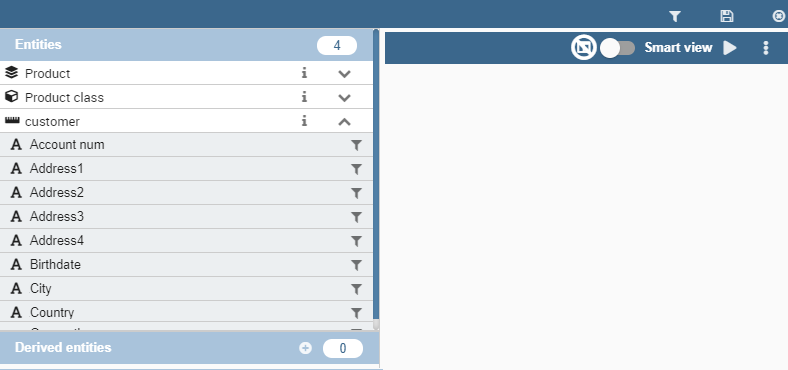
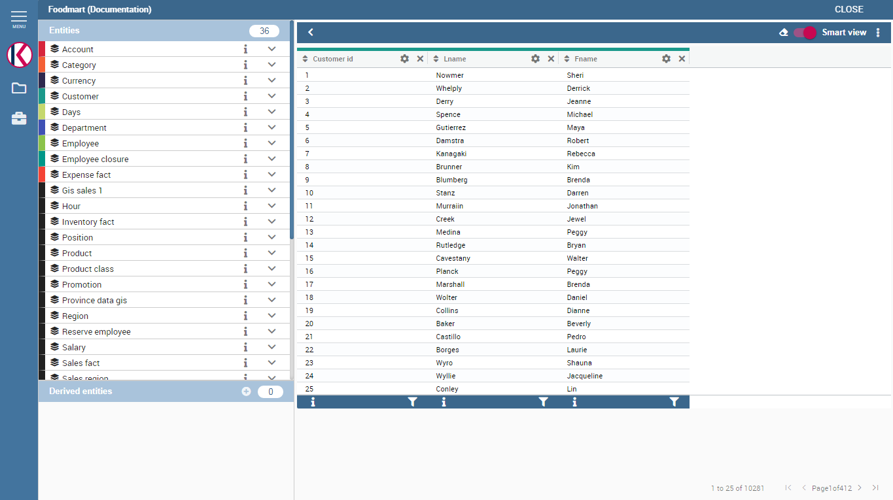
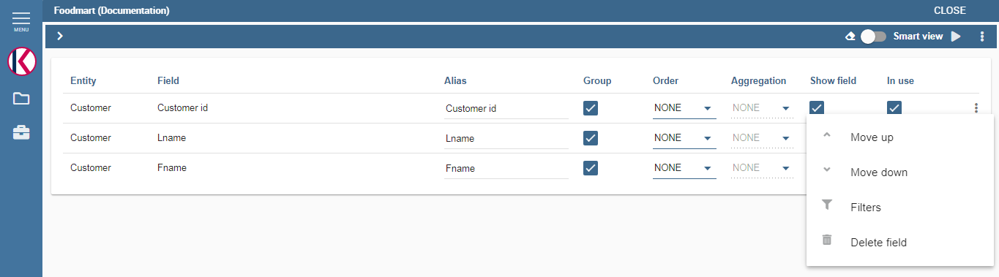
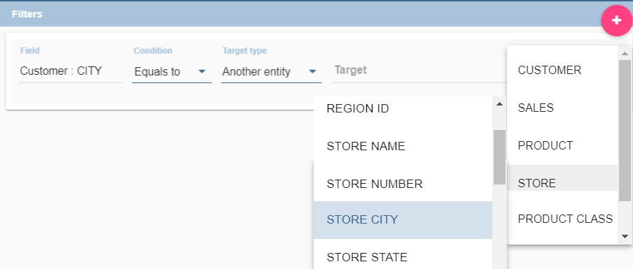
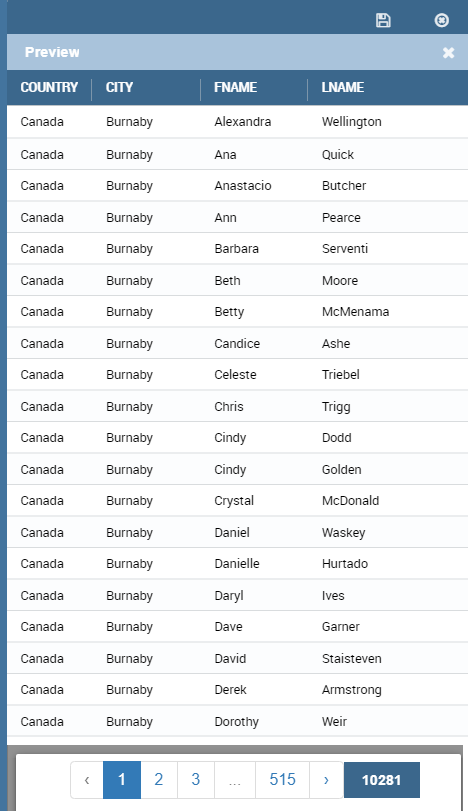
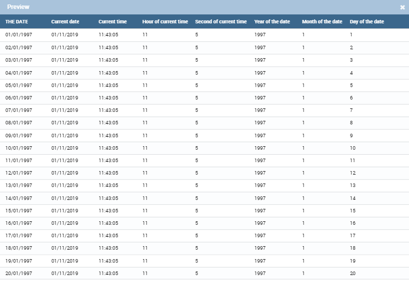
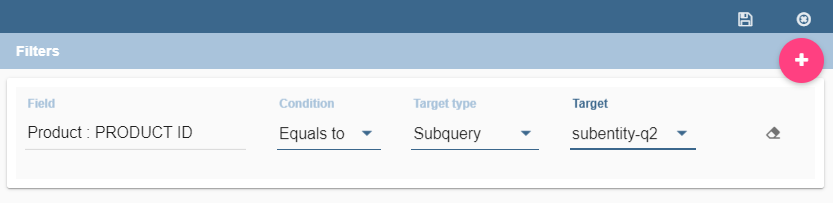
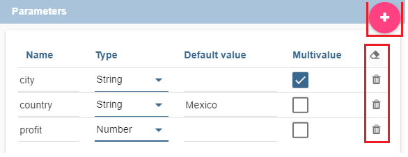

Free Inquiry
============

This detailed user guide is dedicated to the Qbe (acronym of Query By Example), a Free Inquiry instrument which empowers users with easy and free access to information via graphical interfaces.

Free Inquiry indicates the modus operandi of analysts and operational users that are usually seeking for business analysis that are not limited to pre-arranged lists of results. This method has a medium level of difficulty since it requires an adequate knowledge of data management and a structured organization of work.

QbE is the tool that lets you develop your free inquiry through an entirely graphical modality. Moreover, you can execute the query, check the results, export them and save the query for further use.

The material will be divided in two main sections. The first is dedicated to build queries in the Knowage Server environment, supposing that an expert user has already created a suitable business model to analyse. In the second part, we will provide the user for the principal steps to build a proper business model through the Qbe designer available in Knowage Meta.

My first Query By Example
--------------------------

**QbE** (i.e., Query By Example) allows you to query (a subset of) a database through a high-level representation of the entities and relations. Its main characteristics are:

-  it has a rich end user GUI;
-  it allows to select attributes and set filters;
-  it does not require any knowledge of data structures;
-  it requires a semantic knowledge of data;
-  it is useful every time the free inquiry on data is more important than their graphical layout;
-  it leaves the management of results free;
-  it supports export capabilities;
-  it allows the repeatable execution of inquiries;
-  it works on a data domain with limitations.

Building a QbE query does not require any technical knowledge, but data domain knowledge: technical aspects, such as creating filters, aggregation and ordering criteria, are managed by a user-friendly graphical interface.

Let’s suppose that an administrator has built a business model and, consequently, released it on Knowage Server. This permits the user to access the model, query the available entities and save results as a dataset, usable later in other Knowage documents, such as cockpits.

In the following we discuss each step in detail, showing basic and advanced functionalities of the **QbE Editor**.

Query design and execution
~~~~~~~~~~~~~~~~~~~~~~~~~~~~~~

To open the QbE editor, access the **Models** section, available in the end user's **Workspace**. Then, simply click on the model icon to reach the QbE graphical interface.

In this paragraph we show how to build a simple query with the QbE editor.

    QbE editor.

As shown in Figure 9.1 the window of the QbE editor contains the **Query designer**. In next sections we explain in detail all the areas of the **Query Designer**, the **Datamart Schema** tab, the query editor and a hidden tab dedicated to the management of queries, subqueries and parameters catalogue.

Datamart Schema
^^^^^^^^^^^^^^^^

Starting from the left side:
	The upper Panel shows the searchable logical schema and the list of entities that can be queried to generate the query. Entities are represented in a tree structure, with user-defined names. Field can be added in the query (right area) clicking on it.
	The lower Panel shows list of created subqueries in a tree structure where children are fields of subquery

There are few types of entities: *facts*, represented by a cube symbol.(i.e., the Sales entity), *dimensions*, represented by a four-arrows symbol (i.e., the Product entity), *geographical dimension*, represented by *earth* icon.

Each single entity is composed of a title, some attributes or measures and relationships with other entities. Relations are available clicking on *i* icon of one entity. In particular, by exploding the content of an entity (i.e. Sales as in figure above), you may encounter the following elements:

- **measure**: it refers to fields associated with numeric data (e.g. UNIT SALES);
- **attribute**: it refers to fields that can be associated to a category (e.g. PRODUCT ID);
- **relation**: it refers to relationships or connections between two entities (e.g. relationship between the sales and the product dimension).

.. figure:: media/image300.png
	
	Relations of one entity.

There are two available views: smart and advance. When qbe is opened by default user will see smart view. Clicking on one filed of one entity that field will be added in the query and user will se executed query in imidiately. 

	
	Smart view.

User can switch to advance view clicking on Smart view in top right corner. User can continue adding fields in the query but without seeing result. 

.. figure:: media/advanceView.png
	
	Advance view

Let us see more in detail how to add calculated fields.

Calculated fields management
^^^^^^^^^^^^^^^^^^^^^^^^^^^^^^^^

You can create new calculated fields inside a query. In advance view there will be available option for creating **calculated fields**. Clicking on **Calculator** icon **Calculated field wizard** will open.

To build a calculated field, you shall define:

- **Name**;
- **Type**: string, number or date;
- **Nature**: measure or attribute;
- **Formula**: you can click on the fields included on the left and build the formula.

An example is provided below.

.. figure:: media/calculateFieldWizard.png

    Calculated field wizard.

Query Editor
^^^^^^^^^^^^^^^^

Central panel provides a query editor. As we already mantioned, there are two available views: smart and advance.

Elements from the datamart schema on the left can be added into the query editor. To remove an field from the query editor, just click on the x icon, or if advance view is opened, clicking on three dots icon, **Delete field** is available.

Selected Fields
^^^^^^^^^^^^^^^^

Central panel contains the list of columns to be returned by the query. To add a new field in this section, just click on a field in the schema panel tree.

This panel is structured as a table: columns contain the fileds selected from the datamart schema. Every column has **gear icon** on the top (smart view), that is providing applicable functions as shown below, plus icon for deleting field form query and for ordering.

.. figure:: media/image212.png

    Select fields interface in smart view.

In the advance view, every row include applicable functions as shown below, plus clicking on **three dots icon** there are few more functions.

	Select fields interface in advance view.

With available functions it is possible to:

- **Alias**: define aliases for fields: those aliases are shown as column headers in the result table; it is editable
- **Function**: in case of aggregation, define the aggregation function (e.g., **SUM**, **AVERAGE**, …) on the non-grouped items;
- **Order**: define a sorting criteria: double click on the **Order** column to set the ordering criteria;
- **Group**: in case of aggregations, define the attribute that you want to group on (if you know SQL syntax, these attributes are the ones you should place in the GROUP BY clause);
- **Visible**: indicate whether a column shall be visible in the result (hidden attributes are used and returned by the generated query, but are not shown in the result table);
- **Filter**: add a filter criteria: clicking on this filter icon redirects you to the **Filters** tab;

It is possible to edit alias, clicking on gear icon (smart view) and on **Alias item**. In advance view, alias can be changed clicking on cell of alias column.

	Change alias.

Pay attention to grouping options: if you want to define an aggregation function on a field (like, for instance, the **COUNT** of the sold items), you shall tick the Group checkbox for all the other fields added in the query editor, without an aggregation function defined, otherwise you will get an SQL exception. The possible grouping functions are shown in the following figure.

.. figure:: media/image214.png

    Aggregation functions.

When you drag attributes belonging to entities that are linked through a relationship path, the QbE automatically resolves relationships between attributes (implicit join).

Moreover, multiple relationships may occur among entities. A typical example concerns dates. Suppose you have two relationships between the **Order** fact table and the **Time** dimension table: the first links the order_date column of the first table to the *time_id* column of the latter, while the second relationship joins the *shipping_date* column to the *time_id column*.

In this case, when dragging fields from both the **Order** entity and the **Time** entity you may want to specify which relationship will join the two tables: for instance, you may want to know the total number of orders according to the ordering month, the shipping month or for both. In all these situations, you can set the relationship to be used by clicking the **Relationships wizard** button at the top right corner of the panel. A pop up window opens where you can define the path to be used. Please refer to Multiple relationships section for all details regarding the disambiguation of relationships.

The toolbar about query editor sub-section has a toolbar contains additional functionalities summarized in Table below.

.. table::  Select fields toolbar options
      :widths: auto

      +-----------------------------------+-----------------------------------+
      |    Button                         | Description                       |
      +===================================+===================================+
      |    **Join definitions**           | ???????????????????????????       |
      |                                   | ????????????????                  |
      +-----------------------------------+-----------------------------------+
      |    **SQL**                        | Shows SQL generated by the        |
      |                                   | graphical interface               |
      +-----------------------------------+-----------------------------------+
      |    **Discard Repetitions**        | Remove duplicated rows from       |
      |                                   | results, if any                   |
      +-----------------------------------+-----------------------------------+
      |    **P**                          | Add parameters                    |
      |                                   |                                   |
      +-----------------------------------+-----------------------------------+
      |    **Calculator**                 | Add calculated fields             |
      |                                   |                                   |
      +-----------------------------------+-----------------------------------+
      |    **Three gears**                | Open advanced filters panel       |
      |                                   |                                   |
      +-----------------------------------+-----------------------------------+
      |    **Eye**                        | Show/hide hidden fileds           |
      |                                   |                                   |
      +-----------------------------------+-----------------------------------+
      |    **Smart View**                 | Switch between smart adn advance  |
      |                                   | view                              |
      +-----------------------------------+-----------------------------------+
      |    **Play**                       | Preview query                     |
      |                                   |                                   |
      +-----------------------------------+-----------------------------------+
      |    **Three dots**                 | Export query into csv/xls/xlsx    |
      |                                   |                                   |
      +-----------------------------------+-----------------------------------+

Filters
^^^^^^^^

The **Filters** panel allows you to define filter criteria (WHERE clause). Filters are structured as a table: here rows contain filters, while columns represent the elements of the filter. Filters panel can be opened in three ways:
- In smart view clicking on **Filter icon** on the field in entity
- In smart view clicking on **filter icon** on the alredy added field in the query
- In advance view clicking on three dots and **Filters item**

Adding new filter is possible clicking on **+** icon.

Removing the filter is possible clicking on **eraser** icon.

.. figure:: media/addDeleteFilter.png

Filters are expressions of type:

                                      **Left operand + Operator + Right operand.**

Structure of Filters panel is:

-  the **Field, Condition, Target** columns allow you to define filters according to the syntax defined above.
-  the **Target type** column define the types of right operand: manual, value of the field, another entity, parameter, subquery;

With target type **manual** you should fill input **target** with value that you want to to be right operand.

	
	Manual target type

With target type **value of the field** lookup function is activated to facilitate selection of values. You are able to choose values for right operand. If you are choosing two values, you should set condition to be **beetween**, **not betwee**, **in** or **not in**. If you are choosing more then two values, you should set condition to be **in** or **not in**.

.. figure:: media/lookupFunction.png

    Filter lookup for right operand selection.

With target type **another entity** you will get option to choose field from another entity for your right operand.

About target type **subquery** and **parameter** there will be more words later.

You will get the chance to filter your data with fields type of date/time/timestamp using calendar/time/calendar + time option. This depends of what is data type of you field, and this is coming form metamodel creation phase.
When creating your metamodel, you can set data type of to your field.

.. figure:: media/timeDataType.png

	Metamodel creation.

.. figure:: media/date.png

	Filters creation on date data type of the field.

	Filters creation on time data type of the field.

.. figure:: media/timestamp.png

	Metamodel creation, timestamp data type of the field.

Note that more complex combinations of filters can be defined using the Advance filter wizard, which you ca find selecting the **Three gears** icon.

In the following table the possible types of filters in the QbE are summarized. The use of subqueries in filters is explained later in *Advanced QbE functionalities* paragraph.

.. table:: Possible combinations of filters in the QbE.
      :widths: auto

      +-------------+-------------+-------------+-------------+-------------+
      | Filter type | Left        | Operator    | Right       | Example     |
      |             | operand     |             | operand     |             |
      +=============+=============+=============+=============+=============+
      |    Basic    | Entity.attr | Any         | value       | Prod.family |
      |             | ibute       |             |             | =           |
      |             |             |             |             |             |
      |             |             |             |             | 'Food'      |
      +-------------+-------------+-------------+-------------+-------------+
      |    Basic    | Entity.attr | Any         | Entity.attr | Sales.sales |
      |             | ibute       |             | ibute       | >           |
      |             |             |             |             | Sales.cost  |
      +-------------+-------------+-------------+-------------+-------------+
      |  Parametric | Entity.attr | Any         | [parameter] | Prod.family |
      |             | ibute       |             |             | =           |
      |             |             |             |             |             |
      |             |             |             |             | [p_family]  |
      +-------------+-------------+-------------+-------------+-------------+
      |    Dynamic  | Entity.attr | Any         | prompt      | Prod.family |
      |             | ibute       |             |             | = ?         |
      +-------------+-------------+-------------+-------------+-------------+
      |    Value    | Entity.attr | In          | subquery    | Sales.custo |
      |    list     | ibute       |             |             | mer         |
      |    from     |             | /not in     |             | in subquery |
      |    subquery |             |             |             |             |
      +-------------+-------------+-------------+-------------+-------------+
      |    Single   | subquery    | < = >       | value       | Subquery >  |
      |    value    |             |             |             | 0           |
      |    from     |             |             |             |             |
      |    subquery |             |             |             |             |
      +-------------+-------------+-------------+-------------+-------------+

Query Preview
^^^^^^^^^^^^^^^

While you are in smart view you can see preview of you query.
While you are in advance view, and you are satisfied with your query or if you want to check the results, you can see the returned data by clicking the **Play** button located in the top right corner of the panel. From there, you can go back to the **Designer** to modify the definition of the query.

	Preview wizard.

In case you have started the QbE editor directly from a model (that is, you have clicked on a model icon in the **My Data** > **Models** section) from here you can also click the **Save** button located in the top right corner of the page to save your query as a new dataset, reachable later from the **My Data**> **Dataset** section. Please note that this operation saves the *definition* of your query and not the snapshot of the resulting data. This means that every time you re-execute the saved dataset, a query on the database is performed to recover the updated data.

We highlight that when the save button is selected, a pop up shows asking you to fill in the details, split in three tabs:

-  **Generic**, in this tab you set basic information for your dataset like its **Label**, **Name**, **Description** and **Scope**.
-  **Persistence**, you have the chance to persist your dataset, i.e., to write it on the default database. Making a dataset persistent may be useful in case dataset calculation takes a considerable amount of time. Instead of recalculating the dataset each time the    documents using it are executed, the dataset is calculated once and then retrieved from a table to improve performance. You can also decide to schedule the persistence operation: this means that the data stored will be update according to the frequency defined in the **scheduling** options.

Choose your scheduling option and save the dataset. Now the table where your data are stored will be persisted according to the settings provided.

-  **Metadata** It recaps the metadata associated to the fields involved in your query.

	Save qbe dataset.

Advanced QbE functionalities
~~~~~~~~~~~~~~~~~~~~~~~~~~~~~~

In this section we focus on advanced features, which can be comfortably managed by more expert users.

Spatial fields usage
^^^^^^^^^^^^^^^^^^^^^^^

The Qbe engine supports spatial queries through a set of operators (that return true or false) or a set of functions (these usually return a measure). This feature is although available only when the Location Intelligence (LI) license is possessed and when data are stored in Oracle 12c database. It also fundamental that the Business Model has to be tagged as geographical model. You can refer to Meta Web Section to have details on how to set the geographical option using Knowage Meta.

We suppose that we have a BM with geographical dimensions enabled (by a technical user). In this case the dimensions which has spatial fields are marked with the compass icon |earthIcon|. Once the spatial dimension is expanded the fields are listed. Here there is no tracking symbol to distiguish between geographical attributes and the “normal” one. Therefore it is very important that the user is previously informed of which fields has geometrical properties.

.. |earthIcon| image:: media/earthIcon.png
   :width: 30

.. figure:: media/image218.png

    QbE spatial dimensions.

After a first selection of fields, it is possible to add calculated fields. Click on the **Calculator** option available on the query editor area as shown by the blue arrow in figure below. Note that a wizard opens: you can use this editor to insert a new field obtained through a finite sequence of operation on the selected fields.The circles of the next figure underline that the fields on which you can operate are the one previously selected by a simple click on the field.

.. _calculfldwizardspt:
.. figure:: media/image219.png

    Calculated field wizard with spatial filters.

In addition note that the **Items** panel provides all the applicable functions sorted by categories:

-  aggregation functions,
-  string functions
-  time functions,
-  spatial functions,
-  sql functions,
-  custom function (if they are registred).

.. warning::
     **Take into account the Oracle function definition**

         It is important to refer to Oracle Documentation to know the arguments, in terms of type and number, of each function to                assure the right functioning and do not occur in errors while running the Qbe document.

The latter are available only in the presence of a geographical Business Model and *must* be properly applied to spatial attributes or measures. Figure below shows the list of the available spatial functions while next table helps you to use them properly, supplying the corresponding Oracle function name and a link to grab more specific information about usage, number of arguments, type and output.

.. figure:: media/image220.png

    Spatial function list.

.. _linkoraclesptfnct:
.. table:: Link to Oracle spatial functions.
         :widths: auto

         +-----------------------+-----------------------+
         |    Function Name      | Oracle Function       |
         +=======================+=======================+
         |    **distance**       | SDO_GEOM.SDO_DISTANCE |
         +-----------------------+-----------------------+
         |    **dimension**      | GET_DIMS              |
         +-----------------------+-----------------------+
         |    **centroid**       | SDO_GEOM.SDO_CENTROID |
         +-----------------------+-----------------------+
         |    **geometrytype**   | GET_GTYPE             |
         +-----------------------+-----------------------+
         |    **length_spa**     | SDO_GEOM.SDO_LENGTH   |
         +-----------------------+-----------------------+
         |    **relate**         | SDO_GEOM.RELATE       |
         +-----------------------+-----------------------+
         |    **intersection**   | SDO_GEOM.INTERSECTION |
         +-----------------------+-----------------------+

To apply one function click on the function name and the “Operands selection window” wizard opens. Figure below shows an example for the funtion “Distance”. Fill in all boxes since all fields are mandatory.

.. figure:: media/image221.png

    Operands selection window.

Finally you can use spatial function to add a calculated field, as shown below.

.. figure:: media/image222.png

    Example of added calculated field using a spatial function.

As well as calculated fields it is possible to filter on spatial fields using specific geometric operators. Once again we report in Figure below the available geometric operator (you can find them scrolling the panel to the bottom) and report the link to the Oracle web pages in the next table.

.. figure:: media/image223.png

    Spatial filters.

See the table below:

.. _linkoraclefltrfnct:
.. table:: Link to Oracle filter functions.
         :widths: auto

         +-----------------------+-----------------------+
         |    Function Name      | Oracle Function       |
         +=======================+=======================+
         |    **touches**        | SDO_TOUCH             |
         +-----------------------+-----------------------+
         |    **filter**         | SDO_FILTER            |
         +-----------------------+-----------------------+
         |    **contains**       | SDO_CONTAINS          |
         +-----------------------+-----------------------+
         |    **covered by**     | SDO_COVEREDBY         |
         +-----------------------+-----------------------+
         |    **inside**         | SDO_INSIDE            |
         +-----------------------+-----------------------+
         |    **covers**         | SDO_COVERS            |
         +-----------------------+-----------------------+
         |    **overlaps**       | SDO_OVERLAPS          |
         +-----------------------+-----------------------+
         |    **equals to**      | SDO_EQUAL             |
         +-----------------------+-----------------------+
         |    **intersects**     | SDO_ANYINTERACT       |
         +-----------------------+-----------------------+
         |    **nn**             | SDO_NN                |
         +-----------------------+-----------------------+

Time functions for creating calculated fields
^^^^^^^^^^^^^^^^^^^^^^^^^^^^^^^^^^^^^^^^^^^^^^

In the qbe calculated field wizard there are available several time finctions.

.. figure:: media/timeFunctions.png

    Time functions.

See the table below:

.. _timefunctions:
.. table:: Time functions.
         :widths: auto

      +-----------------------------------+-----------------------------------+
      |    Function                       | Description                       |
      +===================================+===================================+
      |    **CURRENT_DATE()**             | Returns current date              |
      +-----------------------------------+-----------------------------------+
      |    **CURRENT_TIME()**             | Returns current time 	      |
      +-----------------------------------+-----------------------------------+
      |    **Hour(date)**		  | Returns hour from date            |
      +-----------------------------------+-----------------------------------+
      |    **Second(date)**               | Returns hour from date            |
      +-----------------------------------+-----------------------------------+
      |    **Year(date)**                 | Returns year from date            |
      +-----------------------------------+-----------------------------------+
      |    **Month(date)**                | Returns month from date           |
      +-----------------------------------+-----------------------------------+
      |    **Day(date)**                  | Returns day from date             |
      +-----------------------------------+-----------------------------------+

.. figure:: media/currentDate.png

    Creating calculated field with function current_date().

    Creating calculated field with function current_Time().

.. figure:: media/hour.png

    Creating calculated field with function hour(date).

.. figure:: media/second.png

    Creating calculated field with function second(date).

.. figure:: media/year.png

    Creating calculated field with function year(date).

    Creating calculated field with function month(date).

    Creating calculated field with function day(date).

In the picture below, you can see list of all created calculated fields:

.. figure:: media/advanceViewTime.png

    List of created calculated fields.

In the next picture you can see result of you query:

    Result of the query.

Subqueries
+++++++++

The **QbE Engine** also supports the definition and usage of subqueries similarly to the SQL language. As a result, you can define a subquery and use it within a filter in association to the in/not in operator, as shown in Figure below. To create a new subquery, which can be used as a filter inside the main query, click on |addSubqueries| button, on the left part, in **Derived entities**  toolbar. In the main view you will see that you are abble to add fieds in subquery.

.. |addSubqueries| image:: media/addSubquery.png
   :width: 30

.. figure:: media/subqueries.png

	QbE subquery view.

You can easily return to main qiery clicking on **MAIN** button in the query editor toolbar.

To use the sub-query inside the main query, simply choose from target type **Subquery option**, from **Target** choose subquery that you want and set the type of condition (**IN** or **NOT IN**). Now the subquery is used to provide values within the filter, in a similar way to SQL subqueries. 

    QbE query: use of a subquery in a filter.

Parameters
++++++++++

The **QbE Engine** also supports the definition and usage of parameters that can be used to filter the data using qbe filter. To create a new parameter, which can be used as a filter inside the main query, click on |parameter| button, in the main query toolbar.

	QBE parameter view.

To use the parameter inside the main query, simply choose from target type **Parameter option** and from **Target** choose parameter that you want. Now the parameter is used to provide values within the filter. 

	
	QbE query: use of a parameter in a filter.

