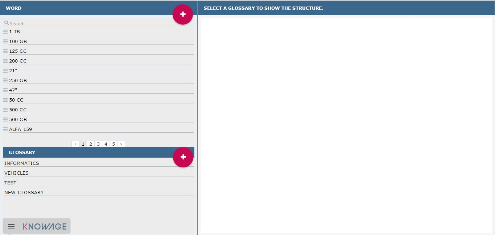
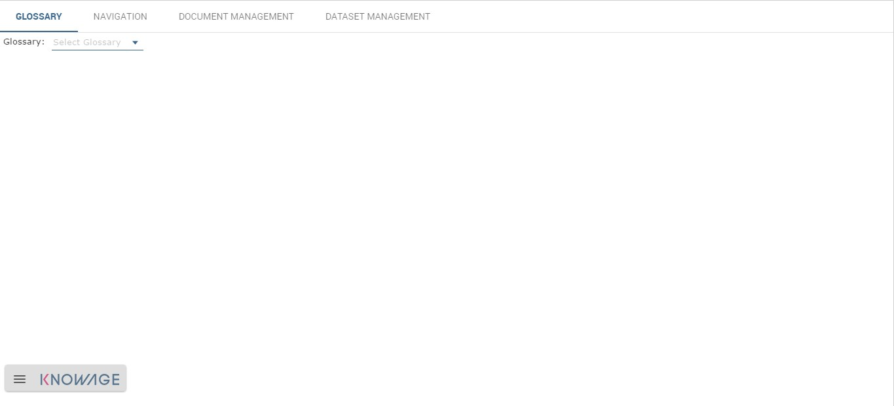
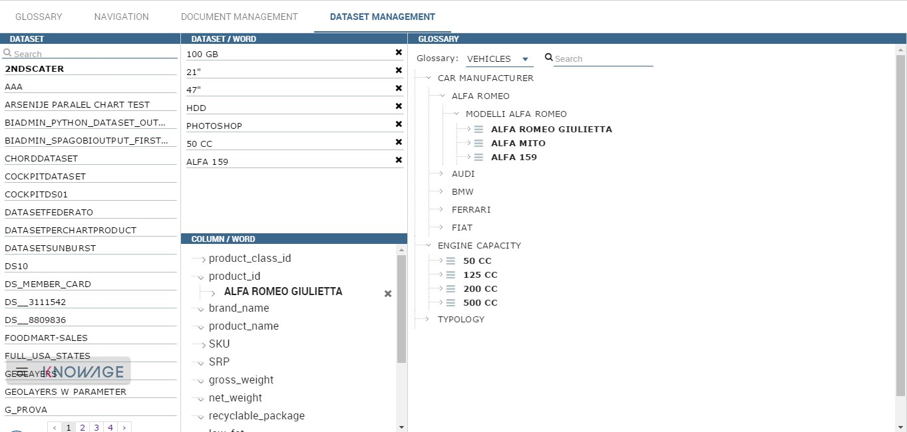
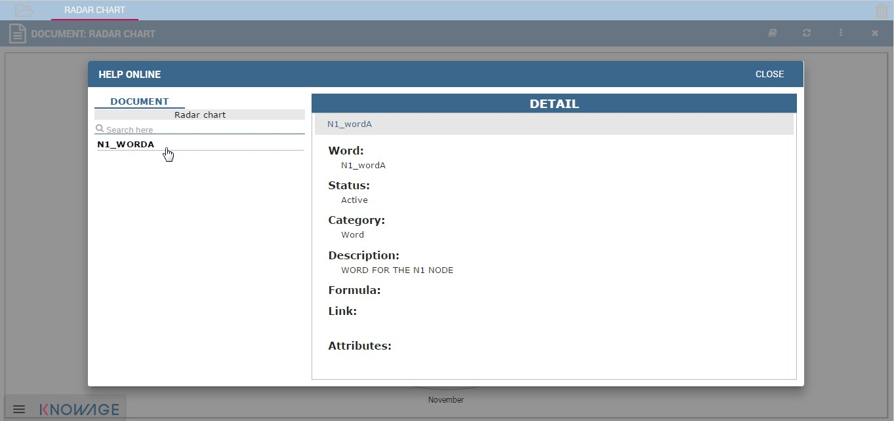

Glossary and data lineage
========================

The **Glossary** functionality offers a way to find documents by browsing an index page.

Glossary management
---------------------

The Glossary management is split in two section. Once logged in, the user can find the two menu items: **Glossary Definition** and **Glossary Usage**, as showed below.

.. figure:: media/image456.png

    Glossary menu items.

To create a new glossary, click on the Glossary Definition menu item that you can find under the **Catalogs** section of the Knowage
interface. As shown in the figure below the page contains two areas:

- **Word**: here there is a list of terms. The latter are used as labels to attach to analytical objects as datasets or documents in order to link those objects to the glossary;
      
- **Glossary**: it is intended a hierarchical structure made up of “Words”.

.. _glossarydefwindow:

    Glossary definition window.

In the following we give some more technical information about these two sections.

In the “Word” area are listed, if any, the words created in a previous moment. To explore the detail of each of them, the user just has to right click on it. A panel containing three features will be shown, as figure below highlights .

.. figure:: media/image458.png

    Exploring an existing word.

When exploring the detail a wizard will pop up showing the following characteristics:

-  description,
-  state,
-  category,
-  a formula description,
-  a list of links to other words,
-  a list of attributes which can be added a value to.

The same panel can be used to modify or delete the word.

To add a new word, click on the “Plus” icon available in the right up corner of the “Word” area as the figure below shows. A format will be open in the right half part of the screen. Insert “Name” and “Description”, which are all mandatory fields and add additional details by necessity. Then click on the Save button. Observe that it is possible to look a “Word” up using the dedicated filter available at the top of the Words list. Type a string in the box and the research will start automatically. Remember to cancel the string from the box to get back to the entire list.

.. _addanewword:
.. figure:: media/image459.png

    Add a new word.

In the “Glossary” area are listed, if any, all glossaries created in a previous moment. To explore an existing glossary the user must simply click on the item. Figure below shows an example. Here the hierarchical structure of the glossary is underlined. To add a new glossary click on the “Plus” icon at the right top corner of the designated area.

.. figure:: media/image460.png

    Exploring a glossary from the menu.

Right clicking on the glossary label as shown in the following figure (right side) the user can add a new child. The “New Node” wizard will open. It is mandatory to give a Name to the node while it is recommended to add a Code and a Description. Once the user has set the nodes, it is possible to add children or words to each of them.

.. _newglossnewahild:
.. figure:: media/image46162.png

    (Left) New glossary wizard. (Right) Add a new child to the glossary.

In particular, if one right clicks on the node name, as in the next figure, a panel will be opened. It allows the user to add one (or more) child or word to the node. In both cases, the user must fill in the mandatory fields. We remark that if the user chooses to add a word through the panel item, the word will be created from scratch and added to the Word list after saving it. To add an existing word the user has to drag and drop the word from the list to the node. Notice that at the right top corner of the designated area a **Safe Mode** button is available. Select it if you want to assure that it cannot be modified by a user with no administrator permissions.

.. _additemstonode:
.. figure:: media/image463.png

    Add items to the node(s).

Complete the tree structure of the glossary. Use the panel features of each node or of the glossary itself (remember to right click on the items to get such a panel) to add, modify, inspect or delete elements.

Glossary Usage
-------------------

This functionality is profiled accordingly to the user role and it includes features that allow to

-  visualize the glossary,
-  visualize the associations,
-  manage the associations between the glossary and the documents,
-  manage the associations between the glossary and the datasets.

Selecting **Glossary Usage** from the Catalogs contextual menu, the user encounters the page showed below. Here four tabs are available:**Glossary**, **Navigation**, **Document Management** and **Dataset Management**.

    Glossary Usage graphic interface.

The Glossary tab provides the possibility to visualize the existing glossaries. Select a glossary from the combobox available in this page to inspect its elements. Use the icon with a circled “i” to visualize the details of the related element, as shown below. Note that it is enabled the possibility to look a word up using the configured research box.

.. figure:: media/image465.png

    Visualization of glossary details.

The navigation paths can be explored in the second tab. This window has an associative logic which facilitates to browse the associations. In other terms, here it is possible to check the relations between documents or datasets and words of a glossary. An
example is given in the following figure.

.. figure:: media/image466.png

    Navigation tab window.

To use this functionality, select a glossary using the designated combobox available at the top of the “word” column. The window will show all words associated to that glossary. Selecting one of those words a list of documents will be displayed in the area in the middle of the page. Use the circled i icon to inspect the document details and in addition to run it. In fact the “Run” button is available at the right bottom corner of the detail panel, as shown below.

.. figure:: media/image46768.png

    Execution documents by means of the glossary.

The filters chosen by the user can be removed through the filter red icon or by selecting the **Clear Filter** button |image475| located at the right top corner of the word list.

Note that it is possible to inspect the details of each element using the specific icon.

The Document management tab is the place where to set the associations between the analytical documents and the words of a glossary. This functionality is profiled through the authorization **Manage Glossary Technical**.

The page is made up of three colums: the “documents” one on the left, the “word” in the middle and the “glossary” on the right. To associate a word to a document or see which words are related to it the user must select a document from the list of the left sided column. Then it is mandatory to select a glossary from the combobox available on the right sided column. Finally drag and drop words from the glossary tree to the “word” column in the middle of the page. Note that the user must drag and drop the word at the beginning of the list: when a light blu box with dotted borders appears it is possible to end the action. To deselect the choice the user can click on the icon |image476| aside each word. This procedure is recap by figure below.

.. figure:: media/image47172.png

    Managing the association with a document: (Left) Select the documnet. (Right) Associate one (or more) word(s).

If one gets back to the navigation tab and select the glossary used in the previous step, it is possible to check the association just set.

Equally, the Dataset management feature allows the user to set the associations between datasets and glossaries. The next figure shows an example. The window is splitted in four areas: **Dataset**, **Dataset/Word**, **Column/Word** and **Glossary**. First the user must select a dataset on the left area. The chosen dataset is highlighted and its fields appear in the Column/Word area. Now, the user select a glossary using the combobox on the right side area. Finally the user can drag and drop words from the glossary tree to the dataset or the single fields of the dataset.

.. _datasetmanagmtab:

    Dataset management tab.

Once the datasets or the documents are linked to the glossaries, the user can enter the Glossary Usage menu item to browse easily the
elements inside the Knowage suite.

Help Online functionality
---------------------------

The user can inspect the association of a specific analytical element (dataset, document or model) by using the **Help Online** funcitonality. The latter can be reached:

-  from the Document Browser,
-  from the toolbar of each document, once launched,
-  from every dataset,
-  from every entity of the Qbe model,
-  from Birt reports,
-  from the cockpit.

As an example, we show in figure below the graphic interface the user will encounter once he/she has launched a document and wishes to use the Help Online functionality.

    Help Online wizard.

