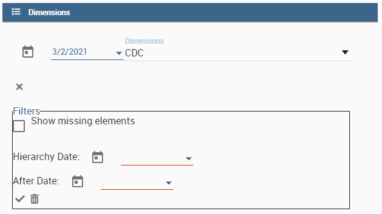
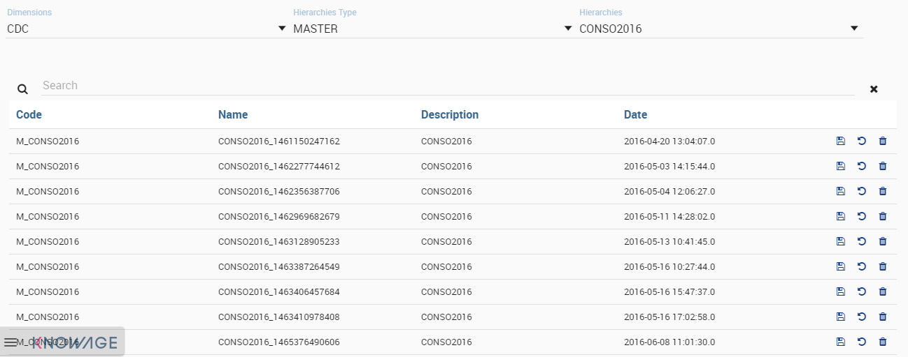
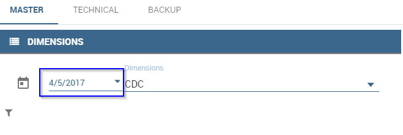
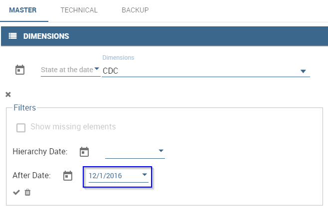
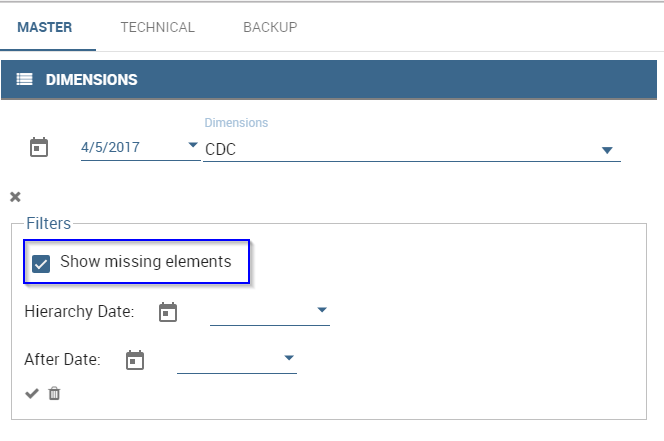

# Jerarquías

El Editor de jerarquías le permite administrar datos estructurados jerárquicamente.

Consta de tres pestañas: MASTER, TECHNICAL y BACKUP.
Los dos primeros muestran a la derecha los objetos editables en forma de árboles, mientras que a la izquierda los objetos de origen con los que actualizar los destinos (pueden ser tablas o árboles: la tabla muestra los datos (hoja) recuperándolos directamente de la dimensión asociada mientras que los árboles muestran otras jerarquías ya creadas).

PESTAÑAS

```

In detail:

-  **The MASTER tab**: allows the creation of 'master' hierarchies as well as the modification of the same or of the technical hierarchies starting directly from the data read from the reference dimension (leaves).
-  **The TECHNICAL tab**: allows the creation of new technical hierarchies and their modification starting from other existing hierarchies (master or technical)

FILTERS
~~~~~~~



   Filters.

In each tab there is a dynamic filter section useful for selecting the data to manage (both the dimension table and the trees)
Eg. for the size of the CDC it is possible to set:

-  **a validity date** against which the *begin_dt* and *end_dt* dates will be compared. By default it shows today's date (optional)
-  **a hierarchy date** against which the *hier_begin_dt* and *hier_end_dt* dates of the dimension will be compared. Note that this is an optional date, managed through the configuration and provided only with the dimension DIM_CDC.
-  **a date after** which the records are to be considered. Again it will be compared with *begin_dt* (but without *end_dt*).
-  **a 'Show missing elements' flag** that allows you to exclude from the selection the leaves already used in the source or target element loaded on the left or right with respect to the object on which the filters are applied.

These same filters will be applied by the system to manage the creation of masters and their synchronization.


MASTER hierarchies
```

.. figura:: media/image2.png

Jerarquías MASTER.

Para crear una nueva jerarquía MASTER, configure los filtros correctamente para seleccionar las hojas (por ejemplo, CDC) que desea insertar (tabla izquierda) y, a continuación, abra la ventana emergente de creación MASTER con el botón apropiado

.. figura:: media/image3.png

CREAR JERARQUÍA MAESTRA.

Establezca la configuración básica (código, nombre, descripción y año) y, a continuación, presione GUARDAR:

.. figura:: media/image4.png

Configuración básica MASTER.

No establezca las fechas de inicio y finalización si planea usar la función de sincronización (si aparecen en la ventana emergente). Esto reportará las mismas fechas de validez que las hojas recuperadas de la dimensión.
Defina la estructura de la jerarquía llevando los elementos de la dimensión a la derecha como niveles. Tenga en cuenta que el último nivel debe ser el código/nombre de la hoja.

Con el botón SAVE se activa la creación de la nueva jerarquía MASTER, que luego se hace visible y modificable en el lado derecho en forma de árbol:

Cada elemento del árbol (nodo u hoja) tiene un menú contextual con funciones activas (una información sobre herramientas en cada elemento individual resaltará la funcionalidad):

.. figura:: media/image5.png

Jerarquía MASTER.

## Menú Nodo

.. figura:: media/image6.png

Menú Nodo.

En los nodos individuales es posible:

*   Agregar un nuevo subnodo
*   Modificar el nodo en sí (se abre una ventana emergente con los campos editables activos)
*   Eliminar el propio nodo
*   Ver el detalle completo del nodo

## Menú de hojas

.. figura:: media/image7.png

Menú de hojas.

En hojas sueltas es posible:

*   Duplicar la hoja: si así lo requiere la configuración, se activará un popup que permitirá la modificación del detalle y la validez temporal.
*   Modifique la hoja en sí (también aquí se activará una ventana emergente con los campos editables)
*   Eliminar la hoja en sí
*   Ver el detalle completo de la hoja

## Gestión de la sincronización

La función de sincronización se proporciona solo para las jerarquías MASTER y permite que la jerarquía se actualice agregando nuevas hojas o modificando las existentes.

este es el enfoque utilizado:

*   el usuario selecciona a través de los filtros las hojas con las que quiere actualizar la jerarquía seleccionada a la derecha y pulsa el botón SYNCRONIZE debajo de la tabla. Todos los elementos de la tabla de la izquierda se manejarán en el proceso de sincronización.
*   el sistema recupera los datos seleccionados y los datos de la jerarquía y aplica un concepto de fusión, es decir, añade a las hojas existentes las presentes en la versión anterior de la jerarquía. Si una hoja ya está presente, la versión de la dimensión recibida en la entrada se mantiene y sin duda estará más actualizada.

## Gestión de propagación de cambios entre MASTER y TÉCNICO

Si se ha modificado un nodo de la jerarquía maestra con el que se han modificado una o más jerarquías técnicas (con arrastrar y soltar una hoja recuperada de la tabla), se propone propagar estos cambios también a las jerarquías técnicas.
Esta característica abre una ventana emergente cuando el usuario libera la hoja en el nodo en cuestión que propone una lista con todos los nodos de las jerarquías técnicas en las que está presente el nodo recién modificado. En este punto, el usuario puede seleccionar todo, alguna o ninguna jerarquía en la que propagar el cambio.

.. figura:: media/image8.png

Objetivo de las jerarquías.

En el botón OK se añadirá la hoja a la jerarquía en el punto en el que se suelta el ratón (se hayan seleccionado o no las jerarquías a propagar) y con el botón SAVE el cambio se aplicará tanto a la jerarquía MASTER como a las TECHNIQUES (siempre si y solo si es necesario).

Jerarquías técnicas

```

.. figure:: media/image9.png

   Technical Hierarchies.

The technical hierarchies can only be created in the TECHNICAL tab using the appropriate CREATE button, but they can also be modified in the MASTER tab when you want to add the leaves directly; alternatively it is possible to add portions of existing hierarchy trees with a simple drag & drop.

The management of filters and context menus are the same as for the master hierarchies, so we refer to the previous sections for further details

Backup
-------



   Backup.

Each time the trees are saved, it is possible to make a backup of the current version before modifications. It is an activity done by default but you can disable it by deactivating the Backup check next to the SAVE button in the first two tabs.


In the Backup tab you can view all the saves made related to a specific hierarchy of the selected dimension.
For each line displayed in this interface it is possible to:

- change the name and description (in case you want to give a more logical meaning to the save)
- restore or restore the selected version
- delete the backup itself

.. warning::
   Since a complete copy of the hierarchy is made for each backup, it is recommended to periodically delete the oldest backups to free up space on the database.


Configuration management
```

Detrás del editor de jerarquías hay un archivo xml de configuración que guía la gestión de toda la interfaz.
Este archivo se denomina jerarquías.xml y se puede encontrar en el servidor de aplicaciones en la carpeta de recursos del inquilino de referencia `TOMCAT_HOME/resources/<TENANT_NAME>/hierarchies/` camino.

La sintaxis es XML y las etiquetas principales son:

.. code-block:: xml
:linenos:
:caption: Etiquetas principales del XML utilizadas para la configuración.

        <?xml version='1.0' encoding='utf-8'?>
        <HIERARCHY_EDITOR_DEFINITION>
        <DIMENSIONS>
              <DIMENSION NAME="V_DIM_CDC_4_NCONSO" LABEL="CDC_4_NCONSO" PREFIX="CDC" DATASOURCE ="BIENG">
                <HIERARCHY_TABLE NAME = "HIER_CDC_TEST" />
                <HIERARCHY_FK NAME = "CDC_LEAF_ID" />
                <CONFIGS>... </CONFIGS>
                <DIM_FILTERS>... </DIM_FILTERS>
                <DIM_FIELDS>... </DIM_FIELDS>
                <HIER_FIELDS>... </HIER_FIELDS>
              </DIMENSION>
        </DIMENSIONS>
        </HIERARCHY_EDITOR_DEFINITION>

Para guiar son las dimensiones por lo tanto para cada dimensión se especifica:

\+--------------------------------+---------------------------------------------------+--------------+
| PROPIEDADES | | DE VALOR NOTAS DE VALOR |
\+================================+===================================================+==============+
| nombre | Cuerda. El nombre físico de la dimensión de origen | | obligatoria
\+--------------------------------+---------+-----------------------------------------+--------------+
| etiqueta | Cuerda. La etiqueta de cota que se muestra en la gui | | obligatoria
\+--------------------------------+---------+-----------------------------------------+--------------+
| prefijo | Cuerda. El prefijo para el | físico estándar | obligatoria
|                                | columna | obligatorio              |
\+--------------------------------+---------+-----------------------------------------+--------------+
| datasource | Cuerda. La etiqueta del origen de datos definido | | obligatoria
|                                | en Knowage donde existen las tablas |              |
\+--------------------------------+-----------------------+---------------------------+--------------+

## Etiqueta de tabla de jerarquía

.. code-block:: xml
:linenos:
:caption: Etiqueta HIERARCHY_TABLE y sus propiedades.

    <HIERARCHY_TABLE NAME = "HIER_CDC_TEST" />

Define la referencia de la tabla física de jerarquía.

    +--------------------------------+------------------------------------------------------------+--------------+
    | PROPERTIES                     | VALUE                                                      | VALUE NOTES  |
    +================================+============================================================+==============+
    | NAME                           | String. The physical name of the target hierarchical table.| Mandatory    |
    +--------------------------------+------------------------------------------------------------+--------------+
    | PRIMARY_KEY                    | String. String. The name of the primary key for the target | Mandatory    |
    |                                | table Optional. If isn't present the db must be able to    |              |
    |                                | manage autoincrement.                                      |              |
    +--------------------------------+------------------------------------------------------------+--------------+

## Etiqueta de clave externa de jerarquía

.. code-block:: xml
:linenos:
:caption: Etiqueta HIERARCHY_FK y su propiedad.

    <HIERARCHY_FK NAME = "CDC_LEAF_ID" />

Define la clave externa de jerarquía para vincularla a la tabla de cotas.

    +--------------------------------+------------------------------------------------------------+--------------+
    | PROPERTIES                     | VALUE                                                      | VALUE NOTES  |
    +================================+============================================================+==============+
    | NAME                           | String. The name of the foreign key from the source table  | Mandatory    |
    |                                | to the target table.                                       |              |
    +--------------------------------+------------------------------------------------------------+--------------+

## Etiqueta Configs

.. code-block:: xml
:linenos:
:caption: Etiqueta CONFIGS y su propiedad.

    <CONFIGS>
      <CONFIG NUM_LEVELS = "5" />
      <CONFIG ALLOW_DUPLICATE = "false" />
      <CONFIG UNIQUE_NODE = "true" />
      <CONFIG FORCE_NAME_AS_LEVEL = "true" />
      <CONFIG TREE_NODE_CD = "PRODUCT_CLASS_CD_LEV" />
      <CONFIG TREE_NODE_NM = "PRODUCT_CLASS_NM_LEV" />
      <CONFIG TREE_LEAF_ID = "PRODUCT_CLASS_LEAF_ID" />
      <CONFIG TREE_LEAF_CD = "PRODUCT_CLASS_CD_LEAF" />
      <CONFIG TREE_LEAF_NM = "PRODUCT_CLASS_NM_LEAF" />
      <CONFIG DIMENSION_ID = "PRODUCT_CLASS_ID" />
      <CONFIG DIMENSION_CD = "PRODUCT_CLASS_CD" />
      <CONFIG DIMENSION_NM = "PRODUCT_CLASS_NM" />
      <CONFIG FILL_EMPTY = "NO" />
      <CONFIG FILL_VALUE = "OTHER" />
    </CONFIGS>

Contiene toda la configuración genérica posible para la administración de la GUI

    +-----------------+---------------------------------------------------------------+---------------------------------------------------------+
    | PROPERTY        | VALUE                                                         | NOTE                                                    |
    +=================+===============================================================+=========================================================+
    | NUM_LEVELS      | Numeric. The number of maximum hierarchical levels.           | Mandatory. The target table must have <PREFIX>_CD_LEVx  |
    |                 |                                                               | where x is a counter from 1 to NUM_LEVELS value.        |
    |                 |                                                               | The same for <PREFIX>_NM_LEVx and so on.                |
    +-----------------+---------------------------------------------------------------+---------------------------------------------------------+
    | ALLOW_DUPLICATE | Boolean. True if the tool can duplicate totally the leaf.     | Mandatory.                                              |
    +-----------------+---------------------------------------------------------------+---------------------------------------------------------+
    | UNIQUE_NODE     | Boolean. True if the leaves must have a unique hashcode as id.| Optional. Pay attention to the dimension of Ids fields  |
    |                 |                                                               | because the hash code could be long.                    |
    +-----------------+---------------------------------------------------------------+---------------------------------------------------------+
    | TREE_NODE_CD    | String. The column of the target table                        | Mandatory.                                              |
    |                 | that will be used as code on the tree.                        | Not specify level i.e. <PREFIX> _CD_LEV                 |
    +-----------------+---------------------------------------------------------------+---------------------------------------------------------+
    | TREE_NODE_NM    | String. The column of the target table                        | Mandatory.                                              |
    |                 | that will be used as name on the tree.                        | Not specify level i.e. <PREFIX> _NM_LEV                 |
    +-----------------+---------------------------------------------------------------+---------------------------------------------------------+
    | TREE_LEAF_ID    | String. The column of the target table                        | Mandatory.                                              |
    |                 | that will be used as id of the leaf on the tree.              |                                                         |
    +-----------------+---------------------------------------------------------------+---------------------------------------------------------+
    | TREE_LEAF_CD    | String. The column of the target table                        | Mandatory.                                              |
    |                 | that will be used as code of the leaf on the tree.            |                                                         |
    +-----------------+---------------------------------------------------------------+---------------------------------------------------------+
    | TREE_LEAF_NM    | String. The column of the target table                        | Mandatory.                                              |
    |                 | that will be used as name of the leaf on the tree.            |                                                         |
    +-----------------+---------------------------------------------------------------+---------------------------------------------------------+
    | DIMENSION_ID    | String. The column of the source table                        | Mandatory.                                              |
    |                 | that will be used as id of the dimension.                     |                                                         |
    +-----------------+---------------------------------------------------------------+---------------------------------------------------------+
    | DIMENSION_CD    | String. The column of the source table                        | Mandatory.                                              |
    |                 | that will be used as code of the dimension.                   |                                                         |
    +-----------------+---------------------------------------------------------------+---------------------------------------------------------+
    | DIMENSION_NM    | String. The column of the source table                        | Mandatory.                                              |
    |                 | that will be used as name of the dimension.                   |                                                         |
    +-----------------+---------------------------------------------------------------+---------------------------------------------------------+
    | FILL_EMPTY      | Boolean. If true set the filling of the empty node            | Optional. It's used in master creation context          |
    |                 | with a default value.                                         | where the leaf is fixed to a specific level.            |
    +-----------------+---------------------------------------------------------------+---------------------------------------------------------+
    | FILL_VALUE      | String. Specify the value of default used                     | Optional.                                               |
    |                 | for filling empty nodes.                                      |                                                         |
    +-----------------+---------------------------------------------------------------+---------------------------------------------------------+

## Etiqueta de filtros tenues (opcional)

.. code-block:: xml
:linenos:
:caption: Etiqueta DIM_FILTERS y sus propiedades.

    <DIM_FILTERS>
      <FILTER TYPE = "Date" NAME = "After Date" CONDITION1 = "BEGIN_DT &gt;=" DEFAULT = "" />
      <FILTER TYPE = "Date" NAME = "Hierarchy Date" CONDITION1 = "BEGIN_HIER_DT &lt;=" CONDITION2 = "END_HIER_DT &gt;=" DEFAULT = ""/>
    ...
    </DIM_FILTERS>

Define filtros opcionales en la sección de cota

    +------------+------------------------------------------------------+----------------------------------------------------------------+
    | PROPERTY   | VALUE                                                | NOTE                                                           |
    +============+======================================================+================================================================+
    | TYPE       | String. The type of the filter.                      | Mandatory. Depending from the type a different                 |
    |            | Could be String, Number or Date.                     | widget will be shown (input text, calendar, ..).               |
    +------------+------------------------------------------------------+----------------------------------------------------------------+
    | NAME       | String. The label visualized near the filter element.| Mandatory.                                                     |
    +------------+------------------------------------------------------+----------------------------------------------------------------+
    | CONDITIONx | String. The formula of the filter.                   | Mandatory. Could be are present more conditions element        |
    |            |                                                      | ie. CONDITION1, CONDITION2,...                                 |
    |            |                                                      | All these conditions will be apply (without elaboration)       |
    |            |                                                      | on the final select query defined dynamically from the system. |
    +------------+------------------------------------------------------+----------------------------------------------------------------+
    | DEFAULT    | String. The default value for the filter             | Optional.                                                      |
    +------------+------------------------------------------------------+----------------------------------------------------------------+

## Etiqueta de campos oscuros (obligatorio)

.. code-block:: xml
:linenos:
:caption: Etiqueta DIM_FIELDS y sus propiedades.

      <DIM_FIELDS>
        ...
        <FIELD ID = "PRODUCT_CLASS_ID" NAME = "Identifier" VISIBLE = "false" EDITABLE = "false" TYPE = "Number" />
        <FIELD ID = "PRODUCT_CLASS_PARENT_CD" PARENT = "true" NAME = "Parent Code" VISIBLE = "false" EDITABLE = "false" TYPE = "String" />
        <FIELD ID = "PRODUCT_CLASS_PARENT_NM" PARENT = "true" NAME = "Parent Name" VISIBLE = "false" EDITABLE = "false" TYPE = "String" />
        ...
      </DIM_FIELDS>

Especifica todos los campos de dimensión administrados por la GUI.

    +----------+-----------------------------------------------------------------------------+------------+
    | PROPERTY | VALUE                                                                       | NOTE       |
    +==========+=============================================================================+============+
    | ID       | String. The column of the source dimension table                            | Mandatory. |
    |          | that will be managed through the GUI.                                       |            |
    +----------+-----------------------------------------------------------------------------+------------+
    | NAME     | Boolean. True if the field must be shown in the table, false otherwise.     | Mandatory. |
    +----------+-----------------------------------------------------------------------------+------------+
    | VISIBLE  | True if the field could be editable from the user, false otherwise.         | Mandatory. |
    +----------+-----------------------------------------------------------------------------+------------+
    | EDITABLE | Boolean. True if the field could be editable from the user, false otherwise | Mandatory. |
    +----------+-----------------------------------------------------------------------------+------------+
    | TYPE     | String. The type of the field.                                              | Mandatory. |
    |          | Could be String, Number or Date.                                            |            |
    +----------+-----------------------------------------------------------------------------+------------+
    | PARENT   | Boolean. True if the field contains the parent                              | Optional.  |
    |          | reference information for a recursive management.                           |            |
    +----------+-----------------------------------------------------------------------------+------------+

## Etiqueta Hier Fields

Obligatorio. Especifica todos los campos de dimensión administrados por la GUI.

Se compone de tres secciones: GENERAL_FIELDS, NODE_FIELDS y LEAF_FIELDS.

.. code-block:: xml
:linenos:
:caption: Etiqueta HIER_FIELDS y sus propiedades.

    <HIER_FIELDS>
      <GENERAL_FIELDS>... </GENERAL_FIELDS>
      <NODE_FIELDS>... </NODE_FIELDS>
      <LEAF_FIELDS>... </LEAF_FIELDS>
    </HIER_FIELDS>

## Campos generales

.. code-block:: xml
:linenos:
:caption: Etiqueta GENERAL_FIELDS y sus propiedades.

    <GENERAL_FIELDS>
      <FIELD ID = "HIER_CD" NAME = "Code" VISIBLE = "true" EDITABLE = "true" REQUIRED = "true" TYPE = "String" />
      <FIELD ID = "HIER_NM" NAME = "Name" VISIBLE = "true" EDITABLE = "true" REQUIRED = "true" TYPE = "String" />
      <FIELD ID = "HIER_DS" NAME = "Description" VISIBLE = "true" EDITABLE = "true" REQUIRED = "true" TYPE = "String" />
      <FIELD ID = "HIER_TP" NAME = "Type" VISIBLE = "false" EDITABLE = "false" REQUIRED = "true" TYPE = "String" />
      <FIELD ID = "MAX_DEPTH" NAME = "Max Depth." VISIBLE = "false" EDITABLE = "false" REQUIRED = "true" TYPE = "Number" />
    </GENERAL_FIELDS>

Define todos los campos genéricos de la jerarquía

    +----------+----------------------------------------------------------------------------------------+------------+
    | PROPERTY | VALUE                                                                                  | NOTE       |
    +==========+========================================================================================+============+
    | ID       | String. The column of the target hierarchy table that will be managed through the GUI. | Mandatory. |
    +----------+----------------------------------------------------------------------------------------+------------+
    | NAME     | String. The label of the element shown in the GUI.                                     | Mandatory. |
    +----------+----------------------------------------------------------------------------------------+------------+
    | VISIBLE  | Boolean. True if the field must be shown in the table, false otherwise.                | Mandatory. |
    +----------+----------------------------------------------------------------------------------------+------------+
    | EDITABLE | Boolean. True if the field could be editable from the user, false otherwise.           | Mandatory. |
    +----------+----------------------------------------------------------------------------------------+------------+
    | REQUIRED | Boolean. True if the field is mandatory and the user must insert any values;           | Optional.  |
    |          |  false otherwise.                                                                      |            |
    +----------+----------------------------------------------------------------------------------------+------------+
    | TYPE     | String. The type of the field.                                                         | Mandatory. |
    |          | Could be String, Number or Date.                                                       |            |
    +----------+----------------------------------------------------------------------------------------+------------+

## Campos de nodo

.. code-block:: xml
:linenos:
:caption: Etiqueta NODE_FIELDS y sus propiedades.

    <NODE_FIELDS>
      <FIELD ID = "PRODUCT_CLASS_CD_LEV" SINGLE_VALUE = "false" UNIQUE_CODE = "true" NAME = "Unique code" VISIBLE = "true" EDITABLE = "false" REQUIRED = "true" TYPE = "String" />
      <FIELD ID = "PRODUCT_CLASS_OCD_LEV" SINGLE_VALUE = "false" NAME = "Code" VISIBLE = "true" EDITABLE = "true" REQUIRED = "true" TYPE = "String" />
      <FIELD ID = "PRODUCT_CLASS_NM_LEV" SINGLE_VALUE = "false" NAME = "Name" VISIBLE = "true" EDITABLE = "true" REQUIRED = "true" TYPE = "String" />
      <FIELD ID = "ORDER_LEV" SINGLE_VALUE = "false" NAME = "Order" VISIBLE = "true" EDITABLE = "true" REQUIRED = "true" TYPE = "Number" />
    </NODE_FIELDS>

Define todos los campos para los nodos

    +--------------+-------------------------------------------------------------------------------+------------+
    | PROPERTY     | VALUE                                                                         | NOTE       |
    +==============+===============================================================================+============+
    | ID           | String. The column of the target hierarchy table                              | Mandatory. |
    |              | that will be managed through the GUI.                                         |            |
    +--------------+-------------------------------------------------------------------------------+------------+
    | SINGLE_VALUE | Boolean. True if the field is present any times                               | Mandatory. |
    |              | like the NUM_LEVELS property defines; false otherwise.                        |            |
    +--------------+-------------------------------------------------------------------------------+------------+
    | NAME         | String. The label of the element shown in the GUI.                            | Mandatory. |
    +--------------+-------------------------------------------------------------------------------+------------+
    | VISIBLE      | Boolean. True if the field must be shown in the table,                        | Mandatory. |
    |              | false otherwise.                                                              |            |
    +--------------+-------------------------------------------------------------------------------+------------+
    | EDITABLE     | Boolean. True if the field could be editable from the user,                   | Mandatory. |
    |              | false otherwise.                                                              |            |
    +--------------+-------------------------------------------------------------------------------+------------+
    | REQUIRED     | Boolean. True if the field is mandatory and the user must insert any values;  | Optional.  |
    |              | false otherwise                                                               |            |
    +--------------+-------------------------------------------------------------------------------+------------+
    | TYPE         | String. The type of the field. Could be String, Number or Date.               | Mandatory. |
    +--------------+-------------------------------------------------------------------------------+------------+

## Campos de hojas

.. code-block:: xml
:linenos:
:caption: Etiqueta LEAF_FIELDS y sus propiedades.

    <LEAF_FIELDS>
      <FIELD ID = "PRODUCT_CLASS_LEAF_ID " NAME =" Leaf Id. " VISIBLE =" false " EDITABLE =" false " required =" true " TYPE =" Number "/>
      <FIELD ID = "PRODUCT_CLASS_CD_LEAF" NAME = "Code" VISIBLE = "true" EDITABLE = "false" REQUIRED = "true" TYPE = "String" />
      <FIELD ID = "PRODUCT_CLASS_NM_LEAF" NAME = "Name" VISIBLE = "true" EDITABLE = "true" REQUIRED = "true" TYPE = "String" />
      <FIELD ID = "LEAF_PARENT_CD" NAME = "Parent Code" VISIBLE = "true" EDITABLE = "false" REQUIRED = "true" TYPE = "String" />
      <FIELD ID = "LEAF_PARENT_NM" NAME = "Parent Name" VISIBLE = "true" EDITABLE = "false" REQUIRED = "true" TYPE = "String" />
      <FIELD ID = "BEGIN_DT" NAME = "Begin Date" VISIBLE = "true" EDITABLE = "true" REQUIRED = "true" TYPE = "Date" />
      <FIELD ID = "END_DT" NAME = "End Date" VISIBLE = "true" EDITABLE = "true" REQUIRED = "true" TYPE = "Date" />
    </LEAF_FIELDS>

Define todos los campos de la hoja

    +----------+-------------------------------------------------------------------------------+------------+
    | PROPERTY | VALUE                                                                         | NOTE       |
    +==========+===============================================================================+============+
    | ID       | String. The column of the source dimension table                              | Mandatory. |
    |          | that will be used as id.                                                      |            |
    +----------+-------------------------------------------------------------------------------+------------+
    | NAME     | String. The label of the element shown in the GUI                             | Mandatory. |
    +----------+-------------------------------------------------------------------------------+------------+
    | VISIBLE  | Boolean. True if the field must be shown in the table,                        | Mandatory. |
    |          | false otherwise.                                                              |            |
    +----------+-------------------------------------------------------------------------------+------------+
    | EDITABLE | Boolean. True if the field could be editable from the user,                   | Mandatory. |
    |          | false otherwise.                                                              |            |
    +----------+-------------------------------------------------------------------------------+------------+
    | REQUIRED | Boolean. True if the field is mandatory and the user must insert any values;  | Optional.  |
    |          | false otherwise                                                               |            |
    +----------+-------------------------------------------------------------------------------+------------+
    | TYPE     | String. The type of the field. Could be String, Number or Date.               | Mandatory. |
    +----------+-------------------------------------------------------------------------------+------------+

DETALLE DE LOS FILTROS

```

Below is a list of the filters that can be applied through the GUI on the MASTER tab with the details of the queries performed by the system to retrieve information related to dimensions in order to explain how the filters set through the GUI affect the result.
In general, all filters are applied with the 'AND' logic, so the records must satisfy ALL the defined settings to be selected.

Note: for the selection of dates it is recommended to use the date-picker in order to be independent of the managed format due to the active language.

BASIC FILTERS
--------------

1. Size
^^^^^^^

.. figure:: media/image11.png

   Size.


As mentioned previously, the dimension is mandatory for the recovery of the data to be managed. The usable values ​​are retrieved from the configuration file (see the 'Configuration Management' paragraph defined above).

2. Filter on validity date
^^^^^^^^^^^^^^^^^^^^^^^^^^



   Filter on validity date.

Unlike the dimension, the effective date becomes optional if other dates are set in the optional filter panel.
 
By setting the validity date, all 'valid' records will be retrieved from the specified size, i.e. with the BEGIN_DT attribute less than or equal to the specified date and the END_DT attribute greater than or equal to the specified value.


OPTIONAL FILTERS
-----------------

3. Filter on a given hierarchy
^^^^^^^^^^^^^^^^^^^^^^^^^^^^^^

.. figure:: media/image13.png

   Filter on a given hierarchy.


The hierarchy date is the earliest definable date in the optional filter panel. This means that not all dimensions can set it and that its definition - and therefore the type of condition to be applied - is configured within the configuration file (see the 'Dim Filters tag' paragraph specified above).

Therefore, according to the current configuration, by setting the hierarchy date, all the records with the 'valid' hierarchy date will be retrieved from the specified dimension, i.e. with the BEGIN_HIER_DT attribute less than or equal to the specified date and the END_HIER_DT attribute greater than or equal to the value specified.

This means if an element of the dimension were created with a given hierarchy after the one set, it would not be considered.

4. Filter on date 'after ...'
^^^^^^^^^^^^^^^^^^^^^^^^^^^^^



   Filter on date 'after ...'.


The date 'after ..' is also part of the optional filter panel (see the 'Dim Filters tag' paragraph specified above).

Therefore, according to the current configuration, by setting the date 'after ...', all the 'valid' records from that date onwards will be retrieved from the specified size or with the BEGIN_DT attribute greater than or equal to the specified date; in this case the END_DT attribute is not considered.

5. Filter 'Show missing elements ...'
^^^^^^^^^^^^^^^^^^^^^^^^^^^^^^^^^^^^^



   Filter 'Show missing elements ...'.


In order to choose the 'Show missing elements' option, the user must previously select an existing hierarchy to compare with (right side of the GUI).
At this point, considering the other options set, all the records that are not yet present on the target hierarchy with the same conditions will be selected.

6. Compound filters
^^^^^^^^^^^^^^^^^^^


   Compound filters.

Obviously it is possible to apply more filters at the same time; this means that only the records that satisfy ALL the conditions set will be recovered.
 
This example shows the application of the validity logic both on the generic dates of the record and on those of the hierarchy.
```
