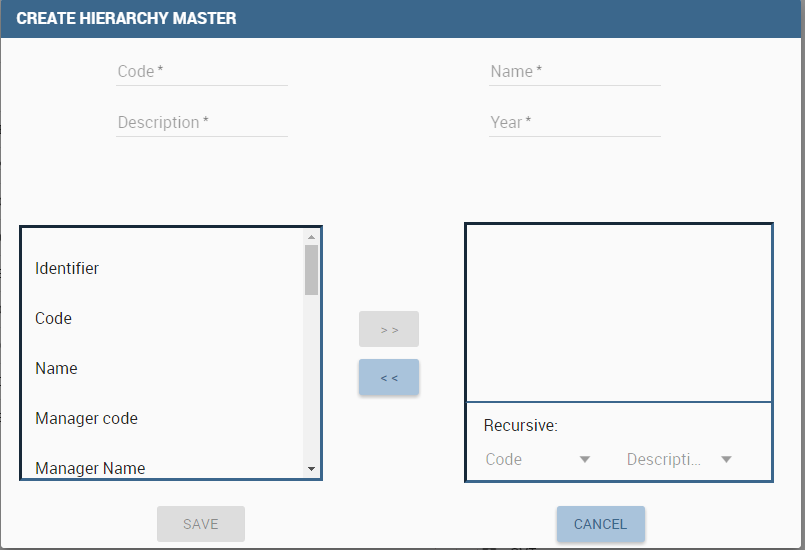
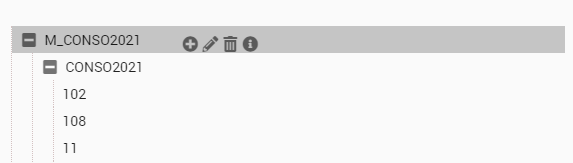

Hierarchies
============

The Hierarchy Editor allows you to manage hierarchically structured data.

It consists of three tabs: MASTER, TECHNICAL and BACKUP.
The first two show on the right the editable objects in the form of trees, while on the left the source objects with which to update the targets (they can be tables or trees: the table displays the data (leaf) retrieving them directly from the associated dimension while the trees show others hierarchies already created).

TABS
~~~~~~~~~~~~~~~~~~~~

In detail:

-  **The MASTER tab**: allows the creation of 'master' hierarchies as well as the modification of the same or of the technical hierarchies starting directly from the data read from the reference dimension (leaves).
-  **The TECHNICAL tab**: allows the creation of new technical hierarchies and their modification starting from other existing hierarchies (master or technical)

FILTERS
~~~~~~~

.. figure:: media/image1.png

   Filters.

In each tab there is a dynamic filter section useful for selecting the data to manage (both the dimension table and the trees)
Eg. for the size of the CDC it is possible to set:

-  **a validity date** against which the *begin_dt* and *end_dt* dates will be compared. By default it shows today's date (optional)
-  **a hierarchy date** against which the *hier_begin_dt* and *hier_end_dt* dates of the dimension will be compared. Note that this is an optional date, managed through the configuration and provided only with the dimension DIM_CDC.
-  **a date after** which the records are to be considered. Again it will be compared with *begin_dt* (but without *end_dt*).
-  **a 'Show missing elements' flag** that allows you to exclude from the selection the leaves already used in the source or target element loaded on the left or right with respect to the object on which the filters are applied.

These same filters will be applied by the system to manage the creation of masters and their synchronization.

MASTER hierarchies
~~~~~~~~~~~~~~~~~~~~~

   MASTER hierarchies.

To create a new MASTER hierarchy, set the filters correctly to select the leaves (e.g. CDCs) you want to insert (left table), then open the MASTER creation popup with the appropriate button

   CREATE MASTER HIERARCHY.

Set the basic configuration (code, name, description and year) and then press SAVE:

   MASTER basic configuration.

Do not set the start and end dates if you plan to use the sync feature (if they appear in the pop-up). This will report the same validity dates as the leaves retrieved from the dimension.
Define the structure of the hierarchy by bringing the elements of the dimension to the right as levels. Note that the last level must be the code/name of the leaf.

With the SAVE button you activate the creation of the new MASTER hierarchy, which then becomes visible and modifiable on the right side in the form of a tree:

Each element of the tree (node ​​or leaf) has a context menu with active functions (a tooltip on each individual item will highlight the functionality):

   MASTER hierarchy.

Node menu
---------

   Node menu.
 
On the individual nodes it is possible to:

-  Add a new subnode
-  Modify the node itself (a popup opens with the editable fields active)
-  Delete the node itself
-  View the complete detail of the node

Leaf menu
---------

   Leaf menu.

On single leaves it is possible:

-  Duplicate the leaf: if required by the configuration, a popup will be activated that will allow the modification of the detail and the time validity.
-  Modify the leaf itself (also here a popup will be activated with the editable fields)
-  Delete the leaf itself
-  View the complete detail of the leaf

Synchronization management
--------------------------

The synchronization function is provided only for MASTER hierarchies and allows the hierarchy to be updated by adding new leaves or modifying existing ones.

this is the approach used:

- the user selects through the filters the leaves with which he wants to update the hierarchy selected on the right and presses the SYNCRONIZE button under the table. All the items in the left table will be handled in the synchronization process.
- the system retrieves the selected data and the data of the hierarchy and applies a merge concept, that is, it adds to the existing leaves those present in the previous version of the hierarchy. If a leaf is already present, the version of the dimension received in input is kept and it will certainly be more up-to-date.

Management of propagation of changes between MASTER and TECHNICIAN
-----------------------------------------------------------------------------

If a node of the master hierarchy with which one or more technical hierarchies has been modified (with drag & drop of a leaf retrieved from the table), it is proposed to propagate these changes also to the technical hierarchies.
This feature opens a popup when the user releases the leaf on the node concerned which proposes a list with all the nodes of the technical hierarchies in which the node just modified is present. At this point, the user can select all, some or no hierarchy in which to propagate the change.

   Hierarchies target.
 
On the OK button the leaf will be added to the hierarchy in the point at which the mouse is released (whether or not hierarchies to propagate have been selected) and with the SAVE button the change will be applied to both the MASTER hierarchy and the TECHNIQUES (always if and only if required).

Technical Hierarchies
~~~~~~~~~~~~~~~~~~~~~~~

   Technical Hierarchies.

The technical hierarchies can only be created in the TECHNICAL tab using the appropriate CREATE button, but they can also be modified in the MASTER tab when you want to add the leaves directly; alternatively it is possible to add portions of existing hierarchy trees with a simple drag & drop.

The management of filters and context menus are the same as for the master hierarchies, so we refer to the previous sections for further details

Backup
-------

.. figure:: media/image10.png

   Backup.

Each time the trees are saved, it is possible to make a backup of the current version before modifications. It is an activity done by default but you can disable it by deactivating the Backup check next to the SAVE button in the first two tabs.

In the Backup tab you can view all the saves made related to a specific hierarchy of the selected dimension.
For each line displayed in this interface it is possible to:

- change the name and description (in case you want to give a more logical meaning to the save)
- restore or restore the selected version
- delete the backup itself

.. warning::
   Since a complete copy of the hierarchy is made for each backup, it is recommended to periodically delete the oldest backups to free up space on the database.

Configuration management
~~~~~~~~~~~~~~~~~~~~~~~~~~~

Behind the hierarchy editor there is a configuration xml file that guides the management of the entire interface.
This file is called hierarchies.xml and can be found on the application server under the resources folder for the reference tenant ``TOMCAT_HOME/resources/<TENANT_NAME>/hierarchies/`` path.

The syntax is XML and the main tags are:

.. code-block:: xml
        :linenos:
        :caption: Main tags of the XML used for configuration.

        <?xml version='1.0' encoding='utf-8'?>
        <HIERARCHY_EDITOR_DEFINITION>
        <DIMENSIONS>
              <DIMENSION NAME="V_DIM_CDC_4_NCONSO" LABEL="CDC_4_NCONSO" PREFIX="CDC" DATASOURCE ="BIENG">
                <HIERARCHY_TABLE NAME = "HIER_CDC_TEST" />
                <HIERARCHY_FK NAME = "CDC_LEAF_ID" />
                <CONFIGS>
                <DIM_FILTERS>
                <DIM_FIELDS>
                <HIER_FIELDS>
              <DIMENSION>
        </DIMENSIONS>
        </HIERARCHY_EDITOR_DEFINITION>

To guide are the dimensions therefore for each dimension it is specified:

   +--------------------------------+---------------------------------------------------+--------------+
   | PROPERTIES                     | VALUE                                             | VALUE NOTES  |
   +================================+===================================================+==============+
   | NAME                           | String. The physical name of the source dimension | Mandatory    |
   +--------------------------------+---------+-----------------------------------------+--------------+
   | LABEL                          | String. The dimension label shown in the GUI      | Mandatory    |
   +--------------------------------+---------+-----------------------------------------+--------------+
   | PREFIX                         | String. The prefix for the standard physical      | Mandatory    |
   |                                | column Mandatory                                  |              |
   +--------------------------------+---------+-----------------------------------------+--------------+
   | DATASOURCE                     | String. The label of the datasource defined       | Mandatory    |
   |                                | in Knowage where the tables exist                 |              |
   +--------------------------------+-----------------------+---------------------------+--------------+

Hierarchy Table tag
-------------------

.. code-block:: xml
    :linenos:
    :caption: Tag HIERARCHY_TABLE and its properties.

    <HIERARCHY_TABLE NAME = "HIER_CDC_TEST" />

Defines the hierarchy physical table reference.

    +--------------------------------+------------------------------------------------------------+--------------+
    | PROPERTIES                     | VALUE                                                      | VALUE NOTES  |
    +================================+============================================================+==============+
    | NAME                           | String. The physical name of the target hierarchical table.| Mandatory    |
    +--------------------------------+------------------------------------------------------------+--------------+
    | PRIMARY_KEY                    | String. String. The name of the primary key for the target | Mandatory    |
    |                                | table Optional. If isn't present the db must be able to    |              |
    |                                | manage autoincrement.                                      |              |
    +--------------------------------+------------------------------------------------------------+--------------+

Hierarchy Foreign Key tag
-------------------------

.. code-block:: xml
    :linenos:
    :caption: Tag HIERARCHY_FK and its property.

    <HIERARCHY_FK NAME = "CDC_LEAF_ID" />

Defines the hierarchy foreign key to link it to the dimension table.

    +--------------------------------+------------------------------------------------------------+--------------+
    | PROPERTIES                     | VALUE                                                      | VALUE NOTES  |
    +================================+============================================================+==============+
    | NAME                           | String. The name of the foreign key from the source table  | Mandatory    |
    |                                | to the target table.                                       |              |
    +--------------------------------+------------------------------------------------------------+--------------+

Configs tag
------------

.. code-block:: xml
    :linenos:
    :caption: Tag CONFIGS and its property.

    <CONFIGS>
      <CONFIG NUM_LEVELS = "5" />
      <CONFIG ALLOW_DUPLICATE = "false" />
      <CONFIG UNIQUE_NODE = "true" />
      <CONFIG FORCE_NAME_AS_LEVEL = "true" />
      <CONFIG TREE_NODE_CD = "PRODUCT_CLASS_CD_LEV" />
      <CONFIG TREE_NODE_NM = "PRODUCT_CLASS_NM_LEV" />
      <CONFIG TREE_LEAF_ID = "PRODUCT_CLASS_LEAF_ID" />
      <CONFIG TREE_LEAF_CD = "PRODUCT_CLASS_CD_LEAF" />
      <CONFIG TREE_LEAF_NM = "PRODUCT_CLASS_NM_LEAF" />
      <CONFIG DIMENSION_ID = "PRODUCT_CLASS_ID" />
      <CONFIG DIMENSION_CD = "PRODUCT_CLASS_CD" />
      <CONFIG DIMENSION_NM = "PRODUCT_CLASS_NM" />
      <CONFIG FILL_EMPTY = "NO" /> <-- YES / NO -->
      <CONFIG FILL_VALUE = "OTHER" />
    </CONFIGS>

Contains all possible generic configuration for the GUI management

    +-----------------+---------------------------------------------------------------+---------------------------------------------------------+
    | PROPERTY        | VALUE                                                         | NOTE                                                    |
    +=================+===============================================================+=========================================================+
    | NUM_LEVELS      | Numeric. The number of maximum hierarchical levels.           | Mandatory. The target table must have <PREFIX>_CD_LEVx  |
    |                 |                                                               | where x is a counter from 1 to NUM_LEVELS value.        |
    |                 |                                                               | The same for <PREFIX>_NM_LEVx and so on.                |
    +-----------------+---------------------------------------------------------------+---------------------------------------------------------+
    | ALLOW_DUPLICATE | Boolean. True if the tool can duplicate totally the leaf.     | Mandatory.                                              |
    +-----------------+---------------------------------------------------------------+---------------------------------------------------------+
    | UNIQUE_NODE     | Boolean. True if the leaves must have a unique hashcode as id.| Optional. Pay attention to the dimension of Ids fields  |
    |                 |                                                               | because the hash code could be long.                    |
    +-----------------+---------------------------------------------------------------+---------------------------------------------------------+
    | TREE_NODE_CD    | String. The column of the target table                        | Mandatory.                                              |
    |                 | that will be used as code on the tree.                        | Not specify level i.e. <PREFIX> _CD_LEV                 |
    +-----------------+---------------------------------------------------------------+---------------------------------------------------------+
    | TREE_NODE_NM    | String. The column of the target table                        | Mandatory.                                              |
    |                 | that will be used as name on the tree.                        | Not specify level i.e. <PREFIX> _NM_LEV                 |
    +-----------------+---------------------------------------------------------------+---------------------------------------------------------+
    | TREE_LEAF_ID    | String. The column of the target table                        | Mandatory.                                              |
    |                 | that will be used as id of the leaf on the tree.              |                                                         |
    +-----------------+---------------------------------------------------------------+---------------------------------------------------------+
    | TREE_LEAF_CD    | String. The column of the target table                        | Mandatory.                                              |
    |                 | that will be used as code of the leaf on the tree.            |                                                         |
    +-----------------+---------------------------------------------------------------+---------------------------------------------------------+
    | TREE_LEAF_NM    | String. The column of the target table                        | Mandatory.                                              |
    |                 | that will be used as name of the leaf on the tree.            |                                                         |
    +-----------------+---------------------------------------------------------------+---------------------------------------------------------+
    | DIMENSION_ID    | String. The column of the source table                        | Mandatory.                                              |
    |                 | that will be used as id of the dimension.                     |                                                         |
    +-----------------+---------------------------------------------------------------+---------------------------------------------------------+
    | DIMENSION_CD    | String. The column of the source table                        | Mandatory.                                              |
    |                 | that will be used as code of the dimension.                   |                                                         |
    +-----------------+---------------------------------------------------------------+---------------------------------------------------------+
    | DIMENSION_NM    | String. The column of the source table                        | Mandatory.                                              |
    |                 | that will be used as name of the dimension.                   |                                                         |
    +-----------------+---------------------------------------------------------------+---------------------------------------------------------+
    | FILL_EMPTY      | Boolean. If true set the filling of the empty node            | Optional. It's used in master creation context          |
    |                 | with a default value.                                         | where the leaf is fixed to a specific level.            |
    +-----------------+---------------------------------------------------------------+---------------------------------------------------------+
    | FILL_VALUE      | String. Specify the value of default used                     | Optional.                                               |
    |                 | for filling empty nodes.                                      |                                                         |
    +-----------------+---------------------------------------------------------------+---------------------------------------------------------+

Dim Filters Tag (Optional)
--------------------------

.. code-block:: xml
    :linenos:
    :caption: Tag DIM_FILTERS and its properties.

    <DIM_FILTERS>
      <FILTER TYPE = "Date" NAME = "After Date" CONDITION1 = "BEGIN_DT >=" DEFAULT = "" />
      <FILTER TYPE = "Date" NAME = "Hierarchy Date" CONDITION1 = "BEGIN_HIER_DT <=" CONDITION2 = "END_HIER_DT >=" DEFAULT = "">
    ...
    </DIM_FILTERS>

Defines optional filters on the dimension section

    +------------+------------------------------------------------------+----------------------------------------------------------------+
    | PROPERTY   | VALUE                                                | NOTE                                                           |
    +============+======================================================+================================================================+
    | TYPE       | String. The type of the filter.                      | Mandatory. Depending from the type a different                 |
    |            | Could be String, Number or Date.                     | widget will be shown (input text, calendar, ..).               |
    +------------+------------------------------------------------------+----------------------------------------------------------------+
    | NAME       | String. The label visualized near the filter element.| Mandatory.                                                     |
    +------------+------------------------------------------------------+----------------------------------------------------------------+
    | CONDITIONx | String. The formula of the filter.                   | Mandatory. Could be are present more conditions element        |
    |            |                                                      | ie. CONDITION1, CONDITION2,...                                 |
    |            |                                                      | All these conditions will be apply (without elaboration)       |
    |            |                                                      | on the final select query defined dynamically from the system. |
    +------------+------------------------------------------------------+----------------------------------------------------------------+
    | DEFAULT    | String. The default value for the filter             | Optional.                                                      |
    +------------+------------------------------------------------------+----------------------------------------------------------------+

Dim Fields Tag (Mandatory)
--------------------------

.. code-block:: xml
      :linenos:
      :caption: Tag DIM_FIELDS and its properties.

      <DIM_FIELDS>
        ...
        <FIELD ID = "PRODUCT_CLASS_ID" NAME = "Identifier" VISIBLE = "false" EDITABLE = "false" TYPE = "Number" />
        <FIELD ID = "PRODUCT_CLASS_PARENT_CD" PARENT = "true" NAME = "Parent Code" VISIBLE = "false" EDITABLE = "false" TYPE = "String" />
        <FIELD ID = "PRODUCT_CLASS_PARENT_NM" PARENT = "true" NAME = "Parent Name" VISIBLE = "false" EDITABLE = "false" TYPE = "String" />
        ...
      </DIM_FIELDS>

Specifies all dimension fields managed by the GUI.

    +----------+-----------------------------------------------------------------------------+------------+
    | PROPERTY | VALUE                                                                       | NOTE       |
    +==========+=============================================================================+============+
    | ID       | String. The column of the source dimension table                            | Mandatory. |
    |          | that will be managed through the GUI.                                       |            |
    +----------+-----------------------------------------------------------------------------+------------+
    | NAME     | Boolean. True if the field must be shown in the table, false otherwise.     | Mandatory. |
    +----------+-----------------------------------------------------------------------------+------------+
    | VISIBLE  | True if the field could be editable from the user, false otherwise.         | Mandatory. |
    +----------+-----------------------------------------------------------------------------+------------+
    | EDITABLE | Boolean. True if the field could be editable from the user, false otherwise | Mandatory. |
    +----------+-----------------------------------------------------------------------------+------------+
    | TYPE     | String. The type of the field.                                              | Mandatory. |
    |          | Could be String, Number or Date.                                            |            |
    +----------+-----------------------------------------------------------------------------+------------+
    | PARENT   | Boolean. True if the field contains the parent                              | Optional.  |
    |          | reference information for a recursive management.                           |            |
    +----------+-----------------------------------------------------------------------------+------------+

Hier Fields Tag
-------------------

Mandatory. Specifies all dimension fields managed by the GUI.

It is composed from three sections: GENERAL_FIELDS, NODE_FIELDS and LEAF_FIELDS.

.. code-block:: xml
    :linenos:
    :caption: Tag HIER_FIELDS and its properties.

    <HIER_FIELDS>
      <GENERAL_FIELDS>… </GENERAL_FIELDS>
      <NODE_FIELDS>… </NODE_FIELDS>
      <LEAF_FIELDS>… </LEAF_FIELDS>
    </HIER_FIELDS>

General Fields
-------------------

.. code-block:: xml
    :linenos:
    :caption: Tag GENERAL_FIELDS and its properties.

    <GENERAL_FIELDS>
      <FIELD ID = "HIER_CD" NAME = "Code" VISIBLE = "true" EDITABLE = "true" REQUIRED = "true" TYPE = "String" />
      <FIELD ID = "HIER_NM" NAME = "Name" VISIBLE = "true" EDITABLE = "true" REQUIRED = "true" TYPE = "String" />
      <FIELD ID = "HIER_DS" NAME = "Description" VISIBLE = "true" EDITABLE = "true" REQUIRED = "true" TYPE = "String" />
      <FIELD ID = "HIER_TP" NAME = "Type" VISIBLE = "false" EDITABLE = "false" REQUIRED = "true" TYPE = "String" />
      <FIELD ID = "MAX_DEPTH" NAME = "Max Depth." VISIBLE = "false" EDITABLE = "false" REQUIRED = "true" TYPE = "Number" />
    </GENERAL_FIELDS>

Defines all generic fields of the hierarchy

    +----------+----------------------------------------------------------------------------------------+------------+
    | PROPERTY | VALUE                                                                                  | NOTE       |
    +==========+========================================================================================+============+
    | ID       | String. The column of the target hierarchy table that will be managed through the GUI. | Mandatory. |
    +----------+----------------------------------------------------------------------------------------+------------+
    | NAME     | String. The label of the element shown in the GUI.                                     | Mandatory. |
    +----------+----------------------------------------------------------------------------------------+------------+
    | VISIBLE  | Boolean. True if the field must be shown in the table, false otherwise.                | Mandatory. |
    +----------+----------------------------------------------------------------------------------------+------------+
    | EDITABLE | Boolean. True if the field could be editable from the user, false otherwise.           | Mandatory. |
    +----------+----------------------------------------------------------------------------------------+------------+
    | REQUIRED | Boolean. True if the field is mandatory and the user must insert any values;           | Optional.  |
    |          |  false otherwise.                                                                      |            |
    +----------+----------------------------------------------------------------------------------------+------------+
    | TYPE     | String. The type of the field.                                                         | Mandatory. |
    |          | Could be String, Number or Date.                                                       |            |
    +----------+----------------------------------------------------------------------------------------+------------+

Node Fields
-------------------

.. code-block:: xml
    :linenos:
    :caption: Tag NODE_FIELDS and its properties.

    <NODE_FIELDS>
      <FIELD ID = "PRODUCT_CLASS_CD_LEV" SINGLE_VALUE = "false" UNIQUE_CODE = "true" NAME = "Unique code" VISIBLE = "true" EDITABLE = "false" REQUIRED = "true" TYPE = "String" />
      <FIELD ID = "PRODUCT_CLASS_OCD_LEV" SINGLE_VALUE = "false" NAME = "Code" VISIBLE = "true" EDITABLE = "true" REQUIRED = "true" TYPE = "String" />
      <FIELD ID = "PRODUCT_CLASS_NM_LEV" SINGLE_VALUE = "false" NAME = "Name" VISIBLE = "true" EDITABLE = "true" REQUIRED = "true" TYPE = "String" />
      <FIELD ID = "ORDER_LEV" SINGLE_VALUE = "false" NAME = "Order" VISIBLE = "true" EDITABLE = "true" REQUIRED = "true" TYPE = "Number" />
    </NODE_FIELDS>

Defines all fields for the nodes

    +--------------+-------------------------------------------------------------------------------+------------+
    | PROPERTY     | VALUE                                                                         | NOTE       |
    +==============+===============================================================================+============+
    | ID           | String. The column of the target hierarchy table                              | Mandatory. |
    |              | that will be managed through the GUI.                                         |            |
    +--------------+-------------------------------------------------------------------------------+------------+
    | SINGLE_VALUE | Boolean. True if the field is present any times                               | Mandatory. |
    |              | like the NUM_LEVELS property defines; false otherwise.                        |            |
    +--------------+-------------------------------------------------------------------------------+------------+
    | NAME         | String. The label of the element shown in the GUI.                            | Mandatory. |
    +--------------+-------------------------------------------------------------------------------+------------+
    | VISIBLE      | Boolean. True if the field must be shown in the table,                        | Mandatory. |
    |              | false otherwise.                                                              |            |
    +--------------+-------------------------------------------------------------------------------+------------+
    | EDITABLE     | Boolean. True if the field could be editable from the user,                   | Mandatory. |
    |              | false otherwise.                                                              |            |
    +--------------+-------------------------------------------------------------------------------+------------+
    | REQUIRED     | Boolean. True if the field is mandatory and the user must insert any values;  | Optional.  |
    |              | false otherwise                                                               |            |
    +--------------+-------------------------------------------------------------------------------+------------+
    | TYPE         | String. The type of the field. Could be String, Number or Date.               | Mandatory. |
    +--------------+-------------------------------------------------------------------------------+------------+

Leaf Fields
-------------------

.. code-block:: xml
    :linenos:
    :caption: Tag LEAF_FIELDS and its properties.

    <LEAF_FIELDS>
      <FIELD ID = "PRODUCT_CLASS_LEAF_ID "NAME =" Leaf Id. "VISIBLE =" false "EDITABLE =" false "required =" true "TYPE =" Number "/>
      <FIELD ID = "PRODUCT_CLASS_CD_LEAF" NAME = "Code" VISIBLE = "true" EDITABLE = "false" REQUIRED = "true" TYPE = "String" />
      <FIELD ID = "PRODUCT_CLASS_NM_LEAF" NAME = "Name" VISIBLE = "true" EDITABLE = "true" REQUIRED = "true" TYPE = "String" />
      <FIELD ID = "LEAF_PARENT_CD" NAME = "Parent Code" VISIBLE = "true" EDITABLE = "false" REQUIRED = "true" TYPE = "String" />
      <FIELD ID = "LEAF_PARENT_NM" NAME = "Parent Name" VISIBLE = "true" EDITABLE = "false" REQUIRED = "true" TYPE = "String" />
      <FIELD ID = "BEGIN_DT" NAME = "Begin Date" VISIBLE = "true" EDITABLE = "true" REQUIRED = "true" TYPE = "Date" />
      <FIELD ID = "END_DT" NAME = "End Date" VISIBLE = "true" EDITABLE = "true" REQUIRED = "true" TYPE = "Date" />
    </LEAF_FIELDS>

Defines all fields for the leaf

    +----------+-------------------------------------------------------------------------------+------------+
    | PROPERTY | VALUE                                                                         | NOTE       |
    +==========+===============================================================================+============+
    | ID       | String. The column of the source dimension table                              | Mandatory. |
    |          | that will be used as id.                                                      |            |
    +----------+-------------------------------------------------------------------------------+------------+
    | NAME     | String. The label of the element shown in the GUI                             | Mandatory. |
    +----------+-------------------------------------------------------------------------------+------------+
    | VISIBLE  | Boolean. True if the field must be shown in the table,                        | Mandatory. |
    |          | false otherwise.                                                              |            |
    +----------+-------------------------------------------------------------------------------+------------+
    | EDITABLE | Boolean. True if the field could be editable from the user,                   | Mandatory. |
    |          | false otherwise.                                                              |            |
    +----------+-------------------------------------------------------------------------------+------------+
    | REQUIRED | Boolean. True if the field is mandatory and the user must insert any values;  | Optional.  |
    |          | false otherwise                                                               |            |
    +----------+-------------------------------------------------------------------------------+------------+
    | TYPE     | String. The type of the field. Could be String, Number or Date.               | Mandatory. |
    +----------+-------------------------------------------------------------------------------+------------+

FILTERS DETAIL
~~~~~~~~~~~~~~

Below is a list of the filters that can be applied through the GUI on the MASTER tab with the details of the queries performed by the system to retrieve information related to dimensions in order to explain how the filters set through the GUI affect the result.
In general, all filters are applied with the 'AND' logic, so the records must satisfy ALL the defined settings to be selected.

Note: for the selection of dates it is recommended to use the date-picker in order to be independent of the managed format due to the active language.

BASIC FILTERS
--------------

1. Size
^^^^^^^

   Size.

As mentioned previously, the dimension is mandatory for the recovery of the data to be managed. The usable values ​​are retrieved from the configuration file (see the 'Configuration Management' paragraph defined above).

2. Filter on validity date
^^^^^^^^^^^^^^^^^^^^^^^^^^

.. figure:: media/image12.png

   Filter on validity date.

Unlike the dimension, the effective date becomes optional if other dates are set in the optional filter panel.
 
By setting the validity date, all 'valid' records will be retrieved from the specified size, i.e. with the BEGIN_DT attribute less than or equal to the specified date and the END_DT attribute greater than or equal to the specified value.

OPTIONAL FILTERS
-----------------

3. Filter on a given hierarchy
^^^^^^^^^^^^^^^^^^^^^^^^^^^^^^

.. figure:: media/image13.png

   Filter on a given hierarchy.

The hierarchy date is the earliest definable date in the optional filter panel. This means that not all dimensions can set it and that its definition - and therefore the type of condition to be applied - is configured within the configuration file (see the 'Dim Filters tag' paragraph specified above).

Therefore, according to the current configuration, by setting the hierarchy date, all the records with the 'valid' hierarchy date will be retrieved from the specified dimension, i.e. with the BEGIN_HIER_DT attribute less than or equal to the specified date and the END_HIER_DT attribute greater than or equal to the value specified.

This means if an element of the dimension were created with a given hierarchy after the one set, it would not be considered.

4. Filter on date 'after ...'
^^^^^^^^^^^^^^^^^^^^^^^^^^^^^

.. figure:: media/image14.png

   Filter on date 'after ...'.

The date 'after ..' is also part of the optional filter panel (see the 'Dim Filters tag' paragraph specified above).

Therefore, according to the current configuration, by setting the date 'after ...', all the 'valid' records from that date onwards will be retrieved from the specified size or with the BEGIN_DT attribute greater than or equal to the specified date; in this case the END_DT attribute is not considered.

5. Filter 'Show missing elements ...'
^^^^^^^^^^^^^^^^^^^^^^^^^^^^^^^^^^^^^

.. figure:: media/image15.png

   Filter 'Show missing elements ...'.

In order to choose the 'Show missing elements' option, the user must previously select an existing hierarchy to compare with (right side of the GUI).
At this point, considering the other options set, all the records that are not yet present on the target hierarchy with the same conditions will be selected.

6. Compound filters
^^^^^^^^^^^^^^^^^^^

.. figure:: media/image15.png

   Compound filters.

Obviously it is possible to apply more filters at the same time; this means that only the records that satisfy ALL the conditions set will be recovered.
 
This example shows the application of the validity logic both on the generic dates of the record and on those of the hierarchy.
