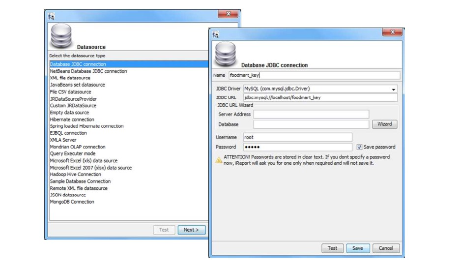

Jasper reporting
================

Jasper is a stand-alone reporting tool developed by the Jaspersoft Community. An example of Jasper report is represented in the next figure. Jasper Report Engine manages Jasper report templates inside Knowage Server. A report template for Jasper is a text file with .jrxml extension that can be manually modified by very expert users by editing XML code. Otherwise, iReport, a graphical template designer, is provided for all developers who want to easily design a report for this engine.

.. _exjasperreprt:
.. figure:: media/image342.png

    Example of a Jasper report.

Plese note that this engine is available only in KnowageER.

Document defintion\*
----------------------

Unlike the BIRT designer, iReport is not integrated in Eclipse. Therefore, before starting developing the report, you must download it from the website http://community.jaspersoft.com/project/ireport-designer/releases.
   
.. note::
      **iReport download**
         
         Download the iReport designer at <http://community.jaspersoft.com/project/ireport-designer/releases>. Knowage support any kind of version.

Then you will have to set the path to the iReport designer in Knowage Studio. Open Window > Preferences > iReport Editor Configuration and set the correct path to the ireport.exe file.

.. figure:: media/image343.png

    iReport Configuration in Knowage Studio.

Similarly to the case of a BIRT report, the design and deployment of a Jasper report with Knowage Studio consists of the following steps:

-  create the empty document,
-  switch to the report designer perspective,
-  create the data source,
-  create the dataset,
-  design the report via the graphical interface,
-  deploy the report on the server.

To create a new Jasper report, right-click on the **Business Analysis** folder and select **Report** > **Report with Jasper**. This will open an editor where you can choose a name for your document. The new document will be created under the Business Analysis folder.

Double click on the report to open the editor: the iReport editor will be launched inside Knowage Studio. Now you are ready to start to develop your report.

The next steps consist in the creation of a datasource and of a dataset. As described in section “Dataset definition”, Knowage Studio allows the development of analytical documents using either internal or external datasets. In this example we will show how to create a report with an internal dataset.

Click on the small icon |image348| of the menu bar. The data source creation editor will open.

.. |image348| image:: media/image344.png
   :width: 30

Select a JDBC data source, set the appropriate parameters and give the data source a name. Figure below shows the wizards that present in this procedure.

    Creation of a JDBC data source in a Jasper report.

Once you have defined the data source, create your dataset. Note that Jasper only allows one main dataset. By the way, secondary datasets can be added if needed. Right-click on the report item and select **Add dataset**. The dataset editor will guide you through the dataset definition. You can either manually edit the SQL query or use the design query tool provided by iReport.

The tree located in the left part of the window shows the elements of the report. On the right, the **Palette** shows all graphical elements you can add. You can choose to see your report within the **Designer**, to inspect the **XML** code or to look at the **Preview** of your report. If you click on the |image350| icon you can edit and preview your query. As you can see, the iReport designer allows the creation of complex reports, with different graphical elements such as cross tabs, charts, images and different text areas. We see now shortly how to design a very simple report, i.e. a report containing a table showing data from the defined dataset.

.. |image350| image:: media/image346.png
   :width: 30

.. figure:: media/image347.png

    Data Set definition.

To create a table, click on the element in the Palette and use the wizard. Figure below exhibits the Jasper editor interface. 
   
.. figure:: media/image348.png

    iReport graphical editor.

To insert dataset columns into the report, use the syntax showed in following syntax to insert dataset columns.

.. code-block:: bash
        :linenos:
        :caption: Syntax to insert dataset columns.
        
             $F{name_of_dataset_column}

Once the document has been developed, technical users can use Knowage Studio deployment service to easily register the report with its template on Knowage Server. Alternatively, any valid Jasper template (developed with or without Knowage Studio) can be directly uploaded to Knowage Server using the web interface for the document management.

This section does not provide any further detail about graphical development since it focuses on specific aspects of Knowage Jasper Report Engine. All Jasper standard functionalities work with Jasper Report Engine. For a full overview of Jasper reporting tool and a detailed developer guide, please refer to the official documentation at `http://community.jaspersoft.com/`.

