Key Performance Indicator
=====================================

KPI stands for Key Performance Indicator. It denotes a set of metrics, usually derived from simple measures, which allow managers to take a snapshot on key aspects of their business. The main characteristics of KPIs follow:

-  summary indicators,
-  complex calculations,
-  thresholds supporting results evaluation,
-  reference target goals,
-  easy to use but requiring more specific skills to design it,
-  association with alarms,
-  not necessarily used for real-time analysis,
-  may refer to a specific time frame.

For these reasons, KPIs are always defined by expert analysts and then used to analyze performances through synthetic views that select and outline only meaningful information.

Knowage allows the configuration of a KPI document thanks to a specific **KPI engine**. The critical value (or values) can be computed and visualized through the functionalities available in the ’KPI model’ section of Knowage menu area (see the next figure).

KPI development
-------------------

We introduce the KPI tool by splitting the topic in steps. We briefly sum up here the arguments that we will cover in the following sections in order to have a general overview of the KPI implemetation.

-  **Measure definition**: it is necessary to define first the measures and attributes, eventually with parameters, to compute the critical value of interest.
-  **KPI definition**: here you compute the requested value through a formula using the measures and attributes set in previuos step and  configure thresholds.
-  **Target**: it is possible to monitor the value of one or more KPIs comparing it to an additional fixed value.
-  **Schedulation**: you can schedule the execution of one or more KPIs, eventually filtered by conditions.
-  **Document creation**: finally, you develop the KPI document.

Therefore, we go into further details.

**Measure definition.** The first step is to create a new measure or rule. Select **Measure/Rule Definition** from the contextual menu of the main page, as shown below.

.. _measureruledefmenu:
.. figure:: media/image121.png

    Measure/Rule Definition menu item.

Click on the “Plus” icon to set a new measure/rule. A query editor page is opened. Note that once the data source is selected, pressing simultaneously the CRTL key and the space bar opens a contextual menu containing the available datasource columns and the database keywords. Refer to thefollowing figure to have an example.

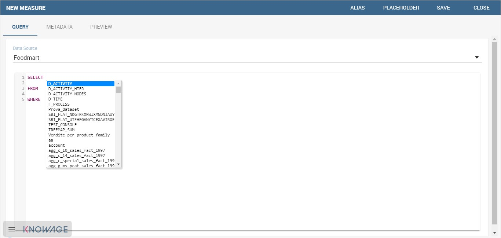

    Editing the query when defining a KPI.

Each rule is based on a query to which you can add placeholders. A placeholder represents a filter that you can add to your rule and that can be useful for profiling tasks. It is possible to assign value to a placeholder while configuring the schedulation of the KPI (this procedure will be further examined in “Document creation” paragraph). The syntax to use in queries for setting a placeholder is columnName=@placeholderName, as the example in figure below shows.

.. figure:: media/image123.png

    Setting placeholder in query definition.

Generally the rule such a query can return one or more measures and possibly an attribute. An example is given below.

.. figure:: media/image124.png

    Query definition.

A typology (measure, attribute and temporal attribute) and a category can be assigned to each fields returned by the query using the **Metadata** tab as highlighted in the next figure. The typology is required to associate a type to each field returned by the query. In particular, if the field is a temporal one, it is mandatory to specify to which level you want it to be considered, that is if it corresponds to a day, a month, a year, a century or a millennium. For measures and attribute it is possible to assign also a category to easily look them up in a second moment.

.. _metadatasettings:
.. figure:: media/image125.png

    Metadata settings.

We say in advance that, it is important to distinguish these metedata categories from the required field “Category” that occurs while saving the KPI definition (see next figure).

.. _kpidefinitioncat:
.. figure:: media/image161.png
    
    Category assigned when saving a KPI definition.

In fact, the category assigned when saving the KPI definition will be added (if it doesn’t exist) in the “KPI categories“ list, used to profile KPIs on roles (see Figure below).

.. _kpicategory:
.. figure:: media/image126.png
    
    KPI category.

.. warning::
      **Do not mistake metadata category with the KPI category**
         
         The category defined in the metadata tab of the "Measure definition" functionally are not the same categories selected in the tab area of the "Roles management" functionality (see the figure above). The first are used to classify the metadata while the second are needed for the profiling issue.

As we told, a proper categorization exists for the aggregations of type temporal. In fact, when associating “temporal attribute” as metadata typology, the technical user must indicate the hierarchy level of the data: day, month or year. You can see an example in the following figure. Note that the field set as temporal type must contains numbers (therefore string types are not allowed). For example, if one wants to set a field as “month”, such a field must contain {01,02,03,...,12} that will be considered as {January, February, March,...,December}.

.. _hierarchyleveltempattrib:
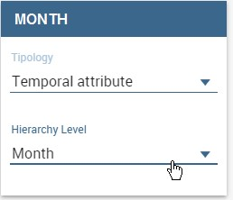

    Hierarchy level for temporal attributes.

The **Preview** tab allows you to check the query execution and have a look on a part of the result set.

Let’s now examine extra features available on the right top corner. There you can find the following tab:

-  **Alias**: you can see the aliases defined in other rules; note that only the aliases of those colums saved as attribute are stored and showed. This is useful in order to avoid aliases already in use when defining a new rule. Indeed an alias can not be saved twice even if contained in different rules.

.. figure:: media/image128.png

    Checking aliases.

-  **Placeholder**: here you can check the existing placeholders. These are set in the query you’re editing or in other ones.

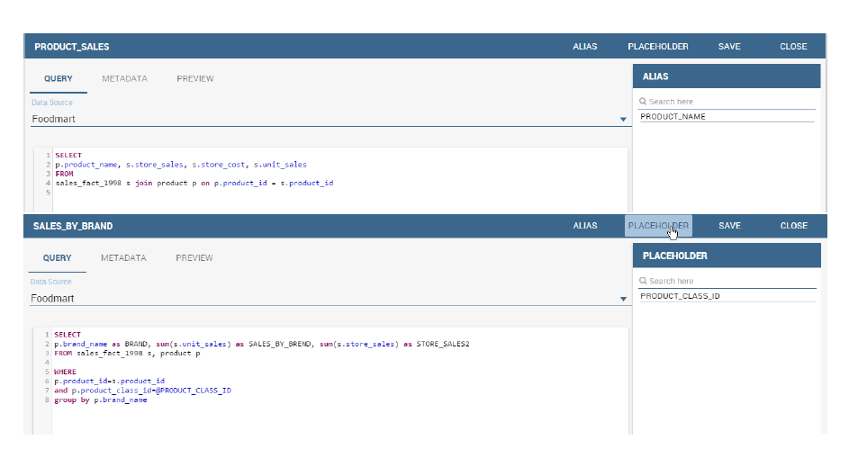

    Setting placeholders in a query.
   
-  **Save**: to save the query and other settings just configured.
-  **Close**: to exit the rule configuration window.

**KPI definition.** Select the **KPI definition** item from the contextual menu of the main page of Knowage, as shown in figure below. Click on the “Plus” icon to configure a new KPI.

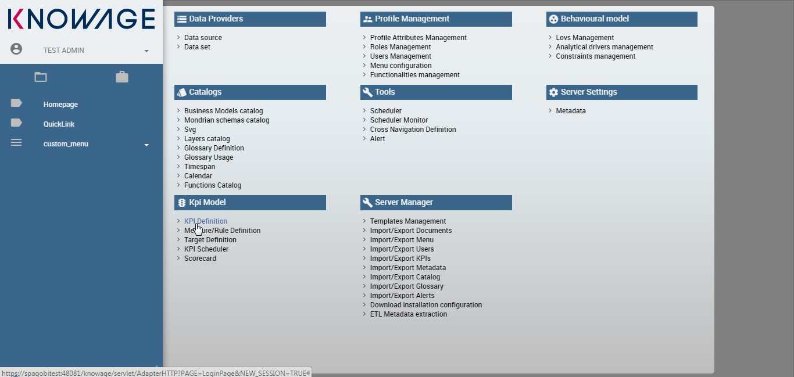

    Configure a new KPI.

The window opens a first tag, entitled **Formula** (see figure below), where you must type the formula to enable calculations.

.. figure:: media/image132.png

    Formula definition tab.

Press CTRL key and space bar simultaneously to access all measures defined in the rules, as shown below.

.. _pressctrlspacemeasure:
.. figure:: media/image133.png

    Press crtl and space to get measures.
  
Once a measure is selected, you need to choose which function must act on it. This can be done by clicking on the *f*\ () that surrounds the chosen measure. See figure below.

.. _formulasyntax:
.. figure:: media/image134.png

    Formula syntax.

Clicking on the *f*\ () the interface opens a pop up where you can select which function apply to the measure, see figure below. Once the selection is made the formula will be autofilled with the proper sintax and you can go on editing it.

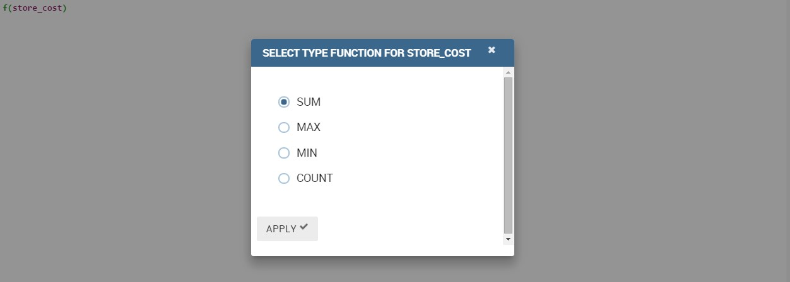

    Available functions.

Once a complete formula (an example is given in figure below) has been inserted you can move to the next tab.

.. figure:: media/image136.png

   Complete formula example.

The **Cardinality** tab allows you to define the granularity level (namely the grouping level) for the attributes of the defined measures.

Referring to the example below, selecting (with a check) both measures for the attribute product_name, the KPI measures are computed, grouped on each product_name; otherwise no grouping will be done.

.. figure:: media/image137.png

    Cardinality settings example.

Limit values can be set using the Threshold tab (Figure below). It is mandatory to set at least one threshold otherwise the KPI cannot be saved. You can choose a threshold already defined clicking on “Threshold” list or create a new one.

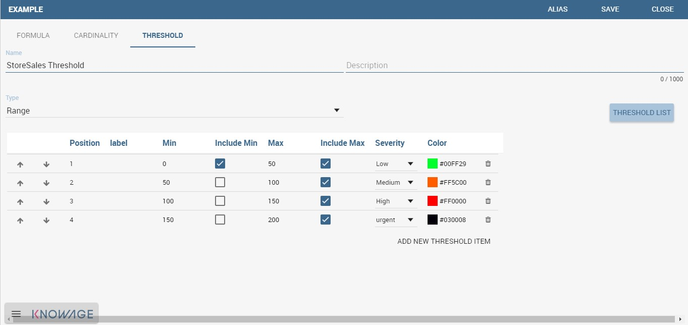

    Setting thresholds.

To insert a new threshold it is mandatory to insert a name and assign a type, while the description is optional. Clicking on **Add new threshold** item a new item appears. It is necessary to define the **Position**, **Label**, **Minimum** and **Maximum** values. It is possible to choose if to include the minimum and maximum values in the value slot. The **Severity** is used to link colors to their meaning and make the thresholds readable by other technical users. Note that the color can be defined through the RGB code, the hexadecimal code or choosing it from the panel.

Remember to save once all thresholds have been set.
   
.. warning::
      **"Standard" colors for thresholds**
         
         Well call **standard colors** for thresholds the ones listed below (in terms of hexadecimals):
         
            - green: #00FF00,
            - yellow: #FFF00,
            - red: #FF0000.

Finally the user must save the KPI definition clicking on the “Save” button, available at the right top corner of the page. Once the user clicks on the “Save” button, the “Add KPI associations” wizard opens, as you can see from next figure. Here, it is mandatory to assign a name to the KPI. In addition, the user can set the KPI category so that only users whose roles have the permmissions to this specific category can access the KPI. Remember that it is possible to assign permissions over KPI when defining roles using the “Roles management” functionality available on Knowage main page. Furthermore, the user can check or uncheck the “\ **Enable Versioning**\ ” button if he/she wishes to keep track of the rules/measures/targets that generate the KPI response at each KPI execution.

.. _savekpidefcategory:
.. figure:: media/image139.png

    Save the KPI definition and set category.

**Target.** This step is not mandatory. Enter the **Target Definition** menu item as shown below.

.. figure:: media/image140.png

    Target Definition menu item.

Clicking on the “Plus” icon you can add a new target (Figure below).

.. figure:: media/image141.png

    Add a new target.

The definition of a new target requires to type a name, a validity start date/end date and the association to at least one target. It is possibile to associate a target clicking on the item **Add KPI** and selecting the KPI of interest. Once the association is set, the “Value” box gets editable and you can insert the value you wish to send to the selected KPI. An example is given in figure below. 

.. _kpitargetassoc:
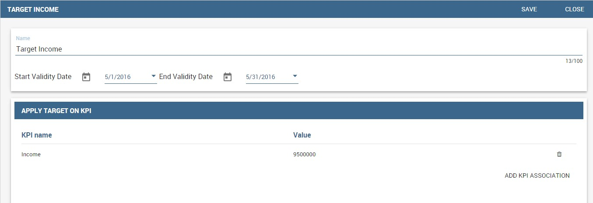

    KPI target association.

In the KPI visualization phase, a red bold thick will be displayed on the indicated value (see next figure).

.. _targetmarkkpiscale:
.. figure:: media/image143.png

    Target mark in KPI scale of values.

Note that once targets are set, the window in Figure 7.20 gets populated with a list. Note that here the category serves as description and only to order the records.

**Schedulation.** Once the KPI has been defined, it is necessary to schedule them to proceed with the creation of an analytical document. For this purpose, click on the **KPI Scheduler** from the contextual menu that you can see below.

.. figure:: media/image144.png

    KPI Scheduler menu item.

As for the other interfaces it is enough to click on the “Plus” icon to create a new schedulation. The new schedulation window presents several tabs.

-  **KPI**: it is possible to associate one or more KPI to the schedulation clicking on “Add KPI Association”.
 
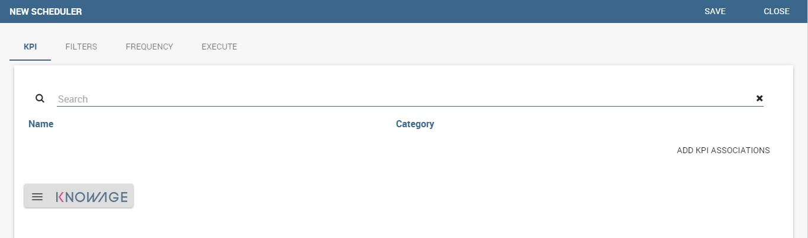

    KPI tab window.
 
-  **Filters**: here you assign values to the filters (if configured) associated to the schedulation. Note that it is possibile to assign values to the filters by means of a LOV, a fixed list of values or a temporal function. In case the LOV option is chosen, remember that the LOV must return one unique value. This choice can be useful for profiling tasks.

.. figure:: media/image146.png

    Filters options.

-  **Frequency**: here is the place where the schedulation time interval (start and end date) can be set together with its frequency.

.. figure:: media/image147.png

     Frequency tab window.

-  **Execute**: here you can select the execution type. The available options distinguish between the storing and the removal of old logged data. In fact, selecting **Insert and update** the scheduler compute the current (accordingly to the frequency choice) KPI values and store them in proper tables without deleting the old measurements and all error log text files are available right beneath. While selecting **Delete and insert** the previous data are deleted.

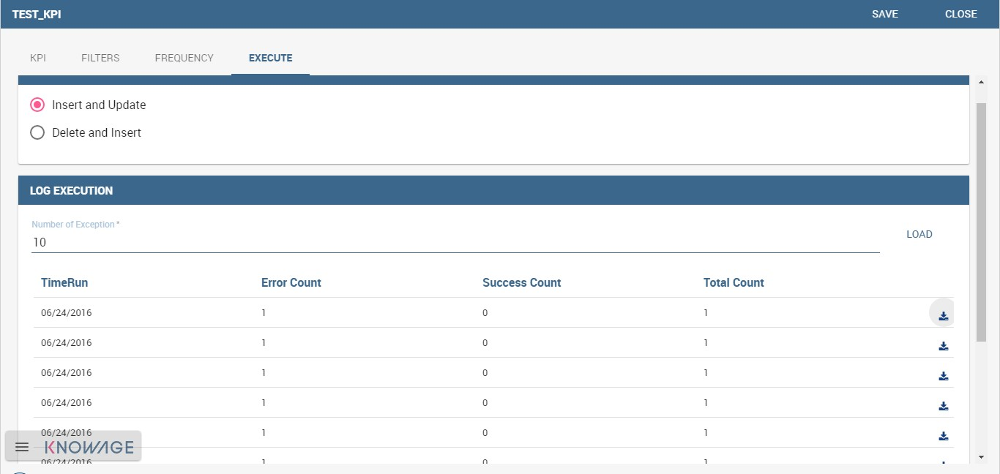

    Execute tab window.

In Figure below we sum up the example case we have referred to since now.

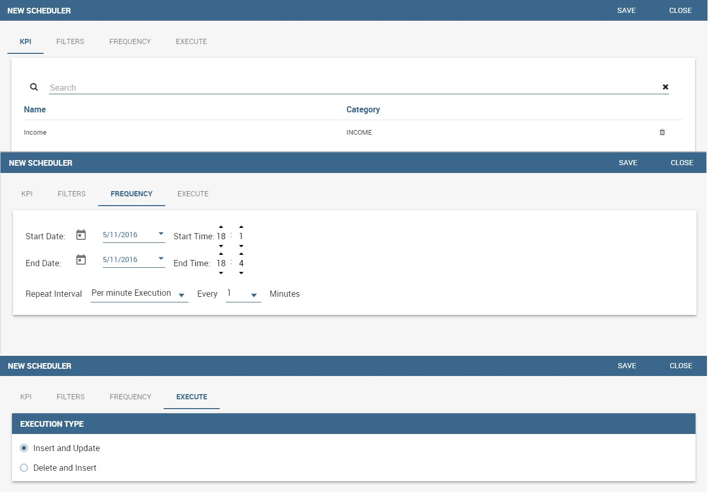

    Overview of the KPI case.

Once the schedulation is completed click on the “Save” button. Remember to give a name to the schedulation as in the following figure.

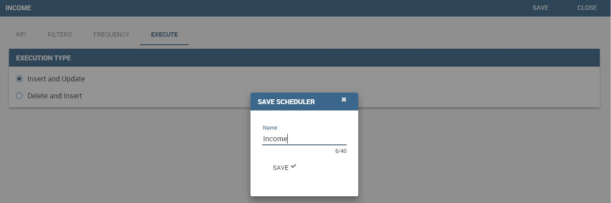

    Creation of a KPI Document.

Creation of a KPI document
------------------------------

**Document creation.** Now the schedulation has been set and it is possible to visualize the results. We need at this point to create a new analytical document of type KPI and that uses the KPI engine (Figure below). Then we save.

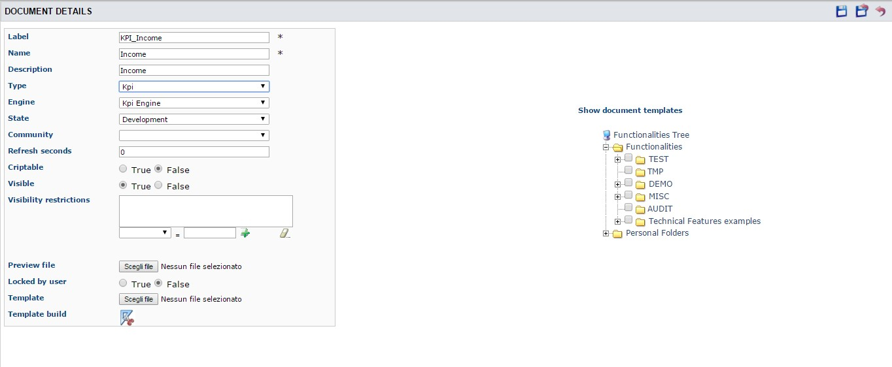

    Overview of the KPI case.

Click on the **Template build** icon to develop the template. Here you can choose between KPI and Scorecard (refer to Scorecard Chapter for details on the Scorecard option). In the KPI case it is possible to choose between the two following type of document.

-  **List**: with this option it is possible to add several KPI that will be shown in the same page with a default visualization.
-  **Widget**: with this option it is always possible to add several KPI that will be shown in the same page but in this case you will also be asked to select its visualization: Speedometer or KPI Card; then the minimum value and the maximum value that the KPI can assume and if you want to add a prefix or a suffix (for example the unit of measure of the value) to the showed value.

Then practically you must add the KPI association using the KPI List area of the interface. As you can see in figure below you can select the KPI after clicking on the “ADD KPI ASSOCIATION” link. The latter opens a wizard that allows to pick up a multiple choice of the KPIs. Once chosen, you need to specify all empty fields of the form, like “Category”, “View as” and so on (refer to figure below). Note that the “View as” field is were you can decide if the widget will be a Speedometer or a KPI Card.

.. figure:: media/image152.png

    Setting the KPI associations using the dedicated area.
   
Moreover, you can set the other properties of the KPI document using the **Options** and the **Style** areas (Figure below).

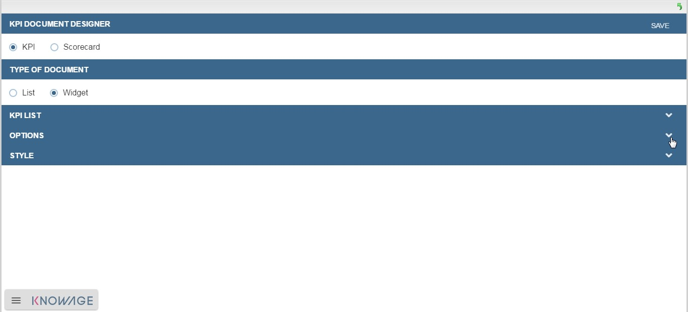

    Areas of the Template Build for KPI.

In particular, it is possible to steer the time granularity used by the KPI engine to improve the performances. For this purpose, in the “Options” area (following figure) the user is invited to indicate the level of aggregation choosing among “day”, “week”, “month”, “quarter”, “year”.

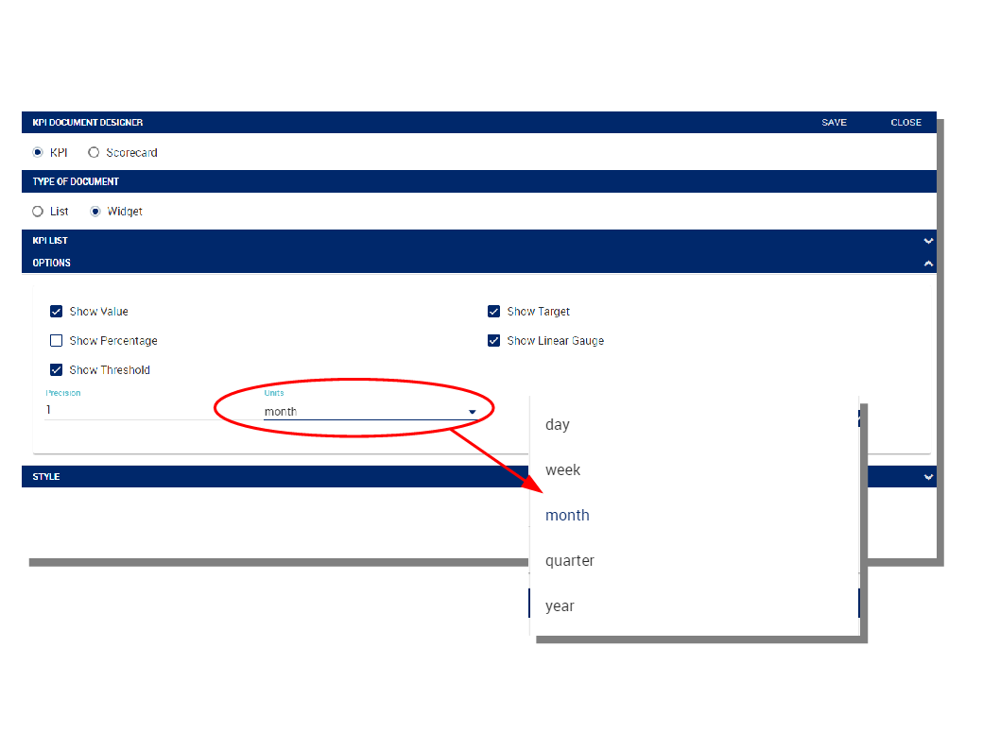

    Choose the time granularity.

Finally in the “Style” area the user can customize the size of the widget, the font, the color and size of texts.

.. figure:: media/image155.png

    Style settings.

Then save and run the document. Examples are shown in the last three figures below.

In case the document contains KPIs that involves grouping functions upon some attributes, it is possible to filter data returned on those attributes. To easily retrieve the attributes on which measures are grouped, it is sufficient to check the fields listed in the "Cardinality" tab of the KPI definition. WE recall it in the picture below.

.. figure:: media/image137.png

    Cardinality settings example.

Then to use them to filter the document, first add the proper analytical drivers. Refer to Section 5.4 to get more information about how to associate an analytical driver to a document (and therefore to a KPI document). Then it is mandatory that the URL of the analytical driver *must* coincide with the *attribute aliases* on which you have defined the grouping.

.. _kpiassociation:
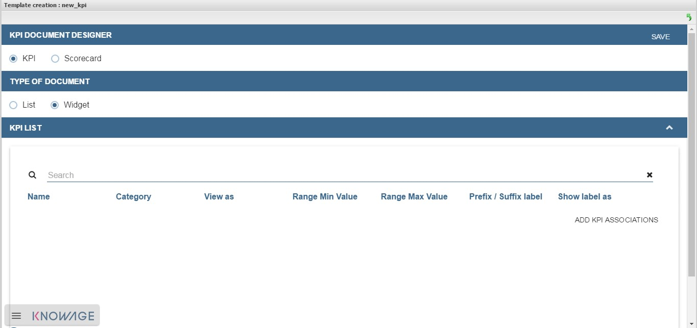

    KPI association.

.. _widgetdocument:
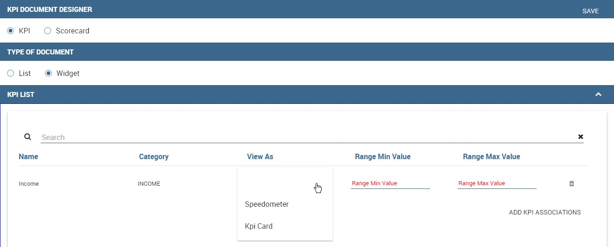

    Widget document.

.. _kpispeedometer:
.. figure:: media/image158.png

    KPI Speedometer.

.. _kpicard:
.. figure:: media/image159.png

    KPI Card.

.. _kkpilist:
.. figure:: media/image160.png

    KPI List.

