# Inteligencia de ubicación

La inteligencia de ubicación se basa en la idea de que los espacios geográficos son una dimensión analítica particular en el dominio de BI. Se basa en:

*   la representación geográfica de los datos,
*   interacción con sistemas SIG,
*   datos espaciales,
*   operadores espaciales.

Location Intelligence suele garantizar:

*   una percepción inmediata de la distribución de un fenómeno en una zona geográfica,
*   interactividad
*   análisis multivariante,
*   instantáneas temporales.

La inteligencia de ubicación se está utilizando ampliamente, principalmente gracias a la aparición de servicios de ubicación como Google Maps. Este dominio es muy fácil de usar para todo tipo de usuarios, generalmente analistas y perfiles operativos. Por el contrario, su gestión no es tan fácil, sobre todo si implica una gestión interna de la base de datos geográficos.

## Conceptos básicos

El término Location Intelligence se refiere a todos aquellos procesos, tecnologías, aplicaciones y prácticas capaces de unir datos espaciales con datos empresariales, con el fin de obtener información crítica, apoyar mejor los procesos de toma de decisiones y optimizar las actividades comerciales.

A nivel tecnológico, esta correlación es el resultado de la integración entre los sistemas de software que gestionan estos dos tipos heterogéneos de datos: los sistemas de información geográfica (SIG), que gestionan datos espaciales, y los sistemas de Business Intelligence (BI), que gestionan los datos empresariales. Esta integración da lugar a nuevas herramientas tecnológicas que apoyan los procesos de toma de decisiones, y el análisis sobre aquellos datos de negocio que están directa o indirectamente relacionados con una dimensión geográfica.

Las aplicaciones de Location Intelligence mejoran significativamente la calidad del análisis de los usuarios en función de una dimensión geográfica. De hecho, un data warehouse (DWH) casi siempre incluía dicha información. Al representar la distribución geográfica de una o más medidas comerciales en mapas temáticos interactivos, los usuarios pueden identificar rápidamente patrones, tendencias o áreas críticas, con una efectividad que sería inviable utilizando herramientas analíticas tradicionales.

## Más información sobre SIG y datos espaciales\*

Datos espaciales

```

The term *spatial data* refers to any kind of information that can be placed in a real or virtual geometric space. In particular, if the spatial data is located in a real geometric space — which is a geometric space that models the real space — it can be defined as *geo-referenced* data.

.. figure:: media/image374.png

    A base layer in raster and vector format.

Spatial data are represented through graphical objects called maps. Maps are a portrayal of geographic information as a digital image file suitable for display on a computer screen.

According to the *Open Geospatial Consortium* (OGC) definition, a map is made of overlapping *layers*: a *base layer* in raster format (e.g. satellite photo) is integrated with other layers (*overlays*) in vector format. Each overlay is made of homogeneous spatial information, which models a same category of objects, called *features*.

A feature is called *geographic feature* when the constituting objects are abstractions of real-world physical objects and can be located univocally within a referencez coordinate system, according to their relative position.

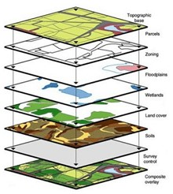

    Overlapping layer.

A feature includes:

-  a set of attributes that describes its geometry (vector encoding). Geometric attributes must describe its relative shape and position in an unambiguous way, so that the feature can be properly drawn and located on the map, according to the other features of the layers.
-  a set of generic attributes related to the particular type of physical object to be modeled. Generic attributes are not defined: they vary according to the type of abstraction that users want to give to each real-world physical object.

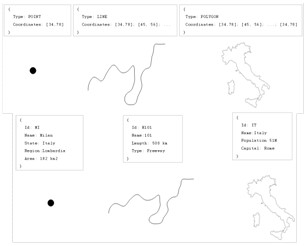

    Examples of feature.

There is a wide range of standards that can be used for the vector encoding of spatial data (e.g. GeoJSON, GML, Shape File, etc.). Most geographic information systems can perform the needed conversions among various encodings.

GIS
~~~

Geographic Information Systems (GIS) provide a set of software tools designed to capture, store, extract, transform and display spatial data. Therefore, the term GIS refers a set of sole technological components that manage the spatial data during its whole life cycle, starting from the capture of the data up to its representation and re-distribution.

From a logical point of view, the key functionalities of a GIS do not differ from those of a BI system. Both systems are characterized by some specific components supporting the effective storage of data, some others supporting their manipulation, their re-distribution or their visualization. On the other hand, the implementation of these functionalities deeply differs between GIS and BI systems, since they deal with two different types of data (alphanumeric and spatial data).

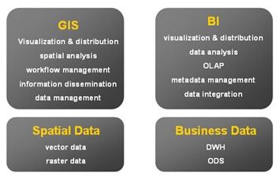

    Definition of GIS, BI, spatial data and business data.

Unlike the market of BI suites, the market of GIS is characterized by a wide spread of open standards, adopted by all main vendors, which regulate the interaction among the various components of the system at all architectural levels.

.. note::
         **Open Gesospatial Consortium (OGC)**

            The most important International organization for standardization in the GIS domain is the Open Geospatial Consortium (OGC), involving 370 commercial, governmental, non-profit and research organizations. Read more at `www.opengeospatial.org. <http://www.opengeospatial.org/>`__


As for the integration between GIS and BI systems, the OGC has defined two main standards supporting the re-distribution of the spatial data:

-  the *Web Map Service* (WMS). It describes the interface of services that allow to generate maps in a dynamic way, using the spatial data contained in a GIS.
-  the *Web Feature Service* (WFS). It describes the interface of services that allow to query a GIS, in order to get the geographic features in a format that allows their transformation and/or spatial analysis (e.g. GML, GeoJson, etc.).

.. note::
         **WMS and WFS standards for spatial data distribution**

            Full documentation about the WMS and WFS standards can be found at `www.opengeospatial.org/standards/wms <http://www.opengeospatial.org/standards/wms>`__ and `www.opengeospatial.org/standards/wfs. <http://www.opengeospatial.org/standards/wfs>`__
 
Knowage suite offers an engine supporting the Location Intelligence analytical area, the **GEOReport Engine**, generating thematic maps.

Analytical document execution
----------------------------------

Let’s have a look on the user interface of Knowage Location Intelligence features.

In Figure belowwe provide an example of a BI analysis carried out thanks to map. In our example, the colour intensity of each state shown proportionally increases according to the value of the indicator selected. States who have no record connected are not coloured at all.

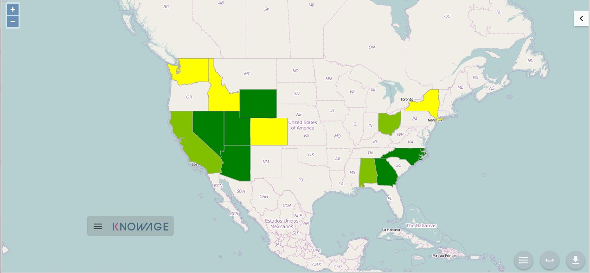

    Example of GIS document. USA sales per store

Click on the arrow on the top right to open the Location Inteligence options panel. Here you can choose the **Map Type**, the indicators to be displayed on the map and you can enter filters.

.. figure:: media/image35354.png

    Arrow button (left) Location Inteligence options panel (right) .

The **Map Type** available are:

-  **Map Zone**: the different map zone are filled with different colour range according to the indicator values
-  **Map Point**: the indicator values are displayed by points with differs on the radius. A bigger radius means a higher indicator’s value.
-  **Map Chart**: thanks to this visualization type you can compare more than one indicators simultaneously. Choose which indicators compare among the available ones. You have to mark them in the **indicator** panel area to visualize them. The charts appears on the map displaying the selected indicators’ values.

These three typologies of data visualization on map are compared below.

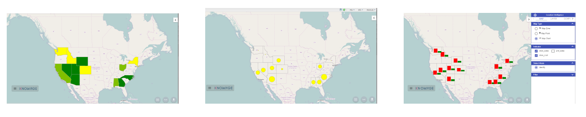

    Map Zone (left) Map Point (center) and Map Chart (right).

Now you can add extra layers on the default one. Switch to the **layer** tab of the Location Inteligence options panel.

Here click on **select form catalog**, choose the layers you want to add. Mark them in the bottom part of the Location Intelligence area in the Layer box and the selected layer are displayed. These steps are shown in figure below. 

.. _stepsforlayeradd:
.. figure:: media/image358.png

    Steps for layer adding
    
In our example we upload some waypoints, you can see the results obtained in next figure.
   
.. _mapwithlayers:
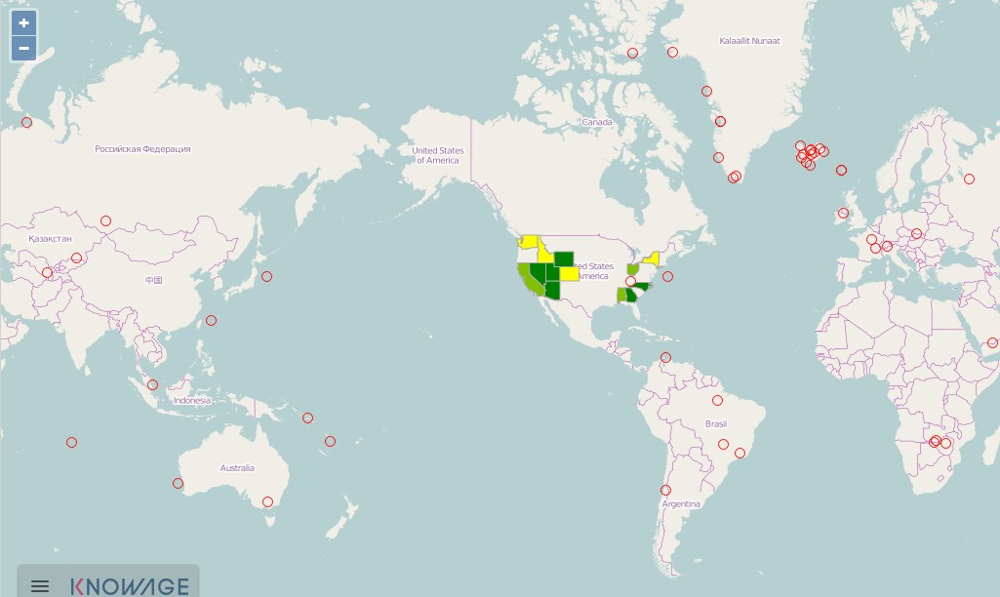

    Map with two layers

Now let’s focus on **Configuration** tab of Location Inteligence panel option. Here you can set some extra configurations. Let’s have a look them for each data visualization typology.

For the **Map Zone** you can set:

-  **Method**: the available ones are quantiles or equal intervals. If you choose quantiles data are classified into a certain number of classes with an equal number of units in each classe. If you choose equal Intervals the value are divided in ranges for each classe, the classes are equal in size and their number can be set. The entire range of data values (max - min) is divided equally into however many classes have been chosen.
-  **N°of classes**: the number of intervals in which data are subdivided.
-  **Range colours**: You can choose the first and the last colour of the range. For both of them you can use a colour pixer by clicking on the coloured square. An example is provided below.

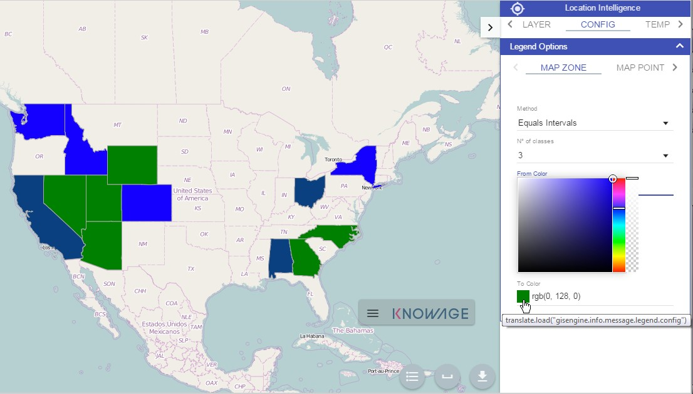

    Map Zone extra configurations

For the **Map Point** you can set:

-  **Colour**: the colour of the circle.
-  **Min/Max value**: the minimum and the maximum circles radius.

For the **Map Chart** you can set the colour of each chart’s bar.

The last tab of the panel is dedicate to the template preview, it is provided for advanced user who want to have an approach on generated code.

We can conclude our overview on GIS document describing the buttons located at the bottom right corner, you can see them underlined in the following figure. From the left to the right this bottons can be used for: have a look at the legend, compute a measure of an area of the map and do the .pdf export of the map.

.. _legendmeasurexport:
.. figure:: media/image361.png

    From the left to the right: Legend, Measure and Export bottom.

Extra functionalities
```

Volvamos a la pestaña principal de la capa de ubicación y nos centramos en el **Seleccionar modo** área. Si se ha configurado la navegación cruzada, encontrará dos opciones: **identificar** y **Navegación cruzada**.

Escoger **Navegación cruzada**el **Elemento espacial** aparece la pestaña. En esta pestaña puede configurar su selección. Para hacer su selección, oculte la tecla CTRL y elija el área en el mapa con el mouse. Si eliges **cerca**, se seleccionan las características del conjunto Km. Si eliges **cruzar**, las características cuyos bordes se cruzan con el área diseñada. Si eliges **adentro**, solo las características completamente dentro de su área de selección se consideran para la navegación cruzada.

Cuando se realiza la selección, aparece un cuadro. En este cuadro encontrará información de navegación cruzada. El número de entidades seleccionadas y un botton para realizar la navegación cruzada con la selección activa.

## Creación de plantillas con el diseñador SIG

Las plantillas de documentos del motor SIG ahora se pueden crear utilizando el diseñador SIG. El Diseñador está disponible en la página de detalles del documento del administrador (para esta parte, consulte la Sección 15.8) y también para el espacio de trabajo de los usuarios finales. El proceso de creación y las secciones del diseñador se describen en el texto a continuación.

Un usuario final puede crear un documento SIG desde el área de trabajo de Knowage Server. Siga My Workspace » Análisis y haga clic en el icono "Plus" disponible en la esquina superior derecha de la página e inicie un nuevo **Análisis georreferenciado**.

.. figura:: media/image362.png

    Start a new Geo-referenced analysis.

Cuando se abre el diseñador, existe la opción de elegir el conjunto de datos para unir datos espaciales y datos profesionales. Cuando se selecciona el conjunto de datos, aparecerán las secciones Columnas e indicadores de unión de conjuntos de datos. De forma predeterminada, el conjunto de datos no está elegido y hay una interfaz para crear un mapa sin datos profesionales

.. figura:: media/image363.png

    GIS document designer window.

## Secciones de diseño

Sección de capa

```

Definition of the target layer is configurable in layer section. If the dataset is selected one of the available layers is chosen from list of layers catalogs. Button change layer (next figure) opens a pop up with a list of all available layer catalogs. Selecting one item from the list and clicking save the selected item will be chosen for template.

.. _targetlayerdef:
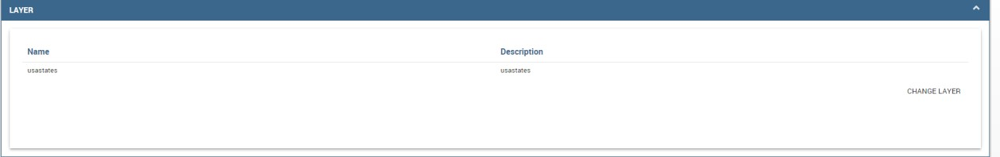

    Target layer definition.

.. _listavailbcatalog:
.. figure:: media/image365.png

    List of available layer catalogs.

In case when there is no dataset multiple layers can be selected below.

.. figure:: media/image366.png

    Multiple selection of available layers.

Dataset join columns
```

La sección columnas de unión al conjunto de datos es para configurar la unión de datos espaciales y datos profesionales. Esta sección solo está presente cuando se selecciona el conjunto de datos para el documento. La estructura de datos del diseñador para unirse está representada por los pares de columnas de dataset y columnas de capa correspondientes. Al hacer clic en agregar columna de unión que puede ver en la figura debajo aparece un nuevo par vacío. La columna de unión al conjunto de datos se puede seleccionar entre las columnas del conjunto de datos seleccionado eligiendo una opción del cuadro combinado. La columna de unión de capas debe agregarse como texto libre editando la columna de tabla correspondiente.

.. figura:: media/image367.png

    Dataset join columns interface.

Indicadores

```

Measures definition is configurable by adding indicators. The interface is shown below. This section is only present when dataset is chosen for the document. Indicators are represented by pairs of measure field from selected dataset and corresponding label that will be used on map. Clicking on add indicators creates empty pair. Measure filed should be selected by picking one option from combo box that contains measure fields from selected dataset. Label should be inserted as free text by editing corresponding table column.

.. _indicatorsinterface:
.. figure:: media/image368.png

    Indicators interface.

Filters
~~~~~~~

Using the filtering dedicated area, as ahown in figure below, you define which dataset attributes can be used to filter the geometry. Each filter element is defined by an array (e.g. name : "store_country", label:"COUNTRY"). The first value (name : "store_country") is the name of the attribute as it is displayed among the properties. The second one label: "COUNTRY" is the label which will be displayed to the user. This section is only present when dataset is chosen for the document. Clicking on add filter creates empty pair. Label field should be selected by picking one option from combobox that contains attribute fields from selected dataset. Label should be inserted as free text by editing corresponding table column.

.. _filtersinterfac:
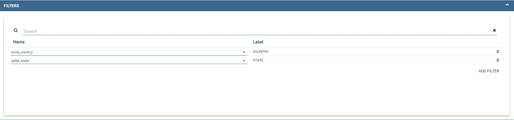

    Filters interface.

Map menu configuration
```

A través de la **Configuración del menú Mapa** Panel que el usuario puede desactivar para habilitar o deshabilitar algunas funciones y características disponibles, como la leyenda, la calculadora de distancia, etc. Vea la siguiente figura para echar un vistazo a los elementos disponibles.

.. \_mapmenuconfig:
.. figura:: media/image369.png

    Map menu configuration.

Filtros de capa

```

Here, as you can see from figure below, you define which target layer attributes can be used to filter the geometry. This section is only present when a dataset has been selected. Add filters button opens pop up where you can choose all available filters of the selected layers. Figure below gives an example.

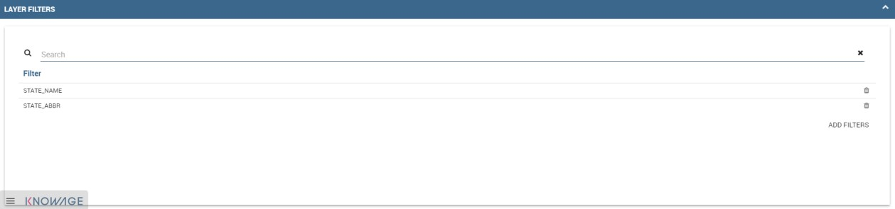

    Layer filters interface.
    
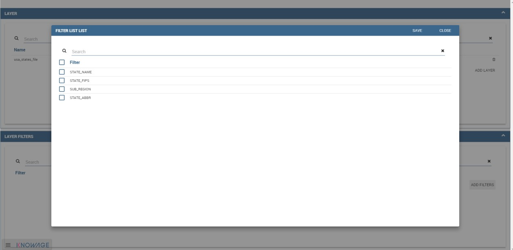

    List of available filters.

Edit map
~~~~~~~~

When all required fields are filled basic template can be saved. From workspace user is first asked to enter name and description of new created document as in the following figure. When the template is saved successfuly EDIT MAP button is enabled in the right part of the main toolbar.
    
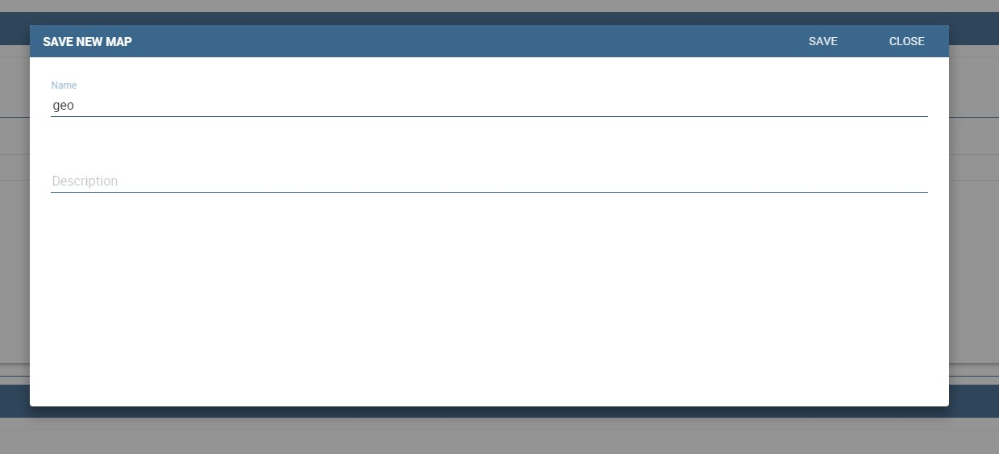

    interface for name and description of new geo document for end user.

Clicking the edit map button will open created map. An example is given below. In edit mode you are able to save all custom setting made on map.
   
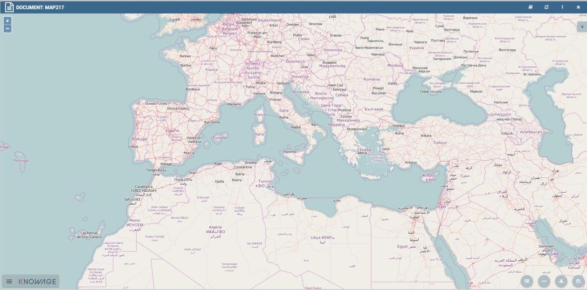

    Map in edit mode with save template available.

GEOReport Engine\*
-----------------------

The **GEOReport Engine** implements a *bridge integration* architecture.

Generally speaking, a bridge integration involves both the BI and the GIS systems, still keeping them completely separated. The integration between spatial data and business data is performed by a dedicated application that acts as a *bridge* between the GIS and the BI suite. This application extracts the spatial data from the GIS system and the business data from the BI suite, to answer the users’ requests. Afterwards, it joins them and provides the desired results.

In particular, the **GEOReport Engine** extracts spatial data from an external GIS system and join them dynamically with the business data extracted from the Data Ware House, in order to produce a thematic map, according to the user’s request. In other words, it acts as a *bridge* between the two systems, which can consequently be kept totally decoupled.

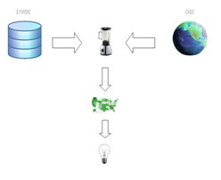

    Bridge integration architecture of the **GEOReport Engine**.

The thematic map is composed of different overlapping layers that can be uploaded from various GIS engines at the same time. Among them just one layer is used to produce the effective thematization of the map: this is called *target layer*.

You can manage your layers inside the **Layers Catalogue**.

Here you can upload the following layer types:

-  File;
-  WFS;
-  WMS;
-  TMS;
-  Google;
-  OSM.
   
Create a new layer clicking on the dedicated plus icon. On the right side you are asked to fill few settings before saving the new layer. Among these settings the firsts are equals for all types of layers. Once you choose the layer type, instead, some fields may change. This happens to manage all layers types from the same interface. For example if you choose **File** as type you have the possibility to chose your own .json file and upload it. After having done this, the path where your file is been uploaded is shown among the setting.

If you chose **WFS** or **WMS** you are asked to insert a specific url.

At the bottom part of layer configuration you can manage the layer visibility. Mark the role you want to give visibility previlegies on this layer. If none is marked, the layer is visibile to all role by default.

Once you have set all layer configuration you can switch to filter setting. Click on the tab you can find in the upper part of the screen, see the following figure.

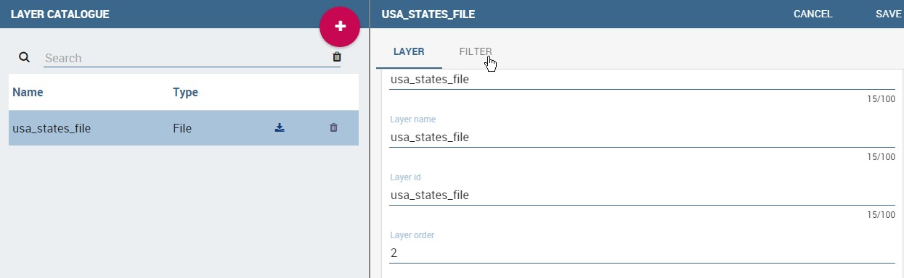

    Filter tab

Here you can choose which filters will be active during visualization phase. Choose among the properties of your layer, the available ones are only the string type.

Now you need to have a well-configured dataset to work with the base layer. The dataset has to contain one column matching a property field as type and contents otherwise you will not be able to correctly visualize your data on the map.

For example you can use a query dataset, connected to the foodmart data source, whose SQL query is shown in Code15.1.

.. code-block:: sql
      	 :caption: GeojSON file except.
         :linenos:
	 
         SELECT r.region_id as region_id
              , s.store_country
              , r.sales_state as sales_state
              , r.sales_region
              , s.store_city
              , sum(f.store_sales) + (CAST(RAND() \*60 AS UNSIGNED) + 1) store_sales
              , avg (f.unit_sales)+(CAST(RAND()\* 60 AS UNSIGNED) + 1) unit_sales
              , sum(f. store_cost) store_cost
         FROM sales_fact_1998 f
            , store s
            , time_by_day t
            , sales_region r 
         WHERE s.store_id=f.store_id 
         AND f.time_id=t.time_id 
         AND s.region_id = r.region_id                  
         AND STORE_COUNTRY = 'USA' 
         GROUP BY region_id, s.store_country,r.sales_state, r.sales_region, s.store_city                                     

   
Create and save the dataset you want to use and go on preparing the document template.

Template building with GIS designer for technical user\*
----------------------------------------------------------

When creating new location intelligence document using GIS engine basic template can be build using GIS designer interface. For administrator designer opens from document detail page clicking on build template button (refer to next figure). When the designer is opened the interface for basic template build is different depending on if the dataset is chosen for the document or not.

.. _gisdesigneraccestemplbuild:
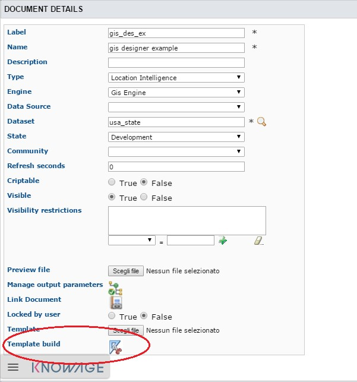

    Gis designer accessible from the template build.

We have already described the Gis Designer when it is accessed by a final user. Since the difference relies only in how the designer is launched we will not repeat the component part and recall to *Designer section* paragraph for getting details. By the way we highlight that there is a last slight difference when defining a filter on layers. In fact, using the administrator interface, if the document has analytical driver parameters, you can also choose one of the available parameters to filter the geometry, as shown below. It is not mandatory to choose layer filters so you can also save the template without any filter selected. 

.. _layerfiltranalytdriv:
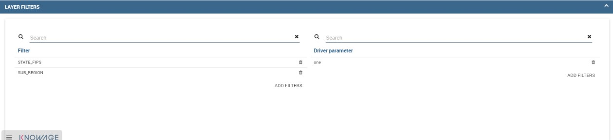

    Layer filters interface with analytical drivers.

When the list of selected layers is changed the filter list will be empty so you have to select filter list after filling the layer list, this is the way designer keeps consistency between layers and corresponding filters (see next figure).

.. _listavailfiltranalydriv:
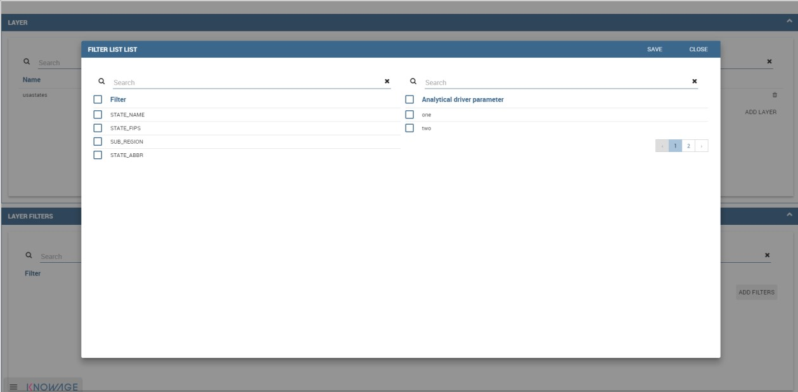

    List of available filters with list of analytical drivers.

Cross navigation definition\*
-----------------------------------

It is possible to enable cross navigation from a map document to other Knowage documents. This means that, for instance, clicking on the state of Texas will open a new datail documents with additional information relative to the selected state.

You need to define the output parameters as described in Section *Cross Navigation* of *Analytical Document* Chapter. The possible parameters that can be handled by the GIS documents are the attribute names of the geometries of layers.

Once you have created a new Cross Navigation in the Cross Navigation Definition menu in Tools section, it is possibile to navigate from the GIS document to a target document. There is still a little step to do to activate the cross navigation.

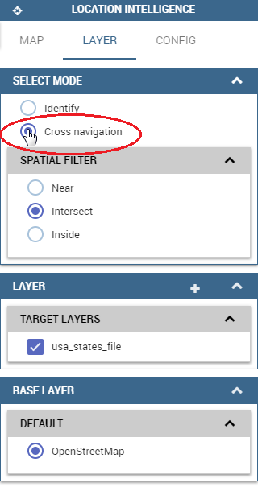

    Cross navigation option.

Open the **layer** tab of the Location Intelligence options panel and click on cross navigation select mode. Now the cross navigation is activated and if you click, for example, on one of the state it will compare the above popup.

.. figure:: media/image385.png

   Cross navigation popup.

By clicking on the play button the target document will open.

```
