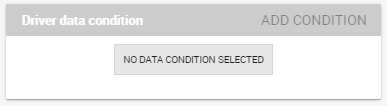
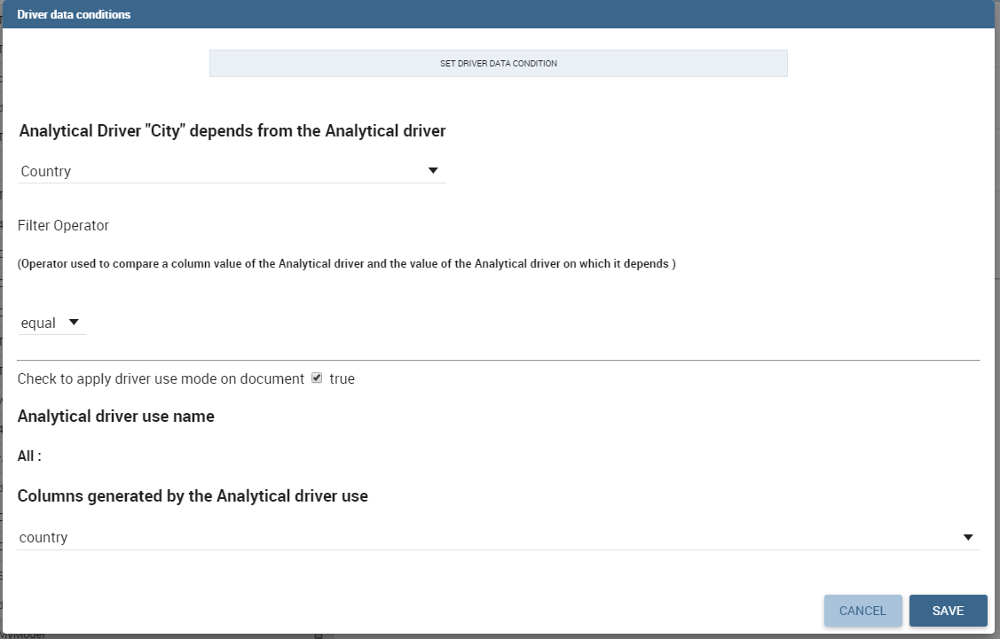
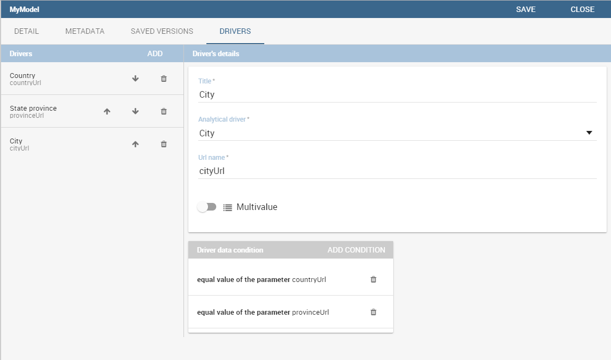
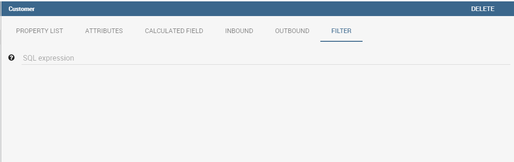
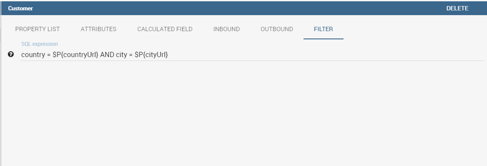

# Meta Web

En este capítulo entramos en detalles de cómo construir tu propio metamodelo. Knowage permite desarrollar y gestionar metadatos mediante el uso de una interfaz web que se denomina **Meta Web**. Recordamos que tratar con metadatos significa administrar datos que describen la estructura de un modelo relacional, es decir, tratar la relación entre tablas, columnas de tabla, claves, etc.

La Meta Web permite al usuario acceder a esta información mediante el uso de una interfaz gráfica y combinarlas, redefinirlas y consultarlas fácilmente en un modelo abstracto, garantizando la seguridad del modelo fuente. Además, hacemos hincapié en que los usuarios pueden realizar consultas sobre datos sin el uso de un lenguaje de consulta de datos.

## Creación de metamodelos

Utilizando la aplicación Meta Web, es posible invertir el contenido de una base de datos y manipular esta información creando un nuevo modelo que pueda ajustarse a las necesidades del usuario. En este apartado veremos cuáles son los pasos necesarios para crear un metamodelo y consultarlo con el QBE.

Para crear un metamodelo, escriba el **Catálogo de Modelos de Negocio** y agregue un nuevo modelo haciendo clic en el icono "Plus". En relación con la siguiente figura, se le pedirá que introduzca los siguientes campos:

*   Nombre (obligatorio): Nombre del modelo (no se puede cambiar después del guardado).
*   Descripción: una descripción más larga del modelo.
*   Categoría (obligatorio): Seleccione, de entre las disponibles, una categoría a la que pertenezca el modelo.
*   Origen de datos (obligatorio): seleccione el origen de datos que se utilizará para crear su modelo (es decir, el que contiene las tablas que necesita).

.. \_settingthemodelinfo:
.. figura:: media/image299.png

    Setting the metamodel basic information.

Después de haber recopilado esta información, puede usar el botón de navegación para cargar un modelo desarrollado a través de una herramienta externa (y específica) o puede hacer clic en "Guardar" en la esquina superior derecha de la pantalla y usar el motor Meta Web para construirlo a través de la interfaz knowage. Ahora haga clic en el interruptor **Habilitar Meta Web** que mostrará un botón **Meta Web**, haga clic en eso y estará listo para diseñar el modelo.

## Asociación con conductores analíticos

La nueva característica en meta web son los controladores analíticos y su conexión al meta modelo a través de filtros. En esta sección mostraremos cómo definir prácticamente esta asociación.

Para agregar un nuevo parámetro, puede hacer clic en la pestaña **Controladores** y luego en un **Agregar** , vea la siguiente figura.

.. figura:: media/image299a.png

    Association with analytical driver panel.

Elija un nombre para el título del conductor. A continuación, elija el controlador analítico en el menú desplegable que desea asociar al metamodelo.

Una vez que haya seleccionado el controlador, debe escribir el **URL exacta** del parámetro correspondiente. A continuación, establezca si el controlador es multivalor o no. De forma predeterminada, los controladores están configurados para ser obligatorios, por lo que no tiene la opción de cambiar eso como lo tiene para el documento analítico.

Una vez que haya completado la definición de un parámetro, puede guardarlo haciendo clic en principal **Salvar** en la esquina superior derecha. Para agregar más parámetros, haga clic en el botón **Agregar** botón. Repita el mismo procedimiento tantas veces como desee. En este punto, es posible que desee cambiar el orden de los parámetros (es decir, cómo se presentan al usuario). Para hacerlo, haga clic en la flecha en la lista de controladores.

.. figura:: media/image299b.png

    Association with analytical driver panel.

A continuación veremos algunas operaciones especiales que se pueden realizar en drivers asociados a un metamodelo.

Correlación entre parámetros

```

In the context of a meta model, two different parameters may be connected to each other: this means that the possible values of a   parameter are limited by the value(s) of another parameter.

This feature can be useful when two (or more) parameters are logically related. For example, suppose to have a parameter for all the possible countries and another one for all the possible cities. If the user selects a region, it is meaningless to show him all cities: he should only be enabled to choose among the cities in the selected region.

To set the correlation, select child parameter which will show you the details of that particular driver and then click on the **Add condition** button to open pop-up window for defining data correlation.



    Adding data correlation.

In general, to configure a correlation within a meta model you should make sure that the LOV associated with the parent parameter and the  one associated to the child parameter share at least one column. This column defines which value from the parent parameter will be applied to the child, in order to constrain the results.



    Definition of the correlation.

Here you need to define:

-  the parent parameter;

-  the type of logical operator, in order to compare values of the parent parameter with values of the child parameter;

-  the column, generated by the child parameter, whose value will be compared with the value of the same column in the parent   parameter.


If a parameter depends on multiple parent parameters, you can define multiple correlations.



    Multiple correlations.

Once defined the correlation, the child parameters will display the labels during the runtime in italics.

Correlation through LOV and drivers
```

En secciones anteriores vimos cómo establecer la correlación a través de la GUI disponible en el panel del meta modelo, pero también existe la posibilidad de obtener el mismo resultado utilizando el enlace entre LOV y los controladores analíticos. Más en profundidad, el usuario debe haber configurado previamente un controlador que ejecute valores que se puedan usar en la cláusula "where" de una consulta SQL. A continuación, el usuario debe establecer un LOV de tipo de consulta mediante la sintaxis

Destacamos que el `AD_name` es el nombre del controlador al que el administrador intenta llegar. La sintaxis para establecer la correlación a través de la configuración de LOV es:

.. code-block:: bash
:caption: Sintaxis para establecer la correlación a través de la configuración de LOV
:linenos:

$P{AD_name}

.. figura:: media/image82.png

    Correlation passing driver values to LOV query .

Como resultado, al abrir el metamodelo, tan pronto como el usuario recoja un valor del parámetro "libre", el otro se filtra y mostrará solo el valor relacionado con la selección anterior, como se muestra en la Figura a continuación.

.. figura:: media/image83.png

    Filtering with correlation.

Crear un modelo vacío

```

The first time you enter the Meta Web, the interface (see Figure 10.2) will show you the available tables extracted from the selected data source.

.. figure:: media/image300.png

    Metaweb interface.

For each table you can decide if you want to include it in your metamodel. More in detail a metamodel is divided in two model:

-  **Physical Model**: it represents a “snapshot” of the database at the moment of the creation of you metamodel. The physical model contains a list of tables and information like columns and foreign keys retrieved from the database. The Physical Model cannot be modified but could be updated to reflect changes made on the database after the creation.

-  **Business Model**: it is based on the physical model but let the user recombine some of his information. For example is possible to create a Business Class that contains only some of the columns of a Physical Table and create new relationships between Business Classes that are not defined on the physical database.

If you choose to include a table only in the physical model is always possible to create a corresponding business class later during the editing. When you have finished to select the tables you can proceed to the editing clicking on the **Continue** button.

Editing the metamodel
```

El Meta Web Editor se divide en dos pestañas principales **Modelo de Negocio** y **Modelo físico** correspondientes a los modelos relacionados. Al hacer clic en una de estas pestañas, se cambiará la vista que muestra los elementos del modelo específico.

La pestaña "Modelo físico" contiene las tablas que el usuario ha comprobado anteriormente. En el lado izquierdo de la interfaz verá una estructura similar a un árbol con la lista de tablas importadas en el Modelo físico (consulte la figura a continuación).

.. figura:: media/image301.png

    Physical Model Tab.

El icono "similar a un hambuger" permite al usuario actualizar el modelo físico en cualquier momento. En referencia a la siguiente figura, seleccionando la opción "Actualizar modelo físico", el usuario puede actualizar los metadatos del modelo.

.. \_updtphisicalmdl1:
.. figura:: media/image302a.png

    Update the physical model.

Como se muestra a continuación, la interfaz muestra si se han agregado o eliminado tablas al origen de datos y permite al usuario agregar tablas al modelo físico.

.. \_updtphisicalmdl2:
.. figura:: media/image30607.png

    Update the physical model.

Cada tabla de Modelo Físico trae la información leída de la base de datos. Al seleccionar cada tabla, la interfaz muestra a la derecha la lista de sus propiedades (**Lista de propiedades** tab) y sus claves externas (**Claves externas** pestaña). Haciendo clic en el icono de la izquierda de cada Tabla Física, es posible expandir el nodo correspondiente. Resalte el nombre de cada columna para ver (en el lado derecho de la pantalla) una lista de propiedades, como el tipo de datos o la longitud.

La pestaña Modelo de negocio, que se muestra a continuación, permite al usuario personalizar el modelo en términos de nombre de columna, tipo, visibilidad, formato, etc.

.. figura:: media/image308.png

    Physical Model Tab.

En esta vista, verá toda la clase Business creada en la primera inicialización. Además, las clases de negocios están representadas en una estructura de árbol en el lado izquierdo de la página. Al hacer clic en el nombre de cada clase empresarial, la información genérica se informa en las cinco pestañas disponibles en el lado derecho de la página (Figura a continuación).

.. figura:: media/image309.png

    Exploring Business Class properties.

    Change the order of the business classes

Si desea cambiar el orden de las clases de negocios, puede hacerlo utilizando la funcionalidad de arrastrar y soltar.

.. figura:: media/entityDragDrop.png

Uso del **Lista de propiedades** , el usuario puede personalizar el nombre de la clase empresarial, escribir una descripción y ver el nombre de la tabla física correspondiente. Aquí el usuario también puede optar por ocultar la clase empresarial configurando su visibilidad en false. Además, al especificar el tipo de clase empresarial, el usuario activa algunas funciones peculiares que se pueden utilizar en la interfaz QbE que describimos en la Sección 9.1. Por ejemplo, al seleccionar la dimensión geográfica, el usuario podrá aplicar las funciones espaciales a los campos de dimensión disponibles en la interfaz QbE.

El **Atributos** permite al usuario definir qué columnas se utilizarán como claves principales y cuáles son efectivamente funcionales para la clase Business (no confundir con la condición de visibilidad). Tenga en cuenta que, por ejemplo, no es posible deshabilitar la opción "En uso" cuando el campo ya se ha establecido como clave externa.

El **Campo calculado** se utiliza para configurar medidas o atributos calculados. Haga clic en el botón dedicado, como se muestra a continuación, para crear un nuevo campo. Utilice la lista de funciones para recuperar la sintaxis de la función derecha y la lista de campos de la izquierda para escribir correctamente el nombre de los campos.

.. figura:: media/image310.png

    Add calculated fields.

El **Entrantes** y **Salida** las fichas se describen en la siguiente sección.

Crear una nueva relación

```

In the Business Model is possible to define new relationships between Business Classes that are not inherited from the physical foreign keys. The Business Relationships are divided in two types:

-  **Inbound**: relationships that have the selected Business Class as a target (so they are entering);
-  **Outbound**: relationships that have the selected Business Class as a source (so the starts from).

The two relationships differ then for the direction of the bounds between tables that they establish.

To create a new relationship, just select the tab “Inbound” or “Outbound” after selecting one Business Class. Then click on the button “Add” and you will see a dialog.

.. figure:: media/image311.png

   Setting the outbound relationship.

In Figure above the outbound relationship is shown. Here you have to:

-  enter the business relationship name,
-  select the cardinality of the relationship (1 to N is suggested),
-  select the Source and Target Business Classes,
-  Then is possible to drag and drop a Business attribute from the source Business Class to another Business attribute in the target Business Class. This will create a link between the two attributes.

When all these steps are accomplished, click on “Create” to save.

We stress that the cardinality of the outbound relationship can be of two types:

-  1 to N,
-  1 to N\*.

Use the second type of cardinality when the type of cardinality can be optional.

As well, the cardinality of the inbound relationship can be of two types:

-  N to 1,
-  N\* to 1.

Use the second type of cardinality when the type of cardinality can be optional.

SQL Filter
~~~~~~~~~~

There is a new feature that is added in meta web. It is SQL Filter which we can define in Filter tab in meta web as you can see in the figure below. SQL Filter is used for applying already defined drivers in query.



SQL filter is expression that is added in the end of query as part of where clause. The right syntax for sql filter is:
column_name = $P{url_name_of_the_driver}. For example: city = $P{cityUrl}. If you want to add more than one filter, you can connect them with an operator (AND, OR...) as you can see in an example in figure below.



If you want to add filter for multivalue driver the right syntax is this: column_name IN ($P{url_name_of_the_driver}). For example:
city IN ($P{cityUrl}).


Create a new business class
```

En la pestaña "Modelo de negocio", el icono sándwich permite al usuario agregar otras clases de negocio (desde las tablas del modelo físico) o una vista de negocio (una combinación de más tablas con una ruta de unión predefinida).

.. figura:: media/image31213.png

    Create a new business class.

Al hacer clic en el icono, como se muestra en la figura anterior), y seleccionar "Nueva clase de negocio", un nuevo cuadro de diálogo solicita a los usuarios que:

*   seleccionar una tabla física de las disponibles;
*   insertar una descripción para esta nueva clase empresarial;
*   seleccione una o más columnas.

Luego haga clic en guardar para agregar la clase ejecutiva.

Además, al hacer clic en "Nueva vista de negocio", como se informa en la figura a continuación, se le pide al usuario que seleccione dos o más tablas de las disponibles e inserte una descripción para esta nueva vista de negocio.

.. figura:: media/image31214.png

    Create a new business view.

Luego, pasando al siguiente paso, el usuario debe unir tablas a través de columnas específicas, normalmente las claves externas de las tablas. La siguiente figura muestra un ejemplo.

.. figura:: media/image31516.png

    Create a new business view.

Para cada vista de negocio, la interfaz informa de las mismas fichas de propiedades que vimos para cada clase de negocio. Además, el usuario encuentra el **Unir relaciones** y el **Tabla física** , como se resalta en la siguiente figura. La pestaña "Unir relaciones" muestra las cláusulas de unión establecidas para crear la vista de negocio, mientras que la pestaña "Tabla física" recuerda los nombres de las tablas físicas.

.. figura:: media/image317.png

    Additional property tabs for business view.

Lista de propiedades de tabla

```

Scrolling the table “Property list” tab, the user finds the **Type** menu item. Expanding the related combobox the user can custom the table type among the ones available and listed below.

.. figure:: media/image31819.png

    Table property list.


Column property list
```

Además, el usuario puede emplear cada lista de propiedades de campo (consulte la siguiente figura) para inspeccionar el objeto y personalizarlo.

.. \_clmnproprtylist:
.. figura:: media/image322.png

Lista de propiedades de columna.

El **Estructural** el área cubre un papel importante para las propiedades del campo. Aquí el usuario puede configurar:

*   **Visibilidad** sobre el campo,
*   **Tipo**, entre medida, atributo, calendario, temporal_id, the_date y hour_id,
*   **Tipo de agregación** para el tipo de campo de medida,
*   **Cadena de formato**, para personalizar el formato de la cadena para el tipo de campo de medida,
*   **Atributo de perfil**, para filtrar el campo (y, a continuación, los registros de tabla) por los atributos de perfil de usuario (tenga en cuenta que el cuadro combinado enumera los atributos de perfil disponibles),
*   **Tipo de filtro de atributo de perfil**, para definir el operador del filtro entre "igual a", "en", "me gusta",
*   **Tipo de dato**, para indicar el tipo de datos de campo.

En **Modelo de comportamiento** , el usuario puede asignar el permiso de visibilidad del campo a roles específicos.

En **Físico** área, recuerda la tabla física y el nombre del campo del que se ha tomado el campo.

    Add new column into business class

Si no eligió todas las columnas de la tabla física, cuando estaba creando una nueva clase de negocios, puede hacerlo fácilmente. Haga clic en la clase ejecutiva en la que desea agregar una nueva columna. Abra la pestaña Atributos y haga clic en el nombre de la columna anterior.

.. figura:: media/addNewBusinessColumn.png

    Remove existing column from business class

Si desea eliminar la columna de la tabla de negocios, debe hacer clic en la clase de negocios de la que desea eliminar la columna. Abra la pestaña Atributos y haga clic en tres puntos de la columna que desea eliminar. Se abrirá el panel de detalles. Haga clic en el botón eliminar.

.. figura:: media/deleteBusinessColumn.png

    Change the order of the columns

Si desea cambiar el orden de las columnas, puede hacerlo utilizando la funcionalidad de drad y drop.

.. figura:: media/columnDragDrop.png

Generar el datamart

```

After the editing of the metamodel, click on “Save” on the Meta Web toolbar on the upper right corner. Now you have a metamodel that can be compiled and used to generate a datamart. Now if you go back to the Business Model catalog you will see that near the “Meta Web” button there is a “Generate” button. Clicking on it, a dialog will open:

.. figure:: media/image323.png

    Generate datamart dialog.

If you just press “Create” the generation of the datamart begins otherwise clicking on the switch “Show Advanced options” (see figure below) the user can modify model name, change the schema or the catalogue of the database used to query the metamodel. This option is useful when the user wishes to build the model on a source schema and produce the datamart on a different one. Furthermore, the user can check the **Generate for registry** box. In this instance, the generated datamart will be used as a registry (but will not be exploited as a QbE). The **Include source code** produces a “file.jar” containing both the compiled code (.class) and the source files (.java), useful for the debagging process.

.. _generdatamdialogadv:
.. figure:: media/image324.png

    Generate datamart dialog: advanced options.

When the datamart is generated it will be possible to query the metamodel accessing it in the Workspace interface.

Additional functions for business model
```

En esta sección, describimos brevemente las opciones genéricas disponibles para el desarrollo de modelos de negocio. Refiriéndose a la figura a continuación, el usuario primero encuentra el **Modelo de bloqueo**: si está habilitado, solo el usuario que desarrolló el modelo puede modificarlo.

.. figura:: media/image325.png

    Business model lock.

Una vez guardado el modelo, se habilitan algunas opciones más. De hecho, el usuario puede aprovechar el **Metadatos** sección. Haciendo clic en el botón **Importar metadatos** , la información de metadatos relacionada con las clases de negocio (su composición, propiedades, etc.) se almacenan en la base de datos (metadatos) Knowage. Esa información se puede visualizar a través de un documento específico (desarrollado para el contexto del linaje de datos).

.. figura:: media/image326.png

    Importing metadata.

Finalmente el **Versiones guardadas** el usuario realiza un seguimiento de los cambios del modelo a lo largo del tiempo. Además, es posible restaurar versiones antiguas comprobando la columna activa. Al seleccionar el icono de "tres puntos", el usuario puede descargar el archivo jar o el modelo en sí o eliminar la versión.
La siguiente figura muestra un ejemplo.

.. figura:: media/image327.png

    Saved version functionalities.
