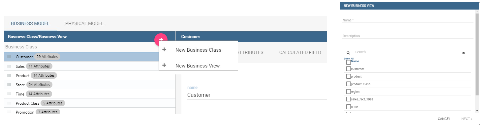
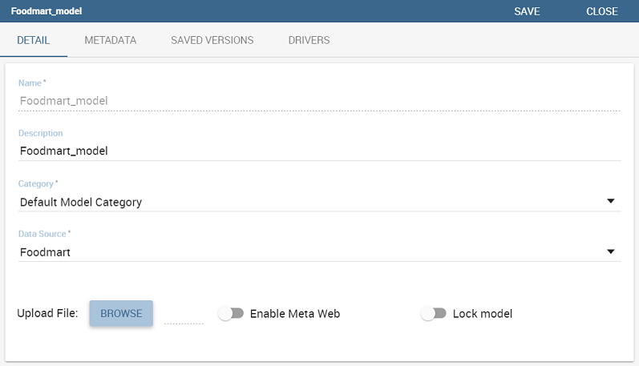

Meta Web
==========

In this chapter we go into details of how to build your own metamodel. Knowage allows to develop and manage metadata through the use of a web interface that is called **Meta Web**. We recall that dealing with metadata means to manage data that describe the structure of a relational model, namely to deal with the relationship between tables, table columns, keys and so on.

The Meta Web allows the user to access these information through the usage of a graphic interface and to easily combine, redefine and query them on an abstract model, guaranteeing the safety of the source model. In addition, we stress that the users can perform queries over data without the usage of a data query language.

Metamodel creation
-----------------------

Using the Meta Web application, it is possible to reverse the content of a database and manipulate this information creating a new model that can fit the user’s needs. In this section will we see what are the steps need in order to create a metamodel and query it with the QBE.

To create a Metamodel enter the **Business Model Catalogue** and add a new model clicking on the “Plus” icon. Referring to next figure, you will be prompted to enter the following fields:

-  Name (mandatory): Name of the model (cannot be changed after the save).
-  Description: A longer description of your model.
-  Category (mandatory): Select, from the ones avaiables, a category that the model belongs to.
-  Data Source (mandatory): select the datasource that will be used to create your model (so the one that contains the tables that you need).

.. _settingthemodelinfo:
.. figure:: media/image299.png

    Setting the metamodel basic information.

After you have compiled these information, you can use the browse button to upload a model developed through an external (and specific) tool or you can click on “Save” on the top right corner of the screen and use the Meta Web engine to build it through Knowage interface. Now click on the switch **Enable Meta Web** that will show up a button **Meta Web**, click on that and you are ready to design the model.

Create an empty model
~~~~~~~~~~~~~~~~~~~~~

The first time you enter the Meta Web, the interface (see Figure 10.2 will show you the available tables extracted from the selected data source.

.. figure:: media/image300.png

    Metaweb interface.

For each table you can decide if you want to include it in your metamodel. More in detail a metamodel is divided in two model:

-  **Physical Model**: it represents a “snapshot” of the database at the moment of the creation of you metamodel. The physical model contains a list of tables and information like columns and foreign keys retrieved from the database. The Physical Model cannot be modified but could be updated to reflect changes made on the database after the creation.

-  **Business Model**: it is based on the physical model but let the user recombine some of his informations. For example is possible to create a Business Class that contains only some of the columns of a Physical Table and create new relationships between Business Classes that are not defined on the physical database.

If you choose to include a table only in the physical model is always pssible to create a corresponding business class later during the editing. When you have finished to select the tables you can proceed to the editing clicking on the **Continue** button.

Editing the metamodel
~~~~~~~~~~~~~~~~~~~~~

The Meta Web Editor is divided in two main tabs **Business Model** and **Physical Model** corresponding to the related models. Clicking on one of this tab will change the view showing the elements of the specific model.

The “Physical Model” tab contains the tables that the user has checked earlier. On the left side of the interface you will see a tree like structure with the list of tables imported in the Physical Model (see figure below).

.. figure:: media/image301.png

    Physical Model Tab.

The “hambuger-like” icon lets the user to update the Physical Model at any time. Referring to the figure below, selecting the “Update Physical Model” option the user can refresh the model metadata. 

.. _updtphisicalmdl1:
.. figure:: media/image302a.png

    Update the physical model.

As shown below, the interface shows if tables have been added or deleted to the datasource and lets the user to add tables to the Physical Model.

.. _updtphisicalmdl2:
.. figure:: media/image30607.png

    Update the physical model.

Each table of Physical Model brings the information read from data base. Selecting each table, the interface shows on the right the list of its properties (**Property List** tab) and its foreign keys (**Foreign Keys** tab). Clicking on the icon on the left of each Physical Table, it is possible to expand the corresponding node. Highlight each column name to see (on the right side of the screen) a list of properties, like data type or length.

The Business Model tab, shown below, allows the user to custom the model in terms of column name, type, visibility, format, etc.

.. figure:: media/image308.png

    Physical Model Tab.

In this view, you see all the Business Class created at the first initialization. As well, the Business Classes are represented in a tree structure on the left side of the page. Clicking on each business class name, generic information are reported in the five tabs available on the right side of the page (Figure below).

    Exploring Business Class properties.

Using the **Property List** tab, the user can custom the business class name, type a description and see the corresponding physical table name. Here the user can also choose to hide the business class setting its visibility to false. Furthermore, when specifying the business class type, the user activates some peculiar functions that can be used in the QbE interface we described in Section 9.1. For instance, selecting the geographic dimension, the user will be able to apply the spatia functions to the dimension fields available in the QbE interface.

The **Attributes** tab lets the user to define which columns to be used as primary keys and which are effectively functional for the Business Class (not to be confused with the visibility condition). Note that, for istance, it is not possible to disable the “In Use” option when the field has already been set as foreign key.

The **Calculated field** tab is used to configure computed measures or attributes. Click on the dedicated button, as shown below, to create a new field. Use the list of functions to retrieve right function syntax and the list of fields on the left to correctly type the fields name.

.. figure:: media/image310.png

    Add calculated fields.

The **Inbound** and **Outbound** tabs are described in the following section.

Create a new relationship
~~~~~~~~~~~~~~~~~~~~~~~~~

In the Business Model is possible to define new relationships between Business Classes that are not inherited from the physical foreign keys. The Business Relationships are divided in two types:

-  **Inbound**: relationships that have the selected Business Class as a target (so they are entering);
-  **Outbound**: relationships that have the selected Business Class as a source (so the starts from).

The two relationships differ then for the direction of the bounds between tables that they establish.

To create a new relationship, just select the tab “Inbound” or “Outbound” after selecting one Business Class. Then click on the button “Add” and you will see a dialog.

.. figure:: media/image311.png

   Setting the outbound relationship.

In Figure above the outbound relationship is shown. Here you have to:

-  enter the business relationship name,
-  select the cardinality of the relationship (1 to N is suggested),
-  select the Source and Target Business Classes,
-  Then is possible to drag and drop a Business attribute from the source Business Class to another Business attribute in the target Business Class. This will create a link between the two attributes.

When all these steps are accomplished, click on “Create” to save.

We stress that the cardinality of the outbound relationship can be of two types:

-  1 to N,
-  1 to N\ *.

Use the second type of cardinality when the type of cardinality can be optional.

As well, the cardinality of the inbound relationship can be of two types:

-  N to 1,
-  N\ * to 1.

Use the second type of cardinality when the type of cardinality can be optional.

Create a new business class
~~~~~~~~~~~~~~~~~~~~~~~~~~~

In the “Business Model” tab, the sandwitch icon lets the user add other Business Classes (from the tables of the Physical Model) or a Business View (a combination of more tables with a predefined join path).

    Create a new business class.

When clicking on the icon, as shown in Figure above), and selecting “New Business Class”, a new dialog asks to the users to:

-  select a Physical Table from the available ones; 
-  insert a description for this new business class;
-  select one or more columns.

Then click on save to add the business class.

As well, when clicking on “New Business View”, as reported in Figure below the user is asked to select two or more tables from the available ones and insert a description for this new business view.

    Create a new business view.

Then, moving to the next step, the user must join tables through specific columns, typically the tables’ foreign keys. Figure below shows an example.

.. figure:: media/image31516.png

    Create a new business view.

For each business view, the interface reports the same property tabs we saw for each business class. In addition, the user finds the **Join relationships** tab and the **Physical table** tab, as highlighted in the  following figure. The “Join relationships” tab shows the join clauses set to create the business view while the “Physical Table” tab recalls the physical table names.

.. figure:: media/image317.png

    Additional property tabs for business view.

Table property list
~~~~~~~~~~~~~~~~~~~

Scrolling the table “Property list” tab, the user finds the **Type** menu item. Expanding the related combobox the user can custom the table type among the ones available and listed below.

    Table property list.

We highlight that for temporal and time dimension type, the user must define at least one hierarchy for the related dimension. the next figure shows that it is possible to set a hierarchy clicking on the button avaiable at the end of the comobobox line. Then, clicking on the “Add” button, the user can configure a new hierarchy. Remember to choose the **Level type** using the dedicated combobox. Note that it is possibile to shift levels using the up and down arrows avaiable at the end of each level row. Furthermore, the user can add a “Has all” node the hierarchy: just enable the “has-all” box and type the all member name.

.. _temphierarcdef:
.. figure:: media/image32021.png

    Temporal hierarchy definition.

According to the chosen type, the user will be able to use the specific functions introduced in Section **XXX**.

Column property list
~~~~~~~~~~~~~~~~~~~~

As well, the user can employ each field property list (see next figure) to both inspect the object and custom it.

.. _clmnproprtylist:

   Column property list.
   
The **Structural** area covers an important role for the field properties. Here the user can set:

-  **Visibility** over the field,
-  **Type**, among measure, attribute, calendar, temporal_id, the_date and hour_id,
-  **Aggregation type** for measure field type,
-  **Format string**, to custom the format of the string for measure field type,
-  **Profile attribute**, to filter the field (and then the table records) by the user profile attributes (note that the combobox lists the available profile attributes),
-  **Profile attribute filter type**, to define the filter operator among “equals to”, “in”, “like”,
-  **Data type**, to indicate the field data type.

In the **Behavioural Model** area, the user can assign the field’s visbility permission to specific roles.

In the **Physical** area, recalls the physical table and field name from which the field have been take.

Generate the datamart
~~~~~~~~~~~~~~~~~~~~~

After the editing of the metamodel, click on “Save” on the Meta Web toolbar on the upper right corner. Now you have a metamodel that can be compiled and used to generate a datamart. Now if you go back to the Business Model catalog you will see that near the “Meta Web” button there is a “Generate” button. Clicking on it, a dialog will open:

.. figure:: media/image323.png

    Generate datamart dialog.
   
If you just press “Create” the generation of the datamart begins otherwise clicking on the switch “Show Advacend options” (see fegure below) the user can modify model name, change the schema or the catalogue of the database used to query the metamodel. This option is useful when the user wishes to buid the model on a source schema and produce the datamart on a different one. Furthermore, the user can check the **Generate for registry** box. In this instance, the generated datamart will be used as a registry (but will not be exploited as a QbE). The **Include source code** produces a “file.jar” containing both the compiled code (.class) and the source files (.java), useful for the debagging process.

.. _generdatamdialogadv:
.. figure:: media/image324.png

    Generate datamart dialog: advanced options.

When the datamart is generated it will be possible to query the metamodel accessing it in the Workspace interface.

Additional functions for business model
~~~~~~~~~~~~~~~~~~~~~~~~~~~~~~~~~~~~~~~

In this section, we briefly describe the generic available options for business model development. Referring to figure below, the user first finds the **Lock Model**: if enabled, only the user who developed the model can modify it.

    Additional functions for business model.

Once the model has been saved, some more options are enabled. In fact, the user can make advantage of the **Metadata** section. Clicking the **Import metadata** button, the metadata information related to the business classes (their composition, properties, etc.) are stored into the (metadata) Knowage database. Those information can then be visualized via specific document (developed for the data lineage context). The **Export CWM** allows the user to export metadata information in the CWM format. Vice versa the **Import CWM** allows the user to import a CWM file containing metadata infomration. The user must browse the CWM file into personal folder and then click on the “Import CWM” button to correctly upload it. Remember to save to validate the process.

Finally the **Saved versions** section the user keeps trace of model changes over time. Furthermore it is possible to restore old versions by checking the active column. Selecting the “three-dots” icon the user can download the jar file or the model itself or delete the version.
Figure belowshows an example.

.. figure:: media/image326.png

    Saved version functionalities.
   
