Multidimensional Analysis
=========================

OLAP tools enable users to analyse multidimensional data interactively from multiple perspectives. OLAP consists of basic analytical operations: slice and dice, roll up, drill down and pivot.

OLAP user manual step by step
-------------------------------

We start our lecture on the OLAP engine by analysing an existing OLAP document. Open the document browser folder of the Knowage suite as in figure below and launch an OLAP document.

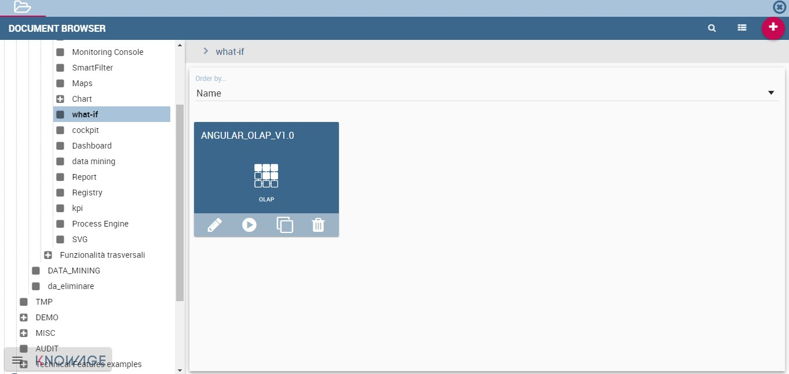

    Browse the documents and select an OLAP document.

Here an example.

.. figure:: media/image135.png

      Exploring an existing OLAP document.

We will describe the main parts of the OLAP page in the following.

The filter panel
~~~~~~~~~~~~~~~~

Once the document is executed, the central area of the window contains the table whose measures are aggregated on dimensions. At the top of this area, panels are available to configure filters on attributes. We see in the following figure that the filter panel is made up of **Filter cards**. Here you can find the cube dimensions and their hierarchies as defined in the OLAP schema by the developer.

.. figure:: media/image136.png

    The filter panel.

The filter cards
~~~~~~~~~~~~~~~~

Filter cards can be placed on the filter panel or on column axis. You can switch their position dragging and dropping them from one place to the other.

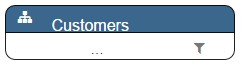

    The filter card inside the filter panel.

Filter cards are used to:

-  inform the user about available dimensions defined in OLAP schema,
-  inform the user about dimension’s name,
-  perfom slices,
-  Add the dimensions to the cube visualization,
-  place hierarchies in different axes,
-  filter visible members.

Considering the next figure, we can see that a filter card is made up of:

-  an icon for opening dimension chooser dialog (a),
-  a dimension name (b),
-  icon slicer (c)+(e),
-  choosed filter name (d),

.. _featuresoffiltcard:
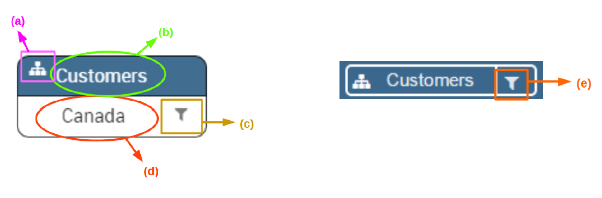

    Features of a filter card.

Axes panel
~~~~~~~~~~

In the panel axes you can:

-  drag and drop one or more dimensions,
-  organise the dimensions visualization,
-  swap axes.

Referring to the following figure, the axes panel consists of the following items:

-  columns axis (a),
-  row axis (b),
-  filter cards (c),
-  icon for swap axes (d),
-  icon for hierarchy order (e).

.. _axespanelfeat:
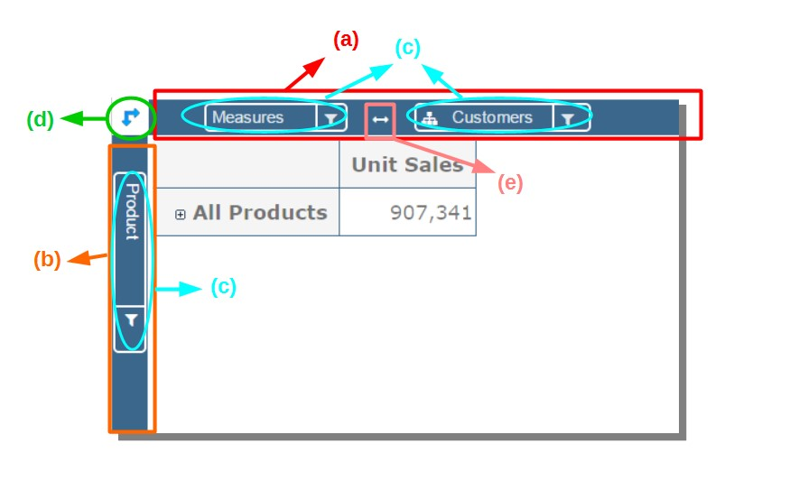

    Axes panel features.

Pivot table
~~~~~~~~~~~

The Pivot table is the central part of the OLAP page. In figure below is shown an example. 

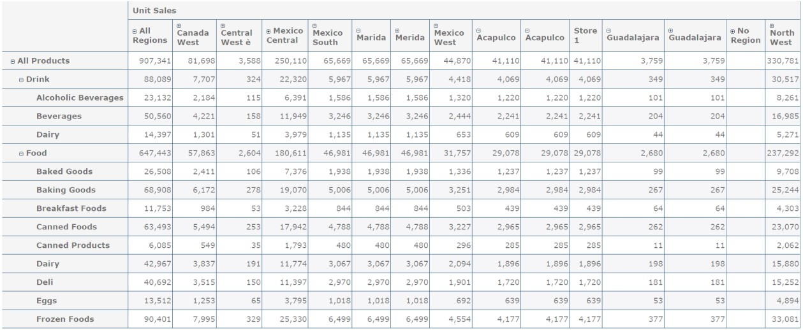

    Pivot table.

Pivot table is used to:

-  show data based on MDX query sent from the interface,
-  drill down/up hierarchies’ dimensions,
-  drill through,
-  show properties of a particular member,
-  sort data,
-  show calculated fields,
-  perform cross navigation to other documents.

Referring to next figure, Pivot table consists of:

-  dimensions involved in the analysis (a),
-  cells with data (b),
-  icons for drill down and drill up (c),
-  icons for sorting (only if enabled by the developer) (d),
-  icons for showing properties (only if enabled and configured by the developer) (e),
-  links for cross navigation (only if enabled and configured by the developer) (f).

.. _pivottablefeat:
.. figure:: media/image142a.png

    Pivot table features.

Side bar
~~~~~~~~

You can open the side bar by clicking on the icon positioned on the top right side of the page (see next figure). Side bar will be shown on the right side (see *Side bar* figure).

.. _openthesidebar:
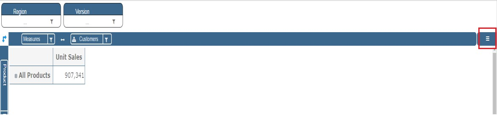

    Open the side bar.

Side bar is used to:

-  choose between different data representations,
-  choose between different drill types,
-  call dialogs and functionalities that effect the pivot table,
-  get additional data based on loaded model.

.. _sidebar:
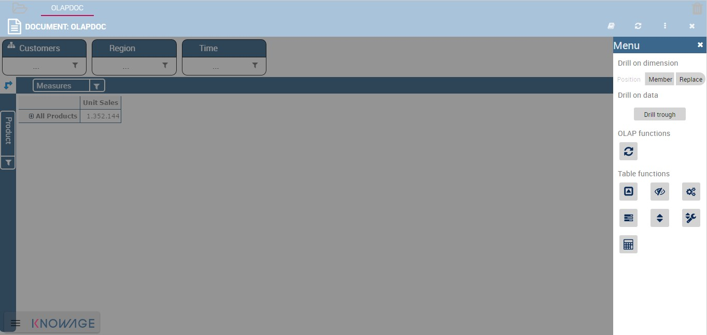

    Side bar.

The side bar shows the **Menu**. This area let you customize the Olap layout. As highlighted in the figure below, the Menu is divided in three subsections:

-  drill options (a),
-  OLAP functions (b),
-  table functions (c), 
-  what if.

.. _sidebarmenu:
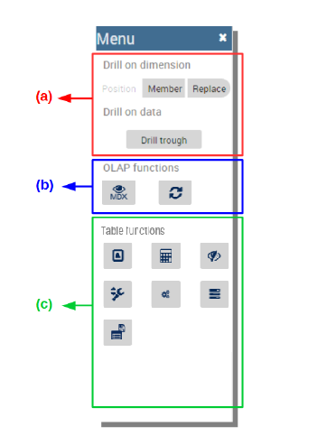

    Side bar Menu.

We start introducing the interface and leave the description to the next *Functionalities* paragraph. In particular, referring to next figure, drill types consists of:

-  position (a),
-  member (b),
-  replace (c),
-  drill through (d).

.. _drilltypes:
.. figure:: media/image146.png

    Drill types.

Meanwhile, referring to the following figure, the OLAP functions consist of:

-  show MDX (a),
-  reload model (b).

.. _olapfunctions:
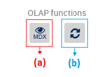

    OLAP functions.

Referring to figure below, table functions consist of:

-  show parent members (a),
-  sorting settings (b),
-  save customized view (c),
-  show properties (d),
-  suppress empty rows/columns (e),
-  hide spans (f),
-  calculated field wizard (g).

.. _tablefunctions1:
.. figure:: media/image148a.png

    Table functions.

Referring to next figure, what if consists of:

-  lock/unlock model (a),
-  delete versions (b),
-  select an algotithm (c),
-  output wizard (d), 
-  save as new version (e), 
-  undo (f),
-  export excel for edit (g).

.. _tablefunctions2:
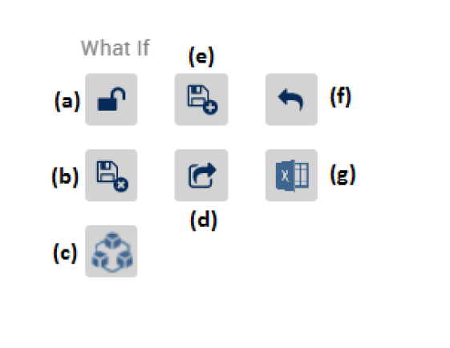

    Table functions.

Functionalities
----------------

Placing hierarchies on axes
~~~~~~~~~~~~~~~~~~~~~~~~~~~

As we already told, the user can easily move a dimension from the filter bar to the axis or viceversa dragging and dropping it to the desired place.

Let us suppose we want to move a dimension from the filter panel to the columns axis. The steps are summarized in figure below

.. figure:: media/image150.png

    Move a hierarchy to the columns axis.

Vice versa, to move back the dimension from the columns axis to the filter panel the user must simply drag and drop the dimension from one place to the other as in the following figure.

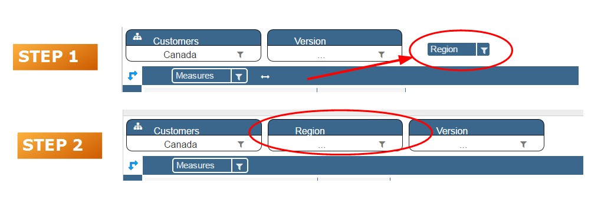

    Move a dimension from the columns axis to the filter panel.

Similarly, a dimension can be moved from the filter panel to the rows axis simply dragging and dropping it from one place to the other.

Swaping axes
~~~~~~~~~~~~

To swap axes the user should click on the icon |image151|. The user will get the outcome showed in figure below.

.. |image151| image:: media/image152.png
   :width: 30

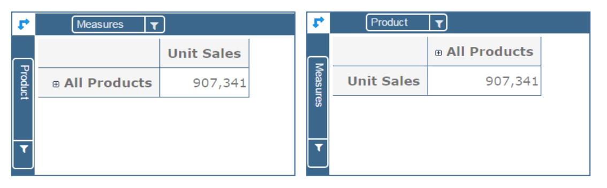

    Swap axes.

Selecting different hierarchies on dimension
~~~~~~~~~~~~~~~~~~~~~~~~~~~~~~~~~~~~~~~~~~~~

If an OLAP schema is defined, the user can choose different hierarchies of the same dimension. The icon for opening the dialog is positioned on the top left corner of the filter card (if the dimension has more than one hierarchy). Select the hierarchies icon underlined below.

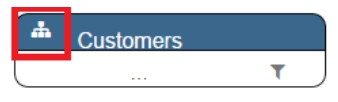

    Hierarchies icon.

A pop up will be displayed. The following figure shows its characteristics. The window will present:

-  the dimension name (a),
-  name of selected hierarchies (b),
-  drop down list of available hierarchies (c),
-  save button (d),
-  cancel button (e).

.. _hierarchiesdialogpopup:
.. figure:: media/image155.png

    Hierarchies dialog pop up.

After selecting the hierarchy and saving user’s choice, that hierarchy will be used by the pivot table.

If the user re-opens the dialog window, he/she sees the selected hieararchies and has the chance to change it if needed to, as shown below.

.. figure:: media/image1565758.png

    Changing the hierarchies.

We give an example of the output when the hierarchy “Time” is selected in first next figure and hierarchy “Time Weekly” in the second next figure.

.. _timehierarchieshowsdays:
.. figure:: media/image159.png

     Time hierachy: the table shows days in the month.

.. _timeweeklyhierarchyshowsweek:
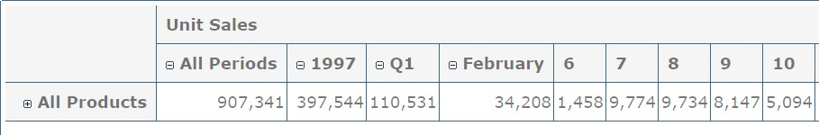

    Time Weekly hierachy: table shows weeks in the month.

Slicing
~~~~~~~

The slicing operation consists in the analysis of a subset of a multi-dimensional array corresponding to a single value for one or more members of the dimensions. In order to perform this operation you need to drag and drop the dimesion of interest in the axis panel.  Then clicking on the filter icon choose the new single focus and apply it. Once concluded these steps the cube will show only the selected level of the dimension, while the others have been sliced out.

The following figure shows the slicer option panel which consists of:

-  a dimension name (a),
-  a search input field (b),
-  a search button (c),
-  a show/hide siblings checkbox (d),
-  a member tree (e),
-  a selected member icon (f),
-  a highlighted member (result of searching) (g), 
-  a save and a cancel buttons (h).

.. _dialogforslicerchoosing:
.. figure:: media/image161.png

    Dialog for slicer choosing.

In particular, it is possible to search for a member in three ways:

1. by browsing the member tree;

.. figure:: media/image162.png

   Browsing the member tree.

2. by typing member’s name or it’s part in the input field and clicking on the search button. The research will be possible if the user enters at least four letters. If the user wishes to include member’s siblings to the research, the checkbox (:numref:`dialogforslicerchoosing` (d))needs to be checked;

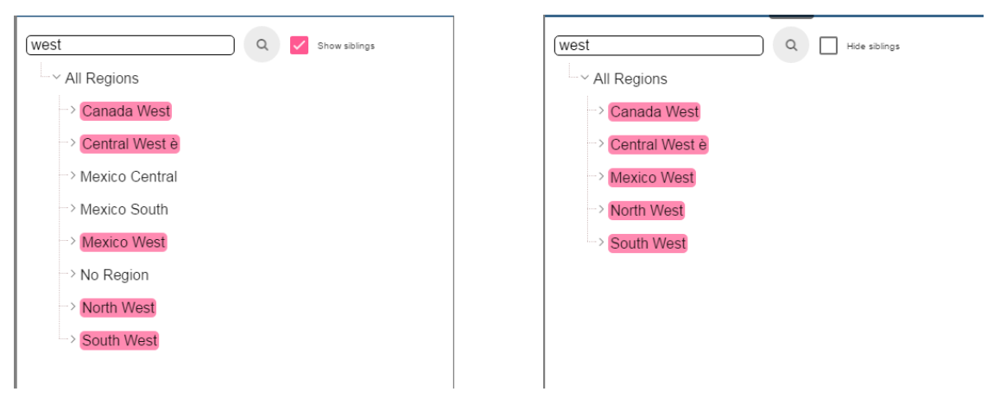

   Using the research box.

3. after the first research, if the user types some other member’s name before clicking on the search button, visible members whose        names contains a entered text will be highlighted.

.. figure:: media/image165.png

    Using the research box after a first investigation.

Once the selection has been saved, the users choice will affect the pivot table and the filter cards slicer name will rearrange.

Filtering
~~~~~~~~~

To filter dimension members in a pivot table, the user should click on a button (see :numref:`featuresoffiltcard`) located on the right side of dimension’s filter card placed in the filter area.

The procedure to search for a member using the filter dialog has no meaningful differences with the one described for the slicer chooser dialog. The pop up interface is the one showed below. After selecting a member, the user should click on the save button. The pivot table will display the changements. Otherwise click on the cancel button to discard changes.

.. figure:: media/image166.png

    Filter dialog.
    
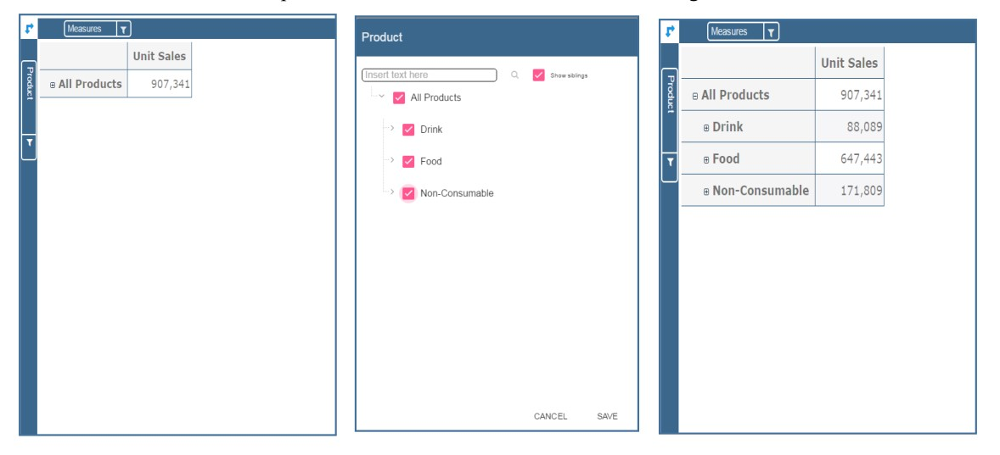

    Filter effects on pivot table.

Drill down and drill up
~~~~~~~~~~~~~~~~~~~~~~~

User can choose between drill types by clicking on one of the three buttons in the drill types section of the side bar. There are three drill types. In the following we give some details on them.

1. **Position**: this is the default drill type. Clicking on a drill down/drill up command will expand/collapse a pivot table with          child members of a member with that particular command. See below.

.. figure:: media/image168.png

     “Position” drill down.

2. **Member**: if the user wants to perform drill operation not only on one member per time but on all members of the same name and        level at the same time it is needed to select member drill type. See below.

.. figure:: media/image169.png

    “Member” drill down.

3. **Replace**: This option lets the user replace the parent member with his child member during drill down operation. To drill up the      user should click on the arrow icon next to the dimension name on which to perform operation. See figure below.

.. figure:: media/image170.png

    “Replace” drill down.

Drill through
~~~~~~~~~~~~~

To perform drill through operation the user needs first to select a cell, as in the following figure, on which to perform operations. Then clicking on the button for a drill through in the side bar, a dialog will open with results (this pop up could take some time to    open).

.. figure:: media/image171.png

    Drill thorugh option.

In particular, referring to the next figure, drill though dialog consists of:

-   a hierarchy menu (a),
-   a table of values (b),
-   a maximum rows drop down list (c),
-   a pagination (d),
-   a apply button (e),
-   a export button (f),
-   a cancel button (g),
-   a clear all button (h).

.. _drillthoroughwindow:
.. figure:: media/image172a.png

    Drill thorugh window.

The user must therefore select a cell, open the side bar and select the drill through item from the panel. A pop up will show up: here the user can choose the level of detail with which data will be displayed. The steps to follow are:

1. to click on hierarchy in hierarchy menu,

2. to check the checkbox of the level,

3. to click on the “Apply” button (after checking the checkbox, remember to click outside of the level list and then select apply).

The user can also select the maximum rows to load by choosing one of the options in the drop down list (see figure above, (c)). Finally, loaded data can be exported in csv format by clicking on the “Export” button.

Refreshing model
~~~~~~~~~~~~~~~~

To refresh a loaded model the user needs to click on the “Refresh” button available in the side bar panel. This action will clear the cash, load pivot table and the rest of data again.

Showing MDX
~~~~~~~~~~~

To show current mdx query user should click on show mdx button in the side bar. Figure below shows an example.

.. figure:: media/image173.png

     Showing MDX query example.

Sending MDX
~~~~~~~~~~~

If you want to execute an MDX query you need to:

-  click on send MDX button in the sidebar,
-  type a query in a text area of send MDX dialogs, 
-  click on the save button.

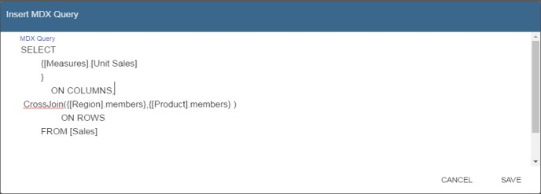

    Sending MDX query example.

Result of the MDX query “should” appear in pivot table as in figure below. In fact, the user is responsable for entering *valid* MDX query.

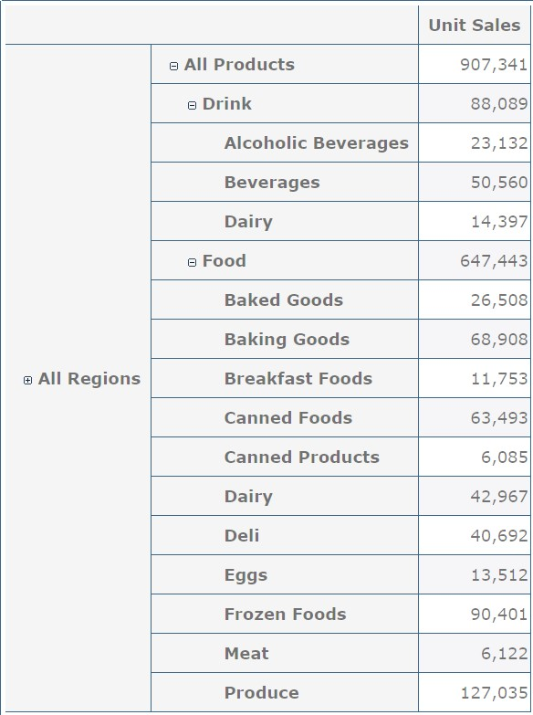

    Sending MDX query example.

Showing parent members
~~~~~~~~~~~~~~~~~~~~~~

If a user wants to see additional information about members shown in the pivot table (for example: member’s hierarchy, level or parent member) he should click on a show parent members button in the side bar panel. The result will be visible in the pivot table. An example is shown in the following two figures.

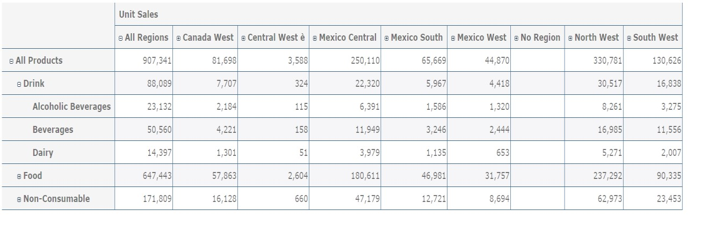

    Pivot table without the parent members mode.

.. figure:: media/image177.png

    Pivot table after the parent members selection.

Hiding/showing spans
~~~~~~~~~~~~~~~~~~~~

To hide or show spans the user should click on show/hide spans button in the side bar. The result will be visible in pivot table as in figure below.

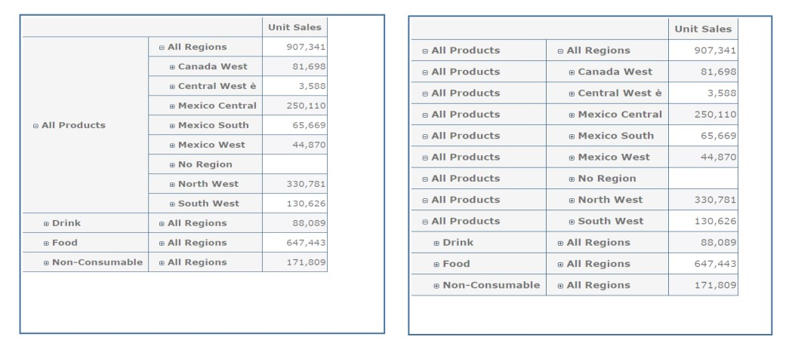

    Hide/show spans.

Showing properties
~~~~~~~~~~~~~~~~~~

In OLAP schema the XML member properties, if configured, could be represented in two possible ways:

1. as part of pivot table where a property values are placed in rows and columns. To get these values, the user needs to click on show      properties button in the side bar. Results will be shown in the pivot table;

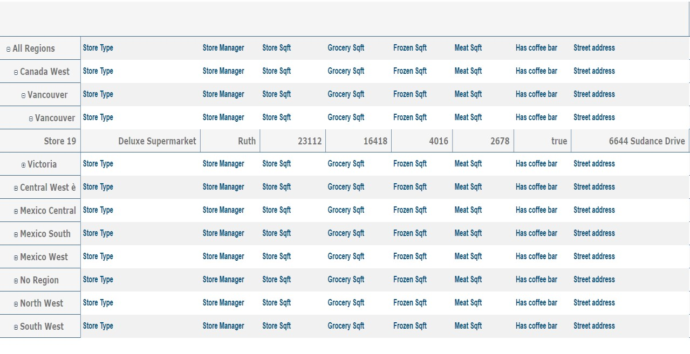

    Show properties.

2. in a pop up as compact properties. To enable compact properties user should click on enable compact properties button in the side bar. In this way in all the cells of members Suppressing empty colunms/rows which has property set, a table icon appears. This icon lets the property pop up opens. Figure below shows an example.

.. figure:: media/image180a.png

    Show properties summarized in a pop up.

Suppressing empty colunms/rows
~~~~~~~~~~~~~~~~~~~~~~~~~~~~~~

To hide the empty rows and/or colums, if any, from pivot table the user can click on the “Suppress empty rows/colums” button in the side bar panel. An example is given in Figure below.

.. figure:: media/image181.png

    Suppressing empty colunms/rows.

Sorting
~~~~~~~

To enable member ordering the user must click on the “Enable sorting” button in the side bar panel. The command for sorting will appear next to the member’s name in the pivot table. In addition, the sorting command will show the members of “Measures” hieararchy or members that are crossjoined with them, as shown below. 

.. figure:: media/image18283.png

    Member sorting.

To sort members the user needs to click on the sorting command |image179|, available next to each member of the pivot table. Note that the sorting criteria is ascending at first execution. If the user clicks on the sorting icon, criteria will change to descending and the result will be shown in pivot table.

.. |image179| image:: media/image184.png
   :width: 65

To remove the sorting, the user just have to click on the icon again. To change sorting mode user should click on sorting settings button in the side bar. Referring to the following figure, dialog sorting settings consists of:
   
.. figure:: media/image185a.png

    Sorting settings window.

-  sorting modes (a),
-  no sorting (by default) (b), 
-  basic (c),
-  breaking (d),
-  count (e),
-  a number input field for count mode definition (f),
-  a save button (g).

Note that “breaking mode” means that the hierarchy will be broken.

If the user selects “Count sorting” mode the top or last 10 members will be shown by default in the pivot table. Furthermore, the user can also define a custom number of members that should be shown. 

Calculated members and sets
~~~~~~~~~~~~~~~~~~~~~~~~~~~

Firstly we stress that to enable **Calculated fields** in your Olap document a proper button tag is needed in your Olap template. Such a tag is <BUTTON_CC visible="true"/>.

Once enabled, to create a calculated member/set the user should:

.. figure:: media/image186.png

   Calculated member.

1. select a member of the pivot table, as in figure above, which will be the parent of the calculated member,

2. click on the “calculated field” button in the side bar panel: a “Select function” dialog will appear. The latter consists of            (refer to next figure):

   -  a name input field (a),
   -  an aggregation functions tab (b),
   -  an arithmetic functions tab (c),
   -  a temporal functions tab (d),
   -  a custom functions tab (e), 
   -  a recent functions tab (f),
   -  an available functions list (g),
   -  ok and cancel buttons (h).

.. _selectfunctiondialog:
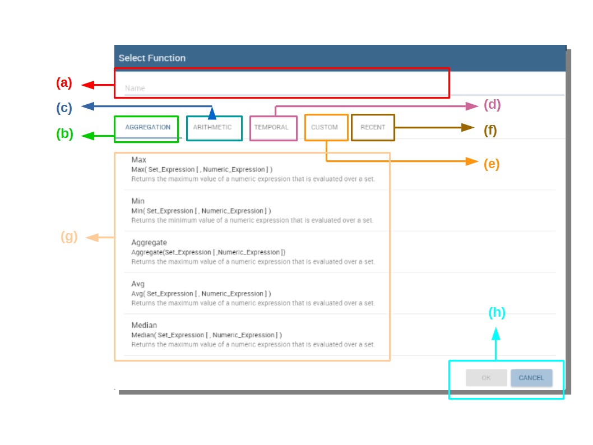

    Select function dialog.

The function definition used to create calculated members are read from the formula.xml file, located at: ROOT/resources/yourTennant/Olap folder. Functions are divided by few different tabs. In particular,\ **Tab Recent** contains calculated members and calculated sets created by user and saved in cookies. If there are no sets/members stored in the cookies, that tab will be empty. **Tab Custom** is where to define custom functions. These functions can be used to make really complex operations that are not part of predefined MDX functions. There you can use combination of few functions together or use operators for complex mathematical  calculations. They are also defined in formulas xml. If a specific tab doesn’t contain any formula, it will not be displayed. The “Name” field is mandatory, indeed the creation of a function without a name is forbidden. In **Recent tab**, the “Name” field is hidden. the figure below provides an example of edited formula in the formulas.xml file.

.. figure:: media/image188.png

    Example of one formula inside of formulas xml.

3. Select a function and enter a calculated member/set name and click on “Ok”. A dialog for arguments defintion will show up, as shown in the following figure. This is made up of the following elements:

-  selected function name (a),
-  function description (b),
-  text input fields for argument expression (c),
-  expected MDX expression return type (d),
-  argument’s MDX expression description (e),
-  open saved button (f), 
-  select from table button (g),
-  ok and cancel buttons (h).

.. _argumentdefdialog:
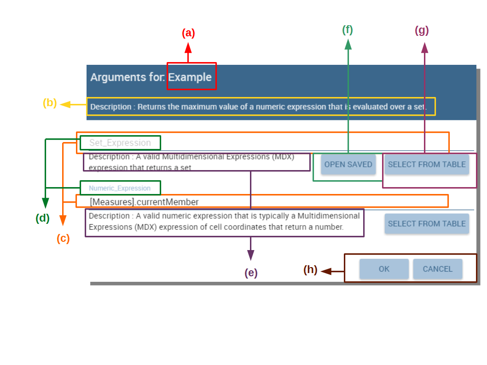

    Argument defintion dialog.

In particular, to input MDX expression argument, the user has three options, listed in the following.

1. Type it manually (for advance users).

2. Select members from the pivot table: to select a members that are going to be included in a set, the user should (see next figure):

   -  click on select from table button,
   -  click on members in a pivot table,
   -  click ok in dialog to finish selection.

.. _selectingmembers:
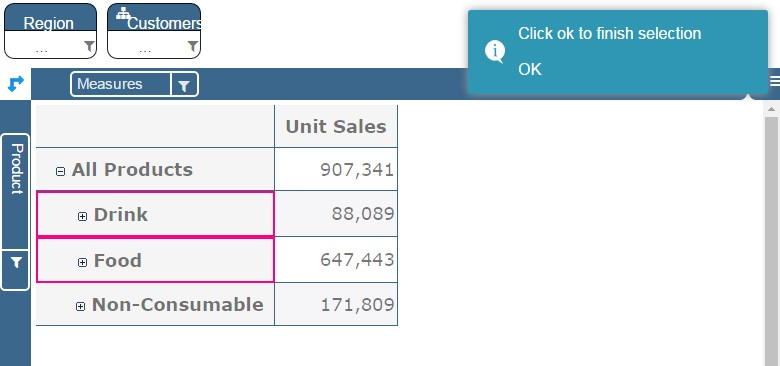

    Selecting members.

The expression of selected members will be imported in text input fields for argument expression as figure below shows.

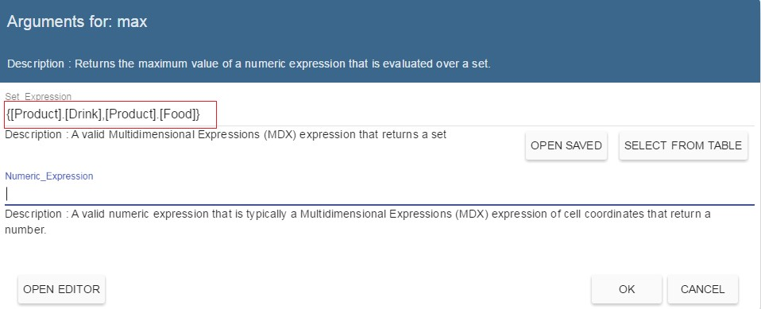

    Expression of the selected members.

3. Import expression from saved calculated members or sets. To import calculated member/set, the user should:

   • Click on open saved button. Then the dialog of saved calculated members/sets will appear (next figure) and it consists of:

     -  a list of saved calculated members and sets,
     -  a calculated member/set name,
     -  calculated member/set return type is shown by round icon.

.. _savedsetsdialog:
.. figure:: media/image192.png
   
    Saved sets dialog.

•  Click on calculated member/set. The expression of saved calculated member/set will be imported in text input fields for argument         expression, as highlighted below.
   
.. figure:: media/image193.png

    Expression of the saved/calculated member/set.

•  After filling all the arguments of function, clicking on OK button will:

      -  add calculated member in a pivot table,
      -  save calculated set and it will be available for creation of other calculated member and sets.

In tab “Recent”, opening the “Select function” dialog the user can find a list of saved calculated member and sets which can be edited or deleted. Editing is done by clicking on one of them. 

.. figure:: media/image194.png

   Edit a calculated member.

Deleting is done by Delete button as shown in figure above.

Creation of an OLAP document\*
------------------------------

Multidimensional analysis allows the hierarchical inquiry of numerical measures over predefined dimensions. In Cockpit we explained how the user can monitor data on different detail levels and from different perspectives. Here we want to go into details of how a technical user can create an OLAP document. We recall that the main characteristics of OLAP documents are:

-  the need for a specific data structure (logical or physical);
-  analysis based on dimensions, hierarchies and measures;
-  interactive analysis;
-  freedom to re-orient analysis;
-  different levels of data analysis, through synthetic and detailed views;
-  drill-down, slice and dice, drill-through operations.

Considering these items, we will describe the steps to develop an OLAP document.

About the engine
~~~~~~~~~~~~~~~~

Knowage performs OLAP documents by relying on the **OLAP engine**. This engine integrates Mondrian OLAP server and two different cube navigation clients to provide multi-dimensional analysis. In general, Mondrian is a Relational Online Analytical Processing (ROLAP) tool that provides the back-end support for the engine. OLAP structures, such as cubes, dimensions and attributes, are mapped directly onto tables and columns of the data warehouse. This way, Mondrian builds an OLAP cube in cache that can be accessed by client applications. The Knowage OLAP engine provides the front-end tool to interact with Mondrian servers and shows the results via the typical OLAP functionalities, like drill down, slicing and dicing on a multi-dimensional table. Furthermore, it can also interact with XMLA servers. This frontend translates user’s navigation actions into MDX queries on the multi-dimensional cube, and show query results on the table he is navigating.

Development of an OLAP document
~~~~~~~~~~~~~~~~~~~~~~~~~~~~~~~~

The creation of an OLAP analytical document requires the following steps:

- schema modelling;
- catalogue configuration; 
- OLAP cube template building;
- analytical document creation.

Schema modelling
^^^^^^^^^^^^^^^^^

The very first step for a multi-dimensional analysis is to identify essential information describing the process/event under analysis and to consider how it is stored and organized in the database. On the basis of these two elements, a mapping process should be performed to create the multi-dimensional model.

.. hint::
     
     **From the relational to the multi-dimensional model**

        The logical structure of the database has an impact on the mapping approach to be adopted when creating the multidimensional             model, as well as on query performances.

If the structure of the relational schema complies with multi-dimensional logics, it will be easier to map the entities of the physical model onto the metadata used in Mondrian schemas. Otherwise, if the structure is highly normalized and scarcely dimensional, the mapping process will probably require to force and approximate the model to obtain a multi-dimensional model. As said above, Mondrian is a ROLAP tool. As such, it maps OLAP structures, such as cubes, dimensions and attributes directly on tables and columns of a relational data base via XMLbased files, called Mondrian schemas. Mondrian schemas are treated by Knowage as resources and organized into catalogues. Hereafter, an example of Mondrian schema in Mondrian schema example:

.. code-block:: xml
    :linenos:
    :caption: Mondrian schema example
    
        <?xml version="1.0"?>                                   
         <Schema name="FoodMart">     
               <!-- Shared dimensions -->   
               <Dimension name="Customers"> 
                  <Hierarchy hasAll="true" allMemberName="All Customers"             
                             primaryKey=" customer_id">                                         
                      <Table name="customer"/>                                           
                      <Level name="Country" column="country" uniqueMembers="true"/>      
                      <Level name="State Province" column="state_province"               
                             uniqueMembers="true"/>                                             

                      <Level name="City" column="city" uniqueMembers="false"/>           

                  </Hierarchy> ...                                                   

               </Dimension> ...                                                      

               <!-- Cubes -->                                                        
               <Cube name="Sales">                                                   

                  <Table name="sales_fact_1998"/>                                    

                  <DimensionUsage name="Customers" source="Customers"                
                                  foreignKey="customer_id" /> ...                                                             

                  <!-- Private dimensions -->                                        

                  <Dimension name="Promotion Media" foreignKey="promotion_id">       

                      <Hierarchy hasAll="true" allMemberName="All Media"                 
                                 primaryKey="promotion_id"> 
                          <Table name="promotion"/>          
                          <Level name="Media Type" column="media_type" uniqueMembers="true"/>   
                      </Hierarchy>                                                       

                  </Dimension> ...                                                   

                  <!-- basic measures-->                                             

                  <Measure name="Unit Sales" column="unit_sales" aggregator="sum"    
                           formatString="#,###.00"/>                                                       

                  <Measure name="Store Cost" column="store_cost" aggregator="sum"    
                           formatString= "#,###.00"/>                                         

                  <Measure name="Store Sales" column="store_sales" aggregator="sum"  
                           formatString="#,###.00"/>                                          
                  ...                                                                

                  <!-- derived measures-->                                           

                  <CalculatedMember name="Profit" dimension="Measures">              
                      <Formula>        
                           [Measures].[Store Sales] - [Measures].[Store Cost]  
                      </Formula>                                                         

                      <CalculatedMemberProperty name="format_string" value="$#,##0.00"/> 
                  </CalculatedMember>                                                

               </Cube> 
            ...      
        </Schema> 

Each mapping file contains one schema only, as well as multiple dimensions and cubes. Cubes include multiple dimensions and measures. Dimensions include multiple hierarchies and levels. Measures can be either primitive, i.e., bound to single columns of the fact table, or calculated, i.e., derived from calculation formulas that are defined in the schema. The schema also contains links between the elements of the OLAP model and the entities of the physical model: for example, <table> sets a link between a cube and its dimensions, while the attributes primaryKey and foreignKey reference integrity constraints of the star schema.

.. note::
      **Mondrian**
         
         For a detailed explanation of Mondrian schemas, please refer to the documentation available at the official project webpage: http://mondrian.pentaho.com/.
         
         
Engine catalogue configuration
+++++++++++++++++++++++++++++++

To reference an OLAP cube, first insert the corresponding Mondrian schema into the catalogue of schemas managed by the engine. In order to do this, go to **Catalogs> Mondrian schemas catalog**. Here you can define the new schema uploading you XML schema file and choosing **Name** and **Description**. When creating a new OLAP template, you will choose among the available cubes defined in the registered schemas.

Note that the Lock option forbids other technical users to modify settings.

OLAP template building
^^^^^^^^^^^^^^^^^^^^^^^^^^^^

Once the cube has been created, you need to build a template which maps the cube to the analytical document. To accomplish this goal the user must manually edit the template. The template is an XML file telling Knowage OLAP engine how to navigate the OLAP cube and has a structure like the one represented in next code:

.. _mappingtemplateexample:
.. code-block:: xml
    :linenos:
    :caption: Mapping template example
    
     <?xml version="1.0" encoding="UTF-8"?> 
     <olap>                                 
        <!-- schema configuration -->       
        <cube reference="FoodMart"/>        

        <!-- query configuration -->        
        <MDXquery>  
            SELECT {[Measures].[Unit Sales]} ON COLUMNS           
            , {[Region].[All Regions]} ON ROWS                    
            FROM [Sales]                                          
            WHERE [Product].[All Products].[${family}]            
            <parameter name="family" as="family"/>                
        </MDXquery>                                           

        <MDXMondrianQuery>                                    
            SELECT {[Measures].[Unit Sales]} ON COLUMNS           
            , {[Region].[All Regions]} ON ROWS                    
            FROM [Sales]                                          
            WHERE [Product].[All Products].[Drink]                
        </MDXMondrianQuery>                                   

        <!-- toolbar configuration -->                        
        <TOOLBAR>                                             
            <BUTTON_MDX visible="true" menu="false" />            
            <BUTTON_FATHER_MEMBERS visible="true" menu="false"/>  
            <BUTTON_HIDE_SPANS visible="true" menu="false"/>      
            <BUTTON_SHOW_PROPERTIES visible="true" menu="false"/> 
            <BUTTON_HIDE_EMPTY visible="true" menu="false" />     
            <BUTTON_FLUSH_CACHE visible="true" menu="false" />    
            <BUTTON_SAVE visible="true" menu="false" />           
            <BUTTON_SAVE_NEW visible="true" menu="false" />       
            <BUTTON_EXPORT_OUTPUT visible="true" menu="false" />  
        </TOOLBAR>                                            
                                      
     </olap>                                                  

An explanation of different sections of Mapping template example follows.

-  The CUBE section sets the Mondrian schema. It should reference the exact name of the schema, as registered in the catalogue on the Server.
-  The MDXMondrianQuery section contains the original MDX query defining the starting view (columns and rows) of the OLAP document.
-  The MDX section contains a variation of the original MDX query, as used by the Knowage Engine. This version includes parameters (if any). The name of the parameter will allow Knowage to link the analytical driver associated to the document via the parameter (on the Server).
-  The TOOLBAR section is used to configure visibility options for the toolbar in the OLAP document. The exact meaning and functionalities of each toolbar button are explained in next sections. A more complete list of the available options is shown in Menu configurable options:

.. code-block:: xml
    :linenos:
    :caption: Menu configurable options
    
        <BUTTON_DRILL_THROUGH visible="true"/>    
        <BUTTON_MDX visible="true"/>              
        <BUTTON_EDIT_MDX visible="true"/>         
        <BUTTON_FATHER_MEMBERS visible="true"/>   
        <BUTTON_CC visible="true"/>               
        <BUTTON_HIDE_SPANS visible="true"/>       
        <BUTTON_SORTING_SETTINGS visible="true"/> 
        <BUTTON_SORTING visible="true" />         
        <BUTTON_SHOW_PROPERTIES visible="true"/>  
        <BUTTON_HIDE_EMPTY visible="true"/>       
        <BUTTON_FLUSH_CACHE visible="true"/>      
        <BUTTON_SAVE visible="true"/>             
        <BUTTON_SAVE_NEW visible="true"/>        
        <BUTTON_UNDO visible="true"/>             
        <BUTTON_VERSION_MANAGER visible="true"/>  
        <BUTTON_EXPORT_OUTPUT visible="false"/>   

Creating the analytical document
^^^^^^^^^^^^^^^^^^^^^^^^^^^^^^^^^

Once you have the template ready you can create the OLAP document on Knowage Server.

To create a new OLAP document, click on the “create a new document” button in the **Document Development** area and select **Online analytical processing** as Type. Then you can choose the available engines. In this case we have only the **OLAP engine**. 

Type a name, a functionality, load the XML template and save. You will see the document in the functionality (folder) you selected, displayed with the typical cube icon as shown below.

.. _olapdocserver:
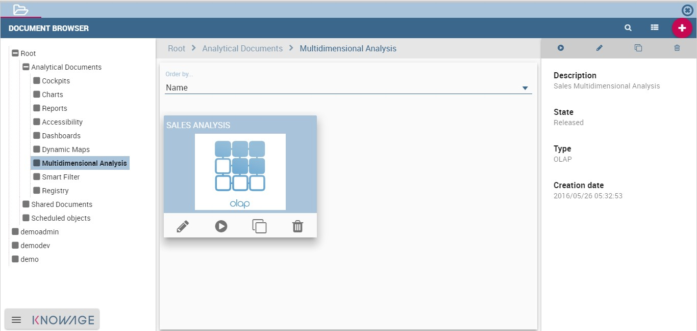

    OLAP document on server.

OLAP Designer\*
~~~~~~~~~~~~~~~~~

Knowage Server is also endowed of an efficient OLAP designer which avoid the user to edit manually the XML-based template that we discussed on in Development of an OLAP document. We will therefore describe here all features of this functionality. 

The user needs to have a functioning Modrian schema to start the work with. Select **Mondrian Schemas Catalog** to check the available Mondrian schemas on server. It is mandatory that the chosen Mondrian schema has no parameters applied.

.. warning::
      **Mondrian schema for OLAP designer**
         
         The Mondrian schema must not be filtered thorough any parameter or profile attribute.

The page as the one in figure below will open.

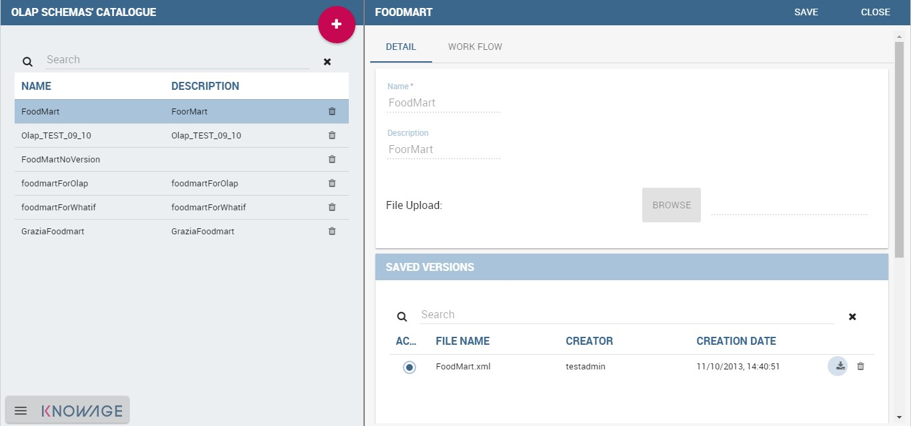

    Schema Mondrian from catalog.

Then we start entering the **Document Browser** and clicking on the “Plus” icon at the top right corner of the page. Fill in the mandatory boxes as Label and Name of the document, select the On-line Analytica Process Type of document and the What-if Engine (we stress that the What-if engine is available only for who have purchased the Knowage SI package). Remember to save to move to the next step: open the Template Build. The latter can be opend clicking on the editor icon |image195| and it is available at the bottom of the document detail page.

The action opens a first page asking for the kind of template. Here we choose the Mondrian one. Consequently you will be asked to choose the Mondrian Schema and after that to select a cube. Next figure sums up these three steps. Following the example just given below you will enter a page like that of the second figure below. 

.. _olapcoreconfig:
.. figure:: media/image198.png

    OLAP core configuration.

.. _definingolaptempl:
.. figure:: media/image199.png

    Defining OLAP template.

Once entered the page the user can freely set the fields as filter panels or as filter cards, according to requirements. Refer to *Functionalities* Chapter to review the terminology. Make your selection and you can already save the template as shown below.  

.. _definingolaptempl2:
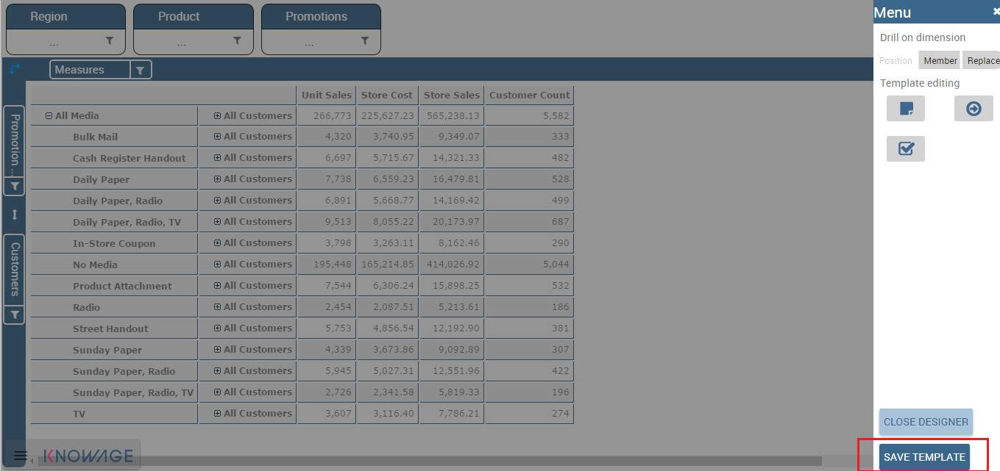

    Defining OLAP template.

You can notice that the side panel contains some features (see next figure):

.. _sidepanelfeatolapdes:
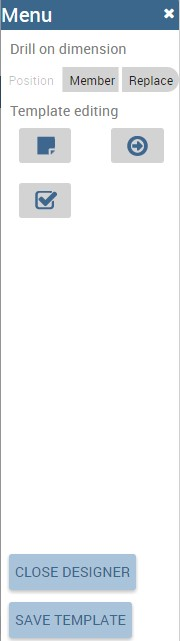

    Side panel features for the OLAP Designer.

- |image200| to set the drill on Position, Member or Replace;

.. |image200| image:: media/image202.png
   :width: 30

- |image201| to configure the scenario; 

.. |image201| image:: media/image203.png
   :width: 30

- |image202| to define the cross navigation;

.. |image202| image:: media/image204.png
   :width: 30

- |image203| to configure buttons visibility.

.. |image203| image:: media/image205.png
   :width: 30

Refer to Section *Functionalities* to recall the action of the different drills. To select between them will affect the navigation of the OLAP outputs by users. Instead the scenario is used to allow the end-user to edit or not the records contained in the OLAP table. The user is first asked to select the cube in order to get the measures that the admin lets the end-user the permission to edit and modify. Referring to to the following figure, an admin user must simply check the measures using the wizard. At the bottom of the page there is also the possibility to add a parameter that can be used by the end-user when editing the measure, for example if one has a frequent multiplication factor that changes accordingly to the user’s needs, the end-user can use that factor to edit measures and ask the admin to update it periodically.

.. _wizconfigscena:
.. figure:: media/image20607.png

    Wizard to configure the scenario.

Once one cross navigation has been set you keep on adding as many as required. Just open the wizard and click on the “Add” button at the top right corner.

Note that the parameter name will be used to configure the (external) cross navigation. In fact, to properly set the cross navigation the the user must access the “Cross Navigation Definition” functionalities available in Knowage Server. Here, referring to *Cross Navigation* section of *Analytical document* chapter, you will use the parameter just set as output parameter.

.. figure:: media/image2080910.png

    Cross navigation definition.

As shown in figure below, the buttons visibility serves to decide which permissions are granted to the end-user. Some features can only be let visible while the admin can also grant the selection for others. 

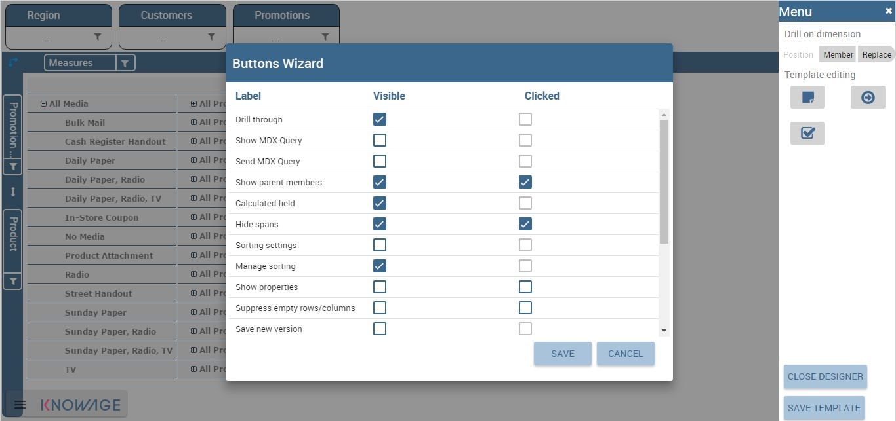

    Wizard to configure the scenario.

Once the configuration is done click on the **Save template** button and on the **Close designer** button to exit template. As :numref:`sidepanelfeatolapdes` highlights, these two buttons are available at the bottom of the side panel.

The admin can develop the OLAP document using also the OLAP engine. In this case the OLAP designer will lack of the scenario configuration since in this case the end-user must not have the grants for editing the records. So in this instance the “Configure scenario” button is not available at all. For the other two options the instructions are right the same as the What-if engine.

Profiled access
^^^^^^^^^^^^^^^^^^^^^^

As for any other analytical document, Knowage provides filtered access to data via its behavioural model. The behavioural model is a very important concept in Knowage. For a full understanding of its meaning and functionalities, please refer to Behavioural Model.

Knowage offers the possibility to regulate data visibility based on user profiles. Data visibility can be profiled at the level of the OLAP cube, namely the cube itself is filtered and all queries over that cube share the same data visibility criteria.

To set the filter, which is based on the attribute (or attributes) in the user’s profile, the tecnical user has to type the Mondrian schema. We report Cube level profilation example as a reference guide. Note that data profiling is performed on the cube directly since the filter acts on the data retrieval logics of the Mondrian Server. So the user can only see the data that have been got back by the server according to the filter.

.. code-block:: xml
    :linenos:
    :caption: Cube level profilation example.
    
        <?xml version="1.0"?>                                                 
        <Schema name="FoodMartProfiled"> 
        ....                                 
         <Cube name="Sales_profiled"> <Table name="sales_fact_1998"/> 
         ...      
           <!-- profiled dimension -->                                        
           <Dimension name="Product" foreignKey="product_id">                 
            <Hierarchy hasAll="true" allMemberName="All Products" primaryKey="product_id">                                   
                <View alias="Product">                                             
                  <SQL dialect="generic">                                            
                    SELECT pc.product_family as product_family, p.product_id as        
                    product_id,                                                        
                    p.product_name as product_name,                                    
                    p.brand_name as brand_name, pc.product_subcategory as              
                    product_subcategory, pc.product_category as product_category,      
                    pc.product_department as product_department                        
                    FROM product as p                                                  
                    JOIN product_class as pc ON p.product_class_id = pc.               
                    product_class_id                                                   
                    WHERE and pc.product_family = '${family}' 
                  </SQL>                   
                </View>                                                            

                <Level name="Product Family" column="product_family"               
                       uniqueMembers="false" />                                                                 
                <Level name="Product Department" column="product_department"       
                       uniqueMembers="false"/>                                                          
                <Level name="Product Category" column="product_category"           
                      uniqueMembers=" false"/>                                           
                <Level name="Product Subcategory" column="product_subcategory"     
                       uniqueMembers="false"/>                                            
                <Level name="Brand Name" column="brand_name"                       
                       uniqueMembers="false"/>                                            
                <Level name="Product Name" column="product_name"                   
                       uniqueMembers="true"/>                                             
            </Hierarchy>                                                       
           </Dimension>                                                       
         </Cube> 
         ...                                       
        </Schema> 

In the above example, the filter is implemented within the SQL query that defines the dimension using the usual syntax “pr.product_family = '${family}'”.                         

The value of the “family” user profile attribute will replace the ${family} placeholder in the dimension definition.

You can filter more than one dimensions/cubes and use more profile attributes. The engine substitutes into the query the exact value of the attribute; in case of a multi value attribute to insert in an SQL-IN clause you will have to give the attribute a value like ’value1’, ’value2’, and insert into the query a condition like “and pc.product_family IN (${family})”.

Once the OLAP document has been created using the template designer the user can insert parameters to profile the document. To set parameters the user has to download the Mondrian schema and edit it; modify the dimension(s) (that will update according to the value parameter(s)) inserting an SQL query which presents the parametric filtering clause.

.. hint::
    **Filter through the interface**

       Note that for the OLAP instance, it has not proper sense to talk about “general” parameters. In this case we only deal with             profile attributes while all the filtering issue is performed through the interface, using the filter panel.

Cross Navigation
~~~~~~~~~~~~~~~~~~~

The cross navigation must be implemented at template level but also at analytical document level. The latter has been already wildly described in Cross Navigation . In the following we will see the first case. Observe that both procedures are mandatory.

For OLAP documents it is possible to enable the cross navigation on members or on cells and we will give more details on these two cases in the following.

Generally speaking, the user must modify the template file to configure the cross navigation in order to declaire the output parameters of the document. We remember that the output parameters definition is discussed in *Cross Navigation* section of *Analytical document* chapter of this manual. 

Cross navigation on members
^^^^^^^^^^^^^^^^^^^^^^^^^^^^

To activate the cross navigation on a member means that the user can click on a member of a dimension to be sent and visualize a target document. The first type of navigation can be set by editing the OLAP query template. In the first case you need to add a section called “clickable” inside the MDX query tag. In fact,

-  the attribute value is equal to the hierarchy level containing the member(s) that shall be clickable;
-  the element represents the parameter that will be passed to the destination document. The name attribute is the URI of the              parameter that will be passed to the target document. The value 0 represents the currently selected member, as a convention: this        value will be assigned to the parameter whose URI is null.

Figure below gives an example. Note that you can recognize that the cross navigation is activated when elements are shown blue highlighted and underlined.

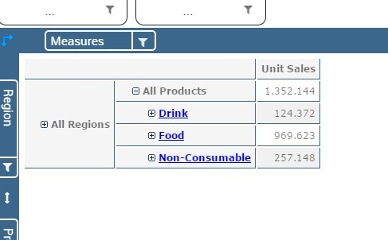

    Cross navigation on member.

If you open the template file you will read instructions similar to the ones reported in Syntax used to set cross navigation.

.. code-block:: xml
    :linenos:
    :caption: Syntax used to set cross navigation.
    
     <MDXquery> 
       select {[Measures].[Unit Sales]} ON COLUMNS,               
       {([Region].[All Regions], [Product].[All Products])} ON ROWS from     
       [Sales_V]                                                             
       <clickable uniqueName="[Product].[Product Family]" >                  
          <clickParameter name="family" value="{0}"/>                           
       </clickable>                                                          
     </MDXquery>                                                           

Cross navigation from a cell of the pivot table
^^^^^^^^^^^^^^^^^^^^^^^^^^^^^^^^^^^^^^^^^^^^^^^^^^

This case is similar to the one-dimension drill except that in this case values of all dimensions can be passed to the target document. In other words, the whole dimensional context of a cell can be passed. Now let us suppose the user wishes to click on a cell and pass to the target document the value of the level family of product dimension and year of time dimension. It should creates two parameters one for family where dimension is product, hierarchy is product, level is product family and one for year parameter where dimension in type, hierarchy is time and level is year. Let see what happens when user clicks on a cell. Depending on the selected cell, the analytical driver family of the target document will have a different value: it will be the name of the context member (of the selected cell) of the “Product” dimension, i.e. the [Product] hierarchy, at [Product].[ProductFamily] level. Look at the following Table for some examples:

.. table:: Context member on product dimension
        :widths: auto

        +-----------------------------------------------------------------+-----------------------------------------------------+
        |    Context member on Product dimension                          | "Family" analytical driver value                    |
        +=================================================================+=====================================================+
        |    [Product].[All Products]                                     | [no value: it will be prompted to  the user]        |
        +-----------------------------------------------------------------+-----------------------------------------------------+
        |    [Product].[All Products].[Food]                              | Food                                                |
        +-----------------------------------------------------------------+-----------------------------------------------------+
        |    [Product].[All Products].[Drink]                             | Drink                                               |
        +-----------------------------------------------------------------+-----------------------------------------------------+
        |    [Product].[All Products].[Non-Consumable]                    | Non-Consumable                                      |
        +-----------------------------------------------------------------+-----------------------------------------------------+
        |    [Product].[All Products].[Food].[Snacks]                     | Food                                                |
        +-----------------------------------------------------------------+-----------------------------------------------------+
        |    [Product].[All Products].[Food].[Snacks].[Candy]             | Food                                                |
        +-----------------------------------------------------------------+-----------------------------------------------------+
 

Let us have a look at the template. Syntax used to set cross navigation shows how to use the cross navigation tag:

.. code-block:: xml
    :linenos:
    :caption: Syntax used to set cross navigation.
    
        <CROSS_NAVIGATION>                                                    
            <PARAMETERS>                                                       
                <PARAMETER name="family" dimension="Product" hierarchy="[Product]" level="[Product].[Product Family]" /> 
                <PARAMETER name="year" dimension="Time" hierarchy="[Time]" level="[Time].[Year]" />
            </PARAMETERS>                                                      
        </CROSS_NAVIGATION>                                                   

A green arrow will be visible in the toolbar to show that cross navigation is enabled. When user clicks on that icon in each cell a green arrow will displayed in each cell. User can click on that icon to start cross navigation from a cell.

