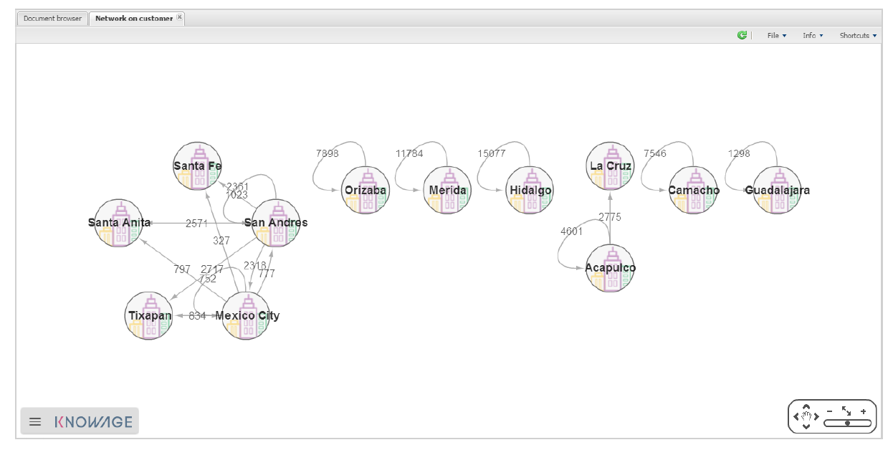

Network
=======

Network theory is the study of graphs as a representation of either symmetric relations or, more generally, of asymmetric relations between discrete objects. It has applications in many disciplines including statistical physics, particle physics, computer science, electrical engineering, biology, economics, operations research, climatology and sociology. Applications of network theory include logistical networks, the World Wide Web, Internet, gene regulatory networks, metabolic networks, social networks, epistemological networks, etc.; see List of network theory topics for more examples.

Using Knowage you can perform Network Analysis with knowagenetworkengine. The engine allows you to generate a network starting from your data. Now let see how. What is a network? It’s a set of nodes linked by relations. So it’s a 3-tuple where the entities are:

-  Source node; 
-  Destination node;
-  Relation.

In Knowage a document is the composition of a template and the data.

-  In this case data are a dataset with at least the three columns described above.
-  The template is the mapping of the columns of the dataset on graph properties (column *?* source node, column *?* destination node,)

Template
----------------

Before entering this section we underlight that Knowage uses cytoscapeweb library (`http: <http://cytoscapeweb.cytoscape.org/>`__ `//cytoscapeweb.cytoscape.org/) <http://cytoscapeweb.cytoscape.org/>`__ to render the network, so sometimes in the description we will refer to cytoscapeweb documentation

**knowagenetworkanalysisengine** supports different types of network definitions. If you have your network defined in GRAPHML or XGMML notation you can upload that file as template of the document and that’s it. After this operation you can open your network using Knowage.

On the other hand if you want to create a dynamic network that gets data from your datasource you should create a dynamic document. In this case the structure of a template is typed in code below:

.. _templatestructnetwork:
.. code-block:: bash
        :linenos:
        :caption: Template structure.

         <NET>
               <NETWOK_DEFINITION>
                  Definition of the network with mapping and rendering options

                  <options> 
                     general rendering options: tooltip, shape of the network, interaction buttons,...
                  </options>

                  <dataset_mapping_LIST>
                     mapping between dataset columns and network properties: data, node shapes, node colors,....
                  </dataset_mapping_LIST>
               </NETWOK_DEFINITION>
               <info>
                     info of the document: left tab content 
               </info>
         <drill>
               Cross navigation configuration
         </drill>
         </NET>

In the following we explain shortly the meaning of the cobe above.

The **NETWOK_DEFINITION** contains the definition of the network: nodes, edges, shapes, colours It has two children:

   • **Options**: it contains the general options of the network. There are 2 type of options:

      -  Network options. These are options that drive the rendering of all the network. For example where to put the navigation commands or the shape of the network (circular, radial,). You can find the list of available properties here http://cytoscapeweb.cytoscape.org/documentation/visualization and the list of layouts here http://cytoscapeweb.cytoscape.org/documentation/layout

      -  Edge/nodes properties. General visual properties for the nodes and edges. The syntax for these settings is in next Syntax for edge/nodes properties:

.. code-block:: bash
        :linenos:
        :caption: Syntax for edge/nodes properties.

          <options>
             <visual_style>
               <nodes>
                  Nodes properties
               </nodes>
               <edges
                  Edges properties
               </edges>
             </visual_style>
          </options>

Tooltip is a special Edge/node property. The tooltip contains a set of proerty/value couple and the syntax is typed in the next Syntax for tooltip,an edge/nodes property:

.. code-block:: bash
        :linenos:
        :caption: Syntax for tooltip,an edge/nodes property.

          <nodes (or edge)>
            <tooltip_LIST>
            <tooltip property="OBJ PROPERTY" text="PROPERTY LABEL TEXT"/>
            </tooltip_LIST>
          </nodes (or edge)>

Where OBJ PROPERTY property is the name of the property (for example id) and PROPERTY LABEL TEXT is the text you’ll see as label of the property in the tooltip. You can find the list of available properties here: `http://cytoscapeweb. cytoscape.org/documentation/visual_style <http://cytoscapeweb.cytoscape.org/documentation/visual_style>`__

-  **Dataset_mapping_LIST**: this section maps the columns of the dataset on properties of the graph. This is done with the tag dataset_mapping. There are two possibilities:

        -  Map a column of the dataset on a property of the graph and the syntax is showed in :numref:`templatestructnetwork`:

.. code-block:: bash
        :linenos:
        :caption: Syntax for tooltip,an edge/nodes property.
      
          <dataset_mapping element="source" column="sourceId" property="id"/>   

Where:

        - * element: is the element where we want to apply the property. It can be source, target (for nodes) and edge;
        - * property: the property of the network object we wan to set;
        - * column: the label of the dataset column we want to map.

The list of available node and edge properties is here http://cytoscapeweb.cytoscape.org/documentation/elements

        -  Set a fixed value to a property. The syntax is showed in :numref:`templatestructnetwork`.

.. code-block:: bash
        :linenos:
        :caption: Syntax for tooltip,an edge/nodes property.

          <dataset_mapping element="source" value="#caabff" property="color"/>

Where: 
     
      - * value is the fixed value of the property we want to set.

-  **info**: contains some text/html that can help the user understanding the network. Since the syntax of the template is XML if
 you want to insert HTML you should envelop it into a CDATA tag. For example refer to :numref:`templatestructnetwork`:

.. code-block:: bash
        :linenos:

          <![CDATA[ .......
            ]]>

-  **drill**: is used to link the network to another document. The structure of the tag is showed in Template structure

.. code-block:: bash
        :linenos:

          <DRILL document="LINKED_DOCUMENT ">
            <PARAM name="PAR_NAME" type="TYPE" property =PROPERTY/>
          </DRILL>

Where:

    -  DOCUMENT: is the label of the destination document;
    -  PAR_NAME: is the destination document parameter label; – TYPE: parameter type
       
        * ABSOLUTE/RELATIVE,
        * EDGE: the parameter will get an edge property value,
        * NODE: the parameter will get an node property value;

    - PROPERTY: property of the object (node/edge) to bind to parameter.

An example\*
------------------

Lets try to create a network that shows where the customers of Mexico usually go shopping.

Here, in the query on the foodmart demo data:

.. code-block:: sql
        :linenos:
        :caption: Foodmart demo data.
        
          SELECT s.store_city store
                ,c.city customer
                ,c.city customer_city
                ,count(*) number_sales
                ,((length(s.store_city) \* 7) + 10) textlenght
                ,CONCAT (s.store_city,'-',c.city) rel_id
          FROM sales_fact_1998 sf
          JOIN customer c ON (c.customer_id = sf.customer_id) 
          JOIN store s ON (s.store_id = sf.store_id)
          WHERE c.country = 'Mexico' 
          GROUP BY store
               ,customer
               ,rel_id
 
Now we can collect all these information and build our first network template. In our example the nodes are the cities and the relations represent where the customer of a city go to shop. Template for foodmart demo shows a simply template for this document:

.. code-block:: bash
        :linenos:
        :caption: Template for Foodmart demo.
        
          <NET>
             <NETWOK_DEFINITION>
                  <options pan_Zoom_Control_Position="topLeft">
                  </options>
                  <dataset_mapping_LIST>
                    <dataset_mapping element="source" column="customer" property="id"/>
                    <dataset_mapping element="target" column="store" property="id"/>
                    <dataset_mapping element="edge" column="rel_id" property="id"/>
                  </dataset_mapping_LIST>
             </NETWOK_DEFINITION>
          </NET>

Now we try to make the graph “nicer”. We want to:

-  see the name of the cities,
-  see the number of sales of customers coming from city A to shop in city B,
-  add some image as background of the nodes The template will look like Improved template for foodmart demo:

.. code-block:: bash
        :linenos:
        :caption: Improved template for foodmart demo.

         <NET>
            <NETWOK_DEFINITION>
                  <options edgeLabelsVisible="true" pan_Zoom_Control_Position="topLeft" nodeTooltipsEnabled="true" layout="Circle">
                      <visual_style>
                         <edges directed="true"> 
                           <label>
                             <passthrough_Mapper attrName="number_sales"/>
                           </label>
                         </edges>
                      </visual_style>
                  </options>
                  
                  <dataset_mapping_LIST>
                     <dataset_mapping element="source" column="customer"property="id"/>
                     <dataset_mapping element="source" property="size" value ="50"/>
                     <dataset_mapping element="source" column="customer_city "property="label"/>
                     <dataset_mapping element="source" property="image"value="../img/city2.png"/>
                     <dataset_mapping element="source" property="labelFontSize" value="12"/>
                     <dataset_mapping element="source" property="labelFontWeight" value="bold"/>
                     <dataset_mapping element="target" column="store"property="id"/>
                     <dataset_mapping element="target" property="labelFontWeight" value="bold"/>
                     <dataset_mapping element="target" property="labelFontSize" value="12"/>
                     <dataset_mapping element="edge" column="rel_id"property="id"/>
                     <dataset_mapping element="edge" column="number_sales"property="number_sales"/>
                     <dataset_mapping element="edge" value="ARROW" property="sourceArrowShape"/>
                  </dataset_mapping_LIST>
            </NETWOK_DEFINITION>
         </NET>

**Remark**: The path ../img/city2.png is relative to the context of the web application, so it refers to the folder img inside the web application knowagenetworkengine Finally, the result is showed in next figure:

     Network for foodmart demo example.
