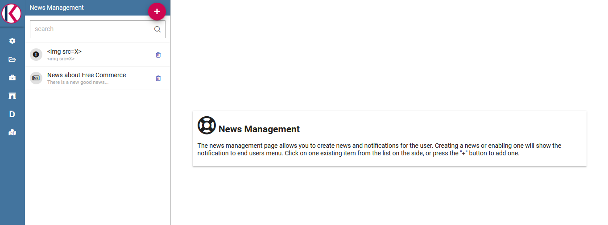

News management
===================

The **news management** is an helpful functionality to keep the end user constantly informed on any changements or updates on the Knowage platform itself. In this section we will describe the main steps to insert a latest piece of news.

How to publish news
---------------------------

To put news in place is mandatory to have administration priviledges. An admin user can insert the news entering the “news management” functionality from Knowage main menu, as the following picture highlights:

.. figure:: media/image01.png

    News management menu item.
    
Consequently, the user is redirected to the News management list. The page is divided into two areas. On the left side, all previously inserted news are listed. When clicking on one of them, its details are shown on the right side. 

    Access news management list.
    
To edit the latest news instead, the user must click on the red plus icon button available at the center of the page. When clicking on the icon, Knowage server opens the interface shown in the following image:

.. figure:: media/image03.png

    Access news management list.
    
Here the user is asked to:

-  insert the news title,
-  insert the news description,
-  insert the text of the news,
-  specify the expiration date, i.e. the date until the news can be visible from the end user,
-  to check/unckeck a flag to enable/disable the piece of news,
-  the list of the roles that have the permission on reading the news.
    
Once the "news details" form is filled in all its mandatory parts, the user can save the piece of news using the "save" button, available on top right corner of the page.

How the end user can read the news
------------------------------------

When some news are added, the **news icon** reports the presence of recent news thanks to a red spot symbol that highlights also the number of latest news.

    News notification.

The news icon is always available under the Knowage menu panel, while the red icon stay still the user has some unread news.

.. figure:: media/image05.png

    News notification pop up.

The user can click on the news item itself from the list, to read all its information and mark it as already readed
