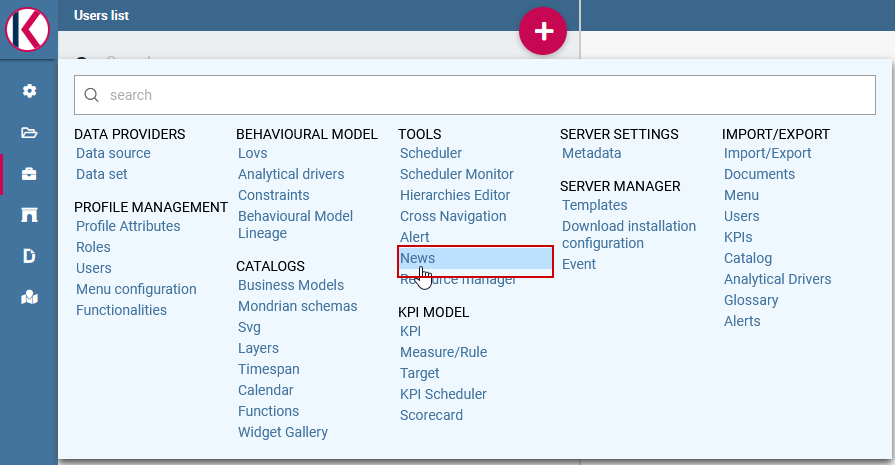

News management
===================

Using this new features it is possible to send news to the end user in order to advice changed on Knowage. 

How create a piece of news
---------------------------

Currently only the administrator can manage the news.
The knowage administrator can create the news using the “news management” functionality from main menu:

    News management menu item.
    
Knowage will show you the master detail form:

.. figure:: media/image02.png

    Access news management list.
    
Click on the red plus icon button to create a new news.
Knowage will show you the following form:

.. figure:: media/image03.png

    Access news management list.
    
Where you have to insert:
    - The news title
    - The news description
    - The text of the news
    - The expiration date, the date until the news can be visible from the end user
    - Active flag, to enable/disable the news
    - The list of the roles that can be see the news.
After that the user can save the news using the right top “SAVE” button.

How the end user can see the news
------------------------------------

When the administrator has created the news, the end user can see they using the news option on the main menu. 

.. figure:: media/image04.png

    News notification.

The icon is always present, but when the user has some unread news a red icon appears showing the number of the news unread.

    News notification pop up.

The user can click on the news to read all the information and mark as already readed
