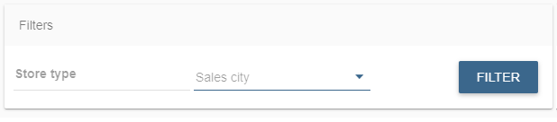
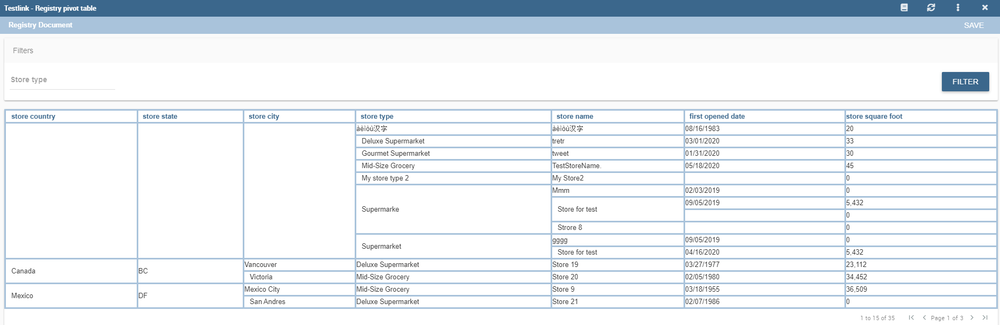

Registry
========

A Registry document allows users to write, cancel and modify items of a datamart. Knowage allows users to implement a Registry document through the **Qbe Engine**. By the way it has a different graphical interface compared to the Qbe one. An example is given in the following figure. In next chapters we will see how to navigate a Registry document (*Registry features* paragraph) and how to create a new one (*Registry development* paragraph).

.. figure:: media/image339.png

    Example of Registry document.

Registry features
-------------------

The execution of a Registry document opens a plain table: the records are shown in rows and they can be browsed using the pagination available at the bottom of the window. We underline that it is possible to edit each item of the table if inside template that column is set to be editable. Just click on a cell you may wish to rearrange and type a string or a numeric value accordingly. Some examples are highlighted below.

    Editing table cells.

Moreover, you can add new rows from scratch selecting the “Add row” button |image335| in the header of last column. Insert in each cell the corresponding value: string, number or date. “Add row” button will be available if inside template there is a configuration: <CONFIGURATION name="enableAddRecords" value="true"/>

.. figure:: media/image343.png

    Adding a new row.

Vice versa, you can delete one or more rows using the “Trash” icon |image338| in the last column. “Trash” button will be available if inside template there is a configuration: <CONFIGURATION name="enableDeleteRecords" value="true"/>

It is important to click on the “Save” button |image339| to store the adjustments done in the datamart. “Save” button is available in Functionality bar, above table.

.. |image339| image:: media/image345.png
   :width: 30

.. _functionalitybar:

    Functionality bar.

Furthermore you can use filters, if implemented, available in the Functionality bar. Click on the “Filter” icon |image340| to run the functionality. Otherwise, click on the “Cancel” icon |image341| to clear the boxes off.

.. |image340| image:: media/image346.png
   :width: 30

Note that, since records are displayed in a plain table, it is available a combobox (see figure below) which allows the user to visualize all fields related to the record of the previous cell and then change from one to another to get all data.

.. figure:: media/image348.png

    Select one field from a combobox.

JPivot Registry characteristics
~~~~~~~~~~~~~~~~~~~~~~~~~~~~~~~

It is possible to implement also a JPivot Registry document. The graphical features are very similar to the ones exposed in *Registry development* paragraph. An example is given below.

.. _examplejpivotregdoc:

    Example of Jpivot Registry document.

In this case the table shows columns organized in a hierarchical way and a grouping function is implemented. From the left to the right the columns contain fields at different detail levels. The last column in our example in the figure above contains numeric data. Such a field is grouped at the “country” level. The grouping level depends on the configurations made on template building.

In the JPivot instance it is not allowed to add, modify or cancel rows. Furthermore, it is not permitted to edit cells which contain string items while the numeric ones are still changeable. If implemented, filters are still available.

Registry development
--------------------

To create a Registry document there must be available a datamart schema on Knowage Server. Then you must edit an XML template. The latter is very similar to the one produced under the Qbe development but in this case you must add an appropriate tag. Indeed, if the template file has the **<REGISTRY>** tag the engine shows data in registry modality; namely it shows a table whose rows are manageable by end users by adding, editing or deleting them.

Here we exhibit a possible syntax for a Registry document.

.. _exampletemplatebuild:
.. code-block:: xml
    :linenos:
    :caption: Example (a) of template for Registry.

    <?xml version="1.0" encoding="windows-1250"?>
    <QBE>
		<DATAMART name="RegFoodmartModel" />
		<REGISTRY>
			<ENTITY name="it.eng.knowage.meta.regfoodmartmodel.Product">
				<FILTERS>
					<FILTER title="Class" field="product_subcategory" presentation="COMBO" />
					<FILTER title= "Product name" field="product_name" presentation="COMBO" />
				</FILTERS>
				<COLUMNS>
					<COLUMN field="product_id" unsigned="true" visible="false" editable="false" format="####" />
					<COLUMN field="product_name" title="Product name" size="200"
                        editor= "MANUAL" sorter="ASC"/>
					<COLUMN field="product_subcategory" title="Class" size="200"
                        subEntity="rel_product_class_id_in_product_class" foreignKey="rel_product_class_id_in_product_class" />
					<COLUMN field="SKU" title="SKU" size="200" editor="MANUAL" />
					<COLUMN field="gross_weight" title="Gross weight" size="200" editor="MANUAL" />
					<COLUMN field="net_weight" title="Net weight" size="200" editor="MANUAL" />
				</COLUMNS>
				<CONFIGURATIONS>
					<CONFIGURATION name="enableDeleteRecords" value="true"/>
					<CONFIGURATION name="enableAddRecords" value="true"/>
					<CONFIGURATION name="isPkAutoLoad" value="true"/>
				</CONFIGURATIONS>
			</ENTITY>
		</REGISTRY>
	</QBE>

In particular, we give some details for each tag and main attributes.

-  **ENTITY**: the entity name as in the model. It must be the fully-qualified name of the class representing your registry in the model;
-  **FILTERS**: possibility to define filters by specifying the title, the field (among shown columns) and the type among COMBO, MANUAL or DRIVER: in this last case user has also to specify the analytical driver that take this filter’s value;
-  **COLUMNS**: columns list specifying:

   -  **field name**: the reference to the field identifier into the model;
   -  **title**: the title of the column shown (optional);
   -  **visible**: the visibility of the column (optional, default true);
   -  **editable**: the editability of the column (optional, default true);
   -  **color and format for numbers**: optional;
   -  **size**: the width of the column (optional);
   -  **editor**: the editor. Default type is free-text for simple column (not FK values), but for date is possible to show the picker through the type PICKER. The format option specifies the format date;
   -  **subEntity**: if the column is a reference key, the user can specify the subentity referred and the foreign key name. This value must be equals to the name of the relationship object created in the model. The field shown will be of the entity referred and will be shown as COMBO if editable;
   -  **foreignKey**: if the subEntity property is set, foreignKey property must be set with the name of the foreign key (to lower case);
   -  **dependsFrom**: if the column content is logically correlated to other registry’s column, it is possible to specify this logic through this parameter. DependsFrom identifies the field name on which it depends (Optional);
   -  **dependsFromEntity**: usable only with dependsFrom parameter. It defines a different entity to resolve the correlation (optional);
   -  **orderBy**: is used in case of foreign key. The combo box is ordered by the column here indicated, by default is the column extracted (optional);
   -  **infoColumn**: if true ignore the column when inserting or updating the record (optional);
   -  **defaultValue**: defines the default value for the field; if the user does not set any value for this field during insertion, this value will be set automatically (optional, not allowed if subEntity or foreignKey property is set). For date fields, the correct pattern is "yyyy-MM-dd'T'HH:mm:ss.xxx'Z'".

We stress that it is mandatory to point at one datamart table using a column with a numeric key. The code line is highlighted in figure below. While, if not elsewhere specified, a descriptive column will be displayed by default.

.. code-block:: xml
    :linenos:
    :caption: Pointing at a numerical column.

    <COLUMNS>
      <COLUMN field="store_id" visible="false" editable="false" />
      ...
    </COLUMNS>

Still referring to the code above, we underline that the “product_subcategory” field is used as a subcategory. It belongs in fact to another table. In this case it is enough to add the attributes: subEntity="rel_product_class_id_in_product_class"  foreignKey="rel_product_class_id_in_product_class".

Filters
~~~~~~~~~~~~~~~~~~~~~~~~~~~~~~~

.. code-block:: xml
    :linenos:
    :caption: Filter definition example.

    <FILTERS>
  		<FILTER title="Store type" field="store_type" presentation="MANUAL" />
  		<FILTER title="Sales city" field="sales_city" presentation="COMBO" />
  		<FILTER title="Sales first_opened_date" field="first_opened_date" static="true" visible="true" filterValue="29/05/2020 02:00:00.0" />
    </FILTERS>

Filter definition allows to set different properties:
   -  **title**: the title of the filter;
   -  **field**: the reference to the field identifier into the model;
   -  **presentation**: COMBO/DRIVER/MANUAL (optional if static="true");
   -  **visible**: the visibility of the filter (optional, default false);
   -  **static**: true/false. Set this property if you want to limit filter value to a specific value (optional);
   -  **filterValue**: the specific value you want to set for the filter (mandatory if static="true"). For date fields, the correct pattern is " %d/%m/%Y %h:%i:%s".

Analytical driver
~~~~~~~~~~~~~~~~~~~~~~~~~~~~~~~
Registry filtering by analytical driver is possible using DRIVER value for presentation property in filter TAG. Registry template must contains FILTERS tag. Below an example of configuration for a driver named "UNIT_SALES_AD" insisting on the column "UNIT_SALES".

.. code-block:: xml
    :linenos:
    :caption: Pointing at a numerical column.

	<FILTERS>
		<FILTER title="UNIT_SALES_AD_title" field="UNIT_SALES" presentation="DRIVER" driverName="UNIT_SALES_AD" />
    </FILTERS>

Profile attributes
~~~~~~~~~~~~~~~~~~~~~~~~~~~~~~~

Another way to filter registry content is using profile attributes. If you want to use profile attributes to filter values you have to follow these steps:

- Create a profile attribute (if necessary) from the Manage Profile Attributes menu
- Associate the profile attribute with the column during model creation

This way, your data will be filtered by this attribute (if not empty) both when viewing data and when inserting or updating records.

Multivalue
__________

If your profile attribute is a multivalue one, you have to:

-  set *IN* clause as *"Profile attribute Filter Type"* during model's creation
-  set profile attribute values respecting this format *'value1','value2',...,'valueN'* or *{,{value1,value2,...,valueN}}*.

In this way, profile attribute value will be treated as a list of values and filter will be applied with this criteria.

JPivot Registry instance
~~~~~~~~~~~~~~~~~~~~~~~~

The Registry instance allows to develop also a Jpivot table. See the last figure (above) to have an idea while the syntax example is given in the next code:

.. code-block:: xml
    :linenos:
    :caption: Example (b) of template code for Registry.

	<QBE>
		<DATAMART name="foodmart" />
		<REGISTRY pagination = "false" summaryColor="#00AAAA">
			<ENTITY name="it.eng.knowage.meta.foodmart.Store">
				<FILTERS>
					<FILTER title="Store Type" field="store_type" presentation="COMBO" />
				</FILTERS>
				<COLUMNS>
					<COLUMN field="store_id" visible="false" editable ="false" />
					<COLUMN field="store_country" title="store country" visible="true"
                           type="merge" editable ="false" sorter ="ASC" summaryFunction="sum" />
					<COLUMN field="store_state" title="store state" visible="true"
                           type=" merge" editable ="false" sorter ="ASC" />
					<COLUMN field="store_city" title="store city" visible="true"
                           type="merge" editable ="false" sorter ="ASC" />
					<COLUMN field="store_type" title="store type" type="merge" sorter="ASC" />
					<COLUMN field="store_number" title="Number" size="150"
                           editable="true" format="########" color="#f9f9f8" type="measure"/>
				</COLUMNS>
				<CONFIGURATIONS>
					<CONFIGURATION name="enableDeleteRecords" value="true"/>
					<CONFIGURATION name="enableAddRecords" value="true"/>
				</CONFIGURATIONS>
			</ENTITY>
		</REGISTRY>
	</QBE>

Note that to activate the JPivot modality it is important to add the attribute type="merge" and have at least one numeric field. Furthermore the selected column fields must be hierarchically structured.
