Resource Manager
========================================================================================================================

.. important::
         **Enterprise Edition only**

         With the Knowage Community Edition the Resource Manager  will be able to manage just the **models** folder in order to define metadata for data mining analysis. With the Knowage Enterprise Edition,  will be able to manage all Knowage's installation resources.

The **Resource Manager** functionality available under the **Tool** section of Knowage main menu, as shown in Figure below, allows you to manage all files within the Resources folder of the Knowage's installation. In next sections we will see in details how to use the Resource Manager feature.

.. figure:: media/resource_mng_1.png

    Resource Manager from contextual menu.
   
As default, the system shows files starting by the root directory:

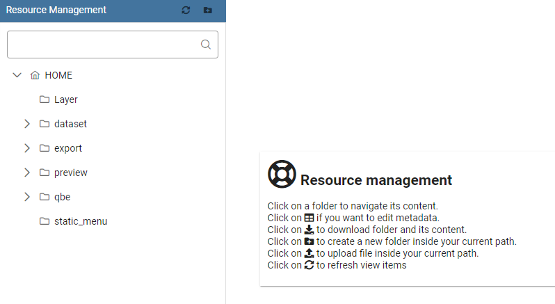

    Resource Manager starting view.

Resource Manager functionalities
------------------------------------------------------------------------------------------------------------------------

The Resource Manager window diplays two sections: on the left the tree representing the existing system resources; on the right the details of the selected left-folder. On the right-top is available the current path:

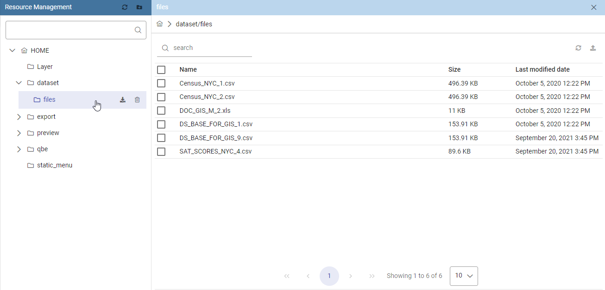

    Resource Manager detail view.

**Tree functionalities**

The tree shows exactly the phisical structure of the file system from the **resources** folder. On the top bar are present two funcionalities: **Refresh tree** and **Create new folder**:

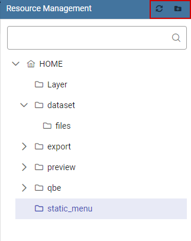

    Tree view.

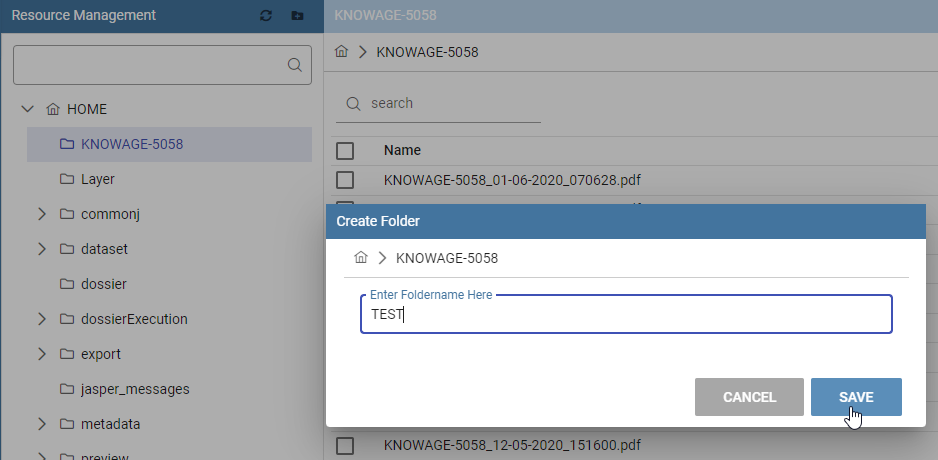

    Creation detail.

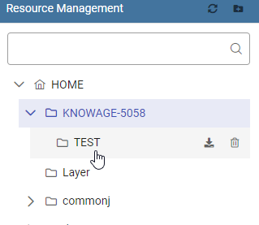

    Creation result.

Pay attention that the new folder is created attached to the folder selected in the tree ('KNOWAGE-5058' in this case).

Clicking on the “Download” icon on a specific folder you can download all files contained :

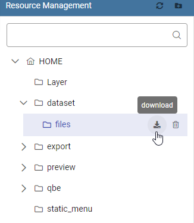

    Download functionality icon.
   
Give a name, select a folder for the download  and the zip file will be available on your local system.

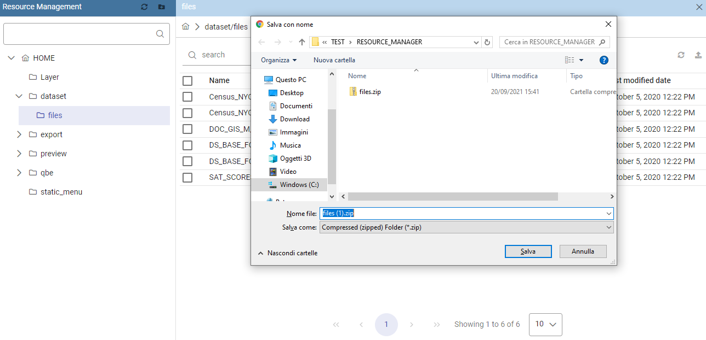

    Download functionality.

Clicking on the "Delete" icon on a specific folder you can remove folder fisically from the Knowage server (after confirmed the operation). Please attention because this is an irreversible operation.

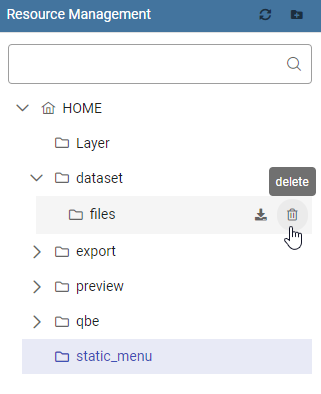

    Delete functionality icon.

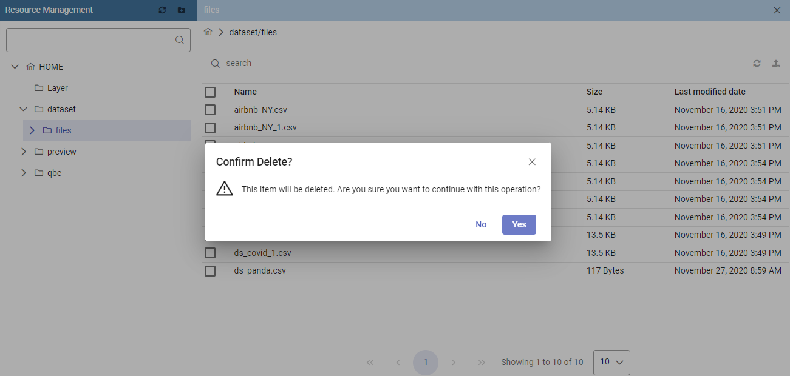

    Delete functionality confirmation.

**Detail panel**

When a folder is selected, the right panel shows all files it contains. For each one shows Name, Size and Last Modified Date:

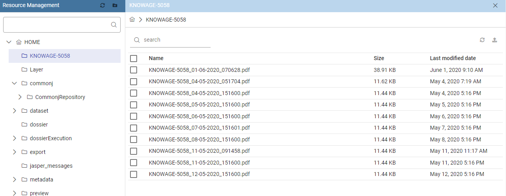

    Detail view.

All items are checkable, this permits you to select which ones you want download or remove throught specific icons in the toolbar:

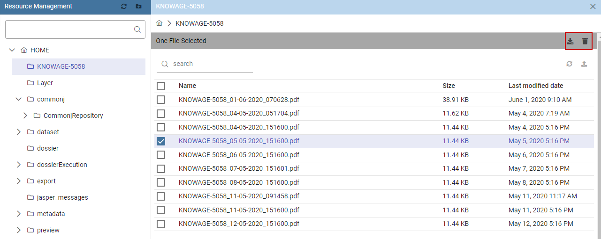

   Massive functionalities available for selected files

If you want, you can too add one or more files directly throught the **Upload** icon on the top of the list:

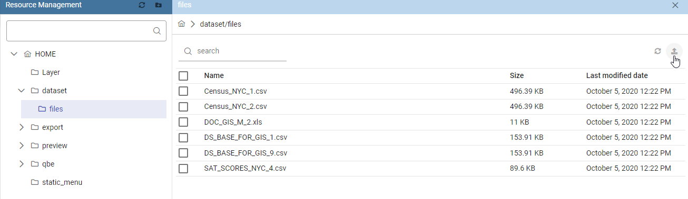

   Upload files

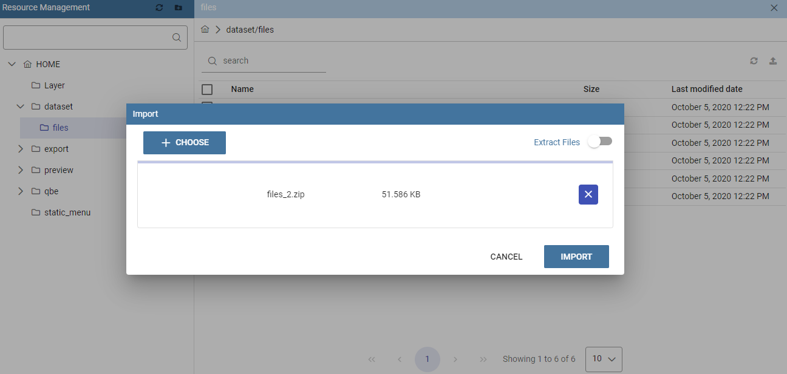

   Selection file popup

In this context, if you upload a zip file, you are able to choose if you want to mantein the file zipped:

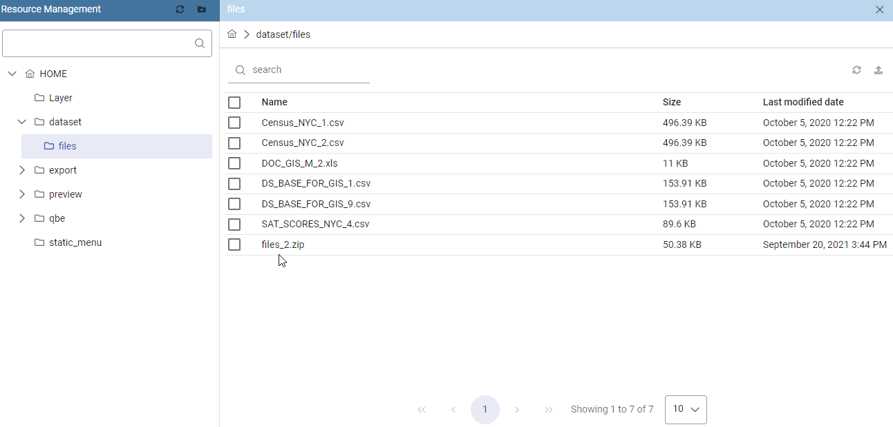

   Uploaded zipped file

or if you want unzip it throught the selection of 'Extract Files' option in the popup:

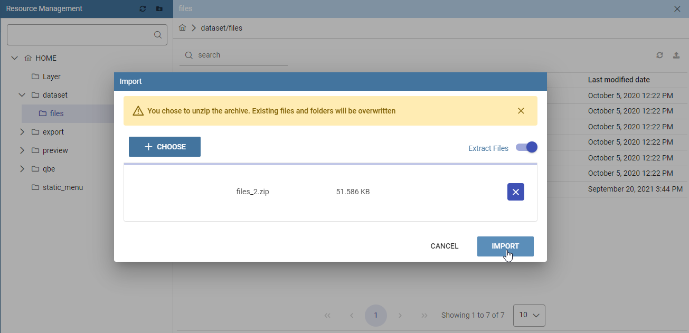

   Upload unzipped file

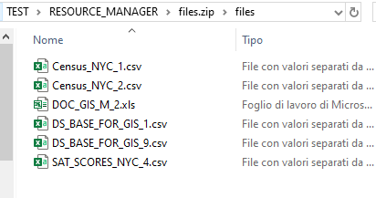

   Uploaded unzipped files result

**Model Metadata Definition**

As already told at the beginning, **models** is the unique folder managed both by the Community and the Enterprise Edition. It contains all data-mining models usable by the Knowage Function Catalog.

For each model is possible to define its metadata, download and/or delete the model using directly the tree options:

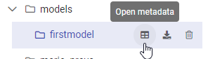

   Models folder options

*Metadata management*

The **Metadata** option opens a gui in which the user can defines metadata information about the model in use.
   
So, it's possible insert:
   - a more specific Name for the model
   - the Version number of the model
   - the Type of analytics: a value selectable between 'Descriptive', 'Predictive' and 'Prescriptive'
   - an image to represent the logic of the model uploadable througth the specific icon
   - a detailed description
   - information about the Accuracy and then Performance for the model
   - information about the way of usage of the model
   - information about formats for input and output data

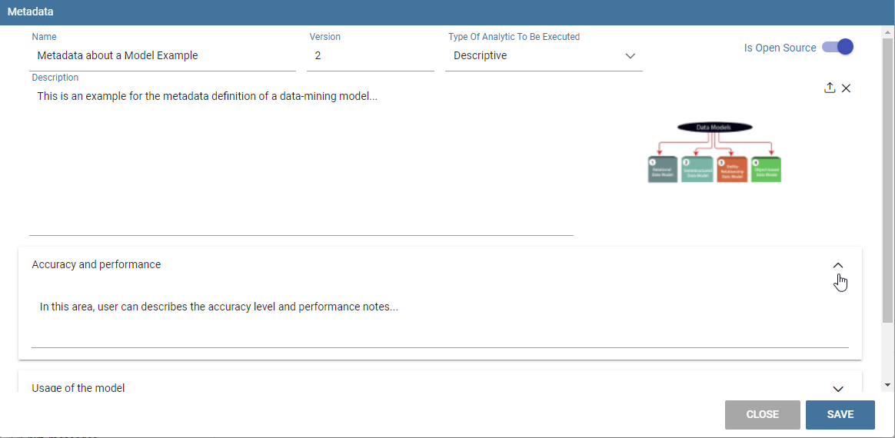

   Metadata example