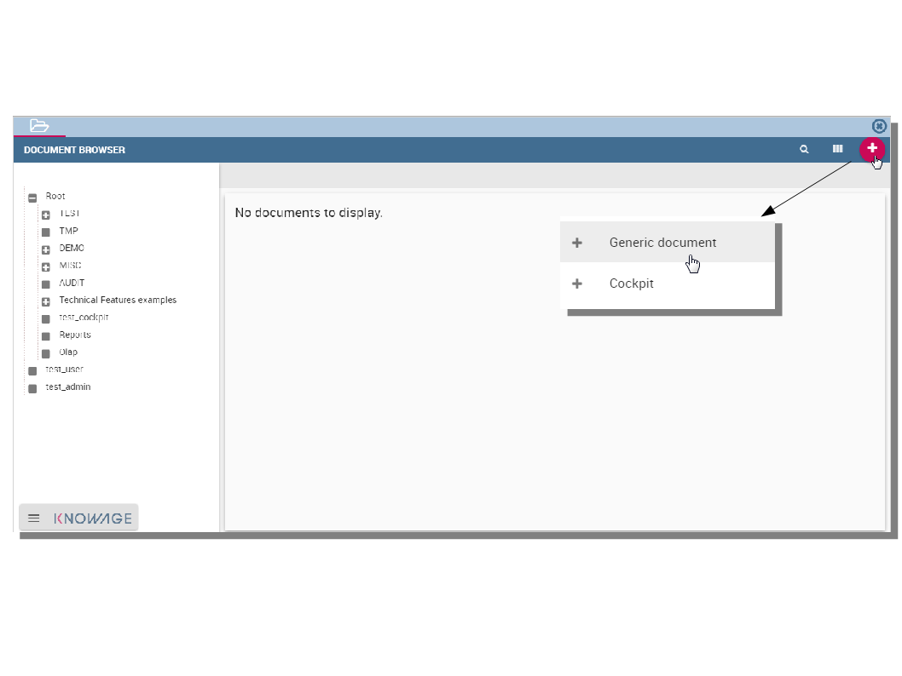

Scorecard
===========

The **Scorecard** feature, available in Knowage suite as highlighted in the following figure, allows to supervise different KPIs at the same time. This option gives an exclusive complete overview of the KPIs situation when the user is not interested in a single threshold check. This tool is in fact useful when concern is addressed to monitoring the overcoming of two or more critical KPI values.

.. _scorcardforthecontmenu:
.. figure:: media/image161.png

    Scorecard from the contextual menu.

Scorecard development
-------------------------

A scorecard is structured in hierarchical levels. Shortly, there is a first level called **Perspective** composed of KPIs grouped on targets. Otherwise, **Targets** are assigned a threshold depending on the KPIs they are composed of. In the following we will describe in detail a scorecard configuration. When clicking on the Scorecard menu item the window of figure below opens. Here the implemented scorecards are listed and can be explored once selected and edited.

.. _scorcardwindow:
.. figure:: media/image162.png

    Scorecard window.

The “Plus” icon available at the right top corner of the page opens a new window where to set a new scorecard, as shown below. Assign a name and click on **Add perspective** (Figure below).

.. figure:: media/image163.png

   Defining a new scorecard.

A perspective allows you to organise the monitoring over targets. 

.. figure:: media/image164.png

    Add perspective to the scorecard.

An example is given in the following figure.

.. _perspectlistexample:
.. figure:: media/image165.png

    Perspective list example.

In fact, each perspective manages one or more targets accordingly to the user’s requirements. A target consists of one or more KPIs and it is assigned a threshold color according to the chosen **Evaluation criterion**. In fact, if one selects:

-  **Policy “Majority”** the target gets the threshold of the KPI threshold that numerically exceeds the others,
-  **Policy “Majority with Priority”** the target gets the threshold of a specific KPI,
-  **Policy “Priority”** the target gets the majority threshold of the KPIs in case the primary stated KPI returns the lower threshold,       namely the “green” one, while it gets the threshold of a primary stated KPI in case the latter returns the other thresholds, namely the “yellow” or the “red” one.

.. warning::
    **Thresholds of selected KPIs must have the right colors**
       
       Note that the scorecard shows the right colors accordingly with the selected policy only if the KPIs which compose the targets          have **no filters** and **standard colors** (see Section 7.1, Step 2 for definitions) to highlight the threshold.

.. warning:: 
    **“Standard” colors for thresholds**
       
       When the targets contain parametric KPIs the target/perspective evaluation cannot be completed for value absence. Therefore the          warning lights turn grey. The right visualization of the scorecard must be implemented through a scorecard document. Check              Section 8.2 to have more details on how to develop a scorecard document.

An example is showed below.

.. figure:: media/image166.png

    Select the KPI with priority.

The same choice is available at the perspective level (refer to next figure), that is:

-  **Policy “Majority”** the perspective gets the threshold of the target threshold that numerically exceeds the others,
-  **Policy “Majority with Priority”** the perspective gets the threshold of a specific target,
-  **Policy “Priority”** the perspective gets the majority threshold of the targets in case the primary stated target returns the lower    threshold, namely the “green” one, while it gets the threshold of a primary stated target in case the latter returns the other          thresholds, namely the “yellow” or the “red” one.

.. _prespectpolicy:
.. figure:: media/image167.png

    Perspective policy.

Remember to save once perspectives and targets have been set.

Creation of a Scorecard document
-------------------------------------

Once saved it is possible to develop a scorecard document which can be easily consulted by (authorized) end users. To create a scorecard document click on the “Plus” icon available in the document browser and then “Generic document” from the panel as shown below. Here fill

    Create a generic document from document browser.

in mandatory fields (marked with an asterisk) and select the KPI type and **KPI engine**. Then open the “Template build”. Here select the “Scorecard” option as in figure below9 and consequently Creation of a Scorecard document choose an existing scorecard from the list. Make the desired customizations and save.

.. figure:: media/image169.png

    Template creation window.

Figure below gives an example of the scorecard document interface. The arrows point out the perspectives’ achievement of the goals or, on the contrary, the missing of the targets. As well the achievement/failure of the single targets is pinpointed by the arrow signals close to each target.

.. figure:: media/image170.png

    Scorecard document interface.

Note that it is possible to check the policy used for each perspective. In fact, by clicking on one of them a wizard opens showing the policy adopted and the goal got by ach KPI.

.. figure:: media/image170.png

    Scorecard document interface.
   
