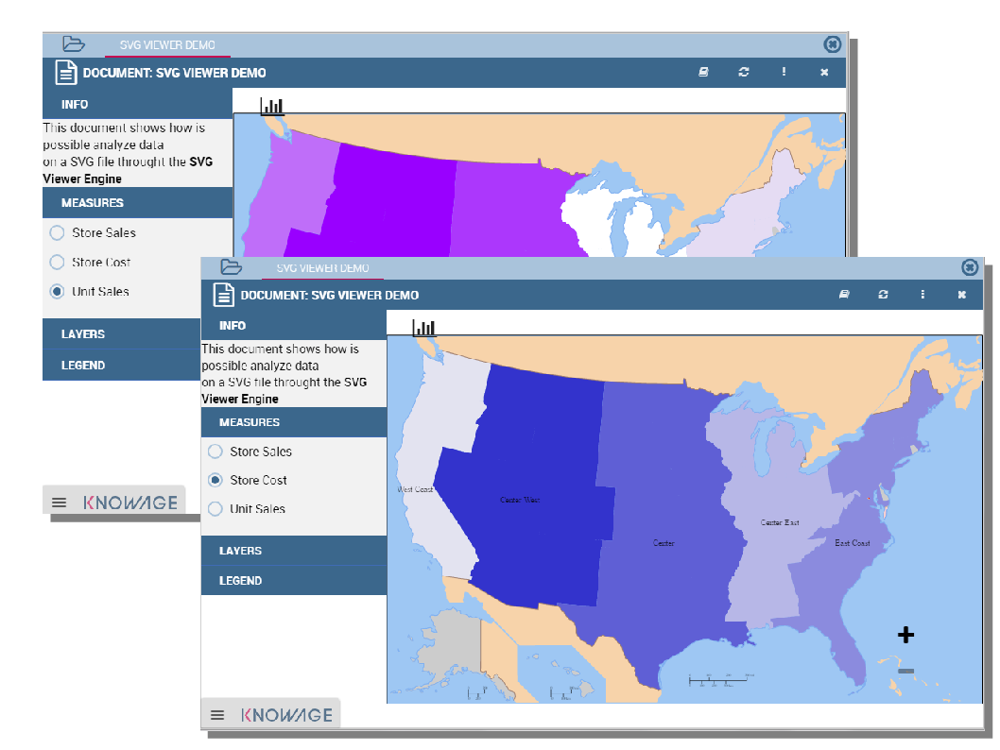
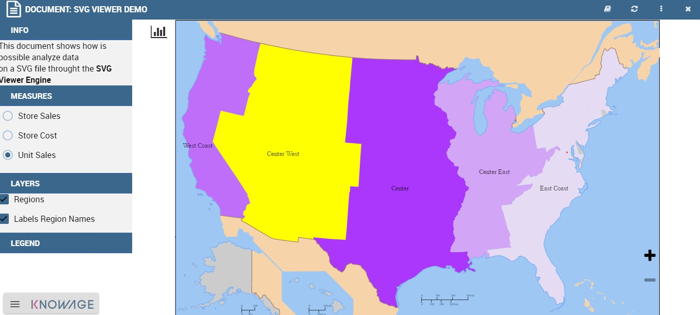
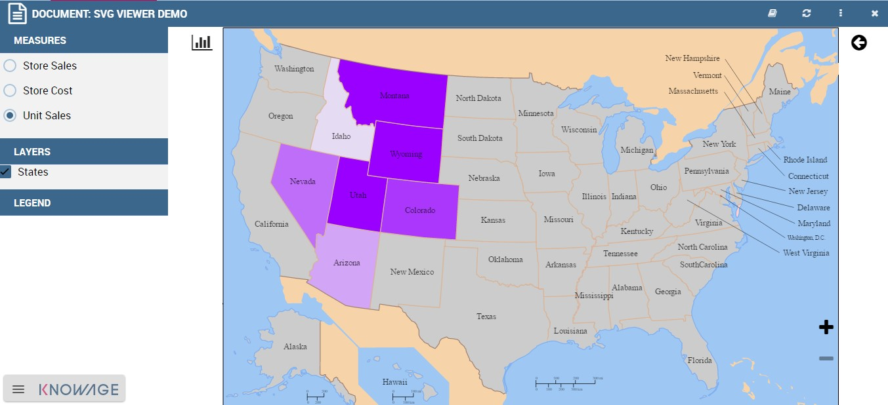
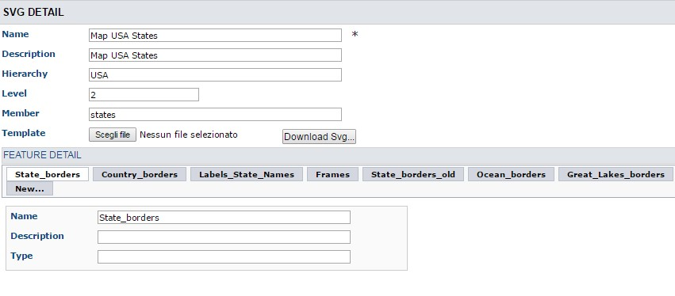
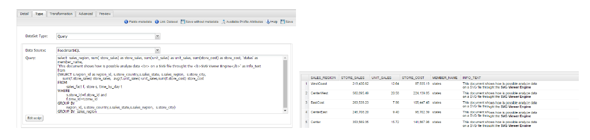

SVG document visualization
============================

In this chapter we will suppose that a technical user has created an SVG document and that the final user is enabled to visualize and use it. He can choose which KPI to show on the “map” and analyze its values, then could drill down into sub-members or other Knowage documents to view other details and other analysis.

    SVG document visualization example.

The images in Figure above shows how is possible to change KPI analysis and drill towards other SVG documents of the same hierarchy.

My first SVG Map or design
--------------------------

The SVG Viewer Engine is a tool that lets you develop documents based on the SVG, acronym for Scalable Vector Graphics, format. It permits to show different business information directly on each area, and permits the drill action to other more detailed SVG files using a logical hierarchy. This viewer is divided into two sections:

-  a panel with many dynamic details such measures, layers and legend plus an optional section with specific information about the
   active document,
-  the svg document.

To give an example, we can imagine to visualize throught an SVG the USA map. At first we can show data at the “Regions” level and then throught the click / drill - show the same or other information at the States “level”. We give an example of map document produced with the SVG engine in the two figures below.

.. _svgexampleusalevel:

    SVG document example at the USA Regions level.
   

    SVG document example at the States level after the selection of the “Center West” Region.

Like other Knowage documents type there is a set of activities managed by the technical users and others used by the final users. These last ones are specifically about consulting.

Technical activities
~~~~~~~~~~~~~~~~~~~~~~~~~~

First of all, a technical user needs to configure the logical hierarchy of the SVG and to define datasets with the business data he/she wishes to show. Finally he/she must type the document template. We will give details about these points in the following sections.

SVG Catalogue
^^^^^^^^^^^^^^

The first activity that you need to do as administrator is to find or create an SVG file. Any file saved in SVG format is a text file in XML format. As a consequence, they can easily be queried, indexed, enriched with scripts and, if necessary, zipped. The SVG final output could represent everything: geographical areas (like USA in the previous example), concepts (like the item production steps) and so on.

SVG Format
^^^^^^^^^^^^^^

The Scalable Vector Graphics, SVG, refers to an XML-based encoding format, used to describe two dimensional vector graphical objects. SVG is an open standard, defined by the World Wide Web Consortium (W3C), which released its first version in 1999. Read more at http://www.w3.org/Graphics/SVG/ .

Not all graphical objects of an SVG can be thematized. Using the SVG grouping operator <g>, the developer can create one or more subsets of graphical objects and specify which groups should be subject to thematization. Each group has an unique name, corresponding to the value of the id attribute of the <g> tag (e.g. <g id=“regions”>). Considering that, graphical objects grouped in an SVG file are usually homogeneous elements (in other words, they model a same category of objects: regions, towns, streets, etc.), we can consider these groups as layers and the objects can be considered as features.

Once obtained the SVG file, you should register it into Knowage SVG catalogue.

The Svg catalogue contains all SVG that can be used with this engine throught specific hierarchies. In this context a hierarchy is a definition of three concepts:

-  the hierarchy itself,
-  the level,
-  the member.

These three information are used from the system to recover the correct SVG into the catalogue.

.. _enteringhierarchydet:
.. figure:: media/image245.png

    Entering the hierarchy details.

As you can see in the figure above, you must insert a name and an optional description of the new SVG component, then you need to specify a logical hierarchy’s label, its number of the level and a logical name for the member that it represents. At last you need to upload the SVG file. When this configuration will be saved, the system will read the SVG content and for each group (or tag <g>) will be created a layer. All layers will be shown into the “Feature Detail” section (read only section).

In this first example in the figure above we defined an SVG component for the USA regions specifying that it’s the first level (in other words it’s the first SVG of the “USA” hierarchy).

The second level (the more detailed SVG) is about the USA states and it’s defined like the next example below:

    Entering the hierarchy details.

As you can see the principal differences between these configurations are only about the level content and the member label. This means that both will be used in the same hierarchy’s context and that from the “Regions” SVG will be possible to drill on the “States” SVG. Anyway it is not mandatory to define more than one level: it depends from each project implementation.

Datasets definition
^^^^^^^^^^^^^^^^^^^^^

After that all SVG was loaded, you must define a dataset (one for each level) that you want to use for getting and showing business information from your DWH. You can refer to Chapter 3 of this manual to know how to create datasets. Here in the following figure a dataset of our example:

    Left. Dataset behind the SVG document. Right. Dataset preview.

Template building
^^^^^^^^^^^^^^^^^^^^

The template allows the SVG viewer to properly join business data (Knowage dataset) and spatial data (SVG included in the catalog), in order to produce the analytical documents.

At the moment there is not yet a designer to create a template for this engine, anyway, it’s an XML file very simple to define.

An example below.

.. _enteringhierarchydet:
.. code-block:: xml
   :linenos:
   :caption: Example of SVG code for template file.

      <?xml version="1.0" encoding="UTF-8"?>                                  
      <MAP>                                                                                                                             
          <DATAMART_PROVIDER>                                                                                              
          <HIERARCHY name="USA">  
          <MEMBER name ="regions" measure_dataset = "ds_regions" level="1" >   
          <MEMBER name ="states" measure_dataset = "ds_states" level="2" >     
          <HIERARCHY>  
          <DATAMART_PROVIDER>                                                                                                       
      <MAP>                                                                   

Basically, it’s necessary to specify the hierarchy that we want to use, as well as its members (remember that with member we are considering a specific SVG).

We recap the meaning of the main tag in the next table *Recap of properties and function*.

After, we need to define each member and first of all we can note that is composed by three sections: METADATA, LAYERS and MEASURE, as in Code below:
   
.. code-block:: xml
   :linenos:
   :caption: Example of SVG code for template file.

      <MEMBER name ="regions" measure_dataset = "ds_regions" level="1" >                        
        <METADATA>
        <LAYERS>     
        <MEASURES default_kpi="UNIT_SALES">    
      <MEMBER>                                                              

Let us see each of them in more depth.

-  **METADATA.** This is the section where we define the dataset metadata, in fact, each COLUMN tag defines the dataset columns that        we want to use as attribute, as measure (used for thematize the SVG) or other technical meaning usefull for the engine.

	.. code-block:: xml
	   :linenos:
	   :caption: Example of SVG code for template file.

		 <METADATA>                                                                                                                    
		   <COLUMN TYPE="geoid" column_id="sales_region" />   
		   <COLUMN TYPE="measure" column_id="store_sales" />
		   <COLUMN TYPE="measure" column_id="store_costs" /> 
		   <COLUMN TYPE="measure" column_id="unit_sales" />    
		   <COLUMN TYPE="drillid" column_id="member_name" /> 
		   <COLUMN TYPE="info" column_id="info_text" />                          

Once again we give some details on metadata in next table.

-  **LAYERS.** In this section we define all layers that we want to enable in the document. Each layer will be shown into the detail        panel “Layers section” as you can see in figure below and could be actived or disactived directly by an action of the the final user.    At least one layer must be defined.

	.. figure:: media/image249.png

	       Available layers set by a technical user.

	.. code-block:: xml
	   :linenos:
	   :caption: Code relative to the LAYER setting.

		 <LAYERS>                                                                                                                       
		   <LAYER name="regions" description="Regions" selected="true" />                                               
		   <LAYER name="Labels_Regions_Name" description="Labels_Regions_Name"   
			  selected="false" />                                                                             
         <LAYERS>                                                           

.. _recaptagproperties:
.. table:: Recap of properties and function.
    	:widths: auto

        +-----------------------+-----------------------+-----------------------+
        |    Tag                | Property              | Note                  |
        +=======================+=======================+=======================+
        |    HIERARCHY          | name                  | Mandatory. The name   |
        |                       |                       | of the hierarchy that |
        |                       |                       | we want use. The name |
        |                       |                       | must match to an      |
        |                       |                       | existing hierarchy    |
        |                       |                       | into the SVG          |
        |                       |                       | catalogue.            |
        +-----------------------+-----------------------+-----------------------+
        |    MEMBER             | name                  | Mandatory. The name   |
        |                       |                       | of the member that we |
        |                       |                       | want use. The name    |
        |                       |                       | must match to an      |
        |                       |                       | existing member for   |
        |                       |                       | the hierarchy         |
        |                       |                       | specified into the    |
        |                       |                       | SVG catalogue. Is too |
        |                       |                       | possibile get its     |
        |                       |                       | value dinamically     |
        |                       |                       | throught an           |
        |                       |                       | analytical driver by  |
        |                       |                       | using the standard    |
        |                       |                       | syntax                |
        |                       |                       |                       |
        |                       |                       | $P<driver_url>        |
        +-----------------------+-----------------------+-----------------------+
        |    MEMBER             | measure_dataset       | Mandatory. The label  |
        |                       |                       | of the dataset        |
        |                       |                       | defined in Knowage    |
        |                       |                       | Dataset               |
        |                       |                       | configuration.        |
        +-----------------------+-----------------------+-----------------------+
        |    MEMBER             | level                 | Mandatory. The number |
        |                       |                       | of the level. This    |
        |                       |                       | value must match the  |
        |                       |                       | level property into   |
        |                       |                       | the catalogue for the |
        |                       |                       | hierarchy and the     |
        |                       |                       | member specified.     |
        +-----------------------+-----------------------+-----------------------+
        |    COLUMN             | TYPE                  | Mandatory. The type   |
        |                       |                       | of the specific       |
        |                       |                       | column. Possible      |
        |                       |                       | values are:           |
        |                       |                       |                       |
        |                       |                       | -  **geoid**:         |
        |                       |                       |    mandatory. The     |
        |                       |                       |    engine uses this   |
        |                       |                       |    column to join the |
        |                       |                       |    dataset records    |
        |                       |                       |    and the            |
        |                       |                       |    corresponding      |
        |                       |                       |    features in the    |
        |                       |                       |    svg. Also, it’s    |
        |                       |                       |    the default value  |
        |                       |                       |    passed within the  |
        |                       |                       |    drill action to    |
        |                       |                       |    the svg of lower   |
        |                       |                       |    level              |
        |                       |                       |    (alternatively to  |
        |                       |                       |    the drillid        |
        |                       |                       |    property).         |
        |                       |                       |                       |
        |                       |                       | -  **measure**:       |
        |                       |                       |    mandatory. Defines |
        |                       |                       |    the column like    |
        |                       |                       |    measure. All       |
        |                       |                       |    measures defined   |
        |                       |                       |    in this section    |
        |                       |                       |    will be shown into |
        |                       |                       |    the detail panel   |
        |                       |                       |    (Measure section). |
        |                       |                       |                       |
        |                       |                       | -  **drillid**:       |
        |                       |                       |    optional. Defines  |
        |                       |                       |    the alternative    |
        |                       |                       |    value to pass      |
        |                       |                       |    within the drill   |
        |                       |                       |    action to the next |
        |                       |                       |    svg                |
        |                       |                       |                       |
        |                       |                       | -  **parentid**:      |
        |                       |                       |    optional. Defines  |
        |                       |                       |    the column that    |
        |                       |                       |    the system need to |
        |                       |                       |    use for get        |
        |                       |                       |    correctly data     |
        |                       |                       |    linked to the      |
        |                       |                       |    parent value       |
        |                       |                       |    selected.          |
        |                       |                       |                       |
        |                       |                       | -  **crosstype**:     |
        |                       |                       |    optional. Defines  |
        |                       |                       |    the column that    |
        |                       |                       |    set the cross      |
        |                       |                       |    navigation type.   |
        |                       |                       |    Possible values    |
        |                       |                       |    are “cross” for    |
        |                       |                       |    external           |
        |                       |                       |    navigation or      |
        |                       |                       |    “drill” for        |
        |                       |                       |    internal           |
        |                       |                       |    navigation. If the |
        |                       |                       |    single element     |
        |                       |                       |    returns null the   |
        |                       |                       |    link will be       |
        |                       |                       |    disabled           |
        |                       |                       |                       |
        |                       |                       | -  **visibility**:    |
        |                       |                       |    optional. Defines  |
        |                       |                       |    the column that    |
        |                       |                       |    throught a boolean |
        |                       |                       |    value (string with |
        |                       |                       |    “true” / “false”)  |
        |                       |                       |    guides the         |
        |                       |                       |    visibility of each |
        |                       |                       |    svg element.       |
        |                       |                       |                       |
        |                       |                       | -  **label**:         |
        |                       |                       |    optional. Defines  |
        |                       |                       |    the column with    |
        |                       |                       |    dynamic label to   |
        |                       |                       |    show on each svg   |
        |                       |                       |    element.           |
        |                       |                       |                       |
        |                       |                       | -  **info**:          |
        |                       |                       |    optional. Defines  |
        |                       |                       |    the column that    |
        |                       |                       |    contain a static   |
        |                       |                       |    detail to show on  |
        |                       |                       |    the Info section   |
        |                       |                       |    into the detail    |
        |                       |                       |    panel.             |
        |                       |                       |                       |
        |                       |                       | -  **tooltip**:       |
        |                       |                       |    optional. Defines  |
        |                       |                       |    the column that    |
        |                       |                       |    contains a text    |
        |                       |                       |    (also html) to be  |
        |                       |                       |    showned in the     |
        |                       |                       |    tooltip on mouse   |	
        |                       |                       |    hover.             |	
        +-----------------------+-----------------------+-----------------------+
        |    COLUMN             | column_id             | The dataset label     |
        |                       |                       | that we want to use   |
        |                       |                       | in according to the   |
        |                       |                       | previous type         |
        |                       |                       | setting.              |
        +-----------------------+-----------------------+-----------------------+
        |    LAYER              | name                  | Mandatory. The layer  |
        |                       |                       | name. Mandatory. It   |
        |                       |                       | must exists into the  |
        |                       |                       | SVG                   |
        |                       |                       | document/catalogue    |
        |                       |                       | (as tag <g).          |
        +-----------------------+-----------------------+-----------------------+
        |    LAYER              | Description           | Mandatory. The label  |
        |                       |                       | that you want show    |
        |                       |                       | into the detail       |
        |                       |                       | panel.                |
        +-----------------------+-----------------------+-----------------------+

-  **MEASURES** Measures are all the business values (KPI) that the user want to monitor throught this document type. Each measure defined in this section will be shown into the detail panel (“Measures” section) with a specific thematization and could be enabled or disabled directly by an action of the the final user. When the measure is active all its values are shown onto the SVG and each area has a specific tonality of the color in according to the threshold definition and its real value. All thresholds range are visualized    into the “Legend” section of the detail panel as highlight in the following figure. Is possibile to choose the thematization logic that it could be as quantile, percentage, uniform or static. Next, we’ll see both definitions (see Thresholds details).Remember, that at least one    measure must be defined.

	.. _measurepanellegend:
	.. figure:: media/image35051.png

	    Left. Measure panel. Right. Legend panel.

	.. code-block:: xml
	   :linenos:
	   :caption: Code for setting the KPI into SVG document.

		 <MEASURES default_kpi="UNIT_SALES">                                                
		    <KPI column_id="STORE_SALES" description="Store Sales" >                                                    
		      <TRESHOLDS type="quantile" lb_value="0" ub_value="none" >                                                         
			 <PARAM name="GROUPS_NUMBER" value="5" />     
		      </TRESHOLDS>                                                                                 
		      <COLOURS type="grad" outbound_colour="#FFFFFF" null_values_color="#CCCCCC" >              
		      <PARAM name="BASE_COLOR" value="#009900" />  
		      <!--<PARAM name="opacity" value="0.5" />--> </COLOURS>                                                                   
		    </KPI>                                                                           
		   <KPI column_id="STORE_COST" description="Store Cost" >    
		   <KPI column_id="UNIT_SALES" description="Unit Sales" >   
		 <MEASURE>                                                                          

We report the next table for further details on THRESHOLDS and COLOURS tag. This table includes the heuristics supporting value interval partition into a finite number of subintervals (type attribute of the THRESHOLDS tag).

While the following table defines the heuristics supporting color definition for each value sub-interval (type attribute of the COLOURS tag).

Sometimes users need to color the map and, at the same time, to continue to see the underlying objects, through a transparency effect (e.g. a raster image). In this case, specify the opacity parameter in order to properly regulate the transparency level of colors (1 = no transparency; 0 = invisible).

Now, after the template definiton, you can create it into Knowage. Remember that it must be a “Location Intelligence” document type with the engine “SVG Viewer Engine”.

.. _recaplayerproperties4:
.. table:: Recap of layer tag properties and function.
    	:widths: auto

        +-----------------------+-----------------------+---------------------------------------------------------------+
        |    Tag                | Property              | Note                                                          |
        +=======================+=======================+===============================================================+
        |    MEASURES           | default_kpi           | Mandatory. Defines the default kpi or the kpi that we wont    |
        |                       |                       | enable at the beginning, when we start the document           |
        |                       |                       | execution. Its value must exist into the METADATA section as  |
        |                       |                       | measuere type.                                                |
        +-----------------------+-----------------------+---------------------------------------------------------------+
	|    KPI                | column_id             | Mandatory. The column_id property the measure that you        |
        |                       |                       | are defining. Its value must exist into the METADATA section  |
	|			|	                | as measure type.                                              |
	+-----------------------+-----------------------+---------------------------------------------------------------+
	|    KPI                | Description           | Mandatory. The label that you want show into the detail panel.|
	+-----------------------+-----------------------+---------------------------------------------------------------+
	|    THRESHOLDS         | type                  | Mandatory. The type of logic to use to define the             |
	|                       |                       | thematization. It could be:                                   |
	|                       |                       | -  **quantile**: it partitions the interval into N quintiles. |
	|                       |                       |                                                               |
	|                       |                       | -  **perc**: it partitions the interval into subintervals     |
	|                       |                       | whose extent represents a specific fraction of the overall    |
	|			|			| interval extent.                                              |
	|                       |                       |                                                               |
	|                       |                       | -  **uniform**: it partitions the interval into N subintervals|
	|                       |                       | of a same extent.                                             |
	|                       |                       |                                                               |
	|                       |                       | -  **static**: it partitions the interval into smaller        |
	|                       |                       | fixed-size subintervals, statically defined by the RANGE      |
	|			|			| parameter                                                     |
	+-----------------------+-----------------------+---------------------------------------------------------------+
	|    THRESHOLDS         | lb_value              | Mandatory. The lower value outside of which no value is       |
	|                       |                       | considered.                                                   |
	+-----------------------+-----------------------+---------------------------------------------------------------+
	|    THRESHOLDS         | ub_value              | Mandatory. The upper value outside of which no value is       |
	|                       |                       | considered.                                                   |
	+-----------------------+-----------------------+---------------------------------------------------------------+
	|    PARAM              | name                  | Mandatory. Specify the parameter value necessaty to define    |
	|                       |                       | correctly the temhatization. Its value depends by the         |
	|                       |                       | threshold type.                                               |
	|                       |                       |                                                               |
	|                       |                       | This attribite could  be present more than once.              |
	+-----------------------+-----------------------+---------------------------------------------------------------+
	|    PARAM              | value                 | Mandatory. It’s the parameter name value.                     |
	+-----------------------+-----------------------+---------------------------------------------------------------+
	|    PARAM              | label                 | Optional. Specify the static labels for the legend when       |
	|                       |                       | thresholds type is “static”.                                  |
	+-----------------------+-----------------------+---------------------------------------------------------------+
	|    PARAM              | value                 | Optional. It’s the parameter label value.                     |
	+-----------------------+-----------------------+---------------------------------------------------------------+
	|    COLOURS            | type                  | Mandatory. Specify the logic type for defining colors range.  |
	|                       |                       | It could be:                                                  |
	|                       |                       |                                                               |
	|                       |                       | -  **static**: it assigns each sub-interval a specific color  |
	|                       |                       |    that is statically defined.                                |
	|                       |                       |                                                               |
	|                       |                       | -  grad: it assigns each sub-interval a specific color that is|
	|                       |                       |    dynamically calculated through a gradient function.        |
	+-----------------------+-----------------------+---------------------------------------------------------------+
	|    COLOURS            | outboud_color         | Mandatory. Defines the color to use when the value for the    |
	|                       |                       | specific area is outbound of the maximum range.165            |
	+-----------------------+-----------------------+---------------------------------------------------------------+
	|    COLOURS            | null_values_color     | Mandatory. Defines the color to use when the value for the    |
	|                       |                       | specific area is null                                         |
	+-----------------------+-----------------------+---------------------------------------------------------------+
	|    PARAM              | name                  | See the PARAM\ name property specified for the THRESHOLD tag  |
	+-----------------------+-----------------------+---------------------------------------------------------------+
	|    PARAM              | value                 | See the PARAM\ value property specified for the THRESHOLD tag |
	+-----------------------+-----------------------+---------------------------------------------------------------+
	|    type               | static                | It partitions the interval into smaller fixed-size            |
	|                       |                       | subintervals, statically defined by the RANGE parameter       |
	|                       |                       | <TRESHOLDS                                                    |
	|                       |                       |                                                               |
	|                       |                       | type="static" lb_value="0" ub_value="none" >                  |
	|                       |                       |                                                               |
	|                       |                       | <PARAM name="range" value="0,256,512,1024 " />                |
	|                       |                       |                                                               |
	|                       |                       | <PARAM name="label" value="Low,Medium,Hig h,Max" />           |
	|                       |                       |                                                               |
	|                       |                       | </TRESHOLDS>                                                  |
	+-----------------------+-----------------------+---------------------------------------------------------------+
	|    type               | quantile              | it partitions the interval into N quintiles. The exact        |
	|                       |                       | amount of quintiles to be created is defined by the           |
	|                       |                       | GROUPS_NUMBER  parameter:                                     |
	|                       |                       |                                                               |
	|                       |                       | <TRESHOLDS  type="quantile" lb_value="0" ub_value="none" >    |
	|                       |                       |                                                               |
	|                       |                       | <PARAM name="GROUPS_NUMBER"  value="5" />                     |
	|                       |                       | </TRESHOLDS>                                                  |
	+-----------------------+-----------------------+---------------------------------------------------------------+
	|    type               | perc                  | it partitions the interval into subintervals whose            |
	|                       |                       | extent represents a specific fraction of the overall interval |
	|                       |                       | extent. The extent of each single subinterval is              |
	|                       |                       | defined by the RANGE parameter.                               |
	|                       |                       |                                                               |
	|                       |                       | <TRESHOLDS type="perc" lb_value="0" ub_value="none" >         |
	|                       |                       |                                                               |
	|                       |                       | <PARAM name="range" value="30,20,30,20" /> </TRESHOLDS>       |
	+-----------------------+-----------------------+---------------------------------------------------------------+
	|    type               | uniform               | it partitions the interval into N subintervals of a same      |
	|                       |                       | extent. The exact number of sub-intervals is defined by the   |
	|                       |                       | GROUPS_NUMBER parameter.                                      |
	|                       |                       | <TRESHOLDS type="uniform" lb_value="0" ub_value="none" >      |
	|                       |                       |                                                               |
	|                       |                       | <PARAM name="GROUPS_NUMBER" value="4" />                      |
	|                       |                       |                                                               |
	|                       |                       | </TRESHOLDS>                                                  |
	+-----------------------+-----------------------+---------------------------------------------------------------+
	|    type               | static                | Static: it assigns each sub-interval a specific color that    |
	|                       |                       | is statically defined, through the RANGE parameter            |
	|                       |                       |                                                               |
	|                       |                       | <COLOURS type="static" null_values_color="#F  FFFFF">         |
	|                       |                       | <PARAM name="range"  value="#CCD6E3,#6699F F,#4a7aaf,#283B64" |
	|                       |                       | />                                                            |
	|                       |                       | </COLOURS>                                                    |
	+-----------------------+-----------------------+---------------------------------------------------------------+
	|    type               | grad                  | Gradient : it assigns each sub-interval a specific color that |
	|                       |                       | is dynamically calculated through a gradient function,        |
	|                       |                       | which progressively scales the base color intensity. This is  |
	|                       |                       | defined through the BASE_COLOR parameter                      |
	|                       |                       |                                                               |
	|                       |                       | <COLOURS type="grad" outbound_colour="#CCC CCC"               |
	|                       |                       | null_values_color="#F FFFFF" >                                |
	|                       |                       | <PARAM name="BASE_COLOUR" value="#3333CC"                     |
	|			|			| />                                                            |
	|                       |                       | </COLOURS>                                                    |
	+-----------------------+-----------------------+---------------------------------------------------------------+

Advanced functionalities
^^^^^^^^^^^^^^^^^^^^^^^^^^^^

Other the default drill navigation that you have if for the document are defined more than one member, is it possible to cross versus other Knowage documents. To enable this feature, is necessary to set the enableExternalCross property for the MEMBER tag. Here an example:

.. _codeforenablingcross:
.. code-block:: xml
   :linenos:
   :caption: Code for enabling external cross navigation.

         <MEMBER name="states" level="2"                                  
            measure_dataset="ds_states"                                     
            enableExternalCross="true">                                     
    

With this setting, you are able to create a “Cross Navigation Definition” with the standard Knowage functionality, where for default you’ll find the element_id as outuput parameter as shown in figure below. It means that the identifer of the area selected is able to be passed. Other default output parameters are **Hierarchy**, **Member** and **Level**.

.. figure:: media/image252.png
    
     Using the Cross Navigation definition to link to external documents.

In a cross navigation it is also possible to pass the dataset column values. It is only necessary that a technical user prepares specific output parameters, setting the name like the alias of the dataset columns.

