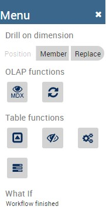
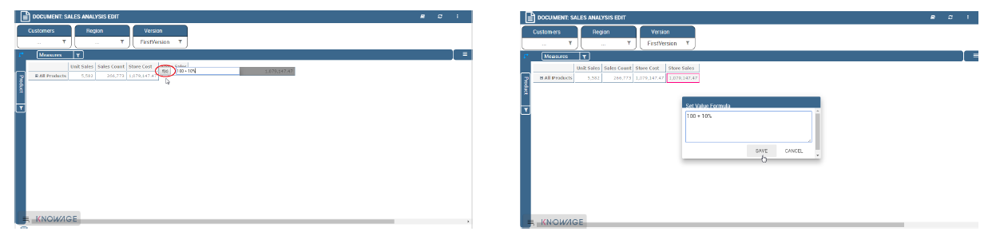
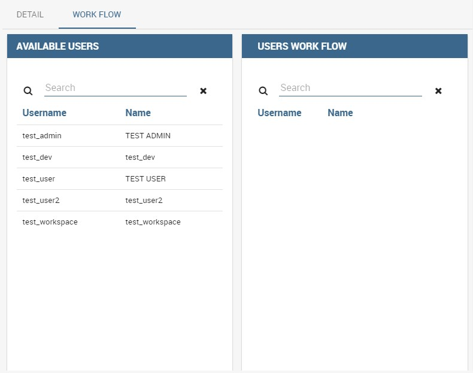
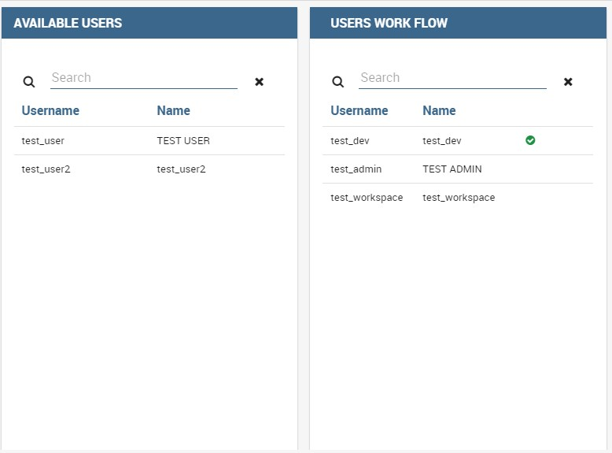

What-if analysis
=================

The **What-if** analysis is the capability to make hypothesis and see how these impacts on the business. In practise user can perform What-if analysis using an extension of the OLAP tool. The process of What-if is composed in three phases:

-  data preparation,
-  workflow definition,
-  hypothesis definition.

We start then focusing on this last phase.

Interface details
-------------------

The workflow has an impact on data visualization. A user can understand the state of the workflow looking at the What-if section of the sidebar. There are three possibilities described in the following.

-  The user can perform the What-if analysis: in this case the What-If section contains the buttons to edit values; see figure below to
   check those buttons.
      
.. figure:: media/image213.png

      What-If buttons inside the sidebar.

-  The schema is locked by another user. In this case a message appears with the name of the active user in the workflow as shown below.

.. figure:: media/image214.png

     The What-If is used by another user.
    
-   The workflow is finished.

      The What-If is finished.

We briefly recall the fuctionality of the main buttons:

-  Unlock model: it changes the state of the workflow in order to move control to next user.
-  Save: it persists modification in the database.
-  Save as new version: it persists modification in the database in a new version.
-  Undo: it undoes last modification.
-  Delete versions: it opens a wizard user can use to delete versions.
-  Output wizard: it allows user to export the edit cube in two different formats, table and csv in the specific.

Meta-language description
---------------------------

We saw that the What-If engine allows the final user to change data values. Here we see how it is possible to modify a cell value through a formula, unconditionally from the aggragation level of the cell. The formula must be written using a particular language called **meta-language** that is described below. Firstly the available arithmetic symbols are: + - :sub:`\*` / ( ) %.

The computation 100 + 10% is a simple example of usage of the operation %. Note that the formula can start with "=", but this is not mandatory.

To activate the editing of a measure cell that is not shown in the OLAP you must first click on the filter icon of the measure filter card and check the target measure. Then select the version you want to use and change values of figure below shows where are available these objects in the interface.

.. figure:: media/image21616.png

    Checking measures and selecting version.

Then double-click on the target measure cell and a box will appear allowing you to insert a formula. Type the computation syntax and click on the *f*\ (*x*) icon to convalidate it or cancel it, as shown below.

    Inserting formula and its convalidation.

We stress that you can also refer to members that are not included in the tuple represented by the cell that is going to be modified. Let’s see some examples. For example suppose the cell refers to the following tuple reported in Code below:

.. code-block:: xml
      :linenos:
      :caption: Product.Deli

         [Measures].[Store Sales], [Product].[Food].[Deli], [Version].[0],   
         [Region].[Mexico Central], [Customers].[All Customers], [Customers].[All Customers]

You can refer to the tuple in the next code with just Product.Eggs and at the same time to the tuple in the second code below with just Product.Eggs; Measures.Unit Sales 

.. _producteggs:
.. code-block:: xml
         :linenos:
         :caption: Product.Eggs
   
            [Measures].[Store Sales], [Product].[Food].[Eggs], [Version].[0],        
            [Region].[Mexico Central], [Customers].[All Customers], [Customers].[All Customers]   

.. code-block:: xml
         :linenos:
         :caption: Product.Eggs; Measures.Unit Sales
   
            [Measures].[Unit Sales], [Product].[Food].[Eggs], [Version].[0],                              
            [Region].[Mexico Central], [Customers].[All Customers], [Customers].[All Customers] 

Note that if you create a formula on a cell and you want to move it along a dimension (for example the cell refers to member Time.2016 and you want to get value for Time.2017) you have to refer to a member of same level. So for example you can get value of the cell for Time.2017, but not for Time.2017.May.

The syntax is as the one shown in Referring to different members or, in case you are using another hierarchy, as in the second code below where you can concatenate different members with ";".

.. code-block:: xml
         :linenos:
         :caption: Referring to different members.
   
            <dimension's name>.<member's name>or[<dimension's name>].[<member's name>]                      

.. _referringdiffmembers:
.. code-block:: xml
         :linenos:
         :caption: Referring to different members of another hierarchy.
   
            <dimension's name>.<hierarchy's name>.<member's name>or[<dimension's name>].[< hierarchy's name>].[<member's name>]  

You can also refer to members that are on the same level but they are not sibling members:
suppose that, for example, the cell’s tuple is as in Code below:

.. code-block:: xml
         :linenos:
         :caption: Example of cell’s tuple.
   
            [Measures].[Store Sales], [Product].[Food].[Deli], [Version].[0],        
            [Region].[Mexico Central], [Customers].[All Customers], [Customers].[All Customers]

Note that you can refer to the tuple

.. code-block:: xml
         :linenos:
         :caption: Example of cell’s tuple.
   
            [Measures].[Store Sales], [Product].[Drink].[Alcoholic Beverages],  
            [Version].[0], [Region].[Mexico Central], [Customers].[All Customers],  
            [Customers].[All Customers]                                                  

just with:

.. code-block:: xml
         :linenos:
         :caption: Shorten syntax code.
   
            [Product].[Drink.Alcoholic Beverages] 

Another example from Code below

.. code-block:: xml
         :linenos:
         :caption: Example of cell’s tuple.
   
          [Measures].[Store Sales], [Product].[Food].[Deli].[Meat],            
          [Version].[0], [Region].[Mexico Central], [Customers].[All Customers],

to Code below

.. code-block:: xml
         :linenos:
         :caption: Example of cell’s tuple.
   
            [Measures].[Store Sales], [Product].[Drink].[Alcoholic Beverages].[Beer and Wine], [Version].[0], 
            [Region].[Mexico Central], [Customers].[AllCustomers], [Customers].[All Customers]                                                                          
is as in the following code

.. code-block:: xml
         :linenos:
         :caption: Used expression.
   
            [Product].[Drink.Alcoholic Beverages.Beer and Wine] 

Note that the last part of the expression is the portion of the path to the target member that differs from the path of the cell’s member. Some other examples:

.. code-block:: xml
         :linenos:
         :caption: Further example.
   
            [Product].[Food]
      
 
What-if analysis implementation
-------------------------------

In this chapter we will deal with some technical fetaures of the What-If analysis that can be handled only by expert users.

Workflow description\*
~~~~~~~~~~~~~~~~~~~~~~

When you perform a what-if analysis the schema is shared in order to be used as a data source. Therefore each time a document linked to a schema can be edited only by one user per time. This behaviour is managed by the Workflow of the schema. The administrator can configure a workflow opening the details of the model in OLAP schema catalogue, selecting the schema and going on the workflow tab available on the top of the right sided area. The tab is red circled below.

.. figure:: media/image220.png

    Workflow tab.

Referring to the next figure, the interface for the definition of the workflow is composed of a double list where

-  the **available users** area contains all the users,
-  the **workflow** area contains the sequence of users for the workflow.

.. _workflowtabinterf:

     Workflow tab interface.

When an administrator clicks on the user in the list “available users” the user will be added in the workflow as shown in Figure 10.3.

Administrator can move the users in the sequence or remove them clicking on the “action buttons”. When the workflow is defined, the administrator can start it clicking on the button start. To start a workflow means to enable the first user of the sequence to apply the what-if on that schema. When a workflow is started it can not be edited by anyone else and an icon appears in the row of actual active user so that the administrators can monitor the state of the schema. An example is provided by Figure 10.4

Schema definition\*
~~~~~~~~~~~~~~~~~~~~~~

As we foresaid, the What-If analysis requires some modification on the database. The first step is to create a new table in the database to store the named version of the modified data. The user will then change the values of the cube; it is then mandatory to create a new table with a structure similar to the analysed cube and a new table (wbversion) that will contain the versioning of the definitions set in the analysis. 

Therefore the structure of the new fact table should contain:

-  all the foreign keys to the dimensions (all the ones visible in the cube),

.. figure:: media/image222.png

       Selecting users for workflows.

       Selecting users for workflows. 

-  all the editable measures,
-  a new numeric column that is a foreign key referencing the version table.

In Figure belowthere is an example where the cube is sales_fact_1998 and the new table is sales_fact_1998_virtual.

.. figure:: media/image224.png

      Cube and new virtual table example.

The sales_fact_1998_virtual table should be initialized with the same data contained in sales_fact_1998 plus 0 as version; the wbversion table should be initialized with one record with wbversion = 0 and a name plus a description for the “original values”.

Changes in the mondrian schema\*
~~~~~~~~~~~~~~~~~~~~~~~~~~~~~~~~~~~~

Now you should map the new tables in the mondrian schema. In order to merge the fact table and the table with the editable measure we create a virtual cube. A virtual cube is a special cube where the values are the result of the join of other cubes. In our case the join keys are the dimensions. The actions to be performed in the mondrian schema are listed right below.

-  To create a new "Version" dimension as inChanging the Mondrian Schema.

.. code-block:: xml 
   :linenos:
   :caption: Changing the Mondrian Schema.
   
       <Dimension name="Version">                                                          
          <Hierarchy hasAll="false" primaryKey="wbversion"  
          defaultMember="[Version ].[0]" >            
          <Table name="wbversion"/>  
          <Level name="Version" column="wbversion" uniqueMembers="true"  
          captionColumn="version_name"/>                              
          </Hierarchy>                                  
       </Dimension>   

-  To create the mapping of the editable cube (in our example the table sales_fact_1998_virtual) as shown in Code Creating the mapping of the editable cube.

.. code-block:: xml 
   :linenos:
   :caption: Creating the mapping of the editable cube.
   
       <Cube name="Sales_Edit">      
          <Table name="sales_fact_1998_virtual"/>                                               
          <DimensionUsage name="Product" source="Product"   
                          foreignKey="product_id" /> 
          <DimensionUsage name="Region" source="Region"   
                          foreignKey="store_id"/>     
          <DimensionUsage name="Customers" source="Customers" foreignKey="customer_id"/>  
          <DimensionUsage name="Version" source="Version"   
          foreignKey="wbversion"/>  
          <Measure name="Store Sales" column="store_sales" aggregator="sum"   
          formatString="#,###.00"/>               
       </Cube>                       

The name of the cube ("Sales_Edit") is the value of the edit Cube attribute of the tag scenario in the template. Note that the name of the dimension Version must be exactly "Version"!!

• To create the virtual cube that will contain the mapping of the columns as in Code below.

.. code-block:: xml 
   :linenos:
   :caption: Creating the virtual cube.
   
       <VirtualCube name="Sales_V"> 
          <CubeUsages> 
             <CubeUsage cubeName="Sales_Edit" ignoreUnrelatedDimensions="true"/>    
             <CubeUsage cubeName="Sales" ignoreUnrelatedDimensions="true"/>   
          </CubeUsages>                                                      

          <VirtualCubeDimension cubeName="Sales" name="Customers"/>  
          <VirtualCubeDimension cubeName="Sales" name="Product"/>  
          <VirtualCubeDimension cubeName="Sales" name="Region"/> 
          <VirtualCubeDimension cubeName="Sales_Edit" name="Customers"/>  
          <VirtualCubeDimension cubeName="Sales_Edit" name="Product"/>       
          <VirtualCubeDimension cubeName="Sales_Edit" name="Region"/>    
          <VirtualCubeDimension cubeName="Sales_Edit" name="Version"/> 
          <VirtualCubeMeasure cubeName="Sales" name="[Measures].[Unit Sales Original]" visible="false"/>    
          <VirtualCubeMeasure cubeName="Sales" name="[Measures].[Sales Count Original]" visible="false"/>
          <VirtualCubeMeasure cubeName="Sales_Edit" name="[Measures].[Store Sales]" visible="true"/> 
          <VirtualCubeMeasure cubeName="Sales_Edit" name="[Measures].[Store Cost]" visible="true"/>    
          
          <CalculatedMember name="Sales Count" dimension="Measures">   
             <Formula>VALIDMEASURE([Measures].[Sales Count Original])</Formula> 
          </CalculatedMember>                                                

          <CalculatedMember name="Unit Sales" dimension="Measures"> 
             <Formula>VALIDMEASURE([Measures].[Unit Sales Original])</Formula>
          </CalculatedMember>                                                            
       </VirtualCube>                                                        

Specifically, in the virtual cube you should specify:

- the list of cubes to be joined (CubeUsages);
- the list of the dimensions of the cube (as you can see it contains all the common dimensions, plus the Version that belongs only to the editable cube);
- the list of the measures. You can perceive that there is a calculated member for the measure Sales Count Original (Sales Count Original is the name of a measure in the Sales cube). This is a trick for the not editable measures. This type of measure lives only in the DWH cube and not in the editable cube. This is due to the fact that the engine doesnt know how to give a value for these measures for the different values of the Version dimension (remember that only the editable cube has the Version dimension). The calculated field solve this problem propagating the same version of the not editable (and versionable) measure for all the version.

Now all the MDX queries can be performed in the virtual cube.
 
