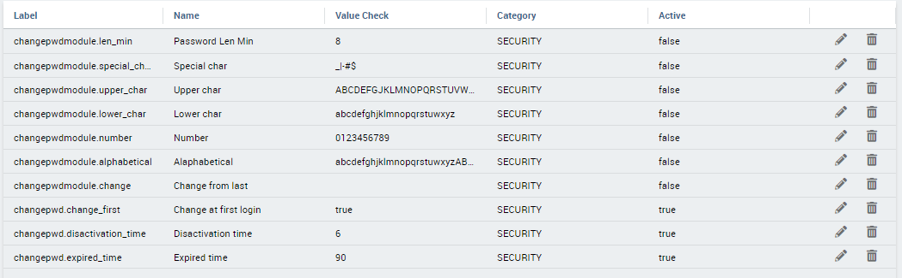
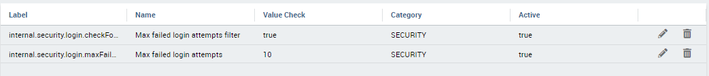

Advanced configuration
==============================

In this chapter we will describe all the advanced configuration parameters of Knowage.

Thread manager
------------------
For Tomcat: the configuration of the pool of thread is available inside the TOMCAT_HOME/conf/server.xml. Refer to Code below.

.. code-block:: xml
        :linenos:
        :caption: Configuration of the pool of thread for Tomcat.

        <Resource auth="Container" factory="de.myfoo.commonj.work.FooWorkManagerFactory"
            maxThreads="5"
            minThreads="1"
            queueLength="10"
            maxDaemons="10"
            name="wm/SpagoWorkManager"
            type="commonj.work.WorkManager"/>

For JBoss: the configuration of the pool of thread is available inside the JBOSS_HOME/ standalone/configuration/s Refer to Code below.

.. code-block:: xml
        :linenos:
        :caption: Configuration of the pool of thread for JBoss.

        <object-factory name="java:global/SpagoWorkManager" module="de.myfoo.commonj"
          class="de.myfoo.commonj.work.MyFooWorkManagerFactory">
          <environment>
          <property name="maxThreads" value="5"/>
          <property name="minThreads" value="1"/>
          <property name="queueLength" value="10"/>
          <property name="maxDaemons" value="10"/>
          </environment>
        </object-factory>

In both cases, the meaning of the configuration parameters is the following:

* minThreads: the minimum number of threads in the thread pool. Default: 2;
* maxThreads: the maximum number of threads in the thread pool. Default: 10;
* queueLenght: the number of work items that can be queued - 0 means no queuing. Default: 10;
* maxDaemons: the maximum number of daemon threads to allow for this work manager. Default: 10.

Cache parameters
------------------
First of all, the user must configure the distributed cache. This helps to coordinate the parallel access to the distributed cache, guaranteeing a thread-safe access. It is necessary to configure the hazelcast.xml file (available in the knowage/WEB-INF/classes/) typing in the ”member“ tag the IP address or hostname of the machine on which Knowage is installed (for example  <member> 192.168.29.43</member>). In case of multi-node configuration, it is obviously important to report all cluster members. This operation must be carried out on every node. Furthermore, it is possible to implement a finer tuning of the cache behaviour, changing the Knowage configuration. The user must edit some values of the SBI_CONFIG table using the specific administrator interface.

* **SPAGOBI.CACHE.NAMEPREFIX**: It configures the prefix of temporary table in the cache ( Default : ”sbicache“ )
* **SPAGOBI.CACHE.SPACE_AVAILABLE**: It resizes cache dimension (bytes) ( Default : 1024 )
* **SPAGOBI.CACHE.LIMIT_FOR_CLEAN**: It configures the maximum cache section (in percentage) that can be cleaned at runtime when the cache has not enough space to store a dataset. ( Default : 50)
* **SPAGOBI.CACHE.SCHEDULING_FULL_CLEAN**: It schedules the recurring operation of complete cleaning of the cache. This periodic cleaning delete all dataset in the cache, without considering further parameters. At the end of the cleaning, the cache is empty. The allowable values are: EVERY_10_MINS, EVERY_15_MINS, EVERY_20_MINS, EVERY_30_MINS, HOURLY,DAILY,WEEKLY,MONTHLY,YEARLY. Any value other than those listed above does not enable periodic cleaning. ( Default: DAILY )
* **SPAGOBI.CACHE.DS_LAST_ACCESS_TTL**: It configures the Time To Live of a dataset inside the cache. This parameter defines the minimum TTL (in seconds) so to guarantee that a dataset remains in cache. A too-high value can lead the cache to breakdown (in this case, there is no way to insert new datasets), while a too low value can lead to situations when there are no certainties of the stability of the dataset in the cache. (Default 600 )
* **SPAGOBI.CACHE.DATABASE_SCHEMA**: Name of the schema on which the tables are created. Such schema is defined by the datasource when it is set as Write-Default. Generally it is not necessary to configure this parameter since it is calculated at runtime. (default <empty> )
* **SPAGOBI.CACHE.LIMIT_FOR_STORE**: It configures the ratio (in percentage) between the dimension of the cache and the maximum dimension of a dataset in the cache. If the dimension of the dataset which the user intends to persist is bigger than the configured percentage, the system blocks the that persistence attempt. ( Default : 10 )
* **SPAGOBI.CACHE.CREATE_AND_PERSIST_TABLE.TIMEOUT**: It represents the maximum time (in seconds) to create temporary table for the dataset. ( Default : 120 )
* **SPAGOBI.WORKMANAGER.SQLDBCACHE.TIMEOUT**: It represents the maximum waiting time (in milliseconds) of an asynchronous work. (Default: 180000 )
* **SPAGOBI.CACHE.HAZELCAST.TIMEOUT** : It represents the maximum time (in seconds) to get a distributed lock. ( Default 120 )
* **SPAGOBI.CACHE.HAZELCAST.LEASETIME**: It represents the maximum time (in seconds) for releasing a distributed lock already got. ( Default :240 )

Logging
---------
Knowage uses the component Log4J to create the log applications. Each web application has its own file inside the folder /knowageXXXX/WEB-INF/classes/log4j.properties. The content of this file change accordingly to the settings: the **appenders** allows to modify the level of the log. As an example, in the following code block, we analyze the log file of Knowage. In the first part we can set the generation mechanism of the log file, while in the second one the level of tracing.

.. _loggappender:
.. code-block:: bash
        :linenos:
        :caption: Log appender.

         log4j.rootLogger=ERROR, SpagoBI

         # SpagoBI Appender
         log4j.appender.SpagoBI=org.apache.log4j.RollingFileAppender
         log4j.appender.SpagoBI.File=${catalina.base}/logs/knowage.log
         log4j.appender.SpagoBI.MaxFileSize=10000KB
         log4j.appender.SpagoBI.MaxBackupIndex=0
         log4j.appender.SpagoBI.layout=org.apache.log4j.PatternLayout
         log4j.appender.SpagoBI.layout.ConversionPattern=[%t] %d{DATE} %5p %c.%M:%L - %m %n

         log4j.appender.SpagoBI.append=false

         log4j.appender.Quartz=org.apache.log4j.RollingFileAppender
         log4j.appender.Quartz.File=${catalina.base}/logs/Quartz.log
         log4j.appender.Quartz.MaxFileSize=10000KB
         log4j.appender.Quartz.MaxBackupIndex=10
         log4j.appender.Quartz.layout=org.apache.log4j.PatternLayout
         log4j.appender.Quartz.layout.ConversionPattern= [%t] %d{DATE} %5p %c.%M:%L - %m  %n

         log4j.appender.SpagoBI_Audit=org.apache.log4j.FileAppender
         log4j.appender.SpagoBI_Audit.File=${catalina.base}/logs/knowage_[1]\_OperatorTrace.log

         log4j.appender.SpagoBI_Audit.layout=org.apache.log4j.PatternLayout
         log4j.appender.SpagoBI_Audit.layout.ConversionPattern=%m%n

         log4j.appender.CONSOLE = org.apache.log4j.ConsoleAppender
         log4j.appender.CONSOLE.layout=org.apache.log4j.PatternLayout
         log4j.appender.CONSOLE.layout.ConversionPattern=%c.%M: %m%n #

         log4j.logger.Spago=ERROR, SpagoBI log4j.additivity.Spago=false

         log4j.logger.it.eng.spagobi=ERROR, SpagoBI, CONSOLE
         log4j.additivity.it.eng.spagobi=false

         log4j.logger.it.eng.spagobi.commons.utilities.messages=ERROR, SpagoBI
         log4j.logger.it.eng.spagobi.commons.utilities.urls.WebUrlBuilder=ERROR,SpagoBI
         log4j.logger.org.quartz=ERROR, Quartz, CONSOLE
         log4j.logger.org.hibernate=ERROR, SpagoBI

         log4j.logger.audit=INFO, SpagoBI_Audit log4j.additivity.audit=false

If the user wishes to enable the tracing of the information to **DEBUG** level it is enough to modify the following line

.. code-block:: bash
        :linenos:

         log4j.logger.it.eng.spagobi=ERROR, SpagoBI, CONSOLE

in

.. code-block:: bash
        :linenos:

        log4j.logger.it.eng.spagobi=DEBUG, SpagoBI, CONSOLE

For further details we refer to the official Log4J documents.

Mail server
------------

Knowage uses in some situations the mail server to send emails. The configuration of this feature can be done right straight through the Knowage GUI, after accessing with administrator credentials.

Selecting the category MAIL the user gets the list of parameters to configure for the following profiles:

* trustedStore;
* scheduler, used by the scheduler to send a report by mail;
* user, used directly by the user when he intends to send a report by mail;
* kpi_alarm, used by the alarm component to send mails.

.. figure:: media/image28.png

   Mail server configuration.

Moreover, each profile has the following values:

* smtphost: the smpt server,
* Smtpport: the port in use,
* from: the address to which the mail will be associated,
* user: the user of the server connection,
* password: user’s password,
* security: the user must choose between NONE, SSL and STARTTLS.

Maximum file size
-----------------

For security reasons, Knowage has a series of parameters which manage the maximum file size that can be loaded on the server through the web GUI. To modify those parameters, it is required to enter the Knowage server application as administrator and access the ”server settings“ section and then ”configuration management“. The parameters at issue are the following:

* **SPAGOBI.TEMPLATE_MAX_SIZE** : TEMPLATE MAX SIZE: it is the maximum template dimension of an analytical document, expressed in bytes; the default value is 5MB;

* **SPAGOBI.DATASET_FILE_MAX_SIZE** : DATASET FILE MAX SIZE: it is the maximum dimension of a file used as a dataset, expressed in bytes; the default value is 10MB;

* **SPAGOBI.DOCUMENTS.MAX_PREVIEW_IMAGE_SIZE** : Max preview image size: it is the maximum dimension of an image used as document preview (in the document browser, for instance), expressed in bytes; the default is 1MB;

*  **IMAGE_GALLERY.MAX_IMAGE_SIZE_KB** : Max image size in Kb: it is the maximum size of the images that can be used in a cockpit creation; the default is 1MB;

Date format
------------

Knowage allows the user to visualize the date time in a format that depends on the selected language. To change the visualization of such formats, the user must enter Knowage as administrator and access the "Server Settings“ section and, consequently, the ”Configuration management“. Then finally select ”\ **DATE-FORMAT**\ “.

.. figure:: media/image29.png

   Date format configuration.

For each available language there are two parameters:

* **SPAGOBI.DATE-FORMAT-<lingua>_<nazione>.format**: it rules the back-end role;

* **SPAGOBI.DATE-FORMAT-<lingua>_<nazione>.extJsFormat**: it rules the front-end role.

We suggest to set the parameters in compliance with each other, according to a local data.

The parameters **SPAGOBI.DATE-FORMAT-SERVER.format** and **SPAGOBI.DATE-FORMAT-SERVER.extJsFormat** control the link between back-end and front-end. The adjustment of these parameters do not affect the web GUI.

Language
---------

Knowage manages the multi-language. The list of all languages is manageable from the "Server Settings” section. Go to "Configuration management“ and select the LANGUAGE_SUPPORTED category. Here there are two properties:

* **SPAGOBI.LANGUAGE_SUPPORTED.LANGUAGES**: the list of all supported languages underneath this formalism are: [it,IT],[en,US],[fr,FR],[es,ES];

* **SPAGOBI.LANGUAGE_SUPPORTED.LANGUAGE.default**: the default value is [en,US].

Password constraints settings
-----------------------------

User password constraints can be set configuring parameters below:

* **changepwdmodule.len_min**: minimum number of character for the password;
* **changepwdmodule.special_char**: set of allowed special characters;
* **changepwdmodule.upper_char**: if active, the password must contain at least one of the uppercase characters set in the value;
* **changepwdmodule.lower_char**: if active, the password must contain at least one of the lowercase characters set in the value;
* **changepwdmodule.number**: if active, the password must contain at least one of the digit set in the value;
* **changepwdmodule.alphabetical**: if active, the password must contain at least one alphabetical set in the value;
* **changepwdmodule.change**: if true, new password must be different from the latest;
* **changepwd.change_first**: if true, password must be changed at first login;
* **changepwd.disactivation_time**: number of months before deactivation;
* **changepwd.expired_time**: number of days for the expiration.

   Advanced configuration - password constraints settings.

By default, all above configurations are disabled.

Login security settings
-----------------------------
Login security configurations can be set filling fields below:

* **internal.security.login.checkForMaxFailedLoginAttempts**: if active and set to true, users will only be able to access Knowage if they have not reached the maximum number of failed login attempts;
* **internal.security.login.maxFailedLoginAttempts**: the maximum number of failed login attempts.

   Advanced configuration - login security settings.

Resource export folder cleaning settings
----------------------------------------
Resource export folder cleaning configurations can be set filling fields below:

* **KNOWAGE.RESOURCE.EXPORT.FOLDER.CLEANING_PERCENTAGE**: if active, the cleaning procedure will delete the files contained in the export resource folder leaving this percentage of free space (0 - 100). Default 30;
* **KNOWAGE.RESOURCE.EXPORT.FOLDER.MAX_FOLDER_SIZE**: if active, cleaning procedure will start only if the resource export folder will reach this size (byte). Default 10737418240.

Import / Export
----------------

Users
~~~~~~~~~~~~
Specific configurations for users import procedure:

* **IMPORTEXPORT.USER.DEFAULT_PASSWORD**: password set for all users imported by the import procedure.

Main Menu
----------------
Specific settings for the main menu can be set updating the fields below:

* **KNOWAGE.DOWNLOAD.POLLING.TIME**: This field defines the number of milliseconds for the download service polling interval. If set to *0* the service will update just once on page load. Default is 10000 (10 seconds).

Changing the secret key for password encryption
-----------------------------------------------

The secret password encryption key must be set during the installation and must **never** be changed. *In case that the secret key is lost* you must create a new one and update database passwords. For this reason Knowage provides you a tool to find out the new encrypted value.

This tool requires:

* knowage-utils-<major.minor.patch>.jar (e.g. knowage-utils-7.3.0.jar) library to be added to the classpath
* the password encryption secret file name with complete path
* password value (plaintext)

Below is an example of invoking the tool using *biadmin* as plaintext password.

.. code-block:: SQL
    :linenos:

    java -cp "TOMCAT_HOME/webapps/knowage/WEB-INF/lib/knowage-utils-<major.minor.patch>.jar" it.eng.spagobi.security.utils.PasswordEncryptionToolMain password/encryption/secret/file/name/with/complete/path biadmin

The output value will be the second argument passed in input encrypted with the key present in the file. This procedure must be repeated for all users.
